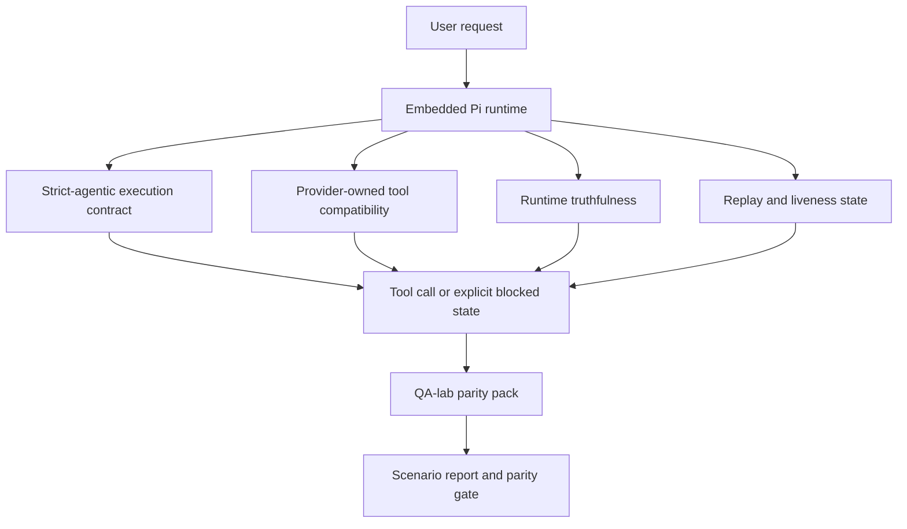
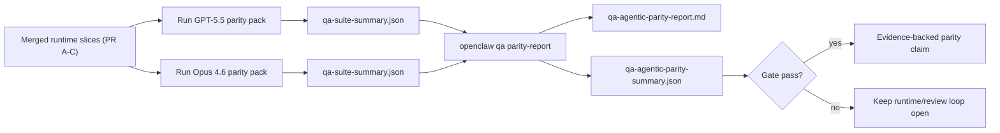

---
read_when:
    - Depurando o comportamento do agente GPT-5.5 ou Codex
    - Comparando o comportamento agentivo do OpenClaw em diferentes modelos de fronteira
    - Revisando as correções de strict-agentic, tool-schema, elevação e replay
summary: Como o OpenClaw fecha lacunas de execução agêntica para GPT-5.5 e modelos no estilo Codex
title: Paridade agêntica entre GPT-5.5 e Codex
x-i18n:
    generated_at: "2026-05-06T05:57:55Z"
    model: gpt-5.5
    provider: openai
    source_hash: bbc32f418dfffe2786093fa6b42b19f92a2d382c9408dfc55dd0154d67959390
    source_path: help/gpt55-codex-agentic-parity.md
    workflow: 16
---

OpenClaw já funcionava bem com modelos de fronteira que usam ferramentas, mas GPT-5.5 e modelos no estilo Codex ainda tinham desempenho inferior em alguns aspectos práticos:

- eles podiam parar depois do planejamento em vez de fazer o trabalho
- eles podiam usar incorretamente schemas estritos de ferramentas OpenAI/Codex
- eles podiam pedir `/elevated full` mesmo quando o acesso total era impossível
- eles podiam perder o estado de tarefas de longa duração durante repetição ou compaction
- alegações de paridade em relação ao Claude Opus 4.6 eram baseadas em anedotas em vez de cenários repetíveis

Este programa de paridade corrige essas lacunas em quatro partes revisáveis.

## O que mudou

### PR A: execução strict-agentic

Esta parte adiciona um contrato de execução `strict-agentic` opcional para execuções GPT-5 incorporadas no Pi.

Quando ativado, OpenClaw deixa de aceitar turnos apenas de planejamento como conclusão "boa o suficiente". Se o modelo apenas diz o que pretende fazer e não usa ferramentas nem faz progresso de fato, OpenClaw tenta novamente com um direcionamento para agir agora e depois falha de forma fechada com um estado bloqueado explícito, em vez de encerrar silenciosamente a tarefa.

Isso melhora mais a experiência com GPT-5.5 em:

- acompanhamentos curtos como "ok, faça"
- tarefas de código em que o primeiro passo é óbvio
- fluxos em que `update_plan` deve ser acompanhamento de progresso em vez de texto de preenchimento

### PR B: veracidade do ambiente de execução

Esta parte faz o OpenClaw dizer a verdade sobre duas coisas:

- por que a chamada do provedor/ambiente de execução falhou
- se `/elevated full` está realmente disponível

Isso significa que GPT-5.5 recebe sinais melhores do ambiente de execução para escopo ausente, falhas de atualização de autenticação, falhas de autenticação HTML 403, problemas de proxy, falhas de DNS ou timeout e modos de acesso total bloqueados. O modelo fica menos propenso a alucinar a correção errada ou continuar pedindo um modo de permissão que o ambiente de execução não pode fornecer.

### PR C: correção de execução

Esta parte melhora dois tipos de correção:

- compatibilidade de schema de ferramentas OpenAI/Codex pertencente ao provedor
- exposição de repetição e vitalidade de tarefas longas

O trabalho de compatibilidade de ferramentas reduz o atrito de schema no registro estrito de ferramentas OpenAI/Codex, especialmente em torno de ferramentas sem parâmetros e expectativas estritas de raiz de objeto. O trabalho de repetição/vitalidade torna tarefas de longa duração mais observáveis, para que estados pausados, bloqueados e abandonados fiquem visíveis em vez de desaparecerem em texto genérico de falha.

### PR D: harness de paridade

Esta parte adiciona o pacote inicial de paridade QA-lab para que GPT-5.5 e Opus 4.6 possam ser exercitados pelos mesmos cenários e comparados usando evidências compartilhadas.

O pacote de paridade é a camada de prova. Ele não altera o comportamento do ambiente de execução por si só.

Depois de ter dois artefatos `qa-suite-summary.json`, gere a comparação de gate de release com:

```bash
pnpm openclaw qa parity-report \
  --repo-root . \
  --candidate-summary .artifacts/qa-e2e/gpt55/qa-suite-summary.json \
  --baseline-summary .artifacts/qa-e2e/opus46/qa-suite-summary.json \
  --output-dir .artifacts/qa-e2e/parity
```

Esse comando grava:

- um relatório Markdown legível por humanos
- um veredito JSON legível por máquina
- um resultado de gate explícito `pass` / `fail`

## Por que isso melhora o GPT-5.5 na prática

Antes deste trabalho, GPT-5.5 no OpenClaw podia parecer menos agentic que o Opus em sessões reais de codificação porque o ambiente de execução tolerava comportamentos especialmente prejudiciais para modelos no estilo GPT-5:

- turnos apenas com comentários
- atrito de schema em torno de ferramentas
- feedback vago de permissão
- quebra silenciosa de repetição ou compaction

O objetivo não é fazer o GPT-5.5 imitar o Opus. O objetivo é dar ao GPT-5.5 um contrato de ambiente de execução que recompense progresso real, forneça semântica mais limpa de ferramentas e permissões e transforme modos de falha em estados explícitos legíveis por máquina e por humanos.

Isso muda a experiência do usuário de:

- "o modelo tinha um bom plano, mas parou"

para:

- "o modelo agiu, ou o OpenClaw expôs o motivo exato pelo qual não conseguiu"

## Antes vs. depois para usuários do GPT-5.5

| Antes deste programa                                                                            | Depois dos PRs A-D                                                                             |
| ---------------------------------------------------------------------------------------------- | ---------------------------------------------------------------------------------------- |
| GPT-5.5 podia parar depois de um plano razoável sem dar o próximo passo com ferramenta                   | O PR A transforma "apenas plano" em "aja agora ou exponha um estado bloqueado"                         |
| Schemas estritos de ferramentas podiam rejeitar ferramentas sem parâmetros ou no formato OpenAI/Codex de maneiras confusas | O PR C torna o registro e a invocação de ferramentas pertencentes ao provedor mais previsíveis              |
| A orientação de `/elevated full` podia ser vaga ou errada em ambientes de execução bloqueados                          | O PR B dá ao GPT-5.5 e ao usuário dicas verdadeiras sobre ambiente de execução e permissões                    |
| Falhas de repetição ou compaction podiam fazer parecer que a tarefa desapareceu silenciosamente                    | O PR C expõe explicitamente resultados pausados, bloqueados, abandonados e inválidos para repetição         |
| "GPT-5.5 parece pior que Opus" era principalmente anedótico                                           | O PR D transforma isso no mesmo pacote de cenários, nas mesmas métricas e em um gate rígido de aprovado/reprovado |

## Arquitetura



## Fluxo de release



## Pacote de cenários

O pacote inicial de paridade atualmente cobre cinco cenários:

### `approval-turn-tool-followthrough`

Verifica que o modelo não para em "vou fazer isso" depois de uma aprovação curta. Ele deve executar a primeira ação concreta no mesmo turno.

### `model-switch-tool-continuity`

Verifica que o trabalho com uso de ferramentas permanece coerente entre limites de troca de modelo/ambiente de execução, em vez de reiniciar em comentários ou perder o contexto de execução.

### `source-docs-discovery-report`

Verifica que o modelo consegue ler código-fonte e documentação, sintetizar descobertas e continuar a tarefa de forma agentic em vez de produzir um resumo raso e parar cedo.

### `image-understanding-attachment`

Verifica que tarefas em modo misto envolvendo anexos permanecem acionáveis e não colapsam em narração vaga.

### `compaction-retry-mutating-tool`

Verifica que uma tarefa com uma escrita mutante real mantém a insegurança de repetição explícita em vez de parecer silenciosamente segura para repetição se a execução passar por compaction, novas tentativas ou perder estado de resposta sob pressão.

## Matriz de cenários

| Cenário                           | O que ele testa                           | Bom comportamento do GPT-5.5                                                          | Sinal de falha                                                                 |
| ---------------------------------- | --------------------------------------- | ------------------------------------------------------------------------------ | ------------------------------------------------------------------------------ |
| `approval-turn-tool-followthrough` | Turnos curtos de aprovação depois de um plano       | Inicia imediatamente a primeira ação concreta com ferramenta em vez de reafirmar a intenção  | acompanhamento apenas de plano, nenhuma atividade de ferramenta ou turno bloqueado sem um bloqueador real  |
| `model-switch-tool-continuity`     | Troca de ambiente de execução/modelo durante uso de ferramentas  | Preserva o contexto da tarefa e continua agindo de forma coerente                         | reinicia em comentários, perde contexto de ferramenta ou para depois da troca              |
| `source-docs-discovery-report`     | Leitura de código-fonte + síntese + ação     | Encontra fontes, usa ferramentas e produz um relatório útil sem travar       | resumo raso, trabalho de ferramenta ausente ou parada de turno incompleto                       |
| `image-understanding-attachment`   | Trabalho agentic orientado por anexos          | Interpreta o anexo, conecta-o a ferramentas e continua a tarefa        | narração vaga, anexo ignorado ou nenhuma próxima ação concreta                |
| `compaction-retry-mutating-tool`   | Trabalho mutante sob pressão de compaction | Executa uma escrita real e mantém a insegurança de repetição explícita depois do efeito colateral | escrita mutante acontece, mas a segurança de repetição fica implícita, ausente ou contraditória |

## Gate de release

GPT-5.5 só pode ser considerado em paridade ou melhor quando o ambiente de execução mesclado passa no pacote de paridade e nas regressões de veracidade do ambiente de execução ao mesmo tempo.

Resultados obrigatórios:

- nenhuma parada apenas em plano quando a próxima ação com ferramenta é clara
- nenhuma conclusão falsa sem execução real
- nenhuma orientação incorreta de `/elevated full`
- nenhum abandono silencioso de repetição ou compaction
- métricas do pacote de paridade pelo menos tão fortes quanto a baseline Opus 4.6 acordada

Para o harness inicial, o gate compara:

- taxa de conclusão
- taxa de parada não intencional
- taxa de chamadas de ferramenta válidas
- contagem de sucesso falso

A evidência de paridade é intencionalmente dividida em duas camadas:

- O PR D prova o comportamento GPT-5.5 vs. Opus 4.6 nos mesmos cenários com QA-lab
- As suítes determinísticas do PR B provam veracidade de autenticação, proxy, DNS e `/elevated full` fora do harness

## Matriz de objetivo para evidência

| Item do gate de conclusão                                     | PR responsável   | Fonte de evidência                                                    | Sinal de aprovação                                                                              |
| -------------------------------------------------------- | ----------- | ------------------------------------------------------------------ | ---------------------------------------------------------------------------------------- |
| GPT-5.5 não trava mais depois do planejamento                  | PR A        | `approval-turn-tool-followthrough` mais suítes de ambiente de execução do PR A        | turnos de aprovação acionam trabalho real ou um estado bloqueado explícito                            |
| GPT-5.5 não finge mais progresso ou conclusão falsa de ferramenta | PR A + PR D | resultados de cenários do relatório de paridade e contagem de sucesso falso             | nenhum resultado de aprovação suspeito e nenhuma conclusão apenas com comentários                             |
| GPT-5.5 não dá mais orientação falsa de `/elevated full`  | PR B        | suítes determinísticas de veracidade                                  | motivos de bloqueio e dicas de acesso total permanecem precisos em relação ao ambiente de execução                              |
| Falhas de repetição/vitalidade permanecem explícitas                   | PR C + PR D | suítes de ciclo de vida/repetição do PR C mais `compaction-retry-mutating-tool` | trabalho mutante mantém a insegurança de repetição explícita em vez de desaparecer silenciosamente            |
| GPT-5.5 iguala ou supera Opus 4.6 nas métricas acordadas  | PR D        | `qa-agentic-parity-report.md` e `qa-agentic-parity-summary.json` | mesma cobertura de cenários e nenhuma regressão em conclusão, comportamento de parada ou uso válido de ferramentas |

## Como ler o veredito de paridade

Use o veredito em `qa-agentic-parity-summary.json` como a decisão final legível por máquina para o pacote inicial de paridade.

- `pass` significa que o GPT-5.5 cobriu os mesmos cenários que o Opus 4.6 e não regrediu nas métricas agregadas acordadas.
- `fail` significa que pelo menos um bloqueio obrigatório foi acionado: conclusão mais fraca, mais interrupções indevidas, uso válido de ferramenta mais fraco, qualquer caso de sucesso falso ou cobertura de cenário incompatível.
- "problema de CI compartilhado/base" não é, por si só, um resultado de paridade. Se ruído de CI fora do PR D bloquear uma execução, o veredito deve aguardar uma execução limpa do ambiente de execução mesclado, em vez de ser inferido a partir de logs da época da branch.
- Autenticação, proxy, DNS e veracidade de `/elevated full` ainda vêm das suítes determinísticas do PR B, portanto a declaração final de lançamento precisa de ambos: um veredito de paridade aprovado no PR D e cobertura de veracidade verde no PR B.

## Quem deve habilitar `strict-agentic`

Use `strict-agentic` quando:

- espera-se que o agente atue imediatamente quando a próxima etapa for óbvia
- modelos GPT-5.5 ou da família Codex forem o ambiente de execução principal
- você prefere estados bloqueados explícitos em vez de respostas "úteis" apenas recapitulativas

Mantenha o contrato padrão quando:

- você quiser o comportamento mais flexível existente
- você não estiver usando modelos da família GPT-5
- você estiver testando prompts em vez de imposição em tempo de execução

## Relacionado

- [Notas do mantenedor sobre paridade GPT-5.5 / Codex](/pt-BR/help/gpt55-codex-agentic-parity-maintainers)
