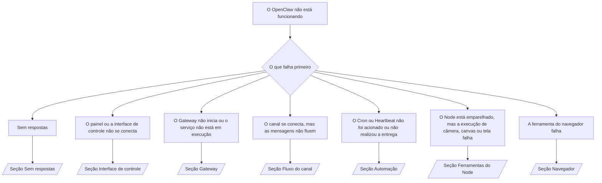

---
read_when:
    - O OpenClaw não está funcionando e você precisa do caminho mais rápido para uma solução
    - Você quer um fluxo de triagem antes de se aprofundar em guias operacionais detalhados
summary: Central de solução de problemas do OpenClaw orientada primeiro pelos sintomas
title: Solução de problemas gerais
x-i18n:
    generated_at: "2026-07-12T15:19:11Z"
    model: gpt-5.6
    postprocess_version: locale-links-v1
    prompt_version: 15
    provider: openai
    source_hash: db50e0cdf4d11f3aa6196be445358d904a2b9c40c89243f1b124c77167f6dd85
    source_path: help/troubleshooting.md
    workflow: 16
---

Porta de entrada da triagem. 2 minutos até um diagnóstico e, depois, vá para a página detalhada.

## Primeiros 60 segundos

Execute esta sequência na ordem:

```bash
openclaw status
openclaw status --all
openclaw gateway probe
openclaw gateway status
openclaw doctor
openclaw channels status --probe
openclaw logs --follow
```

Saída esperada, uma linha para cada item:

- `openclaw status` mostra os canais configurados, sem erros de autenticação.
- `openclaw status --all` produz um relatório completo e compartilhável.
- `openclaw gateway probe` mostra `Reachable: yes`. `Capability: ...` é o
  nível de autenticação comprovado pela sondagem; `Read probe: limited - missing scope:
operator.read` indica diagnóstico degradado, não uma falha de conexão.
- `openclaw gateway status` mostra `Runtime: running`, `Connectivity probe:
ok` e uma `Capability: ...` plausível. Adicione `--require-rpc` para também exigir
  comprovação de RPC com escopo de leitura.
- `openclaw doctor` não relata erros impeditivos de configuração ou serviço.
- `openclaw channels status --probe` retorna o estado ativo do transporte por conta
  (`works` / `audit ok`) quando o Gateway está acessível; quando não está,
  recorre a resumos baseados apenas na configuração.
- `openclaw logs --follow` mostra atividade contínua, sem erros fatais recorrentes.

## O assistente parece limitado ou sem ferramentas

Verifique o perfil de ferramentas efetivo:

```bash
openclaw status
openclaw status --all
openclaw doctor
```

Causas comuns:

- `tools.profile: "minimal"` permite apenas `session_status`.
- `tools.profile: "messaging"` é restrito, para agentes voltados somente a conversas.
- `tools.profile: "coding"` é o padrão para novas configurações locais (trabalho com repositório, arquivos,
  shell e runtime).
- `tools.profile: "full"` remove as restrições do perfil; limite-o a agentes confiáveis
  controlados pelo operador.
- `agents.list[].tools` por agente substitui o perfil raiz, restringindo-o ou ampliando-o
  para um agente.

Altere o perfil, reinicie ou recarregue o Gateway e verifique novamente com
`openclaw status --all`. Tabela completa de perfis/grupos: [Perfis de ferramentas](/pt-BR/gateway/config-tools#tool-profiles).

## Erro 429 de contexto longo da Anthropic

`HTTP 429: rate_limit_error: Extra usage is required for long context requests`
→ [Erro 429 da Anthropic: uso adicional necessário para contexto longo](/pt-BR/gateway/troubleshooting#anthropic-429-extra-usage-required-for-long-context).

## O backend local compatível com OpenAI funciona diretamente, mas falha no OpenClaw

Seu backend `/v1` local/auto-hospedado responde a sondagens diretas de `/v1/chat/completions`,
mas falha em `openclaw infer model run` ou em interações normais do agente:

1. Se o erro mencionar que `messages[].content` espera uma string: defina
   `models.providers.<provider>.models[].compat.requiresStringContent: true`.
2. Se ainda falhar somente nas interações do agente do OpenClaw: defina
   `models.providers.<provider>.models[].compat.supportsTools: false` e tente novamente.
3. Se chamadas diretas pequenas funcionarem, mas prompts maiores do OpenClaw causarem falha no backend:
   isso é um limite do modelo/servidor upstream, não um bug do OpenClaw. Continue em
   [O backend local compatível com OpenAI passa nas sondagens diretas, mas as execuções do agente falham](/pt-BR/gateway/troubleshooting#local-openai-compatible-backend-passes-direct-probes-but-agent-runs-fail).

## A instalação do Plugin falha por ausência de extensões do openclaw

`package.json missing openclaw.extensions` significa que o pacote do Plugin usa um
formato que o OpenClaw não aceita mais.

Corrija no pacote do Plugin:

1. Adicione `openclaw.extensions` ao `package.json`, apontando para os arquivos compilados do runtime
   (geralmente `./dist/index.js`).
2. Publique novamente e execute `openclaw plugins install <package>` outra vez.

```json
{
  "name": "@openclaw/my-plugin",
  "version": "1.2.3",
  "openclaw": {
    "extensions": ["./dist/index.js"]
  }
}
```

Referência: [Arquitetura de Plugins](/pt-BR/plugins/architecture)

## A política de instalação bloqueia instalações ou atualizações de Plugins

A atualização termina, mas os Plugins ficam desatualizados, desativados ou mostram `blocked by install
policy`, `install policy failed closed` ou `Disabled "<plugin>" after plugin
update failure`: verifique `security.installPolicy`.

A política de instalação é executada nas instalações e atualizações de Plugins. As versões dos Plugins
`@openclaw/*` normalmente avançam junto com a versão do OpenClaw; portanto, uma atualização do OpenClaw pode
exigir uma atualização correspondente dos Plugins durante a sincronização pós-atualização.

Evite estes formatos de política, a menos que também mantenha a regra de atualização correspondente:

- Congelar Plugins pertencentes ao OpenClaw em uma única versão antiga exata (por exemplo, apenas
  `@openclaw/*@2026.5.3`).
- Bloquear somente pelo tipo de origem (todas as solicitações npm, de rede ou `request.mode:
"update"`).
- Tratar o comando da política como opcional: quando `security.installPolicy` está
  habilitada, um executável de política ausente, lento, ilegível ou bloqueado por permissões
  falha em modo fechado.
- Aprovar versões sem comparar o `openclawVersion` da solicitação com
  os metadados do Plugin candidato.

Prefira regras que permitam atualizações confiáveis de `@openclaw/*` compatíveis com o
host atual, em vez de fixar uma versão para sempre. Se você bloqueia npm por
padrão, adicione uma exceção restrita para os IDs de Plugin usados e aplique a mesma
regra de confiança a `request.mode: "update"` e às instalações.

Recuperação:

```bash
openclaw doctor --deep
openclaw plugins update --all
openclaw status --all
```

Se a política for intencionalmente rígida, flexibilize-a durante a janela de atualização
confiável, execute `openclaw plugins update --all` novamente e restaure a regra mais rígida.
Se a falha de atualização desativou um Plugin, inspecione-o antes de reativá-lo:

```bash
openclaw plugins inspect <plugin-id> --runtime --json
openclaw plugins enable <plugin-id>
```

Referência: [Política de instalação do operador](/pt-BR/tools/skills-config#operator-install-policy-securityinstallpolicy)

## O Plugin está presente, mas foi bloqueado por propriedade suspeita

Os avisos de `openclaw doctor`, configuração ou inicialização mostram:

```text
candidato a Plugin bloqueado: propriedade suspeita (... uid=1000, uid esperado=0 ou root)
Plugin presente, mas bloqueado
```

Os arquivos do Plugin pertencem a um usuário Unix diferente daquele do processo que os carrega.
Não remova a configuração do Plugin; corrija a propriedade dos arquivos ou execute o
OpenClaw como o usuário proprietário do diretório de estado.

As instalações no Docker são executadas como `node` (uid `1000`). Corrija as montagens vinculadas do host:

```bash
sudo chown -R 1000:1000 /path/to/openclaw-config /path/to/openclaw-workspace
openclaw doctor --fix
```

Se você executa intencionalmente o OpenClaw como root, corrija a raiz gerenciada dos Plugins:

```bash
sudo chown -R root:root /path/to/openclaw-config/npm
openclaw doctor --fix
```

Documentação detalhada: [Propriedade bloqueada do caminho do Plugin](/pt-BR/tools/plugin#blocked-plugin-path-ownership), [Docker: permissões e EACCES](/pt-BR/install/docker#shell-helpers-optional)

## Árvore de decisão



<AccordionGroup>
  <Accordion title="Sem respostas">
    ```bash
    openclaw status
    openclaw gateway status
    openclaw channels status --probe
    openclaw pairing list --channel <channel> [--account <id>]
    openclaw logs --follow
    ```

    Saída esperada:

    - `Runtime: running`
    - `Connectivity probe: ok`
    - `Capability: read-only`, `write-capable` ou `admin-capable`
    - O canal mostra o transporte conectado e, quando houver suporte, `works` ou
      `audit ok` em `channels status --probe`
    - O remetente está aprovado (ou a política de mensagens diretas está aberta/usa uma lista de permissões)

    Assinaturas de log:

    - `drop guild message (mention required` → o controle de menções do Discord bloqueou a mensagem.
    - `pairing request` → remetente não aprovado, aguardando aprovação do emparelhamento por mensagem direta.
    - `blocked` / `allowlist` nos logs do canal → remetente, sala ou grupo filtrado.

    Páginas detalhadas: [Sem respostas](/pt-BR/gateway/troubleshooting#no-replies), [Solução de problemas de canais](/pt-BR/channels/troubleshooting), [Emparelhamento](/pt-BR/channels/pairing)

  </Accordion>

  <Accordion title="O painel ou a interface de controle não se conecta">
    ```bash
    openclaw status
    openclaw gateway status
    openclaw logs --follow
    openclaw doctor
    openclaw channels status --probe
    ```

    Saída esperada:

    - `Dashboard: http://...` exibido em `openclaw gateway status`
    - `Connectivity probe: ok`
    - `Capability: read-only`, `write-capable` ou `admin-capable`
    - Nenhum loop de autenticação nos logs

    Assinaturas de log:

    - `device identity required` → o contexto HTTP/não seguro não consegue concluir a autenticação do dispositivo.
    - `origin not allowed` → a `Origin` do navegador não é permitida para o destino do Gateway da interface de controle.
    - `AUTH_TOKEN_MISMATCH` com `canRetryWithDeviceToken=true` → uma nova tentativa com token de dispositivo confiável pode ocorrer automaticamente, reutilizando os escopos armazenados em cache do token emparelhado.
    - `unauthorized` repetido após essa tentativa → token/senha incorreto, incompatibilidade no modo de autenticação ou token obsoleto do dispositivo emparelhado.
    - `too many failed authentication attempts (retry later)` → falhas repetidas originadas dessa `Origin` do navegador ficam temporariamente bloqueadas; outras origens localhost usam grupos separados. Consulte [Conectividade do painel/interface de controle](/pt-BR/gateway/troubleshooting#dashboard-control-ui-connectivity) para saber a particularidade das novas tentativas simultâneas do Tailscale Serve.
    - `gateway connect failed:` → a interface aponta para a URL/porta incorreta ou o Gateway está inacessível.

    Páginas detalhadas: [Conectividade do painel/interface de controle](/pt-BR/gateway/troubleshooting#dashboard-control-ui-connectivity), [Interface de controle](/pt-BR/web/control-ui), [Autenticação](/pt-BR/gateway/authentication)

  </Accordion>

  <Accordion title="O Gateway não inicia ou o serviço está instalado, mas não está em execução">
    ```bash
    openclaw status
    openclaw gateway status
    openclaw logs --follow
    openclaw doctor
    openclaw channels status --probe
    ```

    Saída esperada:

    - `Service: ... (loaded)`
    - `Runtime: running`
    - `Connectivity probe: ok`
    - `Capability: read-only`, `write-capable` ou `admin-capable`

    Assinaturas de log:

    - `Gateway start blocked: set gateway.mode=local` ou `existing config is missing gateway.mode` → o modo do Gateway é remoto ou falta à configuração a marcação de modo local e ela precisa ser corrigida.
    - `refusing to bind gateway ... without auth` → vinculação fora de loopback sem um caminho de autenticação válido (token/senha ou proxy confiável, quando configurado).
    - `another gateway instance is already listening` ou `EADDRINUSE` → a porta já está ocupada.

    Páginas detalhadas: [Serviço do Gateway não está em execução](/pt-BR/gateway/troubleshooting#gateway-service-not-running), [Processo em segundo plano](/pt-BR/gateway/background-process), [Configuração](/pt-BR/gateway/configuration)

  </Accordion>

  <Accordion title="O canal se conecta, mas as mensagens não fluem">
    ```bash
    openclaw status
    openclaw gateway status
    openclaw logs --follow
    openclaw doctor
    openclaw channels status --probe
    ```

    Saída esperada:

    - Transporte do canal conectado.
    - As verificações de emparelhamento/lista de permissões são aprovadas.
    - As menções são detectadas quando exigidas.

    Assinaturas de log:

    - `mention required` → o controle de menções do grupo bloqueou o processamento.
    - `pairing` / `pending` → o remetente da mensagem direta ainda não foi aprovado.
    - `not_in_channel`, `missing_scope`, `Forbidden`, `401/403` → problema no token de permissão do canal.

    Páginas detalhadas: [Canal conectado, mas as mensagens não fluem](/pt-BR/gateway/troubleshooting#channel-connected-messages-not-flowing), [Solução de problemas de canais](/pt-BR/channels/troubleshooting)

  </Accordion>

  <Accordion title="O Cron ou Heartbeat não foi acionado ou não realizou a entrega">
    ```bash
    openclaw status
    openclaw gateway status
    openclaw cron status
    openclaw cron list
    openclaw cron runs --id <jobId> --limit 20
    openclaw logs --follow
    ```

    Saída esperada:

    - `cron status` mostra o agendador habilitado com o próximo despertar.
    - `cron runs` mostra entradas `ok` recentes.
    - O Heartbeat está habilitado e dentro do horário ativo.

    Assinaturas de log:

    - `cron: scheduler disabled; jobs will not run automatically` → o cron está desativado.
    - `heartbeat skipped` motivo `quiet-hours` → fora do horário ativo configurado.
    - `heartbeat skipped` motivo `empty-heartbeat-file` → `HEARTBEAT.md` existe, mas contém apenas estruturas vazias, como linhas em branco, comentários, cabeçalhos, cercas ou listas de verificação vazias.
    - `heartbeat skipped` motivo `no-tasks-due` → o modo de tarefas está ativo, mas ainda não chegou o intervalo de nenhuma tarefa.
    - `heartbeat skipped` motivo `alerts-disabled` → `showOk`, `showAlerts` e `useIndicator` estão todos desativados.
    - `requests-in-flight` → fluxo principal ocupado; ativação do heartbeat adiada.
    - `unknown accountId` → a conta de destino da entrega do heartbeat não existe.

    Páginas detalhadas: [Entrega de Cron e heartbeat](/pt-BR/gateway/troubleshooting#cron-and-heartbeat-delivery), [Tarefas agendadas: solução de problemas](/pt-BR/automation/cron-jobs#troubleshooting), [Heartbeat](/pt-BR/gateway/heartbeat)

  </Accordion>

  <Accordion title="O Node está pareado, mas a ferramenta falha com câmera, canvas, tela ou exec">
    ```bash
    openclaw status
    openclaw gateway status
    openclaw nodes status
    openclaw nodes describe --node <idOrNameOrIp>
    openclaw logs --follow
    ```

    Saída esperada:

    - Node listado como conectado e pareado para a função `node`.
    - O recurso necessário para o comando que você está invocando existe.
    - A permissão da ferramenta está concedida.

    Assinaturas de log:

    - `NODE_BACKGROUND_UNAVAILABLE` → traga o aplicativo do Node para o primeiro plano.
    - `*_PERMISSION_REQUIRED` → permissão do sistema operacional negada ou ausente.
    - `SYSTEM_RUN_DENIED: approval required` → a aprovação de exec está pendente.
    - `SYSTEM_RUN_DENIED: allowlist miss` → o comando não está na lista de permissões de exec.

    Páginas detalhadas: [Node pareado, mas a ferramenta falha](/pt-BR/gateway/troubleshooting#node-paired-tool-fails), [Solução de problemas do Node](/pt-BR/nodes/troubleshooting), [Aprovações de exec](/pt-BR/tools/exec-approvals)

  </Accordion>

  <Accordion title="Exec começa a solicitar aprovação repentinamente">
    ```bash
    openclaw config get tools.exec.host
    openclaw config get tools.exec.security
    openclaw config get tools.exec.ask
    openclaw gateway restart
    ```

    O que mudou:

    - Quando `tools.exec.host` não está definido, o padrão é `auto`, que resulta em `sandbox`
      quando um runtime de sandbox está ativo e em `gateway` nos demais casos.
    - `host=auto` apenas define o roteamento; o comportamento sem solicitação vem de
      `security=full` junto com `ask=off` no gateway/node.
    - Quando `tools.exec.security` não está definido, o padrão é `full` em `gateway`/`node`.
    - Quando `tools.exec.ask` não está definido, o padrão é `off`.
    - Se você está vendo solicitações de aprovação, alguma política local do host ou específica da sessão
      restringiu o exec em relação a esses padrões.

    Restaure os padrões atuais sem aprovação:

    ```bash
    openclaw config set tools.exec.host gateway
    openclaw config set tools.exec.security full
    openclaw config set tools.exec.ask off
    openclaw gateway restart
    ```

    Alternativas mais seguras:

    - Defina apenas `tools.exec.host=gateway` para manter um roteamento estável do host.
    - Use `security=allowlist` com `ask=on-miss` para executar no host com revisão quando
      o comando não estiver na lista de permissões.
    - Ative o modo sandbox para que `host=auto` volte a resultar em `sandbox`.

    Assinaturas de log:

    - `Approval required.` → o comando está aguardando `/approve ...`.
    - `SYSTEM_RUN_DENIED: approval required` → a aprovação de exec no host do Node está pendente.
    - `exec host=sandbox requires a sandbox runtime for this session` → seleção implícita ou explícita de sandbox, mas o modo sandbox está desativado.

    Páginas detalhadas: [Exec](/pt-BR/tools/exec), [Aprovações de exec](/pt-BR/tools/exec-approvals), [Segurança: o que a auditoria verifica](/pt-BR/gateway/security#what-the-audit-checks-high-level)

  </Accordion>

  <Accordion title="A ferramenta de navegador falha">
    ```bash
    openclaw status
    openclaw gateway status
    openclaw browser status
    openclaw logs --follow
    openclaw doctor
    ```

    Saída esperada:

    - O status do navegador mostra `running: true` e um navegador/perfil selecionado.
    - O perfil `openclaw` inicia, ou o perfil `user` encontra abas locais do Chrome.

    Assinaturas de log:

    - `unknown command "browser"` → `plugins.allow` está definido e não inclui `browser`.
    - `Failed to start Chrome CDP on port` → falha ao iniciar o navegador local.
    - `browser.executablePath not found` → o caminho configurado para o binário está incorreto.
    - `browser.cdpUrl must be http(s) or ws(s)` → a URL de CDP configurada usa um esquema incompatível.
    - `browser.cdpUrl has invalid port` → a URL de CDP configurada contém uma porta inválida ou fora do intervalo.
    - `No Chrome tabs found for profile="user"` → o perfil de anexação MCP do Chrome não tem nenhuma aba local do Chrome aberta.
    - `Remote CDP for profile "<name>" is not reachable` → o endpoint remoto de CDP configurado não está acessível a partir deste host.
    - `Browser attachOnly is enabled ... not reachable` → o perfil somente de anexação não possui um destino CDP ativo.
    - Substituições obsoletas de viewport/modo escuro/localidade/modo offline em perfis somente de anexação ou de CDP remoto → execute `openclaw browser stop --browser-profile <name>` para encerrar a sessão de controle e liberar o estado de emulação sem reiniciar o gateway.

    Páginas detalhadas: [Falha na ferramenta de navegador](/pt-BR/gateway/troubleshooting#browser-tool-fails), [Comando ou ferramenta de navegador ausente](/pt-BR/tools/browser#missing-browser-command-or-tool), [Navegador: solução de problemas no Linux](/pt-BR/tools/browser-linux-troubleshooting), [Navegador: solução de problemas de CDP remoto no WSL2/Windows](/pt-BR/tools/browser-wsl2-windows-remote-cdp-troubleshooting)

  </Accordion>

</AccordionGroup>

## Relacionados

- [Perguntas frequentes](/pt-BR/help/faq) — perguntas frequentes
- [Solução de problemas do Gateway](/pt-BR/gateway/troubleshooting) — problemas específicos do Gateway
- [Doctor](/pt-BR/gateway/doctor) — verificações e reparos automatizados de integridade
- [Solução de problemas de canais](/pt-BR/channels/troubleshooting) — problemas de conectividade dos canais
- [Tarefas agendadas: solução de problemas](/pt-BR/automation/cron-jobs#troubleshooting) — problemas de cron e heartbeat
