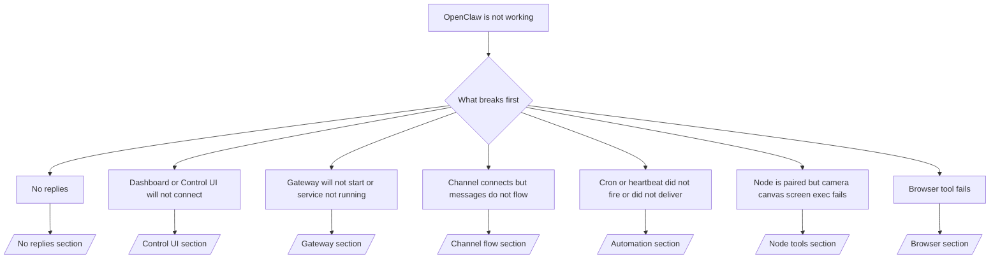

---
read_when:
    - OpenClaw não está funcionando e você precisa do caminho mais rápido para uma correção
    - Você quer um fluxo de triagem antes de se aprofundar em guias operacionais detalhados
summary: Central de solução de problemas orientada por sintomas do OpenClaw
title: Solução geral de problemas
x-i18n:
    generated_at: "2026-05-06T05:58:56Z"
    model: gpt-5.5
    provider: openai
    source_hash: 624fa34cda3b440fa9cc636beb3fe6e3608a77a332933fa593097ebc556ac745
    source_path: help/troubleshooting.md
    workflow: 16
---

Se você tem apenas 2 minutos, use esta página como ponto de entrada para triagem.

## Primeiros 60 segundos

Execute esta sequência exata em ordem:

```bash
openclaw status
openclaw status --all
openclaw gateway probe
openclaw gateway status
openclaw doctor
openclaw channels status --probe
openclaw logs --follow
```

Boa saída em uma linha:

- `openclaw status` → mostra os canais configurados e nenhum erro óbvio de autenticação.
- `openclaw status --all` → o relatório completo está presente e pode ser compartilhado.
- `openclaw gateway probe` → o alvo de Gateway esperado está acessível (`Reachable: yes`). `Capability: ...` informa qual nível de autenticação a sonda conseguiu comprovar, e `Read probe: limited - missing scope: operator.read` é diagnóstico degradado, não uma falha de conexão.
- `openclaw gateway status` → `Runtime: running`, `Connectivity probe: ok` e uma linha `Capability: ...` plausível. Use `--require-rpc` se você também precisar de prova RPC com escopo de leitura.
- `openclaw doctor` → nenhum erro bloqueante de configuração/serviço.
- `openclaw channels status --probe` → um Gateway acessível retorna o estado de transporte ao vivo por conta
  mais resultados de sonda/auditoria, como `works` ou `audit ok`; se o
  Gateway estiver inacessível, o comando recorre a resumos baseados apenas na configuração.
- `openclaw logs --follow` → atividade estável, sem erros fatais repetidos.

## Anthropic contexto longo 429

Se você vir:
`HTTP 429: rate_limit_error: Extra usage is required for long context requests`,
acesse [/gateway/troubleshooting#anthropic-429-extra-usage-required-for-long-context](/pt-BR/gateway/troubleshooting#anthropic-429-extra-usage-required-for-long-context).

## Backend local compatível com OpenAI funciona diretamente, mas falha no OpenClaw

Se o seu backend local ou auto-hospedado `/v1` responde a pequenas sondas diretas
`/v1/chat/completions`, mas falha em `openclaw infer model run` ou em rodadas normais
do agente:

1. Se o erro mencionar que `messages[].content` espera uma string, defina
   `models.providers.<provider>.models[].compat.requiresStringContent: true`.
2. Se o backend ainda falhar apenas em rodadas do agente OpenClaw, defina
   `models.providers.<provider>.models[].compat.supportsTools: false` e tente novamente.
3. Se chamadas diretas mínimas ainda funcionarem, mas prompts maiores do OpenClaw travarem o
   backend, trate o problema restante como uma limitação do modelo/servidor upstream e
   continue no runbook detalhado:
   [/gateway/troubleshooting#local-openai-compatible-backend-passes-direct-probes-but-agent-runs-fail](/pt-BR/gateway/troubleshooting#local-openai-compatible-backend-passes-direct-probes-but-agent-runs-fail)

## Instalação de Plugin falha com extensões openclaw ausentes

Se a instalação falhar com `package.json missing openclaw.extensions`, o pacote do Plugin
está usando um formato antigo que o OpenClaw não aceita mais.

Corrija no pacote do Plugin:

1. Adicione `openclaw.extensions` ao `package.json`.
2. Aponte as entradas para arquivos de runtime compilados (geralmente `./dist/index.js`).
3. Republique o Plugin e execute `openclaw plugins install <package>` novamente.

Exemplo:

```json
{
  "name": "@openclaw/my-plugin",
  "version": "1.2.3",
  "openclaw": {
    "extensions": ["./dist/index.js"]
  }
}
```

Referência: [Arquitetura de Plugin](/pt-BR/plugins/architecture)

## Plugin presente, mas bloqueado por propriedade suspeita

Se `openclaw doctor`, a configuração inicial ou avisos de inicialização mostrarem:

```text
blocked plugin candidate: suspicious ownership (... uid=1000, expected uid=0 or root)
plugin present but blocked
```

os arquivos do Plugin pertencem a um usuário Unix diferente do processo que os carrega.
Não remova a configuração do Plugin. Corrija a propriedade dos arquivos ou execute o OpenClaw como
o mesmo usuário que possui o diretório de estado.

Instalações Docker normalmente rodam como `node` (uid `1000`). Para a configuração Docker
padrão, repare as montagens bind do host:

```bash
sudo chown -R 1000:1000 /path/to/openclaw-config /path/to/openclaw-workspace
openclaw doctor --fix
```

Se você executa intencionalmente o OpenClaw como root, repare a raiz gerenciada do Plugin para
propriedade de root:

```bash
sudo chown -R root:root /path/to/openclaw-config/npm
openclaw doctor --fix
```

Documentação mais detalhada:

- [Propriedade de caminho de Plugin](/pt-BR/tools/plugin#blocked-plugin-path-ownership)
- [Permissões Docker](/pt-BR/install/docker#permissions-and-eacces)

## Árvore de decisão



<AccordionGroup>
  <Accordion title="Sem respostas">
    ```bash
    openclaw status
    openclaw gateway status
    openclaw channels status --probe
    openclaw pairing list --channel <channel> [--account <id>]
    openclaw logs --follow
    ```

    Uma boa saída se parece com:

    - `Runtime: running`
    - `Connectivity probe: ok`
    - `Capability: read-only`, `write-capable` ou `admin-capable`
    - Seu canal mostra o transporte conectado e, quando houver suporte, `works` ou `audit ok` em `channels status --probe`
    - O remetente aparece como aprovado (ou a política de DM está aberta/lista de permissões)

    Assinaturas comuns nos logs:

    - `drop guild message (mention required` → o bloqueio por menção impediu a mensagem no Discord.
    - `pairing request` → o remetente não está aprovado e aguarda aprovação de pareamento por DM.
    - `blocked` / `allowlist` nos logs do canal → o remetente, sala ou grupo está filtrado.

    Páginas detalhadas:

    - [/gateway/troubleshooting#no-replies](/pt-BR/gateway/troubleshooting#no-replies)
    - [/channels/troubleshooting](/pt-BR/channels/troubleshooting)
    - [/channels/pairing](/pt-BR/channels/pairing)

  </Accordion>

  <Accordion title="O Painel ou a Interface de Controle não conecta">
    ```bash
    openclaw status
    openclaw gateway status
    openclaw logs --follow
    openclaw doctor
    openclaw channels status --probe
    ```

    Uma boa saída se parece com:

    - `Dashboard: http://...` é mostrado em `openclaw gateway status`
    - `Connectivity probe: ok`
    - `Capability: read-only`, `write-capable` ou `admin-capable`
    - Nenhum loop de autenticação nos logs

    Assinaturas comuns nos logs:

    - `device identity required` → o contexto HTTP/não seguro não consegue concluir a autenticação do dispositivo.
    - `origin not allowed` → o `Origin` do navegador não é permitido para o alvo de Gateway da Interface de Controle.
    - `AUTH_TOKEN_MISMATCH` com dicas de nova tentativa (`canRetryWithDeviceToken=true`) → uma nova tentativa confiável com token de dispositivo pode ocorrer automaticamente.
    - Essa nova tentativa com token em cache reutiliza o conjunto de escopos em cache armazenado com o token de dispositivo pareado. Chamadores com `deviceToken` explícito / `scopes` explícitos mantêm
      o conjunto de escopos solicitado.
    - No caminho assíncrono da Interface de Controle via Tailscale Serve, tentativas com falha para o mesmo
      `{scope, ip}` são serializadas antes que o limitador registre a falha, então uma
      segunda nova tentativa ruim concorrente já pode mostrar `retry later`.
    - `too many failed authentication attempts (retry later)` de uma origem de navegador localhost → falhas repetidas desse mesmo `Origin` são bloqueadas temporariamente; outra origem localhost usa um bucket separado.
    - `unauthorized` repetido após essa nova tentativa → token/senha incorreto, incompatibilidade de modo de autenticação ou token de dispositivo pareado obsoleto.
    - `gateway connect failed:` → a UI está apontando para a URL/porta errada ou para um Gateway inacessível.

    Páginas detalhadas:

    - [/gateway/troubleshooting#dashboard-control-ui-connectivity](/pt-BR/gateway/troubleshooting#dashboard-control-ui-connectivity)
    - [/web/control-ui](/pt-BR/web/control-ui)
    - [/gateway/authentication](/pt-BR/gateway/authentication)

  </Accordion>

  <Accordion title="O Gateway não inicia ou o serviço está instalado, mas não está em execução">
    ```bash
    openclaw status
    openclaw gateway status
    openclaw logs --follow
    openclaw doctor
    openclaw channels status --probe
    ```

    Uma boa saída se parece com:

    - `Service: ... (loaded)`
    - `Runtime: running`
    - `Connectivity probe: ok`
    - `Capability: read-only`, `write-capable` ou `admin-capable`

    Assinaturas comuns nos logs:

    - `Gateway start blocked: set gateway.mode=local` ou `existing config is missing gateway.mode` → o modo do Gateway é remoto, ou o arquivo de configuração não tem a marcação de modo local e deve ser reparado.
    - `refusing to bind gateway ... without auth` → bind fora de local loopback sem um caminho válido de autenticação do Gateway (token/senha, ou proxy confiável quando configurado).
    - `another gateway instance is already listening` ou `EADDRINUSE` → a porta já está em uso.

    Páginas detalhadas:

    - [/gateway/troubleshooting#gateway-service-not-running](/pt-BR/gateway/troubleshooting#gateway-service-not-running)
    - [/gateway/background-process](/pt-BR/gateway/background-process)
    - [/gateway/configuration](/pt-BR/gateway/configuration)

  </Accordion>

  <Accordion title="O canal conecta, mas as mensagens não fluem">
    ```bash
    openclaw status
    openclaw gateway status
    openclaw logs --follow
    openclaw doctor
    openclaw channels status --probe
    ```

    Uma boa saída se parece com:

    - O transporte do canal está conectado.
    - As verificações de pareamento/lista de permissões passam.
    - Menções são detectadas quando exigidas.

    Assinaturas comuns nos logs:

    - `mention required` → o bloqueio por menção em grupo impediu o processamento.
    - `pairing` / `pending` → o remetente de DM ainda não está aprovado.
    - `not_in_channel`, `missing_scope`, `Forbidden`, `401/403` → problema de token de permissão do canal.

    Páginas detalhadas:

    - [/gateway/troubleshooting#channel-connected-messages-not-flowing](/pt-BR/gateway/troubleshooting#channel-connected-messages-not-flowing)
    - [/channels/troubleshooting](/pt-BR/channels/troubleshooting)

  </Accordion>

  <Accordion title="Cron ou Heartbeat não disparou ou não entregou">
    ```bash
    openclaw status
    openclaw gateway status
    openclaw cron status
    openclaw cron list
    openclaw cron runs --id <jobId> --limit 20
    openclaw logs --follow
    ```

    Uma boa saída se parece com:

    - `cron.status` mostra habilitado com o próximo despertar.
    - `cron runs` mostra entradas `ok` recentes.
    - Heartbeat está habilitado e não está fora do horário ativo.

    Assinaturas comuns nos logs:

    - `cron: scheduler disabled; jobs will not run automatically` → Cron está desabilitado.
    - `heartbeat skipped` com `reason=quiet-hours` → fora dos horários ativos configurados.
    - `heartbeat skipped` com `reason=empty-heartbeat-file` → `HEARTBEAT.md` existe, mas contém apenas estrutura vazia/somente com cabeçalho.
    - `heartbeat skipped` com `reason=no-tasks-due` → o modo de tarefas de `HEARTBEAT.md` está ativo, mas nenhum dos intervalos de tarefa venceu ainda.
    - `heartbeat skipped` com `reason=alerts-disabled` → toda a visibilidade do Heartbeat está desabilitada (`showOk`, `showAlerts` e `useIndicator` estão todos desligados).
    - `requests-in-flight` → a via principal está ocupada; o despertar do Heartbeat foi adiado.
    - `unknown accountId` → a conta de destino de entrega do Heartbeat não existe.

    Páginas detalhadas:

    - [/gateway/troubleshooting#cron-and-heartbeat-delivery](/pt-BR/gateway/troubleshooting#cron-and-heartbeat-delivery)
    - [/automation/cron-jobs#troubleshooting](/pt-BR/automation/cron-jobs#troubleshooting)
    - [/gateway/heartbeat](/pt-BR/gateway/heartbeat)

  </Accordion>

  <Accordion title="O Node está pareado, mas a ferramenta falha em camera canvas screen exec">
    ```bash
    openclaw status
    openclaw gateway status
    openclaw nodes status
    openclaw nodes describe --node <idOrNameOrIp>
    openclaw logs --follow
    ```

    Uma boa saída se parece com:

    - O Node aparece como conectado e pareado para a função `node`.
    - Existe capacidade para o comando que você está invocando.
    - O estado de permissão está concedido para a ferramenta.

    Assinaturas comuns nos logs:

    - `NODE_BACKGROUND_UNAVAILABLE` → traga o app Node para o primeiro plano.
    - `*_PERMISSION_REQUIRED` → a permissão do SO foi negada/está ausente.
    - `SYSTEM_RUN_DENIED: approval required` → a aprovação de exec está pendente.
    - `SYSTEM_RUN_DENIED: allowlist miss` → comando não está na lista de permissões de exec.

    Páginas detalhadas:

    - [/gateway/troubleshooting#node-paired-tool-fails](/pt-BR/gateway/troubleshooting#node-paired-tool-fails)
    - [/nodes/troubleshooting](/pt-BR/nodes/troubleshooting)
    - [/tools/exec-approvals](/pt-BR/tools/exec-approvals)

  </Accordion>

  <Accordion title="Exec pede aprovação de repente">
    ```bash
    openclaw config get tools.exec.host
    openclaw config get tools.exec.security
    openclaw config get tools.exec.ask
    openclaw gateway restart
    ```

    O que mudou:

    - Se `tools.exec.host` não estiver definido, o padrão é `auto`.
    - `host=auto` resolve para `sandbox` quando um runtime de sandbox está ativo; caso contrário, para `gateway`.
    - `host=auto` é apenas roteamento; o comportamento sem prompt "YOLO" vem de `security=full` mais `ask=off` no Gateway/Node.
    - Em `gateway` e `node`, `tools.exec.security` não definido usa `full` como padrão.
    - `tools.exec.ask` não definido usa `off` como padrão.
    - Resultado: se você está vendo aprovações, alguma política local do host ou por sessão tornou exec mais restrito do que os padrões atuais.

    Restaurar o comportamento padrão atual sem aprovação:

    ```bash
    openclaw config set tools.exec.host gateway
    openclaw config set tools.exec.security full
    openclaw config set tools.exec.ask off
    openclaw gateway restart
    ```

    Alternativas mais seguras:

    - Defina apenas `tools.exec.host=gateway` se você só quiser roteamento estável do host.
    - Use `security=allowlist` com `ask=on-miss` se você quiser exec no host, mas ainda quiser revisão em falhas da lista de permissões.
    - Ative o modo sandbox se você quiser que `host=auto` volte a resolver para `sandbox`.

    Assinaturas comuns de log:

    - `Approval required.` → comando está aguardando `/approve ...`.
    - `SYSTEM_RUN_DENIED: approval required` → a aprovação de exec no host Node está pendente.
    - `exec host=sandbox requires a sandbox runtime for this session` → seleção implícita/explícita de sandbox, mas o modo sandbox está desativado.

    Páginas detalhadas:

    - [/tools/exec](/pt-BR/tools/exec)
    - [/tools/exec-approvals](/pt-BR/tools/exec-approvals)
    - [/gateway/security#what-the-audit-checks-high-level](/pt-BR/gateway/security#what-the-audit-checks-high-level)

  </Accordion>

  <Accordion title="Ferramenta de navegador falha">
    ```bash
    openclaw status
    openclaw gateway status
    openclaw browser status
    openclaw logs --follow
    openclaw doctor
    ```

    Uma boa saída se parece com:

    - O status do navegador mostra `running: true` e um navegador/perfil escolhido.
    - `openclaw` inicia, ou `user` consegue ver abas locais do Chrome.

    Assinaturas comuns de log:

    - `unknown command "browser"` ou `unknown command 'browser'` → `plugins.allow` está definido e não inclui `browser`.
    - `Failed to start Chrome CDP on port` → a inicialização do navegador local falhou.
    - `browser.executablePath not found` → o caminho do binário configurado está errado.
    - `browser.cdpUrl must be http(s) or ws(s)` → a URL CDP configurada usa um esquema sem suporte.
    - `browser.cdpUrl has invalid port` → a URL CDP configurada tem uma porta inválida ou fora do intervalo.
    - `No Chrome tabs found for profile="user"` → o perfil de anexação MCP do Chrome não tem abas locais do Chrome abertas.
    - `Remote CDP for profile "<name>" is not reachable` → o endpoint CDP remoto configurado não é acessível a partir deste host.
    - `Browser attachOnly is enabled ... not reachable` ou `Browser attachOnly is enabled and CDP websocket ... is not reachable` → o perfil somente anexação não tem nenhum destino CDP ativo.
    - viewport obsoleto / substituições de modo escuro / localidade / offline em perfis somente anexação ou CDP remoto → execute `openclaw browser stop --browser-profile <name>` para fechar a sessão de controle ativa e liberar o estado de emulação sem reiniciar o Gateway.

    Páginas detalhadas:

    - [/gateway/troubleshooting#browser-tool-fails](/pt-BR/gateway/troubleshooting#browser-tool-fails)
    - [/tools/browser#missing-browser-command-or-tool](/pt-BR/tools/browser#missing-browser-command-or-tool)
    - [/tools/browser-linux-troubleshooting](/pt-BR/tools/browser-linux-troubleshooting)
    - [/tools/browser-wsl2-windows-remote-cdp-troubleshooting](/pt-BR/tools/browser-wsl2-windows-remote-cdp-troubleshooting)

  </Accordion>

</AccordionGroup>

## Relacionados

- [Perguntas frequentes](/pt-BR/help/faq) — perguntas frequentes
- [Solução de problemas do Gateway](/pt-BR/gateway/troubleshooting) — problemas específicos do Gateway
- [Doctor](/pt-BR/gateway/doctor) — verificações e reparos de integridade automatizados
- [Solução de problemas de canais](/pt-BR/channels/troubleshooting) — problemas de conectividade de canais
- [Solução de problemas de automação](/pt-BR/automation/cron-jobs#troubleshooting) — problemas de Cron e Heartbeat
