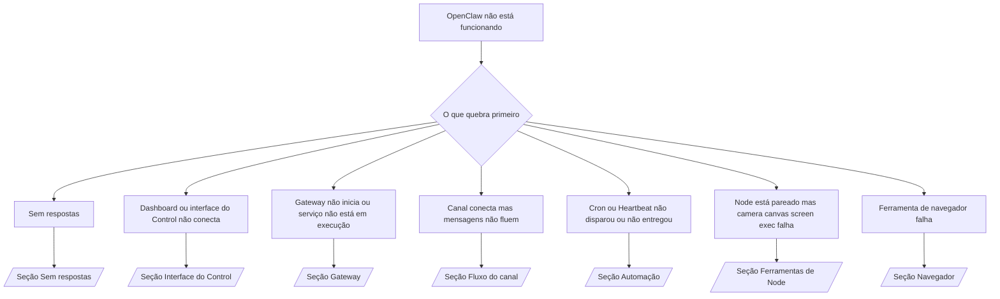

---
read_when:
    - O OpenClaw não está funcionando e você precisa do caminho mais rápido para uma correção
    - Você quer um fluxo de triagem antes de mergulhar em runbooks aprofundados
summary: Hub de solução de problemas orientado por sintomas para o OpenClaw
title: Solução geral de problemas
x-i18n:
    generated_at: "2026-04-24T05:56:01Z"
    model: gpt-5.4
    provider: openai
    source_hash: ce06ddce9de9e5824b4c5e8c182df07b29ce3ff113eb8e29c62aef9a4682e8e9
    source_path: help/troubleshooting.md
    workflow: 15
---

# Solução de problemas

Se você só tem 2 minutos, use esta página como porta de entrada para triagem.

## Primeiros 60 segundos

Execute esta sequência exata nesta ordem:

```bash
openclaw status
openclaw status --all
openclaw gateway probe
openclaw gateway status
openclaw doctor
openclaw channels status --probe
openclaw logs --follow
```

Uma boa saída, em uma linha:

- `openclaw status` → mostra canais configurados e nenhum erro óbvio de autenticação.
- `openclaw status --all` → o relatório completo está presente e pode ser compartilhado.
- `openclaw gateway probe` → o alvo esperado do gateway está acessível (`Reachable: yes`). `Capability: ...` informa qual nível de autenticação o probe conseguiu comprovar, e `Read probe: limited - missing scope: operator.read` significa diagnóstico degradado, não falha de conexão.
- `openclaw gateway status` → `Runtime: running`, `Connectivity probe: ok` e uma linha plausível `Capability: ...`. Use `--require-rpc` se precisar também de prova de RPC com escopo de leitura.
- `openclaw doctor` → sem erros bloqueadores de configuração/serviço.
- `openclaw channels status --probe` → gateway acessível retorna estado de transporte ativo por conta
  mais resultados de probe/auditoria como `works` ou `audit ok`; se o
  gateway estiver inacessível, o comando usa fallback para resumos apenas da configuração.
- `openclaw logs --follow` → atividade estável, sem erros fatais repetidos.

## Anthropic long context 429

Se você vir:
`HTTP 429: rate_limit_error: Extra usage is required for long context requests`,
vá para [/gateway/troubleshooting#anthropic-429-extra-usage-required-for-long-context](/pt-BR/gateway/troubleshooting#anthropic-429-extra-usage-required-for-long-context).

## Backend local compatível com OpenAI funciona diretamente, mas falha no OpenClaw

Se o seu backend local ou self-hosted `/v1` responde a pequenos probes diretos de
`/v1/chat/completions`, mas falha em `openclaw infer model run` ou em turnos
normais do agente:

1. Se o erro mencionar `messages[].content` esperando uma string, defina
   `models.providers.<provider>.models[].compat.requiresStringContent: true`.
2. Se o backend ainda falhar apenas em turnos do agente OpenClaw, defina
   `models.providers.<provider>.models[].compat.supportsTools: false` e tente novamente.
3. Se pequenas chamadas diretas ainda funcionarem, mas prompts maiores do OpenClaw derrubarem o
   backend, trate o problema restante como limitação do modelo/servidor upstream e
   continue no runbook aprofundado:
   [/gateway/troubleshooting#local-openai-compatible-backend-passes-direct-probes-but-agent-runs-fail](/pt-BR/gateway/troubleshooting#local-openai-compatible-backend-passes-direct-probes-but-agent-runs-fail)

## Falha na instalação de Plugin com missing openclaw extensions

Se a instalação falhar com `package.json missing openclaw.extensions`, o pacote do plugin
está usando um formato antigo que o OpenClaw não aceita mais.

Corrija no pacote do plugin:

1. Adicione `openclaw.extensions` ao `package.json`.
2. Aponte as entradas para arquivos de runtime compilados (geralmente `./dist/index.js`).
3. Publique novamente o plugin e execute `openclaw plugins install <package>` outra vez.

Exemplo:

```json
{
  "name": "@openclaw/my-plugin",
  "version": "1.2.3",
  "openclaw": {
    "extensions": ["./dist/index.js"]
  }
}
```

Referência: [Arquitetura de Plugin](/pt-BR/plugins/architecture)

## Árvore de decisão



<AccordionGroup>
  <Accordion title="Sem respostas">
    ```bash
    openclaw status
    openclaw gateway status
    openclaw channels status --probe
    openclaw pairing list --channel <channel> [--account <id>]
    openclaw logs --follow
    ```

    Uma boa saída se parece com:

    - `Runtime: running`
    - `Connectivity probe: ok`
    - `Capability: read-only`, `write-capable` ou `admin-capable`
    - Seu canal mostra transporte conectado e, quando compatível, `works` ou `audit ok` em `channels status --probe`
    - O remetente aparece como aprovado (ou a política de DM é open/allowlist)

    Assinaturas comuns de log:

    - `drop guild message (mention required` → o bloqueio por menção impediu a mensagem no Discord.
    - `pairing request` → o remetente não está aprovado e aguarda aprovação de pareamento de DM.
    - `blocked` / `allowlist` nos logs do canal → remetente, sala ou grupo foi filtrado.

    Páginas aprofundadas:

    - [/gateway/troubleshooting#no-replies](/pt-BR/gateway/troubleshooting#no-replies)
    - [/channels/troubleshooting](/pt-BR/channels/troubleshooting)
    - [/channels/pairing](/pt-BR/channels/pairing)

  </Accordion>

  <Accordion title="Dashboard ou interface do Control não conecta">
    ```bash
    openclaw status
    openclaw gateway status
    openclaw logs --follow
    openclaw doctor
    openclaw channels status --probe
    ```

    Uma boa saída se parece com:

    - `Dashboard: http://...` é mostrado em `openclaw gateway status`
    - `Connectivity probe: ok`
    - `Capability: read-only`, `write-capable` ou `admin-capable`
    - Nenhum loop de autenticação nos logs

    Assinaturas comuns de log:

    - `device identity required` → contexto HTTP/não seguro não consegue concluir a autenticação do dispositivo.
    - `origin not allowed` → o `Origin` do navegador não é permitido para o alvo
      do gateway da interface do Control.
    - `AUTH_TOKEN_MISMATCH` com dicas de nova tentativa (`canRetryWithDeviceToken=true`) → uma tentativa confiável com token de dispositivo pode ocorrer automaticamente.
    - Essa nova tentativa com token em cache reutiliza o conjunto de escopos armazenado com o token de dispositivo pareado. Chamadores com `deviceToken` explícito / `scopes` explícitos mantêm
      o conjunto de escopos solicitado.
    - No caminho assíncrono da interface do Control via Tailscale Serve, falhas para o mesmo
      `{scope, ip}` são serializadas antes que o limitador registre a falha, então uma
      segunda nova tentativa ruim concorrente já pode mostrar `retry later`.
    - `too many failed authentication attempts (retry later)` de uma origem de navegador em localhost
      → falhas repetidas desse mesmo `Origin` são temporariamente
      bloqueadas; outra origem localhost usa um bucket separado.
    - `unauthorized` repetido após essa nova tentativa → token/senha errados, incompatibilidade de modo de autenticação ou token de dispositivo pareado obsoleto.
    - `gateway connect failed:` → a interface está apontando para URL/porta erradas ou gateway inacessível.

    Páginas aprofundadas:

    - [/gateway/troubleshooting#dashboard-control-ui-connectivity](/pt-BR/gateway/troubleshooting#dashboard-control-ui-connectivity)
    - [/web/control-ui](/pt-BR/web/control-ui)
    - [/gateway/authentication](/pt-BR/gateway/authentication)

  </Accordion>

  <Accordion title="Gateway não inicia ou serviço instalado, mas não em execução">
    ```bash
    openclaw status
    openclaw gateway status
    openclaw logs --follow
    openclaw doctor
    openclaw channels status --probe
    ```

    Uma boa saída se parece com:

    - `Service: ... (loaded)`
    - `Runtime: running`
    - `Connectivity probe: ok`
    - `Capability: read-only`, `write-capable` ou `admin-capable`

    Assinaturas comuns de log:

    - `Gateway start blocked: set gateway.mode=local` ou `existing config is missing gateway.mode` → o modo do gateway é remoto, ou o arquivo de configuração está sem o carimbo de modo local e deve ser reparado.
    - `refusing to bind gateway ... without auth` → bind sem loopback sem um caminho válido de autenticação do gateway (token/senha ou trusted-proxy, quando configurado).
    - `another gateway instance is already listening` ou `EADDRINUSE` → porta já está em uso.

    Páginas aprofundadas:

    - [/gateway/troubleshooting#gateway-service-not-running](/pt-BR/gateway/troubleshooting#gateway-service-not-running)
    - [/gateway/background-process](/pt-BR/gateway/background-process)
    - [/gateway/configuration](/pt-BR/gateway/configuration)

  </Accordion>

  <Accordion title="Canal conecta, mas mensagens não fluem">
    ```bash
    openclaw status
    openclaw gateway status
    openclaw logs --follow
    openclaw doctor
    openclaw channels status --probe
    ```

    Uma boa saída se parece com:

    - O transporte do canal está conectado.
    - Verificações de pareamento/allowlist passam.
    - Menções são detectadas quando exigidas.

    Assinaturas comuns de log:

    - `mention required` → o bloqueio por menção em grupo impediu o processamento.
    - `pairing` / `pending` → o remetente de DM ainda não está aprovado.
    - `not_in_channel`, `missing_scope`, `Forbidden`, `401/403` → problema de permissões/token do canal.

    Páginas aprofundadas:

    - [/gateway/troubleshooting#channel-connected-messages-not-flowing](/pt-BR/gateway/troubleshooting#channel-connected-messages-not-flowing)
    - [/channels/troubleshooting](/pt-BR/channels/troubleshooting)

  </Accordion>

  <Accordion title="Cron ou Heartbeat não disparou ou não entregou">
    ```bash
    openclaw status
    openclaw gateway status
    openclaw cron status
    openclaw cron list
    openclaw cron runs --id <jobId> --limit 20
    openclaw logs --follow
    ```

    Uma boa saída se parece com:

    - `cron.status` mostra ativado com uma próxima ativação.
    - `cron runs` mostra entradas `ok` recentes.
    - O Heartbeat está ativado e não está fora das horas ativas.

    Assinaturas comuns de log:

    - `cron: scheduler disabled; jobs will not run automatically` → o cron está desativado.
    - `heartbeat skipped` com `reason=quiet-hours` → fora das horas ativas configuradas.
    - `heartbeat skipped` com `reason=empty-heartbeat-file` → `HEARTBEAT.md` existe, mas contém apenas estrutura em branco/apenas cabeçalhos.
    - `heartbeat skipped` com `reason=no-tasks-due` → o modo de tarefas de `HEARTBEAT.md` está ativo, mas nenhum dos intervalos de tarefa ainda venceu.
    - `heartbeat skipped` com `reason=alerts-disabled` → toda a visibilidade de Heartbeat está desativada (`showOk`, `showAlerts` e `useIndicator` estão todos off).
    - `requests-in-flight` → a trilha principal está ocupada; a ativação do Heartbeat foi adiada.
    - `unknown accountId` → a conta de destino da entrega do Heartbeat não existe.

    Páginas aprofundadas:

    - [/gateway/troubleshooting#cron-and-heartbeat-delivery](/pt-BR/gateway/troubleshooting#cron-and-heartbeat-delivery)
    - [/automation/cron-jobs#troubleshooting](/pt-BR/automation/cron-jobs#troubleshooting)
    - [/gateway/heartbeat](/pt-BR/gateway/heartbeat)

  </Accordion>

  <Accordion title="Node está pareado, mas a ferramenta de camera canvas screen exec falha">
    ```bash
    openclaw status
    openclaw gateway status
    openclaw nodes status
    openclaw nodes describe --node <idOrNameOrIp>
    openclaw logs --follow
    ```

    Uma boa saída se parece com:

    - O Node aparece como conectado e pareado para a função `node`.
    - O recurso existe para o comando que você está invocando.
    - O estado de permissão foi concedido para a ferramenta.

    Assinaturas comuns de log:

    - `NODE_BACKGROUND_UNAVAILABLE` → traga o app do node para o primeiro plano.
    - `*_PERMISSION_REQUIRED` → permissão do sistema operacional foi negada/está ausente.
    - `SYSTEM_RUN_DENIED: approval required` → a aprovação de exec está pendente.
    - `SYSTEM_RUN_DENIED: allowlist miss` → o comando não está na allowlist de exec.

    Páginas aprofundadas:

    - [/gateway/troubleshooting#node-paired-tool-fails](/pt-BR/gateway/troubleshooting#node-paired-tool-fails)
    - [/nodes/troubleshooting](/pt-BR/nodes/troubleshooting)
    - [/tools/exec-approvals](/pt-BR/tools/exec-approvals)

  </Accordion>

  <Accordion title="Exec de repente pede aprovação">
    ```bash
    openclaw config get tools.exec.host
    openclaw config get tools.exec.security
    openclaw config get tools.exec.ask
    openclaw gateway restart
    ```

    O que mudou:

    - Se `tools.exec.host` não estiver definido, o padrão é `auto`.
    - `host=auto` resolve para `sandbox` quando um runtime de sandbox está ativo e para `gateway` caso contrário.
    - `host=auto` trata apenas de roteamento; o comportamento sem prompt em modo "YOLO" vem de `security=full` mais `ask=off` em gateway/node.
    - Em `gateway` e `node`, `tools.exec.security` não definido tem padrão `full`.
    - `tools.exec.ask` não definido tem padrão `off`.
    - Resultado: se você está vendo aprovações, alguma política local do host ou por sessão apertou o exec em relação aos padrões atuais.

    Restaurar o comportamento atual padrão sem aprovação:

    ```bash
    openclaw config set tools.exec.host gateway
    openclaw config set tools.exec.security full
    openclaw config set tools.exec.ask off
    openclaw gateway restart
    ```

    Alternativas mais seguras:

    - Defina apenas `tools.exec.host=gateway` se você só quiser roteamento estável de host.
    - Use `security=allowlist` com `ask=on-miss` se quiser exec no host, mas ainda quiser revisão em falhas de allowlist.
    - Ative o modo sandbox se quiser que `host=auto` volte a resolver para `sandbox`.

    Assinaturas comuns de log:

    - `Approval required.` → o comando está aguardando `/approve ...`.
    - `SYSTEM_RUN_DENIED: approval required` → a aprovação de exec no host do node está pendente.
    - `exec host=sandbox requires a sandbox runtime for this session` → seleção implícita/explícita de sandbox, mas o modo sandbox está desativado.

    Páginas aprofundadas:

    - [/tools/exec](/pt-BR/tools/exec)
    - [/tools/exec-approvals](/pt-BR/tools/exec-approvals)
    - [/gateway/security#what-the-audit-checks-high-level](/pt-BR/gateway/security#what-the-audit-checks-high-level)

  </Accordion>

  <Accordion title="Ferramenta de navegador falha">
    ```bash
    openclaw status
    openclaw gateway status
    openclaw browser status
    openclaw logs --follow
    openclaw doctor
    ```

    Uma boa saída se parece com:

    - O status do navegador mostra `running: true` e um navegador/perfil escolhido.
    - `openclaw` inicia, ou `user` consegue ver abas locais do Chrome.

    Assinaturas comuns de log:

    - `unknown command "browser"` ou `unknown command 'browser'` → `plugins.allow` está definido e não inclui `browser`.
    - `Failed to start Chrome CDP on port` → a inicialização do navegador local falhou.
    - `browser.executablePath not found` → o caminho configurado do binário está errado.
    - `browser.cdpUrl must be http(s) or ws(s)` → a URL CDP configurada usa um esquema não compatível.
    - `browser.cdpUrl has invalid port` → a URL CDP configurada tem uma porta inválida ou fora do intervalo.
    - `No Chrome tabs found for profile="user"` → o perfil de conexão Chrome MCP não tem abas locais abertas do Chrome.
    - `Remote CDP for profile "<name>" is not reachable` → o endpoint remoto CDP configurado não está acessível a partir deste host.
    - `Browser attachOnly is enabled ... not reachable` ou `Browser attachOnly is enabled and CDP websocket ... is not reachable` → o perfil somente attach não tem um alvo CDP ativo.
    - substituições obsoletas de viewport / dark mode / locale / offline em perfis attach-only ou CDP remotos → execute `openclaw browser stop --browser-profile <name>` para fechar a sessão de controle ativa e liberar o estado de emulação sem reiniciar o gateway.

    Páginas aprofundadas:

    - [/gateway/troubleshooting#browser-tool-fails](/pt-BR/gateway/troubleshooting#browser-tool-fails)
    - [/tools/browser#missing-browser-command-or-tool](/pt-BR/tools/browser#missing-browser-command-or-tool)
    - [/tools/browser-linux-troubleshooting](/pt-BR/tools/browser-linux-troubleshooting)
    - [/tools/browser-wsl2-windows-remote-cdp-troubleshooting](/pt-BR/tools/browser-wsl2-windows-remote-cdp-troubleshooting)

  </Accordion>

</AccordionGroup>

## Relacionado

- [FAQ](/pt-BR/help/faq) — perguntas frequentes
- [Solução de problemas do Gateway](/pt-BR/gateway/troubleshooting) — problemas específicos do gateway
- [Doctor](/pt-BR/gateway/doctor) — verificações automáticas de integridade e correções
- [Solução de problemas de canais](/pt-BR/channels/troubleshooting) — problemas de conectividade de canais
- [Solução de problemas de automação](/pt-BR/automation/cron-jobs#troubleshooting) — problemas de cron e Heartbeat
