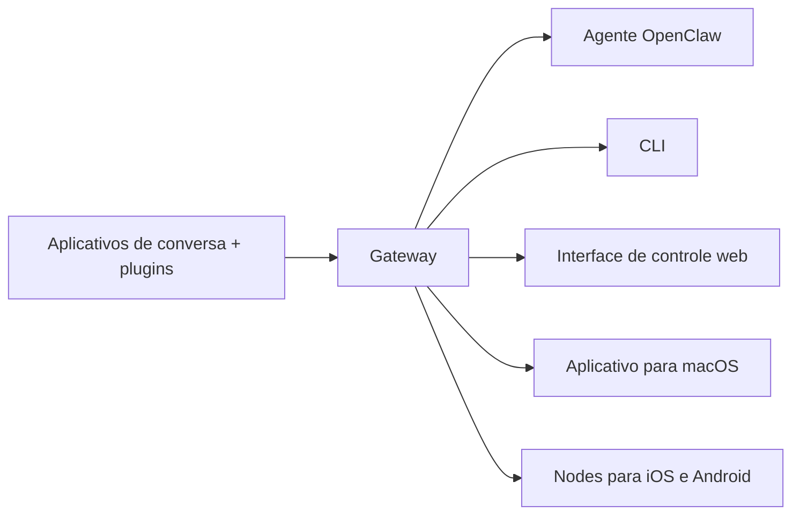

---
read_when:
    - Apresentando o OpenClaw a novos usuários
summary: OpenClaw é um gateway multicanal para agentes de IA que é executado em qualquer sistema operacional.
title: OpenClaw
x-i18n:
    generated_at: "2026-07-16T12:33:59Z"
    model: gpt-5.6
    postprocess_version: locale-links-v1
    prompt_version: 32
    provider: openai
    source_hash: fe97e7299be4855fd9af21838e0626b5a5c8aafe46d982859e9033f0efec2443
    source_path: index.md
    workflow: 16
---

# OpenClaw 🦞

<p align="center">
    
    
</p>

> _"ESFOLIE! ESFOLIE!"_ — Uma lagosta espacial, provavelmente

<p align="center">
  <strong>Gateway para qualquer sistema operacional que conecta agentes de IA ao Discord, Google Chat, iMessage, Matrix, Microsoft Teams, Signal, Slack, Telegram, WhatsApp, Zalo e muito mais.</strong><br />
  Envie uma mensagem e receba no seu bolso a resposta de um agente. Execute um único Gateway para plugins de canais, WebChat e Nodes móveis.
</p>

<Columns>
  <Card title="Começar" href="/pt-BR/start/getting-started" icon="rocket">
    Instale o OpenClaw e coloque o Gateway em funcionamento em poucos minutos.
  </Card>
  <Card title="Executar a integração inicial" href="/pt-BR/start/wizard" icon="list-checks">
    Configuração guiada com `openclaw onboard` e fluxos de pareamento.
  </Card>
  <Card title="Conectar um canal" href="/pt-BR/channels" icon="message-circle">
    Vincule Discord, Signal, Telegram, WhatsApp e outros para conversar de qualquer lugar.
  </Card>
  <Card title="Abrir a interface de controle" href="/pt-BR/web/control-ui" icon="layout-dashboard">
    Abra o painel do navegador para conversas, configuração e sessões.
  </Card>
</Columns>

## Navegar pela documentação

Navegadores móveis podem exibir o menu da seção sem a barra de abas completa da versão para desktop. Use
estes links de centralização para acessar pelo corpo da página as mesmas áreas principais da documentação.

<Columns>
  <Card title="Começar" href="/pt-BR" icon="rocket">
    Visão geral, demonstração, primeiros passos e guias de configuração.
  </Card>
  <Card title="Instalar" href="/pt-BR/install" icon="download">
    Formas de instalação, atualizações, contêineres, hospedagem e configuração avançada.
  </Card>
  <Card title="Canais" href="/pt-BR/channels" icon="messages-square">
    Canais de mensagens, pareamento, roteamento, grupos de acesso e controle de qualidade dos canais.
  </Card>
  <Card title="Agentes" href="/pt-BR/concepts/architecture" icon="bot">
    Arquitetura, sessões, contexto, memória e roteamento multiagente.
  </Card>
  <Card title="Recursos" href="/pt-BR/tools" icon="wand-sparkles">
    Ferramentas, Skills, Cron, Webhooks e recursos de automação.
  </Card>
  <Card title="ClawHub" href="/clawhub" icon="store">
    Marketplace de plugins, publicação, curadoria e orientações sobre confiança.
  </Card>
  <Card title="Modelos" href="/pt-BR/providers" icon="brain">
    Provedores, configuração de modelos, failover e serviços de modelos locais.
  </Card>
  <Card title="Plataformas" href="/pt-BR/platforms" icon="monitor-smartphone">
    macOS, Windows, iOS, Android, Nodes e interfaces web.
  </Card>
  <Card title="Gateway e operações" href="/pt-BR/gateway" icon="server">
    Configuração, segurança, diagnóstico e operações do Gateway.
  </Card>
  <Card title="Referência" href="/pt-BR/cli" icon="terminal">
    Referência da CLI, esquemas, RPC, notas de versão e modelos.
  </Card>
  <Card title="Ajuda" href="/pt-BR/help" icon="life-buoy">
    Solução de problemas, perguntas frequentes, testes, diagnóstico e verificações do ambiente.
  </Card>
</Columns>

## O que é o OpenClaw?

O OpenClaw é um **gateway auto-hospedado** que conecta seus aplicativos de conversa favoritos — Discord, Google Chat, iMessage, Matrix, Microsoft Teams, Signal, Slack, Telegram, WhatsApp, Zalo e outros por meio de plugins de canais — a agentes de programação com IA. Você executa um único processo do Gateway em sua própria máquina (ou em um servidor), e ele se torna a ponte entre seus aplicativos de mensagens e um assistente de IA sempre disponível.

**Para quem ele é destinado?** Desenvolvedores e usuários avançados que desejam um assistente de IA pessoal com o qual possam trocar mensagens de qualquer lugar, sem abrir mão do controle dos próprios dados nem depender de um serviço hospedado.

**O que o torna diferente?**

- **Auto-hospedado**: é executado no seu hardware, sob suas regras
- **Multicanal**: um único Gateway atende simultaneamente a todos os plugins de canais configurados
- **Nativo para agentes**: criado para agentes de programação, com uso de ferramentas, sessões, memória e roteamento multiagente
- **Código aberto**: licenciado sob a licença MIT e desenvolvido pela comunidade

**Do que você precisa?** Node 24.15+ (recomendado), Node 22 LTS (`22.22.3+`) para compatibilidade ou Node 25.9+, uma chave de API do provedor escolhido e 5 minutos. Para obter a melhor qualidade e segurança, use o modelo de última geração mais avançado disponível.

## Como funciona



O Gateway é a única fonte de verdade para sessões, roteamento e conexões de canais.

## Principais recursos

<Columns>
  <Card title="Gateway multicanal" icon="network" href="/pt-BR/channels">
    Discord, iMessage, Signal, Slack, Telegram, WhatsApp, WebChat e outros com um único processo do Gateway.
  </Card>
  <Card title="Canais com plugins" icon="plug" href="/pt-BR/tools/plugin">
    Plugins de canais adicionam Matrix, Nostr, Twitch, Zalo e outros; os plugins oficiais são instalados sob demanda.
  </Card>
  <Card title="Roteamento multiagente" icon="route" href="/pt-BR/concepts/multi-agent">
    Sessões isoladas por agente, espaço de trabalho ou remetente.
  </Card>
  <Card title="Suporte a mídia" icon="image" href="/pt-BR/nodes/images">
    Envie e receba imagens, áudios e documentos.
  </Card>
  <Card title="Interface de controle web" icon="monitor" href="/pt-BR/web/control-ui">
    Painel no navegador para conversas, configuração, sessões e Nodes.
  </Card>
  <Card title="Nodes móveis" icon="smartphone" href="/pt-BR/nodes">
    Pareie Nodes para iOS e Android em fluxos de trabalho com Canvas, câmera e recursos de voz.
  </Card>
</Columns>

## Início rápido

<Steps>
  <Step title="Instalar o OpenClaw">
    ```bash
    npm install -g openclaw@latest
    ```
  </Step>
  <Step title="Fazer a integração inicial e instalar o serviço">
    ```bash
    openclaw onboard --install-daemon
    ```
  </Step>
  <Step title="Conversar">
    Abra a interface de controle no navegador e envie uma mensagem:

    ```bash
    openclaw dashboard
    ```

    Ou conecte um canal ([Telegram](/pt-BR/channels/telegram) é o mais rápido) e converse pelo celular.

  </Step>
</Steps>

Precisa das instruções completas de instalação e configuração do ambiente de desenvolvimento? Consulte [Primeiros passos](/pt-BR/start/getting-started).

## Painel

Abra a interface de controle no navegador após o Gateway ser iniciado.

- Padrão local: [http://127.0.0.1:18789/](http://127.0.0.1:18789/)
- Acesso remoto: [Interfaces web](/pt-BR/web) e [Tailscale](/pt-BR/gateway/tailscale)

<p align="center">
  
</p>

## Configuração (opcional)

A configuração fica em `~/.openclaw/openclaw.json`.

- Se você **não fizer nada**, o OpenClaw usará o runtime de agente OpenClaw incluído; as mensagens diretas compartilharão a sessão principal do agente, e cada conversa em grupo terá sua própria sessão.
- Para restringir o acesso, comece com `channels.whatsapp.allowFrom` e, para grupos, regras de menção.

Exemplo:

```json5
{
  channels: {
    whatsapp: {
      allowFrom: ["+15555550123"],
      groups: { "*": { requireMention: true } },
    },
  },
  messages: { groupChat: { mentionPatterns: ["@openclaw"] } },
}
```

## Comece aqui

<Columns>
  <Card title="Centrais de documentação" href="/pt-BR/start/hubs" icon="book-open">
    Toda a documentação e todos os guias, organizados por caso de uso.
  </Card>
  <Card title="Configuração" href="/pt-BR/gateway/configuration" icon="settings">
    Configurações principais do Gateway, tokens e configuração de provedores.
  </Card>
  <Card title="Acesso remoto" href="/pt-BR/gateway/remote" icon="globe">
    Padrões de acesso por SSH e tailnet.
  </Card>
  <Card title="Canais" href="/pt-BR/channels/telegram" icon="message-square">
    Configuração específica para canais como Discord, Feishu, Microsoft Teams, Telegram, WhatsApp e outros.
  </Card>
  <Card title="Nodes" href="/pt-BR/nodes" icon="smartphone">
    Nodes para iOS e Android com pareamento, Canvas, câmera e ações no dispositivo.
  </Card>
  <Card title="Ajuda" href="/pt-BR/help" icon="life-buoy">
    Ponto de entrada para correções comuns e solução de problemas.
  </Card>
</Columns>

## Saiba mais

<Columns>
  <Card title="Lista completa de recursos" href="/pt-BR/concepts/features" icon="list">
    Recursos completos de canais, roteamento e mídia.
  </Card>
  <Card title="Roteamento multiagente" href="/pt-BR/concepts/multi-agent" icon="route">
    Isolamento de espaços de trabalho e sessões por agente.
  </Card>
  <Card title="Segurança" href="/pt-BR/gateway/security" icon="shield">
    Tokens, listas de permissões e controles de segurança.
  </Card>
  <Card title="Solução de problemas" href="/pt-BR/gateway/troubleshooting" icon="wrench">
    Diagnóstico do Gateway e erros comuns.
  </Card>
  <Card title="Sobre e créditos" href="/pt-BR/reference/credits" icon="info">
    Origens do projeto, colaboradores e licença.
  </Card>
</Columns>
