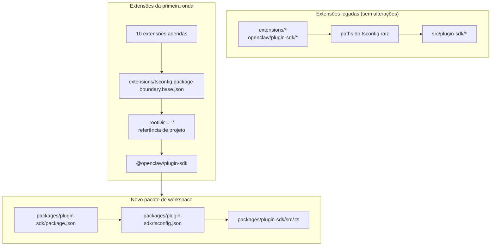

# refactor: Tornar o plugin-sdk um pacote real do workspace de forma incremental

## Visão geral

Este plano introduz um pacote real de workspace para o SDK de plugin em
`packages/plugin-sdk` e o usa para permitir que uma pequena primeira onda de extensões adote
limites de pacote reforçados pelo compilador. O objetivo é fazer com que imports
relativos ilegais falhem no `tsc` normal para um conjunto selecionado de extensões
empacotadas de provedores, sem forçar uma migração em todo o repositório nem criar
uma superfície gigante de conflitos de merge.

O principal movimento incremental é executar dois modos em paralelo por um tempo:

| Mode        | Import shape             | Who uses it                          | Enforcement                                  |
| ----------- | ------------------------ | ------------------------------------ | -------------------------------------------- |
| Modo legado | `openclaw/plugin-sdk/*`  | todas as extensões existentes não aderidas | o comportamento permissivo atual permanece   |
| Modo opt-in | `@openclaw/plugin-sdk/*` | apenas extensões da primeira onda    | `rootDir` local do pacote + referências de projeto |

## Contexto do problema

O repositório atual exporta uma grande superfície pública do SDK de plugin, mas ela não é um pacote real de
workspace. Em vez disso:

- o `tsconfig.json` raiz mapeia `openclaw/plugin-sdk/*` diretamente para
  `src/plugin-sdk/*.ts`
- extensões que não aderiram ao experimento anterior ainda compartilham esse
  comportamento global de alias de origem
- adicionar `rootDir` só funciona quando imports permitidos do SDK deixam de resolver para o código-fonte bruto
  do repositório

Isso significa que o repositório pode descrever a política de limite desejada, mas o TypeScript
não a reforça de forma limpa para a maioria das extensões.

Você quer um caminho incremental que:

- torne `plugin-sdk` real
- mova o SDK para um pacote de workspace chamado `@openclaw/plugin-sdk`
- altere apenas cerca de 10 extensões no primeiro PR
- deixe o restante da árvore de extensões no esquema antigo até uma limpeza posterior
- evite o fluxo `tsconfig.plugin-sdk.dts.json` + declaração gerada em postinstall
  como mecanismo principal para a implantação da primeira onda

## Rastreabilidade de requisitos

- R1. Criar um pacote real de workspace para o SDK de plugin em `packages/`.
- R2. Nomear o novo pacote como `@openclaw/plugin-sdk`.
- R3. Dar ao novo pacote do SDK seu próprio `package.json` e `tsconfig.json`.
- R4. Manter os imports legados `openclaw/plugin-sdk/*` funcionando para extensões não aderidas
  durante a janela de migração.
- R5. Adotar apenas uma pequena primeira onda de extensões no primeiro PR.
- R6. As extensões da primeira onda devem falhar de forma fechada para imports relativos que saiam
  da raiz do próprio pacote.
- R7. As extensões da primeira onda devem consumir o SDK por meio de uma dependência de pacote
  e de uma referência de projeto do TS, não por aliases `paths` da raiz.
- R8. O plano deve evitar uma etapa obrigatória de geração em postinstall para todo o repositório
  para correção no editor.
- R9. A implantação da primeira onda deve ser revisável e integrável como um PR moderado,
  não como uma refatoração de mais de 300 arquivos em todo o repositório.

## Limites de escopo

- Sem migração completa de todas as extensões empacotadas no primeiro PR.
- Sem exigência de remover `src/plugin-sdk` no primeiro PR.
- Sem exigência de religar imediatamente todos os caminhos de build ou teste da raiz para usar o novo pacote.
- Sem tentativa de forçar marcações de erro no VS Code para todas as extensões não aderidas.
- Sem limpeza ampla de lint para o restante da árvore de extensões.
- Sem grandes mudanças de comportamento em runtime além de resolução de import, propriedade de pacote
  e reforço de limites para as extensões aderidas.

## Contexto e pesquisa

### Código e padrões relevantes

- `pnpm-workspace.yaml` já inclui `packages/*` e `extensions/*`, então um
  novo pacote de workspace em `packages/plugin-sdk` se encaixa no layout
  existente do repositório.
- Pacotes de workspace existentes, como `packages/memory-host-sdk/package.json`
  e `packages/plugin-package-contract/package.json`, já usam mapas `exports`
  locais do pacote enraizados em `src/*.ts`.
- O `package.json` raiz atualmente publica a superfície do SDK por `./plugin-sdk`
  e `./plugin-sdk/*` exports respaldados por `dist/plugin-sdk/*.js` e
  `dist/plugin-sdk/*.d.ts`.
- `src/plugin-sdk/entrypoints.ts` e `scripts/lib/plugin-sdk-entrypoints.json`
  já funcionam como o inventário canônico de entrypoints para a superfície do SDK.
- O `tsconfig.json` raiz atualmente mapeia:
  - `openclaw/plugin-sdk` -> `src/plugin-sdk/index.ts`
  - `openclaw/plugin-sdk/*` -> `src/plugin-sdk/*.ts`
- O experimento anterior de limites mostrou que `rootDir` local do pacote funciona para
  imports relativos ilegais somente depois que imports permitidos do SDK deixam de resolver para código-fonte bruto fora do pacote da extensão.

### Conjunto de extensões da primeira onda

Este plano assume que a primeira onda é o conjunto focado em provedores, o menos provável
de arrastar casos de borda complexos do runtime de canais:

- `extensions/anthropic`
- `extensions/exa`
- `extensions/firecrawl`
- `extensions/groq`
- `extensions/mistral`
- `extensions/openai`
- `extensions/perplexity`
- `extensions/tavily`
- `extensions/together`
- `extensions/xai`

### Inventário da superfície do SDK da primeira onda

As extensões da primeira onda atualmente importam um subconjunto gerenciável de subcaminhos do SDK.
O pacote inicial `@openclaw/plugin-sdk` só precisa cobrir estes:

- `agent-runtime`
- `cli-runtime`
- `config-runtime`
- `core`
- `image-generation`
- `media-runtime`
- `media-understanding`
- `plugin-entry`
- `plugin-runtime`
- `provider-auth`
- `provider-auth-api-key`
- `provider-auth-login`
- `provider-auth-runtime`
- `provider-catalog-shared`
- `provider-entry`
- `provider-http`
- `provider-model-shared`
- `provider-onboard`
- `provider-stream-family`
- `provider-stream-shared`
- `provider-tools`
- `provider-usage`
- `provider-web-fetch`
- `provider-web-search`
- `realtime-transcription`
- `realtime-voice`
- `runtime-env`
- `secret-input`
- `security-runtime`
- `speech`
- `testing`

### Aprendizados institucionais

- Não havia entradas relevantes em `docs/solutions/` neste worktree.

### Referências externas

- Nenhuma pesquisa externa foi necessária para este plano. O repositório já contém os
  padrões relevantes de pacote de workspace e exportação do SDK.

## Principais decisões técnicas

- Introduzir `@openclaw/plugin-sdk` como um novo pacote de workspace, mantendo a
  superfície legada da raiz `openclaw/plugin-sdk/*` ativa durante a migração.
  Justificativa: isso permite que um conjunto de extensões da primeira onda migre
  para uma resolução real por pacote sem forçar a mudança de todas as extensões e de todos os caminhos de build da raiz
  ao mesmo tempo.

- Usar uma configuração base dedicada de limite opt-in, como
  `extensions/tsconfig.package-boundary.base.json`, em vez de substituir a
  base de extensão existente para todos.
  Justificativa: o repositório precisa suportar simultaneamente os modos legado e opt-in
  de extensão durante a migração.

- Usar referências de projeto do TS a partir das extensões da primeira onda para
  `packages/plugin-sdk/tsconfig.json` e definir
  `disableSourceOfProjectReferenceRedirect` para o modo de limite opt-in.
  Justificativa: isso dá ao `tsc` um grafo real de pacotes, ao mesmo tempo que desencoraja o fallback
  do editor e do compilador para travessia de código-fonte bruto.

- Manter `@openclaw/plugin-sdk` privado na primeira onda.
  Justificativa: o objetivo imediato é reforço interno de limites e segurança da migração,
  não publicar um segundo contrato externo do SDK antes de a superfície estar estável.

- Mover apenas os subcaminhos do SDK da primeira onda na primeira fatia de implementação, e
  manter pontes de compatibilidade para o restante.
  Justificativa: mover fisicamente todos os 315 arquivos `src/plugin-sdk/*.ts` em um único PR é
  exatamente a superfície de conflito de merge que este plano tenta evitar.

- Não depender de `scripts/postinstall-bundled-plugins.mjs` para construir
  declarações do SDK para a primeira onda.
  Justificativa: fluxos explícitos de build/referência são mais fáceis de entender e tornam
  o comportamento do repositório mais previsível.

## Questões em aberto

### Resolvidas durante o planejamento

- Quais extensões devem estar na primeira onda?
  Use as 10 extensões de provedor/pesquisa web listadas acima porque são
  estruturalmente mais isoladas do que os pacotes de canal mais pesados.

- O primeiro PR deve substituir toda a árvore de extensões?
  Não. O primeiro PR deve suportar dois modos em paralelo e aderir apenas a
  primeira onda.

- A primeira onda deve exigir uma build de declarações em postinstall?
  Não. O grafo de pacote/referência deve ser explícito, e o CI deve executar
  intencionalmente a verificação de tipos local do pacote relevante.

### Adiadas para a implementação

- Se o pacote da primeira onda pode apontar diretamente para `src/*.ts` locais do pacote
  apenas por referências de projeto, ou se uma pequena etapa de emissão de declarações
  ainda é necessária para o pacote `@openclaw/plugin-sdk`.
  Esta é uma questão de validação do grafo do TS sob responsabilidade da implementação.

- Se o pacote raiz `openclaw` deve redirecionar imediatamente os subcaminhos do SDK da primeira onda para
  as saídas de `packages/plugin-sdk` ou continuar usando
  shims de compatibilidade gerados em `src/plugin-sdk`.
  Este é um detalhe de compatibilidade e formato de build que depende do caminho
  mínimo de implementação que mantenha o CI verde.

## Design técnico de alto nível

> Isto ilustra a abordagem pretendida e é uma orientação para revisão, não uma especificação de implementação. O agente implementador deve tratar isso como contexto, não como código a ser reproduzido.

## Unidades de implementação

- [ ] **Unidade 1: Introduzir o pacote real de workspace `@openclaw/plugin-sdk`**

**Objetivo:** Criar um pacote real de workspace para o SDK que possa assumir a
superfície de subcaminhos da primeira onda sem forçar uma migração em todo o repositório.

**Requisitos:** R1, R2, R3, R8, R9

**Dependências:** Nenhuma

**Arquivos:**

- Criar: `packages/plugin-sdk/package.json`
- Criar: `packages/plugin-sdk/tsconfig.json`
- Criar: `packages/plugin-sdk/src/index.ts`
- Criar: `packages/plugin-sdk/src/*.ts` para os subcaminhos do SDK da primeira onda
- Modificar: `pnpm-workspace.yaml` somente se forem necessários ajustes nos globs de pacote
- Modificar: `package.json`
- Modificar: `src/plugin-sdk/entrypoints.ts`
- Modificar: `scripts/lib/plugin-sdk-entrypoints.json`
- Teste: `src/plugins/contracts/plugin-sdk-workspace-package.contract.test.ts`

**Abordagem:**

- Adicionar um novo pacote de workspace chamado `@openclaw/plugin-sdk`.
- Começar apenas com os subcaminhos do SDK da primeira onda, não com toda a árvore de 315 arquivos.
- Se mover diretamente um entrypoint da primeira onda criar um diff grande demais, o
  primeiro PR pode introduzir esse subcaminho em `packages/plugin-sdk/src` como um wrapper fino do
  pacote primeiro e depois mudar a fonte da verdade para o pacote em um
  PR de acompanhamento para aquele grupo de subcaminhos.
- Reutilizar o mecanismo existente de inventário de entrypoints para que a superfície do pacote da primeira onda
  seja declarada em um único lugar canônico.
- Manter os exports do pacote raiz ativos para usuários legados enquanto o pacote de workspace
  se torna o novo contrato opt-in.

**Padrões a seguir:**

- `packages/memory-host-sdk/package.json`
- `packages/plugin-package-contract/package.json`
- `src/plugin-sdk/entrypoints.ts`

**Cenários de teste:**

- Caminho feliz: o pacote de workspace exporta todos os subcaminhos da primeira onda listados
  no plano e nenhum export obrigatório da primeira onda está ausente.
- Caso de borda: os metadados de export do pacote permanecem estáveis quando a lista de entradas da primeira onda
  é regenerada ou comparada com o inventário canônico.
- Integração: os exports legados do SDK no pacote raiz permanecem presentes após a introdução
  do novo pacote de workspace.

**Verificação:**

- O repositório contém um pacote de workspace válido `@openclaw/plugin-sdk` com um
  mapa de exports estável da primeira onda e sem regressão dos exports legados no
  `package.json` raiz.

- [ ] **Unidade 2: Adicionar um modo opt-in de limite do TS para extensões com reforço por pacote**

**Objetivo:** Definir o modo de configuração do TS que as extensões aderidas usarão,
mantendo o comportamento existente do TS para extensões inalterado para todos os demais.

**Requisitos:** R4, R6, R7, R8, R9

**Dependências:** Unidade 1

**Arquivos:**

- Criar: `extensions/tsconfig.package-boundary.base.json`
- Criar: `tsconfig.boundary-optin.json`
- Modificar: `extensions/xai/tsconfig.json`
- Modificar: `extensions/openai/tsconfig.json`
- Modificar: `extensions/anthropic/tsconfig.json`
- Modificar: `extensions/mistral/tsconfig.json`
- Modificar: `extensions/groq/tsconfig.json`
- Modificar: `extensions/together/tsconfig.json`
- Modificar: `extensions/perplexity/tsconfig.json`
- Modificar: `extensions/tavily/tsconfig.json`
- Modificar: `extensions/exa/tsconfig.json`
- Modificar: `extensions/firecrawl/tsconfig.json`
- Teste: `src/plugins/contracts/extension-package-project-boundaries.test.ts`
- Teste: `test/extension-package-tsc-boundary.test.ts`

**Abordagem:**

- Manter `extensions/tsconfig.base.json` para extensões legadas.
- Adicionar uma nova configuração base opt-in que:
  - define `rootDir: "."`
  - referencia `packages/plugin-sdk`
  - habilita `composite`
  - desabilita o redirecionamento de origem de referência de projeto quando necessário
- Adicionar uma configuração de solução dedicada para o grafo de verificação de tipos da primeira onda, em vez de
  remodelar o projeto TS raiz do repositório no mesmo PR.

**Nota de execução:** Comece com uma verificação de tipos canário local do pacote com falha para uma
extensão aderida antes de aplicar o padrão às 10.

**Padrões a seguir:**

- Padrão existente de `tsconfig.json` local de extensões do trabalho anterior de limites
- Padrão de pacote de workspace de `packages/memory-host-sdk`

**Cenários de teste:**

- Caminho feliz: cada extensão aderida passa na verificação de tipos com a
  configuração de limite por pacote do TS.
- Caminho de erro: um import relativo canário de `../../src/cli/acp-cli.ts` falha
  com `TS6059` para uma extensão aderida.
- Integração: extensões não aderidas permanecem intocadas e não precisam
  participar da nova configuração de solução.

**Verificação:**

- Existe um grafo dedicado de verificação de tipos para as 10 extensões aderidas, e imports
  relativos inválidos de uma delas falham no `tsc` normal.

- [ ] **Unidade 3: Migrar as extensões da primeira onda para `@openclaw/plugin-sdk`**

**Objetivo:** Alterar as extensões da primeira onda para consumir o pacote real do SDK
por metadados de dependência, referências de projeto e imports pelo nome do pacote.

**Requisitos:** R5, R6, R7, R9

**Dependências:** Unidade 2

**Arquivos:**

- Modificar: `extensions/anthropic/package.json`
- Modificar: `extensions/exa/package.json`
- Modificar: `extensions/firecrawl/package.json`
- Modificar: `extensions/groq/package.json`
- Modificar: `extensions/mistral/package.json`
- Modificar: `extensions/openai/package.json`
- Modificar: `extensions/perplexity/package.json`
- Modificar: `extensions/tavily/package.json`
- Modificar: `extensions/together/package.json`
- Modificar: `extensions/xai/package.json`
- Modificar: imports de produção e teste sob cada uma das 10 raízes de extensão que
  atualmente referenciam `openclaw/plugin-sdk/*`

**Abordagem:**

- Adicionar `@openclaw/plugin-sdk: workspace:*` às
  `devDependencies` das extensões da primeira onda.
- Substituir imports `openclaw/plugin-sdk/*` nesses pacotes por
  `@openclaw/plugin-sdk/*`.
- Manter imports internos locais da extensão em barrels locais como `./api.ts` e
  `./runtime-api.ts`.
- Não alterar extensões não aderidas neste PR.

**Padrões a seguir:**

- Barrels de import locais já existentes da extensão (`api.ts`, `runtime-api.ts`)
- Formato de dependência de pacote usado por outros pacotes de workspace `@openclaw/*`

**Cenários de teste:**

- Caminho feliz: cada extensão migrada ainda registra/carrega por seus testes de
  plugin existentes após a reescrita dos imports.
- Caso de borda: imports do SDK usados apenas em testes no conjunto de extensões aderidas ainda resolvem
  corretamente por meio do novo pacote.
- Integração: extensões migradas não exigem aliases `openclaw/plugin-sdk/*`
  da raiz para verificação de tipos.

**Verificação:**

- As extensões da primeira onda compilam e testam com `@openclaw/plugin-sdk`
  sem precisar do caminho legado de alias do SDK na raiz.

- [ ] **Unidade 4: Preservar a compatibilidade legada enquanto a migração for parcial**

**Objetivo:** Manter o restante do repositório funcionando enquanto o SDK existir nas formas legada
e de novo pacote durante a migração.

**Requisitos:** R4, R8, R9

**Dependências:** Unidades 1-3

**Arquivos:**

- Modificar: `src/plugin-sdk/*.ts` para shims de compatibilidade da primeira onda, conforme necessário
- Modificar: `package.json`
- Modificar: build ou plumbing de export que monta os artefatos do SDK
- Teste: `src/plugins/contracts/plugin-sdk-runtime-api-guardrails.test.ts`
- Teste: `src/plugins/contracts/plugin-sdk-index.bundle.test.ts`

**Abordagem:**

- Manter `openclaw/plugin-sdk/*` na raiz como superfície de compatibilidade para extensões
  legadas e para consumidores externos que ainda não vão migrar.
- Usar shims gerados ou wiring de proxy de export da raiz para os subcaminhos da primeira onda
  que foram movidos para `packages/plugin-sdk`.
- Não tentar aposentar a superfície do SDK na raiz nesta fase.

**Padrões a seguir:**

- Geração existente de export do SDK na raiz via `src/plugin-sdk/entrypoints.ts`
- Compatibilidade existente de export de pacote no `package.json` raiz

**Cenários de teste:**

- Caminho feliz: um import legado do SDK na raiz ainda resolve para uma extensão não aderida
  depois que o novo pacote existir.
- Caso de borda: um subcaminho da primeira onda funciona tanto pela superfície legada da raiz quanto
  pela superfície do novo pacote durante a janela de migração.
- Integração: os testes de contrato do index/bundle do plugin-sdk continuam vendo uma superfície
  pública coerente.

**Verificação:**

- O repositório suporta os dois modos de consumo do SDK, legado e opt-in, sem
  quebrar extensões inalteradas.

- [ ] **Unidade 5: Adicionar reforço com escopo definido e documentar o contrato de migração**

**Objetivo:** Entregar CI e orientações para contribuidores que reforcem o novo comportamento para a
primeira onda sem fingir que toda a árvore de extensões foi migrada.

**Requisitos:** R5, R6, R8, R9

**Dependências:** Unidades 1-4

**Arquivos:**

- Modificar: `package.json`
- Modificar: arquivos de workflow do CI que devem executar a verificação de tipos opt-in de limite
- Modificar: `AGENTS.md`
- Modificar: `docs/plugins/sdk-overview.md`
- Modificar: `docs/plugins/sdk-entrypoints.md`
- Modificar: `docs/plans/2026-04-05-001-refactor-extension-package-resolution-boundary-plan.md`

**Abordagem:**

- Adicionar uma gate explícita da primeira onda, como uma execução dedicada de `tsc -b` da solução para
  `packages/plugin-sdk` mais as 10 extensões aderidas.
- Documentar que o repositório agora suporta os modos legado e opt-in de extensões,
  e que novos trabalhos de limites de extensões devem preferir a nova rota por pacote.
- Registrar a regra de migração das próximas ondas para que PRs futuros possam adicionar mais extensões
  sem rediscutir a arquitetura.

**Padrões a seguir:**

- Testes de contrato existentes em `src/plugins/contracts/`
- Atualizações de documentação existentes que explicam migrações em etapas

**Cenários de teste:**

- Caminho feliz: a nova gate de verificação de tipos da primeira onda passa para o pacote de workspace
  e para as extensões aderidas.
- Caminho de erro: introduzir um novo import relativo ilegal em uma extensão aderida
  faz a gate de verificação de tipos com escopo definido falhar.
- Integração: o CI ainda não exige que extensões não aderidas satisfaçam o novo modo
  de limite por pacote.

**Verificação:**

- O caminho de reforço da primeira onda está documentado, testado e executável sem
  forçar a migração de toda a árvore de extensões.

## Impacto em todo o sistema

- **Grafo de interação:** este trabalho afeta a fonte da verdade do SDK,
  os exports do pacote raiz, metadados dos pacotes de extensão, layout do grafo do TS
  e verificação do CI.
- **Propagação de erros:** o principal modo de falha pretendido passa a ser erros de TS em tempo
  de compilação (`TS6059`) em extensões aderidas, em vez de
  falhas apenas de scripts customizados.
- **Riscos do ciclo de vida do estado:** a migração com superfície dupla introduz risco de divergência entre
  os exports de compatibilidade da raiz e o novo pacote de workspace.
- **Paridade da superfície de API:** os subcaminhos da primeira onda devem permanecer semanticamente idênticos
  tanto por `openclaw/plugin-sdk/*` quanto por `@openclaw/plugin-sdk/*` durante a
  transição.
- **Cobertura de integração:** testes de unidade não bastam; verificações de tipos com escopo do grafo de pacotes
  são necessárias para comprovar o limite.
- **Invariantes inalterados:** extensões não aderidas mantêm o comportamento atual
  no PR 1. Este plano não afirma reforço de limite de import em todo o repositório.

## Riscos e dependências

| Risk                                                                                                   | Mitigation                                                                                                              |
| ------------------------------------------------------------------------------------------------------ | ----------------------------------------------------------------------------------------------------------------------- |
| O pacote da primeira onda ainda resolve de volta para código-fonte bruto e `rootDir` não falha de forma fechada | Faça da primeira etapa de implementação um canário de referência de pacote em uma extensão aderida antes de ampliar para o conjunto completo |
| Mover código-fonte demais do SDK de uma só vez recria o problema original de conflito de merge        | Mova apenas os subcaminhos da primeira onda no primeiro PR e mantenha pontes de compatibilidade na raiz                |
| As superfícies legada e nova do SDK divergem semanticamente                                            | Mantenha um único inventário de entrypoints, adicione testes de contrato de compatibilidade e torne explícita a paridade de superfície dupla |
| Caminhos de build/teste do repositório raiz começam acidentalmente a depender do novo pacote de formas não controladas | Use uma configuração de solução dedicada para opt-in e mantenha mudanças na topologia TS de toda a raiz fora do primeiro PR |

## Entrega em fases

### Fase 1

- Introduzir `@openclaw/plugin-sdk`
- Definir a superfície de subcaminhos da primeira onda
- Comprovar que uma extensão aderida pode falhar de forma fechada por `rootDir`

### Fase 2

- Aderir as 10 extensões da primeira onda
- Manter a compatibilidade da raiz ativa para todo o restante

### Fase 3

- Adicionar mais extensões em PRs futuros
- Mover mais subcaminhos do SDK para o pacote de workspace
- Aposentar a compatibilidade da raiz somente depois que o conjunto legado de extensões desaparecer

## Observações operacionais / de documentação

- O primeiro PR deve se descrever explicitamente como uma migração em modo duplo, não como uma
  conclusão do reforço em todo o repositório.
- O guia de migração deve facilitar para PRs futuros adicionar mais extensões
  seguindo o mesmo padrão de pacote/dependência/referência.

## Fontes e referências

- Plano anterior: `docs/plans/2026-04-05-001-refactor-extension-package-resolution-boundary-plan.md`
- Configuração do workspace: `pnpm-workspace.yaml`
- Inventário existente de entrypoints do SDK: `src/plugin-sdk/entrypoints.ts`
- Exports existentes do SDK na raiz: `package.json`
- Padrões existentes de pacote de workspace:
  - `packages/memory-host-sdk/package.json`
  - `packages/plugin-package-contract/package.json`
