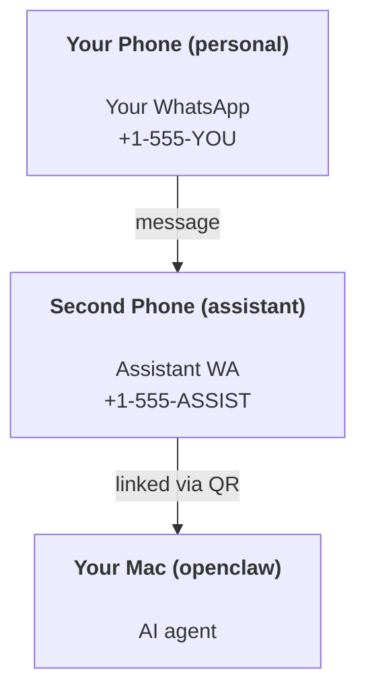

---
read_when:
    - Integrando uma nova instância de assistente
    - Analisando implicações de segurança/permissão
summary: Guia de ponta a ponta para executar o OpenClaw como um assistente pessoal com avisos de segurança
title: Configuração do assistente pessoal
x-i18n:
    generated_at: "2026-06-27T18:12:32Z"
    model: gpt-5.5
    postprocess_version: locale-links-v1
    provider: openai
    source_hash: b0cd640872a2a60fd88d2dc3df6d038ef8574163430d8683ef9b67921b0c87f4
    source_path: start/openclaw.md
    workflow: 16
---

OpenClaw é um gateway auto-hospedado que conecta Discord, Google Chat, iMessage, Matrix, Microsoft Teams, Signal, Slack, Telegram, WhatsApp, Zalo e outros a agentes de IA. Este guia cobre a configuração de "assistente pessoal": um número dedicado de WhatsApp que se comporta como seu assistente de IA sempre ativo.

## ⚠️ Segurança em primeiro lugar

Você está colocando um agente em posição de:

- executar comandos na sua máquina (dependendo da sua política de ferramentas)
- ler/gravar arquivos no seu workspace
- enviar mensagens de volta via WhatsApp/Telegram/Discord/Mattermost e outros canais incluídos

Comece de forma conservadora:

- Sempre defina `channels.whatsapp.allowFrom` (nunca execute aberto para o mundo no seu Mac pessoal).
- Use um número dedicado de WhatsApp para o assistente.
- Heartbeats agora têm como padrão a cada 30 minutos. Desative até confiar na configuração definindo `agents.defaults.heartbeat.every: "0m"`.

## Pré-requisitos

- OpenClaw instalado e configurado - veja [Primeiros passos](/pt-BR/start/getting-started) se ainda não fez isso
- Um segundo número de telefone (SIM/eSIM/pré-pago) para o assistente

## A configuração com dois telefones (recomendada)

Você quer isto:



Se você vincular seu WhatsApp pessoal ao OpenClaw, todas as mensagens para você viram "entrada do agente". Isso raramente é o que você quer.

## Início rápido em 5 minutos

1. Pareie o WhatsApp Web (mostra QR; escaneie com o telefone do assistente):

```bash
openclaw channels login
```

2. Inicie o Gateway (deixe-o em execução):

```bash
openclaw gateway --port 18789
```

3. Coloque uma configuração mínima em `~/.openclaw/openclaw.json`:

```json5
{
  gateway: { mode: "local" },
  channels: { whatsapp: { allowFrom: ["+15555550123"] } },
}
```

Agora envie uma mensagem para o número do assistente a partir do seu telefone na lista de permissões.

Quando o onboarding termina, o OpenClaw abre automaticamente o dashboard e imprime um link limpo (sem token). Se o dashboard pedir autenticação, cole o segredo compartilhado configurado nas configurações da Control UI. O onboarding usa um token por padrão (`gateway.auth.token`), mas a autenticação por senha também funciona se você tiver trocado `gateway.auth.mode` para `password`. Para reabrir depois: `openclaw dashboard`.

## Dê um workspace ao agente (AGENTS)

O OpenClaw lê instruções operacionais e "memória" a partir do diretório de workspace dele.

Por padrão, o OpenClaw usa `~/.openclaw/workspace` como workspace do agente e o cria (mais os arquivos iniciais `AGENTS.md`, `SOUL.md`, `TOOLS.md`, `IDENTITY.md`, `USER.md`, `HEARTBEAT.md`) automaticamente na configuração/primeira execução do agente. `BOOTSTRAP.md` só é criado quando o workspace é totalmente novo (ele não deve voltar depois que você o excluir). `MEMORY.md` é opcional (não é criado automaticamente); quando presente, é carregado para sessões normais. Sessões de subagente injetam apenas `AGENTS.md` e `TOOLS.md`.

<Tip>
Trate esta pasta como a memória do OpenClaw e transforme-a em um repositório git (idealmente privado), para que seu `AGENTS.md` e seus arquivos de memória tenham backup. Se o git estiver instalado, workspaces totalmente novos são inicializados automaticamente.
</Tip>

```bash
openclaw setup
```

Layout completo do workspace + guia de backup: [Workspace do agente](/pt-BR/concepts/agent-workspace)
Fluxo de memória: [Memória](/pt-BR/concepts/memory)

Opcional: escolha um workspace diferente com `agents.defaults.workspace` (compatível com `~`).

```json5
{
  agents: {
    defaults: {
      workspace: "~/.openclaw/workspace",
    },
  },
}
```

Se você já distribui seus próprios arquivos de workspace a partir de um repositório, pode desativar totalmente a criação de arquivos de bootstrap:

```json5
{
  agents: {
    defaults: {
      skipBootstrap: true,
    },
  },
}
```

## A configuração que o transforma em "um assistente"

O OpenClaw usa por padrão uma boa configuração de assistente, mas normalmente você vai querer ajustar:

- persona/instruções em [`SOUL.md`](/pt-BR/concepts/soul)
- padrões de pensamento (se desejado)
- heartbeats (quando confiar nele)

Exemplo:

```json5
{
  logging: { level: "info" },
  agents: {
    defaults: {
      model: { primary: "anthropic/claude-opus-4-6" },
      workspace: "~/.openclaw/workspace",
      thinkingDefault: "high",
      timeoutSeconds: 1800,
      // Start with 0; enable later.
      heartbeat: { every: "0m" },
    },
    list: [
      {
        id: "main",
        default: true,
        groupChat: {
          mentionPatterns: ["@openclaw", "openclaw"],
        },
      },
    ],
  },
  channels: {
    whatsapp: {
      allowFrom: ["+15555550123"],
      groups: {
        "*": { requireMention: true },
      },
    },
  },
  session: {
    scope: "per-sender",
    resetTriggers: ["/new", "/reset"],
    reset: {
      mode: "daily",
      atHour: 4,
      idleMinutes: 10080,
    },
  },
}
```

## Sessões e memória

- Arquivos de sessão: `~/.openclaw/agents/<agentId>/sessions/{{SessionId}}.jsonl`
- Metadados de sessão (uso de tokens, última rota etc.): `~/.openclaw/agents/<agentId>/sessions/sessions.json` (legado: `~/.openclaw/sessions/sessions.json`)
- `/new` ou `/reset` inicia uma nova sessão para aquele chat (configurável via `resetTriggers`). Se enviado sozinho, o OpenClaw confirma o reset sem invocar o modelo.
- `/compact [instructions]` compacta o contexto da sessão e informa o orçamento de contexto restante.

## Heartbeats (modo proativo)

Por padrão, o OpenClaw executa um Heartbeat a cada 30 minutos com o prompt:
`Read HEARTBEAT.md if it exists (workspace context). Follow it strictly. Do not infer or repeat old tasks from prior chats. If nothing needs attention, reply HEARTBEAT_OK.`
Defina `agents.defaults.heartbeat.every: "0m"` para desativar.

- Se `HEARTBEAT.md` existir, mas estiver efetivamente vazio (apenas linhas em branco, comentários Markdown/HTML, cabeçalhos Markdown como `# Heading`, marcadores de fence ou stubs de checklist vazios), o OpenClaw pula a execução do Heartbeat para economizar chamadas de API.
- Se o arquivo estiver ausente, o Heartbeat ainda roda e o modelo decide o que fazer.
- Se o agente responder com `HEARTBEAT_OK` (opcionalmente com um preenchimento curto; veja `agents.defaults.heartbeat.ackMaxChars`), o OpenClaw suprime a entrega de saída desse Heartbeat.
- Por padrão, a entrega de Heartbeat para destinos no estilo DM `user:<id>` é permitida. Defina `agents.defaults.heartbeat.directPolicy: "block"` para suprimir a entrega a destinos diretos mantendo as execuções de Heartbeat ativas.
- Heartbeats executam turnos completos do agente - intervalos menores consomem mais tokens.

```json5
{
  agents: {
    defaults: {
      heartbeat: { every: "30m" },
    },
  },
}
```

## Mídia de entrada e saída

Anexos recebidos (imagens/áudio/documentos) podem ser expostos ao seu comando por meio de templates:

- `{{MediaPath}}` (caminho do arquivo temporário local)
- `{{MediaUrl}}` (pseudo-URL)
- `{{Transcript}}` (se a transcrição de áudio estiver ativada)

Anexos enviados pelo agente usam campos de mídia estruturados na ferramenta de mensagem ou no payload de resposta, como `media`, `mediaUrl`, `mediaUrls`, `path` ou `filePath`. Exemplo de argumentos da ferramenta de mensagem:

```json
{
  "message": "Here's the screenshot.",
  "mediaUrl": "https://example.com/screenshot.png"
}
```

O OpenClaw envia mídia estruturada junto com o texto. Respostas finais legadas do assistente ainda podem ser normalizadas por compatibilidade, mas saída de ferramentas, saída do navegador, blocos de streaming e ações de mensagem não analisam texto como comandos de anexo.

O comportamento de caminhos locais segue o mesmo modelo de confiança de leitura de arquivos do agente:

- Se `tools.fs.workspaceOnly` for `true`, os caminhos de mídia local de saída continuam restritos à raiz temporária do OpenClaw, ao cache de mídia, aos caminhos do workspace do agente e a arquivos gerados pelo sandbox.
- Se `tools.fs.workspaceOnly` for `false`, a mídia local de saída pode usar arquivos locais do host que o agente já tem permissão para ler.
- Caminhos locais podem ser absolutos, relativos ao workspace ou relativos ao home com `~/`.
- Envios locais do host ainda permitem apenas mídia e tipos de documento seguros (imagens, áudio, vídeo, PDF, documentos Office e documentos de texto validados, como Markdown/MD, TXT, JSON, YAML e YML). Isto é uma extensão do limite de confiança de leitura do host existente, não um scanner de segredos: se o agente consegue ler um `secret.txt` ou `config.json` local do host, ele pode anexar esse arquivo quando a extensão e a validação de conteúdo corresponderem.

Isso significa que imagens/arquivos gerados fora do workspace agora podem ser enviados quando sua política de fs já permite essas leituras, enquanto extensões arbitrárias de texto local do host continuam bloqueadas. Mantenha arquivos sensíveis fora do sistema de arquivos legível pelo agente, ou mantenha `tools.fs.workspaceOnly=true` para envios de caminhos locais mais rigorosos.

## Checklist de operações

```bash
openclaw status          # local status (creds, sessions, queued events)
openclaw status --all    # full diagnosis (read-only, pasteable)
openclaw status --deep   # asks the gateway for a live health probe with channel probes when supported
openclaw health --json   # gateway health snapshot (WS; default can return a fresh cached snapshot)
```

Os logs ficam em `/tmp/openclaw/` (padrão: `openclaw-YYYY-MM-DD.log`).

## Próximos passos

- WebChat: [WebChat](/pt-BR/web/webchat)
- Operações do Gateway: [Runbook do Gateway](/pt-BR/gateway)
- Cron + despertares: [Tarefas Cron](/pt-BR/automation/cron-jobs)
- Companion de barra de menu do macOS: [App OpenClaw para macOS](/pt-BR/platforms/macos)
- App de nó iOS: [App iOS](/pt-BR/platforms/ios)
- App de nó Android: [App Android](/pt-BR/platforms/android)
- Windows Hub: [Windows](/pt-BR/platforms/windows)
- Status do Linux: [App Linux](/pt-BR/platforms/linux)
- Segurança: [Segurança](/pt-BR/gateway/security)

## Relacionados

- [Primeiros passos](/pt-BR/start/getting-started)
- [Configuração](/pt-BR/start/setup)
- [Visão geral dos canais](/pt-BR/channels)
