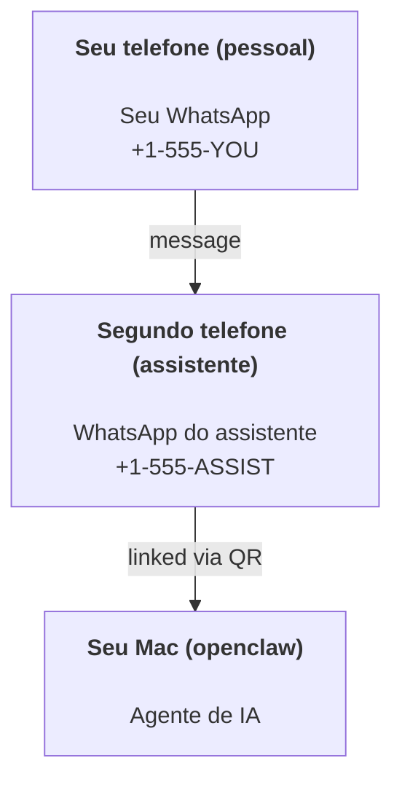

---
read_when:
    - Fazer o onboarding de uma nova instância de assistente
    - Analisar as implicações de segurança/permissões
summary: Guia completo para executar o OpenClaw como assistente pessoal com alertas de segurança
title: Configuração de assistente pessoal
x-i18n:
    generated_at: "2026-04-25T13:56:03Z"
    model: gpt-5.4
    provider: openai
    source_hash: 1647b78e8cf23a3a025969c52fbd8a73aed78df27698abf36bbf62045dc30e3b
    source_path: start/openclaw.md
    workflow: 15
---

# Criando um assistente pessoal com OpenClaw

O OpenClaw é um gateway autohospedado que conecta Discord, Google Chat, iMessage, Matrix, Microsoft Teams, Signal, Slack, Telegram, WhatsApp, Zalo e mais a agentes de IA. Este guia cobre a configuração de "assistente pessoal": um número dedicado de WhatsApp que se comporta como seu assistente de IA sempre ativo.

## ⚠️ Segurança em primeiro lugar

Você está colocando um agente em posição de:

- executar comandos na sua máquina (dependendo da sua política de ferramentas)
- ler/gravar arquivos no seu workspace
- enviar mensagens de volta via WhatsApp/Telegram/Discord/Mattermost e outros canais incluídos

Comece de forma conservadora:

- Sempre defina `channels.whatsapp.allowFrom` (nunca execute aberto para o mundo no seu Mac pessoal).
- Use um número de WhatsApp dedicado para o assistente.
- Os Heartbeats agora usam por padrão intervalos de 30 minutos. Desative até confiar na configuração definindo `agents.defaults.heartbeat.every: "0m"`.

## Pré-requisitos

- OpenClaw instalado e com onboarding concluído — consulte [Getting Started](/pt-BR/start/getting-started) se você ainda não fez isso
- Um segundo número de telefone (SIM/eSIM/pré-pago) para o assistente

## A configuração com dois telefones (recomendada)

Você quer isto:



Se você vincular seu WhatsApp pessoal ao OpenClaw, toda mensagem enviada a você se tornará “entrada do agente”. Isso raramente é o que você quer.

## Início rápido de 5 minutos

1. Emparelhe o WhatsApp Web (mostra QR; escaneie com o telefone do assistente):

```bash
openclaw channels login
```

2. Inicie o Gateway (deixe-o em execução):

```bash
openclaw gateway --port 18789
```

3. Coloque uma configuração mínima em `~/.openclaw/openclaw.json`:

```json5
{
  gateway: { mode: "local" },
  channels: { whatsapp: { allowFrom: ["+15555550123"] } },
}
```

Agora envie uma mensagem para o número do assistente a partir do seu telefone na allowlist.

Quando o onboarding termina, o OpenClaw abre automaticamente o dashboard e imprime um link limpo (sem token). Se o dashboard solicitar autenticação, cole o segredo compartilhado configurado nas configurações da Control UI. O onboarding usa um token por padrão (`gateway.auth.token`), mas a autenticação por senha também funciona se você tiver trocado `gateway.auth.mode` para `password`. Para reabrir depois: `openclaw dashboard`.

## Dê um workspace ao agente (AGENTS)

O OpenClaw lê instruções operacionais e “memória” do diretório de workspace.

Por padrão, o OpenClaw usa `~/.openclaw/workspace` como workspace do agente e o criará (junto com os arquivos iniciais `AGENTS.md`, `SOUL.md`, `TOOLS.md`, `IDENTITY.md`, `USER.md`, `HEARTBEAT.md`) automaticamente na configuração/primeira execução do agente. `BOOTSTRAP.md` só é criado quando o workspace é totalmente novo (ele não deve voltar depois que você o excluir). `MEMORY.md` é opcional (não é criado automaticamente); quando presente, ele é carregado em sessões normais. Sessões de subagente injetam apenas `AGENTS.md` e `TOOLS.md`.

Dica: trate esta pasta como a “memória” do OpenClaw e transforme-a em um repositório git (de preferência privado) para que seu `AGENTS.md` + arquivos de memória tenham backup. Se o git estiver instalado, workspaces totalmente novos são inicializados automaticamente.

```bash
openclaw setup
```

Layout completo do workspace + guia de backup: [Agent workspace](/pt-BR/concepts/agent-workspace)
Fluxo de memória: [Memory](/pt-BR/concepts/memory)

Opcional: escolha um workspace diferente com `agents.defaults.workspace` (aceita `~`).

```json5
{
  agents: {
    defaults: {
      workspace: "~/.openclaw/workspace",
    },
  },
}
```

Se você já distribui seus próprios arquivos de workspace a partir de um repositório, pode desativar totalmente a criação de arquivos de bootstrap:

```json5
{
  agents: {
    defaults: {
      skipBootstrap: true,
    },
  },
}
```

## A configuração que transforma isso em "um assistente"

O OpenClaw vem por padrão com uma boa configuração de assistente, mas normalmente você vai querer ajustar:

- persona/instruções em [`SOUL.md`](/pt-BR/concepts/soul)
- padrões de raciocínio (se desejado)
- Heartbeats (quando você já confiar nele)

Exemplo:

```json5
{
  logging: { level: "info" },
  agent: {
    model: "anthropic/claude-opus-4-6",
    workspace: "~/.openclaw/workspace",
    thinkingDefault: "high",
    timeoutSeconds: 1800,
    // Comece com 0; habilite depois.
    heartbeat: { every: "0m" },
  },
  channels: {
    whatsapp: {
      allowFrom: ["+15555550123"],
      groups: {
        "*": { requireMention: true },
      },
    },
  },
  routing: {
    groupChat: {
      mentionPatterns: ["@openclaw", "openclaw"],
    },
  },
  session: {
    scope: "per-sender",
    resetTriggers: ["/new", "/reset"],
    reset: {
      mode: "daily",
      atHour: 4,
      idleMinutes: 10080,
    },
  },
}
```

## Sessões e memória

- Arquivos de sessão: `~/.openclaw/agents/<agentId>/sessions/{{SessionId}}.jsonl`
- Metadados de sessão (uso de tokens, última rota etc.): `~/.openclaw/agents/<agentId>/sessions/sessions.json` (legado: `~/.openclaw/sessions/sessions.json`)
- `/new` ou `/reset` inicia uma sessão nova para esse chat (configurável por `resetTriggers`). Se enviado sozinho, o agente responde com uma saudação curta para confirmar a redefinição.
- `/compact [instructions]` faz Compaction do contexto da sessão e informa o orçamento de contexto restante.

## Heartbeats (modo proativo)

Por padrão, o OpenClaw executa um Heartbeat a cada 30 minutos com o prompt:
`Read HEARTBEAT.md if it exists (workspace context). Follow it strictly. Do not infer or repeat old tasks from prior chats. If nothing needs attention, reply HEARTBEAT_OK.`
Defina `agents.defaults.heartbeat.every: "0m"` para desativar.

- Se `HEARTBEAT.md` existir, mas estiver efetivamente vazio (apenas linhas em branco e cabeçalhos Markdown como `# Heading`), o OpenClaw ignora a execução do Heartbeat para economizar chamadas de API.
- Se o arquivo estiver ausente, o Heartbeat ainda será executado e o modelo decidirá o que fazer.
- Se o agente responder com `HEARTBEAT_OK` (opcionalmente com um pequeno preenchimento; consulte `agents.defaults.heartbeat.ackMaxChars`), o OpenClaw suprime a entrega de saída desse Heartbeat.
- Por padrão, a entrega de Heartbeat para destinos no estilo DM `user:<id>` é permitida. Defina `agents.defaults.heartbeat.directPolicy: "block"` para suprimir a entrega a destinos diretos enquanto mantém as execuções de Heartbeat ativas.
- Os Heartbeats executam turnos completos do agente — intervalos mais curtos consomem mais tokens.

```json5
{
  agent: {
    heartbeat: { every: "30m" },
  },
}
```

## Mídia de entrada e saída

Anexos recebidos (imagens/áudio/documentos) podem ser expostos ao seu comando por meio de templates:

- `{{MediaPath}}` (caminho local do arquivo temporário)
- `{{MediaUrl}}` (pseudo-URL)
- `{{Transcript}}` (se a transcrição de áudio estiver habilitada)

Anexos enviados pelo agente: inclua `MEDIA:<path-or-url>` em sua própria linha (sem espaços). Exemplo:

```
Here’s the screenshot.
MEDIA:https://example.com/screenshot.png
```

O OpenClaw extrai isso e envia como mídia junto com o texto.

O comportamento de caminho local segue o mesmo modelo de confiança de leitura de arquivos do agente:

- Se `tools.fs.workspaceOnly` for `true`, caminhos locais de `MEDIA:` de saída permanecem restritos à raiz temporária do OpenClaw, ao cache de mídia, aos caminhos do workspace do agente e aos arquivos gerados pelo sandbox.
- Se `tools.fs.workspaceOnly` for `false`, `MEDIA:` de saída pode usar arquivos locais do host que o agente já tem permissão para ler.
- Envios locais do host ainda permitem apenas mídia e tipos seguros de documento (imagens, áudio, vídeo, PDF e documentos do Office). Texto simples e arquivos com aparência de segredo não são tratados como mídia enviável.

Isso significa que imagens/arquivos gerados fora do workspace agora podem ser enviados quando sua política de fs já permitir essas leituras, sem reabrir a exfiltração arbitrária de anexos de texto do host.

## Checklist de operações

```bash
openclaw status          # status local (credenciais, sessões, eventos enfileirados)
openclaw status --all    # diagnóstico completo (somente leitura, pronto para colar)
openclaw status --deep   # solicita ao gateway uma sonda de integridade em tempo real com sondas de canal quando compatível
openclaw health --json   # snapshot de integridade do gateway (WS; o padrão pode retornar um snapshot recente em cache)
```

Os logs ficam em `/tmp/openclaw/` (padrão: `openclaw-YYYY-MM-DD.log`).

## Próximos passos

- WebChat: [WebChat](/pt-BR/web/webchat)
- Operações do Gateway: [Runbook do Gateway](/pt-BR/gateway)
- Cron + ativações: [Tarefas Cron](/pt-BR/automation/cron-jobs)
- Companion de barra de menus do macOS: [App macOS do OpenClaw](/pt-BR/platforms/macos)
- App node do iOS: [App iOS](/pt-BR/platforms/ios)
- App node do Android: [App Android](/pt-BR/platforms/android)
- Status do Windows: [Windows (WSL2)](/pt-BR/platforms/windows)
- Status do Linux: [App Linux](/pt-BR/platforms/linux)
- Segurança: [Security](/pt-BR/gateway/security)

## Relacionado

- [Getting started](/pt-BR/start/getting-started)
- [Setup](/pt-BR/start/setup)
- [Visão geral dos canais](/pt-BR/channels)
