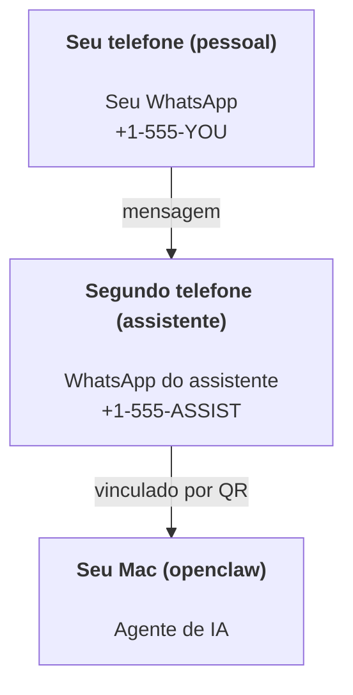

---
read_when:
    - Integração de uma nova instância do assistente
    - Revisando as implicações de segurança e permissões
summary: Guia completo para executar o OpenClaw como assistente pessoal, com precauções de segurança
title: Configuração do assistente pessoal
x-i18n:
    generated_at: "2026-07-12T15:41:59Z"
    model: gpt-5.6
    postprocess_version: locale-links-v1
    prompt_version: 15
    provider: openai
    source_hash: e8c34e31314f55647059fd600935330110add27b338a675bc0ce1529bebb207d
    source_path: start/openclaw.md
    workflow: 16
---

OpenClaw é um Gateway auto-hospedado que conecta Discord, Google Chat, iMessage, Matrix, Microsoft Teams, Signal, Slack, Telegram, WhatsApp, Zalo e outros serviços a agentes de IA. Este guia aborda a configuração de "assistente pessoal": um número dedicado do WhatsApp que funciona como seu assistente de IA sempre disponível.

## Segurança em primeiro lugar

Dar a um agente acesso a um canal o coloca em posição de executar comandos na sua máquina (dependendo da sua política de ferramentas), ler/gravar arquivos no seu espaço de trabalho e enviar mensagens por qualquer canal conectado. Comece de forma conservadora:

- Sempre defina `channels.whatsapp.allowFrom` (nunca permita acesso aberto ao público no seu Mac pessoal).
- Use um número dedicado do WhatsApp para o assistente.
- Por padrão, os Heartbeats ocorrem a cada 30 minutos. Desative-os até confiar na configuração, definindo `agents.defaults.heartbeat.every: "0m"`.

## Pré-requisitos

- OpenClaw instalado e configurado — consulte [Primeiros passos](/pt-BR/start/getting-started) se ainda não tiver feito isso
- Um segundo número de telefone (SIM/eSIM/pré-pago) para o assistente

## Configuração com dois telefones (recomendada)

O objetivo é este:



Se você vincular seu WhatsApp pessoal ao OpenClaw, cada mensagem recebida se tornará uma "entrada do agente". Raramente é isso que você deseja.

## Início rápido em 5 minutos

1. Emparelhe o WhatsApp Web (exibe o código QR; escaneie-o com o telefone do assistente):

```bash
openclaw channels login
```

2. Inicie o Gateway (mantenha-o em execução):

```bash
openclaw gateway --port 18789
```

3. Coloque uma configuração mínima em `~/.openclaw/openclaw.json`:

```json5
{
  gateway: { mode: "local" },
  channels: { whatsapp: { allowFrom: ["+15555550123"] } },
}
```

Agora envie uma mensagem para o número do assistente usando o telefone incluído na lista de permissões.

Quando a configuração inicial for concluída, o OpenClaw abrirá automaticamente o painel e exibirá um link simples (sem token). Se o painel solicitar autenticação, cole o segredo compartilhado configurado nas configurações da Control UI. Por padrão, a configuração inicial usa um token (`gateway.auth.token`), mas a autenticação por senha também funciona caso você tenha alterado `gateway.auth.mode` para `password`. Para reabrir posteriormente: `openclaw dashboard`.

## Dê ao agente um espaço de trabalho (AGENTS)

O OpenClaw lê instruções operacionais e a "memória" no diretório do seu espaço de trabalho.

Por padrão, o OpenClaw usa `~/.openclaw/workspace` como espaço de trabalho do agente e o cria automaticamente (junto com os arquivos iniciais `AGENTS.md`, `SOUL.md`, `TOOLS.md`, `IDENTITY.md`, `USER.md` e `HEARTBEAT.md`) durante a configuração inicial ou na primeira execução do agente. `BOOTSTRAP.md` só é criado para um espaço de trabalho totalmente novo e não deve reaparecer após ser excluído. `MEMORY.md` é opcional e nunca é criado automaticamente; quando presente, é carregado nas sessões normais. As sessões de subagentes injetam apenas `AGENTS.md` e `TOOLS.md`.

<Tip>
Trate esta pasta como a memória do OpenClaw e transforme-a em um repositório git (de preferência privado) para manter backups do seu `AGENTS.md` e dos arquivos de memória. Se o git estiver instalado, espaços de trabalho totalmente novos serão inicializados automaticamente com `git init`.
</Tip>

Para criar as pastas do espaço de trabalho e de configuração sem executar o assistente completo de configuração inicial:

```bash
openclaw setup --baseline
```

(`openclaw setup` sem argumentos é um alias de `openclaw onboard` e executa o assistente interativo completo.)

Layout completo do espaço de trabalho e guia de backup: [Espaço de trabalho do agente](/pt-BR/concepts/agent-workspace)
Fluxo de trabalho da memória: [Memória](/pt-BR/concepts/memory)

Opcional: escolha outro espaço de trabalho com `agents.defaults.workspace` (compatível com `~`).

```json5
{
  agents: {
    defaults: {
      workspace: "~/.openclaw/workspace",
    },
  },
}
```

Se você já distribui seus próprios arquivos de espaço de trabalho a partir de um repositório, pode desativar completamente a criação de arquivos de bootstrap:

```json5
{
  agents: {
    defaults: {
      skipBootstrap: true,
    },
  },
}
```

## A configuração que o transforma em "um assistente"

O OpenClaw vem por padrão com uma boa configuração de assistente, mas normalmente você desejará ajustar:

- persona/instruções em [`SOUL.md`](/pt-BR/concepts/soul)
- configurações padrão de raciocínio (se desejado)
- Heartbeats (quando você confiar nele)

Exemplo:

```json5
{
  logging: { level: "info" },
  agents: {
    defaults: {
      model: { primary: "anthropic/claude-opus-4-8" },
      workspace: "~/.openclaw/workspace",
      thinkingDefault: "high",
      timeoutSeconds: 1800,
      // Comece com 0; habilite depois.
      heartbeat: { every: "0m" },
    },
    list: [
      {
        id: "main",
        default: true,
        groupChat: {
          mentionPatterns: ["@openclaw", "openclaw"],
        },
      },
    ],
  },
  channels: {
    whatsapp: {
      allowFrom: ["+15555550123"],
      groups: {
        "*": { requireMention: true },
      },
    },
  },
  session: {
    scope: "per-sender",
    resetTriggers: ["/new", "/reset"],
    reset: {
      mode: "daily",
      atHour: 4,
      idleMinutes: 10080,
    },
  },
}
```

## Sessões e memória

- Registros de sessão, registros de transcrição e metadados (uso de tokens, última rota etc.): `~/.openclaw/agents/<agentId>/agent/openclaw-agent.sqlite`
- Artefatos legados/arquivados de transcrição: `~/.openclaw/agents/<agentId>/sessions/`
- Origem da migração de registros legados: `~/.openclaw/agents/<agentId>/sessions/sessions.json`
- `/new` ou `/reset` inicia uma nova sessão para esse chat (configurável por meio de `session.resetTriggers`). Se enviado isoladamente, o OpenClaw confirma a redefinição sem invocar o modelo.
- `/compact [instructions]` compacta o contexto da sessão e informa o orçamento de contexto restante.

## Heartbeats (modo proativo)

Por padrão, o OpenClaw executa um Heartbeat a cada 30 minutos com o prompt:
`Read HEARTBEAT.md if it exists (workspace context). Follow it strictly. Do not infer or repeat old tasks from prior chats. If nothing needs attention, reply HEARTBEAT_OK.`
Defina `agents.defaults.heartbeat.every: "0m"` para desativá-lo.

- Se `HEARTBEAT.md` existir, mas estiver efetivamente vazio (contendo apenas linhas em branco, comentários Markdown/HTML, cabeçalhos Markdown como `# Heading`, marcadores de cercas ou itens de checklist vazios), o OpenClaw ignora a execução do Heartbeat para economizar chamadas de API.
- Se o arquivo estiver ausente, o Heartbeat ainda será executado, e o modelo decidirá o que fazer.
- Se o agente responder com `HEARTBEAT_OK` (opcionalmente com um pequeno preenchimento; consulte `agents.defaults.heartbeat.ackMaxChars`), o OpenClaw suprimirá a entrega de saída desse Heartbeat.
- Por padrão, é permitida a entrega de Heartbeats para destinos de mensagem direta no formato `user:<id>`. Defina `agents.defaults.heartbeat.directPolicy: "block"` para suprimir a entrega a destinos diretos, mantendo as execuções de Heartbeat ativas.
- Os Heartbeats executam turnos completos do agente — intervalos mais curtos consomem mais tokens.

```json5
{
  agents: {
    defaults: {
      heartbeat: { every: "30m" },
    },
  },
}
```

## Entrada e saída de mídia

Anexos recebidos (imagens/áudio/documentos) podem ser disponibilizados ao seu comando por meio de modelos:

- `{{MediaPath}}` (caminho do arquivo temporário local)
- `{{MediaUrl}}` (pseudo-URL)
- `{{Transcript}}` (se a transcrição de áudio estiver habilitada)

Os anexos enviados pelo agente usam campos de mídia estruturados na ferramenta de mensagens ou no payload de resposta, como `media`, `mediaUrl`, `mediaUrls`, `path` ou `filePath`. Exemplo de argumentos da ferramenta de mensagens:

```json
{
  "message": "Aqui está a captura de tela.",
  "mediaUrl": "https://example.com/screenshot.png"
}
```

O OpenClaw envia a mídia estruturada junto com o texto. Respostas finais legadas do assistente ainda podem ser normalizadas para fins de compatibilidade, mas a saída de ferramentas, a saída do navegador, os blocos de streaming e as ações de mensagem não interpretam texto como comandos de anexo.

O comportamento dos caminhos locais segue o mesmo modelo de confiança de leitura de arquivos do agente:

- Se `tools.fs.workspaceOnly` for `true`, os caminhos de mídia local de saída permanecerão restritos à raiz temporária do OpenClaw, ao cache de mídia, aos caminhos do espaço de trabalho do agente e aos arquivos gerados pelo sandbox.
- Se `tools.fs.workspaceOnly` for `false`, a mídia local de saída poderá usar arquivos locais do host que o agente já tem permissão para ler.
- Os caminhos locais podem ser absolutos, relativos ao espaço de trabalho ou relativos ao diretório pessoal com `~/`.
- Os envios de arquivos locais do host continuam permitindo somente mídia e tipos de documentos seguros (imagens, áudio, vídeo, PDF, documentos do Office e documentos de texto validados, como Markdown/MD, TXT, JSON, YAML e YML). Isso é uma extensão do limite de confiança existente para leitura do host, não um verificador de segredos: se o agente puder ler um arquivo local do host `secret.txt` ou `config.json`, ele poderá anexá-lo quando a extensão e a validação do conteúdo forem compatíveis.

Mantenha arquivos confidenciais fora do sistema de arquivos acessível pelo agente ou mantenha `tools.fs.workspaceOnly: true` para aplicar restrições mais rigorosas aos envios por caminho local.

## Lista de verificação operacional

```bash
openclaw status          # status local (credenciais, sessões, eventos na fila)
openclaw status --all    # diagnóstico completo (somente leitura, pronto para colar)
openclaw status --deep   # verifica os canais (WhatsApp Web + Telegram + Discord + Slack + Signal)
openclaw health --json   # instantâneo da integridade do gateway pela conexão WS
```

Os logs ficam em `/tmp/openclaw/` (padrão: `openclaw-YYYY-MM-DD.log`).

## Próximas etapas

- WebChat: [WebChat](/pt-BR/web/webchat)
- Operações do Gateway: [Manual operacional do Gateway](/pt-BR/gateway)
- Cron + despertares: [Tarefas Cron](/pt-BR/automation/cron-jobs)
- Aplicativo complementar na barra de menus do macOS: [Aplicativo OpenClaw para macOS](/pt-BR/platforms/macos)
- Aplicativo Node para iOS: [Aplicativo para iOS](/pt-BR/platforms/ios)
- Aplicativo Node para Android: [Aplicativo para Android](/pt-BR/platforms/android)
- Hub do Windows: [Windows](/pt-BR/platforms/windows)
- Status no Linux: [Aplicativo para Linux](/pt-BR/platforms/linux)
- Segurança: [Segurança](/pt-BR/gateway/security)

## Relacionados

- [Primeiros passos](/pt-BR/start/getting-started)
- [Configuração](/pt-BR/start/setup)
- [Visão geral dos canais](/pt-BR/channels)
