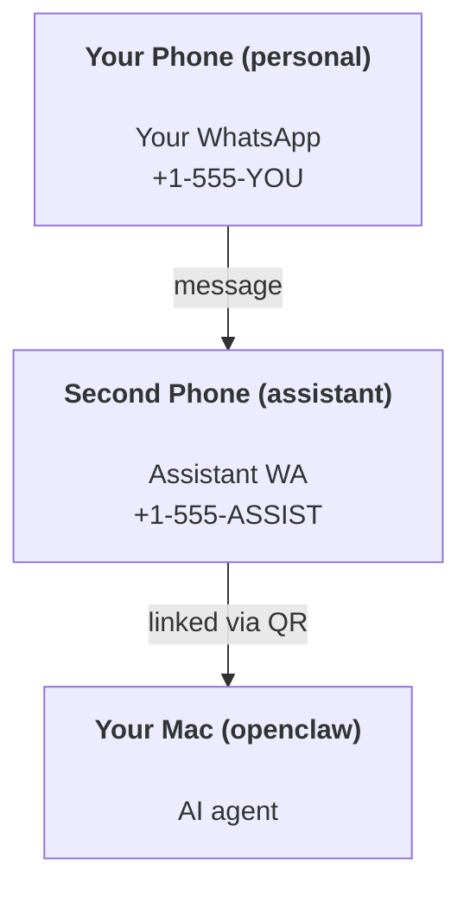

---
read_when:
    - Integração de uma nova instância de assistente
    - Analisando as implicações de segurança e permissões
summary: Guia de ponta a ponta para executar o OpenClaw como assistente pessoal com precauções de segurança
title: Configuração do assistente pessoal
x-i18n:
    generated_at: "2026-05-02T22:22:20Z"
    model: gpt-5.5
    provider: openai
    source_hash: 9f6087d0756c98741166135df8b915eb5a0803b23e68e486d2d25ec98d4dca79
    source_path: start/openclaw.md
    workflow: 16
---

# Criando um assistente pessoal com OpenClaw

OpenClaw é um Gateway auto-hospedado que conecta Discord, Google Chat, iMessage, Matrix, Microsoft Teams, Signal, Slack, Telegram, WhatsApp, Zalo e mais a agentes de IA. Este guia cobre a configuração de "assistente pessoal": um número dedicado do WhatsApp que se comporta como seu assistente de IA sempre ativo.

## ⚠️ Segurança em primeiro lugar

Você está colocando um agente em uma posição para:

- executar comandos na sua máquina (dependendo da sua política de ferramentas)
- ler/gravar arquivos no seu workspace
- enviar mensagens de volta via WhatsApp/Telegram/Discord/Mattermost e outros canais incluídos

Comece de forma conservadora:

- Sempre defina `channels.whatsapp.allowFrom` (nunca rode aberto para o mundo no seu Mac pessoal).
- Use um número dedicado do WhatsApp para o assistente.
- Heartbeats agora têm como padrão a cada 30 minutos. Desative até confiar na configuração definindo `agents.defaults.heartbeat.every: "0m"`.

## Pré-requisitos

- OpenClaw instalado e configurado — veja [Primeiros passos](/pt-BR/start/getting-started) se ainda não fez isso
- Um segundo número de telefone (SIM/eSIM/pré-pago) para o assistente

## A configuração com dois telefones (recomendada)

Você quer isto:



Se você vincular seu WhatsApp pessoal ao OpenClaw, toda mensagem para você vira “entrada do agente”. Isso raramente é o que você quer.

## Início rápido em 5 minutos

1. Pareie o WhatsApp Web (mostra o QR; escaneie com o telefone do assistente):

```bash
openclaw channels login
```

2. Inicie o Gateway (deixe em execução):

```bash
openclaw gateway --port 18789
```

3. Coloque uma configuração mínima em `~/.openclaw/openclaw.json`:

```json5
{
  gateway: { mode: "local" },
  channels: { whatsapp: { allowFrom: ["+15555550123"] } },
}
```

Agora envie uma mensagem para o número do assistente a partir do telefone na lista de permissão.

Quando a configuração inicial termina, o OpenClaw abre automaticamente o dashboard e imprime um link limpo (sem token). Se o dashboard solicitar autenticação, cole o segredo compartilhado configurado nas configurações da Control UI. A configuração inicial usa um token por padrão (`gateway.auth.token`), mas autenticação por senha também funciona se você tiver alterado `gateway.auth.mode` para `password`. Para reabrir depois: `openclaw dashboard`.

## Dê um workspace ao agente (AGENTS)

OpenClaw lê instruções operacionais e “memória” a partir do diretório de workspace.

Por padrão, OpenClaw usa `~/.openclaw/workspace` como workspace do agente e vai criá-lo (além de `AGENTS.md`, `SOUL.md`, `TOOLS.md`, `IDENTITY.md`, `USER.md`, `HEARTBEAT.md` iniciais) automaticamente na configuração/primeira execução do agente. `BOOTSTRAP.md` só é criado quando o workspace é totalmente novo (ele não deve voltar depois que você o excluir). `MEMORY.md` é opcional (não é criado automaticamente); quando presente, ele é carregado para sessões normais. Sessões de subagentes só injetam `AGENTS.md` e `TOOLS.md`.

<Tip>
Trate esta pasta como a memória do OpenClaw e transforme-a em um repositório git (idealmente privado) para que seu `AGENTS.md` e arquivos de memória tenham backup. Se git estiver instalado, workspaces recém-criados são inicializados automaticamente.
</Tip>

```bash
openclaw setup
```

Layout completo do workspace + guia de backup: [Workspace do agente](/pt-BR/concepts/agent-workspace)
Fluxo de trabalho de memória: [Memória](/pt-BR/concepts/memory)

Opcional: escolha um workspace diferente com `agents.defaults.workspace` (compatível com `~`).

```json5
{
  agents: {
    defaults: {
      workspace: "~/.openclaw/workspace",
    },
  },
}
```

Se você já distribui seus próprios arquivos de workspace a partir de um repositório, pode desativar totalmente a criação de arquivos de bootstrap:

```json5
{
  agents: {
    defaults: {
      skipBootstrap: true,
    },
  },
}
```

## A configuração que transforma isso em "um assistente"

OpenClaw usa como padrão uma boa configuração de assistente, mas geralmente você vai querer ajustar:

- persona/instruções em [`SOUL.md`](/pt-BR/concepts/soul)
- padrões de raciocínio (se desejar)
- heartbeats (quando confiar nele)

Exemplo:

```json5
{
  logging: { level: "info" },
  agent: {
    model: "anthropic/claude-opus-4-6",
    workspace: "~/.openclaw/workspace",
    thinkingDefault: "high",
    timeoutSeconds: 1800,
    // Start with 0; enable later.
    heartbeat: { every: "0m" },
  },
  channels: {
    whatsapp: {
      allowFrom: ["+15555550123"],
      groups: {
        "*": { requireMention: true },
      },
    },
  },
  routing: {
    groupChat: {
      mentionPatterns: ["@openclaw", "openclaw"],
    },
  },
  session: {
    scope: "per-sender",
    resetTriggers: ["/new", "/reset"],
    reset: {
      mode: "daily",
      atHour: 4,
      idleMinutes: 10080,
    },
  },
}
```

## Sessões e memória

- Arquivos de sessão: `~/.openclaw/agents/<agentId>/sessions/{{SessionId}}.jsonl`
- Metadados de sessão (uso de tokens, última rota etc.): `~/.openclaw/agents/<agentId>/sessions/sessions.json` (legado: `~/.openclaw/sessions/sessions.json`)
- `/new` ou `/reset` inicia uma nova sessão para esse chat (configurável via `resetTriggers`). Se enviado sozinho, OpenClaw confirma a redefinição sem invocar o modelo.
- `/compact [instructions]` compacta o contexto da sessão e informa o orçamento de contexto restante.

## Heartbeats (modo proativo)

Por padrão, OpenClaw executa um heartbeat a cada 30 minutos com o prompt:
`Read HEARTBEAT.md if it exists (workspace context). Follow it strictly. Do not infer or repeat old tasks from prior chats. If nothing needs attention, reply HEARTBEAT_OK.`
Defina `agents.defaults.heartbeat.every: "0m"` para desativar.

- Se `HEARTBEAT.md` existir, mas estiver efetivamente vazio (apenas linhas em branco e cabeçalhos Markdown como `# Heading`), OpenClaw pula a execução do heartbeat para economizar chamadas de API.
- Se o arquivo estiver ausente, o heartbeat ainda roda e o modelo decide o que fazer.
- Se o agente responder com `HEARTBEAT_OK` (opcionalmente com preenchimento curto; veja `agents.defaults.heartbeat.ackMaxChars`), OpenClaw suprime a entrega externa desse heartbeat.
- Por padrão, a entrega de heartbeat para destinos estilo DM `user:<id>` é permitida. Defina `agents.defaults.heartbeat.directPolicy: "block"` para suprimir entrega a destinos diretos enquanto mantém as execuções de heartbeat ativas.
- Heartbeats executam turnos completos do agente — intervalos mais curtos consomem mais tokens.

```json5
{
  agent: {
    heartbeat: { every: "30m" },
  },
}
```

## Mídia de entrada e saída

Anexos de entrada (imagens/áudio/documentos) podem ser expostos ao seu comando via templates:

- `{{MediaPath}}` (caminho do arquivo temporário local)
- `{{MediaUrl}}` (pseudo-URL)
- `{{Transcript}}` (se a transcrição de áudio estiver ativada)

Anexos de saída do agente: inclua `MEDIA:<path-or-url>` em uma linha própria (sem espaços). Exemplo:

```
Here’s the screenshot.
MEDIA:https://example.com/screenshot.png
```

OpenClaw extrai esses itens e os envia como mídia junto com o texto.

O comportamento de caminhos locais segue o mesmo modelo de confiança de leitura de arquivos do agente:

- Se `tools.fs.workspaceOnly` for `true`, caminhos locais `MEDIA:` de saída permanecem restritos à raiz temporária do OpenClaw, ao cache de mídia, aos caminhos do workspace do agente e a arquivos gerados pelo sandbox.
- Se `tools.fs.workspaceOnly` for `false`, `MEDIA:` de saída pode usar arquivos locais do host que o agente já tem permissão para ler.
- Caminhos locais podem ser absolutos, relativos ao workspace ou relativos ao diretório home com `~/`.
- Envios locais do host ainda permitem apenas mídia e tipos seguros de documentos (imagens, áudio, vídeo, PDF e documentos do Office). Arquivos de texto simples e arquivos com aparência de segredo não são tratados como mídia enviável.

Isso significa que imagens/arquivos gerados fora do workspace agora podem ser enviados quando sua política de fs já permite essas leituras, sem reabrir a exfiltração arbitrária de anexos de texto do host.

## Checklist de operações

```bash
openclaw status          # local status (creds, sessions, queued events)
openclaw status --all    # full diagnosis (read-only, pasteable)
openclaw status --deep   # asks the gateway for a live health probe with channel probes when supported
openclaw health --json   # gateway health snapshot (WS; default can return a fresh cached snapshot)
```

Os logs ficam em `/tmp/openclaw/` (padrão: `openclaw-YYYY-MM-DD.log`).

## Próximos passos

- WebChat: [WebChat](/pt-BR/web/webchat)
- Operações do Gateway: [Runbook do Gateway](/pt-BR/gateway)
- Cron + despertares: [Jobs Cron](/pt-BR/automation/cron-jobs)
- Companion da barra de menus do macOS: [App OpenClaw para macOS](/pt-BR/platforms/macos)
- App de node para iOS: [App para iOS](/pt-BR/platforms/ios)
- App de node para Android: [App para Android](/pt-BR/platforms/android)
- Status do Windows: [Windows (WSL2)](/pt-BR/platforms/windows)
- Status do Linux: [App para Linux](/pt-BR/platforms/linux)
- Segurança: [Segurança](/pt-BR/gateway/security)

## Relacionado

- [Primeiros passos](/pt-BR/start/getting-started)
- [Configuração](/pt-BR/start/setup)
- [Visão geral dos canais](/pt-BR/channels)
