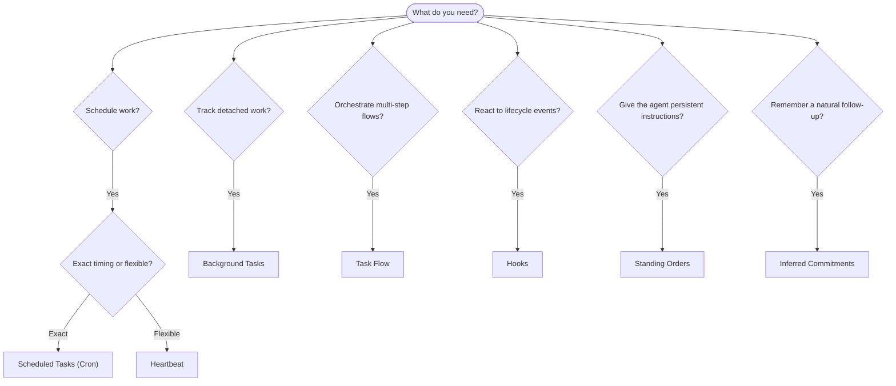

OpenClaw выполняет работу в фоне через задачи, запланированные задания, выводимые
обязательства, хуки событий и постоянные инструкции. Эта страница помогает выбрать
подходящий механизм и понять, как они сочетаются друг с другом.

## Краткое руководство по выбору

| Сценарий использования                              | Рекомендуется                   | Почему                                              |
| --------------------------------------------------- | ------------------------------- | --------------------------------------------------- |
| Отправлять ежедневный отчет ровно в 9:00            | Запланированные задачи (Cron)   | Точное время, изолированное выполнение              |
| Напомнить мне через 20 минут                        | Запланированные задачи (Cron)   | Однократное выполнение с точным временем (`--at`)   |
| Запускать еженедельный глубокий анализ              | Запланированные задачи (Cron)   | Автономная задача, можно использовать другую модель |
| Проверять входящие каждые 30 минут                  | Heartbeat                       | Пакетная обработка с другими проверками, с контекстом |
| Отслеживать в календаре предстоящие события         | Heartbeat                       | Естественно подходит для периодической осведомленности |
| Проверить статус после упомянутого собеседования    | Выводимые обязательства         | Похожее на память последующее действие, без запроса точного напоминания |
| Мягкая проверка самочувствия после контекста пользователя | Выводимые обязательства    | Ограничено тем же агентом и каналом                 |
| Проверить статус субагента или запуска ACP          | Фоновые задачи                  | Журнал задач отслеживает всю отделенную работу      |
| Проверить, что запускалось и когда                  | Фоновые задачи                  | `openclaw tasks list` и `openclaw tasks audit`      |
| Многошаговое исследование с последующим резюме      | Task Flow                       | Надежная оркестрация с отслеживанием редакций       |
| Запустить скрипт при сбросе сессии                  | Хуки                            | Управляется событиями, срабатывает на события жизненного цикла |
| Выполнять код при каждом вызове инструмента         | Plugin-хуки                     | Внутрипроцессные хуки могут перехватывать вызовы инструментов |
| Всегда проверять соответствие требованиям перед ответом | Постоянные инструкции       | Автоматически внедряются в каждую сессию            |

### Запланированные задачи (Cron) и Heartbeat

| Измерение        | Запланированные задачи (Cron)        | Heartbeat                              |
| ---------------- | ------------------------------------ | -------------------------------------- |
| Время            | Точное (cron-выражения, однократно)  | Приблизительное (по умолчанию каждые 30 мин) |
| Контекст сессии  | Новый (изолированный) или общий      | Полный контекст основной сессии        |
| Записи задач     | Всегда создаются                     | Никогда не создаются                   |
| Доставка         | Канал, webhook или без уведомления   | Встроенно в основную сессию            |
| Лучше всего для  | Отчетов, напоминаний, фоновых заданий | Проверок входящих, календаря, уведомлений |

Используйте запланированные задачи (Cron), когда нужно точное время или изолированное выполнение. Используйте Heartbeat, когда работе полезен полный контекст сессии и подходит приблизительное время.

## Основные понятия

### Запланированные задачи (cron)

Cron — встроенный планировщик Gateway для точного времени. Он сохраняет задания, пробуждает агента в нужный момент и может доставлять вывод в чат-канал или webhook endpoint. Поддерживает однократные напоминания, повторяющиеся выражения и триггеры входящих webhook.

См. [Запланированные задачи](/ru/automation/cron-jobs).

### Задачи

Журнал фоновых задач отслеживает всю отделенную работу: запуски ACP, создание субагентов, изолированные выполнения cron и операции CLI. Задачи — это записи, а не планировщики. Используйте `openclaw tasks list` и `openclaw tasks audit`, чтобы их просматривать.

См. [Фоновые задачи](/ru/automation/tasks).

### Выводимые обязательства

Обязательства — это включаемые вручную, краткоживущие воспоминания для последующих действий. OpenClaw выводит их
из обычных разговоров, ограничивает тем же агентом и каналом и
доставляет наступившие проверки через heartbeat. Точные напоминания, запрошенные пользователем, по-прежнему
относятся к cron.

См. [Выводимые обязательства](/ru/concepts/commitments).

### Task Flow

Task Flow — это слой оркестрации потоков поверх фоновых задач. Он управляет надежными многошаговыми потоками с управляемыми и зеркалируемыми режимами синхронизации, отслеживанием редакций и `openclaw tasks flow list|show|cancel` для просмотра.

См. [Task Flow](/ru/automation/taskflow).

### Постоянные инструкции

Постоянные инструкции предоставляют агенту постоянные рабочие полномочия для определенных программ. Они находятся в файлах рабочей области (обычно `AGENTS.md`) и внедряются в каждую сессию. Сочетайте их с cron для выполнения по расписанию.

См. [Постоянные инструкции](/ru/automation/standing-orders).

### Хуки

Внутренние хуки — это управляемые событиями скрипты, запускаемые событиями жизненного цикла агента
(`/new`, `/reset`, `/stop`), Compaction сессии, запуском Gateway и потоком сообщений.
Они автоматически обнаруживаются в каталогах, и ими можно управлять
с помощью `openclaw hooks`. Для внутрипроцессного перехвата вызовов инструментов используйте
[Plugin-хуки](/ru/plugins/hooks).

См. [Хуки](/ru/automation/hooks).

### Heartbeat

Heartbeat — это периодический ход основной сессии (по умолчанию каждые 30 минут). Он пакетно выполняет несколько проверок (входящие, календарь, уведомления) за один ход агента с полным контекстом сессии. Ходы Heartbeat не создают записей задач и не продлевают свежесть ежедневного/неактивного сброса сессии. Используйте `HEARTBEAT.md` для небольшого контрольного списка или блок `tasks:`, если нужны периодические проверки только наступивших задач внутри самого heartbeat. Пустые файлы heartbeat пропускаются как `empty-heartbeat-file`; режим задач только по сроку пропускается как `no-tasks-due`. Heartbeat откладывается, пока работа cron активна или находится в очереди, а `heartbeat.skipWhenBusy` также может отложить агента, пока заняты привязанный к ключу сессии субагент этого же агента или вложенные линии выполнения.

См. [Heartbeat](/ru/gateway/heartbeat).

## Как они работают вместе

- **Cron** обрабатывает точные расписания (ежедневные отчеты, еженедельные обзоры) и однократные напоминания. Все выполнения cron создают записи задач.
- **Heartbeat** выполняет регулярный мониторинг (входящие, календарь, уведомления) одним пакетным ходом каждые 30 минут.
- **Хуки** реагируют на конкретные события (сбросы сессии, Compaction, поток сообщений) с помощью пользовательских скриптов. Plugin-хуки покрывают вызовы инструментов.
- **Постоянные инструкции** дают агенту постоянный контекст и границы полномочий.
- **Task Flow** координирует многошаговые потоки поверх отдельных задач.
- **Задачи** автоматически отслеживают всю отделенную работу, чтобы ее можно было просматривать и аудировать.

## Связанные материалы

- [Запланированные задачи](/ru/automation/cron-jobs) — точное планирование и однократные напоминания
- [Выводимые обязательства](/ru/concepts/commitments) — последующие проверки, похожие на память
- [Фоновые задачи](/ru/automation/tasks) — журнал задач для всей отделенной работы
- [Task Flow](/ru/automation/taskflow) — надежная оркестрация многошаговых потоков
- [Хуки](/ru/automation/hooks) — управляемые событиями скрипты жизненного цикла
- [Plugin-хуки](/ru/plugins/hooks) — внутрипроцессные хуки инструментов, prompts, сообщений и жизненного цикла
- [Постоянные инструкции](/ru/automation/standing-orders) — постоянные инструкции агента
- [Heartbeat](/ru/gateway/heartbeat) — периодические ходы основной сессии
- [Справочник конфигурации](/ru/gateway/configuration-reference) — все ключи конфигурации
