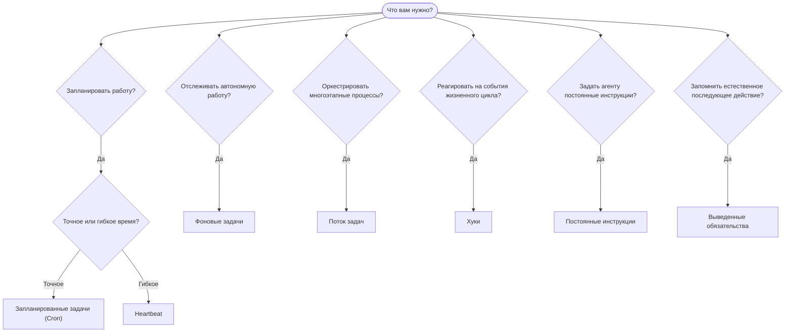

OpenClaw выполняет работу в фоновом режиме с помощью задач, запланированных заданий, выведенных
обязательств, хуков событий и постоянных инструкций. Используйте эту страницу, чтобы выбрать
подходящий механизм.

## Краткое руководство по выбору

| Сценарий использования                                 | Рекомендуемый механизм       | Причина                                                     |
| ------------------------------------------------------ | ---------------------------- | ----------------------------------------------------------- |
| Отправлять ежедневный отчёт ровно в 9 утра             | Запланированные задачи (Cron) | Точное время, изолированное выполнение                      |
| Напомнить мне через 20 минут                            | Запланированные задачи (Cron) | Однократный запуск в точное время (`--at`)      |
| Выполнять еженедельный глубокий анализ                  | Запланированные задачи (Cron) | Автономная задача, можно использовать другую модель         |
| Проверять входящие каждые 30 мин                        | Heartbeat                    | Объединяется с другими проверками, учитывает контекст        |
| Следить за календарём и предстоящими событиями          | Heartbeat                    | Естественный выбор для периодического отслеживания          |
| Связаться после упомянутого собеседования               | Выведенные обязательства     | Последующее действие как элемент памяти, без точного запроса напоминания |
| Деликатно узнать о состоянии пользователя с учётом контекста | Выведенные обязательства | Ограничено тем же агентом и каналом                         |
| Проверить состояние субагента или запуска ACP           | Фоновые задачи               | Реестр задач отслеживает всю автономную работу               |
| Проверить, что и когда выполнялось                      | Фоновые задачи               | `openclaw tasks list` и `openclaw tasks audit`                     |
| Провести многоэтапное исследование, затем подвести итог | Поток задач                  | Надёжная оркестрация с отслеживанием ревизий                 |
| Запускать скрипт при сбросе сеанса                      | Хуки                         | Срабатывают по событиям жизненного цикла                     |
| Выполнять код при каждом вызове инструмента             | Хуки плагина                 | Внутрипроцессные хуки могут перехватывать вызовы инструментов |
| Всегда проверять соответствие требованиям перед ответом | Постоянные инструкции        | Автоматически внедряются в каждый сеанс                      |

### Запланированные задачи (Cron) и Heartbeat

| Характеристика  | Запланированные задачи (Cron)       | Heartbeat                                  |
| --------------- | ----------------------------------- | ------------------------------------------ |
| Время запуска   | Точное (cron-выражения, однократный запуск) | Приблизительное (по умолчанию каждые 30 мин) |
| Контекст сеанса | Новый (изолированный) или общий     | Полный контекст основного сеанса           |
| Записи задач    | Создаются всегда                    | Никогда не создаются                       |
| Доставка        | Канал, webhook или без уведомления  | В основном сеансе                          |
| Лучше всего для | Отчётов, напоминаний, фоновых заданий | Проверки входящих, календаря и уведомлений |

Используйте запланированные задачи (Cron), когда требуется точное время или изолированное выполнение. Используйте Heartbeat, когда для работы полезен полный контекст сеанса и допустимо приблизительное время запуска.

## Основные понятия

### Запланированные задачи (cron)

Cron — встроенный планировщик Gateway для точного времени запуска. Он сохраняет задания, активирует агента в нужный момент и может доставлять результат в канал чата или конечную точку webhook. Поддерживает однократные напоминания, повторяющиеся выражения и входящие триггеры webhook.

См. [Запланированные задачи](/ru/automation/cron-jobs).

### Задачи

Реестр фоновых задач отслеживает всю автономную работу: запуски ACP, создание субагентов, изолированные выполнения cron и операции CLI. Задачи являются записями, а не планировщиками. Для их просмотра используйте `openclaw tasks list` и `openclaw tasks audit`.

См. [Фоновые задачи](/ru/automation/tasks).

### Выведенные обязательства

Обязательства — это включаемые пользователем краткосрочные воспоминания о последующих действиях. OpenClaw выводит их
из обычных разговоров, ограничивает тем же агентом и каналом и
доставляет наступившие проверки через Heartbeat. Запрошенные пользователем напоминания с точным временем по-прежнему
относятся к cron.

См. [Выведенные обязательства](/ru/concepts/commitments).

### Поток задач

Поток задач — это слой оркестрации процессов над фоновыми задачами. Он управляет надёжными многоэтапными процессами с управляемым и зеркальным режимами синхронизации, отслеживанием ревизий и `openclaw tasks flow list|show|cancel` для просмотра.

См. [Поток задач](/ru/automation/taskflow).

### Постоянные инструкции

Постоянные инструкции предоставляют агенту постоянные полномочия для выполнения определённых программ. Они хранятся в файлах рабочего пространства (обычно `AGENTS.md`) и внедряются в каждый сеанс. Для выполнения по времени сочетайте их с cron.

См. [Постоянные инструкции](/ru/automation/standing-orders).

### Хуки

Внутренние хуки — это управляемые событиями скрипты, запускаемые событиями жизненного цикла агента
(`/new`, `/reset`, `/stop`), Compaction сеанса, запуском Gateway и потоком
сообщений. Они обнаруживаются в каталогах хуков и управляются с помощью
`openclaw hooks`. Для внутрипроцессного перехвата вызовов инструментов используйте
[хуки плагина](/ru/plugins/hooks).

См. [Хуки](/ru/automation/hooks).

### Heartbeat

Heartbeat — это периодический ход основного сеанса (по умолчанию каждые 30 минут). Он объединяет несколько проверок (входящие, календарь, уведомления) в один ход агента с полным контекстом сеанса. Ходы Heartbeat не создают записи задач и не продлевают период актуальности до ежедневного сброса или сброса неактивного сеанса. Используйте `HEARTBEAT.md` для небольшого контрольного списка или блок `tasks:`, если хотите выполнять внутри самого Heartbeat только проверки с наступившим сроком. Пустые файлы Heartbeat пропускаются как `empty-heartbeat-file`; режим задач только с наступившим сроком пропускается как `no-tasks-due`. Heartbeat откладывается, пока работа cron активна или находится в очереди, а `heartbeat.skipWhenBusy` также может отложить работу агента, пока заняты привязанный к сеансу субагент этого же агента или вложенные линии выполнения.

См. [Heartbeat](/ru/gateway/heartbeat).

## Как они работают вместе

- **Cron** обрабатывает точные расписания (ежедневные отчёты, еженедельные обзоры) и однократные напоминания. Все выполнения cron создают записи задач.
- **Heartbeat** выполняет регулярный мониторинг (входящие, календарь, уведомления) одним объединённым ходом каждые 30 минут.
- **Хуки** реагируют на определённые события (сбросы сеанса, Compaction, поток сообщений) с помощью пользовательских скриптов. Хуки плагина охватывают вызовы инструментов.
- **Постоянные инструкции** задают агенту постоянный контекст и границы полномочий.
- **Поток задач** координирует многоэтапные процессы над отдельными задачами.
- **Задачи** автоматически отслеживают всю автономную работу, чтобы её можно было просматривать и проверять.

## Связанные материалы

- [Запланированные задачи](/ru/automation/cron-jobs) — точное планирование и однократные напоминания
- [Выведенные обязательства](/ru/concepts/commitments) — последующие проверки, подобные элементам памяти
- [Фоновые задачи](/ru/automation/tasks) — реестр всей автономной работы
- [Поток задач](/ru/automation/taskflow) — надёжная оркестрация многоэтапных процессов
- [Хуки](/ru/automation/hooks) — управляемые событиями скрипты жизненного цикла
- [Хуки плагина](/ru/plugins/hooks) — внутрипроцессные хуки инструментов, запросов, сообщений и жизненного цикла
- [Постоянные инструкции](/ru/automation/standing-orders) — постоянные инструкции агента
- [Heartbeat](/ru/gateway/heartbeat) — периодические ходы основного сеанса
- [Справочник по конфигурации](/ru/gateway/configuration-reference) — все ключи конфигурации
