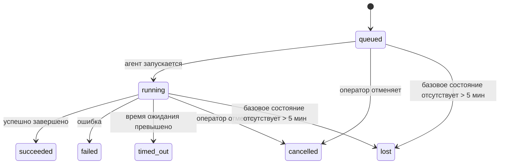

---
read_when:
    - Проверка выполняющихся или недавно завершённых фоновых задач
    - Отладка сбоев доставки для отсоединённых запусков агента
    - Как фоновые запуски связаны с сессиями, Cron и Heartbeat
sidebarTitle: Background tasks
summary: Отслеживание фоновых задач для запусков ACP, субагентов, выполнений Cron и операций CLI
title: Фоновые задачи
x-i18n:
    generated_at: "2026-07-13T17:51:42Z"
    model: gpt-5.6
    postprocess_version: locale-links-v1
    prompt_version: 24
    provider: openai
    source_hash: 0a945e8103c5df5a64785f326a9d0b08784ac32a2ca6fa3d4c399d75fc54be2b
    source_path: automation/tasks.md
    workflow: 16
---

<Note>
Ищете планирование? О выборе подходящего механизма см. [Автоматизация](/ru/automation). Эта страница — журнал активности фоновой работы, а не планировщик.
</Note>

Фоновые задачи отслеживают работу, выполняемую **вне основного сеанса разговора**: запуски ACP, создание субагентов, выполнение заданий Cron и операции, инициированные через CLI.

Задачи **не** заменяют сеансы, задания Cron или Heartbeat — это **журнал активности**, в котором фиксируется, какая отделённая работа выполнялась, когда и успешно ли она завершилась.

<Note>
Не каждый запуск агента создаёт задачу. Циклы Heartbeat и обычный интерактивный чат задач не создают. Все выполнения Cron, создания ACP, создания субагентов и отправленные через Gateway команды агента CLI создают задачи.
</Note>

## Кратко

- Задачи — это **записи**, а не планировщики: Cron и Heartbeat определяют, _когда_ выполняется работа, а задачи отслеживают, _что произошло_.
- ACP, субагенты, все задания Cron и операции CLI создают задачи. Циклы Heartbeat их не создают.
- Каждая задача проходит через `queued → running → terminal` (успешно выполнена, завершилась с ошибкой, превысила время ожидания, отменена или потеряна).
- Задачи Cron остаются активными, пока среда выполнения Cron продолжает владеть заданием; если состояние среды выполнения в памяти утрачено, обслуживание задач сначала проверяет долговременную историю запусков Cron и только затем помечает задачу как потерянную.
- Завершение инициирует отправку уведомления: отделённая работа после завершения может уведомить напрямую или активировать сеанс запросившего агента либо Heartbeat, поэтому циклы опроса состояния обычно не подходят.
- Изолированные запуски Cron и завершения субагентов по возможности закрывают отслеживаемые вкладки браузера и процессы дочернего сеанса перед окончательной служебной очисткой.
- При доставке изолированного запуска Cron устаревшие промежуточные ответы родительского агента подавляются, пока ещё завершается работа дочерних субагентов; если итоговый вывод дочернего агента поступает до доставки, предпочтение отдаётся ему.
- Уведомления о завершении доставляются непосредственно в канал или ставятся в очередь до следующего Heartbeat.
- `openclaw tasks list` показывает все задачи; `openclaw tasks audit` отображает проблемы.
- Терминальные записи хранятся 7 дней (записи `lost` — 24 часа), после чего автоматически удаляются.

## Быстрый старт

<Tabs>
  <Tab title="Просмотр списка и фильтрация">
    ```bash
    # Вывести все задачи (сначала самые новые)
    openclaw tasks list

    # Отфильтровать по среде выполнения или состоянию
    openclaw tasks list --runtime acp
    openclaw tasks list --status running
    ```

  </Tab>
  <Tab title="Просмотр">
    ```bash
    # Показать сведения о конкретной задаче (по ID задачи, ID запуска или ключу сеанса)
    openclaw tasks show <lookup>
    ```
  </Tab>
  <Tab title="Отмена и уведомления">
    ```bash
    # Отменить выполняющуюся задачу (завершает дочерний сеанс)
    openclaw tasks cancel <lookup>

    # Изменить политику уведомлений для задачи
    openclaw tasks notify <lookup> state_changes
    ```

  </Tab>
  <Tab title="Аудит и обслуживание">
    ```bash
    # Выполнить проверку состояния
    openclaw tasks audit

    # Предварительно просмотреть или применить обслуживание
    openclaw tasks maintenance
    openclaw tasks maintenance --apply
    ```

  </Tab>
  <Tab title="Ход задачи">
    ```bash
    # Просмотреть состояние TaskFlow
    openclaw tasks flow list
    openclaw tasks flow show <lookup>
    openclaw tasks flow cancel <lookup>
    ```
  </Tab>
</Tabs>

## Что создаёт задачу

| Источник               | Тип среды выполнения | Когда создаётся запись задачи                                          | Политика уведомлений по умолчанию |
| ---------------------- | ------------ | ---------------------------------------------------------------------- | --------------------- |
| Фоновые запуски ACP    | `acp`        | Создание дочернего сеанса ACP                                           | `done_only`           |
| Оркестрация субагентов | `subagent`   | Создание субагента через `sessions_spawn`                               | `done_only`           |
| Задания Cron (все типы)  | `cron`       | Каждое выполнение Cron (в основном и изолированном сеансе)                       | `silent`              |
| Операции CLI         | `cli`        | Команды `openclaw agent`, выполняемые через Gateway                 | `silent`              |
| Задания агента с медиа       | `cli`        | Запуски `image_generate`/`music_generate`/`video_generate` на основе сеанса | `silent`              |

<AccordionGroup>
  <Accordion title="Настройки уведомлений по умолчанию для Cron и медиа">
    Задачи Cron (в основном и изолированном сеансе) используют политику уведомлений `silent`: они создают записи для отслеживания, но не генерируют собственные уведомления о задачах; доставкой управляет Cron.

    Запуски `image_generate`, `music_generate` и `video_generate` на основе сеанса также используют политику уведомлений `silent`. Они по-прежнему создают записи задач, но после завершения управление возвращается исходному сеансу агента посредством внутренней активации, чтобы агент мог написать последующее сообщение и самостоятельно прикрепить готовые медиафайлы. Запросивший агент соблюдает обычный контракт видимых ответов: автоматически отправляет итоговый ответ, если это настроено, либо использует `message(action="send")` вместе с `NO_REPLY`, если сеанс требует ответов через инструмент сообщений. Если сеанс запросившего агента больше не активен или его активная активация завершается сбоем, а агент завершения пропускает часть либо все созданные медиафайлы, OpenClaw отправляет идемпотентное прямое резервное сообщение только с недостающими медиафайлами исходному адресату канала.

  </Accordion>
  <Accordion title="Защита от параллельного создания медиа">
    Пока задача создания медиа на основе сеанса остаётся активной, `image_generate`, `music_generate` и `video_generate` защищают от случайных повторных попыток: повторный вызов с тем же запросом возвращает состояние соответствующей активной задачи вместо запуска дубликата, а другой запрос может запустить собственную задачу. Используйте `action: "status"`, если требуется явно запросить ход выполнения или состояние со стороны агента.
  </Accordion>
  <Accordion title="Что не создаёт задачи">
    - Циклы Heartbeat в основном сеансе; см. [Heartbeat](/ru/gateway/heartbeat)
    - Обычные интерактивные циклы чата
    - Прямые ответы `/command`

  </Accordion>
</AccordionGroup>

## Жизненный цикл задачи



| Состояние      | Что оно означает                                                               |
| ----------- | --------------------------------------------------------------------------- |
| `queued`    | Создана и ожидает запуска агента                                     |
| `running`   | Цикл агента активно выполняется                                            |
| `succeeded` | Успешно завершена                                                      |
| `failed`    | Завершена с ошибкой                                                     |
| `timed_out` | Превышено настроенное время ожидания                                             |
| `cancelled` | Остановлена оператором через `openclaw tasks cancel` или выполнение было прервано |
| `lost`      | Среда выполнения утратила авторитетное базовое состояние после 5-минутного льготного периода  |

Переходы выполняются автоматически: события жизненного цикла запуска агента (начало, завершение, ошибка) обновляют состояние задачи; управлять им вручную не требуется.

Завершение запуска агента является авторитетным для записей активных задач. Успешный отделённый запуск получает итоговое состояние `succeeded`, обычные ошибки запуска — `failed`, превышение времени ожидания — `timed_out`, а отмена или прерывание — `cancelled`. После перехода задачи в терминальное состояние последующие сигналы жизненного цикла не могут изменить его на менее окончательное: отменённая оператором или уже находящаяся в состоянии `failed`/`timed_out`/`lost` задача сохраняет это состояние, даже если позднее поступает сигнал об успешном завершении.

`lost` учитывает среду выполнения:

- Задачи ACP: только активный внутрипроцессный цикл ACP в Gateway подтверждает, что запуск продолжается; одних сохранённых метаданных сеанса недостаточно. Автономный аудит CLI действует консервативно и никогда не восстанавливает задачи ACP.
- Задачи субагентов: базовый дочерний сеанс исчез из хранилища целевого агента (либо содержит маркер восстановления после перезапуска).
- Задачи Cron: среда выполнения Cron больше не отслеживает задание как активное, а долговременная история запусков Cron не содержит терминального результата этого запуска. Автономный аудит CLI не считает авторитетным собственное пустое внутрипроцессное состояние среды выполнения Cron.
- Задачи CLI: для задач с ID запуска или исходным ID используется активный контекст запуска, поэтому оставшиеся записи дочернего сеанса или сеанса чата не сохраняют их активными после исчезновения запуска, принадлежащего Gateway. Устаревшие задачи CLI без идентификатора запуска по-прежнему используют дочерний сеанс как резервный источник. Запуски `openclaw agent` на основе Gateway также получают итоговое состояние из результата своего запуска, поэтому завершённые запуски не остаются активными до тех пор, пока процесс очистки не пометит их как `lost`.

## Доставка и уведомления

Когда задача достигает терминального состояния, OpenClaw уведомляет вас. Предусмотрено два способа доставки:

**Прямая доставка** — если у задачи указан целевой канал (`requesterOrigin`), сообщение о завершении отправляется непосредственно в этот канал (Discord, Slack, Telegram и т. д.). Сведения о завершении групповых задач и задач каналов вместо этого направляются через сеанс запросившего агента, чтобы родительский агент мог написать видимый ответ. Для завершений субагентов OpenClaw также сохраняет привязанную маршрутизацию по ветке или теме, когда она доступна, и может дополнить отсутствующие `to` / учётную запись сохранённым маршрутом сеанса запросившего агента (`lastChannel` / `lastTo` / `lastAccountId`), прежде чем отказаться от прямой доставки.

**Доставка через очередь сеанса** — если прямая доставка завершается сбоем или источник не задан, обновление помещается в очередь как системное событие в сеансе запросившего агента и отображается при следующем Heartbeat.

<Tip>
Завершения задач, поставленные в очередь сеанса, немедленно активируют Heartbeat, поэтому результат появляется быстро — ждать следующего запланированного цикла Heartbeat не требуется.
</Tip>

Таким образом, обычный рабочий процесс основан на отправке уведомлений: один раз запустите отделённую работу, а затем позвольте среде выполнения активировать вас или уведомить о завершении. Опрашивайте состояние задачи только для отладки, вмешательства или явного аудита.

### Политики уведомлений

Настройте объём уведомлений о каждой задаче:

| Политика                | Что доставляется                                       |
| --------------------- | ------------------------------------------------------- |
| `done_only` (по умолчанию) | Только терминальное состояние (успех, ошибка и т. д.)           |
| `state_changes`       | Каждый переход состояния и обновление хода выполнения              |
| `silent`              | Ничего (по умолчанию для задач Cron, CLI и медиа) |

Измените политику во время выполнения задачи:

```bash
openclaw tasks notify <lookup> state_changes
```

## Справочник CLI

<AccordionGroup>
  <Accordion title="tasks list">
    ```bash
    openclaw tasks list [--runtime <acp|subagent|cron|cli>] [--status <status>] [--json]
    ```

    Столбцы вывода: Задача, Тип, Состояние, Доставка, Запуск, Дочерний сеанс, Сводка. Команда `openclaw tasks` без аргументов действует как `openclaw tasks list`.

  </Accordion>
  <Accordion title="tasks show">
    ```bash
    openclaw tasks show <lookup> [--json]
    ```

    В качестве значения для поиска принимается ID задачи, ID запуска или ключ сеанса. Отображается полная запись, включая сведения о времени, состоянии доставки, ошибке и итоговой сводке.

  </Accordion>
  <Accordion title="tasks cancel">
    ```bash
    openclaw tasks cancel <lookup>
    ```

    Для задач ACP и субагентов это завершает дочернюю сессию; отмена ACP и Cron выполняется через работающий Gateway (`tasks.cancel`). Для задач, отслеживаемых CLI, отмена регистрируется в реестре задач (отдельного дескриптора дочерней среды выполнения нет). Статус меняется на `cancelled`, и при необходимости отправляется уведомление о доставке.

  </Accordion>
  <Accordion title="уведомление о задачах">
    ```bash
    openclaw tasks notify <lookup> <done_only|state_changes|silent>
    ```
  </Accordion>
  <Accordion title="аудит задач">
    ```bash
    openclaw tasks audit [--severity <warn|error>] [--code <name>] [--limit <n>] [--json]
    ```

    Выводит в одном отчёте эксплуатационные проблемы для задач **и** TaskFlow. При обнаружении проблем результаты также отображаются в `openclaw status`.

    Результаты проверки задач:

    | Результат                 | Серьёзность | Условие                                                                                                      |
    | ------------------------- | ----------- | ------------------------------------------------------------------------------------------------------------ |
    | `stale_queued`        | предупреждение | Находится в очереди более 10 минут                                                                        |
    | `stale_running`        | ошибка      | Выполняется более 30 минут                                                                                   |
    | `lost`        | предупреждение/ошибка | Исчез владелец задачи в среде выполнения; сохранённые потерянные задачи создают предупреждения до `cleanupAfter`, а затем становятся ошибками |
    | `delivery_failed`        | предупреждение | Доставка завершилась с ошибкой, а политика уведомлений не равна `silent`                         |
    | `missing_cleanup`        | предупреждение | Терминальная задача без временной метки очистки                                                            |
    | `inconsistent_timestamps`        | предупреждение | Нарушение временной последовательности (например, завершение раньше запуска)                              |

    Результаты проверки TaskFlow:

    | Результат                 | Серьёзность | Условие                                                                    |
    | ------------------------- | ----------- | -------------------------------------------------------------------------- |
    | `restore_failed`        | ошибка      | Не удалось восстановить реестр потоков из SQLite                            |
    | `stale_running`        | ошибка      | Выполняющийся поток не продвигался более 30 минут                           |
    | `stale_waiting`        | предупреждение | Ожидающий поток не продвигался более 30 минут                            |
    | `stale_blocked`        | предупреждение | Заблокированный поток не продвигался более 30 минут                      |
    | `cancel_stuck`        | предупреждение | Отмена запрошена более 5 минут назад, активных дочерних задач нет, но поток всё ещё не терминальный |
    | `missing_linked_tasks`        | предупреждение/ошибка | Устаревший управляемый поток без связанных задач или состояния ожидания |
    | `blocked_task_missing`        | предупреждение | Заблокированный поток ссылается на идентификатор несуществующей задачи  |

  </Accordion>
  <Accordion title="обслуживание задач">
    ```bash
    openclaw tasks maintenance [--json]
    openclaw tasks maintenance --apply [--json]
    ```

    Используйте эту команду для предварительного просмотра или применения согласования, проставления временных меток очистки и удаления устаревших данных для задач, состояния TaskFlow и устаревших строк реестра сессий запусков Cron.

    Согласование учитывает среду выполнения:

    - Для задач ACP требуется активный внутрипроцессный цикл в Gateway; задачи субагентов проверяют свою базовую дочернюю сессию.
    - Задачи субагентов, у дочерней сессии которых есть метка восстановления после перезапуска, помечаются как потерянные, а не рассматриваются как имеющие восстанавливаемые базовые сессии.
    - Задачи Cron проверяют, остаётся ли задание во владении среды выполнения Cron, а затем восстанавливают терминальный статус из сохранённых журналов запусков Cron и состояния задания, прежде чем перейти к `lost`. Только процесс Gateway является авторитетным источником для хранящегося в памяти набора активных заданий Cron; автономный аудит CLI использует постоянную историю, но не помечает задачу Cron как потерянную только потому, что локальный набор пуст.
    - Задачи CLI с идентификатором запуска проверяют владеющий ими активный контекст запуска, а не только строки дочерней или чат-сессии.

    Очистка после завершения также учитывает среду выполнения:

    - При завершении задачи субагента система по возможности закрывает отслеживаемые вкладки браузера и процессы дочерней сессии, прежде чем продолжить очистку после объявления.
    - При завершении изолированного запуска Cron система по возможности закрывает отслеживаемые вкладки браузера и процессы сессии Cron до полного завершения запуска.
    - При необходимости доставка изолированного запуска Cron ожидает завершения последующих действий дочернего субагента и не объявляет устаревший текст подтверждения родительской задачи.
    - Для доставки результата завершённой задачи субагента используется только последний видимый текст ассистента из дочерней сессии. Вывод tool/toolResult не преобразуется в текст результата дочерней задачи. Терминальные запуски, завершившиеся с ошибкой, объявляют статус ошибки без повторной передачи сохранённого текста ответа.
    - Ошибки очистки не скрывают фактический результат задачи.

    При применении обслуживания OpenClaw также удаляет устаревшие строки реестра сессий `cron:<jobId>:run:<runId>` старше 7 дней, сохраняя строки для выполняющихся заданий Cron и не изменяя строки сессий, не относящихся к Cron.

  </Accordion>
  <Accordion title="список | просмотр | отмена потоков задач">
    ```bash
    openclaw tasks flow list [--status <status>] [--json]
    openclaw tasks flow show <lookup> [--json]
    openclaw tasks flow cancel <lookup>
    ```

    Токен поиска потока принимает идентификатор потока или ключ владельца. Используйте эти команды, когда вас интересует управляющий [поток задач](/ru/automation/taskflow), а не отдельная запись фоновой задачи.

  </Accordion>
</AccordionGroup>

## Доска задач чата (`/tasks`)

Используйте `/tasks` в любой чат-сессии, чтобы просмотреть связанные с ней фоновые задачи. На доске отображается до пяти активных и недавно завершённых задач с указанием среды выполнения, статуса, времени и сведений о ходе выполнения или ошибке.

Если в текущей сессии нет видимых связанных задач, `/tasks` вместо этого показывает локальное для агента количество задач, чтобы вы всё равно могли получить общее представление без раскрытия сведений о других сессиях.

Для просмотра полного операторского журнала используйте CLI: `openclaw tasks list`.

### Control UI

В боковой панели веб-интерфейса Control UI есть страница **Задачи** с активными и недавно завершёнными фоновыми задачами в реальном времени. Используйте её, чтобы просматривать ход выполнения, открывать связанные сессии, обновлять журнал или отменять задачи в очереди и выполняющиеся задачи.

В панелях чата также есть сворачиваемая область **Фоновые задачи**, относящаяся к агенту этой панели: выполняющиеся задачи и субагенты с элементом управления остановкой, раздел завершённых задач и ссылки «Просмотреть стенограмму» на дочернюю сессию каждой задачи. Откройте её с помощью переключателя активности в заголовке панели (или плавающей кнопки активности в однопанельном чате).

## Интеграция со статусом (нагрузка задач)

`openclaw status` содержит краткую строку о задачах:

```
Задачи    2 активны · 1 в очереди · 1 выполняется · 1 проблема · аудит без замечаний · всего отслеживается 6
```

Сводка содержит количество активных работ (`queued` + `running`), сбоев (`failed` + `timed_out` + `lost`), результатов аудита и всех отслеживаемых записей; в полезной нагрузке JSON количество также разбивается по средам выполнения (`acp`, `subagent`, `cron`, `cli`).

И `/status`, и инструмент `session_status` используют учитывающий очистку снимок задач: предпочтение отдаётся активным задачам, просроченные строки скрываются, а терминальные задачи отображаются только в течение короткого недавнего периода (5 минут), причём при отсутствии активной работы основное внимание уделяется сбоям. Благодаря этому карточка статуса показывает то, что важно прямо сейчас.

## Хранение и обслуживание

### Где хранятся задачи

Записи задач и состояние доставки сохраняются в общей базе данных состояния OpenClaw SQLite:

```
~/.openclaw/state/openclaw.sqlite   (таблицы: task_runs, task_delivery_state, flow_runs)
```

Задайте `OPENCLAW_STATE_DIR`, чтобы переместить весь корневой каталог состояния (по умолчанию `~/.openclaw`) в другое место; путь общей базы данных изменится вместе с ним.

Реестр загружается в память при первом использовании, и каждая операция записи сохраняется обратно в SQLite, поэтому записи сохраняются после перезапуска Gateway. Рост WAL ограничивается стандартным порогом автоматических контрольных точек SQLite и периодическими контрольными точками `PASSIVE`; при завершении работы и явном обслуживании используются контрольные точки `TRUNCATE`, благодаря чему при обычном закрытии освобождается место WAL без ожидания активных читателей фоновым процессом очистки.

Устаревшие вспомогательные хранилища из старых установок (`tasks/runs.sqlite`, `flows/registry.sqlite`) импортируются в общую базу данных с помощью `openclaw doctor`.

### Автоматическое обслуживание

Процесс очистки запускается каждые **60 секунд** (первый проход — примерно через 5 секунд после запуска Gateway) и выполняет четыре действия:

<Steps>
  <Step title="Согласование">
    Проверяет, имеют ли активные задачи авторитетное обеспечение в среде выполнения. Для задач ACP требуется активный внутрипроцессный цикл, задачи субагентов используют состояние дочерней сессии, задачи Cron — владение активным заданием и постоянную историю запусков, а задачи CLI с идентификатором запуска — владеющий контекст запуска. Если состояние обеспечения отсутствует более 5 минут (30 минут для нативных задач субагентов без дочерней сессии), задача помечается как `lost`.
  </Step>
  <Step title="Восстановление сессий ACP">
    Закрывает терминальные или потерявшие родителя одноразовые сессии ACP, принадлежащие родителю, а устаревшие терминальные или потерявшие родителя постоянные сессии ACP закрывает только при отсутствии активной привязки к беседе.
  </Step>
  <Step title="Проставление отметок очистки">
    Устанавливает временную метку `cleanupAfter` для терминальных задач (время перехода в терминальное состояние + период хранения). В течение периода хранения потерянные задачи по-прежнему отображаются в аудите как предупреждения; после истечения `cleanupAfter` или при отсутствии метаданных очистки они становятся ошибками.
  </Step>
  <Step title="Удаление устаревших данных">
    Удаляет записи после наступления даты `cleanupAfter`.
  </Step>
</Steps>

<Note>
**Хранение:** записи терминальных задач хранятся **7 дней** (записи `lost` — **24 часа**), а затем автоматически удаляются. Настройка не требуется.
</Note>

## Связь задач с другими системами

<AccordionGroup>
  <Accordion title="Задачи и Task Flow">
    [Task Flow](/ru/automation/taskflow) — это уровень оркестрации потоков над фоновыми задачами. Один поток может координировать несколько задач на протяжении своего жизненного цикла, используя управляемый или зеркальный режим синхронизации. Используйте `openclaw tasks` для просмотра отдельных записей задач и `openclaw tasks flow` для просмотра управляющего потока.

  </Accordion>
  <Accordion title="Задачи и Cron">
    Определения заданий Cron, состояние выполнения и история запусков хранятся в общей базе данных состояния OpenClaw SQLite. **Каждый** запуск Cron создаёт запись задачи — как в основной, так и в изолированной сессии — с политикой уведомлений `silent`, поэтому запуски Cron отслеживаются без создания собственных уведомлений о задачах.

    См. [Задания Cron](/ru/automation/cron-jobs).

  </Accordion>
  <Accordion title="Задачи и Heartbeat">
    Запуски Heartbeat являются циклами основной сессии — они не создают записи задач. Когда задача завершается, она может инициировать пробуждение Heartbeat, чтобы вы оперативно увидели результат.

    См. [Heartbeat](/ru/gateway/heartbeat).

  </Accordion>
  <Accordion title="Задачи и сессии">
    Задача может ссылаться на `childSessionKey` (где выполняется работа) и `requesterSessionKey` (кто её запустил). Её `agentId` определяет агента, выполняющего работу, а поля инициатора и владельца сохраняют контекст запуска и управления. Сессии представляют контекст беседы, а задачи обеспечивают отслеживание активности поверх него.
  </Accordion>
  <Accordion title="Задачи и запуски агентов">
    Поле `runId` задачи ссылается на выполняющий работу запуск агента. События жизненного цикла агента (запуск, завершение, ошибка) автоматически обновляют статус задачи — управлять жизненным циклом вручную не требуется.
  </Accordion>
</AccordionGroup>

## См. также

- [Автоматизация](/ru/automation) — все механизмы автоматизации в одном обзоре
- [CLI: задачи](/ru/cli/tasks) — справочник команд CLI
- [Heartbeat](/ru/gateway/heartbeat) — периодические циклы основного сеанса
- [Запланированные задачи](/ru/automation/cron-jobs) — планирование фоновой работы
- [TaskFlow](/ru/automation/taskflow) — оркестрация потоков поверх задач
