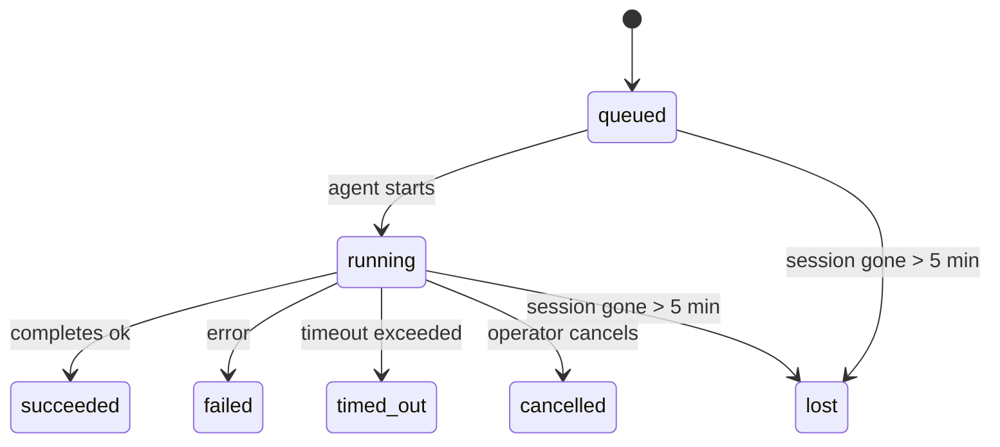

---
read_when:
    - Проверка фоновой работы, выполняющейся или недавно завершенной
    - Отладка сбоев доставки для отсоединенных запусков агента
    - Понимание того, как фоновые запуски связаны с сеансами, cron и heartbeat
sidebarTitle: Background tasks
summary: Фоновое отслеживание задач для запусков ACP, субагентов, изолированных заданий Cron и операций CLI
title: Фоновые задачи
x-i18n:
    generated_at: "2026-06-28T22:32:51Z"
    model: gpt-5.5
    postprocess_version: locale-links-v1
    provider: openai
    source_hash: 4a630a52d0d6bfd387a37415dd63fc4bfbce23f99eaa8cb780c3d6f8913675fd
    source_path: automation/tasks.md
    workflow: 16
---

<Note>
Ищете планирование? См. [Автоматизация](/ru/automation), чтобы выбрать подходящий механизм. Эта страница — журнал активности фоновой работы, а не планировщик.
</Note>

Фоновые задачи отслеживают работу, которая выполняется **вне основного сеанса разговора**: запуски ACP, создание субагентов, изолированные выполнения заданий Cron и операции, запущенные из CLI.

Задачи **не** заменяют сеансы, задания Cron или Heartbeat - это **журнал активности**, который записывает, какая отсоединенная работа выполнялась, когда и была ли она успешной.

<Note>
Не каждый запуск агента создает задачу. Ходы Heartbeat и обычный интерактивный чат не создают. Все выполнения Cron, создания ACP, создания субагентов и команды агента из CLI создают.
</Note>

## Кратко

- Задачи — это **записи**, а не планировщики - Cron и Heartbeat решают, _когда_ выполняется работа, а задачи отслеживают, _что произошло_.
- ACP, субагенты, все задания Cron и операции CLI создают задачи. Ходы Heartbeat не создают.
- Каждая задача проходит через `queued → running → terminal` (succeeded, failed, timed_out, cancelled или lost).
- Задачи Cron остаются активными, пока среда выполнения Cron все еще владеет заданием; если
  состояние среды выполнения в памяти исчезло, обслуживание задач сначала проверяет долговечную
  историю запусков Cron, прежде чем пометить задачу как потерянную.
- Завершение управляется push-механизмом: отсоединенная работа может уведомить напрямую или разбудить
  сеанс/Heartbeat инициатора после завершения, поэтому циклы опроса состояния
  обычно имеют неправильную форму.
- Изолированные запуски Cron и завершения субагентов по мере возможности очищают отслеживаемые вкладки браузера/процессы для своего дочернего сеанса перед финальной служебной очисткой.
- Изолированная доставка Cron подавляет устаревшие промежуточные ответы родительского агента, пока работа дочерних субагентов еще завершается, и предпочитает финальный вывод потомка, если он приходит до доставки.
- Уведомления о завершении доставляются напрямую в канал или ставятся в очередь для следующего Heartbeat.
- `openclaw tasks list` показывает все задачи; `openclaw tasks audit` выявляет проблемы.
- Терминальные записи хранятся 7 дней, затем автоматически удаляются.

## Быстрый старт

<Tabs>
  <Tab title="Список и фильтрация">
    ```bash
    # List all tasks (newest first)
    openclaw tasks list

    # Filter by runtime or status
    openclaw tasks list --runtime acp
    openclaw tasks list --status running
    ```

  </Tab>
  <Tab title="Просмотр">
    ```bash
    # Show details for a specific task (by ID, run ID, or session key)
    openclaw tasks show <lookup>
    ```
  </Tab>
  <Tab title="Отмена и уведомления">
    ```bash
    # Cancel a running task (kills the child session)
    openclaw tasks cancel <lookup>

    # Change notification policy for a task
    openclaw tasks notify <lookup> state_changes
    ```

  </Tab>
  <Tab title="Аудит и обслуживание">
    ```bash
    # Run a health audit
    openclaw tasks audit

    # Preview or apply maintenance
    openclaw tasks maintenance
    openclaw tasks maintenance --apply
    ```

  </Tab>
  <Tab title="Поток задач">
    ```bash
    # Inspect TaskFlow state
    openclaw tasks flow list
    openclaw tasks flow show <lookup>
    openclaw tasks flow cancel <lookup>
    ```
  </Tab>
</Tabs>

## Что создает задачу

| Источник               | Тип среды выполнения | Когда создается запись задачи                                           | Политика уведомлений по умолчанию |
| ---------------------- | ------------ | ---------------------------------------------------------------------- | --------------------- |
| Фоновые запуски ACP    | `acp`        | Создание дочернего сеанса ACP                                           | `done_only`           |
| Оркестрация субагентов | `subagent`   | Создание субагента через `sessions_spawn`                               | `done_only`           |
| Задания Cron (все типы) | `cron`       | Каждое выполнение Cron (в основном сеансе и изолированное)              | `silent`              |
| Операции CLI           | `cli`        | Команды `openclaw agent`, которые выполняются через Gateway             | `silent`              |
| Медиа-задания агента   | `cli`        | Запуски `image_generate`/`music_generate`/`video_generate` на базе сеанса | `silent`              |

<AccordionGroup>
  <Accordion title="Настройки уведомлений по умолчанию для Cron и медиа">
    Задачи Cron в основном сеансе по умолчанию используют политику уведомлений `silent` - они создают записи для отслеживания, но не генерируют уведомления. Изолированные задачи Cron также по умолчанию используют `silent`, но более заметны, потому что выполняются в собственном сеансе.

    Запуски `image_generate`, `music_generate` и `video_generate` на базе сеанса также используют политику уведомлений `silent`. Они все равно создают записи задач, но завершение возвращается исходному сеансу агента как внутреннее пробуждение, чтобы агент мог сам написать последующее сообщение и прикрепить готовые медиа. Агент-инициатор следует своему обычному контракту видимого ответа: автоматический финальный ответ, если он настроен, или `message(action="send")` плюс `NO_REPLY`, когда сеанс требует ответов через инструмент сообщений. Если сеанс инициатора больше не активен или его активное пробуждение завершается с ошибкой, а агент завершения пропускает часть или все сгенерированные медиа, OpenClaw отправляет идемпотентную прямую резервную доставку только с недостающими медиа в исходную цель канала.

  </Accordion>
  <Accordion title="Ограничитель параллельной генерации медиа">
    Пока задача генерации медиа на базе сеанса все еще активна, медиа-инструменты также действуют как ограничители против случайных повторных попыток. Повторные вызовы `image_generate` для того же промпта возвращают состояние соответствующей активной задачи, а отдельный промпт изображения может запустить собственную задачу. Вызовы `music_generate` и `video_generate` по-прежнему возвращают состояние активной задачи для этого сеанса вместо запуска второй параллельной генерации. Используйте `action: "status"`, когда вам нужен явный запрос прогресса/состояния со стороны агента.
  </Accordion>
  <Accordion title="Что не создает задачи">
    - Ходы Heartbeat - основной сеанс; см. [Heartbeat](/ru/gateway/heartbeat)
    - Обычные интерактивные ходы чата
    - Прямые ответы `/command`

  </Accordion>
</AccordionGroup>

## Жизненный цикл задачи



| Состояние   | Что это означает                                                            |
| ----------- | -------------------------------------------------------------------------- |
| `queued`    | Создано, ожидание запуска агента                                            |
| `running`   | Ход агента активно выполняется                                              |
| `succeeded` | Успешно завершено                                                           |
| `failed`    | Завершено с ошибкой                                                         |
| `timed_out` | Превышен настроенный тайм-аут                                               |
| `cancelled` | Остановлено оператором через `openclaw tasks cancel`                        |
| `lost`      | Среда выполнения потеряла авторитетное опорное состояние после 5-минутного льготного периода |

Переходы происходят автоматически - когда связанный запуск агента завершается, состояние задачи обновляется соответствующим образом.

Завершение запуска агента является авторитетным для активных записей задач. Успешный отсоединенный запуск финализируется как `succeeded`, обычные ошибки запуска финализируются как `failed`, а исходы тайм-аута или прерывания финализируются как `timed_out`. Если оператор уже отменил задачу или среда выполнения уже записала более сильное терминальное состояние, такое как `failed`, `timed_out` или `lost`, более поздний сигнал успеха не понижает это терминальное состояние.

`lost` учитывает среду выполнения:

- Задачи ACP: исчезли метаданные опорного дочернего сеанса ACP.
- Задачи субагентов: опорный дочерний сеанс исчез из хранилища целевого агента.
- Задачи Cron: среда выполнения Cron больше не отслеживает задание как активное, а долговечная
  история запусков Cron не показывает терминальный результат для этого запуска. Автономный аудит CLI
  не считает собственное пустое внутрипроцессное состояние среды выполнения Cron авторитетным.
- Задачи CLI: задачи с идентификатором запуска/исходным идентификатором используют живой контекст запуска, поэтому
  оставшиеся строки дочернего сеанса или чат-сеанса не сохраняют их активными после исчезновения
  запуска, принадлежащего Gateway. Устаревшие задачи CLI без идентичности запуска все еще возвращаются
  к дочернему сеансу. Запуски `openclaw agent` на базе Gateway также финализируются
  по результату своего запуска, поэтому завершенные запуски не остаются активными, пока очиститель
  не пометит их как `lost`.

## Доставка и уведомления

Когда задача достигает терминального состояния, OpenClaw уведомляет вас. Есть два пути доставки:

**Прямая доставка** - если у задачи есть целевой канал (`requesterOrigin`), сообщение о завершении отправляется прямо в этот канал (Telegram, Discord, Slack и т. д.). Завершения задач групп и каналов вместо этого маршрутизируются через сеанс инициатора, чтобы родительский агент мог написать видимый ответ. Для завершений субагентов OpenClaw также сохраняет привязанную маршрутизацию ветки/темы, когда она доступна, и может заполнить отсутствующий `to` / аккаунт из сохраненного маршрута сеанса инициатора (`lastChannel` / `lastTo` / `lastAccountId`), прежде чем отказаться от прямой доставки.

**Доставка через очередь сеанса** - если прямая доставка завершается с ошибкой или источник не задан, обновление ставится в очередь как системное событие в сеансе инициатора и появляется при следующем Heartbeat.

<Tip>
Завершение задачи запускает немедленное пробуждение Heartbeat, чтобы вы быстро увидели результат - вам не нужно ждать следующего запланированного такта Heartbeat.
</Tip>

Это означает, что обычный рабочий процесс основан на push-механизме: один раз запустите отсоединенную работу, затем позвольте среде выполнения разбудить вас или уведомить о завершении. Опрос состояния задачи нужен только для отладки, вмешательства или явного аудита.

### Политики уведомлений

Управляйте тем, сколько сообщений вы получаете о каждой задаче:

| Политика             | Что доставляется                                                        |
| --------------------- | ----------------------------------------------------------------------- |
| `done_only` (по умолчанию) | Только терминальное состояние (succeeded, failed и т. д.) - **это значение по умолчанию** |
| `state_changes`       | Каждый переход состояния и обновление прогресса                         |
| `silent`              | Ничего                                                                  |

Измените политику во время выполнения задачи:

```bash
openclaw tasks notify <lookup> state_changes
```

## Справочник CLI

<AccordionGroup>
  <Accordion title="tasks list">
    ```bash
    openclaw tasks list [--runtime <acp|subagent|cron|cli>] [--status <status>] [--json]
    ```

    Столбцы вывода: идентификатор задачи, вид, состояние, доставка, идентификатор запуска, дочерний сеанс, сводка.

  </Accordion>
  <Accordion title="tasks show">
    ```bash
    openclaw tasks show <lookup>
    ```

    Токен поиска принимает идентификатор задачи, идентификатор запуска или ключ сеанса. Показывает полную запись, включая время, состояние доставки, ошибку и терминальную сводку.

  </Accordion>
  <Accordion title="tasks cancel">
    ```bash
    openclaw tasks cancel <lookup>
    ```

    Для задач ACP и субагентов это завершает дочерний сеанс. Для задач, отслеживаемых CLI, отмена записывается в реестр задач (отдельного дескриптора дочерней среды выполнения нет). Состояние переходит в `cancelled`, и при необходимости отправляется уведомление о доставке.

  </Accordion>
  <Accordion title="tasks notify">
    ```bash
    openclaw tasks notify <lookup> <done_only|state_changes|silent>
    ```
  </Accordion>
  <Accordion title="tasks audit">
    ```bash
    openclaw tasks audit [--json]
    ```

    Выявляет эксплуатационные проблемы. Находки также появляются в `openclaw status`, когда обнаружены проблемы.

    | Обнаружение               | Серьезность       | Триггер                                                                                                                              |
    | ------------------------- | ----------------- | ------------------------------------------------------------------------------------------------------------------------------------ |
    | `stale_queued`            | предупреждение    | В очереди более 10 минут                                                                                                             |
    | `stale_running`           | ошибка            | Выполняется более 30 минут                                                                                                           |
    | `lost`                    | предупреждение/ошибка | Владение задачей, подтверждаемое средой выполнения, исчезло; сохраненные потерянные задачи считаются предупреждениями до `cleanupAfter`, затем становятся ошибками |
    | `delivery_failed`         | предупреждение    | Доставка не удалась, а политика уведомлений не равна `silent`                                                                        |
    | `missing_cleanup`         | предупреждение    | Терминальная задача без временной метки очистки                                                                                      |
    | `inconsistent_timestamps` | предупреждение    | Нарушение временной шкалы (например, завершение раньше начала)                                                                       |

  </Accordion>
  <Accordion title="обслуживание задач">
    ```bash
    openclaw tasks maintenance [--json]
    openclaw tasks maintenance --apply [--json]
    ```

    Используйте это, чтобы предварительно просмотреть или применить согласование, проставление меток очистки и удаление для задач, состояния Task Flow и устаревших строк реестра сеансов запусков cron.

    Согласование учитывает среду выполнения:

    - Задачи ACP/подагентов проверяют свой дочерний сеанс-основание.
    - Задачи подагентов, у дочернего сеанса которых есть tombstone восстановления после перезапуска, помечаются как потерянные, а не рассматриваются как восстанавливаемые сеансы-основания.
    - Задачи cron проверяют, владеет ли среда выполнения cron этой задачей, затем восстанавливают терминальный статус из сохраненных журналов запусков cron/состояния задания, прежде чем перейти к `lost`. Только процесс Gateway является авторитетным источником для набора активных заданий cron в памяти; офлайн-аудит CLI использует устойчивую историю, но не помечает задачу cron как потерянную только потому, что этот локальный Set пуст.
    - Задачи CLI с идентификатором запуска проверяют владеющий живой контекст запуска, а не только строки дочернего сеанса или сеанса чата.

    Очистка после завершения также учитывает среду выполнения:

    - При завершении подагента по мере возможности закрываются отслеживаемые вкладки браузера/процессы для дочернего сеанса до продолжения очистки объявления.
    - При завершении изолированного cron по мере возможности закрываются отслеживаемые вкладки браузера/процессы для сеанса cron до полного завершения запуска.
    - Доставка изолированного cron при необходимости дожидается последующих действий дочернего подагента и подавляет устаревший текст подтверждения родителя вместо его объявления.
    - Доставка завершения подагента использует только последний видимый текст ассистента дочернего сеанса. Вывод tool/toolResult не переносится в текст результата дочернего сеанса. Терминальные неудачные запуски объявляют статус сбоя без повторного воспроизведения захваченного текста ответа.
    - Сбои очистки не скрывают реальный результат задачи.

    При применении обслуживания OpenClaw также удаляет устаревшие строки реестра сеансов `cron:<jobId>:run:<uuid>` старше 7 дней, сохраняя строки для выполняющихся сейчас заданий cron и не затрагивая строки сеансов, не относящиеся к cron.

  </Accordion>
  <Accordion title="tasks flow list | show | cancel">
    ```bash
    openclaw tasks flow list [--status <status>] [--json]
    openclaw tasks flow show <lookup> [--json]
    openclaw tasks flow cancel <lookup>
    ```

    Используйте эти команды, когда вас интересует оркестрирующий Task Flow, а не отдельная запись фоновой задачи.

  </Accordion>
</AccordionGroup>

## Доска задач чата (`/tasks`)

Используйте `/tasks` в любом сеансе чата, чтобы увидеть фоновые задачи, связанные с этим сеансом. Доска показывает активные и недавно завершенные задачи с подробностями о среде выполнения, статусе, времени, ходе выполнения или ошибке.

Когда у текущего сеанса нет видимых связанных задач, `/tasks` переключается на локальные для агента счетчики задач, чтобы вы все равно получили обзор без раскрытия деталей других сеансов.

Для полного операторского журнала используйте CLI: `openclaw tasks list`.

## Интеграция статуса (нагрузка задач)

`openclaw status` включает краткую сводку задач:

```
Tasks: 3 queued · 2 running · 1 issues
```

Сводка сообщает:

- **активные** - количество `queued` + `running`
- **сбои** - количество `failed` + `timed_out` + `lost`
- **по среде выполнения** - разбивка по `acp`, `subagent`, `cron`, `cli`

И `/status`, и инструмент `session_status` используют снимок задач с учетом очистки: активные задачи имеют приоритет, устаревшие завершенные строки скрываются, а недавние сбои показываются только тогда, когда не остается активной работы. Это удерживает карточку статуса сфокусированной на том, что важно прямо сейчас.

## Хранилище и обслуживание

### Где находятся задачи

Записи задач сохраняются в SQLite по адресу:

```
$OPENCLAW_STATE_DIR/tasks/runs.sqlite
```

Реестр загружается в память при запуске Gateway и синхронизирует записи в SQLite для устойчивости при перезапусках.
Gateway ограничивает размер журнала упреждающей записи SQLite, используя стандартный
порог autocheckpoint SQLite и периодические контрольные точки `PASSIVE`. Завершение работы и
явные контрольные точки обслуживания по-прежнему используют `TRUNCATE`, чтобы обычные закрытия могли
освобождать место WAL, не заставляя фоновый sweeper ждать активных читателей.

### Автоматическое обслуживание

Sweeper запускается каждые **60 секунд** и выполняет четыре действия:

<Steps>
  <Step title="Согласование">
    Проверяет, есть ли у активных задач все еще авторитетное основание в среде выполнения. Задачи ACP/подагентов используют состояние дочернего сеанса, задачи cron используют владение активным заданием, а задачи CLI с идентификатором запуска используют владеющий контекст запуска. Если это состояние-основание отсутствует более 5 минут, задача помечается как `lost`.
  </Step>
  <Step title="Восстановление сеансов ACP">
    Закрывает терминальные или осиротевшие одноразовые сеансы ACP, принадлежащие родителю, и закрывает устаревшие терминальные или осиротевшие постоянные сеансы ACP только тогда, когда не остается активной привязки разговора.
  </Step>
  <Step title="Проставление меток очистки">
    Устанавливает временную метку `cleanupAfter` для терминальных задач (endedAt + 7 дней). В течение срока хранения потерянные задачи все еще отображаются в аудите как предупреждения; после истечения `cleanupAfter` или при отсутствии метаданных очистки они считаются ошибками.
  </Step>
  <Step title="Удаление">
    Удаляет записи после их даты `cleanupAfter`.
  </Step>
</Steps>

<Note>
**Хранение:** записи терминальных задач сохраняются **7 дней**, затем автоматически удаляются. Конфигурация не требуется.
</Note>

## Как задачи связаны с другими системами

<AccordionGroup>
  <Accordion title="Задачи и Task Flow">
    [Task Flow](/ru/automation/taskflow) — это слой оркестрации потоков поверх фоновых задач. Один поток может координировать несколько задач в течение своего жизненного цикла, используя управляемые или зеркальные режимы синхронизации. Используйте `openclaw tasks` для просмотра отдельных записей задач и `openclaw tasks flow` для просмотра оркестрирующего потока.

    Подробнее см. [Task Flow](/ru/automation/taskflow).

  </Accordion>
  <Accordion title="Задачи и cron">
    Определения заданий Cron, состояние выполнения среды выполнения и история запусков находятся в общей базе данных состояния SQLite OpenClaw. **Каждое** выполнение cron создает запись задачи — как в основном сеансе, так и в изолированном. Для задач cron основного сеанса по умолчанию используется политика уведомлений `silent`, чтобы они отслеживались без создания уведомлений.

    См. [Задания Cron](/ru/automation/cron-jobs).

  </Accordion>
  <Accordion title="Задачи и Heartbeat">
    Запуски Heartbeat — это ходы основного сеанса; они не создают записи задач. Когда задача завершается, она может инициировать пробуждение Heartbeat, чтобы вы быстро увидели результат.

    См. [Heartbeat](/ru/gateway/heartbeat).

  </Accordion>
  <Accordion title="Задачи и сеансы">
    Задача может ссылаться на `childSessionKey` (где выполняется работа) и `requesterSessionKey` (кто ее запустил). Ее `agentId` идентифицирует агента, выполняющего работу, а поля requester и owner сохраняют контекст запуска и управления. Сеансы — это контекст разговора; задачи — это отслеживание активности поверх него.
  </Accordion>
  <Accordion title="Задачи и запуски агентов">
    `runId` задачи связывает ее с запуском агента, выполняющим работу. События жизненного цикла агента (начало, завершение, ошибка) автоматически обновляют статус задачи — вам не нужно управлять жизненным циклом вручную.
  </Accordion>
</AccordionGroup>

## См. также

- [Автоматизация](/ru/automation) - все механизмы автоматизации в кратком обзоре
- [CLI: задачи](/ru/cli/tasks) - справочник команд CLI
- [Heartbeat](/ru/gateway/heartbeat) - периодические ходы основного сеанса
- [Запланированные задачи](/ru/automation/cron-jobs) - планирование фоновой работы
- [Task Flow](/ru/automation/taskflow) - оркестрация потоков поверх задач
