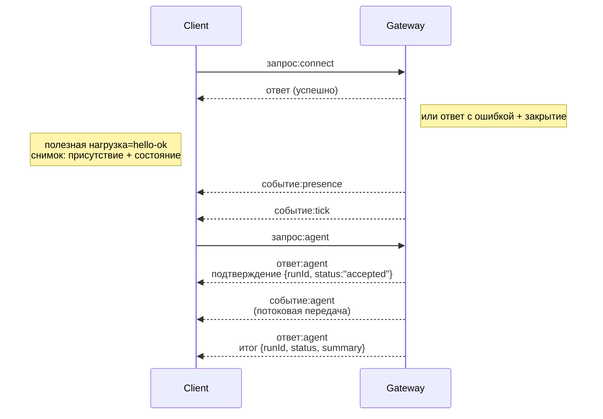

---
read_when:
    - Работа с протоколом Gateway, клиентами или транспортами
summary: Архитектура WebSocket-шлюза, компоненты и клиентские потоки
title: Архитектура Gateway
x-i18n:
    generated_at: "2026-07-13T19:41:33Z"
    model: gpt-5.6
    postprocess_version: locale-links-v1
    prompt_version: 24
    provider: openai
    source_hash: f8054bd87f738b957c24f8d6965d55365de2293d44902530a9ba778afa597cc7
    source_path: concepts/architecture.md
    workflow: 16
---

## Обзор

- Единый долгоживущий **Gateway** управляет всеми каналами обмена сообщениями (WhatsApp через
  Baileys, Telegram через grammY, Slack, Discord, Signal, iMessage, WebChat).
- Клиенты плоскости управления (приложение macOS, CLI, веб-интерфейс, автоматизации) подключаются к
  Gateway через **WebSocket** на настроенном адресе привязки (по умолчанию
  `127.0.0.1:18789`).
- **Узлы** (macOS/iOS/Android/без интерфейса) также подключаются через **WebSocket**, но
  объявляют `role: node` с явным указанием возможностей и команд.
- На каждом хосте используется один Gateway; только он открывает сеанс WhatsApp.
- **Хост холста** обслуживается HTTP-сервером Gateway по следующим адресам:
  - `/__openclaw__/canvas/` (доступные агенту для редактирования HTML/CSS/JS)
  - `/__openclaw__/a2ui/` (хост A2UI)

  Он использует тот же порт, что и Gateway (по умолчанию `18789`).

## Компоненты и потоки

### Gateway (демон)

- Поддерживает подключения к провайдерам.
- Предоставляет типизированный API WS (запросы, ответы, события, отправляемые сервером).
- Проверяет входящие кадры по JSON Schema.
- Отправляет такие события, как `agent`, `chat`, `presence`, `health`, `heartbeat`, `cron`.

### Клиенты (приложение Mac / CLI / веб-интерфейс администратора)

- Одно подключение WS на каждого клиента.
- Отправляют запросы (`health`, `status`, `send`, `agent`, `system-presence`).
- Подписываются на события (`tick`, `agent`, `presence`, `shutdown`).

### Узлы (macOS / iOS / Android / без интерфейса)

- Подключаются к **тому же серверу WS** с `role: node`.
- Передают идентификатор устройства в `connect`; сопряжение выполняется **на уровне устройства** (роль `node`), а
  разрешение хранится в хранилище сопряжений устройств.
- Предоставляют такие команды, как `canvas.*`, `camera.*`, `screen.record`, `location.get`.

Подробности протокола: [Протокол Gateway](/ru/gateway/protocol)

### WebChat

- Статический интерфейс, использующий API WS Gateway для получения истории чата и отправки сообщений.
- При удалённой настройке подключается через тот же туннель SSH/Tailscale, что и другие
  клиенты.

## Жизненный цикл подключения (один клиент)



## Сетевой протокол (краткое описание)

- Транспорт: WebSocket, текстовые кадры с полезной нагрузкой JSON.
- Первым кадром **обязательно должен** быть `connect`.
- После установления соединения:
  - Запросы: `{type:"req", id, method, params}` → `{type:"res", id, ok, payload|error}`
  - События: `{type:"event", event, payload, seq?, stateVersion?}`
- `hello-ok.features.methods` / `events` — это метаданные обнаружения, а не
  сгенерированный перечень всех доступных вспомогательных маршрутов.
- Аутентификация с общим секретом использует `connect.params.auth.token` или
  `connect.params.auth.password` в зависимости от настроенного режима аутентификации Gateway.
- Режимы с идентификацией, такие как Tailscale Serve
  (`gateway.auth.allowTailscale: true`) или не использующий loopback
  `gateway.auth.mode: "trusted-proxy"`, выполняют аутентификацию по заголовкам запроса,
  а не по `connect.params.auth.*`.
- При `gateway.auth.mode: "none"` для частного входящего трафика аутентификация с общим секретом
  полностью отключается; не используйте этот режим для публичного или недоверенного входящего трафика.
- Ключи идемпотентности обязательны для методов с побочными эффектами (`send`, `agent`), чтобы
  обеспечить безопасные повторные попытки; сервер хранит кратковременный кеш дедупликации.
- Узлы должны включать `role: "node"`, а также возможности, команды и разрешения в `connect`.

## Сопряжение и локальное доверие

- Все клиенты WS (операторы и узлы) указывают **идентификатор устройства** в `connect`.
- Новые идентификаторы устройств требуют подтверждения сопряжения; Gateway выдаёт **токен устройства**
  для последующих подключений.
- Прямые локальные подключения через loopback могут подтверждаться автоматически, чтобы обеспечить удобную
  работу на одном хосте.
- OpenClaw также предоставляет ограниченный путь самостоятельного подключения внутри бэкенда или контейнера для
  доверенных вспомогательных потоков с общим секретом.
- Подключения через tailnet и локальную сеть, включая привязки tailnet на том же хосте, по-прежнему требуют
  явного подтверждения сопряжения.
- Все подключения должны подписывать одноразовое значение `connect.challenge`. Полезная нагрузка подписи `v3`
  также связывает `platform` и `deviceFamily`; при повторном подключении Gateway закрепляет сопряжённые метаданные
  и при их изменении требует повторного сопряжения.
- **Нелокальные** подключения по-прежнему требуют явного подтверждения.
- Аутентификация Gateway (`gateway.auth.*`) по-прежнему применяется ко **всем** подключениям — локальным и
  удалённым.

Подробности: [Протокол Gateway](/ru/gateway/protocol), [Сопряжение](/ru/channels/pairing),
[Безопасность](/ru/gateway/security).

## Типизация протокола и генерация кода

- Схемы TypeBox определяют протокол.
- JSON Schema генерируется из этих схем.
- Модели Swift генерируются из JSON Schema.

## Удалённый доступ

- Предпочтительный вариант: Tailscale или VPN.
- Альтернативный вариант: туннель SSH

  ```bash
  ssh -N -L 18789:127.0.0.1:18789 user@gateway-host
  ```

- При подключении через туннель используются те же процедура установления соединения и токен аутентификации.
- В удалённых конфигурациях для WS можно включить TLS и необязательное закрепление сертификата.

## Краткий обзор эксплуатации

- Запуск: `openclaw gateway` (на переднем плане, журналы выводятся в stdout).
- Проверка состояния: `health` через WS (также включена в `hello-ok`).
- Контроль процесса: launchd/systemd для автоматического перезапуска.

## Инварианты

- Ровно один Gateway управляет одним сеансом Baileys на каждом хосте.
- Установление соединения обязательно; любой первый кадр, который не является JSON или запросом подключения, приводит к немедленному закрытию соединения.
- События не воспроизводятся повторно; при наличии пропусков клиенты должны обновить данные.

## Связанные материалы

- [Цикл агента](/ru/concepts/agent-loop) — подробный цикл выполнения агента
- [Протокол Gateway](/ru/gateway/protocol) — контракт протокола WebSocket
- [Очередь](/ru/concepts/queue) — очередь команд и параллелизм
- [Безопасность](/ru/gateway/security) — модель доверия и усиление защиты
