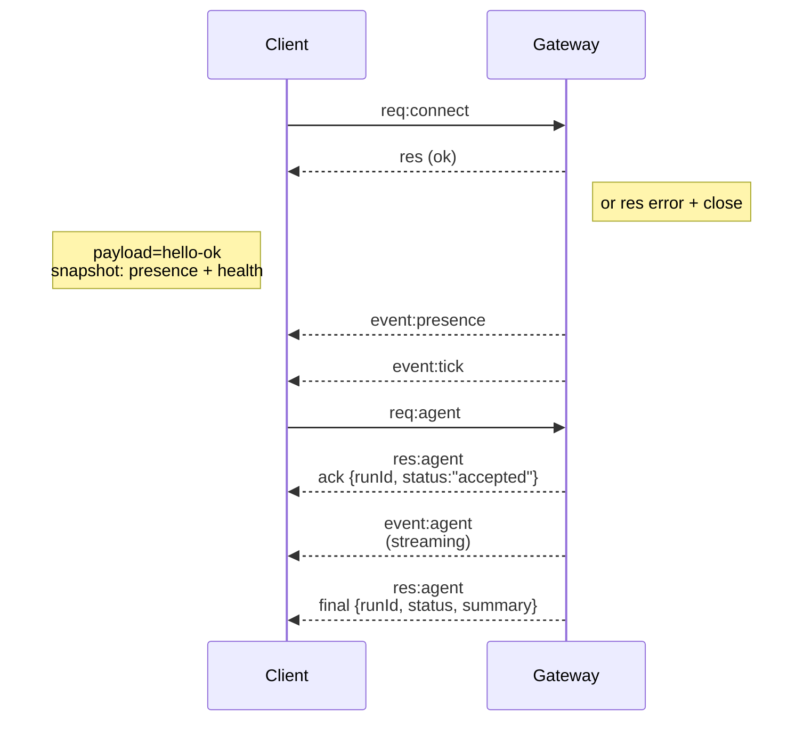

---
read_when:
    - Работа с протоколом Gateway, клиентами или транспортами
summary: Архитектура WebSocket gateway, компоненты и клиентские потоки
title: Архитектура Gateway
x-i18n:
    generated_at: "2026-06-28T22:48:28Z"
    model: gpt-5.5
    postprocess_version: locale-links-v1
    provider: openai
    source_hash: 433489081bfe07691b211f5076ec45ce0ed3fd043eb86128f73121f2cab71cd3
    source_path: concepts/architecture.md
    workflow: 16
---

## Обзор

- Единый долгоживущий **Gateway** владеет всеми поверхностями обмена сообщениями (WhatsApp через
  Baileys, Telegram через grammY, Slack, Discord, Signal, iMessage, WebChat).
- Клиенты плоскости управления (приложение macOS, CLI, веб-интерфейс, автоматизации) подключаются к
  Gateway по **WebSocket** на настроенном bind-хосте (по умолчанию
  `127.0.0.1:18789`).
- **Узлы** (macOS/iOS/Android/headless) также подключаются по **WebSocket**, но
  объявляют `role: node` с явными возможностями/командами.
- Один Gateway на хост; это единственное место, открывающее сеанс WhatsApp.
- **Хост canvas** обслуживается HTTP-сервером Gateway по адресам:
  - `/__openclaw__/canvas/` (HTML/CSS/JS, редактируемые агентом)
  - `/__openclaw__/a2ui/` (хост A2UI)
    Он использует тот же порт, что и Gateway (по умолчанию `18789`).

## Компоненты и потоки

### Gateway (демон)

- Поддерживает подключения провайдеров.
- Предоставляет типизированный WS API (запросы, ответы, server-push-события).
- Проверяет входящие кадры по JSON Schema.
- Генерирует события вроде `agent`, `chat`, `presence`, `health`, `heartbeat`, `cron`.

### Клиенты (приложение macOS / CLI / веб-админка)

- Одно WS-подключение на клиента.
- Отправляют запросы (`health`, `status`, `send`, `agent`, `system-presence`).
- Подписываются на события (`tick`, `agent`, `presence`, `shutdown`).

### Узлы (macOS / iOS / Android / headless)

- Подключаются к **тому же WS-серверу** с `role: node`.
- Передают идентификатор устройства в `connect`; сопряжение выполняется **на уровне устройства** (роль `node`), а
  подтверждение хранится в хранилище сопряжений устройств.
- Предоставляют команды вроде `canvas.*`, `camera.*`, `screen.record`, `location.get`.

Сведения о протоколе:

- [Протокол Gateway](/ru/gateway/protocol)

### WebChat

- Статический интерфейс, который использует WS API Gateway для истории чатов и отправки сообщений.
- В удаленных настройках подключается через тот же SSH/Tailscale-туннель, что и другие
  клиенты.

## Жизненный цикл подключения (один клиент)



## Проводной протокол (кратко)

- Транспорт: WebSocket, текстовые кадры с JSON-полезной нагрузкой.
- Первый кадр **обязан** быть `connect`.
- После рукопожатия:
  - Запросы: `{type:"req", id, method, params}` → `{type:"res", id, ok, payload|error}`
  - События: `{type:"event", event, payload, seq?, stateVersion?}`
- `hello-ok.features.methods` / `events` — это метаданные обнаружения, а не
  сгенерированный дамп каждого вызываемого вспомогательного маршрута.
- Аутентификация по общему секрету использует `connect.params.auth.token` или
  `connect.params.auth.password`, в зависимости от настроенного режима аутентификации Gateway.
- Режимы с идентификацией, такие как Tailscale Serve
  (`gateway.auth.allowTailscale: true`) или не-loopback
  `gateway.auth.mode: "trusted-proxy"`, выполняют аутентификацию по заголовкам запроса
  вместо `connect.params.auth.*`.
- Частный вход `gateway.auth.mode: "none"` полностью отключает аутентификацию
  по общему секрету; не включайте этот режим для публичного/недоверенного входа.
- Ключи идемпотентности обязательны для методов с побочными эффектами (`send`, `agent`), чтобы
  можно было безопасно повторять запросы; сервер хранит краткоживущий кеш дедупликации.
- Узлы должны включать `role: "node"` плюс возможности/команды/разрешения в `connect`.

## Сопряжение + локальное доверие

- Все WS-клиенты (операторы + узлы) включают **идентификатор устройства** при `connect`.
- Новые идентификаторы устройств требуют подтверждения сопряжения; Gateway выдает **токен устройства**
  для последующих подключений.
- Прямые подключения через local loopback могут подтверждаться автоматически, чтобы UX на том же хосте
  оставался плавным.
- OpenClaw также имеет узкий backend/container-local путь самостоятельного подключения для
  доверенных вспомогательных потоков с общим секретом.
- Подключения через tailnet и LAN, включая bind на tailnet того же хоста, по-прежнему требуют
  явного подтверждения сопряжения.
- Все подключения должны подписывать nonce `connect.challenge`.
- Полезная нагрузка подписи `v3` также привязывает `platform` + `deviceFamily`; Gateway
  закрепляет сопряженные метаданные при повторном подключении и требует ремонтного сопряжения при изменениях
  метаданных.
- **Нелокальные** подключения по-прежнему требуют явного подтверждения.
- Аутентификация Gateway (`gateway.auth.*`) по-прежнему применяется ко **всем** подключениям, локальным и
  удаленным.

Подробности: [Протокол Gateway](/ru/gateway/protocol), [Сопряжение](/ru/channels/pairing),
[Безопасность](/ru/gateway/security).

## Типизация протокола и кодогенерация

- Схемы TypeBox определяют протокол.
- JSON Schema генерируется из этих схем.
- Модели Swift генерируются из JSON Schema.

## Удаленный доступ

- Предпочтительно: Tailscale или VPN.
- Альтернатива: SSH-туннель

  ```bash
  ssh -N -L 18789:127.0.0.1:18789 user@host
  ```

- То же рукопожатие + токен аутентификации применяются через туннель.
- TLS + необязательное закрепление можно включить для WS в удаленных настройках.

## Операционный снимок

- Запуск: `openclaw gateway` (передний план, логи в stdout).
- Состояние: `health` по WS (также включено в `hello-ok`).
- Супервизия: launchd/systemd для автоматического перезапуска.

## Инварианты

- Ровно один Gateway управляет одним сеансом Baileys на хост.
- Рукопожатие обязательно; любой не-JSON или не-connect первый кадр приводит к жесткому закрытию.
- События не воспроизводятся повторно; клиенты должны обновляться при пропусках.

## Связанные материалы

- [Цикл агента](/ru/concepts/agent-loop) — подробный цикл выполнения агента
- [Протокол Gateway](/ru/gateway/protocol) — контракт протокола WebSocket
- [Очередь](/ru/concepts/queue) — очередь команд и конкурентность
- [Безопасность](/ru/gateway/security) — модель доверия и усиление защиты
