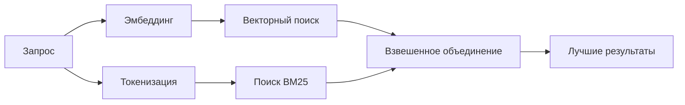

---
read_when:
    - Вы хотите понять, как работает memory_search
    - Вы хотите выбрать провайдера эмбеддингов
    - Вы хотите настроить качество поиска
summary: Как поиск по памяти находит релевантные заметки с помощью эмбеддингов и гибридного поиска
title: Поиск в памяти
x-i18n:
    generated_at: "2026-07-13T18:05:15Z"
    model: gpt-5.6
    postprocess_version: locale-links-v1
    prompt_version: 24
    provider: openai
    source_hash: 2ae0830843fba28c24159d85425240051fb8caf086cd0563d3091890045dcfad
    source_path: concepts/memory-search.md
    workflow: 16
---

`memory_search` находит релевантные заметки в файлах памяти, даже если их
формулировка отличается от исходного текста. Содержимое памяти разбивается на небольшие фрагменты,
по которым выполняется поиск с помощью эмбеддингов, ключевых слов или обоих методов.

## Быстрый старт

По умолчанию OpenClaw использует эмбеддинги OpenAI. Чтобы использовать другого провайдера, укажите его
явно:

```json5
{
  agents: {
    defaults: {
      memorySearch: {
        provider: "openai", // или "gemini", "voyage", "mistral", "bedrock", "local", "ollama", "lmstudio", "github-copilot", "openai-compatible"
      },
    },
  },
}
```

`provider` также может ссылаться на пользовательскую запись `models.providers.<id>` (например,
`ollama-5080`), если в этой записи для `api` задано значение `"ollama"` или
идентификатор другого провайдера с адаптером эмбеддингов памяти.

Чтобы использовать локальные эмбеддинги без ключа API, установите официальный плагин провайдера llama.cpp
и задайте `provider: "local"`:

```bash
openclaw plugins install @openclaw/llama-cpp-provider
```

Для сборок из исходного кода также требуется разрешить нативную сборку: `pnpm approve-builds`, затем
`pnpm rebuild node-llama-cpp`.

Некоторым совместимым с OpenAI конечным точкам эмбеддингов требуются асимметричные метки `input_type`,
например `"query"` для поисковых запросов и `"document"`/`"passage"` для индексируемых
фрагментов. Задайте их с помощью `queryInputType` и `documentInputType`; см.
[справочник по настройке памяти](/ru/reference/memory-config#provider-specific-config).

## Поддерживаемые провайдеры

| Провайдер         | Идентификатор       | Требуется ключ API | Примечания                               |
| ----------------- | ------------------- | ------------------ | ---------------------------------------- |
| Bedrock           | `bedrock`           | Нет                | Использует цепочку учётных данных AWS    |
| DeepInfra         | `deepinfra`         | Да                 | Модель по умолчанию — `BAAI/bge-m3`       |
| Gemini            | `gemini`            | Да                 | Поддерживает индексирование изображений и аудио |
| GitHub Copilot    | `github-copilot`    | Нет                | Использует вашу подписку Copilot         |
| Локальный         | `local`             | Нет                | Модель GGUF, автозагрузка ~0.6 GB         |
| LM Studio         | `lmstudio`          | Нет                | Локальный или самостоятельно размещённый сервер |
| Mistral           | `mistral`           | Да                 |                                          |
| Ollama            | `ollama`            | Нет                | Локальный или самостоятельно размещённый сервер |
| OpenAI            | `openai`            | Да                 | По умолчанию                             |
| Совместимый с OpenAI | `openai-compatible` | Обычно             | Универсальная конечная точка `/v1/embeddings` |
| Voyage            | `voyage`            | Да                 |                                          |

## Как работает поиск

OpenClaw параллельно выполняет поиск двумя способами и объединяет результаты:



- **Векторный поиск** сопоставляет схожие значения («хост Gateway» соответствует «компьютеру,
  на котором работает OpenClaw»).
- **Поиск по ключевым словам BM25** сопоставляет точные термины (идентификаторы, строки ошибок, ключи
  конфигурации).
- **Поиск по именам файлов** индексирует пути отдельно от содержимого заметок. Точные полные
  пути, базовые имена и основы имён файлов ранжируются выше частичных совпадений путей,
  а фрагменты и оценки совпадений ключевых слов в тексте по-прежнему формируются на основе содержимого заметок.

Если доступен только один способ, поиск выполняется только с его помощью.

**Режим только FTS.** Задайте `provider: "none"`, чтобы намеренно отключить эмбеддинги
и выполнять поиск только по ключевым словам. Если оставить `provider` незаданным или задать `"auto"`,
при отсутствии настроенной авторизации для эмбеддингов также без ошибки используется ранжирование только по ключевым словам;
то же происходит с `provider: "local"` (провайдером GGUF/llama.cpp)
при его сбое.

**Явно указанный провайдер недоступен.** Если явно указать любого другого провайдера
(например, `openai`, `ollama`, `gemini`) и он станет недоступен во время
обработки запроса (неверная авторизация, сбой сети), `memory_search` сообщит, что память
недоступна, вместо незаметного перехода к результатам только FTS. Благодаря этому
сбой настроенного провайдера остаётся заметным. Задайте `provider: "none"`, если намеренно
требуется извлечение только через FTS, либо исправьте конфигурацию провайдера или авторизации, чтобы восстановить семантическое
ранжирование.

## Улучшение качества поиска

При большом объёме истории заметок полезны две необязательные функции.

### Временное затухание

Старые заметки постепенно теряют вес при ранжировании, поэтому более свежая информация отображается первой.
При периоде полураспада по умолчанию 30 дней заметка за прошлый месяц получает 50% своего
исходного веса. `MEMORY.md` и другие файлы без даты в каталоге `memory/`
считаются постоянными и никогда не подвергаются затуханию; оно применяется только к датированным файлам `memory/YYYY-MM-DD.md`.

<Tip>
Включите эту функцию, если у вашего агента накопились ежедневные заметки за несколько месяцев и устаревшая информация
постоянно ранжируется выше недавнего контекста.
</Tip>

### MMR (разнообразие)

Уменьшает количество повторяющихся результатов. Если в пяти заметках упоминается одна и та же конфигурация маршрутизатора,
MMR обеспечивает охват разных тем в лучших результатах вместо повторений.

<Tip>
Включите эту функцию, если `memory_search` постоянно возвращает почти одинаковые фрагменты из
разных ежедневных заметок.
</Tip>

### Включение обеих функций

```json5
{
  agents: {
    defaults: {
      memorySearch: {
        query: {
          hybrid: {
            mmr: { enabled: true },
            temporalDecay: { enabled: true },
          },
        },
      },
    },
  },
}
```

## Мультимодальная память

С помощью `gemini-embedding-2-preview` можно индексировать изображения и аудио вместе с
Markdown. Это применяется только к файлам в каталоге `memorySearch.extraPaths`; стандартные
корневые каталоги памяти (`MEMORY.md`, `memory/*.md`) по-прежнему поддерживают только Markdown. Поисковые запросы
остаются текстовыми, но сопоставляются с визуальным и звуковым содержимым. Инструкции по настройке см. в
[справочнике по настройке памяти](/ru/reference/memory-config#multimodal-memory-gemini).

## Поиск по памяти сеансов

Для точного полнотекстового поиска по стенограммам сеансов используйте [`sessions_search`](/concepts/session-search),
а затем откройте результат с помощью `sessions_history`. Поиск по памяти сеансов остаётся экспериментальным
семантическим дополнением.

При необходимости можно индексировать стенограммы сеансов, чтобы `memory_search` мог находить предыдущие
разговоры. Эта возможность требует явного включения: задайте `experimental.sessionMemory: true` и добавьте
`"sessions"` в `sources` (значение `sources` по умолчанию — `["memory"]`).

Результаты из сеансов подчиняются `tools.sessions.visibility`: значение по умолчанию `"tree"`
открывает доступ только к текущему сеансу и порождённым им сеансам. Чтобы из одного сеанса найти
несвязанный сеанс того же агента (например, сеанс, отправленный Gateway
из личного сообщения), расширьте область видимости до `"agent"`.

При использовании бэкенда QMD также задайте `memory.qmd.sessions.enabled: true`, чтобы
стенограммы экспортировались в коллекцию QMD; одни только `experimental.sessionMemory`
и `sources` не экспортируют стенограммы в QMD. См.
[справочник по конфигурации](/ru/reference/memory-config#session-memory-search-experimental).

## Устранение неполадок

**Нет результатов?** Выполните `openclaw memory status`, чтобы проверить индекс. Если он пуст, выполните
`openclaw memory index --force`.

**Находятся только совпадения по ключевым словам?** Возможно, провайдер эмбеддингов не настроен. Проверьте
`openclaw memory status --deep`.

**Истекает время ожидания локальных эмбеддингов?** Для `ollama`, `lmstudio` и `local` по умолчанию используется более длительное
время ожидания встроенной пакетной обработки. Если хост просто работает медленно, задайте
`agents.defaults.memorySearch.sync.embeddingBatchTimeoutSeconds` и повторно выполните
`openclaw memory index --force`.

**Текст на языках CJK не находится?** Перестройте индекс FTS с помощью
`openclaw memory index --force`.

## Связанные материалы

- [Обзор памяти](/ru/concepts/memory)
- [Active Memory](/ru/concepts/active-memory)
- [Встроенный движок памяти](/ru/concepts/memory-builtin)
- [Справочник по настройке памяти](/ru/reference/memory-config)
