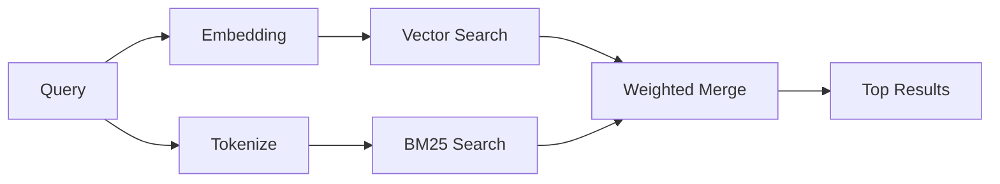

---
read_when:
    - Вы хотите понять, как работает memory_search
    - Вы хотите выбрать провайдера эмбеддингов
    - Вы хотите настроить качество поиска
summary: Как поиск в памяти находит релевантные заметки с помощью эмбеддингов и гибридного поиска
title: Поиск в памяти
x-i18n:
    generated_at: "2026-06-28T22:50:25Z"
    model: gpt-5.5
    postprocess_version: locale-links-v1
    provider: openai
    source_hash: 32ffb9d996851566eb92b7812c5425f545ecbb5387a0a445686df35a6c8ae143
    source_path: concepts/memory-search.md
    workflow: 16
---

`memory_search` находит релевантные заметки в ваших файлах памяти, даже когда
формулировка отличается от исходного текста. Он работает, индексируя память на
небольшие фрагменты и выполняя поиск по ним с помощью эмбеддингов, ключевых
слов или обоих способов.

## Быстрый старт

По умолчанию поиск по памяти использует эмбеддинги OpenAI. Чтобы использовать
другой бэкенд эмбеддингов, явно задайте провайдера:

```json5
{
  agents: {
    defaults: {
      memorySearch: {
        provider: "openai", // or "gemini", "local", "ollama", "openai-compatible", etc.
      },
    },
  },
}
```

Для конфигураций с несколькими конечными точками и провайдерами, выделенными
для памяти, `provider` также может быть пользовательской записью
`models.providers.<id>`, например `ollama-5080`, если этот провайдер задает
`api: "ollama"` или другого владельца адаптера эмбеддингов памяти.

Для локальных эмбеддингов без API-ключа установите
`@openclaw/llama-cpp-provider` и задайте `provider: "local"`. Исходные checkout
могут по-прежнему требовать подтверждения нативной сборки:
`pnpm approve-builds`, затем `pnpm rebuild node-llama-cpp`.

Некоторые OpenAI-compatible конечные точки эмбеддингов требуют асимметричные
метки, например `input_type: "query"` для поиска и
`input_type: "document"` или `"passage"` для индексируемых фрагментов.
Настройте их через `memorySearch.queryInputType` и
`memorySearch.documentInputType`; см. [справочник по конфигурации памяти](/ru/reference/memory-config#provider-specific-config).

## Поддерживаемые провайдеры

| Провайдер         | ID                  | Нужен API-ключ | Примечания                       |
| ----------------- | ------------------- | -------------- | -------------------------------- |
| Bedrock           | `bedrock`           | Нет            | Использует цепочку учетных данных AWS |
| DeepInfra         | `deepinfra`         | Да             | По умолчанию: `BAAI/bge-m3`      |
| Gemini            | `gemini`            | Да             | Поддерживает индексирование изображений и аудио |
| GitHub Copilot    | `github-copilot`    | Нет            | Использует подписку Copilot      |
| Local             | `local`             | Нет            | Модель GGUF, загрузка ~0,6 ГБ    |
| Mistral           | `mistral`           | Да             |                                  |
| Ollama            | `ollama`            | Нет            | Локальный/самостоятельно размещаемый |
| OpenAI            | `openai`            | Да             | По умолчанию                     |
| OpenAI-compatible | `openai-compatible` | Обычно         | Универсальный `/v1/embeddings`   |
| Voyage            | `voyage`            | Да             |                                  |

## Как работает поиск

OpenClaw запускает два пути извлечения параллельно и объединяет результаты:



- **Векторный поиск** находит заметки с похожим смыслом (`"gateway host"`
  совпадает с `"the machine running OpenClaw"`).
- **Ключевой поиск BM25** находит точные совпадения (ID, строки ошибок, ключи
  конфигурации).

Если доступен только один путь, другой работает самостоятельно. Намеренный режим
только FTS (`provider: "none"`) и автоматический выбор провайдера или выбор по
умолчанию все еще могут использовать лексическое ранжирование, когда
эмбеддинги недоступны.

Явно заданные нелокальные провайдеры эмбеддингов работают иначе. Если вы
задаете `memorySearch.provider` как конкретного провайдера с удаленным
бэкендом, а этот провайдер недоступен во время выполнения, `memory_search`
сообщает, что память недоступна, вместо тихого использования результатов только
FTS. Это делает сломанный настроенный семантический провайдер заметным.
Задайте `provider: "none"` для намеренного поиска только по FTS или исправьте
конфигурацию провайдера/авторизации, чтобы восстановить семантическое
ранжирование.

## Улучшение качества поиска

Две необязательные функции помогают при большой истории заметок:

### Временное затухание

Старые заметки постепенно теряют вес в ранжировании, чтобы свежая информация
появлялась первой. При периоде полураспада по умолчанию в 30 дней заметка из
прошлого месяца получает 50% от исходного веса. Постоянные файлы вроде
`MEMORY.md` никогда не затухают.

<Tip>
Включите временное затухание, если у вашего агента есть месяцы ежедневных
заметок, а устаревшая информация продолжает ранжироваться выше недавнего
контекста.
</Tip>

### MMR (разнообразие)

Сокращает избыточные результаты. Если пять заметок упоминают одну и ту же
конфигурацию роутера, MMR гарантирует, что верхние результаты охватывают разные
темы, а не повторяются.

<Tip>
Включите MMR, если `memory_search` продолжает возвращать почти одинаковые
фрагменты из разных ежедневных заметок.
</Tip>

### Включить оба

```json5
{
  agents: {
    defaults: {
      memorySearch: {
        query: {
          hybrid: {
            mmr: { enabled: true },
            temporalDecay: { enabled: true },
          },
        },
      },
    },
  },
}
```

## Мультимодальная память

С Gemini Embedding 2 можно индексировать изображения и аудиофайлы вместе с
Markdown. Поисковые запросы остаются текстовыми, но они сопоставляются с
визуальным и аудиоконтентом. Инструкции по настройке см. в
[справочнике по конфигурации памяти](/ru/reference/memory-config).

## Поиск по памяти сеанса

При желании можно индексировать стенограммы сеансов, чтобы `memory_search` мог
вспоминать более ранние разговоры. Это включается явно через
`memorySearch.experimental.sessionMemory` и `sources: ["sessions"]`; список
источников по умолчанию ограничен только памятью. Экспериментальный флаг
включает индексирование стенограмм сеансов, а `sources` управляет тем,
выполняется ли поиск по фрагментам сеансов.

Попадания по сеансам подчиняются `tools.sessions.visibility`: настройка `tree`
по умолчанию раскрывает только текущий сеанс и сеансы, которые он породил. Чтобы
вспомнить не связанный с ним сеанс того же агента, отправленный Gateway из
отдельного сеанса DM, намеренно расширьте видимость до `agent`.

При использовании QMD также задайте `memory.qmd.sessions.enabled: true`, чтобы
стенограммы экспортировались в коллекцию QMD. Подробности см. в
[справочнике по конфигурации](/ru/reference/memory-config).

## Устранение неполадок

**Нет результатов?** Запустите `openclaw memory status`, чтобы проверить
индекс. Если он пуст, выполните `openclaw memory index --force`.

**Только совпадения по ключевым словам?** Возможно, ваш провайдер эмбеддингов не
настроен. Проверьте `openclaw memory status --deep`.

**Локальные эмбеддинги завершаются по тайм-ауту?** `ollama`, `lmstudio` и
`local` по умолчанию используют более долгий встроенный тайм-аут пакетной
обработки. Если хост просто медленный, задайте
`agents.defaults.memorySearch.sync.embeddingBatchTimeoutSeconds` и повторно
запустите `openclaw memory index --force`.

**Текст CJK не найден?** Перестройте индекс FTS с помощью
`openclaw memory index --force`.

## Дополнительные материалы

- [Active Memory](/ru/concepts/active-memory) -- память субагента для интерактивных чат-сеансов
- [Память](/ru/concepts/memory) -- структура файлов, бэкенды, инструменты
- [Справочник по конфигурации памяти](/ru/reference/memory-config) -- все параметры конфигурации

## Связанное

- [Обзор памяти](/ru/concepts/memory)
- [Active Memory](/ru/concepts/active-memory)
- [Встроенный движок памяти](/ru/concepts/memory-builtin)
