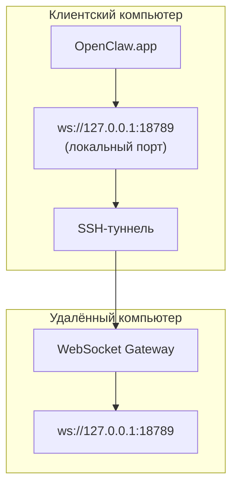

<Note>
Теперь этот материал находится в разделе [Удалённый доступ](/ru/gateway/remote#macos-persistent-ssh-tunnel-via-launchagent). Актуальное руководство доступно на указанной странице; эта страница остаётся целевым адресом для перенаправления.
</Note>

# Запуск OpenClaw.app с удалённым Gateway

OpenClaw.app подключается к удалённому Gateway через SSH-туннель: параметр SSH `LocalForward` сопоставляет локальный порт с портом WebSocket Gateway на удалённом узле.

## Настройка

1. Добавьте запись в конфигурацию SSH с `LocalForward 18789 127.0.0.1:18789` (полный блок конфигурации см. в разделе [Удалённый доступ](/ru/gateway/remote#macos-persistent-ssh-tunnel-via-launchagent)).
2. Скопируйте свой SSH-ключ на удалённый узел с помощью `ssh-copy-id`.
3. Задайте `gateway.remote.token` (или `gateway.remote.password`) с помощью `openclaw config set gateway.remote.token "<your-token>"`.
4. Запустите туннель: `ssh -N remote-gateway &`.
5. Завершите работу OpenClaw.app и снова откройте приложение.

Чтобы туннель сохранялся после перезагрузок и автоматически восстанавливал подключение, вместо ручного запуска `ssh -N` настройте LaunchAgent по инструкции на странице [Удалённый доступ](/ru/gateway/remote#macos-persistent-ssh-tunnel-via-launchagent).

## Принцип работы

| Компонент                            | Назначение                                                             |
| ------------------------------------ | ---------------------------------------------------------------------- |
| `LocalForward 18789 127.0.0.1:18789` | Перенаправляет локальный порт 18789 на удалённый порт 18789             |
| `ssh -N`                             | Запускает SSH без выполнения удалённых команд (только перенаправление портов) |
| `KeepAlive`                          | Автоматически перезапускает туннель в случае сбоя (LaunchAgent)         |
| `RunAtLoad`                          | Запускает туннель при загрузке LaunchAgent (LaunchAgent)                |

OpenClaw.app подключается к `ws://127.0.0.1:18789` на клиенте. Туннель перенаправляет это подключение на порт 18789 удалённого узла, на котором работает Gateway.

## См. также

- [Удалённый доступ](/ru/gateway/remote)
- [Tailscale](/ru/gateway/tailscale)
