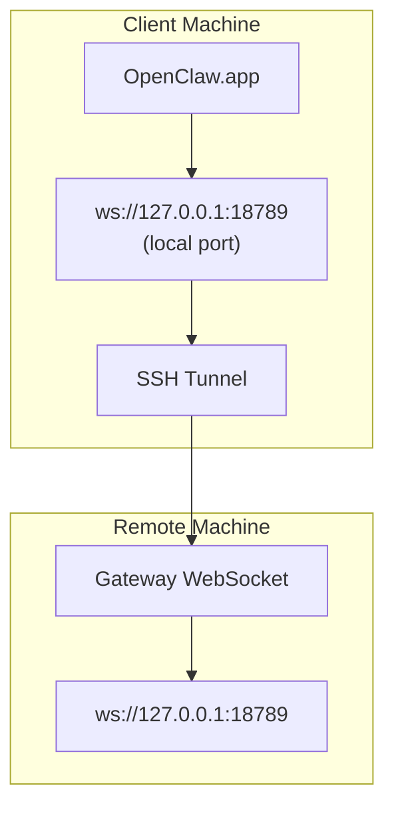

> Этот контент был объединен с разделом [Удаленный доступ](/ru/gateway/remote#macos-persistent-ssh-tunnel-via-launchagent). Актуальное руководство см. на этой странице.

# Запуск OpenClaw.app с удаленным Gateway

OpenClaw.app использует SSH-туннелирование для подключения к удаленному gateway. В этом руководстве показано, как его настроить.

## Обзор



## Быстрая настройка

### Шаг 1: Добавьте конфигурацию SSH

Отредактируйте `~/.ssh/config` и добавьте:

```ssh
Host remote-gateway
    HostName <REMOTE_IP>          # e.g., 172.27.187.184
    User <REMOTE_USER>            # e.g., jefferson
    LocalForward 18789 127.0.0.1:18789
    IdentityFile ~/.ssh/id_rsa
```

Замените `<REMOTE_IP>` и `<REMOTE_USER>` своими значениями.

### Шаг 2: Скопируйте SSH-ключ

Скопируйте свой открытый ключ на удаленную машину (введите пароль один раз):

```bash
ssh-copy-id -i ~/.ssh/id_rsa <REMOTE_USER>@<REMOTE_IP>
```

### Шаг 3: Настройте аутентификацию удаленного Gateway

```bash
openclaw config set gateway.remote.token "<your-token>"
```

Вместо этого используйте `gateway.remote.password`, если ваш удаленный gateway использует аутентификацию по паролю.
`OPENCLAW_GATEWAY_TOKEN` по-прежнему действителен как переопределение на уровне оболочки, но постоянная
настройка удаленного клиента — это `gateway.remote.token` / `gateway.remote.password`.

### Шаг 4: Запустите SSH-туннель

```bash
ssh -N remote-gateway &
```

### Шаг 5: Перезапустите OpenClaw.app

```bash
# Quit OpenClaw.app (⌘Q), then reopen:
open /path/to/OpenClaw.app
```

Теперь приложение будет подключаться к удаленному gateway через SSH-туннель.

---

## Автозапуск туннеля при входе в систему

Чтобы SSH-туннель запускался автоматически при входе в систему, создайте Launch Agent.

### Создайте файл PLIST

Сохраните это как `~/Library/LaunchAgents/ai.openclaw.ssh-tunnel.plist`:

```xml
<?xml version="1.0" encoding="UTF-8"?>
<!DOCTYPE plist PUBLIC "-//Apple//DTD PLIST 1.0//EN" "http://www.apple.com/DTDs/PropertyList-1.0.dtd">
<plist version="1.0">
<dict>
    <key>Label</key>
    <string>ai.openclaw.ssh-tunnel</string>
    <key>ProgramArguments</key>
    <array>
        <string>/usr/bin/ssh</string>
        <string>-N</string>
        <string>remote-gateway</string>
    </array>
    <key>KeepAlive</key>
    <true/>
    <key>RunAtLoad</key>
    <true/>
</dict>
</plist>
```

### Загрузите Launch Agent

```bash
launchctl bootstrap gui/$UID ~/Library/LaunchAgents/ai.openclaw.ssh-tunnel.plist
```

Теперь туннель будет:

- запускаться автоматически при входе в систему
- перезапускаться при сбое
- продолжать работать в фоновом режиме

Устаревшее примечание: удалите оставшийся LaunchAgent `com.openclaw.ssh-tunnel`, если он есть.

---

## Устранение неполадок

**Проверьте, запущен ли туннель:**

```bash
ps aux | grep "ssh -N remote-gateway" | grep -v grep
lsof -i :18789
```

**Перезапустите туннель:**

```bash
launchctl kickstart -k gui/$UID/ai.openclaw.ssh-tunnel
```

**Остановите туннель:**

```bash
launchctl bootout gui/$UID/ai.openclaw.ssh-tunnel
```

---

## Как это работает

| Компонент                            | Что он делает                                                  |
| ------------------------------------ | -------------------------------------------------------------- |
| `LocalForward 18789 127.0.0.1:18789` | Перенаправляет локальный порт 18789 на удаленный порт 18789    |
| `ssh -N`                             | SSH без выполнения удаленных команд (только проброс портов)    |
| `KeepAlive`                          | Автоматически перезапускает туннель при сбое                   |
| `RunAtLoad`                          | Запускает туннель при загрузке агента                          |

OpenClaw.app подключается к `ws://127.0.0.1:18789` на вашей клиентской машине. SSH-туннель перенаправляет это подключение на порт 18789 на удаленной машине, где работает Gateway.

## Связанные разделы

- [Удаленный доступ](/ru/gateway/remote)
- [Tailscale](/ru/gateway/tailscale)
