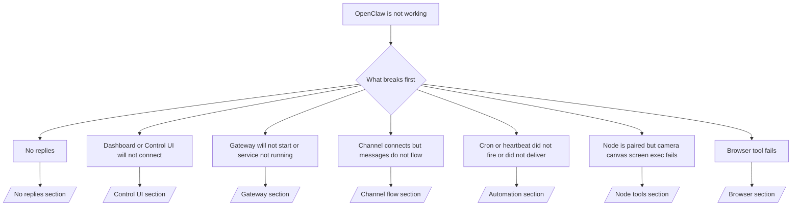

---
read_when:
    - OpenClaw не работает, и вам нужен самый быстрый путь к исправлению
    - Вам нужен процесс первичного разбора, прежде чем переходить к подробным runbook’ам
summary: Центр устранения неполадок OpenClaw, ориентированный на симптомы
title: Общее устранение неполадок
x-i18n:
    generated_at: "2026-06-28T23:03:44Z"
    model: gpt-5.5
    postprocess_version: locale-links-v1
    provider: openai
    source_hash: ae1236c73e3a5c9237bd81d603e8dca18c595a8bcbb71f5931bfbf2389b342cd
    source_path: help/troubleshooting.md
    workflow: 16
---

Если у вас есть только 2 минуты, используйте эту страницу как входную точку для триажа.

## Первые 60 секунд

Выполните эту точную последовательность по порядку:

```bash
openclaw status
openclaw status --all
openclaw gateway probe
openclaw gateway status
openclaw doctor
openclaw channels status --probe
openclaw logs --follow
```

Хороший вывод в одну строку:

- `openclaw status` → показывает настроенные каналы и отсутствие очевидных ошибок аутентификации.
- `openclaw status --all` → полный отчет присутствует и им можно поделиться.
- `openclaw gateway probe` → ожидаемая цель Gateway доступна (`Reachable: yes`). `Capability: ...` показывает, какой уровень аутентификации смог подтвердить пробный запрос, а `Read probe: limited - missing scope: operator.read` означает ограниченную диагностику, а не сбой подключения.
- `openclaw gateway status` → `Runtime: running`, `Connectivity probe: ok` и правдоподобная строка `Capability: ...`. Используйте `--require-rpc`, если также нужно подтверждение RPC с областью чтения.
- `openclaw doctor` → нет блокирующих ошибок конфигурации или сервиса.
- `openclaw channels status --probe` → доступный Gateway возвращает живое состояние транспорта для каждой учетной записи, а также результаты проверки/аудита, такие как `works` или `audit ok`; если Gateway недоступен, команда переходит к сводкам только по конфигурации.
- `openclaw logs --follow` → стабильная активность, нет повторяющихся фатальных ошибок.

## Ассистент кажется ограниченным или не видит инструменты

Если ассистент не может просматривать файлы, запускать команды, использовать автоматизацию браузера или видеть ожидаемые инструменты, сначала проверьте фактический профиль инструментов:

```bash
openclaw status
openclaw status --all
openclaw doctor
```

Частые причины:

- `tools.profile: "messaging"` намеренно узкий для агентов только с чатом.
- `tools.profile: "coding"` — обычный профиль для рабочих процессов с репозиторием, файлами, shell и средой выполнения.
- `tools.profile: "full"` открывает самый широкий набор инструментов и должен быть ограничен доверенными агентами под контролем оператора.
- Переопределения `agents.list[].tools` для отдельных агентов могут сужать или расширять корневой профиль для одного агента.

Измените корневой профиль инструментов или профиль отдельного агента, затем перезапустите или перезагрузите Gateway и снова выполните `openclaw status --all`. См. [Инструменты](/ru/tools), чтобы узнать о модели профилей и переопределениях разрешений/запретов.

## Длинный контекст Anthropic 429

Если вы видите:
`HTTP 429: rate_limit_error: Extra usage is required for long context requests`,
перейдите к [/gateway/troubleshooting#anthropic-429-extra-usage-required-for-long-context](/ru/gateway/troubleshooting#anthropic-429-extra-usage-required-for-long-context).

## Локальный OpenAI-совместимый бэкенд работает напрямую, но дает сбой в OpenClaw

Если ваш локальный или самостоятельно размещенный бэкенд `/v1` отвечает на небольшие прямые проверки `/v1/chat/completions`, но дает сбой при `openclaw infer model run` или обычных ходах агента:

1. Если ошибка упоминает, что `messages[].content` ожидает строку, задайте `models.providers.<provider>.models[].compat.requiresStringContent: true`.
2. Если бэкенд по-прежнему дает сбой только на ходах агента OpenClaw, задайте `models.providers.<provider>.models[].compat.supportsTools: false` и повторите попытку.
3. Если крошечные прямые вызовы по-прежнему работают, но более крупные промпты OpenClaw приводят к падению бэкенда, считайте оставшуюся проблему ограничением вышестоящей модели/сервера и продолжайте по подробному регламенту:
   [/gateway/troubleshooting#local-openai-compatible-backend-passes-direct-probes-but-agent-runs-fail](/ru/gateway/troubleshooting#local-openai-compatible-backend-passes-direct-probes-but-agent-runs-fail)

## Установка Plugin завершается с ошибкой из-за отсутствующих расширений openclaw

Если установка завершается с ошибкой `package.json missing openclaw.extensions`, пакет plugin использует старую форму, которую OpenClaw больше не принимает.

Исправьте в пакете plugin:

1. Добавьте `openclaw.extensions` в `package.json`.
2. Направьте записи на собранные файлы среды выполнения, обычно `./dist/index.js`.
3. Опубликуйте plugin заново и снова выполните `openclaw plugins install <package>`.

Пример:

```json
{
  "name": "@openclaw/my-plugin",
  "version": "1.2.3",
  "openclaw": {
    "extensions": ["./dist/index.js"]
  }
}
```

Справка: [Архитектура Plugin](/ru/plugins/architecture)

## Политика установки блокирует установки или обновления plugin

Если обновление завершается, но plugins остаются устаревшими, отключенными или показывают сообщения вроде `blocked by install policy`, `install policy failed closed` или `Disabled "<plugin>" after plugin update failure`, проверьте `security.installPolicy`.

Политика установки выполняется при установках и обновлениях plugin. Версии plugin, принадлежащих OpenClaw, обычно меняются вместе с выпуском OpenClaw, поэтому обновлению OpenClaw также могут потребоваться соответствующие обновления plugin `@openclaw/*` во время синхронизации после обновления.

Избегайте этих широких форм политик, если вы также не поддерживаете соответствующее правило обновления:

- Заморозка plugin, принадлежащих OpenClaw, на одной точной старой версии, например разрешение только `@openclaw/*@2026.5.3`.
- Блокировка только по типу источника, например каждый запрос plugin из npm, сети или с `request.mode: "update"`.
- Отношение к команде политики как к необязательной. Когда `security.installPolicy` включена, отсутствующий, медленный, нечитаемый или заблокированный правами исполняемый файл политики приводит к закрытому отказу.
- Одобрение версий plugin без учета `openclawVersion` в запросе политики и метаданных кандидата plugin.

Более безопасные правила политики разрешают доверенные обновления plugin, принадлежащих OpenClaw, когда кандидат совместим с текущим хостом OpenClaw, вместо закрепления одного выпуска навсегда. Если вы блокируете npm по умолчанию, сделайте узкое исключение для доверенных пакетов plugin `@openclaw/*` или используемых вами идентификаторов plugin. Если вы различаете запросы установки и обновления, применяйте то же правило доверия к `request.mode: "update"`.

Восстановление:

```bash
openclaw doctor --deep
openclaw plugins update --all
openclaw status --all
```

Если политика намеренно строгая, ослабьте ее на доверенное окно обновления OpenClaw, снова выполните `openclaw plugins update --all`, затем восстановите более строгое правило. Если plugin был отключен после сбоя обновления, проверьте его и включайте заново только после успешного обновления:

```bash
openclaw plugins inspect <plugin-id> --runtime --json
openclaw plugins enable <plugin-id>
```

Справка: [Политика установки оператора](/ru/tools/skills-config#operator-install-policy-securityinstallpolicy)

## Plugin присутствует, но заблокирован из-за подозрительного владельца

Если `openclaw doctor`, настройка или предупреждения при запуске показывают:

```text
blocked plugin candidate: suspicious ownership (... uid=1000, expected uid=0 or root)
plugin present but blocked
```

файлы plugin принадлежат другому пользователю Unix, а не процессу, который их загружает. Не удаляйте конфигурацию plugin. Исправьте владельца файлов или запускайте OpenClaw от имени того же пользователя, которому принадлежит каталог состояния.

Установки Docker обычно запускаются как `node` (uid `1000`). Для стандартной настройки Docker исправьте bind mounts хоста:

```bash
sudo chown -R 1000:1000 /path/to/openclaw-config /path/to/openclaw-workspace
openclaw doctor --fix
```

Если вы намеренно запускаете OpenClaw от root, вместо этого исправьте управляемый корень plugin на владельца root:

```bash
sudo chown -R root:root /path/to/openclaw-config/npm
openclaw doctor --fix
```

Подробная документация:

- [Владелец пути Plugin](/ru/tools/plugin#blocked-plugin-path-ownership)
- [Права Docker](/ru/install/docker#permissions-and-eacces)

## Дерево решений



<AccordionGroup>
  <Accordion title="Нет ответов">
    ```bash
    openclaw status
    openclaw gateway status
    openclaw channels status --probe
    openclaw pairing list --channel <channel> [--account <id>]
    openclaw logs --follow
    ```

    Хороший вывод выглядит так:

    - `Runtime: running`
    - `Connectivity probe: ok`
    - `Capability: read-only`, `write-capable` или `admin-capable`
    - Ваш канал показывает, что транспорт подключен, а там, где поддерживается, `works` или `audit ok` в `channels status --probe`
    - Отправитель выглядит одобренным, либо политика DM открыта/использует allowlist

    Частые сигнатуры журналов:

    - `drop guild message (mention required` → фильтр упоминаний заблокировал сообщение в Discord.
    - `pairing request` → отправитель не одобрен и ожидает одобрения сопряжения в DM.
    - `blocked` / `allowlist` в журналах канала → отправитель, комната или группа отфильтрованы.

    Подробные страницы:

    - [/gateway/troubleshooting#no-replies](/ru/gateway/troubleshooting#no-replies)
    - [/channels/troubleshooting](/ru/channels/troubleshooting)
    - [/channels/pairing](/ru/channels/pairing)

  </Accordion>

  <Accordion title="Панель мониторинга или Control UI не подключается">
    ```bash
    openclaw status
    openclaw gateway status
    openclaw logs --follow
    openclaw doctor
    openclaw channels status --probe
    ```

    Хороший вывод выглядит так:

    - `Dashboard: http://...` показан в `openclaw gateway status`
    - `Connectivity probe: ok`
    - `Capability: read-only`, `write-capable` или `admin-capable`
    - В журналах нет цикла аутентификации

    Частые сигнатуры журналов:

    - `device identity required` → HTTP/небезопасный контекст не может завершить аутентификацию устройства.
    - `origin not allowed` → браузерный `Origin` не разрешен для цели Gateway Control UI.
    - `AUTH_TOKEN_MISMATCH` с подсказками о повторе (`canRetryWithDeviceToken=true`) → одна доверенная повторная попытка с device-token может произойти автоматически.
    - Этот повтор с кэшированным токеном повторно использует кэшированный набор областей, сохраненный вместе с сопряженным токеном устройства. Вызывающие стороны с явным `deviceToken` / явными `scopes` сохраняют вместо этого свой запрошенный набор областей.
    - На асинхронном пути Control UI Tailscale Serve неудачные попытки для одного и того же `{scope, ip}` сериализуются до того, как ограничитель зафиксирует сбой, поэтому вторая одновременная неверная повторная попытка уже может показать `retry later`.
    - `too many failed authentication attempts (retry later)` из браузерного источника localhost → повторные сбои из того же `Origin` временно заблокированы; другой источник localhost использует отдельную корзину.
    - повторяющееся `unauthorized` после этого повтора → неправильный токен/пароль, несоответствие режима аутентификации или устаревший сопряженный токен устройства.
    - `gateway connect failed:` → UI указывает на неправильный URL/порт или недоступный Gateway.

    Подробные страницы:

    - [/gateway/troubleshooting#dashboard-control-ui-connectivity](/ru/gateway/troubleshooting#dashboard-control-ui-connectivity)
    - [/web/control-ui](/ru/web/control-ui)
    - [/gateway/authentication](/ru/gateway/authentication)

  </Accordion>

  <Accordion title="Gateway не запускается или сервис установлен, но не работает">
    ```bash
    openclaw status
    openclaw gateway status
    openclaw logs --follow
    openclaw doctor
    openclaw channels status --probe
    ```

    Хороший вывод выглядит так:

    - `Service: ... (loaded)`
    - `Runtime: running`
    - `Connectivity probe: ok`
    - `Capability: read-only`, `write-capable` или `admin-capable`

    Частые сигнатуры журналов:

    - `Gateway start blocked: set gateway.mode=local` или `existing config is missing gateway.mode` → режим Gateway удаленный, либо в файле конфигурации отсутствует отметка локального режима и его нужно исправить.
    - `refusing to bind gateway ... without auth` → привязка не к local loopback без допустимого пути аутентификации Gateway: токен/пароль или trusted-proxy, если настроено.
    - `another gateway instance is already listening` или `EADDRINUSE` → порт уже занят.

    Подробные страницы:

    - [/gateway/troubleshooting#gateway-service-not-running](/ru/gateway/troubleshooting#gateway-service-not-running)
    - [/gateway/background-process](/ru/gateway/background-process)
    - [/gateway/configuration](/ru/gateway/configuration)

  </Accordion>

  <Accordion title="Канал подключается, но сообщения не проходят">
    ```bash
    openclaw status
    openclaw gateway status
    openclaw logs --follow
    openclaw doctor
    openclaw channels status --probe
    ```

    Хороший вывод выглядит так:

    - Транспорт канала подключен.
    - Проверки сопряжения/списка разрешенных проходят.
    - Упоминания обнаруживаются там, где они требуются.

    Распространенные сигнатуры логов:

    - `mention required` → обработка заблокирована из-за требования упоминания в группе.
    - `pairing` / `pending` → отправитель DM еще не одобрен.
    - `not_in_channel`, `missing_scope`, `Forbidden`, `401/403` → проблема с токеном разрешений канала.

    Подробные страницы:

    - [/gateway/troubleshooting#channel-connected-messages-not-flowing](/ru/gateway/troubleshooting#channel-connected-messages-not-flowing)
    - [/channels/troubleshooting](/ru/channels/troubleshooting)

  </Accordion>

  <Accordion title="Cron или Heartbeat не сработал или не доставил сообщение">
    ```bash
    openclaw status
    openclaw gateway status
    openclaw cron status
    openclaw cron list
    openclaw cron runs --id <jobId> --limit 20
    openclaw logs --follow
    ```

    Хороший вывод выглядит так:

    - `cron.status` показывает, что Cron включен и есть следующее пробуждение.
    - `cron runs` показывает недавние записи `ok`.
    - Heartbeat включен и не находится вне активных часов.

    Распространенные сигнатуры логов:

    - `cron: scheduler disabled; jobs will not run automatically` → Cron отключен.
    - `heartbeat skipped` с `reason=quiet-hours` → вне настроенных активных часов.
    - `heartbeat skipped` с `reason=empty-heartbeat-file` → `HEARTBEAT.md` существует, но содержит только пустые строки, комментарий, заголовок, ограждение блока или заготовку пустого списка задач.
    - `heartbeat skipped` с `reason=no-tasks-due` → режим задач `HEARTBEAT.md` активен, но ни один из интервалов задач еще не наступил.
    - `heartbeat skipped` с `reason=alerts-disabled` → вся видимость Heartbeat отключена (`showOk`, `showAlerts` и `useIndicator` выключены).
    - `requests-in-flight` → основная линия занята; пробуждение Heartbeat было отложено.
    - `unknown accountId` → целевая учетная запись доставки Heartbeat не существует.

    Подробные страницы:

    - [/gateway/troubleshooting#cron-and-heartbeat-delivery](/ru/gateway/troubleshooting#cron-and-heartbeat-delivery)
    - [/automation/cron-jobs#troubleshooting](/ru/automation/cron-jobs#troubleshooting)
    - [/gateway/heartbeat](/ru/gateway/heartbeat)

  </Accordion>

  <Accordion title="Node сопряжен, но инструмент camera canvas screen exec не работает">
    ```bash
    openclaw status
    openclaw gateway status
    openclaw nodes status
    openclaw nodes describe --node <idOrNameOrIp>
    openclaw logs --follow
    ```

    Хороший вывод выглядит так:

    - Node указан как подключенный и сопряженный для роли `node`.
    - Для вызываемой команды существует возможность.
    - Состояние разрешений для инструмента: предоставлено.

    Распространенные сигнатуры логов:

    - `NODE_BACKGROUND_UNAVAILABLE` → переведите приложение узла на передний план.
    - `*_PERMISSION_REQUIRED` → разрешение ОС было отклонено или отсутствует.
    - `SYSTEM_RUN_DENIED: approval required` → ожидается одобрение exec.
    - `SYSTEM_RUN_DENIED: allowlist miss` → команды нет в списке разрешенных exec.

    Подробные страницы:

    - [/gateway/troubleshooting#node-paired-tool-fails](/ru/gateway/troubleshooting#node-paired-tool-fails)
    - [/nodes/troubleshooting](/ru/nodes/troubleshooting)
    - [/tools/exec-approvals](/ru/tools/exec-approvals)

  </Accordion>

  <Accordion title="Exec внезапно запрашивает одобрение">
    ```bash
    openclaw config get tools.exec.host
    openclaw config get tools.exec.security
    openclaw config get tools.exec.ask
    openclaw gateway restart
    ```

    Что изменилось:

    - Если `tools.exec.host` не задан, по умолчанию используется `auto`.
    - `host=auto` разрешается в `sandbox`, когда активна среда выполнения песочницы, иначе в `gateway`.
    - `host=auto` отвечает только за маршрутизацию; поведение "YOLO" без запросов подтверждения определяется `security=full` плюс `ask=off` на gateway/node.
    - На `gateway` и `node` незаданный `tools.exec.security` по умолчанию равен `full`.
    - Незаданный `tools.exec.ask` по умолчанию равен `off`.
    - Итог: если вы видите запросы одобрения, какая-то локальная для хоста или посеансовая политика ужесточила exec относительно текущих значений по умолчанию.

    Восстановить текущее поведение по умолчанию без одобрений:

    ```bash
    openclaw config set tools.exec.host gateway
    openclaw config set tools.exec.security full
    openclaw config set tools.exec.ask off
    openclaw gateway restart
    ```

    Более безопасные альтернативы:

    - Задайте только `tools.exec.host=gateway`, если вам нужна только стабильная маршрутизация хоста.
    - Используйте `security=allowlist` с `ask=on-miss`, если вам нужен exec на хосте, но вы все еще хотите проверку при промахах по списку разрешенных.
    - Включите режим песочницы, если хотите, чтобы `host=auto` снова разрешался в `sandbox`.

    Распространенные сигнатуры логов:

    - `Approval required.` → команда ожидает `/approve ...`.
    - `SYSTEM_RUN_DENIED: approval required` → ожидается одобрение exec на узле-хосте.
    - `exec host=sandbox requires a sandbox runtime for this session` → выбран sandbox неявно или явно, но режим песочницы выключен.

    Подробные страницы:

    - [/tools/exec](/ru/tools/exec)
    - [/tools/exec-approvals](/ru/tools/exec-approvals)
    - [/gateway/security#what-the-audit-checks-high-level](/ru/gateway/security#what-the-audit-checks-high-level)

  </Accordion>

  <Accordion title="Инструмент Browser не работает">
    ```bash
    openclaw status
    openclaw gateway status
    openclaw browser status
    openclaw logs --follow
    openclaw doctor
    ```

    Хороший вывод выглядит так:

    - Статус Browser показывает `running: true` и выбранный браузер/профиль.
    - `openclaw` запускается, или `user` видит локальные вкладки Chrome.

    Распространенные сигнатуры логов:

    - `unknown command "browser"` или `unknown command 'browser'` → `plugins.allow` задан и не включает `browser`.
    - `Failed to start Chrome CDP on port` → не удалось запустить локальный браузер.
    - `browser.executablePath not found` → настроенный путь к бинарному файлу неверен.
    - `browser.cdpUrl must be http(s) or ws(s)` → настроенный URL CDP использует неподдерживаемую схему.
    - `browser.cdpUrl has invalid port` → настроенный URL CDP содержит неверный или выходящий за диапазон порт.
    - `No Chrome tabs found for profile="user"` → профиль подключения Chrome MCP не имеет открытых локальных вкладок Chrome.
    - `Remote CDP for profile "<name>" is not reachable` → настроенная удаленная конечная точка CDP недоступна с этого хоста.
    - `Browser attachOnly is enabled ... not reachable` или `Browser attachOnly is enabled and CDP websocket ... is not reachable` → у профиля только для подключения нет живой цели CDP.
    - устаревшие переопределения области просмотра / темного режима / локали / офлайн-режима в профилях только для подключения или удаленного CDP → выполните `openclaw browser stop --browser-profile <name>`, чтобы закрыть активный сеанс управления и освободить состояние эмуляции без перезапуска gateway.

    Подробные страницы:

    - [/gateway/troubleshooting#browser-tool-fails](/ru/gateway/troubleshooting#browser-tool-fails)
    - [/tools/browser#missing-browser-command-or-tool](/ru/tools/browser#missing-browser-command-or-tool)
    - [/tools/browser-linux-troubleshooting](/ru/tools/browser-linux-troubleshooting)
    - [/tools/browser-wsl2-windows-remote-cdp-troubleshooting](/ru/tools/browser-wsl2-windows-remote-cdp-troubleshooting)

  </Accordion>

</AccordionGroup>

## Связанные материалы

- [FAQ](/ru/help/faq) — часто задаваемые вопросы
- [Устранение неполадок Gateway](/ru/gateway/troubleshooting) — проблемы, специфичные для Gateway
- [Doctor](/ru/gateway/doctor) — автоматические проверки работоспособности и исправления
- [Устранение неполадок каналов](/ru/channels/troubleshooting) — проблемы с подключением каналов
- [Устранение неполадок автоматизации](/ru/automation/cron-jobs#troubleshooting) — проблемы Cron и Heartbeat
