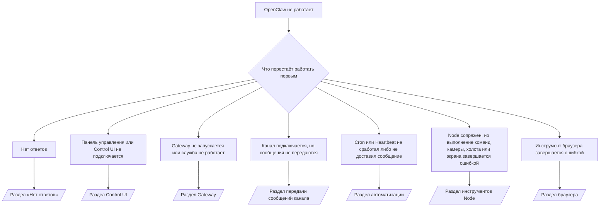

---
read_when:
    - OpenClaw не работает, и вам нужно как можно быстрее устранить проблему
    - Вам нужен процесс первичной диагностики перед переходом к подробным инструкциям.
summary: Центр устранения неполадок OpenClaw с поиском по симптомам
title: Общее устранение неполадок
x-i18n:
    generated_at: "2026-07-13T18:13:44Z"
    model: gpt-5.6
    postprocess_version: locale-links-v1
    prompt_version: 24
    provider: openai
    source_hash: db50e0cdf4d11f3aa6196be445358d904a2b9c40c89243f1b124c77167f6dd85
    source_path: help/troubleshooting.md
    workflow: 16
---

Входная точка для первичной диагностики. 2 минуты на постановку диагноза, затем переходите к подробной странице.

## Первые 60 секунд

Выполните эти команды по порядку:

```bash
openclaw status
openclaw status --all
openclaw gateway probe
openclaw gateway status
openclaw doctor
openclaw channels status --probe
openclaw logs --follow
```

Корректный вывод, по одной строке для каждой команды:

- `openclaw status` показывает настроенные каналы без ошибок аутентификации.
- `openclaw status --all` формирует полный отчёт, которым можно поделиться.
- `openclaw gateway probe` показывает `Reachable: yes`. `Capability: ...` — это
  уровень аутентификации, подтверждённый проверкой; `Read probe: limited - missing scope:
operator.read` означает ограниченную диагностику, а не сбой подключения.
- `openclaw gateway status` показывает `Runtime: running`, `Connectivity probe:
ok` и правдоподобное значение `Capability: ...`. Добавьте `--require-rpc`, чтобы также требовать
  подтверждения RPC с областью доступа на чтение.
- `openclaw doctor` не сообщает о блокирующих ошибках конфигурации или службы.
- `openclaw channels status --probe` возвращает актуальное состояние транспорта для каждой учётной записи
  (`works` / `audit ok`), когда Gateway доступен; если он недоступен,
  возвращает сводки только по конфигурации.
- `openclaw logs --follow` показывает стабильную активность без повторяющихся критических ошибок.

## Возможности ассистента ограничены или отсутствуют инструменты

Проверьте действующий профиль инструментов:

```bash
openclaw status
openclaw status --all
openclaw doctor
```

Распространённые причины:

- `tools.profile: "minimal"` разрешает только `session_status`.
- `tools.profile: "messaging"` — ограниченный профиль для агентов, работающих только с чатом.
- `tools.profile: "coding"` — профиль по умолчанию для новых локальных конфигураций (работа с репозиторием, файлами,
  оболочкой и средой выполнения).
- `tools.profile: "full"` снимает ограничения профиля; используйте его только для доверенных
  агентов под управлением оператора.
- Параметр `agents.list[].tools` отдельного агента сужает или расширяет корневой профиль
  для этого агента.

Измените профиль, перезапустите или перезагрузите Gateway, затем повторно проверьте с помощью
`openclaw status --all`. Полная таблица профилей и групп: [Профили инструментов](/ru/gateway/config-tools#tool-profiles).

## Ошибка Anthropic 429 при длинном контексте

`HTTP 429: rate_limit_error: Extra usage is required for long context requests`
→ [Для длинного контекста Anthropic требует дополнительное использование при ошибке 429](/ru/gateway/troubleshooting#anthropic-429-extra-usage-required-for-long-context).

## Локальный сервер, совместимый с OpenAI, работает напрямую, но не в OpenClaw

Ваш локальный или самостоятельно размещённый сервер `/v1` отвечает на прямые проверки `/v1/chat/completions`,
но завершается ошибкой при `openclaw infer model run` или обычных запусках агента:

1. В ошибке упоминается, что `messages[].content` ожидает строку: задайте
   `models.providers.<provider>.models[].compat.requiresStringContent: true`.
2. Ошибка по-прежнему возникает только при запусках агента OpenClaw: задайте
   `models.providers.<provider>.models[].compat.supportsTools: false` и повторите попытку.
3. Небольшие прямые запросы работают, но сервер аварийно завершается на более крупных запросах OpenClaw:
   это ограничение вышестоящей модели или сервера, а не ошибка OpenClaw. Продолжите в разделе
   [Локальный сервер, совместимый с OpenAI, проходит прямые проверки, но запуски агента завершаются ошибкой](/ru/gateway/troubleshooting#local-openai-compatible-backend-passes-direct-probes-but-agent-runs-fail).

## Установка плагина завершается ошибкой из-за отсутствующих расширений openclaw

`package.json missing openclaw.extensions` означает, что пакет плагина использует
структуру, которую OpenClaw больше не принимает.

Исправьте пакет плагина:

1. Добавьте `openclaw.extensions` в `package.json`, указав собранные файлы среды выполнения
   (обычно `./dist/index.js`).
2. Опубликуйте пакет повторно, затем снова выполните `openclaw plugins install <package>`.

```json
{
  "name": "@openclaw/my-plugin",
  "version": "1.2.3",
  "openclaw": {
    "extensions": ["./dist/index.js"]
  }
}
```

Справка: [Архитектура плагинов](/ru/plugins/architecture)

## Политика установки блокирует установку или обновление плагинов

Обновление завершается, но плагины остаются устаревшими, отключаются или показывают `blocked by install
policy`, `install policy failed closed` либо `Disabled "<plugin>" after plugin
update failure`: проверьте `security.installPolicy`.

Политика установки применяется при установке и обновлении плагинов. Версии плагинов
`@openclaw/*` обычно обновляются вместе с выпуском OpenClaw, поэтому обновление OpenClaw может
потребовать соответствующего обновления плагинов во время синхронизации после обновления.

Не используйте следующие варианты политики, если вы также не поддерживаете соответствующее правило обновления:

- Фиксация плагинов OpenClaw на одной конкретной старой версии (например, только
  `@openclaw/*@2026.5.3`).
- Блокировка только по типу источника (все запросы npm, сетевые запросы или запросы `request.mode:
"update"`).
- Предположение, что команда политики необязательна: когда `security.installPolicy`
  включён, отсутствие, медленная работа, невозможность чтения или блокировка разрешениями исполняемого файла
  политики приводит к отказу с блокировкой.
- Одобрение версий без проверки `openclawVersion` запроса по
  метаданным кандидата плагина.

Предпочитайте правила, разрешающие доверенные обновления `@openclaw/*`, совместимые с
текущим хостом, вместо бессрочной фиксации на одном выпуске. Если npm по умолчанию
заблокирован, добавьте узкое исключение для используемых идентификаторов плагинов и применяйте к `request.mode: "update"`
те же правила доверия, что и к установкам.

Восстановление:

```bash
openclaw doctor --deep
openclaw plugins update --all
openclaw status --all
```

Если политика намеренно строгая, временно ослабьте её на период доверенного обновления,
повторно выполните `openclaw plugins update --all`, а затем восстановите более строгое правило.
Если сбой обновления отключил плагин, проверьте его перед повторным включением:

```bash
openclaw plugins inspect <plugin-id> --runtime --json
openclaw plugins enable <plugin-id>
```

Справка: [Политика установки оператора](/ru/tools/skills-config#operator-install-policy-securityinstallpolicy)

## Плагин присутствует, но заблокирован из-за подозрительного владельца

`openclaw doctor`, настройка или предупреждения при запуске показывают:

```text
кандидат плагина заблокирован: подозрительный владелец (... uid=1000, ожидался uid=0 или root)
плагин присутствует, но заблокирован
```

Файлы плагина принадлежат другому пользователю Unix, а не пользователю процесса, который
их загружает. Не удаляйте конфигурацию плагина; исправьте владельца файлов или запустите
OpenClaw от имени пользователя, которому принадлежит каталог состояния.

Установки Docker работают от имени `node` (uid `1000`). Исправьте подключённые каталоги хоста:

```bash
sudo chown -R 1000:1000 /path/to/openclaw-config /path/to/openclaw-workspace
openclaw doctor --fix
```

Если вы намеренно запускаете OpenClaw от имени root, вместо этого исправьте владельца
корневого каталога управляемых плагинов:

```bash
sudo chown -R root:root /path/to/openclaw-config/npm
openclaw doctor --fix
```

Подробная документация: [Блокировка из-за владельца пути плагина](/ru/tools/plugin#blocked-plugin-path-ownership), [Docker: разрешения и EACCES](/ru/install/docker#shell-helpers-optional)

## Дерево решений



<AccordionGroup>
  <Accordion title="Нет ответов">
    ```bash
    openclaw status
    openclaw gateway status
    openclaw channels status --probe
    openclaw pairing list --channel <channel> [--account <id>]
    openclaw logs --follow
    ```

    Корректный вывод:

    - `Runtime: running`
    - `Connectivity probe: ok`
    - `Capability: read-only`, `write-capable` или `admin-capable`
    - Канал показывает, что транспорт подключён, и, если поддерживается, `works` или
      `audit ok` в `channels status --probe`
    - Отправитель одобрен (или политика личных сообщений открыта либо использует список разрешённых отправителей)

    Характерные записи в журнале:

    - `drop guild message (mention required` → проверка упоминаний Discord заблокировала сообщение.
    - `pairing request` → отправитель не одобрен, ожидается подтверждение сопряжения для личных сообщений.
    - `blocked` / `allowlist` в журналах канала → отправитель, комната или группа отфильтрованы.

    Подробные страницы: [Нет ответов](/ru/gateway/troubleshooting#no-replies), [Устранение неполадок каналов](/ru/channels/troubleshooting), [Сопряжение](/ru/channels/pairing)

  </Accordion>

  <Accordion title="Панель управления или Control UI не подключается">
    ```bash
    openclaw status
    openclaw gateway status
    openclaw logs --follow
    openclaw doctor
    openclaw channels status --probe
    ```

    Корректный вывод:

    - `Dashboard: http://...` показан в `openclaw gateway status`
    - `Connectivity probe: ok`
    - `Capability: read-only`, `write-capable` или `admin-capable`
    - В журналах нет цикла аутентификации

    Характерные записи в журнале:

    - `device identity required` → HTTP или небезопасный контекст не позволяет завершить аутентификацию устройства.
    - `origin not allowed` → браузерный `Origin` не разрешён для целевого Gateway Control UI.
    - `AUTH_TOKEN_MISMATCH` с `canRetryWithDeviceToken=true` → может автоматически выполняться одна повторная попытка с доверенным токеном устройства, использующая кэшированные области доступа сопряжённого токена.
    - повторяющийся `unauthorized` после этой попытки → неверный токен или пароль, несоответствие режима аутентификации либо устаревший токен сопряжённого устройства.
    - `too many failed authentication attempts (retry later)` → повторные сбои из браузерного `Origin` временно блокируются; другие источники localhost используют отдельные группы ограничений. Особенности параллельных повторных попыток Tailscale Serve см. в разделе [Подключение панели управления и Control UI](/ru/gateway/troubleshooting#dashboard-control-ui-connectivity).
    - `gateway connect failed:` → интерфейс использует неверный URL или порт либо Gateway недоступен.

    Подробные страницы: [Подключение панели управления и Control UI](/ru/gateway/troubleshooting#dashboard-control-ui-connectivity), [Control UI](/ru/web/control-ui), [Аутентификация](/ru/gateway/authentication)

  </Accordion>

  <Accordion title="Gateway не запускается или установленная служба не работает">
    ```bash
    openclaw status
    openclaw gateway status
    openclaw logs --follow
    openclaw doctor
    openclaw channels status --probe
    ```

    Корректный вывод:

    - `Service: ... (loaded)`
    - `Runtime: running`
    - `Connectivity probe: ok`
    - `Capability: read-only`, `write-capable` или `admin-capable`

    Характерные записи в журнале:

    - `Gateway start blocked: set gateway.mode=local` или `existing config is missing gateway.mode` → Gateway работает в удалённом режиме либо в конфигурации отсутствует признак локального режима и требуется исправление.
    - `refusing to bind gateway ... without auth` → привязка не к loopback-интерфейсу без допустимого способа аутентификации (токена/пароля или доверенного прокси, если он настроен).
    - `another gateway instance is already listening` или `EADDRINUSE` → порт уже занят.

    Подробные страницы: [Служба Gateway не работает](/ru/gateway/troubleshooting#gateway-service-not-running), [Фоновый процесс](/ru/gateway/background-process), [Конфигурация](/ru/gateway/configuration)

  </Accordion>

  <Accordion title="Канал подключается, но сообщения не передаются">
    ```bash
    openclaw status
    openclaw gateway status
    openclaw logs --follow
    openclaw doctor
    openclaw channels status --probe
    ```

    Корректный вывод:

    - Транспорт канала подключён.
    - Проверки сопряжения и списка разрешений пройдены.
    - Упоминания обнаруживаются там, где они обязательны.

    Характерные записи в журнале:

    - `mention required` → проверка упоминаний в группе заблокировала обработку.
    - `pairing` / `pending` → отправитель личного сообщения ещё не одобрен.
    - `not_in_channel`, `missing_scope`, `Forbidden`, `401/403` → проблема с токеном разрешений канала.

    Подробные страницы: [Канал подключён, но сообщения не передаются](/ru/gateway/troubleshooting#channel-connected-messages-not-flowing), [Устранение неполадок каналов](/ru/channels/troubleshooting)

  </Accordion>

  <Accordion title="Cron или Heartbeat не сработал либо не доставил сообщение">
    ```bash
    openclaw status
    openclaw gateway status
    openclaw cron status
    openclaw cron list
    openclaw cron runs --id <jobId> --limit 20
    openclaw logs --follow
    ```

    Корректный вывод:

    - `cron status` показывает, что планировщик включён и ожидается следующее пробуждение.
    - `cron runs` показывает недавние записи `ok`.
    - Heartbeat включён и находится в пределах активных часов.

    Сигнатуры журналов:

    - `cron: scheduler disabled; jobs will not run automatically` → Cron отключён.
    - `heartbeat skipped` с причиной `quiet-hours` → вне настроенных активных часов.
    - `heartbeat skipped` с причиной `empty-heartbeat-file` → `HEARTBEAT.md` существует, но содержит только пустые строки, комментарии, заголовки, ограждения или заготовки пустых контрольных списков.
    - `heartbeat skipped` с причиной `no-tasks-due` → режим задач активен, но время выполнения по интервалу ещё не наступило.
    - `heartbeat skipped` с причиной `alerts-disabled` → `showOk`, `showAlerts` и `useIndicator` отключены.
    - `requests-in-flight` → основной канал занят; пробуждение Heartbeat отложено.
    - `unknown accountId` → целевая учётная запись доставки Heartbeat не существует.

    Подробные страницы: [Доставка Cron и Heartbeat](/ru/gateway/troubleshooting#cron-and-heartbeat-delivery), [Запланированные задачи: устранение неполадок](/ru/automation/cron-jobs#troubleshooting), [Heartbeat](/ru/gateway/heartbeat)

  </Accordion>

  <Accordion title="Node сопряжён, но инструмент не выполняет операции с камерой, холстом, экраном или exec">
    ```bash
    openclaw status
    openclaw gateway status
    openclaw nodes status
    openclaw nodes describe --node <idOrNameOrIp>
    openclaw logs --follow
    ```

    Корректный вывод:

    - Node указан как подключённый и сопряжённый для роли `node`.
    - Возможность для вызываемой команды доступна.
    - Разрешение для инструмента предоставлено.

    Сигнатуры журналов:

    - `NODE_BACKGROUND_UNAVAILABLE` → выведите приложение Node на передний план.
    - `*_PERMISSION_REQUIRED` → разрешение ОС отклонено или отсутствует.
    - `SYSTEM_RUN_DENIED: approval required` → ожидается одобрение exec.
    - `SYSTEM_RUN_DENIED: allowlist miss` → команды нет в списке разрешённых для exec.

    Подробные страницы: [Node сопряжён, но инструмент не работает](/ru/gateway/troubleshooting#node-paired-tool-fails), [Устранение неполадок Node](/ru/nodes/troubleshooting), [Одобрения exec](/ru/tools/exec-approvals)

  </Accordion>

  <Accordion title="Exec внезапно запрашивает одобрение">
    ```bash
    openclaw config get tools.exec.host
    openclaw config get tools.exec.security
    openclaw config get tools.exec.ask
    openclaw gateway restart
    ```

    Что изменилось:

    - Если `tools.exec.host` не задан, по умолчанию используется `auto`, который разрешается в `sandbox`,
      когда среда выполнения песочницы активна, и в `gateway` в противном случае.
    - `host=auto` отвечает только за маршрутизацию; поведение без запроса обеспечивают
      `security=full` и `ask=off` на Gateway/Node.
    - Если `tools.exec.security` не задан, по умолчанию на `gateway`/`node` используется `full`.
    - Если `tools.exec.ask` не задан, по умолчанию используется `off`.
    - Если появляются запросы на одобрение, какая-либо локальная для хоста или сеанса политика
      ужесточила настройки exec относительно этих значений по умолчанию.

    Восстановите текущие значения по умолчанию без одобрения:

    ```bash
    openclaw config set tools.exec.host gateway
    openclaw config set tools.exec.security full
    openclaw config set tools.exec.ask off
    openclaw gateway restart
    ```

    Более безопасные варианты:

    - Задайте только `tools.exec.host=gateway` для стабильной маршрутизации на хост.
    - Используйте `security=allowlist` с `ask=on-miss` для выполнения exec на хосте с проверкой
      при отсутствии команды в списке разрешённых.
    - Включите режим песочницы, чтобы `host=auto` снова разрешался в `sandbox`.

    Сигнатуры журналов:

    - `Approval required.` → команда ожидает `/approve ...`.
    - `SYSTEM_RUN_DENIED: approval required` → ожидается одобрение exec на хосте Node.
    - `exec host=sandbox requires a sandbox runtime for this session` → песочница выбрана неявно или явно, но режим песочницы отключён.

    Подробные страницы: [Exec](/ru/tools/exec), [Одобрения exec](/ru/tools/exec-approvals), [Безопасность: что проверяет аудит](/ru/gateway/security#what-the-audit-checks-high-level)

  </Accordion>

  <Accordion title="Инструмент браузера не работает">
    ```bash
    openclaw status
    openclaw gateway status
    openclaw browser status
    openclaw logs --follow
    openclaw doctor
    ```

    Корректный вывод:

    - Статус браузера показывает `running: true` и выбранный браузер/профиль.
    - Профиль `openclaw` запускается либо профиль `user` видит локальные вкладки Chrome.

    Сигнатуры журналов:

    - `unknown command "browser"` → задан `plugins.allow`, который исключает `browser`.
    - `Failed to start Chrome CDP on port` → не удалось запустить локальный браузер.
    - `browser.executablePath not found` → настроен неверный путь к исполняемому файлу.
    - `browser.cdpUrl must be http(s) or ws(s)` → в настроенном URL CDP используется неподдерживаемая схема.
    - `browser.cdpUrl has invalid port` → в настроенном URL CDP указан недопустимый порт или порт вне допустимого диапазона.
    - `No Chrome tabs found for profile="user"` → в профиле подключения Chrome MCP нет открытых локальных вкладок Chrome.
    - `Remote CDP for profile "<name>" is not reachable` → настроенная удалённая конечная точка CDP недоступна с этого хоста.
    - `Browser attachOnly is enabled ... not reachable` → у профиля только для подключения нет активной цели CDP.
    - Устаревшие переопределения области просмотра, тёмного режима, локали или автономного режима в профилях только для подключения или удалённых профилях CDP → выполните `openclaw browser stop --browser-profile <name>`, чтобы закрыть сеанс управления и сбросить состояние эмуляции без перезапуска Gateway.

    Подробные страницы: [Инструмент браузера не работает](/ru/gateway/troubleshooting#browser-tool-fails), [Отсутствует команда или инструмент браузера](/ru/tools/browser#missing-browser-command-or-tool), [Браузер: устранение неполадок в Linux](/ru/tools/browser-linux-troubleshooting), [Браузер: устранение неполадок удалённого CDP в WSL2/Windows](/ru/tools/browser-wsl2-windows-remote-cdp-troubleshooting)

  </Accordion>

</AccordionGroup>

## Связанные материалы

- [Часто задаваемые вопросы](/ru/help/faq) — часто задаваемые вопросы
- [Устранение неполадок Gateway](/ru/gateway/troubleshooting) — проблемы, относящиеся к Gateway
- [Doctor](/ru/gateway/doctor) — автоматические проверки состояния и исправления
- [Устранение неполадок каналов](/ru/channels/troubleshooting) — проблемы с подключением каналов
- [Запланированные задачи: устранение неполадок](/ru/automation/cron-jobs#troubleshooting) — проблемы Cron и Heartbeat
