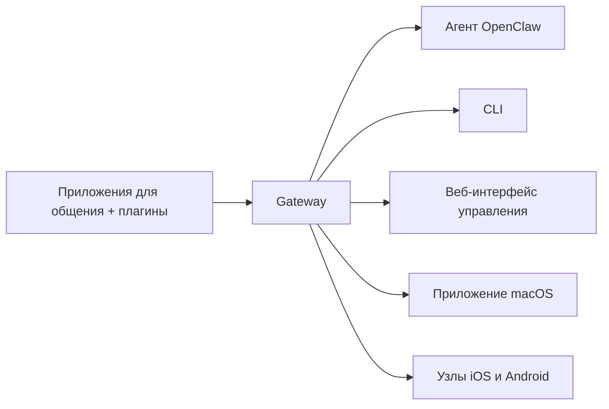

---
read_when:
    - Знакомство новичков с OpenClaw
summary: OpenClaw — это многоканальный Gateway для ИИ-агентов, работающий в любой ОС.
title: OpenClaw
x-i18n:
    generated_at: "2026-07-13T18:17:52Z"
    model: gpt-5.6
    postprocess_version: locale-links-v1
    prompt_version: 24
    provider: openai
    source_hash: fe97e7299be4855fd9af21838e0626b5a5c8aafe46d982859e9033f0efec2443
    source_path: index.md
    workflow: 16
---

# OpenClaw 🦞

<p align="center">
    
    
</p>

> _«ОТШЕЛУШИВАТЬ! ОТШЕЛУШИВАТЬ!»_ — вероятно, космический омар

<p align="center">
  <strong>Gateway для любой ОС, связывающий ИИ-агентов с Discord, Google Chat, iMessage, Matrix, Microsoft Teams, Signal, Slack, Telegram, WhatsApp, Zalo и другими сервисами.</strong><br />
  Отправьте сообщение и получите ответ агента прямо на мобильном устройстве. Запустите один Gateway для плагинов каналов, WebChat и мобильных узлов.
</p>

<Columns>
  <Card title="Начало работы" href="/ru/start/getting-started" icon="rocket">
    Установите OpenClaw и запустите Gateway за считаные минуты.
  </Card>
  <Card title="Первоначальная настройка" href="/ru/start/wizard" icon="list-checks">
    Пошаговая настройка с `openclaw onboard` и процедурами сопряжения.
  </Card>
  <Card title="Подключение канала" href="/ru/channels" icon="message-circle">
    Подключите Discord, Signal, Telegram, WhatsApp и другие сервисы, чтобы общаться откуда угодно.
  </Card>
  <Card title="Открытие интерфейса управления" href="/ru/web/control-ui" icon="layout-dashboard">
    Запустите браузерную панель для чата, конфигурации и сеансов.
  </Card>
</Columns>

## Обзор документации

В мобильных браузерах меню разделов может отображаться без полной панели вкладок для настольной версии. Используйте
эти ссылки на центральные страницы, чтобы перейти из содержимого страницы к тем же разделам документации верхнего уровня.

<Columns>
  <Card title="Начало работы" href="/ru" icon="rocket">
    Обзор, демонстрация, первые шаги и руководства по настройке.
  </Card>
  <Card title="Установка" href="/ru/install" icon="download">
    Способы установки, обновления, контейнеры, хостинг и расширенная настройка.
  </Card>
  <Card title="Каналы" href="/ru/channels" icon="messages-square">
    Каналы обмена сообщениями, сопряжение, маршрутизация, группы доступа и контроль качества каналов.
  </Card>
  <Card title="Агенты" href="/ru/concepts/architecture" icon="bot">
    Архитектура, сеансы, контекст, память и маршрутизация между несколькими агентами.
  </Card>
  <Card title="Возможности" href="/ru/tools" icon="wand-sparkles">
    Инструменты, навыки, Cron, Webhook и возможности автоматизации.
  </Card>
  <Card title="ClawHub" href="/clawhub" icon="store">
    Магазин плагинов, публикация, курирование и рекомендации по доверию.
  </Card>
  <Card title="Модели" href="/ru/providers" icon="brain">
    Провайдеры, конфигурация моделей, аварийное переключение и локальные сервисы моделей.
  </Card>
  <Card title="Платформы" href="/ru/platforms" icon="monitor-smartphone">
    macOS, Windows, iOS, Android, узлы и веб-интерфейсы.
  </Card>
  <Card title="Gateway и эксплуатация" href="/ru/gateway" icon="server">
    Конфигурация, безопасность, диагностика и эксплуатация Gateway.
  </Card>
  <Card title="Справочник" href="/ru/cli" icon="terminal">
    Справочник по CLI, схемы, RPC, примечания к выпускам и шаблоны.
  </Card>
  <Card title="Помощь" href="/ru/help" icon="life-buoy">
    Устранение неполадок, часто задаваемые вопросы, тестирование, диагностика и проверка окружения.
  </Card>
</Columns>

## Что такое OpenClaw?

OpenClaw — это **самостоятельно размещаемый Gateway**, который через плагины каналов подключает ваши любимые приложения для общения — Discord, Google Chat, iMessage, Matrix, Microsoft Teams, Signal, Slack, Telegram, WhatsApp, Zalo и другие — к ИИ-агентам для программирования. Вы запускаете единственный процесс Gateway на собственном компьютере (или сервере), и он становится связующим звеном между приложениями для обмена сообщениями и всегда доступным ИИ-помощником.

**Для кого он предназначен?** Для разработчиков и опытных пользователей, которым нужен персональный ИИ-помощник, доступный через сообщения из любой точки, без потери контроля над своими данными и зависимости от размещаемого стороннего сервиса.

**Чем он отличается?**

- **Самостоятельное размещение**: работает на вашем оборудовании по вашим правилам
- **Многоканальность**: один Gateway одновременно обслуживает все настроенные плагины каналов
- **Ориентация на агентов**: создан для агентов программирования с поддержкой инструментов, сеансов, памяти и маршрутизации между несколькими агентами
- **Открытый исходный код**: лицензия MIT, развитие силами сообщества

**Что потребуется?** Node 24.15+ (рекомендуется), Node 22 LTS (`22.22.3+`) для совместимости либо Node 25.9+, ключ API выбранного провайдера и 5 минут. Для максимального качества и безопасности используйте самую мощную доступную модель последнего поколения.

## Принцип работы



Gateway служит единым источником достоверных данных о сеансах, маршрутизации и подключениях каналов.

## Основные возможности

<Columns>
  <Card title="Многоканальный Gateway" icon="network" href="/ru/channels">
    Discord, iMessage, Signal, Slack, Telegram, WhatsApp, WebChat и другие сервисы через единый процесс Gateway.
  </Card>
  <Card title="Каналы на основе плагинов" icon="plug" href="/ru/tools/plugin">
    Плагины каналов добавляют Matrix, Nostr, Twitch, Zalo и другие сервисы; официальные плагины устанавливаются по запросу.
  </Card>
  <Card title="Маршрутизация между несколькими агентами" icon="route" href="/ru/concepts/multi-agent">
    Изолированные сеансы для каждого агента, рабочего пространства или отправителя.
  </Card>
  <Card title="Поддержка мультимедиа" icon="image" href="/ru/nodes/images">
    Отправка и получение изображений, аудиозаписей и документов.
  </Card>
  <Card title="Веб-интерфейс управления" icon="monitor" href="/ru/web/control-ui">
    Браузерная панель для чата, конфигурации, сеансов и узлов.
  </Card>
  <Card title="Мобильные узлы" icon="smartphone" href="/ru/nodes">
    Сопрягайте узлы iOS и Android для рабочих процессов с Canvas, камерой и голосовым управлением.
  </Card>
</Columns>

## Быстрый старт

<Steps>
  <Step title="Установите OpenClaw">
    ```bash
    npm install -g openclaw@latest
    ```
  </Step>
  <Step title="Выполните первоначальную настройку и установите службу">
    ```bash
    openclaw onboard --install-daemon
    ```
  </Step>
  <Step title="Начните общение">
    Откройте интерфейс управления в браузере и отправьте сообщение:

    ```bash
    openclaw dashboard
    ```

    Либо подключите канал ([Telegram](/ru/channels/telegram) настраивается быстрее всего) и общайтесь с телефона.

  </Step>
</Steps>

Нужны полные инструкции по установке и настройке среды разработки? См. [Начало работы](/ru/start/getting-started).

## Панель управления

После запуска Gateway откройте браузерный интерфейс управления.

- Локальный адрес по умолчанию: [http://127.0.0.1:18789/](http://127.0.0.1:18789/)
- Удалённый доступ: [Веб-интерфейсы](/ru/web) и [Tailscale](/ru/gateway/tailscale)

<p align="center">
  
</p>

## Конфигурация (необязательно)

Конфигурация находится в `~/.openclaw/openclaw.json`.

- Если вы **ничего не предпринимаете**, OpenClaw использует встроенную среду выполнения агента OpenClaw; личные сообщения используют общий основной сеанс агента, а для каждого группового чата создаётся отдельный сеанс.
- Чтобы ограничить доступ, начните с `channels.whatsapp.allowFrom` и правил упоминаний (для групп).

Пример:

```json5
{
  channels: {
    whatsapp: {
      allowFrom: ["+15555550123"],
      groups: { "*": { requireMention: true } },
    },
  },
  messages: { groupChat: { mentionPatterns: ["@openclaw"] } },
}
```

## С чего начать

<Columns>
  <Card title="Центральные страницы документации" href="/ru/start/hubs" icon="book-open">
    Вся документация и руководства, организованные по сценариям использования.
  </Card>
  <Card title="Конфигурация" href="/ru/gateway/configuration" icon="settings">
    Основные настройки Gateway, токены и конфигурация провайдеров.
  </Card>
  <Card title="Удалённый доступ" href="/ru/gateway/remote" icon="globe">
    Схемы доступа через SSH и tailnet.
  </Card>
  <Card title="Каналы" href="/ru/channels/telegram" icon="message-square">
    Настройка отдельных каналов для Discord, Feishu, Microsoft Teams, Telegram, WhatsApp и других сервисов.
  </Card>
  <Card title="Узлы" href="/ru/nodes" icon="smartphone">
    Узлы iOS и Android с сопряжением, Canvas, камерой и действиями на устройстве.
  </Card>
  <Card title="Помощь" href="/ru/help" icon="life-buoy">
    Типовые исправления и отправная точка для устранения неполадок.
  </Card>
</Columns>

## Подробнее

<Columns>
  <Card title="Полный список возможностей" href="/ru/concepts/features" icon="list">
    Полный перечень возможностей каналов, маршрутизации и работы с мультимедиа.
  </Card>
  <Card title="Маршрутизация между несколькими агентами" href="/ru/concepts/multi-agent" icon="route">
    Изоляция рабочих пространств и отдельные сеансы для каждого агента.
  </Card>
  <Card title="Безопасность" href="/ru/gateway/security" icon="shield">
    Токены, списки разрешений и средства обеспечения безопасности.
  </Card>
  <Card title="Устранение неполадок" href="/ru/gateway/troubleshooting" icon="wrench">
    Диагностика Gateway и распространённые ошибки.
  </Card>
  <Card title="О проекте и благодарности" href="/ru/reference/credits" icon="info">
    История проекта, участники и лицензия.
  </Card>
</Columns>
