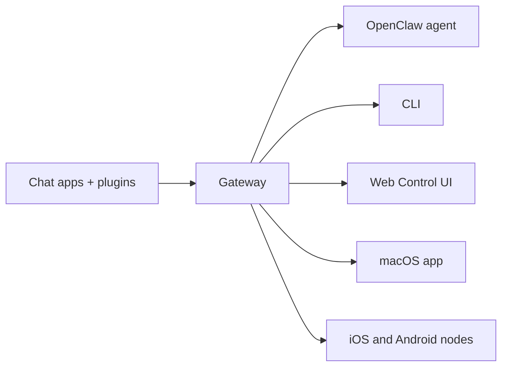

---
read_when:
    - Знакомство новичков с OpenClaw
summary: OpenClaw — это многоканальный Gateway для AI-агентов, который работает на любой ОС.
title: OpenClaw
x-i18n:
    generated_at: "2026-06-28T23:04:08Z"
    model: gpt-5.5
    postprocess_version: locale-links-v1
    provider: openai
    source_hash: fcaa54a0a6d7aa62193fd9f03428bbcbfdcb2c00a184bcd6f49e4e093fefc473
    source_path: index.md
    workflow: 16
---

# OpenClaw 🦞

<p align="center">
    
    
</p>

> _"ОБНОВЛЯЙСЯ! ОБНОВЛЯЙСЯ!"_ — космический омар, вероятно

<p align="center">
  <strong>Gateway для любой ОС, связывающий AI-агентов в Discord, Google Chat, iMessage, Matrix, Microsoft Teams, Signal, Slack, Telegram, WhatsApp, Zalo и других сервисах.</strong><br />
  Отправьте сообщение и получите ответ агента прямо из кармана. Запустите один Gateway для встроенных каналов, комплектных Plugin каналов, WebChat и мобильных узлов.
</p>

<Columns>
  <Card title="Начать" href="/ru/start/getting-started" icon="rocket">
    Установите OpenClaw и запустите Gateway за считанные минуты.
  </Card>
  <Card title="Запустить вводную настройку" href="/ru/start/wizard" icon="sparkles">
    Пошаговая настройка с `openclaw onboard` и сценариями сопряжения.
  </Card>
  <Card title="Открыть Control UI" href="/ru/web/control-ui" icon="layout-dashboard">
    Запустите браузерную панель управления для чата, конфигурации и сеансов.
  </Card>
</Columns>

## Что такое OpenClaw?

OpenClaw — это **самостоятельно размещаемый gateway**, который подключает ваши любимые чат-приложения и канальные поверхности — встроенные каналы, а также комплектные или внешние Plugin каналов, такие как Discord, Google Chat, iMessage, Matrix, Microsoft Teams, Signal, Slack, Telegram, WhatsApp, Zalo и другие, — к AI-агентам для программирования. Вы запускаете один процесс Gateway на своем компьютере (или сервере), и он становится мостом между вашими приложениями для сообщений и всегда доступным AI-ассистентом.

**Для кого это?** Для разработчиков и продвинутых пользователей, которым нужен личный AI-ассистент, которому можно написать откуда угодно, не теряя контроль над своими данными и не полагаясь на размещенный сервис.

**Чем он отличается?**

- **Самостоятельное размещение**: работает на вашем оборудовании, по вашим правилам
- **Несколько каналов**: один Gateway одновременно обслуживает встроенные каналы, а также комплектные или внешние Plugin каналов
- **Для агентов**: создан для агентов программирования с использованием инструментов, сеансами, памятью и маршрутизацией между несколькими агентами
- **Открытый исходный код**: лицензия MIT, развитие сообществом

**Что вам нужно?** Node 24 (рекомендуется) или Node 22 LTS (`22.19+`) для совместимости, API-ключ выбранного провайдера и 5 минут. Для лучшего качества и безопасности используйте самую сильную доступную модель последнего поколения.

## Как это работает



Gateway — единый источник истины для сеансов, маршрутизации и подключений каналов.

## Ключевые возможности

<Columns>
  <Card title="Многоканальный gateway" icon="network" href="/ru/channels">
    Discord, iMessage, Signal, Slack, Telegram, WhatsApp, WebChat и другие в одном процессе Gateway.
  </Card>
  <Card title="Plugin каналов" icon="plug" href="/ru/tools/plugin">
    Комплектные Plugin добавляют Matrix, Nostr, Twitch, Zalo и другие каналы в обычных актуальных выпусках.
  </Card>
  <Card title="Маршрутизация между несколькими агентами" icon="route" href="/ru/concepts/multi-agent">
    Изолированные сеансы для каждого агента, рабочей области или отправителя.
  </Card>
  <Card title="Поддержка медиа" icon="image" href="/ru/nodes/images">
    Отправляйте и получайте изображения, аудио и документы.
  </Card>
  <Card title="Web Control UI" icon="monitor" href="/ru/web/control-ui">
    Браузерная панель управления для чата, конфигурации, сеансов и узлов.
  </Card>
  <Card title="Мобильные узлы" icon="smartphone" href="/ru/nodes">
    Сопрягайте узлы iOS и Android для рабочих процессов с Canvas, камерой и голосом.
  </Card>
</Columns>

## Быстрый старт

<Steps>
  <Step title="Установите OpenClaw">
    ```bash
    npm install -g openclaw@latest
    ```
  </Step>
  <Step title="Выполните вводную настройку и установите службу">
    ```bash
    openclaw onboard --install-daemon
    ```
  </Step>
  <Step title="Чат">
    Откройте Control UI в браузере и отправьте сообщение:

    ```bash
    openclaw dashboard
    ```

    Или подключите канал ([Telegram](/ru/channels/telegram) быстрее всего) и общайтесь с телефона.

  </Step>
</Steps>

Нужны полная установка и настройка среды разработки? См. [Начало работы](/ru/start/getting-started).

## Панель управления

Откройте браузерный Control UI после запуска Gateway.

- Локально по умолчанию: [http://127.0.0.1:18789/](http://127.0.0.1:18789/)
- Удаленный доступ: [Веб-поверхности](/ru/web) и [Tailscale](/ru/gateway/tailscale)

<p align="center">
  
</p>

## Конфигурация (необязательно)

Конфигурация находится в `~/.openclaw/openclaw.json`.

- Если вы **ничего не делаете**, OpenClaw использует комплектную среду выполнения агента OpenClaw с сеансами для каждого отправителя.
- Если вы хотите ограничить доступ, начните с `channels.whatsapp.allowFrom` и (для групп) правил упоминаний.

Пример:

```json5
{
  channels: {
    whatsapp: {
      allowFrom: ["+15555550123"],
      groups: { "*": { requireMention: true } },
    },
  },
  messages: { groupChat: { mentionPatterns: ["@openclaw"] } },
}
```

## Начните здесь

<Columns>
  <Card title="Центры документации" href="/ru/start/hubs" icon="book-open">
    Вся документация и руководства, организованные по сценариям использования.
  </Card>
  <Card title="Конфигурация" href="/ru/gateway/configuration" icon="settings">
    Основные настройки Gateway, токены и конфигурация провайдера.
  </Card>
  <Card title="Удаленный доступ" href="/ru/gateway/remote" icon="globe">
    Шаблоны доступа через SSH и tailnet.
  </Card>
  <Card title="Каналы" href="/ru/channels/telegram" icon="message-square">
    Настройка по каналам для Feishu, Microsoft Teams, WhatsApp, Telegram, Discord и других.
  </Card>
  <Card title="Узлы" href="/ru/nodes" icon="smartphone">
    Узлы iOS и Android с сопряжением, Canvas, камерой и действиями устройства.
  </Card>
  <Card title="Помощь" href="/ru/help" icon="life-buoy">
    Распространенные исправления и точка входа для устранения неполадок.
  </Card>
</Columns>

## Подробнее

<Columns>
  <Card title="Полный список функций" href="/ru/concepts/features" icon="list">
    Полные возможности каналов, маршрутизации и медиа.
  </Card>
  <Card title="Маршрутизация между несколькими агентами" href="/ru/concepts/multi-agent" icon="route">
    Изоляция рабочих областей и сеансы для каждого агента.
  </Card>
  <Card title="Безопасность" href="/ru/gateway/security" icon="shield">
    Токены, списки разрешенных адресатов и средства безопасности.
  </Card>
  <Card title="Устранение неполадок" href="/ru/gateway/troubleshooting" icon="wrench">
    Диагностика Gateway и распространенные ошибки.
  </Card>
  <Card title="О проекте и благодарности" href="/ru/reference/credits" icon="info">
    Истоки проекта, участники и лицензия.
  </Card>
</Columns>
