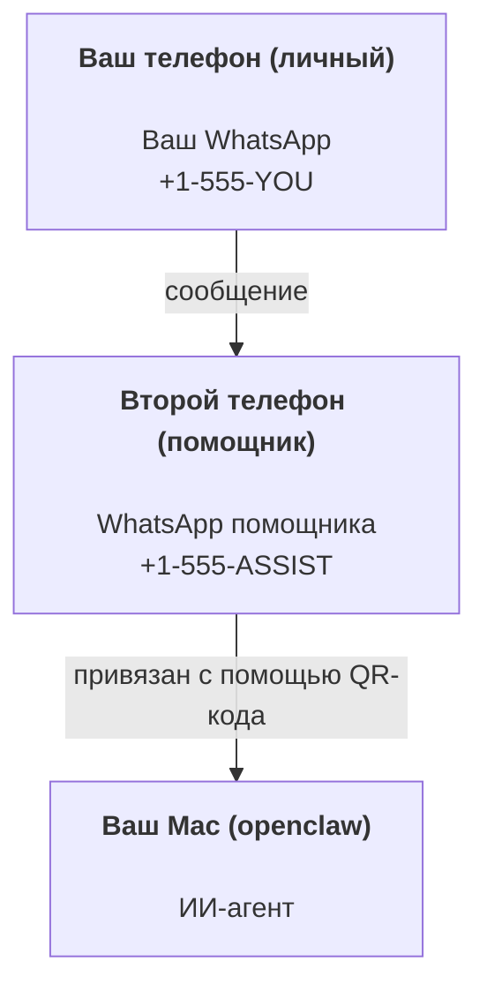

---
read_when:
    - Первоначальная настройка нового экземпляра ассистента
    - Анализ последствий для безопасности и разрешений
summary: Полное руководство по использованию OpenClaw в качестве личного помощника с мерами предосторожности
title: Настройка персонального помощника
x-i18n:
    generated_at: "2026-07-13T18:39:51Z"
    model: gpt-5.6
    postprocess_version: locale-links-v1
    prompt_version: 24
    provider: openai
    source_hash: e8c34e31314f55647059fd600935330110add27b338a675bc0ce1529bebb207d
    source_path: start/openclaw.md
    workflow: 16
---

OpenClaw — это самостоятельно размещаемый Gateway, который подключает Discord, Google Chat, iMessage, Matrix, Microsoft Teams, Signal, Slack, Telegram, WhatsApp, Zalo и другие сервисы к ИИ-агентам. В этом руководстве описана настройка «личного помощника»: выделенный номер WhatsApp, который работает как ваш постоянно доступный ИИ-помощник.

## Прежде всего — безопасность

Предоставляя агенту доступ к каналу, вы позволяете ему выполнять команды на вашем компьютере (в зависимости от вашей политики использования инструментов), читать и записывать файлы в рабочей области и отправлять сообщения через любой подключённый канал. Начните с консервативных настроек:

- Всегда задавайте `channels.whatsapp.allowFrom` (никогда не предоставляйте всему интернету открытый доступ к вашему личному Mac).
- Используйте для помощника отдельный номер WhatsApp.
- По умолчанию Heartbeat выполняется каждые 30 минут. Отключите его, пока не убедитесь в надёжности настройки, задав `agents.defaults.heartbeat.every: "0m"`.

## Предварительные требования

- OpenClaw установлен и прошёл первоначальную настройку — если вы ещё этого не сделали, см. [Начало работы](/ru/start/getting-started)
- Второй номер телефона (SIM/eSIM/предоплаченный) для помощника

## Настройка с двумя телефонами (рекомендуется)

Вам нужна следующая схема:



Если вы подключите к OpenClaw свой личный WhatsApp, каждое адресованное вам сообщение станет «входными данными агента». Обычно это не то, что вам нужно.

## Быстрый запуск за 5 минут

1. Подключите WhatsApp Web (появится QR-код; отсканируйте его телефоном помощника):

```bash
openclaw channels login
```

2. Запустите Gateway (не завершайте его работу):

```bash
openclaw gateway --port 18789
```

3. Добавьте минимальную конфигурацию в `~/.openclaw/openclaw.json`:

```json5
{
  gateway: { mode: "local" },
  channels: { whatsapp: { allowFrom: ["+15555550123"] } },
}
```

Теперь отправьте сообщение на номер помощника с телефона, включённого в список разрешённых.

После завершения первоначальной настройки OpenClaw автоматически открывает панель управления и выводит обычную ссылку (без токена). Если панель управления запрашивает аутентификацию, вставьте настроенный общий секрет в настройки Control UI. По умолчанию при первоначальной настройке используется токен (`gateway.auth.token`), но также поддерживается аутентификация по паролю, если вы изменили `gateway.auth.mode` на `password`. Чтобы открыть панель позднее, используйте `openclaw dashboard`.

## Предоставление агенту рабочей области (AGENTS)

OpenClaw читает рабочие инструкции и «память» из каталога своей рабочей области.

По умолчанию OpenClaw использует `~/.openclaw/workspace` в качестве рабочей области агента и автоматически создаёт её (вместе с начальными файлами `AGENTS.md`, `SOUL.md`, `TOOLS.md`, `IDENTITY.md`, `USER.md`, `HEARTBEAT.md`) во время первоначальной настройки или при первом запуске агента. `BOOTSTRAP.md` создаётся только для совершенно новой рабочей области и не должен появляться снова после удаления. `MEMORY.md` необязателен и никогда не создаётся автоматически; если он существует, то загружается для обычных сеансов. В сеансы субагентов внедряются только `AGENTS.md` и `TOOLS.md`.

<Tip>
Считайте эту папку памятью OpenClaw и создайте в ней репозиторий git (желательно приватный), чтобы иметь резервные копии файлов `AGENTS.md` и памяти. Если git установлен, совершенно новые рабочие области автоматически инициализируются с помощью `git init`.
</Tip>

Чтобы создать рабочую область и каталоги конфигурации без запуска полного мастера первоначальной настройки:

```bash
openclaw setup --baseline
```

(Просто `openclaw setup` является псевдонимом для `openclaw onboard` и запускает полный интерактивный мастер.)

Полная структура рабочей области и руководство по резервному копированию: [Рабочая область агента](/ru/concepts/agent-workspace)
Работа с памятью: [Память](/ru/concepts/memory)

Необязательно: выберите другую рабочую область с помощью `agents.defaults.workspace` (поддерживает `~`).

```json5
{
  agents: {
    defaults: {
      workspace: "~/.openclaw/workspace",
    },
  },
}
```

Если вы уже поставляете собственные файлы рабочей области из репозитория, можно полностью отключить создание начальных файлов:

```json5
{
  agents: {
    defaults: {
      skipBootstrap: true,
    },
  },
}
```

## Конфигурация, превращающая OpenClaw в «помощника»

Настройки OpenClaw по умолчанию хорошо подходят для помощника, но обычно требуется настроить:

- личность и инструкции в [`SOUL.md`](/ru/concepts/soul)
- настройки рассуждения по умолчанию (при необходимости)
- Heartbeat (после того как вы убедитесь в надёжности настройки)

Пример:

```json5
{
  logging: { level: "info" },
  agents: {
    defaults: {
      model: { primary: "anthropic/claude-opus-4-8" },
      workspace: "~/.openclaw/workspace",
      thinkingDefault: "high",
      timeoutSeconds: 1800,
      // Сначала используйте 0; включите позднее.
      heartbeat: { every: "0m" },
    },
    list: [
      {
        id: "main",
        default: true,
        groupChat: {
          mentionPatterns: ["@openclaw", "openclaw"],
        },
      },
    ],
  },
  channels: {
    whatsapp: {
      allowFrom: ["+15555550123"],
      groups: {
        "*": { requireMention: true },
      },
    },
  },
  session: {
    scope: "per-sender",
    resetTriggers: ["/new", "/reset"],
    reset: {
      mode: "daily",
      atHour: 4,
      idleMinutes: 10080,
    },
  },
}
```

## Сеансы и память

- Строки сеансов, строки расшифровок и метаданные (использование токенов, последний маршрут и т. д.): `~/.openclaw/agents/<agentId>/agent/openclaw-agent.sqlite`
- Устаревшие и архивные артефакты расшифровок: `~/.openclaw/agents/<agentId>/sessions/`
- Источник для миграции устаревших строк: `~/.openclaw/agents/<agentId>/sessions/sessions.json`
- `/new` или `/reset` начинает новый сеанс для этого чата (настраивается с помощью `session.resetTriggers`). Если отправить команду отдельно, OpenClaw подтверждает сброс без обращения к модели.
- `/compact [instructions]` выполняет Compaction контекста сеанса и сообщает оставшийся бюджет контекста.

## Heartbeat (проактивный режим)

По умолчанию OpenClaw запускает Heartbeat каждые 30 минут со следующим запросом:
`Read HEARTBEAT.md if it exists (workspace context). Follow it strictly. Do not infer or repeat old tasks from prior chats. If nothing needs attention, reply HEARTBEAT_OK.`
Чтобы отключить его, задайте `agents.defaults.heartbeat.every: "0m"`.

- Если `HEARTBEAT.md` существует, но фактически пуст (содержит только пустые строки, комментарии Markdown/HTML, заголовки Markdown наподобие `# Heading`, маркеры блоков кода или пустые заготовки списков задач), OpenClaw пропускает запуск Heartbeat, чтобы сократить количество обращений к API.
- Если файл отсутствует, Heartbeat всё равно запускается, а модель решает, что делать.
- Если агент отвечает `HEARTBEAT_OK` (необязательно с коротким дополнением; см. `agents.defaults.heartbeat.ackMaxChars`), OpenClaw не выполняет исходящую доставку для этого Heartbeat.
- По умолчанию разрешена доставка Heartbeat адресатам `user:<id>` типа личных сообщений. Задайте `agents.defaults.heartbeat.directPolicy: "block"`, чтобы отключить доставку прямым адресатам, сохранив активными запуски Heartbeat.
- Heartbeat выполняет полные циклы работы агента — более короткие интервалы расходуют больше токенов.

```json5
{
  agents: {
    defaults: {
      heartbeat: { every: "30m" },
    },
  },
}
```

## Входящие и исходящие медиафайлы

Входящие вложения (изображения, аудиофайлы и документы) можно передавать вашей команде с помощью шаблонов:

- `{{MediaPath}}` (локальный путь к временному файлу)
- `{{MediaUrl}}` (псевдо-URL)
- `{{Transcript}}` (если включено распознавание аудио)

Для исходящих вложений от агента используются структурированные поля медиафайлов в инструменте сообщений или полезной нагрузке ответа, например `media`, `mediaUrl`, `mediaUrls`, `path` или `filePath`. Пример аргументов инструмента сообщений:

```json
{
  "message": "Вот снимок экрана.",
  "mediaUrl": "https://example.com/screenshot.png"
}
```

OpenClaw отправляет структурированные медиафайлы вместе с текстом. Устаревшие финальные ответы помощника всё ещё могут нормализоваться для обеспечения совместимости, но вывод инструментов, вывод браузера, потоковые блоки и действия с сообщениями не интерпретируют текст как команды для вложений.

Поведение локальных путей соответствует той же модели доверия при чтении файлов, что используется агентом:

- Если `tools.fs.workspaceOnly` имеет значение `true`, исходящие локальные пути к медиафайлам остаются ограничены временным корневым каталогом OpenClaw, кешем медиафайлов, путями рабочей области агента и файлами, созданными в песочнице.
- Если `tools.fs.workspaceOnly` имеет значение `false`, для исходящих локальных медиафайлов можно использовать локальные файлы хоста, которые агенту уже разрешено читать.
- Локальные пути могут быть абсолютными, относительными к рабочей области или относительными к домашнему каталогу с использованием `~/`.
- При отправке локальных файлов хоста по-прежнему разрешены только медиафайлы и безопасные типы документов (изображения, аудио, видео, PDF, документы Office и проверенные текстовые документы, такие как Markdown/MD, TXT, JSON, YAML и YML). Это расширение существующей границы доверия для чтения данных хоста, а не средство поиска секретов: если агент может прочитать локальный файл хоста `secret.txt` или `config.json`, он может прикрепить этот файл, когда расширение и проверка содержимого соответствуют требованиям.

Храните конфиденциальные файлы вне доступной агенту файловой системы или сохраняйте `tools.fs.workspaceOnly: true`, чтобы строже ограничить отправку по локальным путям.

## Контрольный список эксплуатации

```bash
openclaw status          # локальное состояние (учётные данные, сеансы, события в очереди)
openclaw status --all    # полная диагностика (только чтение, результат можно вставить в сообщение)
openclaw status --deep   # проверка каналов (WhatsApp Web + Telegram + Discord + Slack + Signal)
openclaw health --json   # снимок состояния Gateway через соединение WS
```

Журналы находятся в `/tmp/openclaw/` (по умолчанию: `openclaw-YYYY-MM-DD.log`).

## Дальнейшие действия

- WebChat: [WebChat](/ru/web/webchat)
- Эксплуатация Gateway: [Руководство по эксплуатации Gateway](/ru/gateway)
- Cron и пробуждения: [Задания Cron](/ru/automation/cron-jobs)
- Приложение-компаньон в строке меню macOS: [Приложение OpenClaw для macOS](/ru/platforms/macos)
- Приложение Node для iOS: [Приложение для iOS](/ru/platforms/ios)
- Приложение Node для Android: [Приложение для Android](/ru/platforms/android)
- Центр Windows: [Windows](/ru/platforms/windows)
- Состояние Linux: [Приложение для Linux](/ru/platforms/linux)
- Безопасность: [Безопасность](/ru/gateway/security)

## Связанные материалы

- [Начало работы](/ru/start/getting-started)
- [Настройка](/ru/start/setup)
- [Обзор каналов](/ru/channels)
