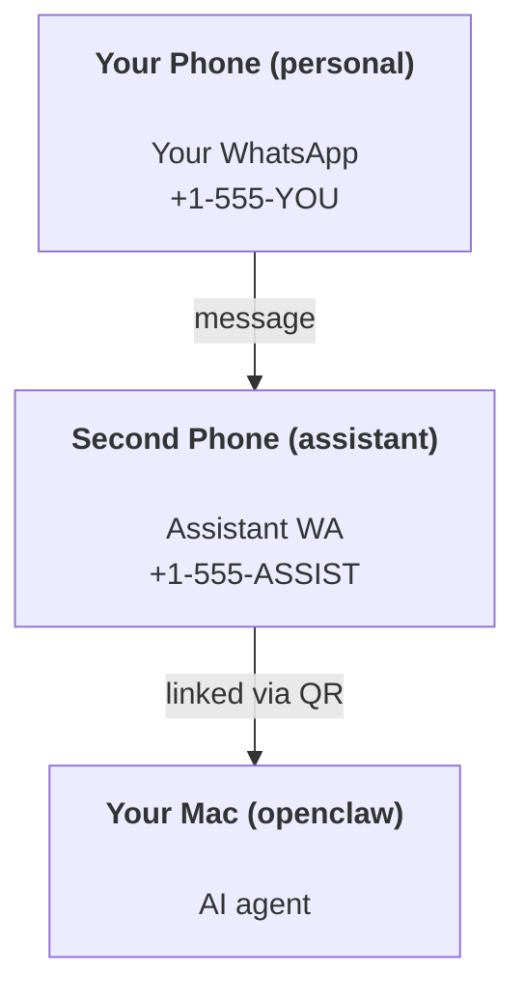

---
read_when:
    - Подключение нового экземпляра ассистента
    - Рассмотрение последствий для безопасности и разрешений
summary: Сквозное руководство по запуску OpenClaw в качестве личного ассистента с предупреждениями по безопасности
title: Настройка личного ассистента
x-i18n:
    generated_at: "2026-06-28T23:48:34Z"
    model: gpt-5.5
    postprocess_version: locale-links-v1
    provider: openai
    source_hash: b0cd640872a2a60fd88d2dc3df6d038ef8574163430d8683ef9b67921b0c87f4
    source_path: start/openclaw.md
    workflow: 16
---

OpenClaw — это самостоятельный Gateway, который подключает Discord, Google Chat, iMessage, Matrix, Microsoft Teams, Signal, Slack, Telegram, WhatsApp, Zalo и другие каналы к AI-агентам. Это руководство описывает настройку «личного помощника»: выделенный номер WhatsApp, который работает как ваш постоянно доступный AI-помощник.

## ⚠️ Сначала безопасность

Вы помещаете агента в положение, где он может:

- выполнять команды на вашей машине (в зависимости от вашей политики инструментов)
- читать/записывать файлы в вашем рабочем пространстве
- отправлять сообщения обратно через WhatsApp/Telegram/Discord/Mattermost и другие встроенные каналы

Начинайте консервативно:

- Всегда задавайте `channels.whatsapp.allowFrom` (никогда не запускайте открытый для всего мира режим на своем личном Mac).
- Используйте выделенный номер WhatsApp для помощника.
- Heartbeat теперь по умолчанию запускается каждые 30 минут. Отключите его, пока не начнете доверять настройке, задав `agents.defaults.heartbeat.every: "0m"`.

## Предварительные требования

- OpenClaw установлен и настроен при первом запуске - см. [Начало работы](/ru/start/getting-started), если вы еще этого не сделали
- Второй номер телефона (SIM/eSIM/предоплаченный) для помощника

## Настройка с двумя телефонами (рекомендуется)

Вам нужна такая схема:



Если вы привяжете личный WhatsApp к OpenClaw, каждое сообщение вам станет «вводом для агента». Обычно это не то, что нужно.

## Быстрый старт за 5 минут

1. Подключите WhatsApp Web (покажет QR; отсканируйте телефоном помощника):

```bash
openclaw channels login
```

2. Запустите Gateway (оставьте его работать):

```bash
openclaw gateway --port 18789
```

3. Поместите минимальную конфигурацию в `~/.openclaw/openclaw.json`:

```json5
{
  gateway: { mode: "local" },
  channels: { whatsapp: { allowFrom: ["+15555550123"] } },
}
```

Теперь отправьте сообщение на номер помощника с телефона из списка разрешенных.

Когда первоначальная настройка завершится, OpenClaw автоматически откроет панель управления и выведет чистую ссылку (без токена). Если панель управления запросит аутентификацию, вставьте настроенный общий секрет в настройки Control UI. При первоначальной настройке по умолчанию используется токен (`gateway.auth.token`), но парольная аутентификация тоже работает, если вы переключили `gateway.auth.mode` на `password`. Чтобы открыть позже: `openclaw dashboard`.

## Дайте агенту рабочее пространство (AGENTS)

OpenClaw читает рабочие инструкции и «память» из каталога рабочего пространства.

По умолчанию OpenClaw использует `~/.openclaw/workspace` как рабочее пространство агента и автоматически создает его (плюс стартовые `AGENTS.md`, `SOUL.md`, `TOOLS.md`, `IDENTITY.md`, `USER.md`, `HEARTBEAT.md`) при настройке/первом запуске агента. `BOOTSTRAP.md` создается только когда рабочее пространство совершенно новое (он не должен появляться снова после удаления). `MEMORY.md` необязателен (не создается автоматически); если он есть, он загружается для обычных сессий. Сессии субагентов внедряют только `AGENTS.md` и `TOOLS.md`.

<Tip>
Относитесь к этой папке как к памяти OpenClaw и сделайте ее git-репозиторием (в идеале приватным), чтобы ваши `AGENTS.md` и файлы памяти были сохранены. Если git установлен, совершенно новые рабочие пространства инициализируются автоматически.
</Tip>

```bash
openclaw setup
```

Полная схема рабочего пространства + руководство по резервному копированию: [Рабочее пространство агента](/ru/concepts/agent-workspace)
Рабочий процесс памяти: [Память](/ru/concepts/memory)

Необязательно: выберите другое рабочее пространство через `agents.defaults.workspace` (поддерживает `~`).

```json5
{
  agents: {
    defaults: {
      workspace: "~/.openclaw/workspace",
    },
  },
}
```

Если вы уже поставляете собственные файлы рабочего пространства из репозитория, можно полностью отключить создание bootstrap-файлов:

```json5
{
  agents: {
    defaults: {
      skipBootstrap: true,
    },
  },
}
```

## Конфигурация, которая превращает это в «помощника»

OpenClaw по умолчанию уже хорошо настроен как помощник, но обычно вы захотите настроить:

- персону/инструкции в [`SOUL.md`](/ru/concepts/soul)
- значения мышления по умолчанию (если нужно)
- Heartbeat (когда начнете доверять настройке)

Пример:

```json5
{
  logging: { level: "info" },
  agents: {
    defaults: {
      model: { primary: "anthropic/claude-opus-4-6" },
      workspace: "~/.openclaw/workspace",
      thinkingDefault: "high",
      timeoutSeconds: 1800,
      // Start with 0; enable later.
      heartbeat: { every: "0m" },
    },
    list: [
      {
        id: "main",
        default: true,
        groupChat: {
          mentionPatterns: ["@openclaw", "openclaw"],
        },
      },
    ],
  },
  channels: {
    whatsapp: {
      allowFrom: ["+15555550123"],
      groups: {
        "*": { requireMention: true },
      },
    },
  },
  session: {
    scope: "per-sender",
    resetTriggers: ["/new", "/reset"],
    reset: {
      mode: "daily",
      atHour: 4,
      idleMinutes: 10080,
    },
  },
}
```

## Сессии и память

- Файлы сессий: `~/.openclaw/agents/<agentId>/sessions/{{SessionId}}.jsonl`
- Метаданные сессий (использование токенов, последний маршрут и т. д.): `~/.openclaw/agents/<agentId>/sessions/sessions.json` (устаревшее: `~/.openclaw/sessions/sessions.json`)
- `/new` или `/reset` начинает новую сессию для этого чата (настраивается через `resetTriggers`). Если отправлено отдельно, OpenClaw подтверждает сброс без вызова модели.
- `/compact [instructions]` выполняет Compaction контекста сессии и сообщает оставшийся бюджет контекста.

## Heartbeat (проактивный режим)

По умолчанию OpenClaw запускает Heartbeat каждые 30 минут с промптом:
`Read HEARTBEAT.md if it exists (workspace context). Follow it strictly. Do not infer or repeat old tasks from prior chats. If nothing needs attention, reply HEARTBEAT_OK.`
Задайте `agents.defaults.heartbeat.every: "0m"`, чтобы отключить.

- Если `HEARTBEAT.md` существует, но фактически пуст (только пустые строки, Markdown/HTML-комментарии, Markdown-заголовки вроде `# Heading`, маркеры блоков кода или пустые заготовки чек-листа), OpenClaw пропускает запуск Heartbeat, чтобы сэкономить API-вызовы.
- Если файла нет, Heartbeat все равно запускается, а модель решает, что делать.
- Если агент отвечает `HEARTBEAT_OK` (необязательно с коротким заполнением; см. `agents.defaults.heartbeat.ackMaxChars`), OpenClaw подавляет исходящую доставку для этого Heartbeat.
- По умолчанию доставка Heartbeat в DM-подобные цели `user:<id>` разрешена. Задайте `agents.defaults.heartbeat.directPolicy: "block"`, чтобы подавить доставку прямым целям, сохранив активными запуски Heartbeat.
- Heartbeat запускает полноценные ходы агента - более короткие интервалы расходуют больше токенов.

```json5
{
  agents: {
    defaults: {
      heartbeat: { every: "30m" },
    },
  },
}
```

## Входящие и исходящие медиа

Входящие вложения (изображения/аудио/документы) можно передавать вашей команде через шаблоны:

- `{{MediaPath}}` (путь к локальному временному файлу)
- `{{MediaUrl}}` (псевдо-URL)
- `{{Transcript}}` (если включена транскрибация аудио)

Исходящие вложения от агента используют структурированные поля медиа в инструменте сообщений или payload ответа, например `media`, `mediaUrl`, `mediaUrls`, `path` или `filePath`. Пример аргументов инструмента сообщений:

```json
{
  "message": "Here's the screenshot.",
  "mediaUrl": "https://example.com/screenshot.png"
}
```

OpenClaw отправляет структурированные медиа вместе с текстом. Устаревшие финальные ответы ассистента все еще могут нормализоваться для совместимости, но вывод инструментов, вывод браузера, потоковые блоки и действия сообщений не разбирают текст как команды вложений.

Поведение локальных путей следует той же модели доверия к чтению файлов, что и агент:

- Если `tools.fs.workspaceOnly` равно `true`, исходящие локальные пути медиа остаются ограничены временным корнем OpenClaw, кешем медиа, путями рабочего пространства агента и файлами, созданными песочницей.
- Если `tools.fs.workspaceOnly` равно `false`, исходящие локальные медиа могут использовать локальные файлы хоста, которые агенту уже разрешено читать.
- Локальные пути могут быть абсолютными, относительными к рабочему пространству или относительными к домашнему каталогу с `~/`.
- Отправка локальных файлов хоста по-прежнему разрешает только медиа и безопасные типы документов (изображения, аудио, видео, PDF, документы Office и проверенные текстовые документы, такие как Markdown/MD, TXT, JSON, YAML и YML). Это расширение существующей границы доверия на чтение с хоста, а не сканер секретов: если агент может прочитать локальный для хоста `secret.txt` или `config.json`, он может прикрепить этот файл, когда расширение и проверка содержимого совпадают.

Это означает, что сгенерированные изображения/файлы за пределами рабочего пространства теперь могут отправляться, если ваша политика fs уже разрешает такие чтения, тогда как произвольные локальные текстовые расширения хоста остаются заблокированными. Держите чувствительные файлы вне файловой системы, доступной агенту для чтения, или оставьте `tools.fs.workspaceOnly=true` для более строгой отправки локальных путей.

## Контрольный список операций

```bash
openclaw status          # local status (creds, sessions, queued events)
openclaw status --all    # full diagnosis (read-only, pasteable)
openclaw status --deep   # asks the gateway for a live health probe with channel probes when supported
openclaw health --json   # gateway health snapshot (WS; default can return a fresh cached snapshot)
```

Логи находятся в `/tmp/openclaw/` (по умолчанию: `openclaw-YYYY-MM-DD.log`).

## Следующие шаги

- WebChat: [WebChat](/ru/web/webchat)
- Операции Gateway: [Runbook Gateway](/ru/gateway)
- Cron + пробуждения: [Задачи Cron](/ru/automation/cron-jobs)
- Компаньон строки меню macOS: [Приложение OpenClaw для macOS](/ru/platforms/macos)
- Приложение узла iOS: [Приложение iOS](/ru/platforms/ios)
- Приложение узла Android: [Приложение Android](/ru/platforms/android)
- Windows Hub: [Windows](/ru/platforms/windows)
- Статус Linux: [Приложение Linux](/ru/platforms/linux)
- Безопасность: [Безопасность](/ru/gateway/security)

## Связанные материалы

- [Начало работы](/ru/start/getting-started)
- [Настройка](/ru/start/setup)
- [Обзор каналов](/ru/channels)
