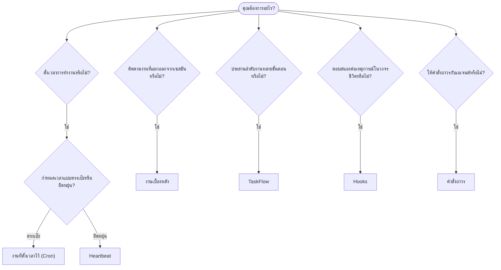

---
read_when:
    - การตัดสินใจว่าจะทำให้งานเป็นอัตโนมัติอย่างไรด้วย OpenClaw
    - การเลือกระหว่าง Heartbeat, Cron, hooks และคำสั่งถาวร
    - กำลังมองหาจุดเริ่มต้นระบบอัตโนมัติที่เหมาะสม
summary: 'ภาพรวมของกลไกการทำงานอัตโนมัติ: งาน, Cron, hooks, คำสั่งถาวร และ TaskFlow'
title: ระบบอัตโนมัติและงาน
x-i18n:
    generated_at: "2026-04-26T11:22:54Z"
    model: gpt-5.4
    provider: openai
    source_hash: 6d2a2d3ef58830133e07b34f33c611664fc1032247e9dd81005adf7fc0c43cdb
    source_path: automation/index.md
    workflow: 15
---

OpenClaw เรียกใช้งานเบื้องหลังผ่านงาน งานที่ตั้งเวลาไว้ event hooks และคำสั่งถาวร หน้านี้จะช่วยคุณเลือกกลไกที่เหมาะสมและทำความเข้าใจว่ากลไกเหล่านี้ทำงานร่วมกันอย่างไร

## คู่มือการตัดสินใจแบบรวดเร็ว

| กรณีใช้งาน                              | คำแนะนำ               | เหตุผล                                           |
| --------------------------------------- | ---------------------- | ------------------------------------------------ |
| ส่งรายงานประจำวันเวลา 9:00 น. ตรงเวลา  | งานที่ตั้งเวลาไว้ (Cron) | กำหนดเวลาได้แม่นยำ ทำงานแยกเป็นอิสระ            |
| เตือนฉันในอีก 20 นาที                   | งานที่ตั้งเวลาไว้ (Cron) | งานครั้งเดียวพร้อมเวลาที่แม่นยำ (`--at`)        |
| รันวิเคราะห์เชิงลึกประจำสัปดาห์        | งานที่ตั้งเวลาไว้ (Cron) | เป็นงานเดี่ยว และสามารถใช้โมเดลที่ต่างออกไปได้ |
| ตรวจกล่องข้อความทุก 30 นาที            | Heartbeat              | รวมกับการตรวจสอบอื่นได้ และรับรู้บริบท          |
| ติดตามปฏิทินสำหรับเหตุการณ์ที่กำลังจะมาถึง | Heartbeat              | เหมาะตามธรรมชาติสำหรับการรับรู้อย่างเป็นระยะ   |
| ตรวจสอบสถานะของ subagent หรือการรัน ACP | งานเบื้องหลัง         | บัญชีงานติดตามงานที่แยกออกทั้งหมด               |
| ตรวจสอบว่างานใดรันไปแล้วและเมื่อใด      | งานเบื้องหลัง         | `openclaw tasks list` และ `openclaw tasks audit` |
| วิจัยหลายขั้นตอนแล้วค่อยสรุป            | TaskFlow               | การประสานลำดับงานแบบคงทนพร้อมการติดตาม revision |
| รันสคริปต์เมื่อรีเซ็ตเซสชัน             | Hooks                  | ขับเคลื่อนด้วยเหตุการณ์ เรียกใช้เมื่อเกิดเหตุการณ์ในวงจรชีวิต |
| เรียกใช้โค้ดทุกครั้งที่มีการเรียก tool  | Plugin hooks           | hooks ในโปรเซสสามารถดักจับการเรียก tool ได้     |
| ตรวจสอบ compliance ทุกครั้งก่อนตอบกลับ  | คำสั่งถาวร            | ถูกแทรกเข้าในทุกเซสชันโดยอัตโนมัติ              |

### งานที่ตั้งเวลาไว้ (Cron) เทียบกับ Heartbeat

| มิติ              | งานที่ตั้งเวลาไว้ (Cron)             | Heartbeat                            |
| ----------------- | ------------------------------------ | ------------------------------------ |
| การกำหนดเวลา      | แม่นยำ (cron expressions, งานครั้งเดียว) | โดยประมาณ (ค่าเริ่มต้นทุก 30 นาที) |
| บริบทของเซสชัน    | ใหม่ทั้งหมด (แยกอิสระ) หรือใช้ร่วมกัน | บริบทเต็มของเซสชันหลัก              |
| ระเบียนงาน        | ถูกสร้างเสมอ                         | ไม่ถูกสร้างเลย                       |
| การส่งผลลัพธ์      | ช่องทางแชต, Webhook หรือเงียบ        | แทรกในเซสชันหลักโดยตรง              |
| เหมาะที่สุดสำหรับ  | รายงาน การเตือน งานเบื้องหลัง        | การตรวจกล่องข้อความ ปฏิทิน การแจ้งเตือน |

ใช้ งานที่ตั้งเวลาไว้ (Cron) เมื่อคุณต้องการเวลาที่แม่นยำหรือการทำงานแบบแยกอิสระ ใช้ Heartbeat เมื่องานนั้นได้ประโยชน์จากบริบทเต็มของเซสชัน และการกำหนดเวลาแบบโดยประมาณก็เพียงพอ

## แนวคิดหลัก

### งานที่ตั้งเวลาไว้ (cron)

Cron คือ scheduler ในตัวของ Gateway สำหรับการกำหนดเวลาที่แม่นยำ มันเก็บงานไว้อย่างถาวร ปลุกเอเจนต์ในเวลาที่เหมาะสม และสามารถส่งผลลัพธ์ไปยังช่องทางแชตหรือปลายทาง Webhook ได้ รองรับทั้งการเตือนแบบครั้งเดียว นิพจน์แบบทำซ้ำ และทริกเกอร์ Webhook ขาเข้า

ดู [งานที่ตั้งเวลาไว้](/th/automation/cron-jobs)

### งาน

บัญชีงานเบื้องหลังติดตามงานทั้งหมดที่แยกออกจากเซสชัน: การรัน ACP, การเรียก subagent, การรัน cron แบบแยกอิสระ และการดำเนินการผ่าน CLI งานคือระเบียน ไม่ใช่ตัวตั้งเวลา ใช้ `openclaw tasks list` และ `openclaw tasks audit` เพื่อตรวจสอบงานเหล่านี้

ดู [งานเบื้องหลัง](/th/automation/tasks)

### TaskFlow

TaskFlow คือชั้นโครงสร้างการประสานลำดับงานที่อยู่เหนือ งานเบื้องหลัง มันจัดการลำดับงานหลายขั้นตอนแบบคงทนด้วยโหมดซิงก์แบบ managed และ mirrored การติดตาม revision และ `openclaw tasks flow list|show|cancel` สำหรับการตรวจสอบ

ดู [TaskFlow](/th/automation/taskflow)

### คำสั่งถาวร

คำสั่งถาวรมอบอำนาจการปฏิบัติงานถาวรให้เอเจนต์สำหรับโปรแกรมที่กำหนดไว้ คำสั่งเหล่านี้อยู่ในไฟล์ของ workspace (โดยทั่วไปคือ `AGENTS.md`) และจะถูกแทรกเข้าในทุกเซสชัน ใช้ร่วมกับ cron สำหรับการบังคับใช้งานตามเวลา

ดู [คำสั่งถาวร](/th/automation/standing-orders)

### Hooks

hooks ภายในคือสคริปต์ที่ขับเคลื่อนด้วยเหตุการณ์ ซึ่งถูกทริกเกอร์จากเหตุการณ์ในวงจรชีวิตของเอเจนต์
(`/new`, `/reset`, `/stop`), Compaction ของเซสชัน, การเริ่มต้นของ gateway และการไหลของข้อความ
ระบบจะค้นพบ hooks เหล่านี้จากไดเรกทอรีโดยอัตโนมัติ และสามารถจัดการได้ด้วย
`openclaw hooks` สำหรับการดักจับการเรียก tool ภายในโปรเซส ให้ใช้
[Plugin hooks](/th/plugins/hooks)

ดู [Hooks](/th/automation/hooks)

### Heartbeat

Heartbeat คือเทิร์นของเซสชันหลักแบบเป็นระยะ (ค่าเริ่มต้นทุก 30 นาที) มันรวมการตรวจสอบหลายอย่างไว้ในเทิร์นเดียวของเอเจนต์ (กล่องข้อความ ปฏิทิน การแจ้งเตือน) พร้อมบริบทเต็มของเซสชัน Heartbeat turns จะไม่สร้างระเบียนงาน และจะไม่ขยายความสดใหม่ของการรีเซ็ตเซสชันรายวัน/เมื่อไม่ได้ใช้งาน ใช้ `HEARTBEAT.md` สำหรับเช็กลิสต์ขนาดเล็ก หรือใช้บล็อก `tasks:` เมื่อต้องการการตรวจสอบตามกำหนดเวลาเท่านั้นภายใน heartbeat เอง ไฟล์ heartbeat ที่ว่างจะถูกข้ามเป็น `empty-heartbeat-file`; โหมดงานตามกำหนดเวลาเท่านั้นจะถูกข้ามเป็น `no-tasks-due`

ดู [Heartbeat](/th/gateway/heartbeat)

## กลไกเหล่านี้ทำงานร่วมกันอย่างไร

- **Cron** จัดการตารางเวลาที่แม่นยำ (รายงานประจำวัน การทบทวนประจำสัปดาห์) และการเตือนแบบครั้งเดียว การรัน cron ทั้งหมดจะสร้างระเบียนงาน
- **Heartbeat** จัดการการติดตามตามกิจวัตร (กล่องข้อความ ปฏิทิน การแจ้งเตือน) ในหนึ่งเทิร์นแบบรวมทุก 30 นาที
- **Hooks** ตอบสนองต่อเหตุการณ์เฉพาะ (การรีเซ็ตเซสชัน, Compaction, การไหลของข้อความ) ด้วยสคริปต์แบบกำหนดเอง Plugin hooks ครอบคลุมการเรียก tool
- **คำสั่งถาวร** มอบบริบทถาวรและขอบเขตอำนาจให้กับเอเจนต์
- **TaskFlow** ประสานลำดับงานหลายขั้นตอนเหนือระดับงานเดี่ยว
- **งาน** ติดตามงานทั้งหมดที่แยกออกจากเซสชันโดยอัตโนมัติ เพื่อให้คุณตรวจสอบและ audit ได้

## ที่เกี่ยวข้อง

- [งานที่ตั้งเวลาไว้](/th/automation/cron-jobs) — การตั้งเวลาที่แม่นยำและการเตือนแบบครั้งเดียว
- [งานเบื้องหลัง](/th/automation/tasks) — บัญชีงานสำหรับงานทั้งหมดที่แยกออกจากเซสชัน
- [TaskFlow](/th/automation/taskflow) — การประสานลำดับงานหลายขั้นตอนแบบคงทน
- [Hooks](/th/automation/hooks) — สคริปต์วงจรชีวิตที่ขับเคลื่อนด้วยเหตุการณ์
- [Plugin hooks](/th/plugins/hooks) — hooks ภายในโปรเซสสำหรับ tool, prompt, message และวงจรชีวิต
- [คำสั่งถาวร](/th/automation/standing-orders) — คำสั่งถาวรของเอเจนต์
- [Heartbeat](/th/gateway/heartbeat) — เทิร์นของเซสชันหลักแบบเป็นระยะ
- [ข้อมูลอ้างอิงการกำหนดค่า](/th/gateway/configuration-reference) — คีย์การกำหนดค่าทั้งหมด
