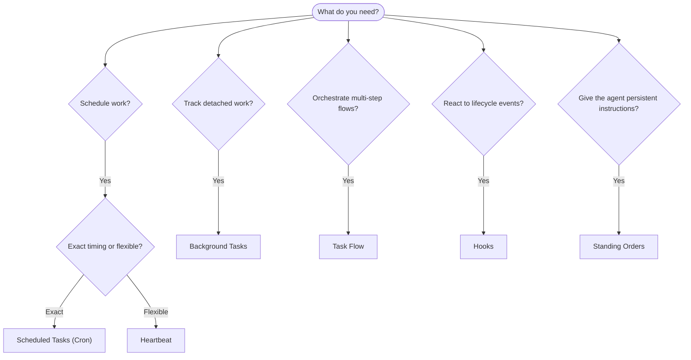

---
read_when:
    - การตัดสินใจว่าจะทำให้งานเป็นอัตโนมัติด้วย OpenClaw อย่างไร
    - การเลือกระหว่าง Heartbeat, Cron, hooks และคำสั่งถาวร
    - กำลังมองหาจุดเริ่มต้นการทำงานอัตโนมัติที่เหมาะสม
summary: 'ภาพรวมของกลไกการทำงานอัตโนมัติ: งาน, Cron, hooks, คำสั่งถาวร และ TaskFlow'
title: การทำงานอัตโนมัติและงาน
x-i18n:
    generated_at: "2026-04-25T13:41:04Z"
    model: gpt-5.4
    provider: openai
    source_hash: 54524eb5d1fcb2b2e3e51117339be1949d980afaef1f6ae71fcfd764049f3f47
    source_path: automation/index.md
    workflow: 15
---

OpenClaw เรียกใช้งานเบื้องหลังผ่านงาน, งานตามกำหนดเวลา, event hooks และคำสั่งถาวร หน้านี้จะช่วยให้คุณเลือกกลไกที่เหมาะสมและเข้าใจว่ากลไกเหล่านี้ทำงานร่วมกันอย่างไร

## คู่มือการตัดสินใจแบบรวดเร็ว

| กรณีการใช้งาน                            | คำแนะนำ                | เหตุผล                                           |
| ---------------------------------------- | ---------------------- | ------------------------------------------------ |
| ส่งรายงานประจำวันตรงเวลา 9:00 น.         | งานตามกำหนดเวลา (Cron) | กำหนดเวลาได้แม่นยำ, การทำงานแยกอิสระ            |
| เตือนฉันอีก 20 นาที                      | งานตามกำหนดเวลา (Cron) | ทำงานครั้งเดียวพร้อมการกำหนดเวลาที่แม่นยำ (`--at`) |
| รันการวิเคราะห์เชิงลึกรายสัปดาห์        | งานตามกำหนดเวลา (Cron) | เป็นงานแบบสแตนด์อโลน และใช้โมเดลอื่นได้         |
| ตรวจสอบกล่องข้อความทุก 30 นาที           | Heartbeat              | รวมการตรวจสอบกับงานอื่นได้ และรับรู้บริบท       |
| เฝ้าดูปฏิทินสำหรับเหตุการณ์ที่กำลังจะมาถึง | Heartbeat              | เหมาะตามธรรมชาติสำหรับการรับรู้อย่างเป็นระยะ    |
| ตรวจสอบสถานะของ subagent หรือการรัน ACP  | งานเบื้องหลัง          | บันทึกงานจะติดตามงานที่แยกออกมาทั้งหมด          |
| ตรวจสอบว่างานใดรันไปเมื่อใด              | งานเบื้องหลัง          | `openclaw tasks list` และ `openclaw tasks audit` |
| วิจัยหลายขั้นตอนแล้วสรุปผล                | TaskFlow               | การ orchestration แบบคงทนพร้อมการติดตาม revision |
| รันสคริปต์เมื่อรีเซ็ตเซสชัน              | Hooks                  | ขับเคลื่อนด้วยเหตุการณ์ เรียกทำงานตาม lifecycle events |
| รันโค้ดทุกครั้งที่มีการเรียกใช้ tool      | Plugin hooks           | hooks ในโปรเซสสามารถดักจับการเรียกใช้ tool ได้   |
| ตรวจสอบการปฏิบัติตามข้อกำหนดก่อนตอบเสมอ  | คำสั่งถาวร             | ถูกแทรกเข้าไปในทุกเซสชันโดยอัตโนมัติ            |

### งานตามกำหนดเวลา (Cron) เทียบกับ Heartbeat

| มิติ            | งานตามกำหนดเวลา (Cron)             | Heartbeat                            |
| --------------- | ----------------------------------- | ------------------------------------ |
| เวลา             | แม่นยำ (cron expressions, one-shot) | โดยประมาณ (ค่าเริ่มต้นทุก 30 นาที) |
| บริบทเซสชัน     | ใหม่ทั้งหมด (แยกอิสระ) หรือใช้ร่วมกัน | บริบทเต็มของเซสชันหลัก             |
| บันทึกงาน       | ถูกสร้างเสมอ                        | ไม่ถูกสร้างเลย                      |
| การส่งผลลัพธ์    | ช่องทาง, Webhook หรือแบบเงียบ       | แสดงในเซสชันหลักโดยตรง             |
| เหมาะที่สุดสำหรับ | รายงาน, การเตือน, งานเบื้องหลัง     | การตรวจกล่องข้อความ, ปฏิทิน, การแจ้งเตือน |

ใช้ งานตามกำหนดเวลา (Cron) เมื่อคุณต้องการเวลาที่แม่นยำหรือการทำงานแบบแยกอิสระ ใช้ Heartbeat เมื่องานนั้นได้ประโยชน์จากบริบทเต็มของเซสชัน และการกำหนดเวลาแบบประมาณก็เพียงพอ

## แนวคิดหลัก

### งานตามกำหนดเวลา (cron)

Cron คือ scheduler ในตัวของ Gateway สำหรับการกำหนดเวลาที่แม่นยำ มันจัดเก็บงานถาวร ปลุก agent ในเวลาที่ถูกต้อง และสามารถส่งผลลัพธ์ไปยังช่องแชตหรือปลายทาง Webhook ได้ รองรับการเตือนแบบครั้งเดียว, recurring expressions และ inbound webhook triggers

ดู [งานตามกำหนดเวลา](/th/automation/cron-jobs)

### งาน

บันทึกงานเบื้องหลังติดตามงานที่แยกออกมาทั้งหมด: การรัน ACP, การสร้าง subagent, การรัน cron แบบแยกอิสระ และการดำเนินการผ่าน CLI งานเป็นบันทึก ไม่ใช่ตัวจัดตารางเวลา ใช้ `openclaw tasks list` และ `openclaw tasks audit` เพื่อตรวจสอบงานเหล่านี้

ดู [งานเบื้องหลัง](/th/automation/tasks)

### TaskFlow

TaskFlow คือชั้น orchestration ของ flow ที่อยู่เหนือระบบงานเบื้องหลัง โดยจัดการ flow หลายขั้นตอนแบบคงทนด้วยโหมด sync แบบ managed และ mirrored, การติดตาม revision และ `openclaw tasks flow list|show|cancel` สำหรับการตรวจสอบ

ดู [TaskFlow](/th/automation/taskflow)

### คำสั่งถาวร

คำสั่งถาวรให้สิทธิ์การดำเนินงานถาวรแก่ agent สำหรับโปรแกรมที่กำหนดไว้ โดยอยู่ในไฟล์ของ workspace (โดยทั่วไปคือ `AGENTS.md`) และจะถูกแทรกเข้าไปในทุกเซสชัน สามารถใช้ร่วมกับ cron เพื่อบังคับใช้ตามเวลาได้

ดู [คำสั่งถาวร](/th/automation/standing-orders)

### Hooks

hooks ภายในคือสคริปต์ที่ขับเคลื่อนด้วยเหตุการณ์ ซึ่งถูกเรียกโดย lifecycle events ของ agent
(`/new`, `/reset`, `/stop`), session Compaction, การเริ่มต้น Gateway และการไหลของข้อความ
ระบบจะค้นพบ hooks จากไดเรกทอรีต่าง ๆ โดยอัตโนมัติ และสามารถจัดการได้ด้วย
`openclaw hooks` สำหรับการดักจับการเรียกใช้ tool ภายในโปรเซส ให้ใช้
[Plugin hooks](/th/plugins/hooks)

ดู [Hooks](/th/automation/hooks)

### Heartbeat

Heartbeat คือรอบการทำงานของเซสชันหลักแบบเป็นระยะ (ค่าเริ่มต้นทุก 30 นาที) โดยรวมการตรวจสอบหลายอย่าง (กล่องข้อความ, ปฏิทิน, การแจ้งเตือน) ไว้ในหนึ่งรอบการทำงานของ agent พร้อมบริบทเต็มของเซสชัน การทำงานของ Heartbeat จะไม่สร้างบันทึกงาน ใช้ `HEARTBEAT.md` สำหรับเช็กลิสต์ขนาดเล็ก หรือบล็อก `tasks:` เมื่อคุณต้องการการตรวจสอบแบบเป็นระยะเฉพาะรายการที่ถึงกำหนดภายใน heartbeat เอง ไฟล์ heartbeat ที่ว่างจะถูกข้ามเป็น `empty-heartbeat-file`; โหมดงานเฉพาะที่ถึงกำหนดจะถูกข้ามเป็น `no-tasks-due`

ดู [Heartbeat](/th/gateway/heartbeat)

## กลไกเหล่านี้ทำงานร่วมกันอย่างไร

- **Cron** จัดการตารางเวลาที่แม่นยำ (รายงานประจำวัน, การทบทวนรายสัปดาห์) และการเตือนแบบครั้งเดียว การรัน cron ทั้งหมดจะสร้างบันทึกงาน
- **Heartbeat** จัดการการติดตามตามกิจวัตร (กล่องข้อความ, ปฏิทิน, การแจ้งเตือน) ในหนึ่งรอบแบบรวมทุก 30 นาที
- **Hooks** ตอบสนองต่อเหตุการณ์เฉพาะ (การรีเซ็ตเซสชัน, Compaction, การไหลของข้อความ) ด้วยสคริปต์แบบกำหนดเอง Plugin hooks ครอบคลุมการเรียกใช้ tool
- **คำสั่งถาวร** มอบบริบทถาวรและขอบเขตอำนาจให้กับ agent
- **TaskFlow** ประสาน flow หลายขั้นตอนที่อยู่เหนือแต่ละงาน
- **งาน** ติดตามงานที่แยกออกมาทั้งหมดโดยอัตโนมัติ เพื่อให้คุณตรวจสอบและตรวจสอบย้อนหลังได้

## ที่เกี่ยวข้อง

- [งานตามกำหนดเวลา](/th/automation/cron-jobs) — การจัดตารางเวลาที่แม่นยำและการเตือนแบบครั้งเดียว
- [งานเบื้องหลัง](/th/automation/tasks) — บันทึกงานสำหรับงานที่แยกออกมาทั้งหมด
- [TaskFlow](/th/automation/taskflow) — orchestration ของ flow หลายขั้นตอนแบบคงทน
- [Hooks](/th/automation/hooks) — สคริปต์ lifecycle ที่ขับเคลื่อนด้วยเหตุการณ์
- [Plugin hooks](/th/plugins/hooks) — hooks ภายในโปรเซสสำหรับ tool, prompt, message และ lifecycle
- [คำสั่งถาวร](/th/automation/standing-orders) — คำสั่งถาวรสำหรับ agent
- [Heartbeat](/th/gateway/heartbeat) — รอบการทำงานของเซสชันหลักแบบเป็นระยะ
- [เอกสารอ้างอิงการกำหนดค่า](/th/gateway/configuration-reference) — คีย์การกำหนดค่าทั้งหมด
