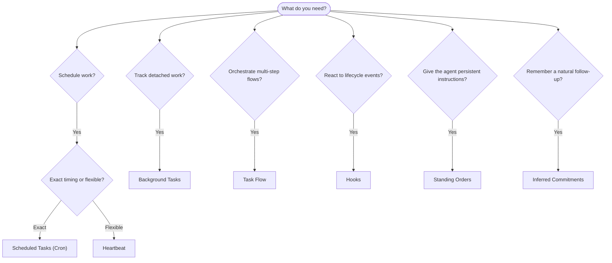

---
read_when:
    - การตัดสินใจว่าจะทำให้งานเป็นอัตโนมัติด้วย OpenClaw อย่างไร
    - การเลือกระหว่าง Heartbeat, Cron, ข้อผูกพัน, ฮุก และคำสั่งถาวร
    - กำลังมองหาจุดเริ่มต้นการทำงานอัตโนมัติที่เหมาะสม
summary: 'ภาพรวมของกลไกการทำงานอัตโนมัติ: งาน, Cron, ฮุก, คำสั่งประจำ และ Task Flow'
title: การทำงานอัตโนมัติและงาน
x-i18n:
    generated_at: "2026-04-30T09:35:06Z"
    model: gpt-5.5
    provider: openai
    source_hash: a2465c39f21db8bcb98f980a2c4b2c03018dddd5f43de59d8bf6ce0d6e97d9ef
    source_path: automation/index.md
    workflow: 16
---

OpenClaw รันงานในเบื้องหลังผ่านงาน งานตามกำหนดเวลา ความผูกพันที่อนุมานได้ ฮุกเหตุการณ์ และคำสั่งถาวร หน้านี้ช่วยให้คุณเลือกกลไกที่เหมาะสมและเข้าใจว่ากลไกเหล่านี้ทำงานร่วมกันอย่างไร

## คู่มือตัดสินใจอย่างรวดเร็ว

| กรณีการใช้งาน | แนะนำ | เหตุผล |
| --------------------------------------- | ---------------------- | ------------------------------------------------ |
| ส่งรายงานประจำวันตรงเวลา 9 โมงเช้า | งานตามกำหนดเวลา (Cron) | เวลาที่แน่นอน การดำเนินการแบบแยกส่วน |
| เตือนฉันในอีก 20 นาที | งานตามกำหนดเวลา (Cron) | ทำครั้งเดียวพร้อมเวลาที่แม่นยำ (`--at`) |
| รันการวิเคราะห์เชิงลึกรายสัปดาห์ | งานตามกำหนดเวลา (Cron) | งานแยกเดี่ยว ใช้โมเดลอื่นได้ |
| ตรวจกล่องข้อความทุก 30 นาที | Heartbeat | จัดชุดร่วมกับการตรวจสอบอื่น ๆ และรับรู้บริบท |
| ตรวจปฏิทินสำหรับเหตุการณ์ที่กำลังจะมาถึง | Heartbeat | เหมาะกับการรับรู้เป็นระยะโดยธรรมชาติ |
| ติดตามหลังการสัมภาษณ์ที่กล่าวถึง | ความผูกพันที่อนุมานได้ | การติดตามผลคล้ายความจำ ไม่มีคำขอเตือนเวลาที่แน่นอน |
| การเช็กอินดูแลอย่างนุ่มนวลหลังบริบทของผู้ใช้ | ความผูกพันที่อนุมานได้ | จำกัดขอบเขตไว้ที่เอเจนต์และช่องเดียวกัน |
| ตรวจสถานะของซับเอเจนต์หรือการรัน ACP | งานเบื้องหลัง | บัญชีแยกประเภทของงานติดตามงานที่แยกออกมาทั้งหมด |
| ตรวจสอบย้อนหลังว่าอะไรรันและเมื่อใด | งานเบื้องหลัง | `openclaw tasks list` และ `openclaw tasks audit` |
| วิจัยหลายขั้นตอนแล้วสรุป | โฟลว์งาน | การประสานงานที่คงทนพร้อมการติดตามรีวิชัน |
| รันสคริปต์เมื่อรีเซ็ตเซสชัน | ฮุก | ขับเคลื่อนด้วยเหตุการณ์ ทำงานเมื่อเกิดเหตุการณ์วงจรชีวิต |
| ดำเนินการโค้ดทุกครั้งที่เรียกเครื่องมือ | ฮุกของ Plugin | ฮุกในกระบวนการสามารถดักการเรียกเครื่องมือได้ |
| ตรวจการปฏิบัติตามข้อกำหนดเสมอก่อนตอบกลับ | คำสั่งถาวร | ถูกฉีดเข้าในทุกเซสชันโดยอัตโนมัติ |

### งานตามกำหนดเวลา (Cron) เทียบกับ Heartbeat

| มิติ | งานตามกำหนดเวลา (Cron) | Heartbeat |
| --------------- | ----------------------------------- | ------------------------------------- |
| เวลา | แน่นอน (นิพจน์ cron, ทำครั้งเดียว) | โดยประมาณ (ค่าเริ่มต้นทุก 30 นาที) |
| บริบทเซสชัน | สดใหม่ (แยกส่วน) หรือใช้ร่วมกัน | บริบทเซสชันหลักทั้งหมด |
| ระเบียนงาน | สร้างเสมอ | ไม่สร้าง |
| การส่งมอบ | ช่อง, webhook หรือเงียบ | แบบอินไลน์ในเซสชันหลัก |
| เหมาะที่สุดสำหรับ | รายงาน การเตือน งานเบื้องหลัง | การตรวจกล่องข้อความ ปฏิทิน การแจ้งเตือน |

ใช้งานตามกำหนดเวลา (Cron) เมื่อคุณต้องการเวลาที่แม่นยำหรือการดำเนินการแบบแยกส่วน ใช้ Heartbeat เมื่องานได้ประโยชน์จากบริบทเซสชันทั้งหมดและเวลาคร่าว ๆ ก็เพียงพอ

## แนวคิดหลัก

### งานตามกำหนดเวลา (cron)

Cron คือเครื่องมือกำหนดเวลาภายในของ Gateway สำหรับเวลาที่แม่นยำ โดยจะคงข้อมูลงาน ปลุกเอเจนต์ในเวลาที่เหมาะสม และส่งผลลัพธ์ไปยังช่องแชตหรือปลายทาง webhook ได้ รองรับการเตือนแบบทำครั้งเดียว นิพจน์แบบเกิดซ้ำ และทริกเกอร์ webhook ขาเข้า

ดู [งานตามกำหนดเวลา](/th/automation/cron-jobs)

### งาน

บัญชีแยกประเภทของงานเบื้องหลังติดตามงานที่แยกออกมาทั้งหมด: การรัน ACP, การสร้างซับเอเจนต์, การดำเนินการ cron แบบแยกส่วน และการทำงานของ CLI งานคือระเบียน ไม่ใช่ตัวกำหนดเวลา ใช้ `openclaw tasks list` และ `openclaw tasks audit` เพื่อตรวจสอบงานเหล่านี้

ดู [งานเบื้องหลัง](/th/automation/tasks)

### ความผูกพันที่อนุมานได้

ความผูกพันคือความจำสำหรับการติดตามผลที่เลือกเปิดใช้และมีอายุสั้น OpenClaw อนุมานสิ่งเหล่านี้จากบทสนทนาปกติ จำกัดขอบเขตไว้ที่เอเจนต์และช่องเดียวกัน และส่งการเช็กอินที่ถึงกำหนดผ่าน heartbeat การเตือนที่ผู้ใช้ขอพร้อมเวลาที่แน่นอนยังคงเป็นหน้าที่ของ cron

ดู [ความผูกพันที่อนุมานได้](/th/concepts/commitments)

### โฟลว์งาน

โฟลว์งานคือชั้นรองรับการประสานโฟลว์ที่อยู่เหนือกว่างานเบื้องหลัง โดยจัดการโฟลว์หลายขั้นตอนที่คงทน พร้อมโหมดซิงก์แบบจัดการและแบบมิเรอร์ การติดตามรีวิชัน และ `openclaw tasks flow list|show|cancel` สำหรับการตรวจสอบ

ดู [โฟลว์งาน](/th/automation/taskflow)

### คำสั่งถาวร

คำสั่งถาวรมอบอำนาจการทำงานแบบถาวรให้เอเจนต์สำหรับโปรแกรมที่กำหนดไว้ คำสั่งเหล่านี้อยู่ในไฟล์เวิร์กสเปซ (โดยทั่วไปคือ `AGENTS.md`) และถูกฉีดเข้าในทุกเซสชัน ใช้ร่วมกับ cron สำหรับการบังคับใช้ตามเวลา

ดู [คำสั่งถาวร](/th/automation/standing-orders)

### ฮุก

ฮุกภายในคือสคริปต์ที่ขับเคลื่อนด้วยเหตุการณ์ ซึ่งถูกทริกเกอร์โดยเหตุการณ์วงจรชีวิตของเอเจนต์ (`/new`, `/reset`, `/stop`), การทำ Compaction ของเซสชัน, การเริ่มต้น Gateway และโฟลว์ข้อความ ฮุกเหล่านี้ถูกค้นพบโดยอัตโนมัติจากไดเรกทอรีและจัดการได้ด้วย `openclaw hooks` สำหรับการดักการเรียกเครื่องมือในกระบวนการ ให้ใช้ [ฮุกของ Plugin](/th/plugins/hooks)

ดู [ฮุก](/th/automation/hooks)

### Heartbeat

Heartbeat คือรอบของเซสชันหลักเป็นระยะ (ค่าเริ่มต้นทุก 30 นาที) โดยจัดชุดการตรวจสอบหลายอย่าง (กล่องข้อความ ปฏิทิน การแจ้งเตือน) ในรอบเอเจนต์เดียวพร้อมบริบทเซสชันทั้งหมด รอบ Heartbeat จะไม่สร้างระเบียนงาน และไม่ขยายความสดใหม่ของการรีเซ็ตเซสชันรายวัน/เมื่อไม่ได้ใช้งาน ใช้ `HEARTBEAT.md` สำหรับเช็กลิสต์ขนาดเล็ก หรือบล็อก `tasks:` เมื่อคุณต้องการการตรวจสอบเป็นระยะเฉพาะรายการที่ถึงกำหนดภายใน heartbeat เอง ไฟล์ heartbeat ที่ว่างจะข้ามด้วย `empty-heartbeat-file`; โหมดงานเฉพาะที่ถึงกำหนดจะข้ามด้วย `no-tasks-due` Heartbeat จะเลื่อนออกไปขณะงาน cron กำลังทำงานหรืออยู่ในคิว และ `heartbeat.skipWhenBusy` ยังสามารถเลื่อนออกไปได้ขณะซับเอเจนต์หรือเลนซ้อนกำลังยุ่ง

ดู [Heartbeat](/th/gateway/heartbeat)

## วิธีที่ทำงานร่วมกัน

- **Cron** จัดการกำหนดเวลาที่แม่นยำ (รายงานประจำวัน รีวิวรายสัปดาห์) และการเตือนแบบทำครั้งเดียว การดำเนินการ cron ทั้งหมดจะสร้างระเบียนงาน
- **Heartbeat** จัดการการติดตามตามปกติ (กล่องข้อความ ปฏิทิน การแจ้งเตือน) ในรอบที่จัดชุดไว้หนึ่งครั้งทุก 30 นาที
- **ฮุก** ตอบสนองต่อเหตุการณ์เฉพาะ (การรีเซ็ตเซสชัน, Compaction, โฟลว์ข้อความ) ด้วยสคริปต์ที่กำหนดเอง ฮุกของ Plugin ครอบคลุมการเรียกเครื่องมือ
- **คำสั่งถาวร** ให้บริบทถาวรและขอบเขตอำนาจแก่เอเจนต์
- **โฟลว์งาน** ประสานโฟลว์หลายขั้นตอนเหนือกว่างานแต่ละรายการ
- **งาน** ติดตามงานที่แยกออกมาทั้งหมดโดยอัตโนมัติ เพื่อให้คุณตรวจสอบและตรวจสอบย้อนหลังได้

## ที่เกี่ยวข้อง

- [งานตามกำหนดเวลา](/th/automation/cron-jobs) — การกำหนดเวลาที่แม่นยำและการเตือนแบบทำครั้งเดียว
- [ความผูกพันที่อนุมานได้](/th/concepts/commitments) — การเช็กอินติดตามผลคล้ายความจำ
- [งานเบื้องหลัง](/th/automation/tasks) — บัญชีแยกประเภทของงานสำหรับงานที่แยกออกมาทั้งหมด
- [โฟลว์งาน](/th/automation/taskflow) — การประสานโฟลว์หลายขั้นตอนที่คงทน
- [ฮุก](/th/automation/hooks) — สคริปต์วงจรชีวิตที่ขับเคลื่อนด้วยเหตุการณ์
- [ฮุกของ Plugin](/th/plugins/hooks) — ฮุกเครื่องมือ พรอมป์ ข้อความ และวงจรชีวิตภายในกระบวนการ
- [คำสั่งถาวร](/th/automation/standing-orders) — คำสั่งเอเจนต์แบบถาวร
- [Heartbeat](/th/gateway/heartbeat) — รอบเซสชันหลักเป็นระยะ
- [ข้อมูลอ้างอิงการกำหนดค่า](/th/gateway/configuration-reference) — คีย์การกำหนดค่าทั้งหมด
