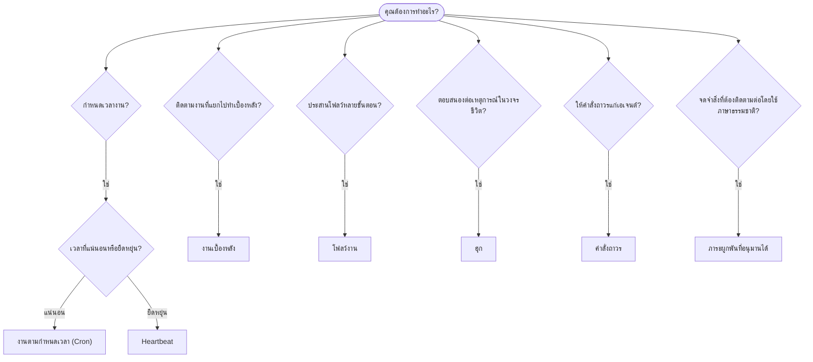

OpenClaw เรียกใช้งานเบื้องหลังผ่านงาน งานตามกำหนดเวลา ภาระผูกพันที่อนุมานได้ ฮุกเหตุการณ์ และคำสั่งถาวร ใช้หน้านี้เพื่อเลือกกลไกที่เหมาะสม

## คู่มือการตัดสินใจฉบับย่อ

| กรณีการใช้งาน                                | สิ่งที่แนะนำ            | เหตุผล                                              |
| --------------------------------------- | ---------------------- | ------------------------------------------------ |
| ส่งรายงานประจำวันตรงเวลา 9:00 น.         | งานตามกำหนดเวลา (Cron) | เวลาที่แน่นอน การดำเนินการแบบแยกส่วน                 |
| เตือนฉันในอีก 20 นาที                 | งานตามกำหนดเวลา (Cron) | ทำงานครั้งเดียวด้วยเวลาที่แม่นยำ (`--at`)            |
| เรียกใช้การวิเคราะห์เชิงลึกทุกสัปดาห์                | งานตามกำหนดเวลา (Cron) | งานแบบอิสระ สามารถใช้โมเดลอื่นได้         |
| ตรวจสอบกล่องจดหมายทุก 30 นาที                | Heartbeat              | รวมเป็นชุดกับการตรวจสอบอื่นและรับรู้บริบท         |
| เฝ้าติดตามปฏิทินสำหรับกิจกรรมที่กำลังจะมาถึง    | Heartbeat              | เหมาะโดยธรรมชาติสำหรับการรับรู้เป็นระยะ               |
| ติดตามผลหลังการสัมภาษณ์ที่กล่าวถึง    | ภาระผูกพันที่อนุมานได้   | การติดตามผลคล้ายความทรงจำ โดยไม่มีคำขอเตือนเวลาที่แน่นอน |
| สอบถามด้วยความใส่ใจอย่างนุ่มนวลหลังได้รับบริบทจากผู้ใช้ | ภาระผูกพันที่อนุมานได้   | จำกัดขอบเขตไว้ที่เอเจนต์และช่องทางเดิม             |
| ตรวจสอบสถานะการทำงานของเอเจนต์ย่อยหรือ ACP | งานเบื้องหลัง       | บัญชีงานติดตามงานที่แยกไปทำเบื้องหลังทั้งหมด            |
| ตรวจสอบย้อนหลังว่ามีอะไรทำงานและเมื่อใด                 | งานเบื้องหลัง       | `openclaw tasks list` และ `openclaw tasks audit` |
| วิจัยหลายขั้นตอนแล้วสรุปผล      | โฟลว์งาน              | การประสานงานที่คงทนพร้อมการติดตามฉบับแก้ไข     |
| เรียกใช้สคริปต์เมื่อรีเซ็ตเซสชัน           | ฮุก                  | ขับเคลื่อนด้วยเหตุการณ์และทำงานเมื่อเกิดเหตุการณ์ในวงจรชีวิต          |
| เรียกใช้โค้ดทุกครั้งที่เรียกเครื่องมือ         | ฮุกของ Plugin           | ฮุกภายในโพรเซสสามารถสกัดกั้นการเรียกเครื่องมือ        |
| ตรวจสอบการปฏิบัติตามข้อกำหนดก่อนตอบเสมอ | คำสั่งถาวร        | แทรกลงในทุกเซสชันโดยอัตโนมัติ        |

### งานตามกำหนดเวลา (Cron) เทียบกับ Heartbeat

| มิติ       | งานตามกำหนดเวลา (Cron)              | Heartbeat                             |
| --------------- | ----------------------------------- | ------------------------------------- |
| เวลา          | แน่นอน (นิพจน์ cron, ทำงานครั้งเดียว)  | โดยประมาณ (ค่าเริ่มต้นทุก 30 นาที)    |
| บริบทเซสชัน | ใหม่ (แยกส่วน) หรือใช้ร่วมกัน          | บริบททั้งหมดของเซสชันหลัก             |
| ระเบียนงาน    | สร้างเสมอ                      | ไม่สร้าง                         |
| การส่งมอบ        | ช่องทาง, Webhook หรือไม่ส่งออก         | แสดงภายในเซสชันหลัก                |
| เหมาะที่สุดสำหรับ        | รายงาน การเตือน งานเบื้องหลัง | การตรวจกล่องจดหมาย ปฏิทิน การแจ้งเตือน |

ใช้งานตามกำหนดเวลา (Cron) เมื่อต้องการเวลาที่แม่นยำหรือการดำเนินการแบบแยกส่วน ใช้ Heartbeat เมื่องานได้ประโยชน์จากบริบททั้งหมดของเซสชันและยอมรับเวลาโดยประมาณได้

## แนวคิดหลัก

### งานตามกำหนดเวลา (cron)

Cron คือตัวกำหนดเวลาในตัวของ Gateway สำหรับการกำหนดเวลาที่แม่นยำ โดยจะจัดเก็บงาน ปลุกเอเจนต์ในเวลาที่เหมาะสม และสามารถส่งผลลัพธ์ไปยังช่องทางแชตหรือปลายทาง Webhook รองรับการเตือนครั้งเดียว นิพจน์แบบเกิดซ้ำ และทริกเกอร์จาก Webhook ขาเข้า

ดู [งานตามกำหนดเวลา](/th/automation/cron-jobs)

### งาน

บัญชีงานเบื้องหลังติดตามงานทั้งหมดที่แยกไปทำเบื้องหลัง ได้แก่ การทำงานของ ACP การสร้างเอเจนต์ย่อย การดำเนินการ cron แบบแยกส่วน และการดำเนินงานผ่าน CLI งานเป็นระเบียน ไม่ใช่ตัวกำหนดเวลา ใช้ `openclaw tasks list` และ `openclaw tasks audit` เพื่อตรวจสอบ

ดู [งานเบื้องหลัง](/th/automation/tasks)

### ภาระผูกพันที่อนุมานได้

ภาระผูกพันคือความทรงจำสำหรับการติดตามผลแบบเลือกรับและมีอายุสั้น OpenClaw อนุมานภาระผูกพันจากบทสนทนาปกติ จำกัดขอบเขตไว้ที่เอเจนต์และช่องทางเดิม และส่งการสอบถามติดตามผลที่ถึงกำหนดผ่าน Heartbeat ส่วนการเตือนที่ผู้ใช้ระบุเวลาอย่างชัดเจนยังคงเป็นหน้าที่ของ cron

ดู [ภาระผูกพันที่อนุมานได้](/th/concepts/commitments)

### โฟลว์งาน

โฟลว์งานเป็นโครงสร้างพื้นฐานสำหรับประสานโฟลว์ที่อยู่เหนือชั้นงานเบื้องหลัง โดยจัดการโฟลว์หลายขั้นตอนที่คงทนด้วยโหมดการซิงค์แบบจัดการและแบบสะท้อน การติดตามฉบับแก้ไข และ `openclaw tasks flow list|show|cancel` สำหรับการตรวจสอบ

ดู [โฟลว์งาน](/th/automation/taskflow)

### คำสั่งถาวร

คำสั่งถาวรมอบอำนาจดำเนินงานแบบถาวรแก่เอเจนต์สำหรับโปรแกรมที่กำหนดไว้ คำสั่งเหล่านี้อยู่ในไฟล์พื้นที่ทำงาน (โดยทั่วไปคือ `AGENTS.md`) และถูกแทรกลงในทุกเซสชัน ใช้ร่วมกับ cron เพื่อบังคับใช้ตามเวลา

ดู [คำสั่งถาวร](/th/automation/standing-orders)

### ฮุก

ฮุกภายในคือสคริปต์ที่ขับเคลื่อนด้วยเหตุการณ์ ซึ่งทริกเกอร์โดยเหตุการณ์ในวงจรชีวิตของเอเจนต์ (`/new`, `/reset`, `/stop`) การทำ Compaction ของเซสชัน การเริ่มต้น Gateway และโฟลว์ข้อความ ระบบค้นหาฮุกจากไดเรกทอรีฮุกและจัดการด้วย `openclaw hooks` สำหรับการสกัดกั้นการเรียกเครื่องมือภายในโพรเซส ให้ใช้ [ฮุกของ Plugin](/th/plugins/hooks)

ดู [ฮุก](/th/automation/hooks)

### Heartbeat

Heartbeat คือรอบการทำงานเป็นระยะของเซสชันหลัก (ค่าเริ่มต้นทุก 30 นาที) โดยรวมการตรวจสอบหลายอย่าง (กล่องจดหมาย ปฏิทิน การแจ้งเตือน) ไว้ในรอบการทำงานเดียวของเอเจนต์พร้อมบริบททั้งหมดของเซสชัน รอบ Heartbeat จะไม่สร้างระเบียนงานและไม่ต่ออายุความสดใหม่สำหรับการรีเซ็ตเซสชันรายวันหรือเมื่อไม่มีการใช้งาน ใช้ `HEARTBEAT.md` สำหรับรายการตรวจสอบขนาดเล็ก หรือบล็อก `tasks:` เมื่อต้องการให้ Heartbeat ตรวจสอบเป็นระยะเฉพาะงานที่ถึงกำหนด ไฟล์ Heartbeat ว่างจะถูกข้ามด้วยสถานะ `empty-heartbeat-file` ส่วนโหมดงานเฉพาะที่ถึงกำหนดจะถูกข้ามด้วยสถานะ `no-tasks-due` Heartbeat จะเลื่อนการทำงานออกไปขณะที่งาน cron กำลังทำงานหรืออยู่ในคิว และ `heartbeat.skipWhenBusy` ยังสามารถเลื่อนการทำงานของเอเจนต์เมื่อเลนของเอเจนต์ย่อยที่ผูกกับคีย์เซสชันของเอเจนต์เดียวกันหรือเลนซ้อนกำลังทำงานอยู่

ดู [Heartbeat](/th/gateway/heartbeat)

## การทำงานร่วมกัน

- **Cron** จัดการกำหนดเวลาที่แม่นยำ (รายงานประจำวัน การทบทวนรายสัปดาห์) และการเตือนครั้งเดียว การดำเนินการ cron ทั้งหมดจะสร้างระเบียนงาน
- **Heartbeat** จัดการการเฝ้าติดตามตามปกติ (กล่องจดหมาย ปฏิทิน การแจ้งเตือน) ในรอบการทำงานแบบรวมชุดทุก 30 นาที
- **ฮุก** ตอบสนองต่อเหตุการณ์เฉพาะ (การรีเซ็ตเซสชัน Compaction โฟลว์ข้อความ) ด้วยสคริปต์ที่กำหนดเอง ฮุกของ Plugin รองรับการเรียกเครื่องมือ
- **คำสั่งถาวร** มอบบริบทถาวรและขอบเขตอำนาจให้แก่เอเจนต์
- **โฟลว์งาน** ประสานโฟลว์หลายขั้นตอนที่อยู่เหนือชั้นงานแต่ละงาน
- **งาน** ติดตามงานทั้งหมดที่แยกไปทำเบื้องหลังโดยอัตโนมัติ เพื่อให้คุณตรวจสอบและตรวจสอบย้อนหลังได้

## เนื้อหาที่เกี่ยวข้อง

- [งานตามกำหนดเวลา](/th/automation/cron-jobs) — การกำหนดเวลาที่แม่นยำและการเตือนครั้งเดียว
- [ภาระผูกพันที่อนุมานได้](/th/concepts/commitments) — การสอบถามติดตามผลที่คล้ายความทรงจำ
- [งานเบื้องหลัง](/th/automation/tasks) — บัญชีงานสำหรับงานทั้งหมดที่แยกไปทำเบื้องหลัง
- [โฟลว์งาน](/th/automation/taskflow) — การประสานโฟลว์หลายขั้นตอนที่คงทน
- [ฮุก](/th/automation/hooks) — สคริปต์วงจรชีวิตที่ขับเคลื่อนด้วยเหตุการณ์
- [ฮุกของ Plugin](/th/plugins/hooks) — ฮุกภายในโพรเซสสำหรับเครื่องมือ พรอมต์ ข้อความ และวงจรชีวิต
- [คำสั่งถาวร](/th/automation/standing-orders) — คำสั่งถาวรสำหรับเอเจนต์
- [Heartbeat](/th/gateway/heartbeat) — รอบการทำงานเป็นระยะของเซสชันหลัก
- [ข้อมูลอ้างอิงการกำหนดค่า](/th/gateway/configuration-reference) — คีย์การกำหนดค่าทั้งหมด
