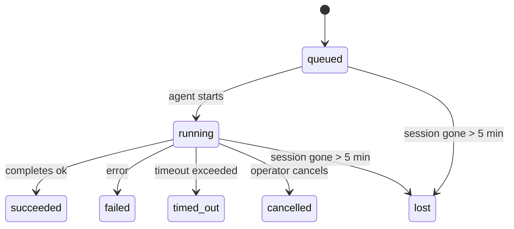

---
read_when:
    - ตรวจสอบงานเบื้องหลังที่กำลังดำเนินอยู่หรือเพิ่งเสร็จสิ้น
    - การดีบักความล้มเหลวในการส่งมอบสำหรับการรันเอเจนต์แบบแยกตัว
    - ทำความเข้าใจว่าการรันเบื้องหลังสัมพันธ์กับเซสชัน Cron และ Heartbeat อย่างไร
sidebarTitle: Background tasks
summary: การติดตามงานเบื้องหลังสำหรับการเรียกใช้ ACP, เอเจนต์ย่อย, งาน Cron แบบแยก, และการดำเนินการ CLI
title: งานเบื้องหลัง
x-i18n:
    generated_at: "2026-06-27T17:08:57Z"
    model: gpt-5.5
    postprocess_version: locale-links-v1
    provider: openai
    source_hash: 4a630a52d0d6bfd387a37415dd63fc4bfbce23f99eaa8cb780c3d6f8913675fd
    source_path: automation/tasks.md
    workflow: 16
---

<Note>
กำลังมองหาการจัดตารางเวลาอยู่หรือไม่? ดู [ระบบอัตโนมัติ](/th/automation) เพื่อเลือกกลไกที่เหมาะสม หน้านี้คือบัญชีบันทึกกิจกรรมสำหรับงานเบื้องหลัง ไม่ใช่ตัวจัดตารางเวลา
</Note>

งานเบื้องหลังติดตามงานที่ทำงาน **นอกเซสชันการสนทนาหลักของคุณ**: การรัน ACP, การสร้าง subagent, การดำเนินงาน cron แบบแยก, และการดำเนินการที่เริ่มจาก CLI

งาน **ไม่ได้** แทนที่เซสชัน งาน Cron หรือ Heartbeat - งานเป็น **บัญชีบันทึกกิจกรรม** ที่บันทึกว่างานที่แยกออกไปเกิดอะไรขึ้น เมื่อใด และสำเร็จหรือไม่

<Note>
ไม่ใช่การรันเอเจนต์ทุกครั้งที่จะสร้างงาน เทิร์น Heartbeat และแชตโต้ตอบปกติจะไม่สร้างงาน การดำเนินงาน Cron ทั้งหมด การสร้าง ACP การสร้าง subagent และคำสั่งเอเจนต์ของ CLI จะสร้างงาน
</Note>

## สรุปย่อ

- งานคือ **เรคคอร์ด** ไม่ใช่ตัวจัดตารางเวลา - Cron และ Heartbeat เป็นตัวตัดสินว่า _เมื่อใด_ งานจะทำงาน ส่วนงานติดตามว่า _เกิดอะไรขึ้น_
- ACP, subagent, งาน Cron ทั้งหมด และการดำเนินการของ CLI จะสร้างงาน เทิร์น Heartbeat จะไม่สร้าง
- แต่ละงานเคลื่อนผ่าน `queued → running → terminal` (succeeded, failed, timed_out, cancelled หรือ lost)
- งาน Cron จะยังคงมีสถานะ live ขณะที่รันไทม์ Cron ยังเป็นเจ้าของงานนั้นอยู่ หาก
  สถานะรันไทม์ในหน่วยความจำหายไป การบำรุงรักษางานจะตรวจสอบประวัติการรัน Cron
  แบบคงทนก่อน แล้วจึงทำเครื่องหมายงานว่า lost
- การเสร็จสิ้นขับเคลื่อนด้วย push: งานที่แยกออกไปสามารถแจ้งโดยตรงหรือปลุก
  เซสชัน/Heartbeat ของผู้ร้องขอเมื่อเสร็จสิ้น ดังนั้นลูป polling สถานะ
  จึงมักเป็นรูปแบบที่ไม่เหมาะสม
- การรัน Cron แบบแยกและการเสร็จสิ้นของ subagent จะพยายามทำความสะอาดแท็บเบราว์เซอร์/โปรเซสที่ติดตามไว้สำหรับเซสชันลูกก่อนการทำบัญชีทำความสะอาดขั้นสุดท้าย
- การส่งมอบ Cron แบบแยกจะระงับคำตอบชั่วคราวเก่าของพาเรนต์ขณะที่งาน subagent ลูกหลานยังคงระบายอยู่ และจะเลือกผลลัพธ์สุดท้ายของลูกหลานเมื่อมาถึงก่อนการส่งมอบ
- การแจ้งเตือนการเสร็จสิ้นจะถูกส่งโดยตรงไปยังช่องทางหรือเข้าคิวสำหรับ Heartbeat ถัดไป
- `openclaw tasks list` แสดงงานทั้งหมด; `openclaw tasks audit` แสดงปัญหา
- เรคคอร์ดปลายทางจะถูกเก็บไว้ 7 วัน แล้วถูกล้างโดยอัตโนมัติ

## เริ่มต้นอย่างรวดเร็ว

<Tabs>
  <Tab title="แสดงรายการและกรอง">
    ```bash
    # List all tasks (newest first)
    openclaw tasks list

    # Filter by runtime or status
    openclaw tasks list --runtime acp
    openclaw tasks list --status running
    ```

  </Tab>
  <Tab title="ตรวจสอบ">
    ```bash
    # Show details for a specific task (by ID, run ID, or session key)
    openclaw tasks show <lookup>
    ```
  </Tab>
  <Tab title="ยกเลิกและแจ้งเตือน">
    ```bash
    # Cancel a running task (kills the child session)
    openclaw tasks cancel <lookup>

    # Change notification policy for a task
    openclaw tasks notify <lookup> state_changes
    ```

  </Tab>
  <Tab title="ตรวจสอบและบำรุงรักษา">
    ```bash
    # Run a health audit
    openclaw tasks audit

    # Preview or apply maintenance
    openclaw tasks maintenance
    openclaw tasks maintenance --apply
    ```

  </Tab>
  <Tab title="โฟลว์งาน">
    ```bash
    # Inspect TaskFlow state
    openclaw tasks flow list
    openclaw tasks flow show <lookup>
    openclaw tasks flow cancel <lookup>
    ```
  </Tab>
</Tabs>

## อะไรสร้างงาน

| แหล่งที่มา                 | ประเภทรันไทม์ | เมื่อเรคคอร์ดงานถูกสร้าง                                          | นโยบายแจ้งเตือนเริ่มต้น |
| ---------------------- | ------------ | ---------------------------------------------------------------------- | --------------------- |
| การรัน ACP เบื้องหลัง    | `acp`        | สร้างเซสชัน ACP ลูก                                           | `done_only`           |
| การจัดการ subagent | `subagent`   | สร้าง subagent ผ่าน `sessions_spawn`                               | `done_only`           |
| งาน Cron (ทุกประเภท)  | `cron`       | ทุกการดำเนินงาน Cron (เซสชันหลักและแบบแยก)                       | `silent`              |
| การดำเนินการของ CLI         | `cli`        | คำสั่ง `openclaw agent` ที่รันผ่าน Gateway                 | `silent`              |
| งานสื่อของเอเจนต์       | `cli`        | การรัน `image_generate`/`music_generate`/`video_generate` ที่มีเซสชันรองรับ | `silent`              |

<AccordionGroup>
  <Accordion title="ค่าเริ่มต้นการแจ้งเตือนสำหรับ Cron และสื่อ">
    งาน Cron ในเซสชันหลักใช้นโยบายแจ้งเตือน `silent` โดยค่าเริ่มต้น - งานเหล่านี้สร้างเรคคอร์ดเพื่อการติดตามแต่ไม่สร้างการแจ้งเตือน งาน Cron แบบแยกก็ใช้ค่าเริ่มต้นเป็น `silent` เช่นกัน แต่มองเห็นได้ชัดกว่าเพราะรันในเซสชันของตัวเอง

    การรัน `image_generate`, `music_generate` และ `video_generate` ที่มีเซสชันรองรับก็ใช้นโยบายแจ้งเตือน `silent` เช่นกัน งานเหล่านี้ยังคงสร้างเรคคอร์ดงาน แต่การเสร็จสิ้นจะถูกส่งกลับไปยังเซสชันเอเจนต์เดิมเป็นการปลุกภายใน เพื่อให้เอเจนต์เขียนข้อความติดตามผลและแนบสื่อที่เสร็จแล้วเอง เอเจนต์ผู้ร้องขอจะทำตามสัญญาการตอบกลับที่มองเห็นได้ตามปกติ: ตอบกลับสุดท้ายอัตโนมัติเมื่อกำหนดค่าไว้ หรือ `message(action="send")` พร้อม `NO_REPLY` เมื่อเซสชันต้องใช้การตอบกลับผ่านเครื่องมือข้อความ หากเซสชันผู้ร้องขอไม่ active อีกต่อไปหรือการปลุก active ล้มเหลว และเอเจนต์ที่ทำการเสร็จสิ้นพลาดสื่อที่สร้างบางส่วนหรือทั้งหมด OpenClaw จะส่ง fallback โดยตรงแบบ idempotent พร้อมเฉพาะสื่อที่ขาดไปยังเป้าหมายช่องทางเดิม

  </Accordion>
  <Accordion title="ราวกันพลาดสำหรับการสร้างสื่อพร้อมกัน">
    ขณะที่งานสร้างสื่อที่มีเซสชันรองรับยัง active อยู่ เครื่องมือสื่อจะทำหน้าที่เป็นราวกันพลาดสำหรับการลองซ้ำโดยไม่ตั้งใจด้วย การเรียก `image_generate` ซ้ำสำหรับพรอมป์เดียวกันจะคืนสถานะงาน active ที่ตรงกัน ขณะที่พรอมป์รูปภาพที่แตกต่างสามารถเริ่มงานของตัวเองได้ การเรียก `music_generate` และ `video_generate` จะยังคงคืนสถานะงาน active สำหรับเซสชันนั้นแทนที่จะเริ่มการสร้างพร้อมกันรายการที่สอง ใช้ `action: "status"` เมื่อคุณต้องการค้นหาความคืบหน้า/สถานะอย่างชัดเจนจากฝั่งเอเจนต์
  </Accordion>
  <Accordion title="อะไรไม่สร้างงาน">
    - เทิร์น Heartbeat - เซสชันหลัก; ดู [Heartbeat](/th/gateway/heartbeat)
    - เทิร์นแชตโต้ตอบปกติ
    - การตอบกลับ `/command` โดยตรง

  </Accordion>
</AccordionGroup>

## วงจรชีวิตของงาน



| สถานะ      | ความหมาย                                                              |
| ----------- | -------------------------------------------------------------------------- |
| `queued`    | สร้างแล้ว กำลังรอให้เอเจนต์เริ่ม                                    |
| `running`   | เทิร์นของเอเจนต์กำลังดำเนินการอยู่                                           |
| `succeeded` | เสร็จสมบูรณ์สำเร็จ                                                     |
| `failed`    | เสร็จสิ้นพร้อมข้อผิดพลาด                                                    |
| `timed_out` | เกิน timeout ที่กำหนดไว้                                            |
| `cancelled` | ถูกหยุดโดยโอเปอเรเตอร์ผ่าน `openclaw tasks cancel`                        |
| `lost`      | รันไทม์สูญเสียสถานะหนุนหลังที่มีอำนาจหลังช่วงผ่อนผัน 5 นาที |

การเปลี่ยนสถานะเกิดขึ้นโดยอัตโนมัติ - เมื่อการรันเอเจนต์ที่เกี่ยวข้องจบลง สถานะงานจะอัปเดตให้ตรงกัน

การเสร็จสิ้นของการรันเอเจนต์เป็นแหล่งอำนาจสำหรับเรคคอร์ดงาน active การรันที่แยกออกไปและสำเร็จจะสรุปเป็น `succeeded`, ข้อผิดพลาดทั่วไปของการรันจะสรุปเป็น `failed`, และผลลัพธ์ timeout หรือ abort จะสรุปเป็น `timed_out` หากโอเปอเรเตอร์ยกเลิกงานไปแล้ว หรือรันไทม์บันทึกสถานะปลายทางที่แรงกว่าไว้แล้ว เช่น `failed`, `timed_out` หรือ `lost` สัญญาณสำเร็จที่มาภายหลังจะไม่ลดระดับสถานะปลายทางนั้น

`lost` รับรู้ตามรันไทม์:

- งาน ACP: เมทาดาทาเซสชัน ACP ลูกที่หนุนหลังหายไป
- งาน subagent: เซสชันลูกที่หนุนหลังหายไปจากสโตร์เอเจนต์เป้าหมาย
- งาน Cron: รันไทม์ Cron ไม่ติดตามงานว่า active อีกต่อไป และประวัติการรัน Cron
  แบบคงทนไม่แสดงผลลัพธ์ปลายทางสำหรับการรันนั้น การ audit ของ CLI แบบออฟไลน์
  ไม่ถือว่าสถานะรันไทม์ Cron ในโปรเซสที่ว่างเปล่าของตัวเองเป็นอำนาจ
- งาน CLI: งานที่มี run id/source id ใช้บริบทการรัน live ดังนั้น
  แถวเซสชันลูกหรือเซสชันแชตที่ค้างอยู่จะไม่ทำให้ยังมีชีวิตอยู่หลังจาก
  การรันที่ Gateway เป็นเจ้าของหายไป งาน CLI แบบเดิมที่ไม่มีตัวตนการรันยังคง
  fallback ไปยังเซสชันลูก การรัน `openclaw agent` ที่มี Gateway รองรับจะสรุป
  จากผลการรันด้วย ดังนั้นการรันที่เสร็จแล้วจะไม่ค้าง active จนกว่า sweeper
  จะทำเครื่องหมายเป็น `lost`

## การส่งมอบและการแจ้งเตือน

เมื่องานถึงสถานะปลายทาง OpenClaw จะแจ้งคุณ มีเส้นทางการส่งมอบสองแบบ:

**การส่งมอบโดยตรง** - หากงานมีเป้าหมายช่องทาง (`requesterOrigin`) ข้อความเสร็จสิ้นจะส่งตรงไปยังช่องทางนั้น (Telegram, Discord, Slack ฯลฯ) การเสร็จสิ้นของงานในกลุ่มและช่องทางจะถูกกำหนดเส้นทางผ่านเซสชันผู้ร้องขอแทน เพื่อให้เอเจนต์พาเรนต์เขียนคำตอบที่มองเห็นได้ สำหรับการเสร็จสิ้นของ subagent OpenClaw ยังรักษาการกำหนดเส้นทาง thread/topic ที่ผูกไว้เมื่อมี และสามารถเติม `to` / บัญชีที่ขาดหายจาก route ที่เก็บไว้ของเซสชันผู้ร้องขอ (`lastChannel` / `lastTo` / `lastAccountId`) ก่อนจะยอมแพ้กับการส่งมอบโดยตรง

**การส่งมอบแบบเข้าคิวในเซสชัน** - หากการส่งมอบโดยตรงล้มเหลวหรือไม่ได้ตั้ง origin ไว้ การอัปเดตจะถูกเข้าคิวเป็นอีเวนต์ระบบในเซสชันของผู้ร้องขอและแสดงบน Heartbeat ถัดไป

<Tip>
การเสร็จสิ้นของงานจะกระตุ้นการปลุก Heartbeat ทันที เพื่อให้คุณเห็นผลลัพธ์อย่างรวดเร็ว - คุณไม่จำเป็นต้องรอ tick ของ Heartbeat ที่จัดตารางไว้ถัดไป
</Tip>

นั่นหมายความว่าเวิร์กโฟลว์ปกติเป็นแบบ push-based: เริ่มงานที่แยกออกไปหนึ่งครั้ง แล้วปล่อยให้รันไทม์ปลุกหรือแจ้งคุณเมื่อเสร็จสิ้น ตรวจสอบสถานะงานด้วย polling เฉพาะเมื่อคุณต้องการดีบัก แทรกแซง หรือ audit อย่างชัดเจน

### นโยบายการแจ้งเตือน

ควบคุมว่าคุณจะได้ยินเกี่ยวกับแต่ละงานมากเพียงใด:

| นโยบาย                | สิ่งที่ถูกส่งมอบ                                                       |
| --------------------- | ----------------------------------------------------------------------- |
| `done_only` (ค่าเริ่มต้น) | เฉพาะสถานะปลายทาง (succeeded, failed ฯลฯ) - **นี่คือค่าเริ่มต้น** |
| `state_changes`       | ทุกการเปลี่ยนสถานะและการอัปเดตความคืบหน้า                              |
| `silent`              | ไม่มีอะไรเลย                                                          |

เปลี่ยนนโยบายขณะที่งานกำลังรัน:

```bash
openclaw tasks notify <lookup> state_changes
```

## อ้างอิง CLI

<AccordionGroup>
  <Accordion title="tasks list">
    ```bash
    openclaw tasks list [--runtime <acp|subagent|cron|cli>] [--status <status>] [--json]
    ```

    คอลัมน์เอาต์พุต: Task ID, Kind, Status, Delivery, Run ID, Child Session, Summary

  </Accordion>
  <Accordion title="tasks show">
    ```bash
    openclaw tasks show <lookup>
    ```

    โทเค็นค้นหารับ task ID, run ID หรือ session key แสดงเรคคอร์ดเต็มรวมถึงเวลา สถานะการส่งมอบ ข้อผิดพลาด และสรุปปลายทาง

  </Accordion>
  <Accordion title="tasks cancel">
    ```bash
    openclaw tasks cancel <lookup>
    ```

    สำหรับงาน ACP และ subagent คำสั่งนี้จะ kill เซสชันลูก สำหรับงานที่ CLI ติดตาม การยกเลิกจะถูกบันทึกในทะเบียนงาน (ไม่มี handle รันไทม์ลูกแยกต่างหาก) สถานะจะเปลี่ยนเป็น `cancelled` และส่งการแจ้งเตือนการส่งมอบเมื่อเกี่ยวข้อง

  </Accordion>
  <Accordion title="tasks notify">
    ```bash
    openclaw tasks notify <lookup> <done_only|state_changes|silent>
    ```
  </Accordion>
  <Accordion title="tasks audit">
    ```bash
    openclaw tasks audit [--json]
    ```

    แสดงปัญหาการปฏิบัติการ สิ่งที่ตรวจพบจะปรากฏใน `openclaw status` ด้วยเมื่อตรวจพบปัญหา

    | ข้อค้นพบ                   | ความรุนแรง   | ตัวกระตุ้น                                                                                                      |
    | ------------------------- | ---------- | ------------------------------------------------------------------------------------------------------------ |
    | `stale_queued`            | warn       | อยู่ในคิวนานกว่า 10 นาที                                                                              |
    | `stale_running`           | error      | ทำงานนานกว่า 30 นาที                                                                             |
    | `lost`                    | warn/error | ความเป็นเจ้าของงานที่มีรันไทม์รองรับหายไป; งานที่สูญหายซึ่งถูกเก็บไว้จะเตือนจนถึง `cleanupAfter` จากนั้นจะกลายเป็นข้อผิดพลาด |
    | `delivery_failed`         | warn       | การส่งล้มเหลวและนโยบายการแจ้งเตือนไม่ใช่ `silent`                                                            |
    | `missing_cleanup`         | warn       | งานปลายทางที่ไม่มีเวลาประทับการล้างข้อมูล                                                                      |
    | `inconsistent_timestamps` | warn       | การละเมิดไทม์ไลน์ (เช่น สิ้นสุดก่อนเริ่มต้น)                                                        |

  </Accordion>
  <Accordion title="tasks maintenance">
    ```bash
    openclaw tasks maintenance [--json]
    openclaw tasks maintenance --apply [--json]
    ```

    ใช้สิ่งนี้เพื่อดูตัวอย่างหรือใช้การกระทบยอด การประทับเวลาการล้างข้อมูล และการตัดแต่งสำหรับงาน สถานะ Task Flow และแถวรีจิสทรีเซสชันการรัน cron ที่เก่า

    การกระทบยอดรับรู้รันไทม์:

    - งาน ACP/subagent ตรวจสอบเซสชันลูกที่รองรับงานนั้น
    - งาน Subagent ที่เซสชันลูกมี tombstone การกู้คืนหลังรีสตาร์ตจะถูกทำเครื่องหมายว่าสูญหาย แทนที่จะถือว่าเป็นเซสชันรองรับที่กู้คืนได้
    - งาน Cron ตรวจสอบว่ารันไทม์ cron ยังเป็นเจ้าของงานอยู่หรือไม่ จากนั้นกู้คืนสถานะปลายทางจากบันทึกการรัน cron/สถานะงานที่คงอยู่ ก่อนจะ fallback ไปเป็น `lost` เฉพาะกระบวนการ Gateway เท่านั้นที่เป็นแหล่งข้อมูลที่เชื่อถือได้สำหรับชุด active-job ของ cron ในหน่วยความจำ; การตรวจสอบ CLI แบบออฟไลน์ใช้ประวัติที่คงทน แต่จะไม่ทำเครื่องหมายงาน cron ว่าสูญหายเพียงเพราะ Set ในเครื่องนั้นว่างเปล่า
    - งาน CLI ที่มีตัวตนการรันจะตรวจสอบบริบทรันสดที่เป็นเจ้าของ ไม่ใช่แค่แถว child-session หรือ chat-session

    การล้างข้อมูลเมื่อเสร็จสิ้นก็รับรู้รันไทม์เช่นกัน:

    - การเสร็จสิ้นของ Subagent จะพยายามปิดแท็บ/กระบวนการเบราว์เซอร์ที่ติดตามไว้สำหรับเซสชันลูก ก่อนที่การล้างข้อมูลการประกาศจะดำเนินต่อ
    - การเสร็จสิ้นของ cron แบบแยกจะพยายามปิดแท็บ/กระบวนการเบราว์เซอร์ที่ติดตามไว้สำหรับเซสชัน cron ก่อนที่การรันจะถูกรื้อถอนทั้งหมด
    - การส่งของ cron แบบแยกจะรอการติดตามผลของ subagent ลูกหลานเมื่อจำเป็น และระงับข้อความตอบรับของพาเรนต์ที่เก่าแทนที่จะประกาศข้อความนั้น
    - การส่งเมื่อ Subagent เสร็จสิ้นใช้เฉพาะข้อความผู้ช่วยล่าสุดที่มองเห็นได้ของลูกเท่านั้น เอาต์พุต Tool/toolResult จะไม่ถูกเลื่อนระดับเป็นข้อความผลลัพธ์ของลูก การรันปลายทางที่ล้มเหลวจะประกาศสถานะล้มเหลวโดยไม่เล่นซ้ำข้อความตอบกลับที่จับไว้
    - ความล้มเหลวในการล้างข้อมูลจะไม่บดบังผลลัพธ์จริงของงาน

    เมื่อใช้การบำรุงรักษา OpenClaw จะลบแถวรีจิสทรีเซสชัน `cron:<jobId>:run:<uuid>` ที่เก่ากว่า 7 วันด้วย พร้อมคงแถวสำหรับงาน cron ที่กำลังรันอยู่ในปัจจุบัน และปล่อยแถวเซสชันที่ไม่ใช่ cron ไว้เหมือนเดิม

  </Accordion>
  <Accordion title="tasks flow list | show | cancel">
    ```bash
    openclaw tasks flow list [--status <status>] [--json]
    openclaw tasks flow show <lookup> [--json]
    openclaw tasks flow cancel <lookup>
    ```

    ใช้คำสั่งเหล่านี้เมื่อ Task Flow ที่ทำหน้าที่จัดลำดับงานคือสิ่งที่คุณสนใจ แทนที่จะเป็นเรคคอร์ดงานเบื้องหลังรายตัว

  </Accordion>
</AccordionGroup>

## บอร์ดงานแชท (`/tasks`)

ใช้ `/tasks` ในเซสชันแชทใดก็ได้เพื่อดูงานเบื้องหลังที่เชื่อมโยงกับเซสชันนั้น บอร์ดจะแสดงงานที่ใช้งานอยู่และงานที่เพิ่งเสร็จสิ้น พร้อมรันไทม์ สถานะ เวลา และรายละเอียดความคืบหน้าหรือข้อผิดพลาด

เมื่อเซสชันปัจจุบันไม่มีงานที่เชื่อมโยงและมองเห็นได้ `/tasks` จะ fallback ไปยังจำนวนงานในเครื่องของเอเจนต์ เพื่อให้คุณยังได้ภาพรวมโดยไม่รั่วไหลรายละเอียดของเซสชันอื่น

สำหรับบัญชีแยกประเภทฉบับเต็มสำหรับผู้ปฏิบัติการ ให้ใช้ CLI: `openclaw tasks list`

## การผสานรวมสถานะ (แรงกดดันจากงาน)

`openclaw status` มีสรุปงานแบบดูได้ทันที:

```
Tasks: 3 queued · 2 running · 1 issues
```

สรุปรายงาน:

- **active** - จำนวนของ `queued` + `running`
- **failures** - จำนวนของ `failed` + `timed_out` + `lost`
- **byRuntime** - การแจกแจงตาม `acp`, `subagent`, `cron`, `cli`

ทั้ง `/status` และเครื่องมือ `session_status` ใช้สแนปช็อตงานที่รับรู้การล้างข้อมูล: งานที่ใช้งานอยู่จะได้รับความสำคัญ แถวที่เสร็จสิ้นและเก่าจะถูกซ่อน และความล้มเหลวล่าสุดจะแสดงเฉพาะเมื่อไม่มีงานที่ใช้งานอยู่เหลืออยู่ สิ่งนี้ช่วยให้การ์ดสถานะโฟกัสกับสิ่งที่สำคัญในตอนนี้

## ที่เก็บข้อมูลและการบำรุงรักษา

### งานอยู่ที่ไหน

เรคคอร์ดงานคงอยู่ใน SQLite ที่:

```
$OPENCLAW_STATE_DIR/tasks/runs.sqlite
```

รีจิสทรีโหลดเข้าสู่หน่วยความจำเมื่อ Gateway เริ่มต้น และซิงค์การเขียนไปยัง SQLite เพื่อความทนทานข้ามการรีสตาร์ต
Gateway ทำให้ write-ahead log ของ SQLite มีขอบเขตโดยใช้ค่าเกณฑ์ autocheckpoint เริ่มต้นของ SQLite
ร่วมกับ checkpoint แบบ `PASSIVE` เป็นระยะ การปิดระบบและ
checkpoint การบำรุงรักษาแบบชัดเจนยังคงใช้ `TRUNCATE` เพื่อให้การปิดตามปกติสามารถ
เรียกคืนพื้นที่ WAL ได้โดยไม่ทำให้ sweeper เบื้องหลังต้องรอ reader ที่ใช้งานอยู่

### การบำรุงรักษาอัตโนมัติ

sweeper ทำงานทุก **60 วินาที** และจัดการสี่สิ่ง:

<Steps>
  <Step title="Reconciliation">
    ตรวจสอบว่างานที่ใช้งานอยู่ยังมีสิ่งรองรับรันไทม์ที่เชื่อถือได้หรือไม่ งาน ACP/subagent ใช้สถานะ child-session, งาน cron ใช้ความเป็นเจ้าของ active-job และงาน CLI ที่มีตัวตนการรันใช้บริบทรันที่เป็นเจ้าของ หากสถานะรองรับนั้นหายไปนานกว่า 5 นาที งานจะถูกทำเครื่องหมายเป็น `lost`
  </Step>
  <Step title="ACP session repair">
    ปิดเซสชัน ACP แบบ one-shot ที่เป็นของพาเรนต์และเป็นปลายทางหรือกำพร้า และปิดเซสชัน ACP แบบ persistent ที่เป็นปลายทางและเก่าหรือกำพร้า เฉพาะเมื่อไม่มีการผูกบทสนทนาที่ใช้งานอยู่เหลืออยู่
  </Step>
  <Step title="Cleanup stamping">
    ตั้งเวลาประทับ `cleanupAfter` บนงานปลายทาง (endedAt + 7 วัน) ระหว่างช่วงเก็บรักษา งานที่สูญหายยังปรากฏในการตรวจสอบเป็นคำเตือน; หลังจาก `cleanupAfter` หมดอายุ หรือเมื่อข้อมูลเมตาการล้างข้อมูลหายไป งานเหล่านั้นจะเป็นข้อผิดพลาด
  </Step>
  <Step title="Pruning">
    ลบเรคคอร์ดที่เลยวันที่ `cleanupAfter`
  </Step>
</Steps>

<Note>
**การเก็บรักษา:** เรคคอร์ดงานปลายทางจะถูกเก็บไว้ **7 วัน** จากนั้นตัดแต่งโดยอัตโนมัติ ไม่ต้องตั้งค่าใดๆ
</Note>

## งานสัมพันธ์กับระบบอื่นอย่างไร

<AccordionGroup>
  <Accordion title="Tasks and Task Flow">
    [Task Flow](/th/automation/taskflow) คือเลเยอร์จัดลำดับโฟลว์เหนือกว่างานเบื้องหลัง โฟลว์เดียวอาจประสานหลายงานตลอดอายุการทำงานโดยใช้โหมดซิงค์แบบ managed หรือ mirrored ใช้ `openclaw tasks` เพื่อตรวจสอบเรคคอร์ดงานรายตัว และ `openclaw tasks flow` เพื่อตรวจสอบโฟลว์ที่ทำหน้าที่จัดลำดับ

    ดูรายละเอียดที่ [Task Flow](/th/automation/taskflow)

  </Accordion>
  <Accordion title="Tasks and cron">
    คำจำกัดความของงาน Cron สถานะการดำเนินการของรันไทม์ และประวัติการรันอยู่ในฐานข้อมูลสถานะ SQLite ที่ใช้ร่วมกันของ OpenClaw การดำเนินการ cron **ทุกครั้ง** จะสร้างเรคคอร์ดงาน ทั้งแบบ main-session และแบบแยก งาน cron แบบ main-session มีนโยบายแจ้งเตือนเริ่มต้นเป็น `silent` เพื่อให้ติดตามได้โดยไม่สร้างการแจ้งเตือน

    ดู [งาน Cron](/th/automation/cron-jobs)

  </Accordion>
  <Accordion title="Tasks and heartbeat">
    การรัน Heartbeat เป็นเทิร์นแบบ main-session และจะไม่สร้างเรคคอร์ดงาน เมื่องานเสร็จสิ้น งานนั้นสามารถกระตุ้นการปลุก heartbeat เพื่อให้คุณเห็นผลลัพธ์ได้ทันที

    ดู [Heartbeat](/th/gateway/heartbeat)

  </Accordion>
  <Accordion title="Tasks and sessions">
    งานอาจอ้างอิง `childSessionKey` (ที่งานรันอยู่) และ `requesterSessionKey` (ผู้เริ่มงาน) `agentId` ของงานระบุเอเจนต์ที่ดำเนินงาน ขณะที่ฟิลด์ requester และ owner เก็บบริบทการเริ่มต้นและการควบคุมไว้ เซสชันคือบริบทบทสนทนา; งานคือการติดตามกิจกรรมที่อยู่เหนือสิ่งนั้น
  </Accordion>
  <Accordion title="Tasks and agent runs">
    `runId` ของงานเชื่อมโยงไปยังการรันของเอเจนต์ที่กำลังทำงานนั้น เหตุการณ์วงจรชีวิตของเอเจนต์ (เริ่มต้น สิ้นสุด ข้อผิดพลาด) จะอัปเดตสถานะงานโดยอัตโนมัติ คุณไม่จำเป็นต้องจัดการวงจรชีวิตด้วยตนเอง
  </Accordion>
</AccordionGroup>

## ที่เกี่ยวข้อง

- [ระบบอัตโนมัติ](/th/automation) - กลไกอัตโนมัติทั้งหมดในภาพรวม
- [CLI: Tasks](/th/cli/tasks) - อ้างอิงคำสั่ง CLI
- [Heartbeat](/th/gateway/heartbeat) - เทิร์น main-session เป็นระยะ
- [งานตามกำหนดเวลา](/th/automation/cron-jobs) - การจัดกำหนดการงานเบื้องหลัง
- [Task Flow](/th/automation/taskflow) - การจัดลำดับโฟลว์เหนือกว่างาน
