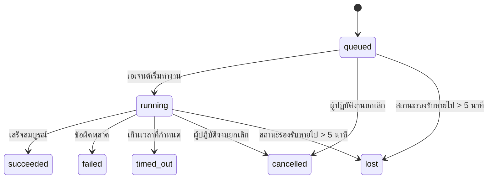

---
read_when:
    - ตรวจสอบงานเบื้องหลังที่กำลังดำเนินอยู่หรือเพิ่งเสร็จสิ้นเมื่อไม่นานมานี้
    - การดีบักความล้มเหลวในการส่งมอบสำหรับการเรียกใช้เอเจนต์แบบแยกออกจากเซสชัน
    - ทำความเข้าใจว่าการทำงานเบื้องหลังสัมพันธ์กับเซสชัน Cron และ Heartbeat อย่างไร
sidebarTitle: Background tasks
summary: การติดตามงานเบื้องหลังสำหรับการทำงานของ ACP, เอเจนต์ย่อย, การดำเนินการ Cron และการดำเนินการผ่าน CLI
title: งานเบื้องหลัง
x-i18n:
    generated_at: "2026-07-19T07:00:56Z"
    model: gpt-5.6
    postprocess_version: locale-links-v1
    prompt_version: 32
    provider: openai
    source_hash: dbdc5ced133764fec0c8b9ae7b1957e24272dc9c1c86099de81f6923955d6b5a
    source_path: automation/tasks.md
    workflow: 16
---

<Note>
กำลังมองหาการตั้งเวลาหรือไม่? ดู [ระบบอัตโนมัติ](/th/automation) เพื่อเลือกกลไกที่เหมาะสม หน้านี้คือบัญชีบันทึกกิจกรรมสำหรับงานเบื้องหลัง ไม่ใช่ตัวกำหนดเวลา
</Note>

งานเบื้องหลังติดตามงานที่ทำงาน **นอกเซสชันการสนทนาหลัก** ได้แก่ การทำงานของ ACP, การสร้างเอเจนต์ย่อย, การดำเนินงาน cron และการดำเนินการที่เริ่มต้นผ่าน CLI

งาน **ไม่** ได้มาแทนที่เซสชัน งาน cron หรือ Heartbeat แต่เป็น **บัญชีบันทึกกิจกรรม** ที่บันทึกว่าเกิดงานแบบแยกออกไปใดขึ้น เมื่อใด และสำเร็จหรือไม่

<Note>
การทำงานของเอเจนต์ไม่ได้สร้างงานทุกครั้ง รอบ Heartbeat และแชตแบบโต้ตอบตามปกติจะไม่สร้างงาน แต่การดำเนินงาน cron ทั้งหมด การสร้าง ACP การสร้างเอเจนต์ย่อย คำสั่งเอเจนต์ CLI ที่ Gateway ส่งต่อ และคำสั่งเบื้องหลัง `exec` ที่เอเจนต์เริ่มต้นจะสร้างงาน
</Note>

## สรุปย่อ

- งานคือ **ระเบียน** ไม่ใช่ตัวกำหนดเวลา โดย cron และ Heartbeat เป็นผู้ตัดสินว่า _เมื่อใด_ งานจะทำงาน ส่วนงานจะติดตามว่า _เกิดอะไรขึ้น_
- ACP, เอเจนต์ย่อย, งาน cron ทั้งหมด และการดำเนินการ CLI จะสร้างงาน แต่รอบ Heartbeat จะไม่สร้าง
- งานแต่ละรายการจะเปลี่ยนสถานะผ่าน `queued → running → terminal` (สำเร็จ ล้มเหลว หมดเวลา ถูกยกเลิก หรือสูญหาย)
- งาน cron จะยังคงทำงานอยู่ตราบใดที่รันไทม์ cron ยังเป็นเจ้าของงานนั้น หากสถานะรันไทม์ในหน่วยความจำหายไป การบำรุงรักษางานจะตรวจสอบประวัติการทำงาน cron แบบถาวรก่อนทำเครื่องหมายว่างานสูญหาย
- การเสร็จสิ้นขับเคลื่อนด้วยการส่งข้อมูล: งานแบบแยกออกไปสามารถแจ้งเตือนได้โดยตรงหรือปลุกเซสชัน/Heartbeat ของผู้ร้องขอเมื่อเสร็จสิ้น ดังนั้นลูปสำรวจสถานะจึงมักไม่ใช่รูปแบบที่เหมาะสม
- การทำงาน cron แบบแยกและการเสร็จสิ้นของเอเจนต์ย่อยจะพยายามล้างแท็บ/โพรเซสของเบราว์เซอร์ที่ติดตามสำหรับเซสชันลูกก่อนบันทึกการล้างข้อมูลขั้นสุดท้าย
- การส่งมอบ cron แบบแยกจะระงับการตอบกลับระหว่างทางของพาเรนต์ที่ล้าสมัย ขณะที่งานของเอเจนต์ย่อยสืบทอดยังอยู่ระหว่างการดำเนินงานให้เสร็จ และจะเลือกผลลัพธ์สุดท้ายจากงานสืบทอดหากผลลัพธ์นั้นมาถึงก่อนการส่งมอบ
- การแจ้งเตือนเมื่อเสร็จสิ้นจะถูกส่งไปยังช่องโดยตรงหรือเข้าคิวสำหรับ Heartbeat ครั้งถัดไป
- `openclaw tasks list` แสดงงานทั้งหมด ส่วน `openclaw tasks audit` แสดงปัญหา
- ระเบียนสถานะสิ้นสุดจะเก็บไว้ 7 วัน (ระเบียน `lost` เก็บไว้ 24 ชั่วโมง) จากนั้นจะถูกล้างโดยอัตโนมัติ

## เริ่มต้นใช้งานอย่างรวดเร็ว

<Tabs>
  <Tab title="แสดงรายการและกรอง">
    ```bash
    # แสดงงานทั้งหมด (งานล่าสุดก่อน)
    openclaw tasks list

    # กรองตามรันไทม์หรือสถานะ
    openclaw tasks list --runtime acp
    openclaw tasks list --status running
    ```

  </Tab>
  <Tab title="ตรวจสอบ">
    ```bash
    # แสดงรายละเอียดของงานที่ระบุ (ตาม ID งาน, ID การทำงาน หรือคีย์เซสชัน)
    openclaw tasks show <lookup>
    ```
  </Tab>
  <Tab title="ยกเลิกและแจ้งเตือน">
    ```bash
    # ยกเลิกงานที่กำลังทำงาน (ยุติเซสชันลูก)
    openclaw tasks cancel <lookup>

    # เปลี่ยนนโยบายการแจ้งเตือนสำหรับงาน
    openclaw tasks notify <lookup> state_changes
    ```

  </Tab>
  <Tab title="ตรวจสอบและบำรุงรักษา">
    ```bash
    # ดำเนินการตรวจสอบสถานภาพ
    openclaw tasks audit

    # แสดงตัวอย่างหรือนำการบำรุงรักษาไปใช้
    openclaw tasks maintenance
    openclaw tasks maintenance --apply
    ```

  </Tab>
  <Tab title="โฟลว์งาน">
    ```bash
    # ตรวจสอบสถานะ TaskFlow
    openclaw tasks flow list
    openclaw tasks flow show <lookup>
    openclaw tasks flow cancel <lookup>
    ```
  </Tab>
</Tabs>

## สิ่งที่สร้างงาน

| แหล่งที่มา                 | ประเภทรันไทม์ | เวลาที่สร้างระเบียนงาน                                          | นโยบายการแจ้งเตือนเริ่มต้น |
| ---------------------- | ------------ | ---------------------------------------------------------------------- | --------------------- |
| การทำงานเบื้องหลังของ ACP    | `acp`        | เมื่อสร้างเซสชัน ACP ลูก                                           | `done_only`           |
| การประสานงานเอเจนต์ย่อย | `subagent`   | เมื่อสร้างเอเจนต์ย่อยผ่าน `sessions_spawn`                               | `done_only`           |
| งาน cron (ทุกประเภท)  | `cron`       | ทุกครั้งที่ดำเนินงาน cron (เซสชันหลักและแบบแยก)                       | `silent`              |
| การดำเนินการ CLI         | `cli`        | คำสั่ง `openclaw agent` ที่ทำงานผ่าน Gateway                 | `silent`              |
| งานสื่อของเอเจนต์       | `cli`        | การทำงาน `image_generate`/`music_generate`/`video_generate` ที่มีเซสชันรองรับ | `silent`              |

<AccordionGroup>
  <Accordion title="ค่าเริ่มต้นการแจ้งเตือนสำหรับ cron และสื่อ">
    งาน cron (เซสชันหลักและแบบแยก) ใช้นโยบายการแจ้งเตือน `silent` โดยสร้างระเบียนไว้สำหรับการติดตาม แต่ไม่สร้างการแจ้งเตือนงานด้วยตนเอง เนื่องจาก cron เป็นเจ้าของเส้นทางการส่งมอบ

    การทำงาน `image_generate`, `music_generate` และ `video_generate` ที่มีเซสชันรองรับก็ใช้นโยบายการแจ้งเตือน `silent` เช่นกัน การทำงานเหล่านี้ยังคงสร้างระเบียนงาน แต่การเสร็จสิ้นจะถูกส่งกลับไปยังเซสชันเอเจนต์ต้นทางในรูปแบบการปลุกภายใน เพื่อให้เอเจนต์เขียนข้อความติดตามผลและแนบสื่อที่สร้างเสร็จแล้วด้วยตนเอง เอเจนต์ผู้ร้องขอจะปฏิบัติตามสัญญาการตอบกลับที่มองเห็นได้ตามปกติ ได้แก่ การตอบกลับสุดท้ายโดยอัตโนมัติเมื่อกำหนดค่าไว้ หรือ `message(action="send")` ร่วมกับ `NO_REPLY` เมื่อเซสชันกำหนดให้ตอบกลับผ่านเครื่องมือส่งข้อความ หากเซสชันผู้ร้องขอไม่ได้ทำงานอีกต่อไปหรือการปลุกเซสชันที่ทำงานอยู่ล้มเหลว และเอเจนต์ที่จัดการการเสร็จสิ้นพลาดสื่อที่สร้างขึ้นบางส่วนหรือทั้งหมด OpenClaw จะส่งข้อมูลสำรองโดยตรงแบบไอดอมโพเทนต์ไปยังเป้าหมายช่องต้นทาง โดยส่งเฉพาะสื่อที่ขาดหายไป

  </Accordion>
  <Accordion title="มาตรการป้องกันการสร้างสื่อพร้อมกัน">
    ขณะที่งานสร้างสื่อที่มีเซสชันรองรับยังทำงานอยู่ `image_generate`, `music_generate` และ `video_generate` จะป้องกันการลองใหม่โดยไม่ตั้งใจ การเรียกซ้ำสำหรับพรอมต์/คำขอเดียวกันจะคืนสถานะงานที่ทำงานอยู่และตรงกัน แทนที่จะเริ่มงานซ้ำ ส่วนพรอมต์ที่แตกต่างสามารถเริ่มงานของตนเองได้ ใช้ `action: "status"` เมื่อต้องการค้นหาความคืบหน้า/สถานะจากฝั่งเอเจนต์อย่างชัดเจน
  </Accordion>
  <Accordion title="สิ่งที่ไม่สร้างงาน">
    - รอบ Heartbeat ในเซสชันหลัก ดู [Heartbeat](/th/gateway/heartbeat)
    - รอบแชตแบบโต้ตอบตามปกติ
    - การตอบกลับ `/command` โดยตรง

  </Accordion>
</AccordionGroup>

## วงจรชีวิตของงาน



| สถานะ      | ความหมาย                                                               |
| ----------- | --------------------------------------------------------------------------- |
| `queued`    | สร้างแล้ว กำลังรอให้เอเจนต์เริ่มทำงาน                                     |
| `running`   | รอบการทำงานของเอเจนต์กำลังดำเนินการอยู่                                            |
| `succeeded` | เสร็จสมบูรณ์เรียบร้อย                                                      |
| `failed`    | เสร็จสิ้นพร้อมข้อผิดพลาด                                                     |
| `timed_out` | เกินระยะหมดเวลาที่กำหนดไว้                                             |
| `cancelled` | ผู้ปฏิบัติงานหยุดผ่าน `openclaw tasks cancel` หรือการทำงานถูกยุติ |
| `lost`      | รันไทม์สูญเสียสถานะรองรับที่เชื่อถือได้หลังจากช่วงผ่อนผัน 5 นาที  |

การเปลี่ยนสถานะเกิดขึ้นโดยอัตโนมัติ เหตุการณ์ในวงจรชีวิตการทำงานของเอเจนต์ (เริ่มต้น สิ้นสุด ข้อผิดพลาด) จะอัปเดตสถานะงาน โดยไม่ต้องจัดการด้วยตนเอง

การเสร็จสิ้นของการทำงานเอเจนต์เป็นข้อมูลชี้ขาดสำหรับระเบียนงานที่กำลังทำงาน การทำงานแบบแยกที่สำเร็จจะสิ้นสุดเป็น `succeeded` ข้อผิดพลาดทั่วไปของการทำงานจะสิ้นสุดเป็น `failed` การหมดเวลาจะสิ้นสุดเป็น `timed_out` และผลลัพธ์จากการยกเลิก/ยุติจะสิ้นสุดเป็น `cancelled` เมื่องานอยู่ในสถานะสิ้นสุดแล้ว สัญญาณวงจรชีวิตที่มาภายหลังจะไม่ลดระดับสถานะ งานที่ผู้ปฏิบัติงานยกเลิกหรือเป็น `failed`/`timed_out`/`lost` อยู่แล้วจะคงสถานะเดิม แม้ว่าจะมีสัญญาณความสำเร็จมาถึงในภายหลังก็ตาม

`lost` คำนึงถึงรันไทม์:

- งาน ACP: เฉพาะรอบ ACP ภายในโพรเซสที่ทำงานอยู่ใน Gateway เท่านั้นที่พิสูจน์ได้ว่าการทำงานยังดำเนินอยู่ เมทาดาทาของเซสชันที่บันทึกถาวรเพียงอย่างเดียวไม่เพียงพอ การตรวจสอบ CLI แบบออฟไลน์จะดำเนินการอย่างระมัดระวังและไม่เรียกคืนงาน ACP
- งานเอเจนต์ย่อย: เซสชันลูกที่รองรับหายไปจากที่เก็บของเอเจนต์เป้าหมาย (หรือมีทูมสโตนสำหรับการกู้คืนหลังรีสตาร์ต)
- งาน cron: รันไทม์ cron ไม่ได้ติดตามงานนั้นว่ากำลังทำงานอีกต่อไป และประวัติการทำงาน cron แบบถาวรไม่แสดงผลลัพธ์สถานะสิ้นสุดสำหรับการทำงานนั้น การตรวจสอบ CLI แบบออฟไลน์จะไม่ถือว่าสถานะรันไทม์ cron ภายในโพรเซสของตนที่ว่างเปล่าเป็นข้อมูลชี้ขาด
- งาน CLI: งานที่มี ID การทำงาน/ID แหล่งที่มาจะใช้บริบทการทำงานที่ใช้งานอยู่ ดังนั้นแถวเซสชันลูกหรือเซสชันแชตที่ค้างอยู่จะไม่ทำให้งานยังมีสถานะทำงานต่อไปหลังจากการทำงานที่ Gateway เป็นเจ้าของหายไป งาน CLI แบบเดิมที่ไม่มีข้อมูลระบุตัวตนของการทำงานจะยังคงย้อนกลับไปใช้เซสชันลูก การทำงาน `openclaw agent` ที่มี Gateway รองรับจะสิ้นสุดตามผลลัพธ์การทำงานด้วย ดังนั้นการทำงานที่เสร็จแล้วจะไม่ค้างอยู่ในสถานะทำงานจนกว่าตัวกวาดจะทำเครื่องหมายเป็น `lost`

## การส่งมอบและการแจ้งเตือน

เมื่องานเข้าสู่สถานะสิ้นสุด OpenClaw จะแจ้งเตือน มีเส้นทางการส่งมอบสองแบบ:

**การส่งมอบโดยตรง** - หากงานมีเป้าหมายช่อง (`requesterOrigin`) ข้อความแจ้งการเสร็จสิ้นจะส่งตรงไปยังช่องนั้น (Discord, Slack, Telegram เป็นต้น) ส่วนการเสร็จสิ้นของงานในกลุ่มและช่องจะถูกกำหนดเส้นทางผ่านเซสชันผู้ร้องขอ เพื่อให้เอเจนต์พาเรนต์เขียนการตอบกลับที่มองเห็นได้ สำหรับการเสร็จสิ้นของเอเจนต์ย่อย OpenClaw จะรักษาการกำหนดเส้นทางเธรด/หัวข้อที่ผูกไว้เมื่อมีข้อมูล และสามารถเติม `to` / บัญชีที่ขาดหายไปจากเส้นทางที่จัดเก็บไว้ของเซสชันผู้ร้องขอ (`lastChannel` / `lastTo` / `lastAccountId`) ก่อนยุติความพยายามส่งโดยตรง

**การส่งมอบแบบเข้าคิวในเซสชัน** - หากการส่งมอบโดยตรงล้มเหลวหรือไม่ได้กำหนดต้นทาง การอัปเดตจะถูกเข้าคิวเป็นเหตุการณ์ระบบในเซสชันของผู้ร้องขอ และแสดงขึ้นใน Heartbeat ครั้งถัดไป

<Tip>
การเสร็จสิ้นของงานที่เข้าคิวในเซสชันจะกระตุ้นการปลุก Heartbeat ทันที จึงเห็นผลลัพธ์ได้อย่างรวดเร็วโดยไม่ต้องรอรอบ Heartbeat ที่กำหนดเวลาไว้ครั้งถัดไป
</Tip>

ซึ่งหมายความว่าเวิร์กโฟลว์ปกติจะอิงการส่งข้อมูล: เริ่มงานแบบแยกเพียงครั้งเดียว แล้วปล่อยให้รันไทม์ปลุกหรือแจ้งเตือนเมื่อเสร็จสิ้น สำรวจสถานะงานเฉพาะเมื่อต้องแก้ไขข้อบกพร่อง แทรกแซง หรือตรวจสอบอย่างชัดเจน

### นโยบายการแจ้งเตือน

ควบคุมปริมาณข้อมูลที่จะได้รับเกี่ยวกับแต่ละงาน:

| นโยบาย                | สิ่งที่ส่งมอบ                                       |
| --------------------- | ------------------------------------------------------- |
| `done_only` (ค่าเริ่มต้น) | เฉพาะสถานะสิ้นสุด (สำเร็จ ล้มเหลว เป็นต้น)           |
| `state_changes`       | ทุกการเปลี่ยนสถานะและการอัปเดตความคืบหน้า              |
| `silent`              | ไม่ส่งสิ่งใดเลย (ค่าเริ่มต้นสำหรับงาน cron, CLI และสื่อ) |

เปลี่ยนนโยบายขณะที่งานกำลังทำงาน:

```bash
openclaw tasks notify <lookup> state_changes
```

## เอกสารอ้างอิง CLI

<AccordionGroup>
  <Accordion title="tasks list">
    ```bash
    openclaw tasks list [--runtime <acp|subagent|cron|cli>] [--status <status>] [--json]
    ```

    คอลัมน์ผลลัพธ์: งาน, ชนิด, สถานะ, การส่งมอบ, การทำงาน, เซสชันลูก, สรุป คำสั่ง `openclaw tasks` ที่ไม่มีอาร์กิวเมนต์จะทำงานเหมือน `openclaw tasks list`

  </Accordion>
  <Accordion title="tasks show">
    ```bash
    openclaw tasks show <lookup> [--json]
    ```

    โทเค็นสำหรับค้นหารองรับ ID งาน, ID การทำงาน หรือคีย์เซสชัน แสดงระเบียนฉบับเต็ม รวมถึงเวลา สถานะการส่งมอบ ข้อผิดพลาด และสรุปสถานะสิ้นสุด

  </Accordion>
  <Accordion title="tasks cancel">
    ```bash
    openclaw tasks cancel <lookup>
    ```

    สำหรับงาน ACP และ subagent การดำเนินการนี้จะยุติเซสชันลูก ส่วนการยกเลิก ACP และ cron จะส่งผ่าน Gateway ที่กำลังทำงานอยู่ (`tasks.cancel`) สำหรับงานที่ CLI ติดตาม การยกเลิกจะถูกบันทึกในรีจิสทรีงาน (ไม่มีแฮนเดิลรันไทม์ลูกแยกต่างหาก) สถานะจะเปลี่ยนเป็น `cancelled` และจะส่งการแจ้งเตือนการนำส่งเมื่อเกี่ยวข้อง

  </Accordion>
  <Accordion title="การแจ้งเตือนงาน">
    ```bash
    openclaw tasks notify <lookup> <done_only|state_changes|silent>
    ```
  </Accordion>
  <Accordion title="การตรวจสอบงาน">
    ```bash
    openclaw tasks audit [--severity <warn|error>] [--code <name>] [--limit <n>] [--json]
    ```

    แสดงปัญหาด้านการปฏิบัติงานสำหรับทั้งงาน **และ** TaskFlow ในรายงานเดียว ผลการตรวจสอบจะปรากฏใน `openclaw status` ด้วยเมื่อตรวจพบปัญหา

    ผลการตรวจสอบงาน:

    | ผลการตรวจสอบ                   | ระดับความรุนแรง   | เงื่อนไขที่กระตุ้น                                                                                                      |
    | ------------------------- | ---------- | ------------------------------------------------------------------------------------------------------------ |
    | `stale_queued`            | เตือน       | อยู่ในคิวนานกว่า 10 นาที                                                                              |
    | `stale_running`           | ข้อผิดพลาด      | ทำงานนานกว่า 30 นาที                                                                             |
    | `lost`                    | เตือน/ข้อผิดพลาด | ความเป็นเจ้าของงานที่มีรันไทม์รองรับหายไป งานที่สูญหายซึ่งยังเก็บไว้จะแสดงคำเตือนจนถึง `cleanupAfter` แล้วจึงกลายเป็นข้อผิดพลาด |
    | `delivery_failed`         | เตือน       | การนำส่งล้มเหลวและนโยบายการแจ้งเตือนไม่ใช่ `silent`                                                            |
    | `missing_cleanup`         | เตือน       | งานที่สิ้นสุดแล้วไม่มีเวลาประทับการล้างข้อมูล                                                                      |
    | `inconsistent_timestamps` | เตือน       | ลำดับเวลาไม่ถูกต้อง (ตัวอย่างเช่น สิ้นสุดก่อนเริ่มต้น)                                                        |

    ผลการตรวจสอบ TaskFlow:

    | ผลการตรวจสอบ                | ระดับความรุนแรง   | เงื่อนไขที่กระตุ้น                                                                    |
    | ---------------------- | ---------- | --------------------------------------------------------------------------- |
    | `restore_failed`       | ข้อผิดพลาด      | การกู้คืนรีจิสทรีโฟลว์จาก SQLite ล้มเหลว                                    |
    | `stale_running`        | ข้อผิดพลาด      | โฟลว์ที่กำลังทำงานไม่มีความคืบหน้านานกว่า 30 นาที                      |
    | `stale_waiting`        | เตือน       | โฟลว์ที่กำลังรอไม่มีความคืบหน้านานกว่า 30 นาที                      |
    | `stale_blocked`        | เตือน       | โฟลว์ที่ถูกบล็อกไม่มีความคืบหน้านานกว่า 30 นาที                      |
    | `cancel_stuck`         | เตือน       | มีการขอยกเลิกเมื่อกว่า 5 นาทีที่แล้ว ไม่มีงานลูกที่ทำงานอยู่ แต่ยังไม่สิ้นสุด |
    | `missing_linked_tasks` | เตือน/ข้อผิดพลาด | โฟลว์ที่มีการจัดการซึ่งค้างอยู่ โดยไม่มีงานที่เชื่อมโยงหรือสถานะรอ                       |
    | `blocked_task_missing` | เตือน       | โฟลว์ที่ถูกบล็อกชี้ไปยังรหัสงานที่ไม่มีอยู่อีกต่อไป                      |

  </Accordion>
  <Accordion title="การบำรุงรักษางาน">
    ```bash
    openclaw tasks maintenance [--json]
    openclaw tasks maintenance --apply [--json]
    ```

    ใช้คำสั่งนี้เพื่อดูตัวอย่างหรือนำการกระทบยอด การประทับเวลาล้างข้อมูล และการตัดทิ้งไปใช้กับงาน สถานะ TaskFlow และแถวรีจิสทรีเซสชันการรัน cron ที่ค้างอยู่

    การกระทบยอดรับรู้สถานะรันไทม์:

    - งาน ACP ต้องมีเทิร์นภายในโพรเซสที่ทำงานอยู่ใน Gateway ส่วนงาน subagent จะตรวจสอบเซสชันลูกที่รองรับงานนั้น
    - งาน subagent ที่เซสชันลูกมีทูมบ์สโตนสำหรับการกู้คืนหลังรีสตาร์ตจะถูกทำเครื่องหมายว่าสูญหาย แทนที่จะถือว่าเป็นเซสชันสนับสนุนที่กู้คืนได้
    - งาน Cron จะตรวจสอบว่ารันไทม์ cron ยังคงเป็นเจ้าของงานหรือไม่ จากนั้นกู้คืนสถานะสิ้นสุดจากบันทึกการรัน cron/สถานะงานที่จัดเก็บไว้ ก่อนเปลี่ยนไปใช้ `lost` มีเพียงโพรเซส Gateway เท่านั้นที่เป็นแหล่งข้อมูลที่เชื่อถือได้สำหรับชุดงาน cron ที่ทำงานอยู่ในหน่วยความจำ การตรวจสอบ CLI แบบออฟไลน์ใช้ประวัติถาวร แต่จะไม่ทำเครื่องหมายว่างาน cron สูญหายเพียงเพราะชุดภายในเครื่องนั้นว่างเปล่า
    - งาน CLI ที่มีข้อมูลระบุการรันจะตรวจสอบบริบทการรันที่ยังทำงานอยู่และเป็นเจ้าของ ไม่ใช่เพียงแถวเซสชันลูกหรือเซสชันแชต

    การล้างข้อมูลเมื่อเสร็จสิ้นยังรับรู้สถานะรันไทม์ด้วย:

    - เมื่อ subagent เสร็จสิ้น ระบบจะพยายามปิดแท็บ/โพรเซสของเบราว์เซอร์ที่ติดตามไว้สำหรับเซสชันลูกแบบพยายามให้ดีที่สุด ก่อนดำเนินการล้างข้อมูลการประกาศต่อ
    - เมื่อ cron แบบแยกเสร็จสิ้น ระบบจะพยายามปิดแท็บ/โพรเซสของเบราว์เซอร์ที่ติดตามไว้สำหรับเซสชัน cron แบบพยายามให้ดีที่สุด ก่อนยุติการรันอย่างสมบูรณ์
    - การนำส่งของ cron แบบแยกจะรอให้งานติดตามผลของ subagent ลูกหลานเสร็จเมื่อจำเป็น และระงับข้อความตอบรับจากพาเรนต์ที่ล้าสมัยแทนที่จะประกาศข้อความนั้น
    - การนำส่งเมื่อ subagent เสร็จสิ้นจะใช้เฉพาะข้อความล่าสุดของผู้ช่วยจากลูกที่ผู้ใช้มองเห็น ไม่ยกระดับเอาต์พุต tool/toolResult ให้เป็นข้อความผลลัพธ์ของลูก การรันที่สิ้นสุดด้วยความล้มเหลวจะประกาศสถานะล้มเหลวโดยไม่เล่นข้อความตอบกลับที่บันทึกไว้ซ้ำ
    - ความล้มเหลวในการล้างข้อมูลจะไม่บดบังผลลัพธ์ที่แท้จริงของงาน

    เมื่อนำการบำรุงรักษาไปใช้ OpenClaw จะลบแถวรีจิสทรีเซสชัน `cron:<jobId>:run:<runId>` ที่ค้างอยู่และเก่ากว่า 7 วันด้วย โดยเก็บรักษาแถวสำหรับงาน cron ที่กำลังทำงานอยู่ และไม่แตะต้องแถวเซสชันที่ไม่ใช่ cron

  </Accordion>
  <Accordion title="แสดงรายการ | แสดง | ยกเลิกโฟลว์งาน">
    ```bash
    openclaw tasks flow list [--status <status>] [--json]
    openclaw tasks flow show <lookup> [--json]
    openclaw tasks flow cancel <lookup>
    ```

    โทเค็นค้นหาโฟลว์รับรหัสโฟลว์หรือคีย์เจ้าของ ใช้คำสั่งเหล่านี้เมื่อ [Task Flow](/th/automation/taskflow) ที่ทำหน้าที่ประสานงานเป็นสิ่งที่ต้องการตรวจสอบ แทนที่จะเป็นระเบียนงานเบื้องหลังรายการใดรายการหนึ่ง

  </Accordion>
</AccordionGroup>

## กระดานงานในแชต (`/tasks`)

ใช้ `/tasks` ในเซสชันแชตใดก็ได้เพื่อดูงานเบื้องหลังที่เชื่อมโยงกับเซสชันนั้น กระดานจะแสดงงานที่กำลังทำงานและงานที่เพิ่งเสร็จสิ้นสูงสุดห้างาน พร้อมรันไทม์ สถานะ เวลา และรายละเอียดความคืบหน้าหรือข้อผิดพลาด

เมื่อเซสชันปัจจุบันไม่มีงานที่เชื่อมโยงและมองเห็นได้ `/tasks` จะเปลี่ยนไปใช้จำนวนงานภายในเอเจนต์ เพื่อให้ยังคงเห็นภาพรวมโดยไม่เปิดเผยรายละเอียดของเซสชันอื่น

สำหรับบัญชีรายการฉบับเต็มของผู้ดำเนินการ ให้ใช้ CLI: `openclaw tasks list`

### Control UI

Control UI บนเว็บมีหน้า **งาน** ในแถบด้านข้าง ซึ่งแสดงงานเบื้องหลังที่กำลังทำงานและงานล่าสุดแบบสด ใช้หน้านี้เพื่อตรวจสอบความคืบหน้า เปิดเซสชันที่เชื่อมโยง รีเฟรชบัญชีรายการ หรือยกเลิกงานที่อยู่ในคิวและกำลังทำงาน

บานหน้าต่างแชตยังมีแถบ **งานเบื้องหลัง** ที่ยุบได้และจำกัดขอบเขตตามเอเจนต์ของบานหน้าต่าง โดยประกอบด้วยงานและ subagent ที่กำลังทำงานพร้อมตัวควบคุมหยุด ส่วนงานที่เสร็จแล้ว และลิงก์ดูทรานสคริปต์ไปยังเซสชันลูกของแต่ละงาน เปิดแถบนี้จากปุ่มสลับกิจกรรมในส่วนหัวของบานหน้าต่าง (หรือปุ่มกิจกรรมแบบลอยในแชตแบบบานหน้าต่างเดียว)

เลือกงานในแถบเพื่อตรวจสอบพรอมต์อินพุตที่มีขอบเขตจำกัด รวมถึงเอาต์พุตล่าสุดหรือสรุปข้อผิดพลาด งานที่กำลังทำงานจะแยกจากงานที่เสร็จแล้ว และแถวที่เสร็จแล้วจะแสดงว่างานสำเร็จหรือล้มเหลว บน iOS ให้เปิด **Chat actions → Background Tasks** บน Android ให้เปิดเมนูรายการเพิ่มเติมของ Chat แล้วเลือก **Background tasks** มุมมองบนอุปกรณ์เคลื่อนที่ทั้งสองใช้การจัดกลุ่ม Running และ Finished แบบเดียวกัน และเปิดรายละเอียดงานเมื่อเลือก

## การผสานรวมสถานะ (ภาระงาน)

`openclaw status` มีบรรทัดสรุปงานที่ดูได้อย่างรวดเร็ว:

```
งาน    ทำงานอยู่ 2 · อยู่ในคิว 1 · กำลังทำงาน 1 · มีปัญหา 1 · การตรวจสอบสะอาด · ติดตามอยู่ 6
```

สรุปนี้นับงานที่กำลังทำงาน (`queued` + `running`) ความล้มเหลว (`failed` + `timed_out` + `lost`) ผลการตรวจสอบ และระเบียนที่ติดตามทั้งหมด ส่วนเพย์โหลด JSON ยังแจกแจงจำนวนตามรันไทม์ (`acp`, `subagent`, `cron`, `cli`)

ทั้ง `/status` และเครื่องมือ `session_status` ใช้สแนปช็อตงานที่รับรู้การล้างข้อมูล โดยให้ความสำคัญกับงานที่กำลังทำงาน ซ่อนแถวที่หมดอายุ และแสดงงานที่สิ้นสุดแล้วเฉพาะในช่วงเวลาสั้น ๆ หลังจากนั้น (5 นาที) พร้อมเน้นความล้มเหลวเมื่อไม่มีงานที่กำลังทำงานเหลืออยู่ วิธีนี้ทำให้การ์ดสถานะมุ่งเน้นสิ่งที่สำคัญในขณะนี้

## การจัดเก็บและการบำรุงรักษา

### ตำแหน่งที่จัดเก็บงาน

ระเบียนงานและสถานะการนำส่งจะถูกจัดเก็บถาวรในฐานข้อมูลสถานะ SQLite ที่ใช้ร่วมกันของ OpenClaw:

```
~/.openclaw/state/openclaw.sqlite   (ตาราง: task_runs, task_delivery_state, flow_runs)
```

ตั้งค่า `OPENCLAW_STATE_DIR` เพื่อย้ายรากสถานะทั้งหมด (ค่าเริ่มต้น `~/.openclaw`) ไปยังตำแหน่งอื่น เส้นทางฐานข้อมูลที่ใช้ร่วมกันจะย้ายตามไปด้วย

รีจิสทรีจะโหลดเข้าสู่หน่วยความจำเมื่อใช้งานครั้งแรก และบันทึกการเขียนทุกครั้งกลับไปยัง SQLite ทำให้ระเบียนยังคงอยู่หลัง Gateway รีสตาร์ต การเติบโตของ WAL ถูกจำกัดด้วยเกณฑ์ autocheckpoint เริ่มต้นของ SQLite ร่วมกับ checkpoint `PASSIVE` ตามรอบเวลา ส่วน checkpoint เมื่อปิดระบบและเมื่อบำรุงรักษาโดยตรงจะใช้ `TRUNCATE` เพื่อให้การปิดตามปกติเรียกคืนพื้นที่ WAL ได้โดยไม่ทำให้ตัวกวาดเบื้องหลังต้องรอรีดเดอร์ที่กำลังทำงาน

สโตร์ sidecar แบบเดิมจากการติดตั้งรุ่นเก่า (`tasks/runs.sqlite`, `flows/registry.sqlite`) จะถูกนำเข้าสู่ฐานข้อมูลที่ใช้ร่วมกันโดย `openclaw doctor`

### การบำรุงรักษาอัตโนมัติ

ตัวกวาดจะทำงานทุก **60 วินาที** (รอบแรกประมาณ 5 วินาทีหลัง Gateway เริ่มทำงาน) และจัดการสี่อย่าง:

<Steps>
  <Step title="การกระทบยอด">
    ตรวจสอบว่างานที่กำลังทำงานยังมีรันไทม์ที่เชื่อถือได้รองรับอยู่หรือไม่ งาน ACP ต้องมีเทิร์นภายในโพรเซสที่ทำงานอยู่ งาน subagent ใช้สถานะเซสชันลูก งาน cron ใช้ความเป็นเจ้าของงานที่กำลังทำงานร่วมกับประวัติการรันถาวร และงาน CLI ที่มีข้อมูลระบุการรันจะใช้บริบทการรันที่เป็นเจ้าของ หากสถานะรองรับหายไปนานกว่า 5 นาที (30 นาทีสำหรับงาน subagent เนทีฟที่ไม่มีลูก) งานจะถูกทำเครื่องหมายเป็น `lost`
  </Step>
  <Step title="การซ่อมแซมเซสชัน ACP">
    ปิดเซสชัน ACP แบบครั้งเดียวที่พาเรนต์เป็นเจ้าของซึ่งสิ้นสุดแล้วหรือไม่มีเจ้าของ และปิดเซสชัน ACP แบบถาวรที่สิ้นสุดแล้วหรือไม่มีเจ้าของและค้างอยู่ เฉพาะเมื่อไม่มีการเชื่อมโยงการสนทนาที่ทำงานอยู่เหลืออยู่
  </Step>
  <Step title="การประทับเวลาล้างข้อมูล">
    ตั้งเวลาประทับ `cleanupAfter` ให้กับงานที่สิ้นสุดแล้ว (เวลาสิ้นสุด + ช่วงเวลาเก็บรักษา) ระหว่างช่วงเก็บรักษา งานที่สูญหายจะยังปรากฏในการตรวจสอบเป็นคำเตือน หลังจาก `cleanupAfter` หมดอายุหรือเมื่อข้อมูลเมตาการล้างข้อมูลหายไป งานเหล่านั้นจะกลายเป็นข้อผิดพลาด
  </Step>
  <Step title="การตัดทิ้ง">
    ลบระเบียนที่เลยวันที่ `cleanupAfter`
  </Step>
</Steps>

<Note>
**การเก็บรักษา:** ระเบียนงานที่สิ้นสุดแล้วจะถูกเก็บไว้ **7 วัน** (ระเบียน `lost` เป็นเวลา **24 ชั่วโมง**) จากนั้นจะถูกตัดทิ้งโดยอัตโนมัติ ไม่จำเป็นต้องกำหนดค่า
</Note>

## ความสัมพันธ์ระหว่างงานกับระบบอื่น

<AccordionGroup>
  <Accordion title="งานและ Task Flow">
    [Task Flow](/th/automation/taskflow) คือเลเยอร์การประสานโฟลว์ที่อยู่เหนืองานเบื้องหลัง โฟลว์หนึ่งอาจประสานงานหลายงานตลอดอายุการทำงานโดยใช้โหมดซิงค์แบบมีการจัดการหรือแบบมิเรอร์ ใช้ `openclaw tasks` เพื่อตรวจสอบระเบียนงานแต่ละรายการ และ `openclaw tasks flow` เพื่อตรวจสอบโฟลว์ที่ทำหน้าที่ประสานงาน

  </Accordion>
  <Accordion title="งานและ cron">
    คำจำกัดความงาน Cron สถานะการดำเนินการของรันไทม์ และประวัติการรันอยู่ในฐานข้อมูลสถานะ SQLite ที่ใช้ร่วมกันของ OpenClaw การดำเนินการ cron **ทุกครั้ง** จะสร้างระเบียนงาน ทั้งแบบเซสชันหลักและแบบแยก พร้อมนโยบายการแจ้งเตือน `silent` เพื่อให้ติดตามการรัน cron ได้โดยไม่สร้างการแจ้งเตือนงานของตัวเอง

    ดู [งาน Cron](/th/automation/cron-jobs)

  </Accordion>
  <Accordion title="งานและ Heartbeat">
    การรัน Heartbeat เป็นเทิร์นในเซสชันหลัก โดยจะไม่สร้างระเบียนงาน เมื่องานเสร็จสิ้น งานนั้นสามารถกระตุ้นการปลุก Heartbeat เพื่อให้เห็นผลลัพธ์ได้ทันที

    ดู [Heartbeat](/th/gateway/heartbeat)

  </Accordion>
  <Accordion title="งานและเซสชัน">
    งานอาจอ้างอิง `childSessionKey` (ตำแหน่งที่งานทำงาน) และ `requesterSessionKey` (ผู้เริ่มงาน) ส่วน `agentId` ระบุเอเจนต์ที่ดำเนินงาน ขณะที่ฟิลด์ผู้ร้องขอและเจ้าของจะเก็บบริบทการเริ่มต้นและการควบคุมไว้ เซสชันคือบริบทของการสนทนา ส่วนงานคือการติดตามกิจกรรมที่อยู่เหนือบริบทนั้น
  </Accordion>
  <Accordion title="งานและการทำงานของเอเจนต์">
    `runId` ของงานเชื่อมโยงไปยังการทำงานของเอเจนต์ที่กำลังดำเนินงาน เหตุการณ์วงจรชีวิตของเอเจนต์ (เริ่มต้น สิ้นสุด ข้อผิดพลาด) จะอัปเดตสถานะงานโดยอัตโนมัติ คุณไม่จำเป็นต้องจัดการวงจรชีวิตด้วยตนเอง
  </Accordion>
</AccordionGroup>

## ที่เกี่ยวข้อง

- [ระบบอัตโนมัติ](/th/automation) - กลไกระบบอัตโนมัติทั้งหมดในภาพรวม
- [CLI: งาน](/th/cli/tasks) - เอกสารอ้างอิงคำสั่ง CLI
- [Heartbeat](/th/gateway/heartbeat) - รอบการทำงานเป็นระยะของเซสชันหลัก
- [งานตามกำหนดเวลา](/th/automation/cron-jobs) - การกำหนดเวลางานเบื้องหลัง
- [TaskFlow](/th/automation/taskflow) - การประสานโฟลว์เหนือระดับงาน
