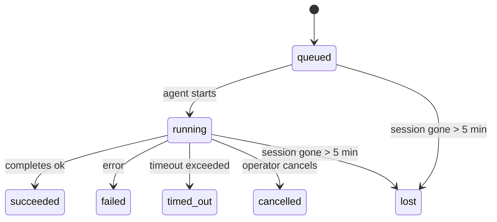

---
read_when:
    - การตรวจสอบงานเบื้องหลังที่กำลังดำเนินอยู่หรือเพิ่งเสร็จสิ้น
    - การดีบักความล้มเหลวในการส่งสำหรับการรันเอเจนต์แบบแยกออก
    - ทำความเข้าใจว่าการทำงานเบื้องหลังเกี่ยวข้องกับเซสชัน, Cron และ Heartbeat อย่างไร
sidebarTitle: Background tasks
summary: การติดตามงานเบื้องหลังสำหรับการรัน ACP, ตัวแทนย่อย, งาน Cron แบบแยกส่วน, และการดำเนินการ CLI
title: งานเบื้องหลัง
x-i18n:
    generated_at: "2026-04-30T16:27:53Z"
    model: gpt-5.5
    provider: openai
    source_hash: 999653c9360323d5135e33193c76458cba8c288227de46a6217f1ccbed2a6d34
    source_path: automation/tasks.md
    workflow: 16
---

<Note>
กำลังมองหาการตั้งเวลาใช่ไหม ดู [ระบบอัตโนมัติและงาน](/th/automation) เพื่อเลือกกลไกที่เหมาะสม หน้านี้คือบัญชีกิจกรรมสำหรับงานเบื้องหลัง ไม่ใช่ตัวตั้งเวลา
</Note>

งานเบื้องหลังติดตามงานที่ทำงาน **นอกเซสชันการสนทนาหลักของคุณ**: การรัน ACP, การสร้างเอเจนต์ย่อย, การดำเนินงาน Cron แบบแยก, และการดำเนินการที่เริ่มจาก CLI

งาน **ไม่ได้** มาแทนเซสชัน, งาน Cron หรือ Heartbeat — งานคือ **บัญชีกิจกรรม** ที่บันทึกว่างานที่แยกออกไปเกิดอะไรขึ้น เมื่อใด และสำเร็จหรือไม่

<Note>
ไม่ใช่ทุกการรันเอเจนต์ที่จะสร้างงาน เทิร์นของ Heartbeat และแชตโต้ตอบปกติจะไม่สร้าง การดำเนิน Cron ทั้งหมด, การสร้าง ACP, การสร้างเอเจนต์ย่อย, และคำสั่งเอเจนต์จาก CLI จะสร้างงาน
</Note>

## สรุปสั้น

- งานคือ **ระเบียน** ไม่ใช่ตัวตั้งเวลา — Cron และ Heartbeat ตัดสินใจว่า _เมื่อใด_ งานจะรัน ส่วนงานติดตามว่า _เกิดอะไรขึ้น_
- ACP, เอเจนต์ย่อย, งาน Cron ทั้งหมด, และการดำเนินการ CLI สร้างงาน เทิร์นของ Heartbeat ไม่สร้าง
- งานแต่ละงานจะเคลื่อนผ่าน `queued → running → terminal` (succeeded, failed, timed_out, cancelled หรือ lost)
- งาน Cron จะยังคงมีสถานะ live ขณะที่รันไทม์ Cron ยังเป็นเจ้าของงานอยู่ ถ้า
  สถานะรันไทม์ในหน่วยความจำหายไป การบำรุงรักษางานจะตรวจสอบประวัติการรัน Cron
  แบบคงทนก่อนทำเครื่องหมายว่างานสูญหาย
- การเสร็จสิ้นขับเคลื่อนด้วยการ push: งานที่แยกออกไปสามารถแจ้งโดยตรงหรือปลุก
  เซสชัน/Heartbeat ของผู้ร้องขอเมื่อทำงานเสร็จ ดังนั้นลูป polling สถานะ
  มักไม่ใช่รูปแบบที่เหมาะสม
- การรัน Cron แบบแยกและการเสร็จสิ้นของเอเจนต์ย่อยจะพยายามล้างแท็บ/โปรเซสเบราว์เซอร์ที่ติดตามไว้สำหรับเซสชันลูกก่อนทำบัญชีล้างขั้นสุดท้าย
- การส่งมอบ Cron แบบแยกจะระงับการตอบกลับชั่วคราวของพาเรนต์ที่เก่าแล้ว ขณะที่งานเอเจนต์ย่อยรุ่นถัดลงไปยังคงกำลังระบายอยู่ และจะเลือกเอาต์พุตสุดท้ายจากรุ่นถัดลงไปเมื่อเอาต์พุตนั้นมาถึงก่อนการส่งมอบ
- การแจ้งเตือนการเสร็จสิ้นจะถูกส่งตรงไปยังช่องทางหรือเข้าคิวไว้สำหรับ Heartbeat ครั้งถัดไป
- `openclaw tasks list` แสดงงานทั้งหมด; `openclaw tasks audit` แสดงปัญหา
- ระเบียน terminal จะถูกเก็บไว้ 7 วัน แล้วจึงถูกล้างโดยอัตโนมัติ

## เริ่มต้นอย่างรวดเร็ว

<Tabs>
  <Tab title="แสดงรายการและกรอง">
    ```bash
    # List all tasks (newest first)
    openclaw tasks list

    # Filter by runtime or status
    openclaw tasks list --runtime acp
    openclaw tasks list --status running
    ```

  </Tab>
  <Tab title="ตรวจสอบ">
    ```bash
    # Show details for a specific task (by ID, run ID, or session key)
    openclaw tasks show <lookup>
    ```
  </Tab>
  <Tab title="ยกเลิกและแจ้งเตือน">
    ```bash
    # Cancel a running task (kills the child session)
    openclaw tasks cancel <lookup>

    # Change notification policy for a task
    openclaw tasks notify <lookup> state_changes
    ```

  </Tab>
  <Tab title="ตรวจสอบและบำรุงรักษา">
    ```bash
    # Run a health audit
    openclaw tasks audit

    # Preview or apply maintenance
    openclaw tasks maintenance
    openclaw tasks maintenance --apply
    ```

  </Tab>
  <Tab title="โฟลว์งาน">
    ```bash
    # Inspect TaskFlow state
    openclaw tasks flow list
    openclaw tasks flow show <lookup>
    openclaw tasks flow cancel <lookup>
    ```
  </Tab>
</Tabs>

## อะไรสร้างงาน

| แหล่งที่มา                 | ประเภทรันไทม์ | เมื่อมีการสร้างระเบียนงาน                          | นโยบายแจ้งเตือนเริ่มต้น |
| ---------------------- | ------------ | ------------------------------------------------------ | --------------------- |
| การรัน ACP เบื้องหลัง    | `acp`        | การสร้างเซสชัน ACP ลูก                           | `done_only`           |
| การจัดการเอเจนต์ย่อย | `subagent`   | การสร้างเอเจนต์ย่อยผ่าน `sessions_spawn`               | `done_only`           |
| งาน Cron (ทุกประเภท)  | `cron`       | การดำเนิน Cron ทุกครั้ง (เซสชันหลักและแบบแยก)       | `silent`              |
| การดำเนินการ CLI         | `cli`        | คำสั่ง `openclaw agent` ที่รันผ่าน Gateway | `silent`              |
| งานสื่อของเอเจนต์       | `cli`        | การรัน `video_generate` ที่มีเซสชันรองรับ                   | `silent`              |

<AccordionGroup>
  <Accordion title="ค่าเริ่มต้นการแจ้งเตือนสำหรับ Cron และสื่อ">
    งาน Cron ในเซสชันหลักใช้นโยบายแจ้งเตือน `silent` เป็นค่าเริ่มต้น — งานเหล่านี้สร้างระเบียนสำหรับติดตามแต่ไม่สร้างการแจ้งเตือน งาน Cron แบบแยกก็ใช้ค่าเริ่มต้นเป็น `silent` เช่นกัน แต่เห็นได้ชัดกว่าเพราะรันในเซสชันของตัวเอง

    การรัน `video_generate` ที่มีเซสชันรองรับก็ใช้นโยบายแจ้งเตือน `silent` เช่นกัน งานเหล่านี้ยังคงสร้างระเบียนงาน แต่การเสร็จสิ้นจะถูกส่งกลับไปยังเซสชันเอเจนต์ต้นทางในรูปแบบการปลุกภายใน เพื่อให้เอเจนต์เขียนข้อความติดตามผลและแนบวิดีโอที่เสร็จแล้วเองได้ หากคุณเลือกใช้ `tools.media.asyncCompletion.directSend` การเสร็จสิ้นแบบ async ของ `music_generate` และ `video_generate` จะพยายามส่งตรงไปยังช่องทางก่อน แล้วจึง fallback ไปยังเส้นทางปลุกเซสชันของผู้ร้องขอ

  </Accordion>
  <Accordion title="ราวกันตกสำหรับ video_generate พร้อมกัน">
    ขณะที่งาน `video_generate` ที่มีเซสชันรองรับยังทำงานอยู่ เครื่องมือนี้ยังทำหน้าที่เป็นราวกันตกด้วย: การเรียก `video_generate` ซ้ำในเซสชันเดียวกันจะคืนสถานะงานที่กำลังทำงานอยู่แทนที่จะเริ่มการสร้างพร้อมกันครั้งที่สอง ใช้ `action: "status"` เมื่อคุณต้องการค้นหาความคืบหน้า/สถานะอย่างชัดเจนจากฝั่งเอเจนต์
  </Accordion>
  <Accordion title="อะไรไม่สร้างงาน">
    - เทิร์นของ Heartbeat — เซสชันหลัก; ดู [Heartbeat](/th/gateway/heartbeat)
    - เทิร์นแชตโต้ตอบปกติ
    - การตอบกลับ `/command` โดยตรง

  </Accordion>
</AccordionGroup>

## วงจรชีวิตของงาน



| สถานะ      | ความหมาย                                                              |
| ----------- | -------------------------------------------------------------------------- |
| `queued`    | สร้างแล้ว กำลังรอให้เอเจนต์เริ่ม                                    |
| `running`   | เทิร์นของเอเจนต์กำลังดำเนินการอยู่                                           |
| `succeeded` | เสร็จสมบูรณ์สำเร็จ                                                     |
| `failed`    | เสร็จสมบูรณ์พร้อมข้อผิดพลาด                                                    |
| `timed_out` | เกินเวลาหมดอายุที่กำหนดไว้                                            |
| `cancelled` | ถูกหยุดโดยผู้ปฏิบัติงานผ่าน `openclaw tasks cancel`                        |
| `lost`      | รันไทม์สูญเสียสถานะสนับสนุนที่เป็นแหล่งอ้างอิงหลังช่วงผ่อนผัน 5 นาที |

การเปลี่ยนสถานะเกิดขึ้นโดยอัตโนมัติ — เมื่อการรันเอเจนต์ที่เกี่ยวข้องจบลง สถานะงานจะอัปเดตให้ตรงกัน

การเสร็จสิ้นของการรันเอเจนต์เป็นแหล่งอ้างอิงสำหรับระเบียนงานที่ active อยู่ การรันที่แยกออกไปและสำเร็จจะ finalize เป็น `succeeded`, ข้อผิดพลาดการรันทั่วไปจะ finalize เป็น `failed`, และผลลัพธ์ timeout หรือ abort จะ finalize เป็น `timed_out` หากผู้ปฏิบัติงานยกเลิกงานไปแล้ว หรือรันไทม์บันทึกสถานะ terminal ที่แรงกว่าไว้แล้ว เช่น `failed`, `timed_out` หรือ `lost` สัญญาณความสำเร็จที่มาภายหลังจะไม่ลดระดับสถานะ terminal นั้น

`lost` รับรู้ตามรันไทม์:

- งาน ACP: เมตาดาต้าเซสชัน ACP ลูกที่รองรับหายไป
- งานเอเจนต์ย่อย: เซสชันลูกที่รองรับหายไปจากสโตร์เอเจนต์เป้าหมาย
- งาน Cron: รันไทม์ Cron ไม่ติดตามงานว่า active อีกต่อไป และประวัติ
  การรัน Cron แบบคงทนไม่แสดงผลลัพธ์ terminal สำหรับการรันนั้น การตรวจสอบ
  CLI แบบออฟไลน์จะไม่ถือว่าสถานะรันไทม์ Cron ในโปรเซสของตัวเองที่ว่างเปล่าเป็นแหล่งอ้างอิง
- งาน CLI: งานเซสชันลูกแบบแยกใช้เซสชันลูก ส่วนงาน CLI
  ที่มีแชตรองรับใช้บริบทการรันสดแทน ดังนั้นแถวเซสชัน
  channel/group/direct ที่ค้างอยู่จะไม่ทำให้งานยัง active งานรัน
  `openclaw agent` ที่มี Gateway รองรับยัง finalize จากผลลัพธ์การรันด้วย ดังนั้นการรันที่เสร็จแล้ว
  จะไม่ค้าง active จนกว่า sweeper จะทำเครื่องหมายเป็น `lost`

## การส่งมอบและการแจ้งเตือน

เมื่องานเข้าสู่สถานะ terminal OpenClaw จะแจ้งคุณ มีเส้นทางส่งมอบสองแบบ:

**การส่งมอบโดยตรง** — หากงานมีเป้าหมายช่องทาง (`requesterOrigin`) ข้อความเสร็จสิ้นจะไปยังช่องทางนั้นโดยตรง (Telegram, Discord, Slack ฯลฯ) สำหรับการเสร็จสิ้นของเอเจนต์ย่อย OpenClaw ยังรักษา routing ของเธรด/หัวข้อที่ผูกไว้เมื่อมี และสามารถเติม `to` / บัญชีที่หายไปจากเส้นทางที่เก็บไว้ของเซสชันผู้ร้องขอ (`lastChannel` / `lastTo` / `lastAccountId`) ก่อนยอมแพ้กับการส่งมอบโดยตรง

**การส่งมอบแบบเข้าคิวในเซสชัน** — หากการส่งมอบโดยตรงล้มเหลวหรือไม่ได้ตั้ง origin ไว้ การอัปเดตจะถูกเข้าคิวเป็นเหตุการณ์ระบบในเซสชันของผู้ร้องขอ และแสดงใน Heartbeat ถัดไป

<Tip>
การเสร็จสิ้นของงานจะทริกเกอร์การปลุก Heartbeat ทันที คุณจึงเห็นผลลัพธ์ได้อย่างรวดเร็ว — ไม่ต้องรอ tick ของ Heartbeat ตามกำหนดการครั้งถัดไป
</Tip>

นั่นหมายความว่า workflow ปกติเป็นแบบ push-based: เริ่มงานที่แยกออกไปหนึ่งครั้ง แล้วให้รันไทม์ปลุกหรือแจ้งคุณเมื่อเสร็จสิ้น ควร poll สถานะงานเฉพาะเมื่อคุณต้อง debug, แทรกแซง หรือทำ audit อย่างชัดเจนเท่านั้น

### นโยบายการแจ้งเตือน

ควบคุมว่าคุณจะได้ยินเกี่ยวกับแต่ละงานมากน้อยเพียงใด:

| นโยบาย                | สิ่งที่ถูกส่งมอบ                                                       |
| --------------------- | ----------------------------------------------------------------------- |
| `done_only` (ค่าเริ่มต้น) | เฉพาะสถานะ terminal (succeeded, failed ฯลฯ) — **นี่คือค่าเริ่มต้น** |
| `state_changes`       | ทุกการเปลี่ยนสถานะและการอัปเดตความคืบหน้า                              |
| `silent`              | ไม่มีอะไรเลย                                                          |

เปลี่ยนนโยบายขณะที่งานกำลังรัน:

```bash
openclaw tasks notify <lookup> state_changes
```

## อ้างอิง CLI

<AccordionGroup>
  <Accordion title="tasks list">
    ```bash
    openclaw tasks list [--runtime <acp|subagent|cron|cli>] [--status <status>] [--json]
    ```

    คอลัมน์เอาต์พุต: Task ID, Kind, Status, Delivery, Run ID, Child Session, Summary

  </Accordion>
  <Accordion title="tasks show">
    ```bash
    openclaw tasks show <lookup>
    ```

    โทเค็น lookup รับ ID งาน, ID การรัน หรือคีย์เซสชัน แสดงระเบียนเต็ม รวมถึงเวลา, สถานะการส่งมอบ, ข้อผิดพลาด และสรุป terminal

  </Accordion>
  <Accordion title="tasks cancel">
    ```bash
    openclaw tasks cancel <lookup>
    ```

    สำหรับงาน ACP และเอเจนต์ย่อย คำสั่งนี้จะ kill เซสชันลูก สำหรับงานที่ CLI ติดตาม การยกเลิกจะถูกบันทึกใน registry งาน (ไม่มี handle รันไทม์ลูกแยกต่างหาก) สถานะจะเปลี่ยนเป็น `cancelled` และส่งการแจ้งเตือนการส่งมอบเมื่อมีผลใช้ได้

  </Accordion>
  <Accordion title="tasks notify">
    ```bash
    openclaw tasks notify <lookup> <done_only|state_changes|silent>
    ```
  </Accordion>
  <Accordion title="tasks audit">
    ```bash
    openclaw tasks audit [--json]
    ```

    แสดงปัญหาการปฏิบัติงาน Findings จะปรากฏใน `openclaw status` ด้วยเมื่อตรวจพบปัญหา

    | รายการที่พบ               | ความรุนแรง | ตัวกระตุ้น                                                                                                      |
    | ------------------------- | ---------- | ------------------------------------------------------------------------------------------------------------ |
    | `stale_queued`            | เตือน      | เข้าคิวมานานกว่า 10 นาที                                                                              |
    | `stale_running`           | ข้อผิดพลาด | กำลังทำงานมานานกว่า 30 นาที                                                                             |
    | `lost`                    | เตือน/ข้อผิดพลาด | ความเป็นเจ้าของงานที่มีรันไทม์รองรับหายไป; งานที่หายไปซึ่งถูกเก็บไว้จะแจ้งเตือนจนถึง `cleanupAfter` จากนั้นจะกลายเป็นข้อผิดพลาด |
    | `delivery_failed`         | เตือน      | การส่งล้มเหลวและนโยบายการแจ้งเตือนไม่ใช่ `silent`                                                            |
    | `missing_cleanup`         | เตือน      | งานสิ้นสุดแล้วแต่ไม่มีประทับเวลาการล้างข้อมูล                                                                      |
    | `inconsistent_timestamps` | เตือน      | ละเมิดลำดับเวลา (เช่น สิ้นสุดก่อนเริ่มต้น)                                                        |

  </Accordion>
  <Accordion title="การบำรุงรักษา tasks">
    ```bash
    openclaw tasks maintenance [--json]
    openclaw tasks maintenance --apply [--json]
    ```

    ใช้สิ่งนี้เพื่อแสดงตัวอย่างหรือใช้การกระทบยอด การประทับเวลาการล้างข้อมูล และการตัดทอนสำหรับงานและสถานะ Task Flow

    การกระทบยอดรับรู้รันไทม์:

    - งาน ACP/subagent จะตรวจสอบเซสชันลูกที่รองรับงานนั้น
    - งาน Subagent ที่เซสชันลูกมี tombstone สำหรับการกู้คืนหลังรีสตาร์ตจะถูกทำเครื่องหมายว่าสูญหาย แทนที่จะถือว่าเป็นเซสชันรองรับที่กู้คืนได้
    - งาน Cron จะตรวจสอบว่ารันไทม์ cron ยังเป็นเจ้าของงานอยู่หรือไม่ จากนั้นกู้คืนสถานะสิ้นสุดจากบันทึกการรัน cron/สถานะงานที่คงอยู่ ก่อนจะถอยกลับเป็น `lost` เฉพาะกระบวนการ Gateway เท่านั้นที่เป็นแหล่งข้อมูลที่เชื่อถือได้สำหรับชุดงานที่กำลังทำงานของ cron ในหน่วยความจำ; การตรวจสอบ CLI แบบออฟไลน์ใช้ประวัติที่คงอยู่ แต่จะไม่ทำเครื่องหมายงาน cron ว่าสูญหายเพียงเพราะ Set ภายในเครื่องนั้นว่าง
    - งาน CLI ที่มีแชตรองรับจะตรวจสอบบริบทการรันสดที่เป็นเจ้าของ ไม่ใช่แค่แถวเซสชันแชต

    การล้างข้อมูลเมื่อเสร็จสิ้นก็รับรู้รันไทม์เช่นกัน:

    - การเสร็จสิ้นของ Subagent จะพยายามปิดแท็บเบราว์เซอร์/กระบวนการที่ติดตามไว้สำหรับเซสชันลูกแบบ best-effort ก่อนที่การล้างข้อมูลการประกาศจะดำเนินต่อ
    - การเสร็จสิ้นของ cron แบบแยกเดี่ยวจะพยายามปิดแท็บเบราว์เซอร์/กระบวนการที่ติดตามไว้สำหรับเซสชัน cron แบบ best-effort ก่อนที่การรันจะถูกรื้อถอนทั้งหมด
    - การส่งของ cron แบบแยกเดี่ยวจะรอการติดตามผลของ subagent ลูกหลานเมื่อจำเป็น และระงับข้อความยืนยันของแม่ที่ล้าสมัยแทนการประกาศข้อความนั้น
    - การส่งเมื่อ Subagent เสร็จสิ้นจะเลือกข้อความ assistant ล่าสุดที่มองเห็นได้ก่อน; หากข้อความนั้นว่าง จะถอยกลับไปใช้ข้อความ tool/toolResult ล่าสุดที่ผ่านการทำความสะอาดแล้ว และการรัน tool-call ที่หมดเวลาเท่านั้นอาจยุบเป็นสรุปความคืบหน้าบางส่วนแบบสั้น การรันที่ล้มเหลวและสิ้นสุดแล้วจะประกาศสถานะความล้มเหลวโดยไม่เล่นซ้ำข้อความตอบกลับที่จับไว้
    - ความล้มเหลวในการล้างข้อมูลจะไม่บดบังผลลัพธ์ที่แท้จริงของงาน

  </Accordion>
  <Accordion title="รายการ | แสดง | ยกเลิก tasks flow">
    ```bash
    openclaw tasks flow list [--status <status>] [--json]
    openclaw tasks flow show <lookup> [--json]
    openclaw tasks flow cancel <lookup>
    ```

    ใช้คำสั่งเหล่านี้เมื่อ Task Flow ที่ทำหน้าที่จัดลำดับงานคือสิ่งที่คุณสนใจ แทนที่จะเป็นระเบียนงานเบื้องหลังรายการใดรายการหนึ่ง

  </Accordion>
</AccordionGroup>

## กระดานงานแชต (`/tasks`)

ใช้ `/tasks` ในเซสชันแชตใดก็ได้เพื่อดูงานเบื้องหลังที่เชื่อมโยงกับเซสชันนั้น กระดานจะแสดงงานที่กำลังทำงานอยู่และงานที่เพิ่งเสร็จสิ้น พร้อมรายละเอียดรันไทม์ สถานะ เวลา และความคืบหน้าหรือข้อผิดพลาด

เมื่อเซสชันปัจจุบันไม่มีงานที่เชื่อมโยงซึ่งมองเห็นได้ `/tasks` จะถอยกลับไปใช้จำนวนงานภายใน agent เพื่อให้คุณยังเห็นภาพรวมได้โดยไม่รั่วไหลรายละเอียดของเซสชันอื่น

สำหรับบัญชีแยกประเภทสำหรับผู้ปฏิบัติการแบบเต็ม ให้ใช้ CLI: `openclaw tasks list`

## การผสานสถานะ (แรงกดดันของงาน)

`openclaw status` มีสรุปงานแบบดูได้ทันที:

```
Tasks: 3 queued · 2 running · 1 issues
```

สรุปนี้รายงาน:

- **active** — จำนวนของ `queued` + `running`
- **failures** — จำนวนของ `failed` + `timed_out` + `lost`
- **byRuntime** — การแจกแจงตาม `acp`, `subagent`, `cron`, `cli`

ทั้ง `/status` และเครื่องมือ `session_status` ใช้สแนปช็อตงานที่รับรู้การล้างข้อมูล: งานที่กำลังทำงานจะถูกให้ความสำคัญ แถวที่เสร็จสิ้นแล้วซึ่งล้าสมัยจะถูกซ่อน และความล้มเหลวล่าสุดจะแสดงเฉพาะเมื่อไม่มีงานที่กำลังทำงานเหลืออยู่ สิ่งนี้ช่วยให้การ์ดสถานะโฟกัสกับสิ่งที่สำคัญในตอนนี้

## พื้นที่จัดเก็บและการบำรุงรักษา

### ตำแหน่งที่งานอยู่

ระเบียนงานคงอยู่ใน SQLite ที่:

```
$OPENCLAW_STATE_DIR/tasks/runs.sqlite
```

รีจิสทรีโหลดเข้าสู่หน่วยความจำเมื่อ Gateway เริ่ม และซิงค์การเขียนไปยัง SQLite เพื่อให้คงทนข้ามการรีสตาร์ต
Gateway จำกัดขนาด write-ahead log ของ SQLite โดยใช้เกณฑ์ autocheckpoint เริ่มต้นของ SQLite
ร่วมกับ checkpoint แบบ `TRUNCATE` เป็นระยะและเมื่อปิดระบบ

### การบำรุงรักษาอัตโนมัติ

ตัวกวาดจะทำงานทุก **60 วินาที** และจัดการสี่อย่าง:

<Steps>
  <Step title="การกระทบยอด">
    ตรวจสอบว่างานที่กำลังทำงานยังมีรันไทม์ที่เชื่อถือได้รองรับอยู่หรือไม่ งาน ACP/subagent ใช้สถานะเซสชันลูก งาน cron ใช้ความเป็นเจ้าของงานที่กำลังทำงาน และงาน CLI ที่มีแชตรองรับใช้บริบทการรันที่เป็นเจ้าของ หากสถานะรองรับนั้นหายไปนานกว่า 5 นาที งานจะถูกทำเครื่องหมายเป็น `lost`
  </Step>
  <Step title="การซ่อมแซมเซสชัน ACP">
    ปิดเซสชัน ACP แบบครั้งเดียวที่สิ้นสุดแล้วหรือกำพร้าแต่มีแม่เป็นเจ้าของ และปิดเซสชัน ACP แบบถาวรที่สิ้นสุดแล้วหรือล้าสมัยแบบกำพร้าเฉพาะเมื่อไม่มีการผูกการสนทนาที่กำลังทำงานเหลืออยู่
  </Step>
  <Step title="การประทับเวลาการล้างข้อมูล">
    ตั้งประทับเวลา `cleanupAfter` บนงานที่สิ้นสุดแล้ว (endedAt + 7 วัน) ระหว่างช่วงเก็บรักษา งานที่สูญหายยังปรากฏในการตรวจสอบเป็นคำเตือน; หลังจาก `cleanupAfter` หมดอายุหรือเมื่อเมทาดาทาการล้างข้อมูลหายไป งานเหล่านั้นจะเป็นข้อผิดพลาด
  </Step>
  <Step title="การตัดทอน">
    ลบระเบียนที่เลยวันที่ `cleanupAfter` ของตน
  </Step>
</Steps>

<Note>
**การเก็บรักษา:** ระเบียนงานที่สิ้นสุดแล้วจะถูกเก็บไว้ **7 วัน** จากนั้นจึงถูกตัดทอนโดยอัตโนมัติ ไม่ต้องกำหนดค่า
</Note>

## งานเกี่ยวข้องกับระบบอื่นอย่างไร

<AccordionGroup>
  <Accordion title="งานและ Task Flow">
    [Task Flow](/th/automation/taskflow) คือชั้นจัดลำดับโฟลว์เหนือกว่างานเบื้องหลัง โฟลว์เดียวอาจประสานงานหลายงานตลอดอายุของมันโดยใช้โหมดซิงค์แบบจัดการหรือแบบสะท้อน ใช้ `openclaw tasks` เพื่อตรวจสอบระเบียนงานแต่ละรายการ และ `openclaw tasks flow` เพื่อตรวจสอบโฟลว์ที่จัดลำดับงาน

    ดูรายละเอียดที่ [Task Flow](/th/automation/taskflow)

  </Accordion>
  <Accordion title="งานและ cron">
    **นิยาม** งาน cron อยู่ใน `~/.openclaw/cron/jobs.json`; สถานะการดำเนินการรันไทม์อยู่ข้างกันใน `~/.openclaw/cron/jobs-state.json` การดำเนินการ cron **ทุกครั้ง** จะสร้างระเบียนงาน ทั้งแบบเซสชันหลักและแบบแยกเดี่ยว งาน cron ในเซสชันหลักมีนโยบายการแจ้งเตือนเริ่มต้นเป็น `silent` เพื่อให้ติดตามได้โดยไม่สร้างการแจ้งเตือน

    ดู [งาน Cron](/th/automation/cron-jobs)

  </Accordion>
  <Accordion title="งานและ heartbeat">
    การรัน Heartbeat เป็นเทิร์นของเซสชันหลัก โดยจะไม่สร้างระเบียนงาน เมื่องานเสร็จสิ้น งานนั้นสามารถกระตุ้นการปลุก Heartbeat เพื่อให้คุณเห็นผลลัพธ์อย่างรวดเร็ว

    ดู [Heartbeat](/th/gateway/heartbeat)

  </Accordion>
  <Accordion title="งานและเซสชัน">
    งานอาจอ้างอิง `childSessionKey` (ตำแหน่งที่งานรัน) และ `requesterSessionKey` (ผู้ที่เริ่มงาน) เซสชันคือบริบทการสนทนา; งานคือการติดตามกิจกรรมที่อยู่ด้านบนของสิ่งนั้น
  </Accordion>
  <Accordion title="งานและการรัน agent">
    `runId` ของงานจะเชื่อมโยงกับการรัน agent ที่กำลังทำงาน เหตุการณ์วงจรชีวิตของ agent (เริ่มต้น สิ้นสุด ข้อผิดพลาด) จะอัปเดตสถานะงานโดยอัตโนมัติ คุณไม่จำเป็นต้องจัดการวงจรชีวิตด้วยตนเอง
  </Accordion>
</AccordionGroup>

## ที่เกี่ยวข้อง

- [ระบบอัตโนมัติและงาน](/th/automation) — กลไกระบบอัตโนมัติทั้งหมดโดยสรุป
- [CLI: งาน](/th/cli/tasks) — เอกสารอ้างอิงคำสั่ง CLI
- [Heartbeat](/th/gateway/heartbeat) — เทิร์นเซสชันหลักเป็นระยะ
- [งานตามกำหนดเวลา](/th/automation/cron-jobs) — การจัดกำหนดการงานเบื้องหลัง
- [Task Flow](/th/automation/taskflow) — การจัดลำดับโฟลว์เหนือกว่างาน
