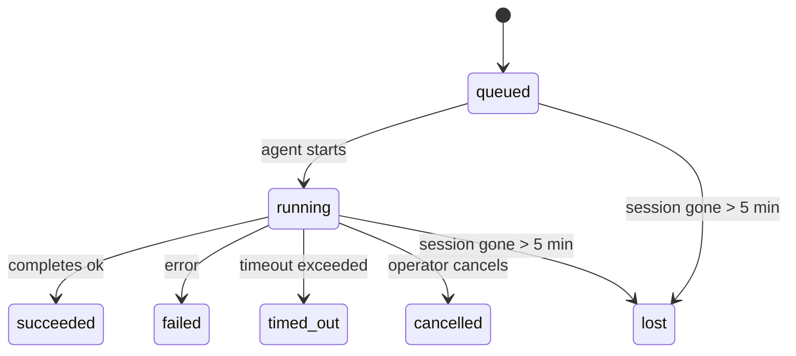

---
read_when:
    - การตรวจสอบงานเบื้องหลังที่กำลังดำเนินการอยู่หรือเพิ่งเสร็จสิ้น
    - การดีบักความล้มเหลวในการส่งสำหรับการรันเอเจนต์แบบแยกออก
    - ทำความเข้าใจว่าการรันเบื้องหลังสัมพันธ์กับเซสชัน, Cron และ Heartbeat อย่างไร
sidebarTitle: Background tasks
summary: การติดตามงานเบื้องหลังสำหรับการรัน ACP, เอเจนต์ย่อย, งาน Cron แบบแยก, และการดำเนินการ CLI
title: งานเบื้องหลัง
x-i18n:
    generated_at: "2026-05-05T06:16:18Z"
    model: gpt-5.5
    provider: openai
    source_hash: bafd959feaf2e220820ec56bf1ef144207d05757418e9971ebf427844cf30c46
    source_path: automation/tasks.md
    workflow: 16
---

<Note>
กำลังมองหาการกำหนดเวลาอยู่ใช่ไหม? ดู [ระบบอัตโนมัติและงาน](/th/automation) เพื่อเลือกกลไกที่เหมาะสม หน้านี้คือบัญชีแยกประเภทกิจกรรมสำหรับงานเบื้องหลัง ไม่ใช่ตัวกำหนดเวลา
</Note>

งานเบื้องหลังติดตามงานที่ทำงาน **นอกเซสชันการสนทนาหลักของคุณ**: การรัน ACP, การสร้าง subagent, การดำเนินงาน cron job แบบแยก, และการดำเนินการที่เริ่มจาก CLI

งาน **ไม่ได้** แทนที่เซสชัน, cron job, หรือ Heartbeat — งานคือ **บัญชีแยกประเภทกิจกรรม** ที่บันทึกว่างานแบบแยกใดเกิดขึ้น เมื่อใด และสำเร็จหรือไม่

<Note>
ไม่ใช่การรัน agent ทุกครั้งที่จะสร้างงาน เทิร์น Heartbeat และแชตโต้ตอบปกติจะไม่สร้าง การดำเนินการ cron ทั้งหมด, การสร้าง ACP, การสร้าง subagent, และคำสั่ง CLI agent จะสร้างงาน
</Note>

## สรุปสั้นๆ

- งานคือ **ระเบียน** ไม่ใช่ตัวกำหนดเวลา — cron และ Heartbeat ตัดสินใจว่า _เมื่อใด_ งานจะทำงาน ส่วนงานติดตามว่า _เกิดอะไรขึ้น_
- ACP, subagent, cron job ทั้งหมด, และการดำเนินการ CLI จะสร้างงาน เทิร์น Heartbeat จะไม่สร้าง
- แต่ละงานจะเคลื่อนผ่าน `queued → running → terminal` (succeeded, failed, timed_out, cancelled, หรือ lost)
- งาน cron จะยังคงใช้งานอยู่ขณะที่รันไทม์ cron ยังเป็นเจ้าของ job นั้นอยู่; หากสถานะรันไทม์ในหน่วยความจำหายไป การบำรุงรักษางานจะตรวจสอบประวัติการรัน cron แบบคงทนก่อน แล้วจึงทำเครื่องหมายงานว่า lost
- การเสร็จสิ้นขับเคลื่อนด้วยการ push: งานแบบแยกสามารถแจ้งโดยตรงหรือปลุกเซสชัน/Heartbeat ของผู้ร้องขอเมื่อเสร็จสิ้น ดังนั้นลูป polling สถานะจึงมักไม่ใช่รูปแบบที่ถูกต้อง
- การรัน cron แบบแยกและการเสร็จสิ้นของ subagent จะพยายามล้างแท็บเบราว์เซอร์/โปรเซสที่ติดตามไว้สำหรับเซสชันลูกของมันอย่างดีที่สุดก่อนทำ bookkeeping การล้างขั้นสุดท้าย
- การส่งมอบ cron แบบแยกจะระงับคำตอบระหว่างทางของ parent ที่เก่าแล้วขณะที่งาน descendant subagent ยังคงกำลังระบายออก และจะเลือกเอาต์พุตสุดท้ายของ descendant เมื่อเอาต์พุตนั้นมาถึงก่อนการส่งมอบ
- การแจ้งเตือนการเสร็จสิ้นจะถูกส่งตรงไปยังช่องทางหรือจัดคิวไว้สำหรับ Heartbeat ถัดไป
- `openclaw tasks list` แสดงงานทั้งหมด; `openclaw tasks audit` แสดงปัญหา
- ระเบียน terminal จะถูกเก็บไว้ 7 วัน แล้วจึงถูก prune โดยอัตโนมัติ

## เริ่มต้นอย่างรวดเร็ว

<Tabs>
  <Tab title="แสดงรายการและกรอง">
    ```bash
    # List all tasks (newest first)
    openclaw tasks list

    # Filter by runtime or status
    openclaw tasks list --runtime acp
    openclaw tasks list --status running
    ```

  </Tab>
  <Tab title="ตรวจสอบ">
    ```bash
    # Show details for a specific task (by ID, run ID, or session key)
    openclaw tasks show <lookup>
    ```
  </Tab>
  <Tab title="ยกเลิกและแจ้งเตือน">
    ```bash
    # Cancel a running task (kills the child session)
    openclaw tasks cancel <lookup>

    # Change notification policy for a task
    openclaw tasks notify <lookup> state_changes
    ```

  </Tab>
  <Tab title="ตรวจสอบและบำรุงรักษา">
    ```bash
    # Run a health audit
    openclaw tasks audit

    # Preview or apply maintenance
    openclaw tasks maintenance
    openclaw tasks maintenance --apply
    ```

  </Tab>
  <Tab title="โฟลว์งาน">
    ```bash
    # Inspect TaskFlow state
    openclaw tasks flow list
    openclaw tasks flow show <lookup>
    openclaw tasks flow cancel <lookup>
    ```
  </Tab>
</Tabs>

## อะไรสร้างงาน

| แหล่งที่มา                 | ประเภท runtime | เมื่อใดที่ระเบียนงานถูกสร้าง                          | นโยบาย notify เริ่มต้น |
| ---------------------- | ------------ | ------------------------------------------------------ | --------------------- |
| การรัน ACP เบื้องหลัง    | `acp`        | การสร้างเซสชัน ACP ลูก                           | `done_only`           |
| การประสานงาน subagent | `subagent`   | การสร้าง subagent ผ่าน `sessions_spawn`               | `done_only`           |
| Cron job (ทุกประเภท)  | `cron`       | ทุกการดำเนินการ cron (main-session และ isolated)       | `silent`              |
| การดำเนินการ CLI         | `cli`        | คำสั่ง `openclaw agent` ที่รันผ่าน Gateway | `silent`              |
| งานสื่อของ agent       | `cli`        | การรัน `music_generate`/`video_generate` ที่มีเซสชันรองรับ  | `silent`              |

<AccordionGroup>
  <Accordion title="ค่าเริ่มต้นของ notify สำหรับ cron และสื่อ">
    งาน cron แบบ main-session ใช้นโยบาย notify เป็น `silent` โดยค่าเริ่มต้น — งานเหล่านี้สร้างระเบียนสำหรับติดตาม แต่ไม่สร้างการแจ้งเตือน งาน cron แบบ isolated ก็มีค่าเริ่มต้นเป็น `silent` เช่นกัน แต่มองเห็นได้ชัดกว่าเพราะรันในเซสชันของตัวเอง

    การรัน `music_generate` และ `video_generate` ที่มีเซสชันรองรับก็ใช้นโยบาย notify เป็น `silent` เช่นกัน งานเหล่านี้ยังคงสร้างระเบียนงาน แต่การเสร็จสิ้นจะถูกส่งกลับไปยังเซสชัน agent เดิมในรูปแบบ internal wake เพื่อให้ agent เขียนข้อความติดตามผลและแนบสื่อที่เสร็จแล้วได้เอง การเสร็จสิ้นในกลุ่ม/ช่องทางทำตามนโยบายการตอบกลับที่มองเห็นได้ตามปกติ ดังนั้น agent จะใช้ message tool เมื่อการส่งมอบจากแหล่งที่มาต้องใช้ หาก agent สำหรับการเสร็จสิ้นไม่สามารถสร้างหลักฐานการส่งมอบด้วย message-tool ในเส้นทางแบบ tool-only ได้ OpenClaw จะส่ง completion fallback ไปยังช่องทางเดิมโดยตรงแทนที่จะปล่อยให้สื่อเป็นส่วนตัว

  </Accordion>
  <Accordion title="guardrail สำหรับ video_generate พร้อมกัน">
    ขณะที่งาน `video_generate` ที่มีเซสชันรองรับยัง active อยู่ tool นี้จะทำหน้าที่เป็น guardrail ด้วย: การเรียก `video_generate` ซ้ำในเซสชันเดียวกันนั้นจะคืนสถานะงานที่ active อยู่แทนที่จะเริ่มการสร้างพร้อมกันรายการที่สอง ใช้ `action: "status"` เมื่อต้องการดูความคืบหน้า/สถานะอย่างชัดเจนจากฝั่ง agent
  </Accordion>
  <Accordion title="อะไรไม่สร้างงาน">
    - เทิร์น Heartbeat — main-session; ดู [Heartbeat](/th/gateway/heartbeat)
    - เทิร์นแชตโต้ตอบปกติ
    - การตอบกลับ `/command` โดยตรง

  </Accordion>
</AccordionGroup>

## วงจรชีวิตของงาน



| สถานะ      | ความหมาย                                                              |
| ----------- | -------------------------------------------------------------------------- |
| `queued`    | สร้างแล้ว กำลังรอให้ agent เริ่ม                                    |
| `running`   | เทิร์นของ agent กำลังดำเนินการอยู่                                           |
| `succeeded` | เสร็จสมบูรณ์สำเร็จ                                                     |
| `failed`    | เสร็จสิ้นโดยมีข้อผิดพลาด                                                    |
| `timed_out` | เกิน timeout ที่กำหนดไว้                                            |
| `cancelled` | ถูกหยุดโดยผู้ปฏิบัติงานผ่าน `openclaw tasks cancel`                        |
| `lost`      | รันไทม์สูญเสียสถานะ backing ที่เป็นแหล่งอ้างอิงหลังช่วงผ่อนผัน 5 นาที |

การเปลี่ยนสถานะเกิดขึ้นโดยอัตโนมัติ — เมื่อการรัน agent ที่เกี่ยวข้องจบลง สถานะงานจะอัปเดตให้ตรงกัน

การเสร็จสิ้นของการรัน agent เป็นแหล่งอ้างอิงสำหรับระเบียนงานที่ active การรันแบบแยกที่สำเร็จจะ finalize เป็น `succeeded`, ข้อผิดพลาดการรันทั่วไปจะ finalize เป็น `failed`, และผลลัพธ์ timeout หรือ abort จะ finalize เป็น `timed_out` หากผู้ปฏิบัติงานยกเลิกงานไปแล้ว หรือรันไทม์บันทึกสถานะ terminal ที่แข็งแรงกว่าไว้แล้ว เช่น `failed`, `timed_out`, หรือ `lost` สัญญาณสำเร็จที่มาภายหลังจะไม่ลดระดับสถานะ terminal นั้น

`lost` รับรู้ตาม runtime:

- งาน ACP: metadata เซสชัน ACP ลูกที่เป็น backing หายไป
- งาน Subagent: เซสชันลูกที่เป็น backing หายไปจาก target agent store
- งาน Cron: รันไทม์ cron ไม่ได้ติดตาม job ว่า active อีกต่อไป และประวัติการรัน cron แบบคงทนไม่แสดงผลลัพธ์ terminal สำหรับการรันนั้น การ audit CLI แบบ offline จะไม่ถือว่าสถานะรันไทม์ cron ในโปรเซสของตัวเองที่ว่างเปล่าเป็นแหล่งอ้างอิง
- งาน CLI: งาน child-session แบบ isolated ใช้เซสชันลูก; งาน CLI ที่มีแชตรองรับใช้บริบทการรันสดแทน ดังนั้นแถวเซสชัน channel/group/direct ที่ค้างอยู่จะไม่ทำให้มันยังมีชีวิตอยู่ การรัน `openclaw agent` ที่มี Gateway รองรับจะ finalize จากผลการรันด้วย ดังนั้นการรันที่เสร็จแล้วจะไม่ค้าง active จนกว่า sweeper จะทำเครื่องหมายเป็น `lost`

## การส่งมอบและการแจ้งเตือน

เมื่องานถึงสถานะ terminal OpenClaw จะแจ้งคุณ มีเส้นทางการส่งมอบสองแบบ:

**การส่งมอบโดยตรง** — หากงานมีเป้าหมายช่องทาง (`requesterOrigin`) ข้อความการเสร็จสิ้นจะส่งตรงไปยังช่องทางนั้น (Telegram, Discord, Slack, ฯลฯ) สำหรับการเสร็จสิ้นของ subagent OpenClaw ยังรักษา routing ของ thread/topic ที่ผูกไว้เมื่อมี และสามารถเติม `to` / account ที่หายไปจาก route ที่เก็บไว้ของเซสชันผู้ร้องขอ (`lastChannel` / `lastTo` / `lastAccountId`) ก่อนจะยอมแพ้ต่อการส่งมอบโดยตรง

**การส่งมอบที่จัดคิวในเซสชัน** — หากการส่งมอบโดยตรงล้มเหลวหรือไม่ได้ตั้ง origin ไว้ การอัปเดตจะถูกจัดคิวเป็น system event ในเซสชันของผู้ร้องขอและจะแสดงใน Heartbeat ถัดไป

<Tip>
การเสร็จสิ้นของงานจะ trigger การปลุก Heartbeat ทันทีเพื่อให้คุณเห็นผลลัพธ์อย่างรวดเร็ว — คุณไม่จำเป็นต้องรอ tick Heartbeat ตามกำหนดการถัดไป
</Tip>

นั่นหมายความว่า workflow ปกติเป็นแบบ push-based: เริ่มงานแบบแยกหนึ่งครั้ง จากนั้นให้รันไทม์ปลุกหรือแจ้งคุณเมื่อเสร็จสิ้น Poll สถานะงานเฉพาะเมื่อคุณต้องการ debug, แทรกแซง, หรือ audit อย่างชัดเจนเท่านั้น

### นโยบายการแจ้งเตือน

ควบคุมว่าคุณจะได้ยินเกี่ยวกับแต่ละงานมากน้อยแค่ไหน:

| นโยบาย                | สิ่งที่ถูกส่งมอบ                                                       |
| --------------------- | ----------------------------------------------------------------------- |
| `done_only` (ค่าเริ่มต้น) | เฉพาะสถานะ terminal (succeeded, failed, ฯลฯ) — **นี่คือค่าเริ่มต้น** |
| `state_changes`       | ทุกการเปลี่ยนสถานะและการอัปเดตความคืบหน้า                              |
| `silent`              | ไม่มีอะไรเลย                                                          |

เปลี่ยนนโยบายขณะที่งานกำลังรัน:

```bash
openclaw tasks notify <lookup> state_changes
```

## อ้างอิง CLI

<AccordionGroup>
  <Accordion title="tasks list">
    ```bash
    openclaw tasks list [--runtime <acp|subagent|cron|cli>] [--status <status>] [--json]
    ```

    คอลัมน์เอาต์พุต: รหัสงาน, ชนิด, สถานะ, การส่งมอบ, รหัสการรัน, เซสชันลูก, สรุป

  </Accordion>
  <Accordion title="tasks show">
    ```bash
    openclaw tasks show <lookup>
    ```

    โทเค็น lookup รับรหัสงาน, รหัสการรัน, หรือ session key แสดงระเบียนเต็ม รวมถึงเวลา, สถานะการส่งมอบ, ข้อผิดพลาด, และสรุป terminal

  </Accordion>
  <Accordion title="tasks cancel">
    ```bash
    openclaw tasks cancel <lookup>
    ```

    สำหรับงาน ACP และ subagent คำสั่งนี้จะ kill เซสชันลูก สำหรับงานที่ CLI ติดตาม การยกเลิกจะถูกบันทึกใน task registry (ไม่มี child runtime handle แยกต่างหาก) สถานะจะเปลี่ยนเป็น `cancelled` และการแจ้งเตือนการส่งมอบจะถูกส่งเมื่อเกี่ยวข้อง

  </Accordion>
  <Accordion title="tasks notify">
    ```bash
    openclaw tasks notify <lookup> <done_only|state_changes|silent>
    ```
  </Accordion>
  <Accordion title="tasks audit">
    ```bash
    openclaw tasks audit [--json]
    ```

    แสดงปัญหาด้านการปฏิบัติการ Findings จะปรากฏใน `openclaw status` ด้วยเมื่อตรวจพบปัญหา

    | ผลการตรวจพบ               | ระดับความรุนแรง | ตัวกระตุ้น                                                                                                      |
    | ------------------------- | ---------- | ------------------------------------------------------------------------------------------------------------ |
    | `stale_queued`            | warn       | อยู่ในคิวนานกว่า 10 นาที                                                                              |
    | `stale_running`           | error      | ทำงานนานกว่า 30 นาที                                                                             |
    | `lost`                    | warn/error | ความเป็นเจ้าของงานที่มี runtime รองรับหายไป งานที่สูญหายที่เก็บไว้จะแจ้งเตือนจนถึง `cleanupAfter` แล้วจึงกลายเป็นข้อผิดพลาด |
    | `delivery_failed`         | warn       | การส่งล้มเหลวและนโยบายการแจ้งเตือนไม่ใช่ `silent`                                                            |
    | `missing_cleanup`         | warn       | งานปลายทางที่ไม่มีเวลาประทับการล้างข้อมูล                                                                      |
    | `inconsistent_timestamps` | warn       | ลำดับเวลาไม่ถูกต้อง (เช่น สิ้นสุดก่อนเริ่ม)                                                        |

  </Accordion>
  <Accordion title="tasks maintenance">
    ```bash
    openclaw tasks maintenance [--json]
    openclaw tasks maintenance --apply [--json]
    ```

    ใช้สิ่งนี้เพื่อดูตัวอย่างหรือนำการประสานข้อมูล การประทับเวลาล้างข้อมูล และการตัดแต่งสำหรับงานและสถานะ Task Flow ไปใช้

    การประสานข้อมูลรับรู้ runtime:

    - งาน ACP/subagent จะตรวจสอบเซสชันลูกที่รองรับงานนั้น
    - งาน Subagent ที่เซสชันลูกมี tombstone สำหรับการกู้คืนหลังรีสตาร์ตจะถูกทำเครื่องหมายว่าสูญหาย แทนที่จะถือว่าเป็นเซสชันรองรับที่กู้คืนได้
    - งาน Cron ตรวจสอบว่า runtime ของ cron ยังเป็นเจ้าของงานอยู่หรือไม่ จากนั้นกู้คืนสถานะปลายทางจากบันทึกการรัน cron/สถานะงานที่คงอยู่ ก่อนย้อนกลับไปเป็น `lost` เฉพาะกระบวนการ Gateway เท่านั้นที่เป็นแหล่งข้อมูลที่เชื่อถือได้สำหรับชุด active-job ของ cron ในหน่วยความจำ การตรวจสอบ CLI แบบออฟไลน์ใช้ประวัติที่คงอยู่ แต่จะไม่ทำเครื่องหมายงาน cron ว่าสูญหายเพียงเพราะ Set ภายในเครื่องนั้นว่าง
    - งาน CLI ที่มีแชตรองรับจะตรวจสอบบริบทการรันสดที่เป็นเจ้าของ ไม่ใช่แค่แถวเซสชันแชต

    การล้างข้อมูลเมื่อเสร็จสิ้นก็รับรู้ runtime เช่นกัน:

    - เมื่อ subagent เสร็จสิ้น ระบบจะพยายามปิดแท็บเบราว์เซอร์/กระบวนการที่ติดตามไว้สำหรับเซสชันลูก ก่อนที่การล้างข้อมูลประกาศจะดำเนินต่อ
    - เมื่อ cron แบบแยกเสร็จสิ้น ระบบจะพยายามปิดแท็บเบราว์เซอร์/กระบวนการที่ติดตามไว้สำหรับเซสชัน cron ก่อนที่การรันจะถูกรื้อถอนทั้งหมด
    - การส่งของ cron แบบแยกจะรอการติดตามผลของ subagent ลูกหลานเมื่อจำเป็น และระงับข้อความรับทราบของพาเรนต์ที่ล้าสมัยแทนการประกาศข้อความนั้น
    - การส่งเมื่อ subagent เสร็จสิ้นจะเลือกข้อความผู้ช่วยล่าสุดที่มองเห็นได้ก่อน หากว่างเปล่าจะย้อนกลับไปใช้ข้อความ tool/toolResult ล่าสุดที่ผ่านการทำความสะอาดแล้ว และการรัน tool-call ที่หมดเวลาอย่างเดียวสามารถยุบเป็นสรุปความคืบหน้าบางส่วนแบบสั้นได้ การรันปลายทางที่ล้มเหลวจะประกาศสถานะล้มเหลวโดยไม่เล่นข้อความตอบกลับที่บันทึกไว้ซ้ำ
    - ความล้มเหลวในการล้างข้อมูลจะไม่บดบังผลลัพธ์จริงของงาน

  </Accordion>
  <Accordion title="tasks flow list | show | cancel">
    ```bash
    openclaw tasks flow list [--status <status>] [--json]
    openclaw tasks flow show <lookup> [--json]
    openclaw tasks flow cancel <lookup>
    ```

    ใช้สิ่งเหล่านี้เมื่อ Task Flow ที่จัดลำดับการทำงานคือสิ่งที่คุณสนใจ แทนที่จะเป็นระเบียนงานเบื้องหลังรายการเดียว

  </Accordion>
</AccordionGroup>

## กระดานงานแชต (`/tasks`)

ใช้ `/tasks` ในเซสชันแชตใดก็ได้เพื่อดูงานเบื้องหลังที่เชื่อมโยงกับเซสชันนั้น กระดานจะแสดงงานที่กำลังทำงานและงานที่เพิ่งเสร็จสิ้น พร้อม runtime สถานะ เวลา และรายละเอียดความคืบหน้าหรือข้อผิดพลาด

เมื่อเซสชันปัจจุบันไม่มีงานที่เชื่อมโยงซึ่งมองเห็นได้ `/tasks` จะย้อนกลับไปใช้จำนวนงานภายในเอเจนต์ คุณจึงยังเห็นภาพรวมได้โดยไม่รั่วไหลรายละเอียดของเซสชันอื่น

สำหรับสมุดบัญชีผู้ปฏิบัติงานฉบับเต็ม ให้ใช้ CLI: `openclaw tasks list`

## การผสานสถานะ (แรงกดดันของงาน)

`openclaw status` มีสรุปงานแบบดูเร็ว:

```
Tasks: 3 queued · 2 running · 1 issues
```

สรุปรายงาน:

- **active** — จำนวนของ `queued` + `running`
- **failures** — จำนวนของ `failed` + `timed_out` + `lost`
- **byRuntime** — การแจกแจงตาม `acp`, `subagent`, `cron`, `cli`

ทั้ง `/status` และเครื่องมือ `session_status` ใช้สแนปชอตงานที่รับรู้การล้างข้อมูล: งานที่กำลังทำงานจะถูกให้ความสำคัญ แถวที่เสร็จสิ้นแล้วและล้าสมัยจะถูกซ่อน และความล้มเหลวล่าสุดจะแสดงเฉพาะเมื่อไม่มีงานที่กำลังทำงานเหลืออยู่ สิ่งนี้ทำให้การ์ดสถานะโฟกัสกับสิ่งที่สำคัญในตอนนี้

## พื้นที่จัดเก็บและการบำรุงรักษา

### งานอยู่ที่ไหน

ระเบียนงานคงอยู่ใน SQLite ที่:

```
$OPENCLAW_STATE_DIR/tasks/runs.sqlite
```

รีจิสทรีโหลดเข้าสู่หน่วยความจำเมื่อ Gateway เริ่มต้น และซิงก์การเขียนไปยัง SQLite เพื่อความทนทานข้ามการรีสตาร์ต
Gateway จำกัดขนาด write-ahead log ของ SQLite โดยใช้เกณฑ์ autocheckpoint เริ่มต้นของ SQLite
พร้อม checkpoint แบบ `TRUNCATE` เป็นระยะและตอนปิดระบบ

### การบำรุงรักษาอัตโนมัติ

ตัวกวาดทำงานทุก **60 วินาที** และจัดการสี่สิ่ง:

<Steps>
  <Step title="Reconciliation">
    ตรวจสอบว่างานที่กำลังทำงานยังมี runtime ที่เชื่อถือได้รองรับอยู่หรือไม่ งาน ACP/subagent ใช้สถานะเซสชันลูก งาน cron ใช้ความเป็นเจ้าของ active-job และงาน CLI ที่มีแชตรองรับใช้บริบทการรันที่เป็นเจ้าของ หากสถานะรองรับนั้นหายไปนานกว่า 5 นาที งานจะถูกทำเครื่องหมายเป็น `lost`
  </Step>
  <Step title="ACP session repair">
    ปิดเซสชัน ACP แบบ one-shot ที่เป็นของพาเรนต์ซึ่งถึงสถานะปลายทางหรือกำพร้า และปิดเซสชัน ACP แบบ persistent ที่ถึงสถานะปลายทางและล้าสมัยหรือกำพร้า เฉพาะเมื่อไม่มีการผูกการสนทนาที่กำลังทำงานเหลืออยู่
  </Step>
  <Step title="Cleanup stamping">
    ตั้งเวลาประทับ `cleanupAfter` บนงานปลายทาง (endedAt + 7 วัน) ระหว่างช่วงเก็บรักษา งานที่สูญหายยังปรากฏในการตรวจสอบเป็นคำเตือน หลังจาก `cleanupAfter` หมดอายุหรือเมื่อข้อมูลเมตาการล้างข้อมูลหายไป งานเหล่านี้จะเป็นข้อผิดพลาด
  </Step>
  <Step title="Pruning">
    ลบระเบียนที่เกินวันที่ `cleanupAfter`
  </Step>
</Steps>

<Note>
**การเก็บรักษา:** ระเบียนงานปลายทางจะถูกเก็บไว้ **7 วัน** จากนั้นจะถูกตัดแต่งโดยอัตโนมัติ ไม่ต้องกำหนดค่า
</Note>

## งานเกี่ยวข้องกับระบบอื่นอย่างไร

<AccordionGroup>
  <Accordion title="Tasks and Task Flow">
    [Task Flow](/th/automation/taskflow) คือชั้นการจัดลำดับ flow เหนืองานเบื้องหลัง flow เดียวอาจประสานงานหลายงานตลอดอายุของมันโดยใช้โหมดซิงก์แบบจัดการหรือแบบสะท้อน ใช้ `openclaw tasks` เพื่อตรวจสอบระเบียนงานแต่ละรายการ และ `openclaw tasks flow` เพื่อตรวจสอบ flow ที่จัดลำดับการทำงาน

    ดูรายละเอียดที่ [Task Flow](/th/automation/taskflow)

  </Accordion>
  <Accordion title="Tasks and cron">
    **คำนิยาม** งาน cron อยู่ใน `~/.openclaw/cron/jobs.json`; สถานะการดำเนินการของ runtime อยู่ข้างกันใน `~/.openclaw/cron/jobs-state.json` การดำเนินการ cron **ทุกครั้ง** จะสร้างระเบียนงาน ทั้งแบบ main-session และแบบแยก งาน cron แบบ main-session มีนโยบายแจ้งเตือนค่าเริ่มต้นเป็น `silent` เพื่อให้ติดตามได้โดยไม่สร้างการแจ้งเตือน

    ดู [งาน Cron](/th/automation/cron-jobs)

  </Accordion>
  <Accordion title="Tasks and heartbeat">
    การรัน Heartbeat เป็น turn ของ main-session และจะไม่สร้างระเบียนงาน เมื่องานเสร็จสิ้น งานสามารถกระตุ้นการปลุก Heartbeat เพื่อให้คุณเห็นผลลัพธ์ได้ทันที

    ดู [Heartbeat](/th/gateway/heartbeat)

  </Accordion>
  <Accordion title="Tasks and sessions">
    งานอาจอ้างอิง `childSessionKey` (ที่งานทำงานอยู่) และ `requesterSessionKey` (ผู้ที่เริ่มงาน) เซสชันคือบริบทการสนทนา ส่วนงานคือการติดตามกิจกรรมที่อยู่เหนือสิ่งนั้น
  </Accordion>
  <Accordion title="Tasks and agent runs">
    `runId` ของงานเชื่อมโยงกับการรันของเอเจนต์ที่กำลังทำงานอยู่ เหตุการณ์วงจรชีวิตของเอเจนต์ (เริ่มต้น สิ้นสุด ข้อผิดพลาด) จะอัปเดตสถานะงานโดยอัตโนมัติ คุณไม่จำเป็นต้องจัดการวงจรชีวิตด้วยตนเอง
  </Accordion>
</AccordionGroup>

## ที่เกี่ยวข้อง

- [ระบบอัตโนมัติและงาน](/th/automation) — กลไกอัตโนมัติทั้งหมดแบบดูเร็ว
- [CLI: งาน](/th/cli/tasks) — เอกสารอ้างอิงคำสั่ง CLI
- [Heartbeat](/th/gateway/heartbeat) — turn ของ main-session เป็นระยะ
- [งานที่กำหนดเวลาไว้](/th/automation/cron-jobs) — การจัดกำหนดการงานเบื้องหลัง
- [Task Flow](/th/automation/taskflow) — การจัดลำดับ flow เหนืองาน
