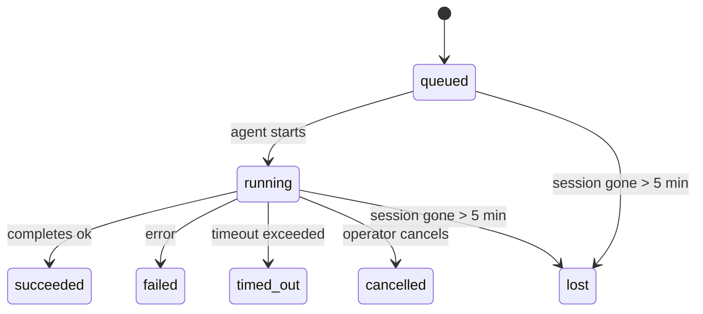

---
read_when:
    - การตรวจสอบงานเบื้องหลังที่กำลังดำเนินอยู่หรือเพิ่งเสร็จสิ้น
    - การดีบักการส่งที่ล้มเหลวสำหรับการรันเอเจนต์แบบแยกออก
    - ทำความเข้าใจว่าการรันเบื้องหลังเกี่ยวข้องกับเซสชัน, Cron และ Heartbeat อย่างไร
sidebarTitle: Background tasks
summary: การติดตามงานเบื้องหลังสำหรับการรัน ACP, subagents, งาน Cron แบบแยกโดดเดี่ยว และการดำเนินการของ CLI
title: งานเบื้องหลัง
x-i18n:
    generated_at: "2026-05-06T09:02:26Z"
    model: gpt-5.5
    provider: openai
    source_hash: 055e16b4f53dbd089cc72eea7fe80bdaee5451dc56fa6e88a742f98e566bb57a
    source_path: automation/tasks.md
    workflow: 16
---

<Note>
กำลังมองหาการตั้งเวลาอยู่ใช่ไหม ดู [ระบบอัตโนมัติและงาน](/th/automation) เพื่อเลือกกลไกที่เหมาะสม หน้านี้เป็นบัญชีแยกประเภทกิจกรรมสำหรับงานเบื้องหลัง ไม่ใช่ตัวตั้งเวลา
</Note>

งานเบื้องหลังติดตามงานที่ทำงาน **นอกเซสชันสนทนาหลักของคุณ**: การรัน ACP, การสร้าง subagent, การรันงาน Cron แบบแยก, และการดำเนินการที่เริ่มจาก CLI

งาน **ไม่ได้** มาแทนเซสชัน, งาน Cron, หรือ Heartbeat - งานคือ **บัญชีแยกประเภทกิจกรรม** ที่บันทึกว่างานแบบแยกเกิดอะไรขึ้น เมื่อใด และสำเร็จหรือไม่

<Note>
ไม่ใช่ทุกการรัน agent จะสร้างงาน เทิร์น Heartbeat และแชตโต้ตอบปกติจะไม่สร้างงาน การรัน Cron ทั้งหมด, การสร้าง ACP, การสร้าง subagent, และคำสั่ง agent ผ่าน CLI จะสร้างงาน
</Note>

## สรุปสั้น

- งานคือ **ระเบียน** ไม่ใช่ตัวตั้งเวลา - Cron และ Heartbeat เป็นตัวตัดสินใจว่า งานจะรัน _เมื่อใด_ ส่วนงานจะติดตามว่า _เกิดอะไรขึ้น_
- ACP, subagent, งาน Cron ทั้งหมด, และการดำเนินการผ่าน CLI จะสร้างงาน เทิร์น Heartbeat จะไม่สร้าง
- แต่ละงานจะเคลื่อนผ่าน `queued → running → terminal` (succeeded, failed, timed_out, cancelled, หรือ lost)
- งาน Cron จะยังมีสถานะทำงานอยู่ตราบใดที่ runtime ของ Cron ยังเป็นเจ้าของงานนั้น หากสถานะ runtime ในหน่วยความจำหายไป การบำรุงรักษางานจะตรวจสอบประวัติการรัน Cron ที่คงทนก่อน แล้วจึงทำเครื่องหมายว่างานสูญหาย
- การเสร็จสิ้นขับเคลื่อนแบบ push: งานแบบแยกสามารถแจ้งโดยตรงหรือปลุกเซสชัน/Heartbeat ของผู้ร้องขอเมื่อทำงานเสร็จ ดังนั้นลูป polling สถานะมักไม่ใช่รูปแบบที่เหมาะสม
- การรัน Cron แบบแยกและการเสร็จสิ้นของ subagent จะพยายามอย่างดีที่สุดในการล้างแท็บ/โปรเซสเบราว์เซอร์ที่ติดตามไว้สำหรับเซสชันลูก ก่อนการทำบัญชีล้างข้อมูลขั้นสุดท้าย
- การส่งมอบ Cron แบบแยกจะระงับการตอบกลับชั่วคราวที่เก่าของพาเรนต์ขณะที่งาน subagent ลูกหลานยังระบายงานอยู่ และจะเลือกเอาต์พุตสุดท้ายจากลูกหลานเมื่อมาถึงก่อนการส่งมอบ
- การแจ้งเตือนการเสร็จสิ้นจะถูกส่งโดยตรงไปยังช่องทางหรือเข้าคิวไว้สำหรับ Heartbeat ครั้งถัดไป
- `openclaw tasks list` แสดงงานทั้งหมด; `openclaw tasks audit` แสดงปัญหา
- ระเบียนปลายทางจะถูกเก็บไว้ 7 วัน แล้วจึงตัดทิ้งโดยอัตโนมัติ

## เริ่มต้นอย่างรวดเร็ว

<Tabs>
  <Tab title="แสดงรายการและกรอง">
    ```bash
    # List all tasks (newest first)
    openclaw tasks list

    # Filter by runtime or status
    openclaw tasks list --runtime acp
    openclaw tasks list --status running
    ```

  </Tab>
  <Tab title="ตรวจสอบ">
    ```bash
    # Show details for a specific task (by ID, run ID, or session key)
    openclaw tasks show <lookup>
    ```
  </Tab>
  <Tab title="ยกเลิกและแจ้งเตือน">
    ```bash
    # Cancel a running task (kills the child session)
    openclaw tasks cancel <lookup>

    # Change notification policy for a task
    openclaw tasks notify <lookup> state_changes
    ```

  </Tab>
  <Tab title="ตรวจสอบสุขภาพและบำรุงรักษา">
    ```bash
    # Run a health audit
    openclaw tasks audit

    # Preview or apply maintenance
    openclaw tasks maintenance
    openclaw tasks maintenance --apply
    ```

  </Tab>
  <Tab title="โฟลว์งาน">
    ```bash
    # Inspect TaskFlow state
    openclaw tasks flow list
    openclaw tasks flow show <lookup>
    openclaw tasks flow cancel <lookup>
    ```
  </Tab>
</Tabs>

## อะไรสร้างงาน

| แหล่งที่มา                 | ประเภท runtime | เมื่อสร้างระเบียนงาน                          | นโยบายแจ้งเตือนเริ่มต้น |
| ---------------------- | ------------ | ------------------------------------------------------ | --------------------- |
| การรัน ACP เบื้องหลัง    | `acp`        | สร้างเซสชัน ACP ลูก                           | `done_only`           |
| การประสานงาน subagent | `subagent`   | สร้าง subagent ผ่าน `sessions_spawn`               | `done_only`           |
| งาน Cron (ทุกประเภท)  | `cron`       | ทุกการรัน Cron (ทั้งเซสชันหลักและแบบแยก)       | `silent`              |
| การดำเนินการผ่าน CLI         | `cli`        | คำสั่ง `openclaw agent` ที่รันผ่าน Gateway | `silent`              |
| งานสื่อของ agent       | `cli`        | การรัน `music_generate`/`video_generate` ที่มีเซสชันรองรับ  | `silent`              |

<AccordionGroup>
  <Accordion title="ค่าเริ่มต้นการแจ้งเตือนสำหรับ Cron และสื่อ">
    งาน Cron ในเซสชันหลักใช้นโยบายแจ้งเตือน `silent` โดยค่าเริ่มต้น - งานเหล่านี้สร้างระเบียนสำหรับการติดตามแต่ไม่สร้างการแจ้งเตือน งาน Cron แบบแยกก็ใช้ค่าเริ่มต้นเป็น `silent` เช่นกัน แต่มองเห็นได้ชัดกว่าเพราะรันในเซสชันของตัวเอง

    การรัน `music_generate` และ `video_generate` ที่มีเซสชันรองรับก็ใช้นโยบายแจ้งเตือน `silent` เช่นกัน งานเหล่านี้ยังคงสร้างระเบียนงาน แต่การเสร็จสิ้นจะถูกส่งกลับไปยังเซสชัน agent เดิมเป็นการปลุกภายใน เพื่อให้ agent เขียนข้อความติดตามผลและแนบสื่อที่เสร็จแล้วด้วยตัวเอง การเสร็จสิ้นในกลุ่ม/ช่องทางจะทำตามนโยบายตอบกลับที่มองเห็นได้ตามปกติ ดังนั้น agent จะใช้เครื่องมือส่งข้อความเมื่อการส่งมอบต้นทางต้องการ หาก agent ที่ทำการเสร็จสิ้นไม่สามารถสร้างหลักฐานการส่งมอบผ่านเครื่องมือส่งข้อความในเส้นทางแบบเครื่องมือเท่านั้น OpenClaw จะส่ง fallback การเสร็จสิ้นโดยตรงไปยังช่องทางเดิมแทนที่จะปล่อยให้สื่อเป็นส่วนตัว

  </Accordion>
  <Accordion title="กรอบป้องกัน video_generate พร้อมกัน">
    ขณะที่งาน `video_generate` ที่มีเซสชันรองรับยังทำงานอยู่ เครื่องมือนี้ยังทำหน้าที่เป็นกรอบป้องกันด้วย: การเรียก `video_generate` ซ้ำในเซสชันเดียวกันจะคืนสถานะงานที่ทำงานอยู่แทนที่จะเริ่มการสร้างพร้อมกันครั้งที่สอง ใช้ `action: "status"` เมื่อคุณต้องการดูความคืบหน้า/สถานะอย่างชัดเจนจากฝั่ง agent
  </Accordion>
  <Accordion title="อะไรไม่สร้างงาน">
    - เทิร์น Heartbeat - เซสชันหลัก; ดู [Heartbeat](/th/gateway/heartbeat)
    - เทิร์นแชตโต้ตอบปกติ
    - การตอบกลับ `/command` โดยตรง

  </Accordion>
</AccordionGroup>

## วงจรชีวิตของงาน



| สถานะ      | ความหมาย                                                              |
| ----------- | -------------------------------------------------------------------------- |
| `queued`    | สร้างแล้ว กำลังรอให้ agent เริ่ม                                    |
| `running`   | เทิร์น agent กำลังดำเนินการอยู่                                           |
| `succeeded` | เสร็จสมบูรณ์สำเร็จ                                                     |
| `failed`    | เสร็จสิ้นพร้อมข้อผิดพลาด                                                    |
| `timed_out` | เกิน timeout ที่กำหนดค่าไว้                                            |
| `cancelled` | ถูกหยุดโดยผู้ปฏิบัติการผ่าน `openclaw tasks cancel`                        |
| `lost`      | runtime สูญเสียสถานะสนับสนุนที่เชื่อถือได้หลังช่วงผ่อนผัน 5 นาที |

การเปลี่ยนสถานะเกิดขึ้นโดยอัตโนมัติ - เมื่อการรัน agent ที่เกี่ยวข้องสิ้นสุด สถานะงานจะอัปเดตให้ตรงกัน

การเสร็จสิ้นของการรัน agent เป็นแหล่งอ้างอิงที่เชื่อถือได้สำหรับระเบียนงานที่ใช้งานอยู่ การรันแบบแยกที่สำเร็จจะสิ้นสุดเป็น `succeeded`, ข้อผิดพลาดของการรันทั่วไปจะสิ้นสุดเป็น `failed`, และผลลัพธ์จาก timeout หรือ abort จะสิ้นสุดเป็น `timed_out` หากผู้ปฏิบัติการยกเลิกงานไปแล้ว หรือ runtime บันทึกสถานะปลายทางที่เข้มกว่าไว้แล้ว เช่น `failed`, `timed_out`, หรือ `lost` สัญญาณสำเร็จที่มาภายหลังจะไม่ลดระดับสถานะปลายทางนั้น

`lost` รับรู้ตาม runtime:

- งาน ACP: metadata ของเซสชัน ACP ลูกที่สนับสนุนหายไป
- งาน subagent: เซสชันลูกที่สนับสนุนหายไปจาก store ของ agent เป้าหมาย
- งาน Cron: runtime ของ Cron ไม่ติดตามงานว่าใช้งานอยู่อีกต่อไป และประวัติการรัน Cron ที่คงทนไม่แสดงผลลัพธ์ปลายทางสำหรับการรันนั้น การตรวจสอบสุขภาพผ่าน CLI แบบออฟไลน์จะไม่ถือว่าสถานะ runtime ของ Cron ในโปรเซสตัวเองที่ว่างเปล่าเป็นแหล่งอ้างอิง
- งาน CLI: งานเซสชันลูกแบบแยกใช้เซสชันลูก; งาน CLI ที่มีแชตรองรับใช้บริบทการรันสดแทน ดังนั้นแถวเซสชันช่องทาง/กลุ่ม/โดยตรงที่ค้างอยู่จะไม่ทำให้ยังมีชีวิตอยู่ การรัน `openclaw agent` ที่มี Gateway รองรับยังสิ้นสุดจากผลการรันด้วย ดังนั้นการรันที่เสร็จแล้วจะไม่ค้างเป็น active จนกว่า sweeper จะทำเครื่องหมายเป็น `lost`

## การส่งมอบและการแจ้งเตือน

เมื่องานถึงสถานะปลายทาง OpenClaw จะแจ้งคุณ มีเส้นทางการส่งมอบสองแบบ:

**การส่งมอบโดยตรง** - หากงานมีเป้าหมายช่องทาง (`requesterOrigin`) ข้อความเสร็จสิ้นจะไปยังช่องทางนั้นโดยตรง (Telegram, Discord, Slack ฯลฯ) สำหรับการเสร็จสิ้นของ subagent OpenClaw ยังรักษาเส้นทาง thread/topic ที่ผูกไว้เมื่อมี และสามารถเติม `to` / account ที่ขาดหายจากเส้นทางที่เก็บไว้ของเซสชันผู้ร้องขอ (`lastChannel` / `lastTo` / `lastAccountId`) ก่อนจะยอมแพ้ต่อการส่งมอบโดยตรง

**การส่งมอบเข้าคิวเซสชัน** - หากการส่งมอบโดยตรงล้มเหลวหรือไม่ได้ตั้ง origin ไว้ การอัปเดตจะถูกเข้าคิวเป็น system event ในเซสชันของผู้ร้องขอ และแสดงขึ้นใน Heartbeat ครั้งถัดไป

<Tip>
การเสร็จสิ้นของงานจะกระตุ้นการปลุก Heartbeat ทันที เพื่อให้คุณเห็นผลลัพธ์อย่างรวดเร็ว - คุณไม่ต้องรอ tick ของ Heartbeat ตามกำหนดครั้งถัดไป
</Tip>

นั่นหมายความว่า workflow ปกติเป็นแบบ push-based: เริ่มงานแบบแยกหนึ่งครั้ง แล้วปล่อยให้ runtime ปลุกหรือแจ้งคุณเมื่อเสร็จสิ้น Poll สถานะงานเฉพาะเมื่อคุณต้องการดีบัก แทรกแซง หรือตรวจสอบสุขภาพอย่างชัดเจน

### นโยบายการแจ้งเตือน

ควบคุมว่าคุณจะได้ยินเกี่ยวกับแต่ละงานมากแค่ไหน:

| นโยบาย                | สิ่งที่ถูกส่งมอบ                                                       |
| --------------------- | ----------------------------------------------------------------------- |
| `done_only` (ค่าเริ่มต้น) | เฉพาะสถานะปลายทาง (succeeded, failed ฯลฯ) - **นี่คือค่าเริ่มต้น** |
| `state_changes`       | ทุกการเปลี่ยนสถานะและการอัปเดตความคืบหน้า                              |
| `silent`              | ไม่มีอะไรเลย                                                          |

เปลี่ยนนโยบายขณะที่งานกำลังทำงาน:

```bash
openclaw tasks notify <lookup> state_changes
```

## อ้างอิง CLI

<AccordionGroup>
  <Accordion title="tasks list">
    ```bash
    openclaw tasks list [--runtime <acp|subagent|cron|cli>] [--status <status>] [--json]
    ```

    คอลัมน์เอาต์พุต: Task ID, Kind, Status, Delivery, Run ID, Child Session, Summary

  </Accordion>
  <Accordion title="tasks show">
    ```bash
    openclaw tasks show <lookup>
    ```

    โทเคน lookup รับ ID งาน, ID การรัน, หรือคีย์เซสชัน แสดงระเบียนแบบเต็มรวมถึงเวลา สถานะการส่งมอบ ข้อผิดพลาด และสรุปปลายทาง

  </Accordion>
  <Accordion title="tasks cancel">
    ```bash
    openclaw tasks cancel <lookup>
    ```

    สำหรับงาน ACP และ subagent คำสั่งนี้จะฆ่าเซสชันลูก สำหรับงานที่ CLI ติดตาม การยกเลิกจะถูกบันทึกใน registry ของงาน (ไม่มี handle runtime ลูกแยกต่างหาก) สถานะจะเปลี่ยนเป็น `cancelled` และการแจ้งเตือนการส่งมอบจะถูกส่งเมื่อเกี่ยวข้อง

  </Accordion>
  <Accordion title="tasks notify">
    ```bash
    openclaw tasks notify <lookup> <done_only|state_changes|silent>
    ```
  </Accordion>
  <Accordion title="tasks audit">
    ```bash
    openclaw tasks audit [--json]
    ```

    แสดงปัญหาด้านปฏิบัติการ ผลการตรวจพบจะแสดงใน `openclaw status` ด้วยเมื่อตรวจพบปัญหา

    | รายการที่พบ              | ความรุนแรง | ทริกเกอร์                                                                                                      |
    | ------------------------- | ---------- | ------------------------------------------------------------------------------------------------------------ |
    | `stale_queued`            | เตือน      | เข้าคิวมานานกว่า 10 นาที                                                                                      |
    | `stale_running`           | ข้อผิดพลาด | ทำงานมานานกว่า 30 นาที                                                                                       |
    | `lost`                    | เตือน/ข้อผิดพลาด | ความเป็นเจ้าของงานที่มีรันไทม์รองรับหายไป; งานที่สูญหายซึ่งถูกเก็บไว้จะแสดงเป็นคำเตือนจนถึง `cleanupAfter` จากนั้นจึงกลายเป็นข้อผิดพลาด |
    | `delivery_failed`         | เตือน      | การส่งล้มเหลวและนโยบายการแจ้งเตือนไม่ใช่ `silent`                                                            |
    | `missing_cleanup`         | เตือน      | งานปลายทางที่ไม่มีเวลาประทับการล้างข้อมูล                                                                      |
    | `inconsistent_timestamps` | เตือน      | การละเมิดไทม์ไลน์ (เช่น สิ้นสุดก่อนเริ่มต้น)                                                                  |

  </Accordion>
  <Accordion title="tasks maintenance">
    ```bash
    openclaw tasks maintenance [--json]
    openclaw tasks maintenance --apply [--json]
    ```

    ใช้คำสั่งนี้เพื่อดูตัวอย่างหรือปรับใช้การกระทบยอด การประทับเวลาล้างข้อมูล และการตัดแต่งสำหรับงานและสถานะ Task Flow

    การกระทบยอดรับรู้รันไทม์:

    - งาน ACP/subagent ตรวจสอบเซสชันลูกที่รองรับงานนั้น
    - งาน Subagent ที่เซสชันลูกมี tombstone สำหรับการกู้คืนหลังรีสตาร์ตจะถูกทำเครื่องหมายว่าสูญหาย แทนที่จะถือว่าเป็นเซสชันรองรับที่กู้คืนได้
    - งาน Cron ตรวจสอบว่ารันไทม์ cron ยังเป็นเจ้าของ job อยู่หรือไม่ จากนั้นกู้คืนสถานะปลายทางจากบันทึกการรัน cron/สถานะ job ที่บันทึกถาวร ก่อนย้อนกลับไปเป็น `lost` เฉพาะกระบวนการ Gateway เท่านั้นที่เป็นแหล่งข้อมูลที่มีอำนาจสำหรับชุด active-job ของ cron ในหน่วยความจำ; การตรวจสอบ CLI แบบออฟไลน์ใช้ประวัติที่คงทน แต่จะไม่ทำเครื่องหมายงาน cron ว่าสูญหายเพียงเพราะ Set ภายในเครื่องนั้นว่างเปล่า
    - งาน CLI ที่มีแชตรองรับจะตรวจสอบบริบท live run ที่เป็นเจ้าของ ไม่ใช่แค่แถวเซสชันแชต

    การล้างข้อมูลเมื่อเสร็จสิ้นก็รับรู้รันไทม์เช่นกัน:

    - เมื่อ Subagent เสร็จสิ้น ระบบจะพยายามปิดแท็บเบราว์เซอร์/กระบวนการที่ติดตามไว้สำหรับเซสชันลูกก่อนที่การล้างข้อมูลประกาศจะดำเนินต่อ
    - เมื่อ cron แบบแยกเสร็จสิ้น ระบบจะพยายามปิดแท็บเบราว์เซอร์/กระบวนการที่ติดตามไว้สำหรับเซสชัน cron ก่อนที่การรันจะถูกรื้อถอนทั้งหมด
    - การส่งของ cron แบบแยกจะรอการติดตามผลของ subagent ลูกหลานเมื่อจำเป็น และระงับข้อความยืนยันของพาเรนต์ที่ค้าง แทนที่จะประกาศข้อความนั้น
    - การส่งเมื่อ Subagent เสร็จสิ้นจะเลือกใช้ข้อความผู้ช่วยที่มองเห็นล่าสุด; หากว่างเปล่าจะย้อนกลับไปใช้ข้อความ tool/toolResult ล่าสุดที่ผ่านการทำความสะอาดแล้ว และการรัน tool-call ที่จบเพราะหมดเวลาเท่านั้นอาจยุบเป็นสรุปความคืบหน้าบางส่วนแบบสั้น การรันปลายทางที่ล้มเหลวจะประกาศสถานะความล้มเหลวโดยไม่เล่นข้อความตอบกลับที่จับไว้ซ้ำ
    - ความล้มเหลวในการล้างข้อมูลจะไม่บดบังผลลัพธ์จริงของงาน

  </Accordion>
  <Accordion title="tasks flow list | show | cancel">
    ```bash
    openclaw tasks flow list [--status <status>] [--json]
    openclaw tasks flow show <lookup> [--json]
    openclaw tasks flow cancel <lookup>
    ```

    ใช้คำสั่งเหล่านี้เมื่อ Task Flow ที่ประสานงานคือสิ่งที่คุณสนใจ แทนที่จะเป็นระเบียนงานเบื้องหลังแต่ละรายการ

  </Accordion>
</AccordionGroup>

## กระดานงานในแชต (`/tasks`)

ใช้ `/tasks` ในเซสชันแชตใดก็ได้เพื่อดูงานเบื้องหลังที่เชื่อมโยงกับเซสชันนั้น กระดานจะแสดงงานที่กำลังทำงานและเพิ่งเสร็จสิ้น พร้อมรันไทม์ สถานะ เวลา และรายละเอียดความคืบหน้าหรือข้อผิดพลาด

เมื่อเซสชันปัจจุบันไม่มีงานที่เชื่อมโยงซึ่งมองเห็นได้ `/tasks` จะย้อนกลับไปใช้จำนวนงานภายในเอเจนต์ เพื่อให้คุณยังเห็นภาพรวมโดยไม่เปิดเผยรายละเอียดของเซสชันอื่น

สำหรับบัญชีแยกประเภทผู้ปฏิบัติงานแบบเต็ม ให้ใช้ CLI: `openclaw tasks list`

## การผสานรวมสถานะ (แรงกดดันจากงาน)

`openclaw status` รวมสรุปงานแบบมองเห็นได้ทันที:

```
Tasks: 3 queued · 2 running · 1 issues
```

สรุปรายงาน:

- **active** - จำนวน `queued` + `running`
- **failures** - จำนวน `failed` + `timed_out` + `lost`
- **byRuntime** - การแจกแจงตาม `acp`, `subagent`, `cron`, `cli`

ทั้ง `/status` และเครื่องมือ `session_status` ใช้สแนปช็อตงานที่รับรู้การล้างข้อมูล: งานที่ยังทำงานอยู่จะถูกให้ความสำคัญ แถวที่เสร็จสิ้นแล้วและค้างจะถูกซ่อน และความล้มเหลวล่าสุดจะแสดงเฉพาะเมื่อไม่มีงานที่ยังทำงานอยู่เหลืออยู่ วิธีนี้ช่วยให้การ์ดสถานะมุ่งเน้นสิ่งที่สำคัญในตอนนี้

## พื้นที่จัดเก็บและการบำรุงรักษา

### งานอยู่ที่ไหน

ระเบียนงานคงอยู่ใน SQLite ที่:

```
$OPENCLAW_STATE_DIR/tasks/runs.sqlite
```

รีจิสทรีโหลดเข้าสู่หน่วยความจำเมื่อ Gateway เริ่มทำงาน และซิงค์การเขียนไปยัง SQLite เพื่อความคงทนข้ามการรีสตาร์ต
Gateway จำกัดขนาด write-ahead log ของ SQLite โดยใช้เกณฑ์ autocheckpoint เริ่มต้นของ SQLite
ร่วมกับ checkpoint แบบ `TRUNCATE` เป็นระยะและตอนปิดระบบ

### การบำรุงรักษาอัตโนมัติ

sweeper ทำงานทุก **60 วินาที** และจัดการสี่เรื่อง:

<Steps>
  <Step title="Reconciliation">
    ตรวจสอบว่างานที่ยังทำงานอยู่ยังมีรันไทม์ที่มีอำนาจรองรับอยู่หรือไม่ งาน ACP/subagent ใช้สถานะเซสชันลูก งาน cron ใช้ความเป็นเจ้าของ active-job และงาน CLI ที่มีแชตรองรับใช้บริบทการรันที่เป็นเจ้าของ หากสถานะรองรับนั้นหายไปนานกว่า 5 นาที งานจะถูกทำเครื่องหมายเป็น `lost`
  </Step>
  <Step title="ACP session repair">
    ปิดเซสชัน ACP แบบ one-shot ที่เป็นปลายทางหรือกำพร้าและมีพาเรนต์เป็นเจ้าของ และปิดเซสชัน ACP แบบถาวรที่เป็นปลายทางหรือกำพร้าและค้าง เฉพาะเมื่อไม่มีการผูกการสนทนาที่ใช้งานอยู่เหลืออยู่
  </Step>
  <Step title="Cleanup stamping">
    ตั้งเวลาประทับ `cleanupAfter` บนงานปลายทาง (endedAt + 7 วัน) ระหว่างช่วงเก็บรักษา งานที่สูญหายยังปรากฏในการตรวจสอบเป็นคำเตือน; หลังจาก `cleanupAfter` หมดอายุหรือเมื่อเมตาดาต้าการล้างข้อมูลหายไป งานเหล่านี้จะเป็นข้อผิดพลาด
  </Step>
  <Step title="Pruning">
    ลบระเบียนที่เลยวันที่ `cleanupAfter`
  </Step>
</Steps>

<Note>
**การเก็บรักษา:** ระเบียนงานปลายทางจะถูกเก็บไว้ **7 วัน** จากนั้นถูกตัดแต่งโดยอัตโนมัติ ไม่ต้องกำหนดค่า
</Note>

## งานสัมพันธ์กับระบบอื่นอย่างไร

<AccordionGroup>
  <Accordion title="Tasks and Task Flow">
    [Task Flow](/th/automation/taskflow) คือเลเยอร์การประสาน flow เหนืองานเบื้องหลัง flow เดียวอาจประสานงานหลายงานตลอดอายุการใช้งานโดยใช้โหมดซิงค์แบบจัดการหรือแบบ mirrored ใช้ `openclaw tasks` เพื่อตรวจสอบระเบียนงานแต่ละรายการ และ `openclaw tasks flow` เพื่อตรวจสอบ flow ที่ประสานงาน

    ดูรายละเอียดที่ [Task Flow](/th/automation/taskflow)

  </Accordion>
  <Accordion title="Tasks and cron">
    **นิยาม** งาน cron อยู่ใน `~/.openclaw/cron/jobs.json`; สถานะการทำงานของรันไทม์อยู่ข้างกันใน `~/.openclaw/cron/jobs-state.json` การดำเนินการ cron **ทุกครั้ง** จะสร้างระเบียนงาน ทั้งแบบ main-session และแบบแยก งาน cron แบบ main-session มีนโยบายแจ้งเตือนเริ่มต้นเป็น `silent` เพื่อให้ติดตามได้โดยไม่สร้างการแจ้งเตือน

    ดู [Cron Jobs](/th/automation/cron-jobs)

  </Accordion>
  <Accordion title="Tasks and heartbeat">
    การรัน Heartbeat เป็น turn ของ main-session - ไม่สร้างระเบียนงาน เมื่องานเสร็จสิ้น งานนั้นสามารถทริกเกอร์การปลุก heartbeat เพื่อให้คุณเห็นผลลัพธ์ได้ทันที

    ดู [Heartbeat](/th/gateway/heartbeat)

  </Accordion>
  <Accordion title="Tasks and sessions">
    งานอาจอ้างอิง `childSessionKey` (ที่งานทำงานอยู่) และ `requesterSessionKey` (ผู้เริ่มงาน) เซสชันคือบริบทการสนทนา; งานคือการติดตามกิจกรรมที่อยู่ด้านบนของบริบทนั้น
  </Accordion>
  <Accordion title="Tasks and agent runs">
    `runId` ของงานเชื่อมโยงกับการรันเอเจนต์ที่ทำงานนั้น เหตุการณ์วงจรชีวิตเอเจนต์ (เริ่มต้น สิ้นสุด ข้อผิดพลาด) จะอัปเดตสถานะงานโดยอัตโนมัติ - คุณไม่จำเป็นต้องจัดการวงจรชีวิตด้วยตนเอง
  </Accordion>
</AccordionGroup>

## ที่เกี่ยวข้อง

- [Automation & Tasks](/th/automation) - กลไกอัตโนมัติทั้งหมดโดยสรุป
- [CLI: Tasks](/th/cli/tasks) - ข้อมูลอ้างอิงคำสั่ง CLI
- [Heartbeat](/th/gateway/heartbeat) - turn ของ main-session เป็นระยะ
- [Scheduled Tasks](/th/automation/cron-jobs) - การกำหนดเวลางานเบื้องหลัง
- [Task Flow](/th/automation/taskflow) - การประสาน flow เหนืองาน
