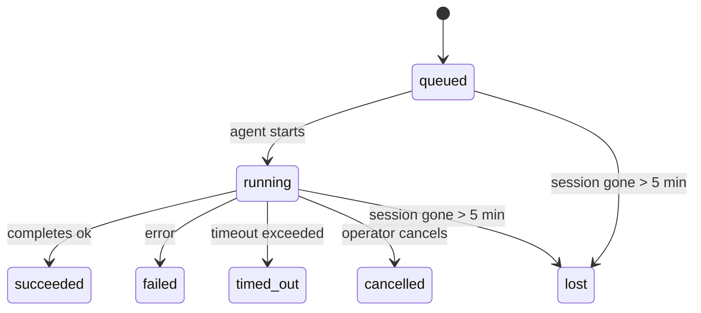

---
read_when:
    - การตรวจสอบงานเบื้องหลังที่กำลังดำเนินอยู่หรือเพิ่งเสร็จสิ้น
    - การดีบักความล้มเหลวในการส่งสำหรับการรันเอเจนต์แบบแยกออก
    - ทำความเข้าใจว่าการรันเบื้องหลังเกี่ยวข้องกับเซสชัน, Cron และ Heartbeat อย่างไร
sidebarTitle: Background tasks
summary: การติดตามงานเบื้องหลังสำหรับการรัน ACP, เอเจนต์ย่อย, งาน Cron แบบแยกส่วน และการดำเนินการของ CLI
title: งานเบื้องหลัง
x-i18n:
    generated_at: "2026-05-01T10:13:51Z"
    model: gpt-5.5
    provider: openai
    source_hash: 8782987a79989264ae3bd1ca4b16755bdfb7e295e4f77933bf3a38c136d837f4
    source_path: automation/tasks.md
    workflow: 16
---

<Note>
กำลังมองหาการจัดกำหนดการอยู่ใช่ไหม? ดู [Automation และงาน](/th/automation) เพื่อเลือกกลไกที่เหมาะสม หน้านี้คือสมุดบันทึกกิจกรรมสำหรับงานเบื้องหลัง ไม่ใช่ตัวจัดกำหนดการ
</Note>

งานเบื้องหลังติดตามงานที่รัน **นอกเซสชันการสนทนาหลักของคุณ**: การรัน ACP, การสร้าง subagent, การดำเนินงาน cron แบบแยก, และการดำเนินการที่เริ่มจาก CLI

งาน **ไม่** ได้แทนที่เซสชัน, งาน cron, หรือ Heartbeat — งานเป็น **สมุดบันทึกกิจกรรม** ที่บันทึกว่างานที่แยกออกไปเกิดอะไรขึ้น เมื่อใด และสำเร็จหรือไม่

<Note>
การรัน agent ไม่ใช่ทุกครั้งที่จะสร้างงาน เทิร์น Heartbeat และแชตโต้ตอบปกติจะไม่สร้างงาน การดำเนินการ cron ทั้งหมด, การสร้าง ACP, การสร้าง subagent, และคำสั่ง CLI agent จะสร้างงาน
</Note>

## สรุปสั้น ๆ

- งานคือ **ระเบียน** ไม่ใช่ตัวจัดกำหนดการ — cron และ Heartbeat เป็นตัวตัดสินว่า _เมื่อใด_ งานจะรัน ส่วนงานติดตามว่า _เกิดอะไรขึ้น_
- ACP, subagent, งาน cron ทั้งหมด, และการดำเนินการ CLI จะสร้างงาน เทิร์น Heartbeat จะไม่สร้าง
- แต่ละงานจะเคลื่อนผ่าน `queued → running → terminal` (succeeded, failed, timed_out, cancelled, หรือ lost)
- งาน Cron จะยังคงมีสถานะ live ตราบใดที่ runtime ของ cron ยังเป็นเจ้าของงานนั้นอยู่ หากสถานะ runtime ในหน่วยความจำหายไป การดูแลงานจะตรวจสอบประวัติการรัน cron แบบ durable ก่อน แล้วจึงทำเครื่องหมายว่างานสูญหาย
- การเสร็จสิ้นขับเคลื่อนด้วยการ push: งานที่แยกออกไปสามารถแจ้งเตือนโดยตรงหรือปลุกเซสชัน/Heartbeat ของผู้ร้องขอเมื่อเสร็จสิ้น ดังนั้นลูป polling สถานะจึงมักเป็นรูปแบบที่ไม่เหมาะสม
- การรัน cron แบบแยกและการเสร็จสิ้นของ subagent จะพยายามล้างแท็บ/โปรเซสของเบราว์เซอร์ที่ติดตามไว้สำหรับเซสชันลูก ก่อนทำบัญชี cleanup สุดท้าย
- การส่งมอบ cron แบบแยกจะระงับคำตอบชั่วคราวของ parent ที่เก่าแล้ว ขณะที่งาน subagent ลูกหลานยังระบายงานอยู่ และจะเลือกเอาต์พุตสุดท้ายของลูกหลานเมื่อเอาต์พุตนั้นมาถึงก่อนการส่งมอบ
- การแจ้งเตือนการเสร็จสิ้นจะถูกส่งตรงไปยัง channel หรือเข้าคิวไว้สำหรับ Heartbeat ถัดไป
- `openclaw tasks list` แสดงงานทั้งหมด; `openclaw tasks audit` แสดงปัญหา
- ระเบียน terminal จะถูกเก็บไว้ 7 วัน แล้วตัดทิ้งโดยอัตโนมัติ

## เริ่มต้นอย่างรวดเร็ว

<Tabs>
  <Tab title="List and filter">
    ```bash
    # List all tasks (newest first)
    openclaw tasks list

    # Filter by runtime or status
    openclaw tasks list --runtime acp
    openclaw tasks list --status running
    ```

  </Tab>
  <Tab title="Inspect">
    ```bash
    # Show details for a specific task (by ID, run ID, or session key)
    openclaw tasks show <lookup>
    ```
  </Tab>
  <Tab title="Cancel and notify">
    ```bash
    # Cancel a running task (kills the child session)
    openclaw tasks cancel <lookup>

    # Change notification policy for a task
    openclaw tasks notify <lookup> state_changes
    ```

  </Tab>
  <Tab title="Audit and maintenance">
    ```bash
    # Run a health audit
    openclaw tasks audit

    # Preview or apply maintenance
    openclaw tasks maintenance
    openclaw tasks maintenance --apply
    ```

  </Tab>
  <Tab title="Task flow">
    ```bash
    # Inspect TaskFlow state
    openclaw tasks flow list
    openclaw tasks flow show <lookup>
    openclaw tasks flow cancel <lookup>
    ```
  </Tab>
</Tabs>

## สิ่งที่สร้างงาน

| แหล่งที่มา | ประเภท runtime | เมื่อสร้างระเบียนงาน | นโยบายแจ้งเตือนเริ่มต้น |
| ---------------------- | ------------ | ------------------------------------------------------ | --------------------- |
| การรัน ACP เบื้องหลัง | `acp` | การสร้างเซสชัน ACP ลูก | `done_only` |
| การประสานงาน subagent | `subagent` | การสร้าง subagent ผ่าน `sessions_spawn` | `done_only` |
| งาน Cron (ทุกประเภท) | `cron` | การดำเนินการ cron ทุกครั้ง (เซสชันหลักและแบบแยก) | `silent` |
| การดำเนินการ CLI | `cli` | คำสั่ง `openclaw agent` ที่รันผ่าน Gateway | `silent` |
| งานสื่อของ agent | `cli` | การรัน `music_generate`/`video_generate` ที่มีเซสชันรองรับ | `silent` |

<AccordionGroup>
  <Accordion title="Notify defaults for cron and media">
    งาน cron แบบเซสชันหลักใช้นโยบายแจ้งเตือน `silent` เป็นค่าเริ่มต้น — งานเหล่านี้สร้างระเบียนสำหรับติดตาม แต่ไม่สร้างการแจ้งเตือน งาน cron แบบแยกก็มีค่าเริ่มต้นเป็น `silent` เช่นกัน แต่มองเห็นได้ชัดกว่าเพราะรันในเซสชันของตัวเอง

    การรัน `music_generate` และ `video_generate` ที่มีเซสชันรองรับก็ใช้นโยบายแจ้งเตือน `silent` เช่นกัน งานเหล่านี้ยังสร้างระเบียนงาน แต่การเสร็จสิ้นจะถูกส่งกลับไปยังเซสชัน agent เดิมเป็นการปลุกภายใน เพื่อให้ agent เขียนข้อความติดตามผลและแนบสื่อที่เสร็จแล้วได้เอง หากคุณเลือกใช้ `tools.media.asyncCompletion.directSend` การเสร็จสิ้นแบบ async ของ `video_generate` สามารถลองส่งตรงไปยัง channel ก่อน ส่วนการเสร็จสิ้นแบบ async ของ `music_generate` จะยังคงอยู่บนเส้นทางการปลุกเซสชันของผู้ร้องขอ

  </Accordion>
  <Accordion title="Concurrent video_generate guardrail">
    ขณะที่งาน `video_generate` ที่มีเซสชันรองรับยัง active อยู่ เครื่องมือนี้ยังทำหน้าที่เป็น guardrail ด้วย: การเรียก `video_generate` ซ้ำในเซสชันเดียวกันจะคืนสถานะงาน active แทนที่จะเริ่มการสร้างพร้อมกันงานที่สอง ใช้ `action: "status"` เมื่อคุณต้องการค้นหาความคืบหน้า/สถานะอย่างชัดเจนจากฝั่ง agent
  </Accordion>
  <Accordion title="What does not create tasks">
    - เทิร์น Heartbeat — เซสชันหลัก; ดู [Heartbeat](/th/gateway/heartbeat)
    - เทิร์นแชตโต้ตอบปกติ
    - คำตอบ `/command` โดยตรง

  </Accordion>
</AccordionGroup>

## วงจรชีวิตของงาน



| สถานะ | ความหมาย |
| ----------- | -------------------------------------------------------------------------- |
| `queued` | สร้างแล้ว กำลังรอให้ agent เริ่ม |
| `running` | เทิร์นของ agent กำลังดำเนินการอยู่ |
| `succeeded` | เสร็จสมบูรณ์สำเร็จ |
| `failed` | เสร็จสิ้นพร้อมข้อผิดพลาด |
| `timed_out` | เกิน timeout ที่กำหนดค่าไว้ |
| `cancelled` | ถูกหยุดโดยผู้ปฏิบัติงานผ่าน `openclaw tasks cancel` |
| `lost` | runtime สูญเสียสถานะแหล่งอ้างอิง authoritative หลังช่วงผ่อนผัน 5 นาที |

การเปลี่ยนสถานะเกิดขึ้นโดยอัตโนมัติ — เมื่อการรัน agent ที่เกี่ยวข้องสิ้นสุด สถานะงานจะอัปเดตให้ตรงกัน

การเสร็จสิ้นของการรัน agent เป็น authoritative สำหรับระเบียนงานที่ active การรันแบบแยกที่สำเร็จจะสรุปเป็น `succeeded`, ข้อผิดพลาดทั่วไปของการรันจะสรุปเป็น `failed`, และผลลัพธ์ timeout หรือ abort จะสรุปเป็น `timed_out` หากผู้ปฏิบัติงานยกเลิกงานไปแล้ว หรือ runtime บันทึกสถานะ terminal ที่แรงกว่าไว้แล้ว เช่น `failed`, `timed_out`, หรือ `lost` สัญญาณสำเร็จที่มาภายหลังจะไม่ลดระดับสถานะ terminal นั้น

`lost` รับรู้ runtime:

- งาน ACP: metadata เซสชัน ACP ลูกที่เป็น backing หายไป
- งาน Subagent: เซสชันลูกที่เป็น backing หายไปจาก store ของ agent เป้าหมาย
- งาน Cron: runtime ของ cron ไม่ติดตามงานว่า active อีกต่อไป และประวัติการรัน cron แบบ durable ไม่แสดงผลลัพธ์ terminal สำหรับการรันนั้น การ audit ของ CLI แบบ offline จะไม่ถือว่าสถานะ runtime cron ในโปรเซสของตัวเองที่ว่างเปล่าเป็น authority
- งาน CLI: งานเซสชันลูกแบบแยกจะใช้เซสชันลูก; งาน CLI ที่มีแชตรองรับจะใช้บริบทการรัน live แทน ดังนั้นแถวเซสชัน channel/group/direct ที่ยังค้างอยู่จะไม่ทำให้งานเหล่านั้นยังมีชีวิตอยู่ การรัน `openclaw agent` ที่มี Gateway รองรับจะสรุปจากผลลัพธ์การรันด้วย ดังนั้นการรันที่เสร็จแล้วจะไม่ค้างเป็น active จนกว่า sweeper จะทำเครื่องหมายเป็น `lost`

## การส่งมอบและการแจ้งเตือน

เมื่องานถึงสถานะ terminal OpenClaw จะแจ้งเตือนคุณ มีเส้นทางการส่งมอบสองแบบ:

**การส่งมอบโดยตรง** — หากงานมีเป้าหมาย channel (`requesterOrigin`) ข้อความการเสร็จสิ้นจะส่งตรงไปยัง channel นั้น (Telegram, Discord, Slack, ฯลฯ) สำหรับการเสร็จสิ้นของ subagent OpenClaw ยังรักษาการกำหนดเส้นทาง thread/topic ที่ผูกไว้เมื่อมี และสามารถเติม `to` / account ที่หายไปจาก route ที่เก็บไว้ของเซสชันผู้ร้องขอ (`lastChannel` / `lastTo` / `lastAccountId`) ก่อนจะยอมแพ้กับการส่งมอบโดยตรง

**การส่งมอบที่เข้าคิวในเซสชัน** — หากการส่งมอบโดยตรงล้มเหลวหรือไม่มีการตั้ง origin อัปเดตจะถูกเข้าคิวเป็น system event ในเซสชันของผู้ร้องขอและปรากฏใน Heartbeat ถัดไป

<Tip>
การเสร็จสิ้นของงานจะกระตุ้นการปลุก Heartbeat ทันทีเพื่อให้คุณเห็นผลลัพธ์อย่างรวดเร็ว — คุณไม่ต้องรอ tick ของ Heartbeat ตามกำหนดการครั้งถัดไป
</Tip>

นั่นหมายความว่า workflow ปกติเป็นแบบ push-based: เริ่มงานแบบแยกหนึ่งครั้ง แล้วปล่อยให้ runtime ปลุกหรือแจ้งเตือนคุณเมื่อเสร็จสิ้น ทำ polling สถานะงานเฉพาะเมื่อคุณต้อง debug, แทรกแซง, หรือต้องการ audit อย่างชัดเจน

### นโยบายการแจ้งเตือน

ควบคุมว่าคุณจะได้ยินเกี่ยวกับแต่ละงานมากเพียงใด:

| นโยบาย | สิ่งที่ส่งมอบ |
| --------------------- | ----------------------------------------------------------------------- |
| `done_only` (ค่าเริ่มต้น) | เฉพาะสถานะ terminal (succeeded, failed, ฯลฯ) — **นี่คือค่าเริ่มต้น** |
| `state_changes` | ทุกการเปลี่ยนสถานะและการอัปเดตความคืบหน้า |
| `silent` | ไม่มีอะไรเลย |

เปลี่ยนนโยบายขณะที่งานกำลังรัน:

```bash
openclaw tasks notify <lookup> state_changes
```

## อ้างอิง CLI

<AccordionGroup>
  <Accordion title="tasks list">
    ```bash
    openclaw tasks list [--runtime <acp|subagent|cron|cli>] [--status <status>] [--json]
    ```

    คอลัมน์เอาต์พุต: ID งาน, ชนิด, สถานะ, การส่งมอบ, Run ID, เซสชันลูก, สรุป

  </Accordion>
  <Accordion title="tasks show">
    ```bash
    openclaw tasks show <lookup>
    ```

    โทเค็น lookup รับ ID งาน, run ID, หรือ session key แสดงระเบียนฉบับเต็ม รวมถึงเวลา, สถานะการส่งมอบ, ข้อผิดพลาด, และสรุป terminal

  </Accordion>
  <Accordion title="tasks cancel">
    ```bash
    openclaw tasks cancel <lookup>
    ```

    สำหรับงาน ACP และ subagent การทำเช่นนี้จะ kill เซสชันลูก สำหรับงานที่ CLI ติดตาม การยกเลิกจะถูกบันทึกใน registry งาน (ไม่มี handle runtime ลูกแยกต่างหาก) สถานะจะเปลี่ยนเป็น `cancelled` และจะส่งการแจ้งเตือนการส่งมอบเมื่อใช้ได้

  </Accordion>
  <Accordion title="tasks notify">
    ```bash
    openclaw tasks notify <lookup> <done_only|state_changes|silent>
    ```
  </Accordion>
  <Accordion title="tasks audit">
    ```bash
    openclaw tasks audit [--json]
    ```

    แสดงปัญหาด้านการปฏิบัติการ Findings ยังปรากฏใน `openclaw status` เมื่อตรวจพบปัญหา

    | การตรวจพบ                 | ความรุนแรง | ทริกเกอร์                                                                                                      |
    | ------------------------- | ---------- | ------------------------------------------------------------------------------------------------------------ |
    | `stale_queued`            | warn       | อยู่ในคิวนานกว่า 10 นาที                                                                              |
    | `stale_running`           | error      | ทำงานนานกว่า 30 นาที                                                                             |
    | `lost`                    | warn/error | ความเป็นเจ้าของงานที่มี runtime รองรับหายไป; งานที่สูญหายที่ถูกเก็บไว้จะแจ้งเตือนจนถึง `cleanupAfter` แล้วจึงกลายเป็นข้อผิดพลาด |
    | `delivery_failed`         | warn       | การส่งล้มเหลวและนโยบายการแจ้งเตือนไม่ใช่ `silent`                                                            |
    | `missing_cleanup`         | warn       | งานปลายทางที่ไม่มีเวลาประทับการล้างข้อมูล                                                                      |
    | `inconsistent_timestamps` | warn       | การละเมิดไทม์ไลน์ (เช่น สิ้นสุดก่อนเริ่มต้น)                                                        |

  </Accordion>
  <Accordion title="tasks maintenance">
    ```bash
    openclaw tasks maintenance [--json]
    openclaw tasks maintenance --apply [--json]
    ```

    ใช้สิ่งนี้เพื่อดูตัวอย่างหรือใช้การปรับให้สอดคล้อง การประทับเวลาการล้างข้อมูล และการตัดแต่งสำหรับงานและสถานะ Task Flow

    การปรับให้สอดคล้องรับรู้ runtime:

    - งาน ACP/subagent ตรวจสอบเซสชันลูกที่รองรับงานนั้น
    - งาน Subagent ที่เซสชันลูกมี tombstone สำหรับการกู้คืนหลังรีสตาร์ตจะถูกทำเครื่องหมายว่าสูญหาย แทนที่จะถือว่าเป็นเซสชันรองรับที่กู้คืนได้
    - งาน Cron ตรวจสอบว่า cron runtime ยังเป็นเจ้าของงานอยู่หรือไม่ จากนั้นกู้คืนสถานะปลายทางจากบันทึกการรัน cron/สถานะงานที่คงอยู่ ก่อนจะย้อนกลับไปเป็น `lost` เฉพาะกระบวนการ Gateway เท่านั้นที่เป็นแหล่งอ้างอิงสำหรับชุดงาน cron ที่ใช้งานอยู่ในหน่วยความจำ; การตรวจสอบ CLI แบบออฟไลน์ใช้ประวัติที่คงทน แต่จะไม่ทำเครื่องหมายงาน cron ว่าสูญหายเพียงเพราะ Set ภายในเครื่องนั้นว่างเปล่า
    - งาน CLI ที่มีแชตรองรับจะตรวจสอบบริบท live run ที่เป็นเจ้าของ ไม่ใช่แค่แถวเซสชันแชต

    การล้างข้อมูลเมื่อเสร็จสมบูรณ์ก็รับรู้ runtime เช่นกัน:

    - การเสร็จสมบูรณ์ของ Subagent จะพยายามปิดแท็บเบราว์เซอร์/กระบวนการที่ติดตามไว้สำหรับเซสชันลูก ก่อนที่การล้างข้อมูลการประกาศจะดำเนินต่อ
    - การเสร็จสมบูรณ์ของ cron แบบแยกจะพยายามปิดแท็บเบราว์เซอร์/กระบวนการที่ติดตามไว้สำหรับเซสชัน cron ก่อนที่การรันจะถูกรื้อถอนจนเสร็จสมบูรณ์
    - การส่งของ cron แบบแยกจะรอการติดตามผลจาก subagent ลูกหลานเมื่อจำเป็น และระงับข้อความตอบรับของแม่ที่เก่าเกินไปแทนการประกาศข้อความนั้น
    - การส่งเมื่อ Subagent เสร็จสมบูรณ์จะเลือกข้อความผู้ช่วยล่าสุดที่มองเห็นได้ก่อน; หากว่างเปล่าจะย้อนกลับไปใช้ข้อความ tool/toolResult ล่าสุดที่ผ่านการทำให้ปลอดภัยแล้ว และการรัน tool-call ที่หมดเวลาเท่านั้นสามารถยุบเป็นสรุปความคืบหน้าบางส่วนแบบสั้นได้ การรันปลายทางที่ล้มเหลวจะประกาศสถานะล้มเหลวโดยไม่เล่นข้อความตอบกลับที่จับไว้ซ้ำ
    - ความล้มเหลวในการล้างข้อมูลจะไม่บดบังผลลัพธ์จริงของงาน

  </Accordion>
  <Accordion title="tasks flow list | show | cancel">
    ```bash
    openclaw tasks flow list [--status <status>] [--json]
    openclaw tasks flow show <lookup> [--json]
    openclaw tasks flow cancel <lookup>
    ```

    ใช้คำสั่งเหล่านี้เมื่อ Task Flow ที่ทำหน้าที่ประสานงานคือสิ่งที่คุณสนใจ แทนที่จะเป็นระเบียนงานพื้นหลังรายการเดียว

  </Accordion>
</AccordionGroup>

## กระดานงานแชต (`/tasks`)

ใช้ `/tasks` ในเซสชันแชตใดก็ได้เพื่อดูงานพื้นหลังที่เชื่อมโยงกับเซสชันนั้น กระดานจะแสดงงานที่กำลังใช้งานและเพิ่งเสร็จสมบูรณ์ พร้อม runtime สถานะ เวลา และรายละเอียดความคืบหน้าหรือข้อผิดพลาด

เมื่อเซสชันปัจจุบันไม่มีงานที่เชื่อมโยงและมองเห็นได้ `/tasks` จะย้อนกลับไปใช้จำนวนงานภายในเอเจนต์ เพื่อให้คุณยังได้ภาพรวมโดยไม่รั่วไหลรายละเอียดของเซสชันอื่น

สำหรับบัญชีแยกประเภทของผู้ปฏิบัติงานแบบเต็ม ให้ใช้ CLI: `openclaw tasks list`

## การผสานสถานะ (แรงกดดันของงาน)

`openclaw status` มีสรุปงานแบบดูได้ทันที:

```
Tasks: 3 queued · 2 running · 1 issues
```

สรุปรายงาน:

- **active** — จำนวนของ `queued` + `running`
- **failures** — จำนวนของ `failed` + `timed_out` + `lost`
- **byRuntime** — การแจกแจงตาม `acp`, `subagent`, `cron`, `cli`

ทั้ง `/status` และเครื่องมือ `session_status` ใช้สแนปช็อตงานที่รับรู้การล้างข้อมูล: ให้ความสำคัญกับงานที่ใช้งานอยู่ ซ่อนแถวที่เสร็จสมบูรณ์และเก่าเกินไป และแสดงความล้มเหลวล่าสุดเฉพาะเมื่อไม่มีงานที่ใช้งานอยู่เหลืออยู่ วิธีนี้ทำให้การ์ดสถานะมุ่งเน้นสิ่งที่สำคัญในตอนนี้

## การจัดเก็บและการบำรุงรักษา

### งานอยู่ที่ไหน

ระเบียนงานคงอยู่ใน SQLite ที่:

```
$OPENCLAW_STATE_DIR/tasks/runs.sqlite
```

รีจิสทรีโหลดเข้าสู่หน่วยความจำเมื่อ Gateway เริ่มต้น และซิงค์การเขียนไปยัง SQLite เพื่อความทนทานข้ามการรีสตาร์ต
Gateway จำกัดขนาด write-ahead log ของ SQLite โดยใช้เกณฑ์ autocheckpoint เริ่มต้นของ SQLite
รวมถึง checkpoint แบบ `TRUNCATE` เป็นระยะและตอนปิดระบบ

### การบำรุงรักษาอัตโนมัติ

ตัวกวาดทำงานทุก **60 วินาที** และจัดการสี่สิ่ง:

<Steps>
  <Step title="Reconciliation">
    ตรวจสอบว่างานที่ใช้งานอยู่ยังมี runtime ที่เป็นแหล่งอ้างอิงรองรับอยู่หรือไม่ งาน ACP/subagent ใช้สถานะเซสชันลูก งาน cron ใช้ความเป็นเจ้าของ active-job และงาน CLI ที่มีแชตรองรับใช้บริบทการรันที่เป็นเจ้าของ หากสถานะรองรับนั้นหายไปนานกว่า 5 นาที งานจะถูกทำเครื่องหมายเป็น `lost`
  </Step>
  <Step title="ACP session repair">
    ปิดเซสชัน ACP แบบ one-shot ที่เป็นปลายทางหรือกำพร้าและมีแม่เป็นเจ้าของ และปิดเซสชัน ACP แบบถาวรที่เป็นปลายทางและเก่าเกินไปหรือกำพร้า เฉพาะเมื่อไม่มีการผูกการสนทนาที่ใช้งานอยู่เหลืออยู่
  </Step>
  <Step title="Cleanup stamping">
    ตั้งเวลาประทับ `cleanupAfter` บนงานปลายทาง (endedAt + 7 วัน) ระหว่างช่วงเก็บรักษา งานที่สูญหายยังคงปรากฏในการตรวจสอบเป็นคำเตือน; หลังจาก `cleanupAfter` หมดอายุหรือเมื่อเมตาดาต้าการล้างข้อมูลขาดหาย งานเหล่านั้นจะเป็นข้อผิดพลาด
  </Step>
  <Step title="Pruning">
    ลบระเบียนที่เลยวันที่ `cleanupAfter`
  </Step>
</Steps>

<Note>
**การเก็บรักษา:** ระเบียนงานปลายทางจะถูกเก็บไว้ **7 วัน** จากนั้นจะถูกตัดแต่งโดยอัตโนมัติ ไม่ต้องกำหนดค่า
</Note>

## งานเกี่ยวข้องกับระบบอื่นอย่างไร

<AccordionGroup>
  <Accordion title="Tasks and Task Flow">
    [Task Flow](/th/automation/taskflow) คือชั้นการประสานงานโฟลว์ที่อยู่เหนืองานพื้นหลัง โฟลว์เดียวอาจประสานงานหลายงานตลอดอายุของโฟลว์โดยใช้โหมดซิงค์แบบจัดการหรือแบบสะท้อน ใช้ `openclaw tasks` เพื่อตรวจสอบระเบียนงานแต่ละรายการ และ `openclaw tasks flow` เพื่อตรวจสอบโฟลว์ที่ทำหน้าที่ประสานงาน

    ดูรายละเอียดที่ [Task Flow](/th/automation/taskflow)

  </Accordion>
  <Accordion title="Tasks and cron">
    **definition** ของงาน cron อยู่ใน `~/.openclaw/cron/jobs.json`; สถานะการดำเนินการ runtime อยู่ข้างกันใน `~/.openclaw/cron/jobs-state.json` การดำเนินการ cron **ทุกครั้ง** จะสร้างระเบียนงาน ทั้งแบบ main-session และแบบแยก งาน cron แบบ main-session มีนโยบายแจ้งเตือนเริ่มต้นเป็น `silent` เพื่อให้ติดตามได้โดยไม่สร้างการแจ้งเตือน

    ดู [Cron Jobs](/th/automation/cron-jobs)

  </Accordion>
  <Accordion title="Tasks and heartbeat">
    การรัน Heartbeat เป็นเทิร์นแบบ main-session ซึ่งจะไม่สร้างระเบียนงาน เมื่องานเสร็จสมบูรณ์ งานนั้นสามารถทริกเกอร์การปลุก Heartbeat เพื่อให้คุณเห็นผลลัพธ์ได้ทันที

    ดู [Heartbeat](/th/gateway/heartbeat)

  </Accordion>
  <Accordion title="Tasks and sessions">
    งานอาจอ้างอิง `childSessionKey` (ที่งานทำงานอยู่) และ `requesterSessionKey` (ผู้ที่เริ่มงาน) เซสชันคือบริบทการสนทนา; งานคือการติดตามกิจกรรมที่อยู่ชั้นบนของสิ่งนั้น
  </Accordion>
  <Accordion title="Tasks and agent runs">
    `runId` ของงานเชื่อมโยงไปยังการรันเอเจนต์ที่ทำงานนั้น เหตุการณ์วงจรชีวิตของเอเจนต์ (เริ่มต้น สิ้นสุด ข้อผิดพลาด) จะอัปเดตสถานะงานโดยอัตโนมัติ คุณไม่จำเป็นต้องจัดการวงจรชีวิตด้วยตนเอง
  </Accordion>
</AccordionGroup>

## ที่เกี่ยวข้อง

- [ระบบอัตโนมัติและงาน](/th/automation) — กลไกอัตโนมัติทั้งหมดในภาพรวม
- [CLI: งาน](/th/cli/tasks) — ข้อมูลอ้างอิงคำสั่ง CLI
- [Heartbeat](/th/gateway/heartbeat) — เทิร์น main-session เป็นระยะ
- [งานที่กำหนดเวลาไว้](/th/automation/cron-jobs) — การจัดตารางงานพื้นหลัง
- [Task Flow](/th/automation/taskflow) — การประสานงานโฟลว์เหนืองาน
