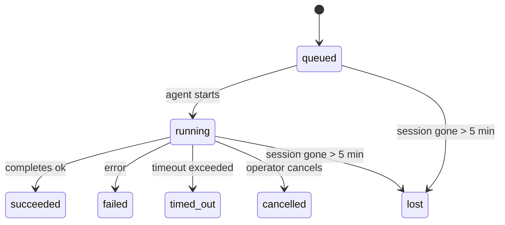

---
read_when:
    - การตรวจสอบงานเบื้องหลังที่กำลังดำเนินอยู่หรือเพิ่งเสร็จสิ้น
    - การดีบักความล้มเหลวในการส่งสำหรับการรันเอเจนต์แบบแยกออก
    - ทำความเข้าใจว่าการรันเบื้องหลังเกี่ยวข้องกับเซสชัน, Cron และ Heartbeat อย่างไร
sidebarTitle: Background tasks
summary: การติดตามงานเบื้องหลังสำหรับการรัน ACP, เอเจนต์ย่อย, งาน Cron แบบแยก, และการดำเนินการ CLI
title: งานเบื้องหลัง
x-i18n:
    generated_at: "2026-05-12T00:56:24Z"
    model: gpt-5.5
    provider: openai
    source_hash: 31cbf09df48bab0686a1350f91aefffffef899c86704bb97b68320fc47e78021
    source_path: automation/tasks.md
    workflow: 16
---

<Note>
กำลังมองหาการตั้งเวลาอยู่ใช่ไหม? ดู [Automation](/th/automation) เพื่อเลือกกลไกที่เหมาะสม หน้านี้เป็นบัญชีกิจกรรมสำหรับงานเบื้องหลัง ไม่ใช่ตัวตั้งเวลา
</Note>

งานเบื้องหลังติดตามงานที่รัน **นอกเซสชันการสนทนาหลักของคุณ**: การรัน ACP, การสร้างเอเจนต์ย่อย, การดำเนินงาน Cron แบบแยกส่วน และการดำเนินการที่เริ่มจาก CLI

งาน **ไม่ได้** มาแทนที่เซสชัน งาน Cron หรือ Heartbeat - งานเป็น **บัญชีกิจกรรม** ที่บันทึกว่างานแบบแยกตัวใดเกิดขึ้น เมื่อใด และสำเร็จหรือไม่

<Note>
ไม่ใช่การรันเอเจนต์ทุกครั้งที่จะสร้างงาน เทิร์น Heartbeat และแชตโต้ตอบตามปกติจะไม่สร้างงาน แต่การดำเนินการ Cron ทั้งหมด, การสร้าง ACP, การสร้างเอเจนต์ย่อย และคำสั่งเอเจนต์ผ่าน CLI จะสร้างงาน
</Note>

## สรุปย่อ

- งานคือ **ระเบียน** ไม่ใช่ตัวตั้งเวลา - Cron และ Heartbeat เป็นตัวตัดสินว่า _เมื่อใด_ งานจะรัน ส่วนงานติดตามว่า _เกิดอะไรขึ้น_
- ACP, เอเจนต์ย่อย, งาน Cron ทั้งหมด และการดำเนินการ CLI จะสร้างงาน เทิร์น Heartbeat จะไม่สร้าง
- แต่ละงานจะเคลื่อนผ่าน `queued → running → terminal` (succeeded, failed, timed_out, cancelled หรือ lost)
- งาน Cron จะยังคงเป็นงานที่ทำงานอยู่ตราบใดที่รันไทม์ Cron ยังเป็นเจ้าของงานนั้นอยู่ หาก
  สถานะรันไทม์ในหน่วยความจำหายไป การบำรุงรักษางานจะตรวจสอบประวัติการรัน Cron
  ที่คงทนก่อน แล้วจึงทำเครื่องหมายงานว่าสูญหาย
- การเสร็จสิ้นถูกขับเคลื่อนแบบพุช: งานแบบแยกตัวสามารถแจ้งโดยตรงหรือปลุก
  เซสชัน/Heartbeat ของผู้ร้องขอเมื่อทำเสร็จ ดังนั้นลูปการโพลสถานะจึง
  มักเป็นรูปแบบที่ไม่เหมาะสม
- การรัน Cron แบบแยกส่วนและการเสร็จสิ้นของเอเจนต์ย่อยจะพยายามล้างแท็บเบราว์เซอร์/โปรเซสที่ติดตามไว้สำหรับเซสชันลูกก่อนการเก็บกวาดขั้นสุดท้าย
- การส่งมอบ Cron แบบแยกส่วนจะระงับการตอบกลับชั่วคราวของพาเรนต์ที่ล้าสมัยขณะที่งานเอเจนต์ย่อยรุ่นถัดลงมายังระบายงานอยู่ และจะเลือกเอาต์พุตสุดท้ายของรุ่นถัดลงมาเมื่อเอาต์พุตนั้นมาถึงก่อนการส่งมอบ
- การแจ้งเตือนการเสร็จสิ้นจะถูกส่งโดยตรงไปยังช่องทาง หรือเข้าคิวไว้สำหรับ Heartbeat ถัดไป
- `openclaw tasks list` แสดงงานทั้งหมด; `openclaw tasks audit` แสดงปัญหา
- ระเบียนปลายทางจะถูกเก็บไว้ 7 วัน จากนั้นจะถูกตัดทิ้งโดยอัตโนมัติ

## เริ่มต้นอย่างรวดเร็ว

<Tabs>
  <Tab title="แสดงรายการและกรอง">
    ```bash
    # แสดงรายการงานทั้งหมด (รายการใหม่สุดก่อน)
    openclaw tasks list

    # กรองตามรันไทม์หรือสถานะ
    openclaw tasks list --runtime acp
    openclaw tasks list --status running
    ```

  </Tab>
  <Tab title="ตรวจสอบ">
    ```bash
    # แสดงรายละเอียดของงานที่ระบุ (ตาม ID, run ID หรือ session key)
    openclaw tasks show <lookup>
    ```
  </Tab>
  <Tab title="ยกเลิกและแจ้งเตือน">
    ```bash
    # ยกเลิกงานที่กำลังรัน (ฆ่าเซสชันลูก)
    openclaw tasks cancel <lookup>

    # เปลี่ยนนโยบายการแจ้งเตือนสำหรับงาน
    openclaw tasks notify <lookup> state_changes
    ```

  </Tab>
  <Tab title="ตรวจสอบและบำรุงรักษา">
    ```bash
    # รันการตรวจสอบสุขภาพ
    openclaw tasks audit

    # ดูตัวอย่างหรือใช้การบำรุงรักษา
    openclaw tasks maintenance
    openclaw tasks maintenance --apply
    ```

  </Tab>
  <Tab title="โฟลว์งาน">
    ```bash
    # ตรวจสอบสถานะ TaskFlow
    openclaw tasks flow list
    openclaw tasks flow show <lookup>
    openclaw tasks flow cancel <lookup>
    ```
  </Tab>
</Tabs>

## สิ่งที่สร้างงาน

| แหล่งที่มา                 | ประเภทรันไทม์ | ระเบียนงานถูกสร้างเมื่อใด                          | นโยบายแจ้งเตือนเริ่มต้น |
| ---------------------- | ------------ | ------------------------------------------------------ | --------------------- |
| การรันเบื้องหลัง ACP    | `acp`        | สร้างเซสชัน ACP ลูก                           | `done_only`           |
| การจัดการเอเจนต์ย่อย | `subagent`   | สร้างเอเจนต์ย่อยผ่าน `sessions_spawn`               | `done_only`           |
| งาน Cron (ทุกประเภท)  | `cron`       | ทุกการดำเนินการ Cron (เซสชันหลักและแบบแยกส่วน)       | `silent`              |
| การดำเนินการ CLI         | `cli`        | คำสั่ง `openclaw agent` ที่รันผ่าน Gateway | `silent`              |
| งานสื่อของเอเจนต์       | `cli`        | การรัน `music_generate`/`video_generate` ที่มีเซสชันหนุนหลัง  | `silent`              |

<AccordionGroup>
  <Accordion title="ค่าเริ่มต้นการแจ้งเตือนสำหรับ Cron และสื่อ">
    งาน Cron ในเซสชันหลักใช้นโยบายแจ้งเตือน `silent` เป็นค่าเริ่มต้น - งานเหล่านี้สร้างระเบียนเพื่อการติดตาม แต่ไม่สร้างการแจ้งเตือน งาน Cron แบบแยกส่วนก็ใช้ค่าเริ่มต้นเป็น `silent` เช่นกัน แต่มองเห็นได้ชัดกว่าเพราะรันในเซสชันของตัวเอง

    การรัน `music_generate` และ `video_generate` ที่มีเซสชันหนุนหลังก็ใช้นโยบายแจ้งเตือน `silent` เช่นกัน งานเหล่านี้ยังคงสร้างระเบียนงาน แต่การเสร็จสิ้นจะถูกส่งกลับไปยังเซสชันเอเจนต์ต้นทางเป็นการปลุกภายใน เพื่อให้เอเจนต์เขียนข้อความติดตามผลและแนบสื่อที่เสร็จแล้วด้วยตัวเอง การเสร็จสิ้นในกลุ่ม/ช่องทางจะทำตามนโยบายการตอบกลับที่มองเห็นได้ตามปกติ ดังนั้นเอเจนต์จะใช้เครื่องมือข้อความเมื่อการส่งมอบจากต้นทางต้องการสิ่งนั้น หากเอเจนต์ที่จัดการการเสร็จสิ้นไม่สามารถสร้างหลักฐานการส่งมอบด้วยเครื่องมือข้อความในเส้นทางที่ใช้เฉพาะเครื่องมือ OpenClaw จะส่งตัวสำรองการเสร็จสิ้นโดยตรงไปยังช่องทางต้นทางแทนการปล่อยให้สื่อเป็นแบบส่วนตัว

  </Accordion>
  <Accordion title="ราวกันตกสำหรับ video_generate พร้อมกัน">
    ขณะที่งาน `video_generate` ที่มีเซสชันหนุนหลังยังทำงานอยู่ เครื่องมือนี้ยังทำหน้าที่เป็นราวกันตกด้วย: การเรียก `video_generate` ซ้ำในเซสชันเดียวกันจะคืนสถานะงานที่ยังทำงานอยู่แทนการเริ่มการสร้างครั้งที่สองพร้อมกัน ใช้ `action: "status"` เมื่อคุณต้องการค้นหาความคืบหน้า/สถานะอย่างชัดเจนจากฝั่งเอเจนต์
  </Accordion>
  <Accordion title="สิ่งที่ไม่สร้างงาน">
    - เทิร์น Heartbeat - เซสชันหลัก; ดู [Heartbeat](/th/gateway/heartbeat)
    - เทิร์นแชตโต้ตอบตามปกติ
    - การตอบกลับ `/command` โดยตรง

  </Accordion>
</AccordionGroup>

## วงจรชีวิตของงาน



| สถานะ      | ความหมาย                                                              |
| ----------- | -------------------------------------------------------------------------- |
| `queued`    | สร้างแล้ว กำลังรอให้เอเจนต์เริ่ม                                    |
| `running`   | เทิร์นของเอเจนต์กำลังดำเนินการอยู่                                           |
| `succeeded` | เสร็จสมบูรณ์สำเร็จ                                                     |
| `failed`    | เสร็จสิ้นพร้อมข้อผิดพลาด                                                    |
| `timed_out` | เกินเวลาหมดเวลาที่กำหนดไว้                                            |
| `cancelled` | ถูกหยุดโดยผู้ปฏิบัติงานผ่าน `openclaw tasks cancel`                        |
| `lost`      | รันไทม์สูญเสียสถานะหนุนหลังที่มีอำนาจหลังพ้นช่วงผ่อนผัน 5 นาที |

การเปลี่ยนสถานะเกิดขึ้นโดยอัตโนมัติ - เมื่อการรันเอเจนต์ที่เกี่ยวข้องสิ้นสุดลง สถานะงานจะอัปเดตให้ตรงกัน

การเสร็จสิ้นของการรันเอเจนต์เป็นแหล่งข้อมูลที่มีอำนาจสำหรับระเบียนงานที่ทำงานอยู่ การรันแบบแยกตัวที่สำเร็จจะสรุปเป็น `succeeded`, ข้อผิดพลาดการรันทั่วไปจะสรุปเป็น `failed` และผลลัพธ์จากการหมดเวลาหรือการยกเลิกจะสรุปเป็น `timed_out` หากผู้ปฏิบัติงานยกเลิกงานไปแล้ว หรือรันไทม์บันทึกสถานะปลายทางที่หนักกว่าไว้แล้ว เช่น `failed`, `timed_out` หรือ `lost` สัญญาณสำเร็จที่มาภายหลังจะไม่ลดระดับสถานะปลายทางนั้น

`lost` ตระหนักถึงรันไทม์:

- งาน ACP: เมตาดาต้าเซสชัน ACP ลูกที่หนุนหลังหายไป
- งานเอเจนต์ย่อย: เซสชันลูกที่หนุนหลังหายไปจากสโตร์ของเอเจนต์เป้าหมาย
- งาน Cron: รันไทม์ Cron ไม่ติดตามงานว่าเป็นงานที่ทำงานอยู่อีกต่อไป และประวัติ
  การรัน Cron ที่คงทนไม่แสดงผลลัพธ์ปลายทางสำหรับการรันนั้น การตรวจสอบ CLI
  ออฟไลน์จะไม่ถือว่าสถานะรันไทม์ Cron ในโปรเซสของตัวเองที่ว่างเปล่าเป็นแหล่งข้อมูลที่มีอำนาจ
- งาน CLI: งานที่มี run id/source id ใช้บริบทการรันสด ดังนั้น
  แถวเซสชันลูกหรือแถวเซสชันแชตที่ค้างอยู่จะไม่ทำให้งานยังมีชีวิตอยู่หลังจาก
  การรันที่ Gateway เป็นเจ้าของหายไป งาน CLI แบบเดิมที่ไม่มีตัวตนการรันยังคง
  ถอยกลับไปใช้เซสชันลูก การรัน `openclaw agent` ที่มี Gateway หนุนหลังก็สรุป
  จากผลลัพธ์การรันเช่นกัน ดังนั้นการรันที่เสร็จแล้วจะไม่ค้างเป็นงานที่ทำงานอยู่จนกว่า sweeper
  จะทำเครื่องหมายเป็น `lost`

## การส่งมอบและการแจ้งเตือน

เมื่องานไปถึงสถานะปลายทาง OpenClaw จะแจ้งเตือนคุณ มีเส้นทางการส่งมอบสองแบบ:

**การส่งมอบโดยตรง** - หากงานมีเป้าหมายช่องทาง (`requesterOrigin`) ข้อความการเสร็จสิ้นจะส่งตรงไปยังช่องทางนั้น (Telegram, Discord, Slack ฯลฯ) การเสร็จสิ้นของงานในกลุ่มและช่องทางจะถูกส่งผ่านเซสชันผู้ร้องขอแทน เพื่อให้เอเจนต์พาเรนต์เขียนการตอบกลับที่มองเห็นได้ สำหรับการเสร็จสิ้นของเอเจนต์ย่อย OpenClaw ยังรักษาการกำหนดเส้นทางเธรด/หัวข้อที่ผูกไว้เมื่อมี และสามารถเติม `to` / บัญชีที่ขาดหายไปจากเส้นทางที่บันทึกไว้ของเซสชันผู้ร้องขอ (`lastChannel` / `lastTo` / `lastAccountId`) ก่อนยอมแพ้กับการส่งมอบโดยตรง

**การส่งมอบที่เข้าคิวในเซสชัน** - หากการส่งมอบโดยตรงล้มเหลวหรือไม่ได้ตั้งต้นทางไว้ การอัปเดตจะเข้าคิวเป็นเหตุการณ์ระบบในเซสชันของผู้ร้องขอและปรากฏบน Heartbeat ถัดไป

<Tip>
การเสร็จสิ้นของงานจะกระตุ้นการปลุก Heartbeat ทันที เพื่อให้คุณเห็นผลลัพธ์อย่างรวดเร็ว - คุณไม่ต้องรอจังหวะ Heartbeat ตามกำหนดครั้งถัดไป
</Tip>

นั่นหมายความว่าเวิร์กโฟลว์ปกติเป็นแบบพุช: เริ่มงานแบบแยกตัวหนึ่งครั้ง แล้วปล่อยให้รันไทม์ปลุกหรือแจ้งเตือนคุณเมื่อเสร็จสิ้น โพลสถานะงานเฉพาะเมื่อคุณต้องการดีบัก แทรกแซง หรือตรวจสอบอย่างชัดเจนเท่านั้น

### นโยบายการแจ้งเตือน

ควบคุมว่าคุณจะได้ยินเกี่ยวกับแต่ละงานมากน้อยเพียงใด:

| นโยบาย                | สิ่งที่ถูกส่งมอบ                                                       |
| --------------------- | ----------------------------------------------------------------------- |
| `done_only` (ค่าเริ่มต้น) | เฉพาะสถานะปลายทาง (succeeded, failed ฯลฯ) - **นี่คือค่าเริ่มต้น** |
| `state_changes`       | ทุกการเปลี่ยนสถานะและการอัปเดตความคืบหน้า                              |
| `silent`              | ไม่มีอะไรเลย                                                          |

เปลี่ยนนโยบายขณะที่งานกำลังรัน:

```bash
openclaw tasks notify <lookup> state_changes
```

## อ้างอิง CLI

<AccordionGroup>
  <Accordion title="tasks list">
    ```bash
    openclaw tasks list [--runtime <acp|subagent|cron|cli>] [--status <status>] [--json]
    ```

    คอลัมน์เอาต์พุต: Task ID, Kind, Status, Delivery, Run ID, Child Session, Summary.

  </Accordion>
  <Accordion title="tasks show">
    ```bash
    openclaw tasks show <lookup>
    ```

    โทเค็นค้นหารับ task ID, run ID หรือ session key แสดงระเบียนเต็ม รวมถึงเวลา สถานะการส่งมอบ ข้อผิดพลาด และสรุปปลายทาง

  </Accordion>
  <Accordion title="tasks cancel">
    ```bash
    openclaw tasks cancel <lookup>
    ```

    สำหรับงาน ACP และเอเจนต์ย่อย คำสั่งนี้จะฆ่าเซสชันลูก สำหรับงานที่ CLI ติดตาม การยกเลิกจะถูกบันทึกในรีจิสทรีงาน (ไม่มีแฮนเดิลรันไทม์ลูกแยกต่างหาก) สถานะเปลี่ยนเป็น `cancelled` และการแจ้งเตือนการส่งมอบจะถูกส่งเมื่อเกี่ยวข้อง

  </Accordion>
  <Accordion title="tasks notify">
    ```bash
    openclaw tasks notify <lookup> <done_only|state_changes|silent>
    ```
  </Accordion>
  <Accordion title="tasks audit">
    ```bash
    openclaw tasks audit [--json]
    ```

    แสดงปัญหาการปฏิบัติงาน ผลการตรวจพบยังปรากฏใน `openclaw status` เมื่อพบปัญหา

    | ผลการตรวจพบ                   | ความรุนแรง   | ตัวกระตุ้น                                                                                                      |
    | ------------------------- | ---------- | ------------------------------------------------------------------------------------------------------------ |
    | `stale_queued`            | warn       | อยู่ในคิวมานานกว่า 10 นาที                                                                              |
    | `stale_running`           | error      | กำลังทำงานมานานกว่า 30 นาที                                                                             |
    | `lost`                    | warn/error | ความเป็นเจ้าของงานที่มี runtime รองรับหายไป; งานที่สูญหายที่ยังคงอยู่จะแจ้งเตือนจนถึง `cleanupAfter` แล้วจึงกลายเป็นข้อผิดพลาด |
    | `delivery_failed`         | warn       | การส่งล้มเหลวและนโยบายการแจ้งเตือนไม่ใช่ `silent`                                                            |
    | `missing_cleanup`         | warn       | งานสิ้นสุดที่ไม่มีเวลาประทับการล้างข้อมูล                                                                      |
    | `inconsistent_timestamps` | warn       | การละเมิดลำดับเวลา (เช่น สิ้นสุดก่อนเริ่มต้น)                                                        |

  </Accordion>
  <Accordion title="การบำรุงรักษางาน">
    ```bash
    openclaw tasks maintenance [--json]
    openclaw tasks maintenance --apply [--json]
    ```

    ใช้คำสั่งนี้เพื่อดูตัวอย่างหรือใช้การกระทบยอด การประทับเวลาล้างข้อมูล และการตัดข้อมูลสำหรับงาน สถานะ Task Flow และแถวรีจิสทรีเซสชันการรัน cron ที่ค้างเก่า

    การกระทบยอดรับรู้ runtime:

    - งาน ACP/subagent ตรวจสอบเซสชันลูกที่รองรับงานนั้น
    - งาน subagent ที่เซสชันลูกมี tombstone สำหรับการกู้คืนหลังรีสตาร์ตจะถูกทำเครื่องหมายว่าสูญหาย แทนที่จะถือว่าเป็นเซสชันรองรับที่กู้คืนได้
    - งาน Cron ตรวจสอบว่า cron runtime ยังเป็นเจ้าของงานอยู่หรือไม่ จากนั้นกู้คืนสถานะสิ้นสุดจากบันทึกการรัน cron/สถานะงานที่คงอยู่ ก่อนถอยกลับเป็น `lost` เฉพาะโปรเซส Gateway เท่านั้นที่เป็นแหล่งอ้างอิงสำหรับชุด active-job ของ cron ในหน่วยความจำ; การตรวจสอบ CLI แบบออฟไลน์ใช้ประวัติถาวร แต่ไม่ทำเครื่องหมายงาน cron ว่าสูญหายเพียงเพราะ Set ภายในเครื่องนั้นว่าง
    - งาน CLI ที่มีข้อมูลระบุตัวตนการรันจะตรวจสอบบริบทการรันสดที่เป็นเจ้าของ ไม่ใช่แค่แถวเซสชันลูกหรือเซสชันแชต

    การล้างข้อมูลเมื่อเสร็จสิ้นยังรับรู้ runtime ด้วย:

    - การเสร็จสิ้นของ subagent จะพยายามปิดแท็บเบราว์เซอร์/โปรเซสที่ติดตามไว้สำหรับเซสชันลูกก่อนที่การล้างข้อมูลประกาศจะดำเนินต่อ
    - การเสร็จสิ้นของ cron แบบแยกจะพยายามปิดแท็บเบราว์เซอร์/โปรเซสที่ติดตามไว้สำหรับเซสชัน cron ก่อนที่การรันจะปิดตัวลงทั้งหมด
    - การส่งของ cron แบบแยกจะรอการติดตามผลจาก subagent สืบทอดเมื่อจำเป็น และระงับข้อความตอบรับจากแม่ที่ค้างเก่าแทนที่จะประกาศข้อความนั้น
    - การส่งเมื่อ subagent เสร็จสิ้นจะเลือกข้อความผู้ช่วยล่าสุดที่มองเห็นได้ก่อน; หากข้อความนั้นว่าง จะถอยกลับไปใช้ข้อความ tool/toolResult ล่าสุดที่ผ่านการทำความสะอาดแล้ว และการรันที่มี tool-call แบบหมดเวลาเท่านั้นสามารถยุบเป็นสรุปความคืบหน้าบางส่วนแบบสั้นได้ การรันที่ล้มเหลวในสถานะสิ้นสุดจะประกาศสถานะล้มเหลวโดยไม่เล่นข้อความตอบกลับที่จับไว้ซ้ำ
    - ความล้มเหลวในการล้างข้อมูลจะไม่บดบังผลลัพธ์จริงของงาน

    เมื่อใช้การบำรุงรักษา OpenClaw ยังลบแถวรีจิสทรีเซสชัน `cron:<jobId>:run:<uuid>` ที่ค้างเก่าเกิน 7 วัน ขณะยังคงเก็บแถวสำหรับงาน cron ที่กำลังทำงานอยู่และไม่แตะแถวเซสชันที่ไม่ใช่ cron

  </Accordion>
  <Accordion title="tasks flow list | show | cancel">
    ```bash
    openclaw tasks flow list [--status <status>] [--json]
    openclaw tasks flow show <lookup> [--json]
    openclaw tasks flow cancel <lookup>
    ```

    ใช้คำสั่งเหล่านี้เมื่อ Task Flow ที่ทำหน้าที่จัดการลำดับงานคือสิ่งที่คุณสนใจ แทนที่จะเป็นเรคคอร์ดงานเบื้องหลังรายการใดรายการหนึ่ง

  </Accordion>
</AccordionGroup>

## กระดานงานแชต (`/tasks`)

ใช้ `/tasks` ในเซสชันแชตใดก็ได้เพื่อดูงานเบื้องหลังที่เชื่อมโยงกับเซสชันนั้น กระดานจะแสดงงานที่กำลังทำงานและงานที่เพิ่งเสร็จสิ้น พร้อม runtime, สถานะ, เวลา และความคืบหน้าหรือรายละเอียดข้อผิดพลาด

เมื่อเซสชันปัจจุบันไม่มีงานที่เชื่อมโยงซึ่งมองเห็นได้ `/tasks` จะถอยกลับไปใช้จำนวนงานภายในเครื่องของ agent เพื่อให้คุณยังเห็นภาพรวมได้โดยไม่รั่วไหลรายละเอียดของเซสชันอื่น

สำหรับบัญชีแยกประเภทของผู้ปฏิบัติการฉบับเต็ม ให้ใช้ CLI: `openclaw tasks list`

## การผสานสถานะ (แรงกดดันของงาน)

`openclaw status` มีสรุปงานแบบดูได้ทันที:

```
Tasks: 3 queued · 2 running · 1 issues
```

สรุปรายงาน:

- **active** - จำนวนของ `queued` + `running`
- **failures** - จำนวนของ `failed` + `timed_out` + `lost`
- **byRuntime** - รายละเอียดแยกตาม `acp`, `subagent`, `cron`, `cli`

ทั้ง `/status` และเครื่องมือ `session_status` ใช้สแนปช็อตงานที่รับรู้การล้างข้อมูล: งานที่กำลังใช้งานจะถูกเลือกก่อน แถวที่เสร็จสิ้นแล้วแต่ค้างเก่าจะถูกซ่อน และความล้มเหลวล่าสุดจะแสดงเฉพาะเมื่อไม่มีงานที่กำลังใช้งานเหลืออยู่ วิธีนี้ทำให้การ์ดสถานะโฟกัสกับสิ่งที่สำคัญในตอนนี้

## พื้นที่จัดเก็บและการบำรุงรักษา

### งานอยู่ที่ไหน

เรคคอร์ดงานคงอยู่ใน SQLite ที่:

```
$OPENCLAW_STATE_DIR/tasks/runs.sqlite
```

รีจิสทรีโหลดเข้าสู่หน่วยความจำเมื่อ Gateway เริ่มทำงานและซิงค์การเขียนไปยัง SQLite เพื่อความทนทานข้ามการรีสตาร์ต
Gateway จำกัดขนาด write-ahead log ของ SQLite โดยใช้เกณฑ์ autocheckpoint เริ่มต้นของ SQLite
ร่วมกับ checkpoint แบบ `TRUNCATE` ตามรอบและตอนปิดระบบ

### การบำรุงรักษาอัตโนมัติ

sweeper ทำงานทุก **60 วินาที** และจัดการสี่เรื่อง:

<Steps>
  <Step title="การกระทบยอด">
    ตรวจสอบว่างานที่กำลังใช้งานยังมี runtime backing ที่เป็นแหล่งอ้างอิงหรือไม่ งาน ACP/subagent ใช้สถานะเซสชันลูก งาน cron ใช้ความเป็นเจ้าของ active-job และงาน CLI ที่มีข้อมูลระบุตัวตนการรันใช้บริบทการรันที่เป็นเจ้าของ หากสถานะ backing นั้นหายไปนานกว่า 5 นาที งานจะถูกทำเครื่องหมายเป็น `lost`
  </Step>
  <Step title="การซ่อมแซมเซสชัน ACP">
    ปิดเซสชัน ACP แบบครั้งเดียวที่สิ้นสุดหรือถูกทิ้งไว้ซึ่งมีผู้ปกครองเป็นเจ้าของ และปิดเซสชัน ACP แบบคงอยู่ที่สิ้นสุดหรือถูกทิ้งไว้และค้างเก่าเฉพาะเมื่อไม่มีการผูกการสนทนาที่กำลังใช้งานเหลืออยู่
  </Step>
  <Step title="การประทับเวลาล้างข้อมูล">
    ตั้งเวลาประทับ `cleanupAfter` บนงานสิ้นสุด (endedAt + 7 วัน) ระหว่างช่วงเก็บรักษา งานที่สูญหายยังปรากฏในการตรวจสอบเป็นคำเตือน; หลังจาก `cleanupAfter` หมดอายุหรือเมื่อข้อมูลเมตาการล้างข้อมูลหายไป งานเหล่านั้นจะเป็นข้อผิดพลาด
  </Step>
  <Step title="การตัดข้อมูล">
    ลบเรคคอร์ดที่เลยวันที่ `cleanupAfter`
  </Step>
</Steps>

<Note>
**การเก็บรักษา:** เรคคอร์ดงานสิ้นสุดจะถูกเก็บไว้ **7 วัน** แล้วจึงถูกตัดออกโดยอัตโนมัติ ไม่จำเป็นต้องกำหนดค่า
</Note>

## งานเกี่ยวข้องกับระบบอื่นอย่างไร

<AccordionGroup>
  <Accordion title="งานและ Task Flow">
    [Task Flow](/th/automation/taskflow) คือชั้นจัดลำดับ flow เหนืองานเบื้องหลัง flow เดียวอาจประสานงานหลายงานตลอดอายุการทำงานโดยใช้โหมดซิงค์แบบจัดการหรือแบบสะท้อน ใช้ `openclaw tasks` เพื่อตรวจสอบเรคคอร์ดงานแต่ละรายการ และ `openclaw tasks flow` เพื่อตรวจสอบ flow ที่ทำหน้าที่จัดลำดับงาน

    ดูรายละเอียดที่ [Task Flow](/th/automation/taskflow)

  </Accordion>
  <Accordion title="งานและ cron">
    **definition** ของงาน cron อยู่ใน `~/.openclaw/cron/jobs.json`; สถานะการทำงาน runtime อยู่ข้างกันใน `~/.openclaw/cron/jobs-state.json` การทำงาน cron **ทุกครั้ง** จะสร้างเรคคอร์ดงาน ทั้งแบบ main-session และแบบแยก งาน cron แบบ main-session มีค่าเริ่มต้นของนโยบายแจ้งเตือนเป็น `silent` เพื่อให้ติดตามได้โดยไม่สร้างการแจ้งเตือน

    ดู [Cron Jobs](/th/automation/cron-jobs)

  </Accordion>
  <Accordion title="งานและ heartbeat">
    การรัน Heartbeat เป็น turn ของ main-session และไม่สร้างเรคคอร์ดงาน เมื่องานเสร็จสิ้น งานนั้นสามารถกระตุ้นการปลุก Heartbeat เพื่อให้คุณเห็นผลลัพธ์ได้ทันที

    ดู [Heartbeat](/th/gateway/heartbeat)

  </Accordion>
  <Accordion title="งานและเซสชัน">
    งานอาจอ้างอิง `childSessionKey` (ที่งานทำงานอยู่) และ `requesterSessionKey` (ผู้เริ่มงาน) เซสชันคือบริบทการสนทนา; งานคือการติดตามกิจกรรมที่อยู่เหนือสิ่งนั้น
  </Accordion>
  <Accordion title="งานและการรันของ agent">
    `runId` ของงานเชื่อมโยงไปยังการรันของ agent ที่กำลังทำงาน เหตุการณ์วงจรชีวิตของ agent (เริ่มต้น สิ้นสุด ข้อผิดพลาด) จะอัปเดตสถานะงานโดยอัตโนมัติ คุณไม่จำเป็นต้องจัดการวงจรชีวิตเอง
  </Accordion>
</AccordionGroup>

## ที่เกี่ยวข้อง

- [ระบบอัตโนมัติ](/th/automation) - กลไกอัตโนมัติทั้งหมดแบบดูได้ทันที
- [CLI: งาน](/th/cli/tasks) - เอกสารอ้างอิงคำสั่ง CLI
- [Heartbeat](/th/gateway/heartbeat) - turn ของ main-session ตามรอบเวลา
- [งานตามกำหนดเวลา](/th/automation/cron-jobs) - การกำหนดเวลางานเบื้องหลัง
- [Task Flow](/th/automation/taskflow) - การจัดลำดับ flow เหนืองาน
