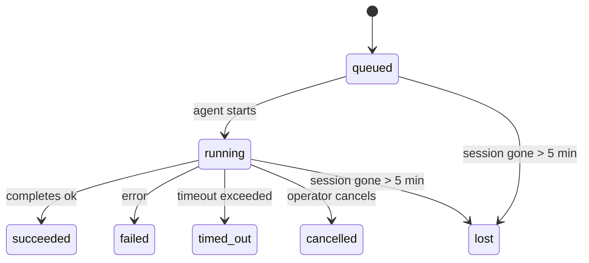

---
read_when:
    - ตรวจสอบงานเบื้องหลังที่กำลังดำเนินอยู่หรือเพิ่งเสร็จสิ้น
    - การดีบักความล้มเหลวในการส่งสำหรับการรันเอเจนต์แบบแยกออก
    - ทำความเข้าใจว่าการรันเบื้องหลังสัมพันธ์กับเซสชัน cron และ heartbeat อย่างไร
sidebarTitle: Background tasks
summary: การติดตามงานเบื้องหลังสำหรับการรัน ACP, เอเจนต์ย่อย, งาน Cron แบบแยกโดดเดี่ยว และการดำเนินการของ CLI
title: งานเบื้องหลัง
x-i18n:
    generated_at: "2026-05-10T19:21:06Z"
    model: gpt-5.5
    provider: openai
    source_hash: 5764a89634f90181d826ff3990ec8dac9538239074934d30fd446c1eb4564869
    source_path: automation/tasks.md
    workflow: 16
---

<Note>
กำลังมองหาการจัดตารางเวลาหรือไม่? ดู [ระบบอัตโนมัติและงาน](/th/automation) เพื่อเลือกกลไกที่เหมาะสม หน้านี้คือบัญชีกิจกรรมสำหรับงานเบื้องหลัง ไม่ใช่ตัวจัดตารางเวลา
</Note>

งานเบื้องหลังติดตามงานที่รัน **นอกเซสชันการสนทนาหลักของคุณ**: การรัน ACP, การสร้าง subagent, การดำเนินการ cron job แบบแยกส่วน และการดำเนินการที่เริ่มจาก CLI

งาน **ไม่ได้** แทนที่เซสชัน, cron jobs หรือ heartbeats - งานคือ **บัญชีกิจกรรม** ที่บันทึกว่างานที่แยกออกไปเกิดอะไรขึ้น เมื่อใด และสำเร็จหรือไม่

<Note>
การรัน agent ไม่ได้สร้างงานทุกครั้ง เทิร์นของ Heartbeat และแชตโต้ตอบตามปกติไม่สร้างงาน การดำเนินการ cron ทั้งหมด, การสร้าง ACP, การสร้าง subagent และคำสั่ง agent ของ CLI สร้างงาน
</Note>

## สรุปสั้น ๆ

- งานเป็น **ระเบียน** ไม่ใช่ตัวจัดตารางเวลา - cron และ heartbeat ตัดสินใจว่า _เมื่อใด_ งานจะรัน ส่วนงานติดตามว่า _เกิดอะไรขึ้น_
- ACP, subagent, cron jobs ทั้งหมด และการดำเนินการ CLI สร้างงาน เทิร์นของ Heartbeat ไม่สร้างงาน
- แต่ละงานเคลื่อนผ่าน `queued → running → terminal` (succeeded, failed, timed_out, cancelled หรือ lost)
- งาน Cron ยังคง live อยู่ตราบใดที่ cron runtime ยังเป็นเจ้าของงานนั้นอยู่ หากสถานะ runtime ในหน่วยความจำหายไป การบำรุงรักษางานจะตรวจสอบประวัติการรัน cron แบบ durable ก่อนทำเครื่องหมายงานว่า lost
- การเสร็จสิ้นขับเคลื่อนด้วยการ push: งานที่แยกออกไปสามารถแจ้งโดยตรงหรือปลุกเซสชัน/Heartbeat ของผู้ร้องขอเมื่อเสร็จสิ้น ดังนั้นลูป polling สถานะจึงมักไม่ใช่รูปแบบที่เหมาะสม
- การรัน cron แบบแยกส่วนและการเสร็จสิ้นของ subagent จะพยายามทำความสะอาดแท็บเบราว์เซอร์/โปรเซสที่ติดตามไว้สำหรับเซสชันลูกของตนอย่างดีที่สุดก่อนทำบัญชีการล้างขั้นสุดท้าย
- การส่งมอบ cron แบบแยกส่วนจะระงับการตอบกลับชั่วคราวที่ล้าสมัยจาก parent ขณะที่งาน subagent ลูกหลานยังระบายอยู่ และจะเลือกเอาต์พุตสุดท้ายจากลูกหลานเมื่อมาถึงก่อนการส่งมอบ
- การแจ้งเตือนการเสร็จสิ้นจะถูกส่งโดยตรงไปยังช่องทางหรือเข้าคิวไว้สำหรับ Heartbeat ถัดไป
- `openclaw tasks list` แสดงงานทั้งหมด; `openclaw tasks audit` แสดงปัญหา
- ระเบียน terminal จะถูกเก็บไว้ 7 วัน แล้วถูกลบโดยอัตโนมัติ

## เริ่มต้นอย่างรวดเร็ว

<Tabs>
  <Tab title="List and filter">
    ```bash
    # List all tasks (newest first)
    openclaw tasks list

    # Filter by runtime or status
    openclaw tasks list --runtime acp
    openclaw tasks list --status running
    ```

  </Tab>
  <Tab title="Inspect">
    ```bash
    # Show details for a specific task (by ID, run ID, or session key)
    openclaw tasks show <lookup>
    ```
  </Tab>
  <Tab title="Cancel and notify">
    ```bash
    # Cancel a running task (kills the child session)
    openclaw tasks cancel <lookup>

    # Change notification policy for a task
    openclaw tasks notify <lookup> state_changes
    ```

  </Tab>
  <Tab title="Audit and maintenance">
    ```bash
    # Run a health audit
    openclaw tasks audit

    # Preview or apply maintenance
    openclaw tasks maintenance
    openclaw tasks maintenance --apply
    ```

  </Tab>
  <Tab title="Task flow">
    ```bash
    # Inspect TaskFlow state
    openclaw tasks flow list
    openclaw tasks flow show <lookup>
    openclaw tasks flow cancel <lookup>
    ```
  </Tab>
</Tabs>

## สิ่งที่สร้างงาน

| แหล่งที่มา              | ประเภท runtime | เวลาที่สร้างระเบียนงาน                                  | นโยบายแจ้งเตือนเริ่มต้น |
| ---------------------- | ------------ | ------------------------------------------------------ | --------------------- |
| การรัน ACP เบื้องหลัง    | `acp`        | การสร้างเซสชัน ACP ลูก                                | `done_only`           |
| การจัดการ subagent | `subagent`   | การสร้าง subagent ผ่าน `sessions_spawn`               | `done_only`           |
| Cron jobs (ทุกประเภท)  | `cron`       | ทุกการดำเนินการ cron (เซสชันหลักและแบบแยกส่วน)       | `silent`              |
| การดำเนินการ CLI         | `cli`        | คำสั่ง `openclaw agent` ที่รันผ่าน Gateway | `silent`              |
| งานสื่อของ agent       | `cli`        | การรัน `music_generate`/`video_generate` ที่มีเซสชันหนุนหลัง  | `silent`              |

<AccordionGroup>
  <Accordion title="Notify defaults for cron and media">
    งาน cron ในเซสชันหลักใช้นโยบายแจ้งเตือน `silent` เป็นค่าเริ่มต้น - งานเหล่านี้สร้างระเบียนสำหรับการติดตามแต่ไม่สร้างการแจ้งเตือน งาน cron แบบแยกส่วนยังมีค่าเริ่มต้นเป็น `silent` เช่นกัน แต่มองเห็นได้ชัดกว่าเพราะรันในเซสชันของตนเอง

    การรัน `music_generate` และ `video_generate` ที่มีเซสชันหนุนหลังก็ใช้นโยบายแจ้งเตือน `silent` เช่นกัน งานเหล่านี้ยังคงสร้างระเบียนงาน แต่การเสร็จสิ้นจะถูกส่งกลับไปยังเซสชัน agent เดิมเป็นการปลุกภายใน เพื่อให้ agent เขียนข้อความติดตามผลและแนบสื่อที่เสร็จแล้วด้วยตนเอง การเสร็จสิ้นของกลุ่ม/ช่องทางเป็นไปตามนโยบายการตอบกลับที่มองเห็นได้ตามปกติ ดังนั้น agent จะใช้ message tool เมื่อการส่งมอบจากต้นทางต้องใช้ หาก completion agent สร้างหลักฐานการส่งมอบด้วย message-tool ไม่สำเร็จในเส้นทางแบบ tool-only, OpenClaw จะส่ง fallback การเสร็จสิ้นโดยตรงไปยังช่องทางเดิมแทนการปล่อยให้สื่อเป็นส่วนตัว

  </Accordion>
  <Accordion title="Concurrent video_generate guardrail">
    ขณะที่งาน `video_generate` ที่มีเซสชันหนุนหลังยังทำงานอยู่ เครื่องมือนี้จะทำหน้าที่เป็น guardrail ด้วย: การเรียก `video_generate` ซ้ำในเซสชันเดียวกันจะส่งคืนสถานะงานที่ active อยู่แทนที่จะเริ่มการสร้างรายการที่สองพร้อมกัน ใช้ `action: "status"` เมื่อต้องการค้นหาความคืบหน้า/สถานะอย่างชัดเจนจากฝั่ง agent
  </Accordion>
  <Accordion title="What does not create tasks">
    - เทิร์นของ Heartbeat - เซสชันหลัก; ดู [Heartbeat](/th/gateway/heartbeat)
    - เทิร์นแชตโต้ตอบตามปกติ
    - การตอบกลับ `/command` โดยตรง

  </Accordion>
</AccordionGroup>

## วงจรชีวิตของงาน



| สถานะ      | ความหมาย                                                              |
| ----------- | -------------------------------------------------------------------------- |
| `queued`    | สร้างแล้ว กำลังรอให้ agent เริ่ม                                    |
| `running`   | เทิร์นของ agent กำลังดำเนินการอยู่                                           |
| `succeeded` | เสร็จสมบูรณ์เรียบร้อย                                                     |
| `failed`    | เสร็จสิ้นพร้อมข้อผิดพลาด                                                    |
| `timed_out` | เกินเวลาหมดเวลาที่กำหนดไว้                                            |
| `cancelled` | ถูกหยุดโดยผู้ปฏิบัติงานผ่าน `openclaw tasks cancel`                        |
| `lost`      | runtime สูญเสียสถานะ backing ที่เป็น authority หลังระยะผ่อนผัน 5 นาที |

การเปลี่ยนสถานะเกิดขึ้นโดยอัตโนมัติ - เมื่อการรัน agent ที่เกี่ยวข้องจบลง สถานะงานจะอัปเดตให้ตรงกัน

การเสร็จสิ้นของการรัน agent เป็น authority สำหรับระเบียนงานที่ active อยู่ การรันแบบแยกออกไปที่สำเร็จจะ finalize เป็น `succeeded`, ข้อผิดพลาดของการรันทั่วไปจะ finalize เป็น `failed` และผลลัพธ์ timeout หรือ abort จะ finalize เป็น `timed_out` หากผู้ปฏิบัติงานยกเลิกงานไปแล้ว หรือ runtime บันทึกสถานะ terminal ที่แรงกว่าไว้แล้ว เช่น `failed`, `timed_out` หรือ `lost` สัญญาณสำเร็จที่มาภายหลังจะไม่ลดระดับสถานะ terminal นั้น

`lost` รับรู้ runtime:

- งาน ACP: เมตาดาต้าเซสชัน ACP ลูกที่เป็น backing หายไป
- งาน subagent: เซสชันลูกที่เป็น backing หายไปจาก target agent store
- งาน Cron: cron runtime ไม่ติดตามงานว่า active อีกต่อไป และประวัติการรัน cron แบบ durable ไม่แสดงผลลัพธ์ terminal สำหรับการรันนั้น การ audit ด้วย CLI แบบออฟไลน์จะไม่ถือว่าสถานะ cron runtime ในโปรเซสของตนที่ว่างเปล่าเป็น authority
- งาน CLI: งานที่มี run id/source id ใช้บริบทการรัน live ดังนั้นแถว child-session หรือ chat-session ที่ค้างอยู่จะไม่ทำให้งานเหล่านี้ยังมีชีวิตหลังจากการรันที่ Gateway เป็นเจ้าของหายไป งาน CLI รุ่นเก่าที่ไม่มี identity ของการรันยังคง fallback ไปยังเซสชันลูก การรัน `openclaw agent` ที่มี Gateway หนุนหลังก็ finalize จากผลลัพธ์การรันของตัวเองด้วย ดังนั้นการรันที่เสร็จแล้วจะไม่ค้าง active จนกว่า sweeper จะทำเครื่องหมายเป็น `lost`

## การส่งมอบและการแจ้งเตือน

เมื่องานถึงสถานะ terminal, OpenClaw จะแจ้งคุณ มีเส้นทางการส่งมอบสองแบบ:

**การส่งมอบโดยตรง** - หากงานมีเป้าหมายช่องทาง (`requesterOrigin`) ข้อความการเสร็จสิ้นจะไปยังช่องทางนั้นโดยตรง (Telegram, Discord, Slack ฯลฯ) การเสร็จสิ้นของงานกลุ่มและช่องทางจะถูก route ผ่านเซสชันของผู้ร้องขอแทน เพื่อให้ parent agent เขียนคำตอบที่มองเห็นได้ สำหรับการเสร็จสิ้นของ subagent, OpenClaw ยังรักษา thread/topic routing ที่ผูกไว้เมื่อมีอยู่ และสามารถเติม `to` / account ที่ขาดหายไปจาก route ที่จัดเก็บไว้ของเซสชันผู้ร้องขอ (`lastChannel` / `lastTo` / `lastAccountId`) ก่อนยอมแพ้กับการส่งมอบโดยตรง

**การส่งมอบแบบเข้าคิวในเซสชัน** - หากการส่งมอบโดยตรงล้มเหลวหรือไม่ได้ตั้ง origin การอัปเดตจะถูกเข้าคิวเป็น system event ในเซสชันของผู้ร้องขอ และปรากฏใน Heartbeat ถัดไป

<Tip>
การเสร็จสิ้นของงานจะเรียกการปลุก Heartbeat ทันทีเพื่อให้คุณเห็นผลลัพธ์อย่างรวดเร็ว - คุณไม่จำเป็นต้องรอ tick ของ Heartbeat ที่จัดตารางไว้ถัดไป
</Tip>

นั่นหมายความว่า workflow ปกติเป็นแบบ push-based: เริ่มงานที่แยกออกไปหนึ่งครั้ง จากนั้นให้ runtime ปลุกหรือแจ้งคุณเมื่อเสร็จสิ้น Poll สถานะงานเฉพาะเมื่อต้องการ debug, แทรกแซง หรือทำ audit อย่างชัดเจน

### นโยบายการแจ้งเตือน

ควบคุมว่าคุณจะได้ยินเรื่องแต่ละงานมากน้อยเพียงใด:

| นโยบาย                | สิ่งที่ถูกส่งมอบ                                                       |
| --------------------- | ----------------------------------------------------------------------- |
| `done_only` (ค่าเริ่มต้น) | เฉพาะสถานะ terminal (succeeded, failed ฯลฯ) - **นี่คือค่าเริ่มต้น** |
| `state_changes`       | ทุกการเปลี่ยนสถานะและการอัปเดตความคืบหน้า                              |
| `silent`              | ไม่มีอะไรเลย                                                          |

เปลี่ยนนโยบายขณะที่งานกำลังรัน:

```bash
openclaw tasks notify <lookup> state_changes
```

## อ้างอิง CLI

<AccordionGroup>
  <Accordion title="tasks list">
    ```bash
    openclaw tasks list [--runtime <acp|subagent|cron|cli>] [--status <status>] [--json]
    ```

    คอลัมน์เอาต์พุต: Task ID, Kind, Status, Delivery, Run ID, Child Session, Summary

  </Accordion>
  <Accordion title="tasks show">
    ```bash
    openclaw tasks show <lookup>
    ```

    โทเค็น lookup รับ task ID, run ID หรือ session key แสดงระเบียนเต็ม รวมถึงเวลา สถานะการส่งมอบ ข้อผิดพลาด และสรุป terminal

  </Accordion>
  <Accordion title="tasks cancel">
    ```bash
    openclaw tasks cancel <lookup>
    ```

    สำหรับงาน ACP และ subagent คำสั่งนี้จะ kill เซสชันลูก สำหรับงานที่ CLI ติดตาม การยกเลิกจะถูกบันทึกใน task registry (ไม่มี child runtime handle แยกต่างหาก) สถานะจะเปลี่ยนเป็น `cancelled` และส่งการแจ้งเตือนการส่งมอบเมื่อเกี่ยวข้อง

  </Accordion>
  <Accordion title="tasks notify">
    ```bash
    openclaw tasks notify <lookup> <done_only|state_changes|silent>
    ```
  </Accordion>
  <Accordion title="tasks audit">
    ```bash
    openclaw tasks audit [--json]
    ```

    แสดงปัญหาด้านการปฏิบัติการ Findings จะปรากฏใน `openclaw status` ด้วยเมื่อตรวจพบปัญหา

    | ผลการตรวจพบ               | ความรุนแรง | ตัวกระตุ้น                                                                                                      |
    | ------------------------- | ---------- | ------------------------------------------------------------------------------------------------------------ |
    | `stale_queued`            | warn       | อยู่ในคิวเกิน 10 นาที                                                                              |
    | `stale_running`           | error      | กำลังทำงานเกิน 30 นาที                                                                             |
    | `lost`                    | warn/error | ความเป็นเจ้าของงานที่มีรันไทม์รองรับหายไป; งานที่สูญหายซึ่งยังคงอยู่จะแจ้งเตือนจนถึง `cleanupAfter` แล้วจึงกลายเป็นข้อผิดพลาด |
    | `delivery_failed`         | warn       | การส่งล้มเหลวและนโยบายการแจ้งเตือนไม่ใช่ `silent`                                                            |
    | `missing_cleanup`         | warn       | งานปลายทางที่ไม่มีเวลาประทับการล้างข้อมูล                                                                      |
    | `inconsistent_timestamps` | warn       | การละเมิดไทม์ไลน์ (เช่น สิ้นสุดก่อนเริ่มต้น)                                                        |

  </Accordion>
  <Accordion title="การบำรุงรักษา tasks">
    ```bash
    openclaw tasks maintenance [--json]
    openclaw tasks maintenance --apply [--json]
    ```

    ใช้คำสั่งนี้เพื่อดูตัวอย่างหรือใช้การกระทบยอด การประทับเวลาการล้างข้อมูล และการตัดข้อมูลสำหรับงาน สถานะ Task Flow และแถวรีจิสทรีเซสชันการรัน cron ที่ล้าสมัย

    การกระทบยอดรับรู้รันไทม์:

    - งาน ACP/subagent ตรวจสอบเซสชันลูกที่รองรับงานนั้น
    - งาน subagent ที่เซสชันลูกมี tombstone สำหรับการกู้คืนหลังรีสตาร์ตจะถูกทำเครื่องหมายว่าสูญหาย แทนที่จะถูกถือว่าเป็นเซสชันรองรับที่กู้คืนได้
    - งาน Cron ตรวจสอบว่ารันไทม์ cron ยังเป็นเจ้าของงานอยู่หรือไม่ จากนั้นกู้คืนสถานะปลายทางจากบันทึกการรัน cron/สถานะงานที่คงอยู่ ก่อนจะย้อนกลับไปเป็น `lost` เฉพาะกระบวนการ Gateway เท่านั้นที่เป็นแหล่งอ้างอิงสำหรับชุด active-job ของ cron ในหน่วยความจำ; การตรวจสอบ CLI แบบออฟไลน์ใช้ประวัติที่คงทน แต่จะไม่ทำเครื่องหมายงาน cron ว่าสูญหายเพียงเพราะ Set ภายในเครื่องนั้นว่างเปล่า
    - งาน CLI ที่มีตัวตนการรันจะตรวจสอบบริบทการรันสดที่เป็นเจ้าของ ไม่ใช่แค่แถว child-session หรือ chat-session

    การล้างข้อมูลเมื่อเสร็จสิ้นก็รับรู้รันไทม์เช่นกัน:

    - เมื่อ subagent เสร็จสิ้น ระบบจะพยายามปิดแท็บเบราว์เซอร์/กระบวนการที่ติดตามไว้สำหรับเซสชันลูก ก่อนที่การล้างข้อมูลประกาศจะดำเนินต่อ
    - เมื่อ cron แบบแยกเสร็จสิ้น ระบบจะพยายามปิดแท็บเบราว์เซอร์/กระบวนการที่ติดตามไว้สำหรับเซสชัน cron ก่อนที่การรันจะถูกรื้อถอนทั้งหมด
    - การส่งของ cron แบบแยกจะรอการติดตามผลจาก subagent ลูกหลานเมื่อจำเป็น และระงับข้อความยืนยันจากแม่ที่ล้าสมัยแทนการประกาศข้อความนั้น
    - การส่งเมื่อ subagent เสร็จสิ้นจะเลือกใช้ข้อความผู้ช่วยที่มองเห็นล่าสุด; หากว่างเปล่า จะย้อนกลับไปใช้ข้อความ tool/toolResult ล่าสุดที่ผ่านการล้างแล้ว และการรัน tool-call ที่หมดเวลาเท่านั้นสามารถยุบเป็นสรุปความคืบหน้าบางส่วนแบบสั้นได้ การรันที่ล้มเหลวในสถานะปลายทางจะประกาศสถานะความล้มเหลวโดยไม่เล่นซ้ำข้อความตอบกลับที่บันทึกไว้
    - ความล้มเหลวในการล้างข้อมูลจะไม่บดบังผลลัพธ์จริงของงาน

    เมื่อใช้การบำรุงรักษา OpenClaw ยังลบแถวรีจิสทรีเซสชัน `cron:<jobId>:run:<uuid>` ที่ล้าสมัยและมีอายุมากกว่า 7 วัน โดยยังคงเก็บแถวสำหรับงาน cron ที่กำลังทำงานอยู่ และไม่แตะแถวเซสชันที่ไม่ใช่ cron

  </Accordion>
  <Accordion title="รายการ | แสดง | ยกเลิก flow ของ tasks">
    ```bash
    openclaw tasks flow list [--status <status>] [--json]
    openclaw tasks flow show <lookup> [--json]
    openclaw tasks flow cancel <lookup>
    ```

    ใช้คำสั่งเหล่านี้เมื่อ Task Flow ที่ทำหน้าที่ประสานงานคือสิ่งที่คุณสนใจ มากกว่าระเบียนงานเบื้องหลังรายการเดียว

  </Accordion>
</AccordionGroup>

## กระดานงานของแชท (`/tasks`)

ใช้ `/tasks` ในเซสชันแชทใดก็ได้เพื่อดูงานเบื้องหลังที่เชื่อมโยงกับเซสชันนั้น กระดานจะแสดงงานที่กำลังทำงานอยู่และงานที่เพิ่งเสร็จสิ้น พร้อมรันไทม์ สถานะ เวลา และรายละเอียดความคืบหน้าหรือข้อผิดพลาด

เมื่อเซสชันปัจจุบันไม่มีงานที่เชื่อมโยงซึ่งมองเห็นได้ `/tasks` จะย้อนกลับไปใช้จำนวนงานภายใน agent เพื่อให้คุณยังได้ภาพรวมโดยไม่เปิดเผยรายละเอียดของเซสชันอื่น

สำหรับสมุดบัญชีผู้ปฏิบัติงานฉบับเต็ม ให้ใช้ CLI: `openclaw tasks list`

## การผสานสถานะ (แรงกดดันของงาน)

`openclaw status` มีสรุปงานแบบดูได้ทันที:

```
Tasks: 3 queued · 2 running · 1 issues
```

สรุปรายงาน:

- **active** - จำนวนของ `queued` + `running`
- **failures** - จำนวนของ `failed` + `timed_out` + `lost`
- **byRuntime** - รายละเอียดแยกตาม `acp`, `subagent`, `cron`, `cli`

ทั้ง `/status` และเครื่องมือ `session_status` ใช้สแนปชอตงานที่รับรู้การล้างข้อมูล: งานที่กำลังทำงานจะถูกให้ความสำคัญ แถวที่เสร็จสิ้นแล้วซึ่งล้าสมัยจะถูกซ่อน และความล้มเหลวล่าสุดจะแสดงเฉพาะเมื่อไม่มีงานที่กำลังทำงานเหลืออยู่ วิธีนี้ทำให้การ์ดสถานะโฟกัสกับสิ่งที่สำคัญในตอนนี้

## พื้นที่จัดเก็บและการบำรุงรักษา

### งานอยู่ที่ไหน

ระเบียนงานคงอยู่ใน SQLite ที่:

```
$OPENCLAW_STATE_DIR/tasks/runs.sqlite
```

รีจิสทรีโหลดเข้าสู่หน่วยความจำเมื่อ Gateway เริ่มทำงาน และซิงค์การเขียนไปยัง SQLite เพื่อความคงทนข้ามการรีสตาร์ต
Gateway จำกัดขนาดบันทึก write-ahead ของ SQLite โดยใช้เกณฑ์ autocheckpoint เริ่มต้นของ SQLite พร้อมกับ checkpoint แบบ `TRUNCATE` เป็นระยะและเมื่อปิดระบบ

### การบำรุงรักษาอัตโนมัติ

sweeper ทำงานทุก **60 วินาที** และจัดการสี่อย่าง:

<Steps>
  <Step title="การกระทบยอด">
    ตรวจสอบว่างานที่กำลังทำงานยังมีการรองรับจากรันไทม์ที่เชื่อถือได้หรือไม่ งาน ACP/subagent ใช้สถานะ child-session งาน cron ใช้ความเป็นเจ้าของ active-job และงาน CLI ที่มีตัวตนการรันใช้บริบทการรันที่เป็นเจ้าของ หากสถานะรองรับนั้นหายไปเกิน 5 นาที งานจะถูกทำเครื่องหมายเป็น `lost`
  </Step>
  <Step title="การซ่อมแซมเซสชัน ACP">
    ปิดเซสชัน ACP แบบ one-shot ที่มีแม่เป็นเจ้าของซึ่งอยู่ในสถานะปลายทางหรือกำพร้า และปิดเซสชัน ACP แบบ persistent ที่ล้าสมัยในสถานะปลายทางหรือกำพร้า เฉพาะเมื่อไม่มีการผูกกับบทสนทนาที่กำลังทำงานเหลืออยู่
  </Step>
  <Step title="การประทับเวลาการล้างข้อมูล">
    ตั้งเวลาประทับ `cleanupAfter` บนงานปลายทาง (endedAt + 7 วัน) ระหว่างช่วงเก็บรักษา งานที่สูญหายยังปรากฏในการตรวจสอบเป็นคำเตือน; หลังจาก `cleanupAfter` หมดอายุ หรือเมื่อข้อมูลเมตาการล้างข้อมูลหายไป งานเหล่านั้นจะเป็นข้อผิดพลาด
  </Step>
  <Step title="การตัดข้อมูล">
    ลบระเบียนที่เลยวันที่ `cleanupAfter`
  </Step>
</Steps>

<Note>
**การเก็บรักษา:** ระเบียนงานปลายทางจะถูกเก็บไว้ **7 วัน** แล้วจึงถูกตัดออกโดยอัตโนมัติ ไม่ต้องกำหนดค่า
</Note>

## งานสัมพันธ์กับระบบอื่นอย่างไร

<AccordionGroup>
  <Accordion title="งานและ Task Flow">
    [Task Flow](/th/automation/taskflow) คือชั้นการประสาน flow ที่อยู่เหนือกว่างานเบื้องหลัง flow เดียวอาจประสานงานหลายงานตลอดอายุการทำงานของมันโดยใช้โหมดซิงค์แบบจัดการหรือแบบสะท้อน ใช้ `openclaw tasks` เพื่อตรวจสอบระเบียนงานแต่ละรายการ และ `openclaw tasks flow` เพื่อตรวจสอบ flow ที่ทำหน้าที่ประสานงาน

    ดูรายละเอียดที่ [Task Flow](/th/automation/taskflow)

  </Accordion>
  <Accordion title="งานและ cron">
    **นิยาม** ของงาน cron อยู่ใน `~/.openclaw/cron/jobs.json`; สถานะการทำงานของรันไทม์อยู่ข้างกันใน `~/.openclaw/cron/jobs-state.json` การดำเนินการ cron **ทุกครั้ง** จะสร้างระเบียนงาน ทั้งแบบ main-session และแบบแยก งาน cron แบบ main-session ใช้นโยบายแจ้งเตือน `silent` เป็นค่าเริ่มต้น เพื่อให้ติดตามได้โดยไม่สร้างการแจ้งเตือน

    ดู [งาน Cron](/th/automation/cron-jobs)

  </Accordion>
  <Accordion title="งานและ Heartbeat">
    การรัน Heartbeat เป็น turn ของ main-session โดยไม่สร้างระเบียนงาน เมื่องานเสร็จสิ้น งานนั้นสามารถกระตุ้นการปลุก Heartbeat เพื่อให้คุณเห็นผลลัพธ์ได้อย่างรวดเร็ว

    ดู [Heartbeat](/th/gateway/heartbeat)

  </Accordion>
  <Accordion title="งานและเซสชัน">
    งานอาจอ้างอิง `childSessionKey` (ที่งานทำงานอยู่) และ `requesterSessionKey` (ผู้เริ่มงาน) เซสชันคือบริบทบทสนทนา; งานคือการติดตามกิจกรรมที่อยู่บนบริบทนั้น
  </Accordion>
  <Accordion title="งานและการรันของ agent">
    `runId` ของงานเชื่อมโยงกับการรันของ agent ที่ทำงานนั้น เหตุการณ์วงจรชีวิตของ agent (เริ่มต้น สิ้นสุด ข้อผิดพลาด) จะอัปเดตสถานะงานโดยอัตโนมัติ คุณไม่จำเป็นต้องจัดการวงจรชีวิตด้วยตนเอง
  </Accordion>
</AccordionGroup>

## ที่เกี่ยวข้อง

- [ระบบอัตโนมัติและงาน](/th/automation) - กลไกอัตโนมัติทั้งหมดโดยสรุป
- [CLI: งาน](/th/cli/tasks) - อ้างอิงคำสั่ง CLI
- [Heartbeat](/th/gateway/heartbeat) - turn ของ main-session เป็นระยะ
- [งานที่กำหนดเวลาไว้](/th/automation/cron-jobs) - การกำหนดเวลางานเบื้องหลัง
- [Task Flow](/th/automation/taskflow) - การประสาน flow เหนืองาน
