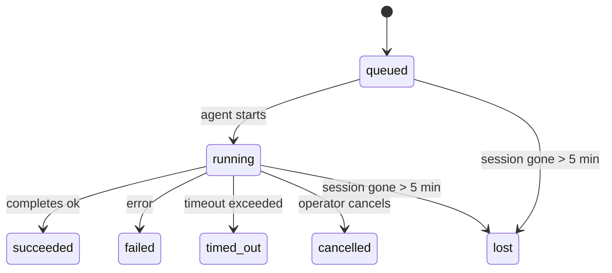

---
read_when:
    - กำลังตรวจสอบงานเบื้องหลังที่กำลังดำเนินอยู่หรือเพิ่งเสร็จสิ้น مؤخراً
    - การดีบักความล้มเหลวในการส่งมอบสำหรับการรันเอเจนต์แบบแยกออกจากกัน
    - ทำความเข้าใจว่าการรันเบื้องหลังเกี่ยวข้องกับเซสชัน Cron และ Heartbeat อย่างไร
sidebarTitle: Background tasks
summary: การติดตามงานเบื้องหลังสำหรับการรัน ACP, ซับเอเจนต์, งาน Cron แบบแยกส่วน และการดำเนินการของ CLI
title: งานเบื้องหลัง
x-i18n:
    generated_at: "2026-04-26T11:22:52Z"
    model: gpt-5.4
    provider: openai
    source_hash: 46952a378babdee9f43102bfa71dbd35b6ca7ecb142ffce3785eeb479e19d6b6
    source_path: automation/tasks.md
    workflow: 15
---

<Note>
กำลังมองหาเรื่องการตั้งเวลาอยู่หรือไม่? ดู [Automation & Tasks](/th/automation) เพื่อเลือกกลไกที่เหมาะสม หน้านี้ครอบคลุมเรื่องการ**ติดตาม**งานเบืองหลัง ไม่ใช่การตั้งเวลาให้กับงานเหล่านั้น
</Note>

งานเบื้องหลังใช้ติดตามงานที่ทำงาน**นอกเซสชันการสนทนาหลักของคุณ**: การรัน ACP, การสร้างซับเอเจนต์, การรันงาน Cron แบบแยกส่วน และการดำเนินการที่เริ่มจาก CLI

Tasks **ไม่ได้**มาแทนที่เซสชัน งาน Cron หรือ Heartbeat — แต่เป็น**บันทึกกิจกรรม**ที่เก็บว่างานแบบแยกส่วนใดเกิดขึ้น เมื่อใด และสำเร็จหรือไม่

<Note>
ไม่ใช่ทุกการรันของเอเจนต์ที่จะสร้าง task โดย Heartbeat turn และแชตโต้ตอบแบบปกติจะไม่สร้าง แต่การรัน Cron ทั้งหมด, การสร้าง ACP, การสร้างซับเอเจนต์ และคำสั่งเอเจนต์จาก CLI จะสร้างทั้งหมด
</Note>

## สรุปสั้น ๆ

- Tasks เป็น**ระเบียน** ไม่ใช่ตัวจัดตารางเวลา — Cron และ Heartbeat เป็นตัวตัดสินใจว่าเมื่อใดงานจะทำงาน ส่วน tasks ใช้ติดตามว่า_เกิดอะไรขึ้น_
- ACP, ซับเอเจนต์, งาน Cron ทั้งหมด และการดำเนินการผ่าน CLI จะสร้าง task ส่วน Heartbeat turn จะไม่สร้าง
- แต่ละ task จะเปลี่ยนสถานะผ่าน `queued → running → terminal` (succeeded, failed, timed_out, cancelled หรือ lost)
- Cron task จะยังคง active อยู่ตราบใดที่รันไทม์ Cron ยังเป็นเจ้าของงานนั้นอยู่; หากสถานะรันไทม์ในหน่วยความจำหายไป การบำรุงรักษา task จะตรวจสอบประวัติการรัน Cron แบบถาวรก่อนทำเครื่องหมาย task ว่า lost
- การแจ้งเมื่อเสร็จสิ้นเป็นแบบ push-driven: งานแบบแยกส่วนสามารถแจ้งได้โดยตรง หรือปลุกเซสชัน/Heartbeat ของผู้ร้องขอเมื่อเสร็จสิ้น ดังนั้นลูป polling สถานะจึงมักไม่ใช่รูปแบบที่เหมาะสม
- การรัน Cron แบบแยกส่วนและการเสร็จสิ้นของซับเอเจนต์จะพยายามทำความสะอาดแท็บ/โปรเซสของเบราว์เซอร์ที่ติดตามไว้สำหรับเซสชันลูกก่อนขั้นตอนบันทึกการ cleanup ขั้นสุดท้าย
- การส่งมอบของ Cron แบบแยกส่วนจะระงับการตอบกลับระหว่างทางของ parent ที่ล้าสมัย ขณะที่งานซับเอเจนต์ลูกหลานยังระบายงานไม่เสร็จ และจะให้ความสำคัญกับผลลัพธ์สุดท้ายจากลูกหลานหากมาถึงก่อนการส่งมอบ
- การแจ้งเมื่อเสร็จสิ้นจะถูกส่งตรงไปยังแชนเนล หรือเข้าคิวไว้สำหรับ Heartbeat ครั้งถัดไป
- `openclaw tasks list` จะแสดง task ทั้งหมด; `openclaw tasks audit` จะแสดงปัญหาต่าง ๆ
- ระเบียน terminal จะถูกเก็บไว้ 7 วัน จากนั้นจะถูกลบออกอัตโนมัติ

## เริ่มต้นอย่างรวดเร็ว

<Tabs>
  <Tab title="แสดงรายการและกรอง">
    ```bash
    # แสดง task ทั้งหมด (ใหม่สุดก่อน)
    openclaw tasks list

    # กรองตามรันไทม์หรือสถานะ
    openclaw tasks list --runtime acp
    openclaw tasks list --status running
    ```

  </Tab>
  <Tab title="ตรวจสอบ">
    ```bash
    # แสดงรายละเอียดของ task เฉพาะรายการหนึ่ง (ตาม ID, run ID หรือ session key)
    openclaw tasks show <lookup>
    ```
  </Tab>
  <Tab title="ยกเลิกและแจ้งเตือน">
    ```bash
    # ยกเลิก task ที่กำลังทำงานอยู่ (จะ kill เซสชันลูก)
    openclaw tasks cancel <lookup>

    # เปลี่ยนนโยบายการแจ้งเตือนสำหรับ task
    openclaw tasks notify <lookup> state_changes
    ```

  </Tab>
  <Tab title="การตรวจสอบและการบำรุงรักษา">
    ```bash
    # เรียกใช้การตรวจสอบสถานะ
    openclaw tasks audit

    # ดูตัวอย่างหรือใช้การบำรุงรักษา
    openclaw tasks maintenance
    openclaw tasks maintenance --apply
    ```

  </Tab>
  <Tab title="ลำดับงานของ TaskFlow">
    ```bash
    # ตรวจสอบสถานะของ TaskFlow
    openclaw tasks flow list
    openclaw tasks flow show <lookup>
    openclaw tasks flow cancel <lookup>
    ```
  </Tab>
</Tabs>

## อะไรบ้างที่สร้าง task

| แหล่งที่มา                | ประเภทรันไทม์ | เวลาที่สร้างระเบียน task                           | นโยบายการแจ้งเตือนเริ่มต้น |
| ------------------------- | ------------- | --------------------------------------------------- | --------------------------- |
| การรันเบื้องหลังของ ACP   | `acp`         | เมื่อสร้างเซสชัน ACP ลูก                            | `done_only`                 |
| การประสานงานซับเอเจนต์    | `subagent`    | เมื่อสร้างซับเอเจนต์ผ่าน `sessions_spawn`           | `done_only`                 |
| งาน Cron (ทุกประเภท)      | `cron`        | ทุกครั้งที่มีการรัน Cron (ทั้ง main-session และ isolated) | `silent`                    |
| การดำเนินการผ่าน CLI      | `cli`         | คำสั่ง `openclaw agent` ที่ทำงานผ่าน gateway        | `silent`                    |
| งานสื่อของเอเจนต์         | `cli`         | การรัน `video_generate` ที่มีเซสชันรองรับ           | `silent`                    |

<AccordionGroup>
  <Accordion title="ค่าเริ่มต้นของการแจ้งเตือนสำหรับ Cron และสื่อ">
    Main-session Cron tasks ใช้นโยบายการแจ้งเตือน `silent` โดยค่าเริ่มต้น — กล่าวคือจะสร้างระเบียนไว้เพื่อติดตาม แต่จะไม่สร้างการแจ้งเตือน Isolated Cron tasks ก็ใช้ `silent` โดยค่าเริ่มต้นเช่นกัน แต่จะมองเห็นได้ชัดกว่าเพราะทำงานในเซสชันของตัวเอง

    การรัน `video_generate` ที่มีเซสชันรองรับก็ใช้นโยบายการแจ้งเตือน `silent` เช่นกัน โดยยังคงสร้างระเบียน task แต่การเสร็จสิ้นจะถูกส่งกลับไปยังเซสชันเอเจนต์ต้นทางในรูปแบบ internal wake เพื่อให้เอเจนต์สามารถเขียนข้อความติดตามผลและแนบวิดีโอที่เสร็จแล้วได้ด้วยตัวเอง หากคุณเลือกใช้ `tools.media.asyncCompletion.directSend` การเสร็จสิ้นแบบ async ของ `music_generate` และ `video_generate` จะพยายามส่งตรงไปยังแชนเนลก่อน แล้วจึง fallback ไปใช้เส้นทางปลุกเซสชันผู้ร้องขอ
  </Accordion>
  <Accordion title="ราวกั้นสำหรับ `video_generate` ที่ทำงานพร้อมกัน">
    ขณะที่ task `video_generate` แบบมีเซสชันรองรับยัง active อยู่ เครื่องมือนี้ยังทำหน้าที่เป็นราวกั้นด้วย: การเรียก `video_generate` ซ้ำภายในเซสชันเดียวกันจะคืนค่าสถานะของ task ที่ active อยู่ แทนที่จะเริ่มการสร้างพร้อมกันรายการที่สอง ใช้ `action: "status"` เมื่อต้องการค้นหาความคืบหน้า/สถานะแบบชัดเจนจากฝั่งเอเจนต์
  </Accordion>
  <Accordion title="สิ่งที่ไม่สร้าง task">
    - Heartbeat turn — main-session; ดู [Heartbeat](/th/gateway/heartbeat)
    - แชตโต้ตอบแบบปกติ
    - การตอบกลับ `/command` โดยตรง

  </Accordion>
</AccordionGroup>

## วงจรชีวิตของ task



| สถานะ       | ความหมาย                                                              |
| ----------- | ---------------------------------------------------------------------- |
| `queued`    | ถูกสร้างแล้ว และกำลังรอให้เอเจนต์เริ่มทำงาน                           |
| `running`   | การทำงานของเอเจนต์กำลังดำเนินการอยู่                                  |
| `succeeded` | เสร็จสิ้นสำเร็จ                                                       |
| `failed`    | เสร็จสิ้นพร้อมข้อผิดพลาด                                              |
| `timed_out` | เกินเวลาที่กำหนดไว้                                                   |
| `cancelled` | ถูกหยุดโดยผู้ปฏิบัติงานผ่าน `openclaw tasks cancel`                  |
| `lost`      | รันไทม์สูญเสียสถานะรองรับที่เชื่อถือได้หลังช่วงผ่อนผัน 5 นาที         |

การเปลี่ยนสถานะจะเกิดขึ้นโดยอัตโนมัติ — เมื่อการรันเอเจนต์ที่เกี่ยวข้องสิ้นสุดลง สถานะ task จะอัปเดตให้ตรงกัน

การเสร็จสิ้นของการรันเอเจนต์เป็นตัวชี้ขาดสำหรับระเบียน task ที่ยัง active อยู่ การรันแบบแยกส่วนที่สำเร็จจะปิดท้ายเป็น `succeeded`, ข้อผิดพลาดทั่วไปของการรันจะปิดท้ายเป็น `failed`, และผลลัพธ์แบบ timeout หรือ abort จะปิดท้ายเป็น `timed_out` หากผู้ปฏิบัติงานได้ยกเลิก task ไปแล้ว หรือรันไทม์ได้บันทึกสถานะ terminal ที่หนักแน่นกว่าไว้แล้ว เช่น `failed`, `timed_out` หรือ `lost` สัญญาณความสำเร็จที่มาภายหลังจะไม่ลดระดับสถานะ terminal นั้น

`lost` รับรู้ตามรันไทม์:

- ACP tasks: ข้อมูลเมทาดาทาของเซสชัน ACP ลูกที่รองรับหายไป
- Subagent tasks: เซสชันลูกที่รองรับหายไปจากที่เก็บเอเจนต์เป้าหมาย
- Cron tasks: รันไทม์ Cron ไม่ติดตามงานนั้นว่า active แล้ว และประวัติการรัน Cron แบบถาวรไม่ได้แสดงผลลัพธ์ terminal สำหรับการรันนั้น การ audit ของ CLI แบบออฟไลน์จะไม่ถือว่าสถานะรันไทม์ Cron ในโปรเซสของตัวเองที่ว่างเปล่าเป็นแหล่งอ้างอิงที่เชื่อถือได้
- CLI tasks: task แบบ child-session ที่แยกส่วนจะใช้เซสชันลูก; task CLI ที่รองรับด้วยแชตจะใช้ live run context แทน ดังนั้นแถว session ของ channel/group/direct ที่ยังค้างอยู่จะไม่ทำให้มัน active ต่อไป การรัน `openclaw agent` ที่รองรับด้วย gateway ก็จะปิดสถานะตามผลลัพธ์ของการรันเช่นกัน ดังนั้นการรันที่เสร็จแล้วจะไม่ค้างอยู่ในสถานะ active จนกว่า sweeper จะทำเครื่องหมายเป็น `lost`

## การส่งมอบและการแจ้งเตือน

เมื่อ task เข้าสู่สถานะ terminal แล้ว OpenClaw จะส่งการแจ้งเตือนให้คุณ โดยมีเส้นทางการส่งมอบ 2 แบบ:

**การส่งมอบโดยตรง** — หาก task มีปลายทางเป็นแชนเนล (คือ `requesterOrigin`) ข้อความแจ้งการเสร็จสิ้นจะถูกส่งตรงไปยังแชนเนลนั้น (Telegram, Discord, Slack ฯลฯ) สำหรับการเสร็จสิ้นของซับเอเจนต์ OpenClaw จะคงเส้นทาง thread/topic ที่ผูกไว้เมื่อมีให้ใช้งาน และสามารถเติมค่า `to` / บัญชีที่ขาดหายจากเส้นทางที่เก็บไว้ของเซสชันผู้ร้องขอ (`lastChannel` / `lastTo` / `lastAccountId`) ก่อนที่จะยอมแพ้การส่งมอบโดยตรง

**การส่งมอบแบบเข้าคิวในเซสชัน** — หากการส่งมอบโดยตรงล้มเหลว หรือไม่ได้กำหนด origin ไว้ การอัปเดตจะถูกเข้าคิวเป็น system event ในเซสชันของผู้ร้องขอ และจะแสดงขึ้นในการ Heartbeat ครั้งถัดไป

<Tip>
เมื่อ task เสร็จสิ้น จะมีการปลุก Heartbeat ทันที เพื่อให้คุณเห็นผลลัพธ์ได้อย่างรวดเร็ว — คุณไม่จำเป็นต้องรอจนถึงรอบ Heartbeat ตามกำหนดครั้งถัดไป
</Tip>

นั่นหมายความว่าเวิร์กโฟลว์โดยทั่วไปเป็นแบบ push-based: เริ่มงานแบบแยกส่วนเพียงครั้งเดียว แล้วปล่อยให้รันไทม์ปลุกหรือแจ้งคุณเมื่อเสร็จสิ้น ให้ polling สถานะของ task เฉพาะเมื่อคุณต้องการดีบัก แทรกแซง หรือทำ audit แบบชัดเจนเท่านั้น

### นโยบายการแจ้งเตือน

ควบคุมว่าคุณจะได้รับข้อมูลของแต่ละ task มากแค่ไหน:

| นโยบาย               | สิ่งที่จะถูกส่งมอบ                                                     |
| -------------------- | ---------------------------------------------------------------------- |
| `done_only` (ค่าเริ่มต้น) | เฉพาะสถานะ terminal (succeeded, failed ฯลฯ) — **นี่คือค่าเริ่มต้น** |
| `state_changes`      | ทุกการเปลี่ยนสถานะและการอัปเดตความคืบหน้า                           |
| `silent`             | ไม่ส่งอะไรเลย                                                          |

เปลี่ยนนโยบายระหว่างที่ task กำลังทำงาน:

```bash
openclaw tasks notify <lookup> state_changes
```

## อ้างอิง CLI

<AccordionGroup>
  <Accordion title="tasks list">
    ```bash
    openclaw tasks list [--runtime <acp|subagent|cron|cli>] [--status <status>] [--json]
    ```

    คอลัมน์ผลลัพธ์: Task ID, Kind, Status, Delivery, Run ID, Child Session, Summary.

  </Accordion>
  <Accordion title="tasks show">
    ```bash
    openclaw tasks show <lookup>
    ```

    โทเค็น lookup รองรับ task ID, run ID หรือ session key โดยจะแสดงระเบียนทั้งหมด รวมถึงเวลา สถานะการส่งมอบ ข้อผิดพลาด และสรุป terminal

  </Accordion>
  <Accordion title="tasks cancel">
    ```bash
    openclaw tasks cancel <lookup>
    ```

    สำหรับ ACP และ subagent tasks คำสั่งนี้จะ kill เซสชันลูก สำหรับ CLI-tracked tasks การยกเลิกจะถูกบันทึกไว้ในทะเบียน task (ไม่มี handle ของรันไทม์ลูกแยกต่างหาก) สถานะจะเปลี่ยนเป็น `cancelled` และจะมีการส่งการแจ้งเตือนเมื่อเหมาะสม

  </Accordion>
  <Accordion title="tasks notify">
    ```bash
    openclaw tasks notify <lookup> <done_only|state_changes|silent>
    ```
  </Accordion>
  <Accordion title="tasks audit">
    ```bash
    openclaw tasks audit [--json]
    ```

    แสดงปัญหาเชิงปฏิบัติการ Findings จะแสดงใน `openclaw status` ด้วยเมื่อมีการตรวจพบปัญหา

    | Finding                   | ระดับความรุนแรง | ทริกเกอร์                                                                                                       |
    | ------------------------- | ---------------- | ---------------------------------------------------------------------------------------------------------------- |
    | `stale_queued`            | warn             | อยู่ในสถานะ queued นานเกิน 10 นาที                                                                               |
    | `stale_running`           | error            | อยู่ในสถานะ running นานเกิน 30 นาที                                                                              |
    | `lost`                    | warn/error       | ความเป็นเจ้าของ task ที่รองรับด้วยรันไทม์หายไป; lost task ที่ยังถูกเก็บไว้จะเป็นคำเตือนจนถึง `cleanupAfter` แล้วจึงกลายเป็นข้อผิดพลาด |
    | `delivery_failed`         | warn             | การส่งมอบล้มเหลวและนโยบายการแจ้งเตือนไม่ใช่ `silent`                                                           |
    | `missing_cleanup`         | warn             | task ที่เป็น terminal แต่ไม่มีการประทับเวลา cleanup                                                              |
    | `inconsistent_timestamps` | warn             | ไทม์ไลน์ไม่สอดคล้องกัน (เช่น สิ้นสุดก่อนเริ่มต้น)                                                               |

  </Accordion>
  <Accordion title="tasks maintenance">
    ```bash
    openclaw tasks maintenance [--json]
    openclaw tasks maintenance --apply [--json]
    ```

    ใช้คำสั่งนี้เพื่อดูตัวอย่างหรือใช้การกระทบยอด การประทับ cleanup และการลบข้อมูลเก่าสำหรับ tasks และสถานะ TaskFlow

    การกระทบยอดรับรู้ตามรันไทม์:

    - ACP/subagent tasks ตรวจสอบเซสชันลูกที่รองรับ
    - Cron tasks ตรวจสอบว่ารันไทม์ Cron ยังเป็นเจ้าของงานนั้นอยู่หรือไม่ จากนั้นกู้คืนสถานะ terminal จากบันทึกการรัน Cron/สถานะงานที่เก็บถาวรก่อน fallback ไปเป็น `lost` มีเพียงโปรเซส Gateway เท่านั้นที่เป็นแหล่งอ้างอิงที่เชื่อถือได้สำหรับชุด active-job ของ Cron ในหน่วยความจำ; การ audit ของ CLI แบบออฟไลน์ใช้ประวัติแบบถาวร แต่จะไม่ทำเครื่องหมาย cron task ว่า lost เพียงเพราะ local Set นั้นว่างเปล่า
    - Chat-backed CLI tasks ตรวจสอบ live run context ที่เป็นเจ้าของ ไม่ใช่เพียงแถว chat session

    การ cleanup เมื่อเสร็จสิ้นก็รับรู้ตามรันไทม์เช่นกัน:

    - การเสร็จสิ้นของ subagent จะพยายามปิดแท็บ/โปรเซสของเบราว์เซอร์ที่ติดตามไว้สำหรับเซสชันลูกก่อน แล้วจึงดำเนินการ cleanup หลังการประกาศต่อ
    - การเสร็จสิ้นของ Cron แบบแยกส่วนจะพยายามปิดแท็บ/โปรเซสของเบราว์เซอร์ที่ติดตามไว้สำหรับเซสชัน Cron ก่อนที่การรันจะยุติลงอย่างสมบูรณ์
    - การส่งมอบของ Cron แบบแยกส่วนจะรอการติดตามผลจากซับเอเจนต์ลูกหลานเมื่อจำเป็น และจะระงับข้อความตอบรับของ parent ที่ล้าสมัยแทนการประกาศข้อความนั้น
    - การส่งมอบเมื่อ subagent เสร็จสิ้นจะให้ความสำคัญกับข้อความ assistant ล่าสุดที่มองเห็นได้; หากว่างเปล่า จะ fallback ไปใช้ข้อความ tool/toolResult ล่าสุดที่ผ่านการทำให้ปลอดภัย และการรันที่มีเพียงการเรียก tool แล้ว timeout อาจยุบเหลือสรุปความคืบหน้าบางส่วนแบบสั้น ๆ ได้ การรัน terminal ที่ failed จะประกาศสถานะความล้มเหลวโดยไม่เล่นข้อความตอบกลับที่บันทึกไว้ซ้ำ
    - ความล้มเหลวของ cleanup จะไม่บดบังผลลัพธ์จริงของ task

  </Accordion>
  <Accordion title="tasks flow list | show | cancel">
    ```bash
    openclaw tasks flow list [--status <status>] [--json]
    openclaw tasks flow show <lookup> [--json]
    openclaw tasks flow cancel <lookup>
    ```

    ใช้คำสั่งเหล่านี้เมื่อสิ่งที่คุณสนใจคือ TaskFlow ที่ทำหน้าที่ orchestration มากกว่าระเบียน background task รายการใดรายการหนึ่ง

  </Accordion>
</AccordionGroup>

## บอร์ดงานแชต (`/tasks`)

ใช้ `/tasks` ในเซสชันแชตใดก็ได้เพื่อดู background tasks ที่เชื่อมโยงกับเซสชันนั้น บอร์ดจะแสดง task ที่กำลังทำงานและที่เพิ่งเสร็จสิ้น พร้อมรันไทม์ สถานะ เวลา และรายละเอียดความคืบหน้าหรือข้อผิดพลาด

เมื่อเซสชันปัจจุบันไม่มี linked task ที่มองเห็นได้ `/tasks` จะ fallback ไปยังจำนวน task ภายในเอเจนต์ เพื่อให้คุณยังเห็นภาพรวมได้โดยไม่เปิดเผยรายละเอียดของเซสชันอื่น

สำหรับ ledger แบบเต็มสำหรับผู้ปฏิบัติงาน ให้ใช้ CLI: `openclaw tasks list`

## การผสานกับสถานะ (task pressure)

`openclaw status` มีสรุป task แบบมองแวบเดียว:

```
Tasks: 3 queued · 2 running · 1 issues
```

สรุปนี้รายงาน:

- **active** — จำนวนของ `queued` + `running`
- **failures** — จำนวนของ `failed` + `timed_out` + `lost`
- **byRuntime** — การแยกตาม `acp`, `subagent`, `cron`, `cli`

ทั้ง `/status` และเครื่องมือ `session_status` ใช้สแนปช็อต task ที่รับรู้เรื่อง cleanup: จะให้ความสำคัญกับ active tasks, ซ่อนแถวที่เสร็จสิ้นไปนานแล้ว และจะแสดงความล้มเหลวล่าสุดเฉพาะเมื่อไม่มีงาน active คงเหลืออยู่ วิธีนี้ช่วยให้การ์ดสถานะโฟกัสกับสิ่งที่สำคัญในตอนนี้

## การจัดเก็บและการบำรุงรักษา

### ตำแหน่งที่จัดเก็บ tasks

ระเบียน task จะถูกเก็บถาวรใน SQLite ที่:

```
$OPENCLAW_STATE_DIR/tasks/runs.sqlite
```

รีจิสทรีจะถูกโหลดเข้าสู่หน่วยความจำเมื่อ gateway เริ่มต้น และซิงก์การเขียนลง SQLite เพื่อความคงทนข้ามการรีสตาร์ต

### การบำรุงรักษาอัตโนมัติ

ตัว sweeper จะทำงานทุก **60 วินาที** และจัดการ 3 เรื่อง:

<Steps>
  <Step title="การกระทบยอด">
    ตรวจสอบว่า active tasks ยังมีสถานะรองรับจากรันไทม์ที่เชื่อถือได้หรือไม่ ACP/subagent tasks ใช้สถานะเซสชันลูก, cron tasks ใช้ความเป็นเจ้าของ active-job และ chat-backed CLI tasks ใช้ run context ที่เป็นเจ้าของ หากสถานะรองรับนั้นหายไปนานเกิน 5 นาที task จะถูกทำเครื่องหมายเป็น `lost`
  </Step>
  <Step title="การประทับ cleanup">
    ตั้งค่าเวลาของ `cleanupAfter` บน terminal tasks (endedAt + 7 วัน) ในช่วงเวลาการเก็บรักษา lost tasks จะยังปรากฏใน audit เป็นคำเตือน; หลังจาก `cleanupAfter` หมดอายุ หรือเมื่อเมทาดาทา cleanup หายไป จะถือเป็นข้อผิดพลาด
  </Step>
  <Step title="การลบข้อมูลเก่า">
    ลบระเบียนที่เลยวันที่ `cleanupAfter` แล้ว
  </Step>
</Steps>

<Note>
**การเก็บรักษา:** ระเบียน task แบบ terminal จะถูกเก็บไว้ **7 วัน** จากนั้นจะถูกลบออกอัตโนมัติ ไม่ต้องมีการตั้งค่าใด ๆ
</Note>

## tasks เกี่ยวข้องกับระบบอื่นอย่างไร

<AccordionGroup>
  <Accordion title="Tasks และ TaskFlow">
    [TaskFlow](/th/automation/taskflow) คือชั้น orchestration ของ flow ที่อยู่เหนือ background tasks โดย flow เดียวอาจประสานงานหลาย task ตลอดอายุการทำงานของมันโดยใช้โหมดซิงก์แบบ managed หรือ mirrored ใช้ `openclaw tasks` เพื่อตรวจสอบระเบียน task รายตัว และใช้ `openclaw tasks flow` เพื่อตรวจสอบ flow ที่ทำ orchestration

    ดูรายละเอียดใน [TaskFlow](/th/automation/taskflow)

  </Accordion>
  <Accordion title="Tasks และ Cron">
    **นิยาม**ของงาน Cron อยู่ใน `~/.openclaw/cron/jobs.json`; สถานะการทำงานของรันไทม์อยู่ถัดจากไฟล์นั้นใน `~/.openclaw/cron/jobs-state.json` การรัน Cron **ทุกครั้ง** จะสร้างระเบียน task — ทั้งแบบ main-session และแบบแยกส่วน Main-session Cron tasks ใช้นโยบายการแจ้งเตือน `silent` โดยค่าเริ่มต้น จึงติดตามได้โดยไม่สร้างการแจ้งเตือน

    ดู [Cron Jobs](/th/automation/cron-jobs)

  </Accordion>
  <Accordion title="Tasks และ Heartbeat">
    การรัน Heartbeat เป็น turn ของ main-session — จึงไม่สร้างระเบียน task เมื่อ task เสร็จสิ้น มันสามารถกระตุ้นให้เกิดการปลุก Heartbeat เพื่อให้คุณเห็นผลลัพธ์ได้อย่างรวดเร็ว

    ดู [Heartbeat](/th/gateway/heartbeat)

  </Accordion>
  <Accordion title="Tasks และเซสชัน">
    task อาจอ้างอิง `childSessionKey` (ตำแหน่งที่งานรัน) และ `requesterSessionKey` (ผู้ที่เริ่มงานนั้น) เซสชันคือบริบทการสนทนา; tasks คือชั้นการติดตามกิจกรรมที่อยู่เหนือสิ่งนั้น
  </Accordion>
  <Accordion title="Tasks และการรันเอเจนต์">
    `runId` ของ task เชื่อมโยงไปยังการรันเอเจนต์ที่กำลังทำงานอยู่ เหตุการณ์ในวงจรชีวิตของเอเจนต์ (เริ่มต้น สิ้นสุด ข้อผิดพลาด) จะอัปเดตสถานะ task โดยอัตโนมัติ — คุณไม่จำเป็นต้องจัดการวงจรชีวิตด้วยตนเอง
  </Accordion>
</AccordionGroup>

## ที่เกี่ยวข้อง

- [Automation & Tasks](/th/automation) — ภาพรวมของกลไกอัตโนมัติทั้งหมด
- [CLI: Tasks](/th/cli/tasks) — เอกสารอ้างอิงคำสั่ง CLI
- [Heartbeat](/th/gateway/heartbeat) — turn ของ main-session แบบเป็นระยะ
- [Scheduled Tasks](/th/automation/cron-jobs) — การตั้งเวลางานเบื้องหลัง
- [TaskFlow](/th/automation/taskflow) — flow orchestration ที่อยู่เหนือ tasks
