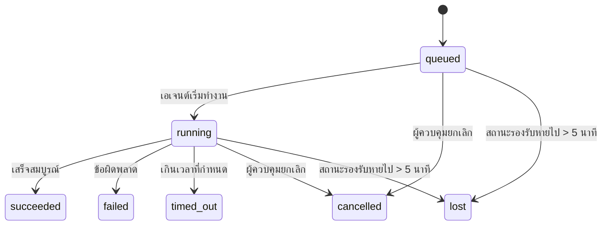

---
read_when:
    - การตรวจสอบงานเบื้องหลังที่กำลังดำเนินการหรือเพิ่งเสร็จสิ้น
    - การแก้ไขข้อบกพร่องของความล้มเหลวในการส่งมอบสำหรับการเรียกใช้เอเจนต์แบบแยกออกจากเซสชัน
    - ทำความเข้าใจความสัมพันธ์ระหว่างการทำงานเบื้องหลังกับเซสชัน Cron และ Heartbeat
sidebarTitle: Background tasks
summary: การติดตามงานเบื้องหลังสำหรับการทำงานของ ACP, เอเจนต์ย่อย, การดำเนินการ Cron และการทำงานของ CLI
title: งานเบื้องหลัง
x-i18n:
    generated_at: "2026-07-12T15:45:19Z"
    model: gpt-5.6
    postprocess_version: locale-links-v1
    provider: openai
    source_hash: 0a945e8103c5df5a64785f326a9d0b08784ac32a2ca6fa3d4c399d75fc54be2b
    source_path: automation/tasks.md
    workflow: 16
---

<Note>
หากกำลังมองหาการตั้งกำหนดเวลา โปรดดู [ระบบอัตโนมัติ](/th/automation) เพื่อเลือกกลไกที่เหมาะสม หน้านี้คือบัญชีกิจกรรมสำหรับงานเบื้องหลัง ไม่ใช่ตัวตั้งกำหนดเวลา
</Note>

งานเบื้องหลังติดตามงานที่ทำงาน **นอกเซสชันการสนทนาหลักของคุณ** ได้แก่ การทำงานของ ACP, การสร้างเอเจนต์ย่อย, การดำเนินงาน Cron และการดำเนินการที่เริ่มต้นผ่าน CLI

งาน **ไม่ได้** ใช้แทนเซสชัน งาน Cron หรือ Heartbeat แต่เป็น **บัญชีกิจกรรม** ที่บันทึกว่างานแบบแยกส่วนใดเกิดขึ้น เมื่อใด และสำเร็จหรือไม่

<Note>
การทำงานของเอเจนต์ไม่ใช่ทุกครั้งที่จะสร้างงาน รอบ Heartbeat และการแชตแบบโต้ตอบตามปกติจะไม่สร้างงาน แต่การดำเนินงาน Cron ทั้งหมด การสร้าง ACP การสร้างเอเจนต์ย่อย และคำสั่งเอเจนต์ CLI ที่ Gateway ส่งต่อจะสร้างงาน
</Note>

## สรุปย่อ

- งานคือ **ระเบียน** ไม่ใช่ตัวตั้งกำหนดเวลา โดย Cron และ Heartbeat เป็นตัวกำหนดว่า _เมื่อใด_ งานจะทำงาน ส่วนงานติดตามว่า _เกิดอะไรขึ้น_
- ACP, เอเจนต์ย่อย, งาน Cron ทั้งหมด และการดำเนินการผ่าน CLI จะสร้างงาน แต่รอบ Heartbeat จะไม่สร้าง
- แต่ละงานจะเปลี่ยนสถานะตามลำดับ `queued → running → terminal` (สำเร็จ ล้มเหลว หมดเวลา ถูกยกเลิก หรือสูญหาย)
- งาน Cron จะยังคงทำงานอยู่ตราบใดที่รันไทม์ Cron ยังเป็นเจ้าของงานนั้น หากสถานะรันไทม์ในหน่วยความจำหายไป การบำรุงรักษางานจะตรวจสอบประวัติการทำงาน Cron แบบถาวรก่อนทำเครื่องหมายว่างานสูญหาย
- การเสร็จสิ้นขับเคลื่อนด้วยการพุช งานแบบแยกส่วนสามารถแจ้งโดยตรงหรือปลุกเซสชัน/Heartbeat ของผู้ร้องขอเมื่อเสร็จสิ้น ดังนั้นโดยทั่วไปลูปการสำรวจสถานะจึงไม่ใช่รูปแบบที่เหมาะสม
- การทำงาน Cron แบบแยกและการเสร็จสิ้นของเอเจนต์ย่อยจะพยายามล้างแท็บ/กระบวนการเบราว์เซอร์ที่ติดตามของเซสชันลูกก่อนบันทึกการล้างข้อมูลขั้นสุดท้าย
- การส่งผลลัพธ์ Cron แบบแยกจะระงับการตอบกลับชั่วคราวที่ล้าสมัยจากเอเจนต์แม่ ขณะที่งานของเอเจนต์ย่อยสืบทอดยังอยู่ระหว่างระบายออก และจะให้ความสำคัญกับผลลัพธ์สุดท้ายจากเอเจนต์ย่อยสืบทอดหากมาถึงก่อนการส่ง
- การแจ้งเตือนการเสร็จสิ้นจะถูกส่งไปยังช่องทางโดยตรงหรือเข้าคิวไว้สำหรับ Heartbeat ครั้งถัดไป
- `openclaw tasks list` แสดงงานทั้งหมด ส่วน `openclaw tasks audit` แสดงปัญหาที่พบ
- ระเบียนสถานะสิ้นสุดจะถูกเก็บไว้ 7 วัน (ระเบียน `lost` เก็บไว้ 24 ชั่วโมง) จากนั้นจะถูกลบโดยอัตโนมัติ

## เริ่มต้นอย่างรวดเร็ว

<Tabs>
  <Tab title="แสดงรายการและกรอง">
    ```bash
    # แสดงงานทั้งหมด (งานใหม่สุดก่อน)
    openclaw tasks list

    # กรองตามรันไทม์หรือสถานะ
    openclaw tasks list --runtime acp
    openclaw tasks list --status running
    ```

  </Tab>
  <Tab title="ตรวจสอบ">
    ```bash
    # แสดงรายละเอียดของงานที่ระบุ (ตาม ID งาน, ID การทำงาน หรือคีย์เซสชัน)
    openclaw tasks show <lookup>
    ```
  </Tab>
  <Tab title="ยกเลิกและแจ้งเตือน">
    ```bash
    # ยกเลิกงานที่กำลังทำงาน (หยุดเซสชันลูก)
    openclaw tasks cancel <lookup>

    # เปลี่ยนนโยบายการแจ้งเตือนสำหรับงาน
    openclaw tasks notify <lookup> state_changes
    ```

  </Tab>
  <Tab title="ตรวจสอบและบำรุงรักษา">
    ```bash
    # เรียกใช้การตรวจสอบสถานภาพ
    openclaw tasks audit

    # แสดงตัวอย่างหรือดำเนินการบำรุงรักษา
    openclaw tasks maintenance
    openclaw tasks maintenance --apply
    ```

  </Tab>
  <Tab title="โฟลว์งาน">
    ```bash
    # ตรวจสอบสถานะ TaskFlow
    openclaw tasks flow list
    openclaw tasks flow show <lookup>
    openclaw tasks flow cancel <lookup>
    ```
  </Tab>
</Tabs>

## สิ่งที่สร้างงาน

| แหล่งที่มา                 | ประเภทรันไทม์ | เวลาที่สร้างระเบียนงาน                                          | นโยบายการแจ้งเตือนเริ่มต้น |
| ---------------------- | ------------ | ---------------------------------------------------------------------- | --------------------- |
| การทำงานเบื้องหลังของ ACP    | `acp`        | เมื่อสร้างเซสชัน ACP ลูก                                           | `done_only`           |
| การประสานงานเอเจนต์ย่อย | `subagent`   | เมื่อสร้างเอเจนต์ย่อยผ่าน `sessions_spawn`                               | `done_only`           |
| งาน Cron (ทุกประเภท)  | `cron`       | ทุกครั้งที่ดำเนินงาน Cron (เซสชันหลักและแบบแยก)                       | `silent`              |
| การดำเนินการผ่าน CLI         | `cli`        | คำสั่ง `openclaw agent` ที่ทำงานผ่าน Gateway                 | `silent`              |
| งานสื่อของเอเจนต์       | `cli`        | การทำงาน `image_generate`/`music_generate`/`video_generate` ที่มีเซสชันรองรับ | `silent`              |

<AccordionGroup>
  <Accordion title="ค่าเริ่มต้นการแจ้งเตือนสำหรับ Cron และสื่อ">
    งาน Cron (ทั้งเซสชันหลักและแบบแยก) ใช้นโยบายการแจ้งเตือน `silent` โดยจะสร้างระเบียนสำหรับการติดตาม แต่จะไม่สร้างการแจ้งเตือนงานด้วยตัวเอง เนื่องจาก Cron เป็นเจ้าของเส้นทางการส่งผลลัพธ์

    การทำงาน `image_generate`, `music_generate` และ `video_generate` ที่มีเซสชันรองรับก็ใช้นโยบายการแจ้งเตือน `silent` เช่นกัน การทำงานเหล่านี้ยังคงสร้างระเบียนงาน แต่เมื่อเสร็จสิ้น ระบบจะส่งกลับไปยังเซสชันเอเจนต์ต้นทางเป็นการปลุกภายใน เพื่อให้เอเจนต์เขียนข้อความติดตามผลและแนบสื่อที่เสร็จแล้วด้วยตัวเอง เอเจนต์ผู้ร้องขอจะปฏิบัติตามสัญญาการตอบกลับที่ผู้ใช้มองเห็นตามปกติ ได้แก่ ตอบกลับสุดท้ายโดยอัตโนมัติเมื่อกำหนดค่าไว้ หรือใช้ `message(action="send")` ร่วมกับ `NO_REPLY` เมื่อเซสชันกำหนดให้ตอบกลับผ่านเครื่องมือส่งข้อความ หากเซสชันผู้ร้องขอไม่ได้ทำงานอยู่อีกต่อไปหรือการปลุกแบบแอ็กทีฟล้มเหลว และเอเจนต์ที่จัดการการเสร็จสิ้นพลาดสื่อที่สร้างขึ้นบางส่วนหรือทั้งหมด OpenClaw จะส่งข้อมูลสำรองโดยตรงแบบทำซ้ำได้อย่างปลอดภัยไปยังเป้าหมายช่องทางเดิม โดยส่งเฉพาะสื่อที่ขาดหายไป

  </Accordion>
  <Accordion title="มาตรการป้องกันการสร้างสื่อพร้อมกัน">
    ขณะที่งานสร้างสื่อที่มีเซสชันรองรับยังทำงานอยู่ `image_generate`, `music_generate` และ `video_generate` จะป้องกันการลองใหม่โดยไม่ตั้งใจ การเรียกซ้ำด้วยพรอมต์/คำขอเดียวกันจะส่งคืนสถานะของงานที่กำลังทำงานซึ่งตรงกัน แทนที่จะเริ่มงานซ้ำ ส่วนพรอมต์ที่แตกต่างกันสามารถเริ่มงานของตัวเองได้ ใช้ `action: "status"` เมื่อต้องการตรวจสอบความคืบหน้า/สถานะอย่างชัดเจนจากฝั่งเอเจนต์
  </Accordion>
  <Accordion title="สิ่งที่ไม่สร้างงาน">
    - รอบ Heartbeat ในเซสชันหลัก โปรดดู [Heartbeat](/th/gateway/heartbeat)
    - รอบการแชตแบบโต้ตอบตามปกติ
    - การตอบกลับ `/command` โดยตรง

  </Accordion>
</AccordionGroup>

## วงจรชีวิตของงาน



| สถานะ      | ความหมาย                                                               |
| ----------- | --------------------------------------------------------------------------- |
| `queued`    | สร้างแล้ว กำลังรอให้เอเจนต์เริ่มทำงาน                                     |
| `running`   | รอบการทำงานของเอเจนต์กำลังดำเนินการอยู่                                            |
| `succeeded` | เสร็จสมบูรณ์โดยสำเร็จ                                                      |
| `failed`    | เสร็จสิ้นพร้อมข้อผิดพลาด                                                     |
| `timed_out` | เกินระยะหมดเวลาที่กำหนดค่าไว้                                             |
| `cancelled` | ถูกหยุดโดยผู้ควบคุมผ่าน `openclaw tasks cancel` หรือการทำงานถูกยุติ |
| `lost`      | รันไทม์สูญเสียสถานะรองรับที่เป็นแหล่งข้อมูลหลักหลังพ้นระยะผ่อนผัน 5 นาที  |

การเปลี่ยนสถานะเกิดขึ้นโดยอัตโนมัติ เหตุการณ์วงจรชีวิตการทำงานของเอเจนต์ (เริ่ม สิ้นสุด ข้อผิดพลาด) จะอัปเดตสถานะงาน คุณไม่ต้องจัดการด้วยตนเอง

การเสร็จสิ้นการทำงานของเอเจนต์เป็นแหล่งข้อมูลหลักสำหรับระเบียนงานที่กำลังทำงาน การทำงานแบบแยกส่วนที่สำเร็จจะสิ้นสุดเป็น `succeeded` ข้อผิดพลาดทั่วไปของการทำงานจะสิ้นสุดเป็น `failed` การหมดเวลาจะสิ้นสุดเป็น `timed_out` และผลลัพธ์จากการยกเลิก/ยุติจะสิ้นสุดเป็น `cancelled` เมื่องานเข้าสู่สถานะสิ้นสุดแล้ว สัญญาณวงจรชีวิตที่มาภายหลังจะไม่ลดระดับสถานะ งานที่ผู้ควบคุมยกเลิกหรืออยู่ในสถานะ `failed`/`timed_out`/`lost` แล้วจะคงสถานะเดิม แม้จะได้รับสัญญาณความสำเร็จภายหลังก็ตาม

`lost` คำนึงถึงรันไทม์:

- งาน ACP: มีเพียงรอบ ACP ภายในกระบวนการที่ยังทำงานอยู่ใน Gateway เท่านั้นที่พิสูจน์ได้ว่าการทำงานยังมีชีวิตอยู่ เมตาดาต้าเซสชันที่จัดเก็บถาวรเพียงอย่างเดียวไม่เพียงพอ การตรวจสอบ CLI แบบออฟไลน์จะใช้แนวทางระมัดระวังและไม่เรียกคืนงาน ACP
- งานเอเจนต์ย่อย: เซสชันลูกที่รองรับหายไปจากพื้นที่จัดเก็บของเอเจนต์เป้าหมาย (หรือมีเครื่องหมายหลุมศพสำหรับการกู้คืนหลังรีสตาร์ต)
- งาน Cron: รันไทม์ Cron ไม่ได้ติดตามงานนั้นว่าเป็นงานที่กำลังทำงานอีกต่อไป และประวัติการทำงาน Cron แบบถาวรไม่แสดงผลลัพธ์สถานะสิ้นสุดสำหรับการทำงานนั้น การตรวจสอบ CLI แบบออฟไลน์จะไม่ถือว่าสถานะรันไทม์ Cron ภายในกระบวนการที่ว่างเปล่าของตัวเองเป็นแหล่งข้อมูลหลัก
- งาน CLI: งานที่มี ID การทำงาน/ID แหล่งที่มาจะใช้บริบทการทำงานที่มีอยู่ ดังนั้นแถวเซสชันลูกหรือเซสชันแชตที่ยังคงค้างอยู่จะไม่ทำให้งานยังมีชีวิตหลังจากการทำงานที่ Gateway เป็นเจ้าของหายไป งาน CLI รุ่นเก่าที่ไม่มีข้อมูลระบุตัวตนการทำงานจะยังคงย้อนกลับไปใช้เซสชันลูก การทำงาน `openclaw agent` ที่มี Gateway รองรับจะสิ้นสุดตามผลลัพธ์การทำงานด้วย ดังนั้นการทำงานที่เสร็จแล้วจะไม่ค้างอยู่ในสถานะกำลังทำงานจนกว่าตัวกวาดจะทำเครื่องหมายเป็น `lost`

## การส่งผลลัพธ์และการแจ้งเตือน

เมื่องานเข้าสู่สถานะสิ้นสุด OpenClaw จะแจ้งเตือนคุณ โดยมีเส้นทางการส่งผลลัพธ์สองแบบ:

**การส่งโดยตรง** - หากงานมีเป้าหมายช่องทาง (`requesterOrigin`) ข้อความแจ้งการเสร็จสิ้นจะถูกส่งตรงไปยังช่องทางนั้น (Discord, Slack, Telegram เป็นต้น) ส่วนการเสร็จสิ้นของงานในกลุ่มและช่องทางจะถูกกำหนดเส้นทางผ่านเซสชันผู้ร้องขอ เพื่อให้เอเจนต์แม่เขียนคำตอบที่ผู้ใช้มองเห็นได้ สำหรับการเสร็จสิ้นของเอเจนต์ย่อย OpenClaw จะรักษาการกำหนดเส้นทางเธรด/หัวข้อที่ผูกไว้เมื่อมี และสามารถเติม `to` / บัญชีที่หายไปจากเส้นทางที่จัดเก็บไว้ของเซสชันผู้ร้องขอ (`lastChannel` / `lastTo` / `lastAccountId`) ก่อนยกเลิกการส่งโดยตรง

**การส่งแบบเข้าคิวในเซสชัน** - หากการส่งโดยตรงล้มเหลวหรือไม่ได้กำหนดต้นทาง การอัปเดตจะถูกเข้าคิวเป็นเหตุการณ์ระบบในเซสชันของผู้ร้องขอ และจะแสดงใน Heartbeat ครั้งถัดไป

<Tip>
การเสร็จสิ้นงานที่เข้าคิวในเซสชันจะเรียกให้ Heartbeat ตื่นทันที คุณจึงเห็นผลลัพธ์ได้อย่างรวดเร็วโดยไม่ต้องรอรอบ Heartbeat ตามกำหนดการครั้งถัดไป
</Tip>

นั่นหมายความว่าเวิร์กโฟลว์ตามปกติจะอิงการพุช: เริ่มงานแบบแยกส่วนหนึ่งครั้ง แล้วปล่อยให้รันไทม์ปลุกหรือแจ้งเตือนคุณเมื่อเสร็จสิ้น สำรวจสถานะงานเฉพาะเมื่อต้องแก้ไขข้อบกพร่อง แทรกแซง หรือตรวจสอบอย่างชัดเจนเท่านั้น

### นโยบายการแจ้งเตือน

ควบคุมระดับการแจ้งข้อมูลของแต่ละงาน:

| นโยบาย                | สิ่งที่ส่ง                                       |
| --------------------- | ------------------------------------------------------- |
| `done_only` (ค่าเริ่มต้น) | เฉพาะสถานะสิ้นสุด (สำเร็จ ล้มเหลว เป็นต้น)           |
| `state_changes`       | ทุกการเปลี่ยนสถานะและการอัปเดตความคืบหน้า              |
| `silent`              | ไม่ส่งสิ่งใดเลย (ค่าเริ่มต้นสำหรับงาน Cron, CLI และสื่อ) |

เปลี่ยนนโยบายขณะที่งานกำลังทำงาน:

```bash
openclaw tasks notify <lookup> state_changes
```

## เอกสารอ้างอิง CLI

<AccordionGroup>
  <Accordion title="รายการงาน">
    ```bash
    openclaw tasks list [--runtime <acp|subagent|cron|cli>] [--status <status>] [--json]
    ```

    คอลัมน์ผลลัพธ์: งาน, ชนิด, สถานะ, การส่งผลลัพธ์, การทำงาน, เซสชันลูก, สรุป คำสั่ง `openclaw tasks` ที่ไม่มีอาร์กิวเมนต์จะทำงานเหมือน `openclaw tasks list`

  </Accordion>
  <Accordion title="แสดงงาน">
    ```bash
    openclaw tasks show <lookup> [--json]
    ```

    โทเค็นการค้นหารองรับ ID งาน, ID การทำงาน หรือคีย์เซสชัน โดยจะแสดงระเบียนทั้งหมด รวมถึงเวลา สถานะการส่งผลลัพธ์ ข้อผิดพลาด และสรุปสถานะสิ้นสุด

  </Accordion>
  <Accordion title="ยกเลิกงาน">
    ```bash
    openclaw tasks cancel <lookup>
    ```

    สำหรับงาน ACP และเอเจนต์ย่อย คำสั่งนี้จะหยุดเซสชันลูก การยกเลิก ACP และ Cron จะถูกกำหนดเส้นทางผ่าน Gateway ที่กำลังทำงาน (`tasks.cancel`) สำหรับงานที่ CLI ติดตาม การยกเลิกจะถูกบันทึกในรีจิสทรีงาน (ไม่มีแฮนเดิลรันไทม์ลูกแยกต่างหาก) สถานะจะเปลี่ยนเป็น `cancelled` และจะส่งการแจ้งเตือนการส่งผลลัพธ์เมื่อเกี่ยวข้อง

  </Accordion>
  <Accordion title="การแจ้งเตือนงาน">
    ```bash
    openclaw tasks notify <lookup> <done_only|state_changes|silent>
    ```
  </Accordion>
  <Accordion title="การตรวจสอบงาน">
    ```bash
    openclaw tasks audit [--severity <warn|error>] [--code <name>] [--limit <n>] [--json]
    ```

    แสดงปัญหาการปฏิบัติงานสำหรับทั้งงาน **และ** TaskFlow ในรายงานเดียว ข้อค้นพบจะปรากฏใน `openclaw status` ด้วยเมื่อตรวจพบปัญหา

    ข้อค้นพบของงาน:

    | ข้อค้นพบ                   | ระดับความรุนแรง   | เงื่อนไขที่ทำให้เกิด                                                                                                      |
    | ------------------------- | ---------- | ------------------------------------------------------------------------------------------------------------ |
    | `stale_queued`            | คำเตือน       | อยู่ในคิวนานกว่า 10 นาที                                                                              |
    | `stale_running`           | ข้อผิดพลาด      | ทำงานนานกว่า 30 นาที                                                                             |
    | `lost`                    | คำเตือน/ข้อผิดพลาด | ความเป็นเจ้าของงานที่อิงกับรันไทม์หายไป งานที่สูญหายซึ่งยังเก็บไว้จะแสดงคำเตือนจนถึง `cleanupAfter` จากนั้นจะกลายเป็นข้อผิดพลาด |
    | `delivery_failed`         | คำเตือน       | การส่งล้มเหลวและนโยบายการแจ้งเตือนไม่ใช่ `silent`                                                            |
    | `missing_cleanup`         | คำเตือน       | งานที่สิ้นสุดแล้วไม่มีเวลาประทับสำหรับการล้างข้อมูล                                                                      |
    | `inconsistent_timestamps` | คำเตือน       | ลำดับเวลาขัดแย้งกัน (ตัวอย่างเช่น สิ้นสุดก่อนเริ่มต้น)                                                        |

    ข้อค้นพบของ TaskFlow:

    | ข้อค้นพบ                | ระดับความรุนแรง   | เงื่อนไขที่ทำให้เกิด                                                                    |
    | ---------------------- | ---------- | --------------------------------------------------------------------------- |
    | `restore_failed`       | ข้อผิดพลาด      | การกู้คืนรีจิสทรีโฟลว์จาก SQLite ล้มเหลว                                    |
    | `stale_running`        | ข้อผิดพลาด      | โฟลว์ที่กำลังทำงานไม่มีความคืบหน้านานกว่า 30 นาที                      |
    | `stale_waiting`        | คำเตือน       | โฟลว์ที่กำลังรอไม่มีความคืบหน้านานกว่า 30 นาที                      |
    | `stale_blocked`        | คำเตือน       | โฟลว์ที่ถูกบล็อกไม่มีความคืบหน้านานกว่า 30 นาที                      |
    | `cancel_stuck`         | คำเตือน       | มีการขอยกเลิกนานกว่า 5 นาทีแล้ว ไม่มีงานลูกที่ยังทำงานอยู่ แต่ยังไม่เข้าสู่สถานะสิ้นสุด |
    | `missing_linked_tasks` | คำเตือน/ข้อผิดพลาด | โฟลว์ที่มีการจัดการและค้างอยู่ไม่มีงานที่เชื่อมโยงหรือสถานะรอ                       |
    | `blocked_task_missing` | คำเตือน       | โฟลว์ที่ถูกบล็อกอ้างถึงรหัสงานที่ไม่มีอยู่อีกต่อไป                      |

  </Accordion>
  <Accordion title="การบำรุงรักษางาน">
    ```bash
    openclaw tasks maintenance [--json]
    openclaw tasks maintenance --apply [--json]
    ```

    ใช้คำสั่งนี้เพื่อดูตัวอย่างหรือใช้การปรับสถานะให้สอดคล้องกัน การประทับเวลาล้างข้อมูล และการตัดทิ้งสำหรับงาน สถานะ TaskFlow และแถวรีจิสทรีเซสชันการเรียกใช้ Cron ที่ค้างอยู่

    การปรับสถานะให้สอดคล้องกันรับรู้สถานะรันไทม์:

    - งาน ACP ต้องมีเทิร์นภายในโปรเซสที่ยังทำงานอยู่ใน Gateway ส่วนงานเอเจนต์ย่อยจะตรวจสอบเซสชันลูกที่รองรับงานนั้น
    - งานเอเจนต์ย่อยที่เซสชันลูกมีเครื่องหมาย tombstone สำหรับการกู้คืนหลังรีสตาร์ตจะถูกทำเครื่องหมายว่าสูญหาย แทนที่จะถือว่าเป็นเซสชันรองรับที่กู้คืนได้
    - งาน Cron จะตรวจสอบว่ารันไทม์ Cron ยังเป็นเจ้าของงานอยู่หรือไม่ จากนั้นกู้คืนสถานะสิ้นสุดจากบันทึกการเรียกใช้ Cron หรือสถานะงานที่บันทึกไว้ ก่อนจะเปลี่ยนเป็น `lost` เป็นทางเลือกสุดท้าย เฉพาะโปรเซส Gateway เท่านั้นที่เป็นแหล่งข้อมูลที่เชื่อถือได้สำหรับชุดงาน Cron ที่กำลังทำงานในหน่วยความจำ การตรวจสอบผ่าน CLI แบบออฟไลน์ใช้ประวัติถาวร แต่จะไม่ทำเครื่องหมายงาน Cron ว่าสูญหายเพียงเพราะชุดภายในเครื่องนั้นว่างเปล่า
    - งาน CLI ที่มีข้อมูลประจำตัวการเรียกใช้จะตรวจสอบบริบทการเรียกใช้ที่ยังทำงานและเป็นเจ้าของงาน ไม่ใช่เพียงแถวเซสชันลูกหรือเซสชันแชต

    การล้างข้อมูลเมื่อเสร็จสิ้นยังรับรู้สถานะรันไทม์ด้วย:

    - เมื่อเอเจนต์ย่อยเสร็จสิ้น ระบบจะพยายามปิดแท็บและโปรเซสของเบราว์เซอร์ที่ติดตามไว้สำหรับเซสชันลูกแบบพยายามให้ดีที่สุด ก่อนดำเนินการล้างข้อมูลการประกาศต่อ
    - เมื่อ Cron แบบแยกส่วนเสร็จสิ้น ระบบจะพยายามปิดแท็บและโปรเซสของเบราว์เซอร์ที่ติดตามไว้สำหรับเซสชัน Cron แบบพยายามให้ดีที่สุด ก่อนยุติการเรียกใช้อย่างสมบูรณ์
    - การส่งผลลัพธ์ของ Cron แบบแยกส่วนจะรอการดำเนินการต่อเนื่องของเอเจนต์ย่อยที่สืบทอดมาเมื่อจำเป็น และระงับข้อความตอบรับเก่าจากงานแม่แทนที่จะประกาศข้อความนั้น
    - การส่งผลเมื่อเอเจนต์ย่อยเสร็จสิ้นจะใช้เฉพาะข้อความล่าสุดของผู้ช่วยที่ผู้ใช้มองเห็นจากเซสชันลูก เอาต์พุต `tool`/`toolResult` จะไม่ถูกยกระดับเป็นข้อความผลลัพธ์ของเซสชันลูก การเรียกใช้ที่สิ้นสุดด้วยความล้มเหลวจะประกาศสถานะความล้มเหลวโดยไม่นำข้อความตอบกลับที่บันทึกไว้มาส่งซ้ำ
    - ความล้มเหลวในการล้างข้อมูลจะไม่บดบังผลลัพธ์ที่แท้จริงของงาน

    เมื่อใช้การบำรุงรักษา OpenClaw จะลบแถวรีจิสทรีเซสชัน `cron:<jobId>:run:<runId>` ที่ค้างและเก่ากว่า 7 วันด้วย โดยจะเก็บแถวของงาน Cron ที่กำลังทำงานอยู่และไม่เปลี่ยนแปลงแถวเซสชันที่ไม่ใช่ Cron

  </Accordion>
  <Accordion title="รายการ | แสดง | ยกเลิกโฟลว์งาน">
    ```bash
    openclaw tasks flow list [--status <status>] [--json]
    openclaw tasks flow show <lookup> [--json]
    openclaw tasks flow cancel <lookup>
    ```

    โทเค็นค้นหาโฟลว์รองรับรหัสโฟลว์หรือคีย์เจ้าของ ใช้คำสั่งเหล่านี้เมื่อสิ่งที่คุณสนใจคือ [โฟลว์งาน](/th/automation/taskflow) ที่ทำหน้าที่ประสานงาน แทนที่จะเป็นระเบียนงานเบื้องหลังรายการใดรายการหนึ่ง

  </Accordion>
</AccordionGroup>

## กระดานงานในแชต (`/tasks`)

ใช้ `/tasks` ในเซสชันแชตใดก็ได้เพื่อดูงานเบื้องหลังที่เชื่อมโยงกับเซสชันนั้น กระดานจะแสดงงานที่กำลังทำงานและงานที่เพิ่งเสร็จสิ้นสูงสุดห้ารายการ พร้อมรันไทม์ สถานะ เวลา และรายละเอียดความคืบหน้าหรือข้อผิดพลาด

เมื่อเซสชันปัจจุบันไม่มีงานที่เชื่อมโยงและมองเห็นได้ `/tasks` จะใช้จำนวนงานภายในเอเจนต์เป็นทางเลือกสำรอง เพื่อให้คุณยังเห็นภาพรวมโดยไม่เปิดเผยรายละเอียดของเซสชันอื่น

สำหรับบัญชีงานทั้งหมดของผู้ปฏิบัติงาน ให้ใช้ CLI: `openclaw tasks list`

### UI ควบคุม

UI ควบคุมบนเว็บมีหน้า **งาน** ในแถบด้านข้าง ซึ่งแสดงงานเบื้องหลังที่กำลังทำงานและเพิ่งเสร็จสิ้นแบบสด ใช้หน้านี้เพื่อตรวจสอบความคืบหน้า เปิดเซสชันที่เชื่อมโยง รีเฟรชบัญชีงาน หรือยกเลิกงานที่อยู่ในคิวและงานที่กำลังทำงาน

บานหน้าต่างแชตยังมีแถบ **งานเบื้องหลัง** ที่ยุบได้และจำกัดขอบเขตตามเอเจนต์ของบานหน้าต่างนั้น โดยมีงานและเอเจนต์ย่อยที่กำลังทำงานพร้อมตัวควบคุมหยุด ส่วนรายการที่เสร็จสิ้น และลิงก์ดูบทสนทนาไปยังเซสชันลูกของแต่ละงาน เปิดแถบนี้จากปุ่มสลับกิจกรรมในส่วนหัวของบานหน้าต่าง (หรือปุ่มกิจกรรมแบบลอยในแชตบานหน้าต่างเดียว)

## การผสานรวมสถานะ (ภาระงาน)

`openclaw status` มีบรรทัดสรุปงานที่ดูได้อย่างรวดเร็ว:

```
งาน    ทำงานอยู่ 2 · อยู่ในคิว 1 · กำลังทำงาน 1 · มีปัญหา 1 · การตรวจสอบสะอาด · ติดตามทั้งหมด 6
```

สรุปนี้นับงานที่ยังดำเนินอยู่ (`queued` + `running`) ความล้มเหลว (`failed` + `timed_out` + `lost`) ข้อค้นพบจากการตรวจสอบ และจำนวนระเบียนที่ติดตามทั้งหมด ส่วนเพย์โหลด JSON จะแยกจำนวนตามรันไทม์ด้วย (`acp`, `subagent`, `cron`, `cli`)

ทั้ง `/status` และเครื่องมือ `session_status` ใช้สแนปช็อตงานที่รับรู้การล้างข้อมูล โดยให้ความสำคัญกับงานที่กำลังทำงาน ซ่อนแถวที่หมดอายุ และแสดงงานที่สิ้นสุดแล้วเฉพาะในช่วงเวลาสั้น ๆ หลังจากนั้น (5 นาที) พร้อมเน้นความล้มเหลวเมื่อไม่มีงานที่ยังทำงานเหลืออยู่ วิธีนี้ช่วยให้การ์ดสถานะแสดงเฉพาะสิ่งสำคัญในขณะนี้

## พื้นที่จัดเก็บและการบำรุงรักษา

### ตำแหน่งจัดเก็บงาน

ระเบียนงานและสถานะการส่งจะคงอยู่ในฐานข้อมูลสถานะ SQLite ที่ใช้ร่วมกันของ OpenClaw:

```
~/.openclaw/state/openclaw.sqlite   (ตาราง: task_runs, task_delivery_state, flow_runs)
```

ตั้งค่า `OPENCLAW_STATE_DIR` เพื่อย้ายรูทสถานะทั้งหมด (ค่าเริ่มต้นคือ `~/.openclaw`) ไปยังตำแหน่งอื่น เส้นทางฐานข้อมูลที่ใช้ร่วมกันจะย้ายตามไปด้วย

รีจิสทรีจะโหลดเข้าสู่หน่วยความจำเมื่อใช้งานครั้งแรก และบันทึกทุกการเขียนกลับไปยัง SQLite ดังนั้นระเบียนจึงยังคงอยู่หลัง Gateway รีสตาร์ต การเติบโตของ WAL ถูกจำกัดด้วยเกณฑ์จุดตรวจอัตโนมัติเริ่มต้นของ SQLite ร่วมกับจุดตรวจ `PASSIVE` เป็นระยะ ส่วนการปิดระบบและจุดตรวจจากการบำรุงรักษาโดยตรงจะใช้ `TRUNCATE` เพื่อให้การปิดตามปกติเรียกคืนพื้นที่ WAL ได้โดยไม่ทำให้ตัวกวาดเบื้องหลังต้องรอผู้อ่านที่กำลังทำงาน

พื้นที่จัดเก็บแบบ sidecar เดิมจากการติดตั้งรุ่นเก่า (`tasks/runs.sqlite`, `flows/registry.sqlite`) จะถูกนำเข้าสู่ฐานข้อมูลที่ใช้ร่วมกันโดย `openclaw doctor`

### การบำรุงรักษาอัตโนมัติ

ตัวกวาดจะทำงานทุก **60 วินาที** (รอบแรกประมาณ 5 วินาทีหลัง Gateway เริ่มทำงาน) และจัดการสี่ส่วนดังนี้:

<Steps>
  <Step title="การปรับสถานะให้สอดคล้องกัน">
    ตรวจสอบว่างานที่กำลังทำงานยังมีรันไทม์ที่เชื่อถือได้รองรับอยู่หรือไม่ งาน ACP ต้องมีเทิร์นภายในโปรเซสที่ยังทำงานอยู่ งานเอเจนต์ย่อยใช้สถานะเซสชันลูก งาน Cron ใช้ความเป็นเจ้าของงานที่กำลังทำงานร่วมกับประวัติการเรียกใช้ถาวร และงาน CLI ที่มีข้อมูลประจำตัวการเรียกใช้จะใช้บริบทการเรียกใช้ที่เป็นเจ้าของงาน หากสถานะรองรับหายไปนานกว่า 5 นาที (30 นาทีสำหรับงานเอเจนต์ย่อยแบบเนทีฟที่ไม่มีเซสชันลูก) งานจะถูกทำเครื่องหมายเป็น `lost`
  </Step>
  <Step title="การซ่อมแซมเซสชัน ACP">
    ปิดเซสชัน ACP แบบครั้งเดียวที่มีงานแม่เป็นเจ้าของและสิ้นสุดหรือไม่มีเจ้าของ รวมถึงปิดเซสชัน ACP แบบถาวรที่ค้างและสิ้นสุดหรือไม่มีเจ้าของ เฉพาะเมื่อไม่มีการผูกกับบทสนทนาที่กำลังใช้งานเหลืออยู่
  </Step>
  <Step title="การประทับเวลาล้างข้อมูล">
    ตั้งเวลาประทับ `cleanupAfter` ให้กับงานที่สิ้นสุดแล้ว (เวลาสิ้นสุด + ระยะเวลาเก็บรักษา) ระหว่างช่วงเก็บรักษา งานที่สูญหายยังคงปรากฏในการตรวจสอบเป็นคำเตือน หลังจาก `cleanupAfter` หมดอายุหรือเมื่อข้อมูลกำกับการล้างข้อมูลหายไป งานเหล่านั้นจะกลายเป็นข้อผิดพลาด
  </Step>
  <Step title="การตัดทิ้ง">
    ลบระเบียนที่เลยวันที่ `cleanupAfter`
  </Step>
</Steps>

<Note>
**การเก็บรักษา:** ระเบียนงานที่สิ้นสุดแล้วจะถูกเก็บไว้ **7 วัน** (ระเบียน `lost` เก็บไว้ **24 ชั่วโมง**) จากนั้นจะถูกตัดทิ้งโดยอัตโนมัติ ไม่ต้องกำหนดค่า
</Note>

## ความสัมพันธ์ระหว่างงานกับระบบอื่น

<AccordionGroup>
  <Accordion title="งานและโฟลว์งาน">
    [โฟลว์งาน](/th/automation/taskflow) คือชั้นประสานโฟลว์ที่อยู่เหนืองานเบื้องหลัง โฟลว์หนึ่งรายการอาจประสานงานหลายงานตลอดอายุการทำงานโดยใช้โหมดซิงค์แบบมีการจัดการหรือแบบสะท้อน ใช้ `openclaw tasks` เพื่อตรวจสอบระเบียนงานแต่ละรายการ และใช้ `openclaw tasks flow` เพื่อตรวจสอบโฟลว์ที่ทำหน้าที่ประสานงาน

  </Accordion>
  <Accordion title="งานและ Cron">
    คำจำกัดความงาน Cron สถานะการทำงานของรันไทม์ และประวัติการเรียกใช้จะอยู่ในฐานข้อมูลสถานะ SQLite ที่ใช้ร่วมกันของ OpenClaw การเรียกใช้ Cron **ทุกครั้ง** จะสร้างระเบียนงาน ทั้งแบบเซสชันหลักและแบบแยกส่วน พร้อมนโยบายการแจ้งเตือน `silent` เพื่อให้ติดตามการเรียกใช้ Cron ได้โดยไม่สร้างการแจ้งเตือนงานขึ้นมาเอง

    ดู [งาน Cron](/th/automation/cron-jobs)

  </Accordion>
  <Accordion title="งานและ Heartbeat">
    การเรียกใช้ Heartbeat เป็นเทิร์นของเซสชันหลัก จึงไม่สร้างระเบียนงาน เมื่องานเสร็จสิ้น งานนั้นสามารถกระตุ้นให้ Heartbeat ปลุกระบบ เพื่อให้คุณเห็นผลลัพธ์ได้ทันที

    ดู [Heartbeat](/th/gateway/heartbeat)

  </Accordion>
  <Accordion title="งานและเซสชัน">
    งานอาจอ้างอิง `childSessionKey` (ตำแหน่งที่งานทำงาน) และ `requesterSessionKey` (ผู้เริ่มงาน) โดย `agentId` ระบุเอเจนต์ที่ทำงาน ขณะที่ฟิลด์ผู้ร้องขอและเจ้าของจะเก็บบริบทการเริ่มต้นและการควบคุม เซสชันคือบริบทของบทสนทนา ส่วนงานคือการติดตามกิจกรรมที่อยู่เหนือบริบทนั้น
  </Accordion>
  <Accordion title="งานและการเรียกใช้เอเจนต์">
    `runId` ของงานเชื่อมโยงไปยังการเรียกใช้เอเจนต์ที่กำลังทำงาน เหตุการณ์วงจรชีวิตของเอเจนต์ (เริ่มต้น สิ้นสุด ข้อผิดพลาด) จะอัปเดตสถานะงานโดยอัตโนมัติ คุณไม่จำเป็นต้องจัดการวงจรชีวิตด้วยตนเอง
  </Accordion>
</AccordionGroup>

## เนื้อหาที่เกี่ยวข้อง

- [ระบบอัตโนมัติ](/th/automation) - กลไกระบบอัตโนมัติทั้งหมดในภาพรวม
- [CLI: งาน](/th/cli/tasks) - เอกสารอ้างอิงคำสั่ง CLI
- [Heartbeat](/th/gateway/heartbeat) - เทิร์นของเซสชันหลักตามรอบเวลา
- [งานตามกำหนดเวลา](/th/automation/cron-jobs) - การจัดกำหนดการงานเบื้องหลัง
- [โฟลว์งาน](/th/automation/taskflow) - การประสานโฟลว์ที่อยู่เหนืองาน
