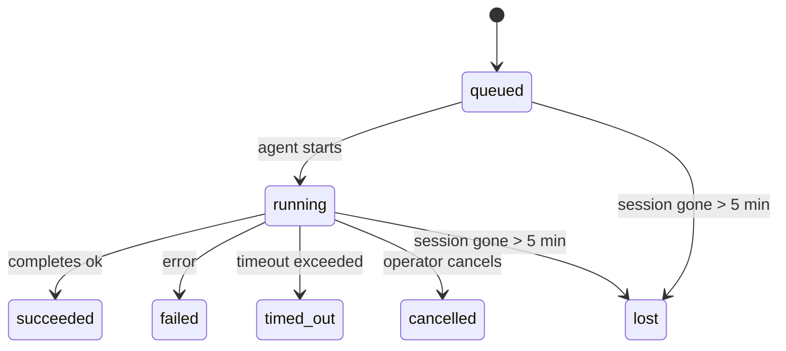

---
read_when:
    - ตรวจสอบงานเบื้องหลังที่กำลังดำเนินการอยู่หรือเพิ่งเสร็จสิ้น
    - การดีบักความล้มเหลวในการนำส่งสำหรับการรันเอเจนต์แบบแยกตัว
    - ทำความเข้าใจว่าการรันในเบื้องหลังเกี่ยวข้องกับเซสชัน Cron และ Heartbeat อย่างไร
sidebarTitle: Background tasks
summary: การติดตามงานเบื้องหลังสำหรับการรัน ACP, subagents, งาน Cron แบบแยก และการดำเนินการของ CLI
title: งานพื้นหลัง
x-i18n:
    generated_at: "2026-05-07T13:13:19Z"
    model: gpt-5.5
    provider: openai
    source_hash: a91a04ef6142e488d2fbc459d2c663afb93816a58fe9f52e0a51420703ea2d4d
    source_path: automation/tasks.md
    workflow: 16
---

<Note>
กำลังมองหาการตั้งเวลาอยู่ใช่ไหม? ดู [ระบบอัตโนมัติและงาน](/th/automation) เพื่อเลือกกลไกที่เหมาะสม หน้านี้คือบัญชีกิจกรรมสำหรับงานเบื้องหลัง ไม่ใช่ตัวจัดตารางเวลา
</Note>

งานเบื้องหลังติดตามงานที่ทำงาน **นอกเซสชันการสนทนาหลักของคุณ**: การรัน ACP, การสร้าง subagent, การดำเนินงาน cron แบบแยกเดี่ยว และการดำเนินการที่เริ่มจาก CLI

งานไม่ได้แทนที่เซสชัน งาน cron หรือ Heartbeat - งานคือ **บัญชีกิจกรรม** ที่บันทึกว่างานที่แยกออกไปเกิดอะไรขึ้น เมื่อใด และสำเร็จหรือไม่

<Note>
ไม่ใช่การรัน agent ทุกครั้งที่จะสร้างงาน เทิร์น Heartbeat และแชตโต้ตอบปกติจะไม่สร้างงาน แต่การดำเนินการ cron ทั้งหมด, การสร้าง ACP, การสร้าง subagent และคำสั่ง agent ของ CLI จะสร้างงาน
</Note>

## TL;DR

- งานคือ **ระเบียน** ไม่ใช่ตัวจัดตารางเวลา - cron และ Heartbeat เป็นตัวตัดสินใจว่า _เมื่อใด_ งานจะรัน ส่วนงานติดตามว่า _เกิดอะไรขึ้น_
- ACP, subagent, งาน cron ทั้งหมด และการดำเนินการของ CLI จะสร้างงาน เทิร์น Heartbeat จะไม่สร้าง
- แต่ละงานจะเคลื่อนผ่าน `queued → running → terminal` (succeeded, failed, timed_out, cancelled หรือ lost)
- งาน cron จะยังคงทำงานอยู่ตราบใดที่รันไทม์ cron ยังเป็นเจ้าของงานนั้นอยู่ หากสถานะรันไทม์ในหน่วยความจำหายไป การบำรุงรักษางานจะตรวจสอบประวัติการรัน cron ที่คงทนก่อน แล้วจึงทำเครื่องหมายงานว่า lost
- การเสร็จสิ้นขับเคลื่อนแบบ push: งานที่แยกออกไปสามารถแจ้งโดยตรงหรือปลุกเซสชัน/Heartbeat ของผู้ร้องขอเมื่อเสร็จสิ้น ดังนั้นลูป polling สถานะมักไม่ใช่รูปแบบที่เหมาะสม
- การรัน cron แบบแยกเดี่ยวและการเสร็จสิ้นของ subagent จะพยายามอย่างเต็มที่เพื่อล้างแท็บ/โปรเซสของเบราว์เซอร์ที่ติดตามไว้สำหรับเซสชันลูกก่อนการทำบัญชีล้างข้อมูลขั้นสุดท้าย
- การส่งมอบ cron แบบแยกเดี่ยวจะระงับการตอบกลับชั่วคราวที่ล้าสมัยจาก parent ขณะที่งาน subagent สืบทอดยังคงกำลังระบายอยู่ และจะเลือกเอาต์พุตสุดท้ายจาก descendant เมื่อเอาต์พุตนั้นมาถึงก่อนการส่งมอบ
- การแจ้งเตือนการเสร็จสิ้นจะถูกส่งโดยตรงไปยังช่องทางหรือเข้าคิวไว้สำหรับ Heartbeat ถัดไป
- `openclaw tasks list` แสดงงานทั้งหมด; `openclaw tasks audit` แสดงปัญหา
- ระเบียน terminal จะถูกเก็บไว้ 7 วัน แล้วตัดออกโดยอัตโนมัติ

## เริ่มต้นอย่างรวดเร็ว

<Tabs>
  <Tab title="แสดงรายการและกรอง">
    ```bash
    # List all tasks (newest first)
    openclaw tasks list

    # Filter by runtime or status
    openclaw tasks list --runtime acp
    openclaw tasks list --status running
    ```

  </Tab>
  <Tab title="ตรวจสอบ">
    ```bash
    # Show details for a specific task (by ID, run ID, or session key)
    openclaw tasks show <lookup>
    ```
  </Tab>
  <Tab title="ยกเลิกและแจ้งเตือน">
    ```bash
    # Cancel a running task (kills the child session)
    openclaw tasks cancel <lookup>

    # Change notification policy for a task
    openclaw tasks notify <lookup> state_changes
    ```

  </Tab>
  <Tab title="ตรวจสอบและบำรุงรักษา">
    ```bash
    # Run a health audit
    openclaw tasks audit

    # Preview or apply maintenance
    openclaw tasks maintenance
    openclaw tasks maintenance --apply
    ```

  </Tab>
  <Tab title="โฟลว์งาน">
    ```bash
    # Inspect TaskFlow state
    openclaw tasks flow list
    openclaw tasks flow show <lookup>
    openclaw tasks flow cancel <lookup>
    ```
  </Tab>
</Tabs>

## สิ่งที่สร้างงาน

| แหล่งที่มา                 | ประเภทรันไทม์ | เมื่อสร้างระเบียนงาน                          | นโยบายแจ้งเตือนเริ่มต้น |
| ---------------------- | ------------ | ------------------------------------------------------ | --------------------- |
| การรันเบื้องหลังของ ACP    | `acp`        | การสร้างเซสชัน ACP ลูก                           | `done_only`           |
| การประสานงาน subagent | `subagent`   | การสร้าง subagent ผ่าน `sessions_spawn`               | `done_only`           |
| งาน cron (ทุกประเภท)  | `cron`       | การดำเนินการ cron ทุกครั้ง (main-session และ isolated)       | `silent`              |
| การดำเนินการของ CLI         | `cli`        | คำสั่ง `openclaw agent` ที่รันผ่าน Gateway | `silent`              |
| งานสื่อของ agent       | `cli`        | การรัน `music_generate`/`video_generate` ที่มีเซสชันรองรับ  | `silent`              |

<AccordionGroup>
  <Accordion title="ค่าเริ่มต้นการแจ้งเตือนสำหรับ cron และสื่อ">
    งาน cron ของ main-session ใช้นโยบายแจ้งเตือน `silent` โดยค่าเริ่มต้น - งานเหล่านี้สร้างระเบียนสำหรับการติดตามแต่ไม่สร้างการแจ้งเตือน งาน cron แบบแยกเดี่ยวยังมีค่าเริ่มต้นเป็น `silent` เช่นกัน แต่จะเห็นได้ชัดกว่าเพราะรันในเซสชันของตัวเอง

    การรัน `music_generate` และ `video_generate` ที่มีเซสชันรองรับก็ใช้นโยบายแจ้งเตือน `silent` เช่นกัน การรันเหล่านี้ยังคงสร้างระเบียนงาน แต่การเสร็จสิ้นจะถูกส่งกลับไปยังเซสชัน agent เดิมเป็นการปลุกภายใน เพื่อให้ agent เขียนข้อความติดตามและแนบสื่อที่เสร็จแล้วได้เอง การเสร็จสิ้นในกลุ่ม/ช่องทางจะทำตามนโยบายการตอบกลับที่มองเห็นได้ตามปกติ ดังนั้น agent จะใช้เครื่องมือข้อความเมื่อการส่งมอบจากแหล่งที่มาต้องการ หาก agent สำหรับการเสร็จสิ้นไม่สามารถสร้างหลักฐานการส่งมอบด้วยเครื่องมือข้อความในเส้นทางที่ใช้เฉพาะเครื่องมือ OpenClaw จะส่ง fallback ของการเสร็จสิ้นโดยตรงไปยังช่องทางเดิมแทนการปล่อยให้สื่อเป็นส่วนตัว

  </Accordion>
  <Accordion title="ราวกั้นสำหรับ video_generate พร้อมกัน">
    ขณะที่งาน `video_generate` ที่มีเซสชันรองรับยังคง active อยู่ เครื่องมือจะทำหน้าที่เป็นราวกั้นด้วย: การเรียก `video_generate` ซ้ำในเซสชันเดียวกันนั้นจะส่งคืนสถานะงานที่ active แทนการเริ่มการสร้างครั้งที่สองพร้อมกัน ใช้ `action: "status"` เมื่อคุณต้องการดูความคืบหน้า/สถานะอย่างชัดเจนจากฝั่ง agent
  </Accordion>
  <Accordion title="สิ่งที่ไม่สร้างงาน">
    - เทิร์น Heartbeat - main-session; ดู [Heartbeat](/th/gateway/heartbeat)
    - เทิร์นแชตโต้ตอบปกติ
    - การตอบกลับ `/command` โดยตรง

  </Accordion>
</AccordionGroup>

## วงจรชีวิตของงาน



| สถานะ      | ความหมาย                                                              |
| ----------- | -------------------------------------------------------------------------- |
| `queued`    | สร้างแล้ว กำลังรอให้ agent เริ่ม                                    |
| `running`   | เทิร์นของ agent กำลังดำเนินการอยู่                                           |
| `succeeded` | เสร็จสมบูรณ์สำเร็จ                                                     |
| `failed`    | เสร็จสิ้นพร้อมข้อผิดพลาด                                                    |
| `timed_out` | เกิน timeout ที่กำหนดค่าไว้                                            |
| `cancelled` | ถูกหยุดโดย operator ผ่าน `openclaw tasks cancel`                        |
| `lost`      | รันไทม์สูญเสียสถานะ backing ที่เป็นแหล่งอ้างอิงหลังช่วงผ่อนผัน 5 นาที |

การเปลี่ยนสถานะเกิดขึ้นโดยอัตโนมัติ - เมื่อการรัน agent ที่เกี่ยวข้องสิ้นสุดลง สถานะงานจะอัปเดตให้ตรงกัน

การเสร็จสิ้นของการรัน agent เป็นแหล่งอ้างอิงสำหรับระเบียนงานที่ active อยู่ การรันที่แยกออกไปและสำเร็จจะจบเป็น `succeeded`, ข้อผิดพลาดของการรันทั่วไปจะจบเป็น `failed` และผลลัพธ์ timeout หรือ abort จะจบเป็น `timed_out` หาก operator ยกเลิกงานไปแล้ว หรือรันไทม์บันทึกสถานะ terminal ที่แรงกว่าไว้แล้ว เช่น `failed`, `timed_out` หรือ `lost` สัญญาณสำเร็จที่มาทีหลังจะไม่ลดระดับสถานะ terminal นั้น

`lost` รับรู้รันไทม์:

- งาน ACP: เมทาดาทาของเซสชัน ACP ลูกที่เป็น backing หายไป
- งาน subagent: เซสชันลูกที่เป็น backing หายไปจากสโตร์ของ agent เป้าหมาย
- งาน cron: รันไทม์ cron ไม่ได้ติดตามงานนั้นเป็น active อีกต่อไป และประวัติการรัน cron ที่คงทนไม่แสดงผลลัพธ์ terminal สำหรับการรันนั้น การตรวจสอบ CLI แบบออฟไลน์จะไม่ถือว่าสถานะรันไทม์ cron ในโปรเซสของตัวเองที่ว่างเปล่าเป็นแหล่งอ้างอิง
- งาน CLI: งานที่มี run id/source id ใช้บริบทการรันจริง ดังนั้นแถว child-session หรือ chat-session ที่ยังค้างอยู่จะไม่ทำให้งานยัง active ต่อไปหลังจากการรันที่ Gateway เป็นเจ้าของหายไป งาน CLI แบบเดิมที่ไม่มีตัวตนการรันยังคง fallback ไปยังเซสชันลูก การรัน `openclaw agent` ที่มี Gateway รองรับจะจบจากผลลัพธ์การรันด้วย ดังนั้นการรันที่เสร็จแล้วจะไม่ค้าง active จนกว่า sweeper จะทำเครื่องหมายเป็น `lost`

## การส่งมอบและการแจ้งเตือน

เมื่องานเข้าสู่สถานะ terminal OpenClaw จะแจ้งเตือนคุณ มีเส้นทางการส่งมอบสองแบบ:

**การส่งมอบโดยตรง** - หากงานมีเป้าหมายช่องทาง (`requesterOrigin`) ข้อความการเสร็จสิ้นจะไปยังช่องทางนั้นโดยตรง (Telegram, Discord, Slack ฯลฯ) สำหรับการเสร็จสิ้นของ subagent OpenClaw ยังรักษาการกำหนดเส้นทาง thread/topic ที่ผูกไว้เมื่อมีอยู่ และสามารถเติม `to` / account ที่หายไปจากเส้นทางที่เก็บไว้ของเซสชันผู้ร้องขอ (`lastChannel` / `lastTo` / `lastAccountId`) ก่อนจะยอมแพ้กับการส่งมอบโดยตรง

**การส่งมอบแบบเข้าคิวเซสชัน** - หากการส่งมอบโดยตรงล้มเหลวหรือไม่ได้ตั้ง origin ไว้ การอัปเดตจะถูกเข้าคิวเป็นเหตุการณ์ระบบในเซสชันของผู้ร้องขอ และจะแสดงใน Heartbeat ถัดไป

<Tip>
การเสร็จสิ้นของงานจะกระตุ้นการปลุก Heartbeat ทันที เพื่อให้คุณเห็นผลลัพธ์อย่างรวดเร็ว - คุณไม่ต้องรอ tick Heartbeat ตามกำหนดการครั้งถัดไป
</Tip>

นั่นหมายความว่า workflow ปกติเป็นแบบ push-based: เริ่มงานที่แยกออกไปหนึ่งครั้ง แล้วปล่อยให้รันไทม์ปลุกหรือแจ้งเตือนคุณเมื่อเสร็จสิ้น ตรวจสอบสถานะงานแบบ polling เฉพาะเมื่อคุณต้อง debug, แทรกแซง หรือต้องการ audit อย่างชัดเจนเท่านั้น

### นโยบายการแจ้งเตือน

ควบคุมว่าคุณจะได้ยินเกี่ยวกับแต่ละงานมากน้อยเพียงใด:

| นโยบาย                | สิ่งที่ถูกส่งมอบ                                                       |
| --------------------- | ----------------------------------------------------------------------- |
| `done_only` (ค่าเริ่มต้น) | เฉพาะสถานะ terminal (succeeded, failed ฯลฯ) - **นี่คือค่าเริ่มต้น** |
| `state_changes`       | ทุกการเปลี่ยนสถานะและการอัปเดตความคืบหน้า                              |
| `silent`              | ไม่มีอะไรเลย                                                          |

เปลี่ยนนโยบายขณะงานกำลังรัน:

```bash
openclaw tasks notify <lookup> state_changes
```

## อ้างอิง CLI

<AccordionGroup>
  <Accordion title="tasks list">
    ```bash
    openclaw tasks list [--runtime <acp|subagent|cron|cli>] [--status <status>] [--json]
    ```

    คอลัมน์เอาต์พุต: Task ID, Kind, Status, Delivery, Run ID, Child Session, Summary.

  </Accordion>
  <Accordion title="tasks show">
    ```bash
    openclaw tasks show <lookup>
    ```

    โทเค็น lookup รับ ID งาน, ID การรัน หรือคีย์เซสชัน แสดงระเบียนเต็ม รวมถึงเวลา สถานะการส่งมอบ ข้อผิดพลาด และสรุป terminal

  </Accordion>
  <Accordion title="tasks cancel">
    ```bash
    openclaw tasks cancel <lookup>
    ```

    สำหรับงาน ACP และ subagent คำสั่งนี้จะ kill เซสชันลูก สำหรับงานที่ติดตามโดย CLI การยกเลิกจะถูกบันทึกในรีจิสทรีงาน (ไม่มี handle รันไทม์ลูกแยกต่างหาก) สถานะจะเปลี่ยนเป็น `cancelled` และจะส่งการแจ้งเตือนการส่งมอบเมื่อใช้ได้

  </Accordion>
  <Accordion title="tasks notify">
    ```bash
    openclaw tasks notify <lookup> <done_only|state_changes|silent>
    ```
  </Accordion>
  <Accordion title="tasks audit">
    ```bash
    openclaw tasks audit [--json]
    ```

    แสดงปัญหาด้านการดำเนินงาน Findings จะปรากฏใน `openclaw status` ด้วยเมื่อตรวจพบปัญหา

    | ผลการตรวจพบ              | ความรุนแรง | ตัวกระตุ้น                                                                                                      |
    | ------------------------- | ---------- | ------------------------------------------------------------------------------------------------------------ |
    | `stale_queued`            | warn       | อยู่ในคิวนานกว่า 10 นาที                                                                              |
    | `stale_running`           | error      | กำลังทำงานนานกว่า 30 นาที                                                                             |
    | `lost`                    | warn/error | ความเป็นเจ้าของงานที่มีรันไทม์รองรับหายไป; งานที่สูญหายซึ่งถูกเก็บไว้จะแจ้งเตือนจนถึง `cleanupAfter` แล้วจึงกลายเป็นข้อผิดพลาด |
    | `delivery_failed`         | warn       | การส่งล้มเหลวและนโยบายแจ้งเตือนไม่ใช่ `silent`                                                            |
    | `missing_cleanup`         | warn       | งานสถานะปลายทางที่ไม่มีเวลาประทับการล้างข้อมูล                                                                      |
    | `inconsistent_timestamps` | warn       | การละเมิดลำดับเวลา (เช่น สิ้นสุดก่อนเริ่มต้น)                                                        |

  </Accordion>
  <Accordion title="การบำรุงรักษางาน">
    ```bash
    openclaw tasks maintenance [--json]
    openclaw tasks maintenance --apply [--json]
    ```

    ใช้คำสั่งนี้เพื่อดูตัวอย่างหรือใช้การกระทบยอด การประทับเวลาล้างข้อมูล และการตัดข้อมูลสำหรับงานและสถานะ Task Flow

    การกระทบยอดรับรู้รันไทม์:

    - งาน ACP/subagent ตรวจสอบเซสชันลูกที่รองรับงานนั้น
    - งาน subagent ที่เซสชันลูกมี tombstone การกู้คืนหลังรีสตาร์ทจะถูกทำเครื่องหมายว่าสูญหาย แทนที่จะถือว่าเป็นเซสชันรองรับที่กู้คืนได้
    - งาน Cron ตรวจสอบว่ารันไทม์ cron ยังเป็นเจ้าของงานอยู่หรือไม่ จากนั้นกู้คืนสถานะปลายทางจากบันทึกการรัน cron/สถานะงานที่คงอยู่ ก่อนถอยกลับไปเป็น `lost` เฉพาะกระบวนการ Gateway เท่านั้นที่เป็นแหล่งอ้างอิงสำหรับชุด active-job ของ cron ในหน่วยความจำ; การตรวจสอบ CLI แบบออฟไลน์ใช้ประวัติที่คงอยู่ แต่จะไม่ทำเครื่องหมายงาน cron ว่าสูญหายเพียงเพราะ Set ภายในเครื่องนั้นว่าง
    - งาน CLI ที่มีข้อมูลระบุตัวตนการรันจะตรวจสอบบริบทการรันสดที่เป็นเจ้าของ ไม่ใช่แค่แถว child-session หรือ chat-session

    การล้างข้อมูลเมื่อเสร็จสิ้นก็รับรู้รันไทม์เช่นกัน:

    - การเสร็จสิ้นของ subagent จะพยายามปิดแท็บเบราว์เซอร์/กระบวนการที่ติดตามไว้สำหรับเซสชันลูก ก่อนที่การล้างข้อมูลประกาศจะดำเนินต่อ
    - การเสร็จสิ้นของ cron แบบแยกจะพยายามปิดแท็บเบราว์เซอร์/กระบวนการที่ติดตามไว้สำหรับเซสชัน cron ก่อนที่การรันจะถูกรื้อถอนทั้งหมด
    - การส่งของ cron แบบแยกจะรอการติดตามผลจาก subagent ลูกหลานเมื่อจำเป็น และระงับข้อความตอบรับของพาเรนต์ที่ค้างแทนที่จะประกาศข้อความนั้น
    - การส่งเมื่อ subagent เสร็จสิ้นจะเลือกข้อความผู้ช่วยล่าสุดที่มองเห็นได้ก่อน; หากว่าง จะถอยกลับไปใช้ข้อความ tool/toolResult ล่าสุดที่ผ่านการทำความสะอาดแล้ว และการรัน tool-call ที่หมดเวลาอย่างเดียวอาจยุบเป็นสรุปความคืบหน้าบางส่วนแบบสั้น การรันที่ล้มเหลวในสถานะปลายทางจะประกาศสถานะล้มเหลวโดยไม่เล่นซ้ำข้อความตอบกลับที่จับไว้
    - ความล้มเหลวของการล้างข้อมูลจะไม่บดบังผลลัพธ์จริงของงาน

  </Accordion>
  <Accordion title="รายการ | แสดง | ยกเลิก flow ของงาน">
    ```bash
    openclaw tasks flow list [--status <status>] [--json]
    openclaw tasks flow show <lookup> [--json]
    openclaw tasks flow cancel <lookup>
    ```

    ใช้คำสั่งเหล่านี้เมื่อ Task Flow ที่ทำหน้าที่ประสานงานคือสิ่งที่คุณสนใจ แทนที่จะเป็นระเบียนงานเบื้องหลังรายการเดียว

  </Accordion>
</AccordionGroup>

## กระดานงานแชท (`/tasks`)

ใช้ `/tasks` ในเซสชันแชทใดก็ได้เพื่อดูงานเบื้องหลังที่เชื่อมโยงกับเซสชันนั้น กระดานจะแสดงงานที่ทำงานอยู่และงานที่เพิ่งเสร็จสิ้น พร้อมรันไทม์ สถานะ เวลา และรายละเอียดความคืบหน้าหรือข้อผิดพลาด

เมื่อเซสชันปัจจุบันไม่มีงานที่เชื่อมโยงซึ่งมองเห็นได้ `/tasks` จะถอยกลับไปใช้จำนวนงานเฉพาะเอเจนต์ เพื่อให้คุณยังเห็นภาพรวมได้โดยไม่รั่วไหลรายละเอียดของเซสชันอื่น

สำหรับบัญชีแยกประเภทของผู้ปฏิบัติงานทั้งหมด ให้ใช้ CLI: `openclaw tasks list`

## การผสานรวมสถานะ (แรงกดดันจากงาน)

`openclaw status` มีสรุปงานแบบดูได้ทันที:

```
Tasks: 3 queued · 2 running · 1 issues
```

สรุปรายงาน:

- **active** - จำนวนของ `queued` + `running`
- **failures** - จำนวนของ `failed` + `timed_out` + `lost`
- **byRuntime** - แจกแจงตาม `acp`, `subagent`, `cron`, `cli`

ทั้ง `/status` และเครื่องมือ `session_status` ใช้สแนปช็อตงานที่รับรู้การล้างข้อมูล: งานที่ทำงานอยู่จะถูกเลือกก่อน แถวที่เสร็จสิ้นแล้วและค้างจะถูกซ่อน และความล้มเหลวล่าสุดจะแสดงขึ้นเฉพาะเมื่อไม่มีงานที่ทำงานอยู่เหลืออยู่ วิธีนี้ทำให้การ์ดสถานะโฟกัสกับสิ่งที่สำคัญในตอนนี้

## พื้นที่จัดเก็บและการบำรุงรักษา

### งานอยู่ที่ไหน

ระเบียนงานคงอยู่ใน SQLite ที่:

```
$OPENCLAW_STATE_DIR/tasks/runs.sqlite
```

รีจิสทรีโหลดเข้าสู่หน่วยความจำเมื่อ Gateway เริ่มต้น และซิงก์การเขียนไปยัง SQLite เพื่อความทนทานข้ามการรีสตาร์ท
Gateway จำกัดขนาด write-ahead log ของ SQLite โดยใช้เกณฑ์ autocheckpoint เริ่มต้นของ SQLite
ร่วมกับ checkpoint แบบ `TRUNCATE` เป็นระยะและตอนปิดระบบ

### การบำรุงรักษาอัตโนมัติ

ตัวกวาดทำงานทุก **60 วินาที** และจัดการสี่อย่าง:

<Steps>
  <Step title="การกระทบยอด">
    ตรวจสอบว่างานที่ทำงานอยู่ยังมีรันไทม์รองรับที่เป็นแหล่งอ้างอิงหรือไม่ งาน ACP/subagent ใช้สถานะ child-session งาน cron ใช้ความเป็นเจ้าของ active-job และงาน CLI ที่มีข้อมูลระบุตัวตนการรันใช้บริบทการรันที่เป็นเจ้าของ หากสถานะรองรับนั้นหายไปนานกว่า 5 นาที งานจะถูกทำเครื่องหมายเป็น `lost`
  </Step>
  <Step title="การซ่อมแซมเซสชัน ACP">
    ปิดเซสชัน ACP แบบ one-shot ที่มีพาเรนต์เป็นเจ้าของซึ่งอยู่ในสถานะปลายทางหรือเป็นกำพร้า และปิดเซสชัน ACP แบบ persistent ที่ค้างในสถานะปลายทางหรือเป็นกำพร้าเฉพาะเมื่อไม่มีการผูกการสนทนาที่ทำงานอยู่เหลืออยู่
  </Step>
  <Step title="การประทับเวลาล้างข้อมูล">
    ตั้งเวลา `cleanupAfter` บนงานสถานะปลายทาง (endedAt + 7 วัน) ระหว่างช่วงเก็บรักษา งานที่สูญหายยังปรากฏในการตรวจสอบเป็นคำเตือน; หลังจาก `cleanupAfter` หมดอายุหรือเมื่อไม่มีข้อมูลเมตาการล้างข้อมูล งานเหล่านั้นจะเป็นข้อผิดพลาด
  </Step>
  <Step title="การตัดข้อมูล">
    ลบระเบียนที่พ้นวันที่ `cleanupAfter`
  </Step>
</Steps>

<Note>
**การเก็บรักษา:** ระเบียนงานสถานะปลายทางจะถูกเก็บไว้ **7 วัน** จากนั้นจะถูกตัดออกโดยอัตโนมัติ ไม่ต้องกำหนดค่า
</Note>

## งานสัมพันธ์กับระบบอื่นอย่างไร

<AccordionGroup>
  <Accordion title="งานและ Task Flow">
    [Task Flow](/th/automation/taskflow) คือชั้นการประสาน flow เหนืองานเบื้องหลัง flow เดียวอาจประสานงานหลายงานตลอดอายุการทำงานโดยใช้โหมดซิงก์แบบจัดการหรือแบบมิเรอร์ ใช้ `openclaw tasks` เพื่อตรวจสอบระเบียนงานแต่ละรายการ และ `openclaw tasks flow` เพื่อตรวจสอบ flow ที่ทำหน้าที่ประสานงาน

    ดูรายละเอียดที่ [Task Flow](/th/automation/taskflow)

  </Accordion>
  <Accordion title="งานและ cron">
    **นิยาม** งาน cron อยู่ใน `~/.openclaw/cron/jobs.json`; สถานะการทำงานรันไทม์อยู่ข้างกันใน `~/.openclaw/cron/jobs-state.json` การทำงาน cron **ทุกครั้ง** จะสร้างระเบียนงาน ทั้งแบบ main-session และแบบแยก งาน cron แบบ main-session มีนโยบายแจ้งเตือนเริ่มต้นเป็น `silent` เพื่อให้ติดตามได้โดยไม่สร้างการแจ้งเตือน

    ดู [งาน Cron](/th/automation/cron-jobs)

  </Accordion>
  <Accordion title="งานและ Heartbeat">
    การรัน Heartbeat เป็นรอบของ main-session และจะไม่สร้างระเบียนงาน เมื่องานเสร็จสิ้น งานนั้นสามารถกระตุ้นการปลุก Heartbeat เพื่อให้คุณเห็นผลลัพธ์ได้ทันที

    ดู [Heartbeat](/th/gateway/heartbeat)

  </Accordion>
  <Accordion title="งานและเซสชัน">
    งานอาจอ้างอิง `childSessionKey` (ที่ที่งานทำงาน) และ `requesterSessionKey` (ผู้ที่เริ่มงาน) เซสชันคือบริบทการสนทนา; งานคือการติดตามกิจกรรมที่อยู่เหนือสิ่งนั้น
  </Accordion>
  <Accordion title="งานและการรันของเอเจนต์">
    `runId` ของงานเชื่อมไปยังการรันของเอเจนต์ที่ทำงานนั้นอยู่ เหตุการณ์วงจรชีวิตของเอเจนต์ (เริ่มต้น สิ้นสุด ข้อผิดพลาด) จะอัปเดตสถานะงานโดยอัตโนมัติ คุณไม่จำเป็นต้องจัดการวงจรชีวิตด้วยตนเอง
  </Accordion>
</AccordionGroup>

## ที่เกี่ยวข้อง

- [ระบบอัตโนมัติและงาน](/th/automation) - กลไกระบบอัตโนมัติทั้งหมดโดยสรุป
- [CLI: งาน](/th/cli/tasks) - เอกสารอ้างอิงคำสั่ง CLI
- [Heartbeat](/th/gateway/heartbeat) - รอบ main-session เป็นระยะ
- [งานตามกำหนดเวลา](/th/automation/cron-jobs) - การจัดตารางงานเบื้องหลัง
- [Task Flow](/th/automation/taskflow) - การประสาน flow เหนืองาน
