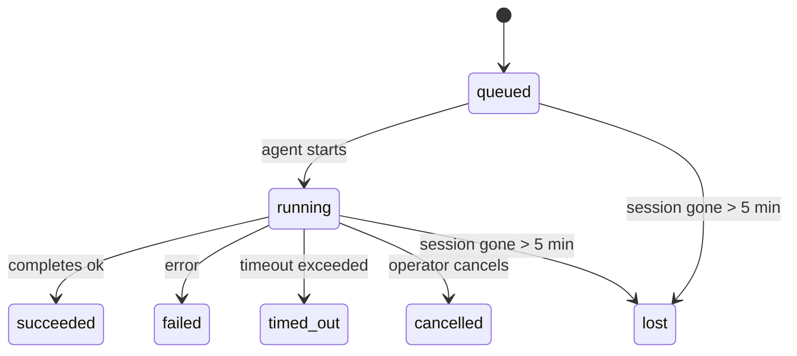

---
read_when:
    - การตรวจสอบงานเบื้องหลังที่กำลังดำเนินอยู่หรือเพิ่งเสร็จสิ้น
    - การดีบักความล้มเหลวในการนำส่งสำหรับการรันเอเจนต์แบบแยกออก
    - ทำความเข้าใจว่าการรันเบื้องหลังสัมพันธ์กับเซสชัน, Cron และ Heartbeat อย่างไร
sidebarTitle: Background tasks
summary: การติดตามงานเบื้องหลังสำหรับการรัน ACP, เอเจนต์ย่อย, งาน Cron แบบแยกต่างหาก และการดำเนินการ CLI
title: งานเบื้องหลัง
x-i18n:
    generated_at: "2026-05-05T01:44:36Z"
    model: gpt-5.5
    provider: openai
    source_hash: 60d6ea6178535b19b95d761b8e8b05a665234584ae69852fd21097988aa32991
    source_path: automation/tasks.md
    workflow: 16
---

<Note>
กำลังมองหาการตั้งเวลาอยู่หรือไม่? ดู [ระบบอัตโนมัติและงาน](/th/automation) เพื่อเลือกกลไกที่เหมาะสม หน้านี้คือบัญชีกิจกรรมสำหรับงานเบื้องหลัง ไม่ใช่ตัวจัดกำหนดการ
</Note>

งานเบื้องหลังติดตามงานที่ทำงาน **นอกเซสชันการสนทนาหลักของคุณ**: การรัน ACP, การสร้าง subagent, การดำเนินงาน cron job แบบแยก, และการทำงานที่เริ่มจาก CLI

งาน **ไม่** ได้มาแทนที่เซสชัน, cron job, หรือ Heartbeat — งานเป็น **บัญชีกิจกรรม** ที่บันทึกว่างานที่แยกออกไปเกิดขึ้นเมื่อใด และสำเร็จหรือไม่

<Note>
ไม่ใช่การรัน agent ทุกครั้งที่จะสร้างงาน เทิร์น Heartbeat และแชตโต้ตอบปกติจะไม่สร้างงาน การดำเนินการ cron ทั้งหมด, การสร้าง ACP, การสร้าง subagent, และคำสั่ง agent ผ่าน CLI จะสร้างงาน
</Note>

## สรุปสั้น

- งานคือ **ระเบียน** ไม่ใช่ตัวจัดกำหนดการ — cron และ Heartbeat ตัดสินใจว่า งานจะรัน _เมื่อใด_ ส่วนงานติดตามว่า _เกิดอะไรขึ้น_
- ACP, subagent, cron job ทั้งหมด, และการทำงานผ่าน CLI จะสร้างงาน เทิร์น Heartbeat จะไม่สร้างงาน
- แต่ละงานจะเคลื่อนผ่าน `queued → running → terminal` (succeeded, failed, timed_out, cancelled, หรือ lost)
- งาน cron จะยังมีสถานะใช้งานอยู่ตราบใดที่ runtime ของ cron ยังเป็นเจ้าของงานนั้นอยู่ หากสถานะ runtime ในหน่วยความจำหายไป การบำรุงรักษางานจะตรวจสอบประวัติการรัน cron ที่คงทนก่อน แล้วจึงทำเครื่องหมายงานว่า lost
- การเสร็จสิ้นขับเคลื่อนด้วยการส่งแจ้ง: งานที่แยกออกไปสามารถแจ้งโดยตรงหรือปลุกเซสชัน/Heartbeat ของผู้ร้องขอเมื่อเสร็จ ดังนั้นลูป polling สถานะมักไม่ใช่รูปแบบที่เหมาะสม
- การรัน cron แบบแยกและการเสร็จสิ้นของ subagent จะพยายามล้างแท็บเบราว์เซอร์/โปรเซสที่ติดตามไว้สำหรับเซสชันลูก ก่อนการทำบัญชีล้างข้อมูลสุดท้าย
- การส่งมอบ cron แบบแยกจะระงับคำตอบชั่วคราวที่ล้าสมัยจาก parent ในขณะที่งาน subagent รุ่นถัดลงมายังระบายงานอยู่ และจะเลือกเอาต์พุตสุดท้ายจากรุ่นถัดลงมาเมื่อมาถึงก่อนการส่งมอบ
- การแจ้งเตือนการเสร็จสิ้นจะถูกส่งโดยตรงไปยังช่องทาง หรือเข้าคิวไว้สำหรับ Heartbeat ถัดไป
- `openclaw tasks list` แสดงงานทั้งหมด; `openclaw tasks audit` แสดงปัญหา
- ระเบียน terminal จะถูกเก็บไว้ 7 วัน แล้วถูกล้างออกโดยอัตโนมัติ

## เริ่มต้นอย่างรวดเร็ว

<Tabs>
  <Tab title="แสดงรายการและกรอง">
    ```bash
    # List all tasks (newest first)
    openclaw tasks list

    # Filter by runtime or status
    openclaw tasks list --runtime acp
    openclaw tasks list --status running
    ```

  </Tab>
  <Tab title="ตรวจสอบ">
    ```bash
    # Show details for a specific task (by ID, run ID, or session key)
    openclaw tasks show <lookup>
    ```
  </Tab>
  <Tab title="ยกเลิกและแจ้งเตือน">
    ```bash
    # Cancel a running task (kills the child session)
    openclaw tasks cancel <lookup>

    # Change notification policy for a task
    openclaw tasks notify <lookup> state_changes
    ```

  </Tab>
  <Tab title="ตรวจสอบและบำรุงรักษา">
    ```bash
    # Run a health audit
    openclaw tasks audit

    # Preview or apply maintenance
    openclaw tasks maintenance
    openclaw tasks maintenance --apply
    ```

  </Tab>
  <Tab title="โฟลว์งาน">
    ```bash
    # Inspect TaskFlow state
    openclaw tasks flow list
    openclaw tasks flow show <lookup>
    openclaw tasks flow cancel <lookup>
    ```
  </Tab>
</Tabs>

## สิ่งที่สร้างงาน

| แหล่งที่มา                 | ประเภท runtime | เมื่อมีการสร้างระเบียนงาน                          | นโยบายแจ้งเตือนเริ่มต้น |
| ---------------------- | ------------ | ------------------------------------------------------ | --------------------- |
| การรันเบื้องหลัง ACP    | `acp`        | การสร้างเซสชัน ACP ลูก                           | `done_only`           |
| การจัดการ subagent | `subagent`   | การสร้าง subagent ผ่าน `sessions_spawn`               | `done_only`           |
| งาน cron (ทุกประเภท)  | `cron`       | ทุกการดำเนินการ cron (เซสชันหลักและแบบแยก)       | `silent`              |
| การทำงานผ่าน CLI         | `cli`        | คำสั่ง `openclaw agent` ที่รันผ่าน Gateway | `silent`              |
| งานสื่อของ agent       | `cli`        | การรัน `music_generate`/`video_generate` ที่มีเซสชันรองรับ  | `silent`              |

<AccordionGroup>
  <Accordion title="ค่าเริ่มต้นการแจ้งเตือนสำหรับ cron และสื่อ">
    งาน cron ในเซสชันหลักใช้นโยบายแจ้งเตือน `silent` เป็นค่าเริ่มต้น — งานเหล่านี้สร้างระเบียนสำหรับการติดตาม แต่ไม่สร้างการแจ้งเตือน งาน cron แบบแยกก็ใช้ค่าเริ่มต้นเป็น `silent` เช่นกัน แต่มองเห็นได้ชัดกว่าเพราะทำงานในเซสชันของตัวเอง

    การรัน `music_generate` และ `video_generate` ที่มีเซสชันรองรับก็ใช้นโยบายแจ้งเตือน `silent` เช่นกัน การรันเหล่านี้ยังคงสร้างระเบียนงาน แต่การเสร็จสิ้นจะถูกส่งกลับไปยังเซสชัน agent เดิมในรูปแบบ wake ภายใน เพื่อให้ agent เขียนข้อความติดตามผลและแนบสื่อที่เสร็จแล้วด้วยตัวเอง การเสร็จสิ้นในกลุ่ม/ช่องทางจะใช้หลักการตอบกลับที่มองเห็นได้ตามปกติ ดังนั้น agent จะใช้เครื่องมือส่งข้อความเมื่อการส่งจากต้นทางต้องการเช่นนั้น

  </Accordion>
  <Accordion title="ราวกันสำหรับ video_generate พร้อมกัน">
    ขณะที่งาน `video_generate` ที่มีเซสชันรองรับยังทำงานอยู่ เครื่องมือนี้จะทำหน้าที่เป็นราวกันด้วย: การเรียก `video_generate` ซ้ำในเซสชันเดียวกันจะส่งคืนสถานะงานที่ใช้งานอยู่ แทนที่จะเริ่มการสร้างพร้อมกันอีกงานหนึ่ง ใช้ `action: "status"` เมื่อคุณต้องการค้นหาความคืบหน้า/สถานะอย่างชัดเจนจากฝั่ง agent
  </Accordion>
  <Accordion title="สิ่งที่ไม่สร้างงาน">
    - เทิร์น Heartbeat — เซสชันหลัก; ดู [Heartbeat](/th/gateway/heartbeat)
    - เทิร์นแชตโต้ตอบปกติ
    - การตอบกลับ `/command` โดยตรง

  </Accordion>
</AccordionGroup>

## วงจรชีวิตของงาน



| สถานะ      | ความหมาย                                                              |
| ----------- | -------------------------------------------------------------------------- |
| `queued`    | สร้างแล้ว กำลังรอให้ agent เริ่ม                                    |
| `running`   | เทิร์นของ agent กำลังดำเนินการอยู่                                           |
| `succeeded` | เสร็จสมบูรณ์สำเร็จ                                                     |
| `failed`    | เสร็จสิ้นพร้อมข้อผิดพลาด                                                    |
| `timed_out` | เกินเวลาที่กำหนดไว้                                            |
| `cancelled` | ถูกหยุดโดยผู้ปฏิบัติงานผ่าน `openclaw tasks cancel`                        |
| `lost`      | runtime สูญเสียสถานะรองรับที่เป็นแหล่งอ้างอิงหลังช่วงผ่อนผัน 5 นาที |

การเปลี่ยนสถานะเกิดขึ้นโดยอัตโนมัติ — เมื่อการรัน agent ที่เกี่ยวข้องจบลง สถานะงานจะอัปเดตให้ตรงกัน

การเสร็จสิ้นของการรัน agent เป็นแหล่งอ้างอิงสำหรับระเบียนงานที่ใช้งานอยู่ การรันที่แยกออกไปและสำเร็จจะจบเป็น `succeeded`, ข้อผิดพลาดการรันทั่วไปจะจบเป็น `failed`, และผลลัพธ์แบบ timeout หรือ abort จะจบเป็น `timed_out` หากผู้ปฏิบัติงานยกเลิกงานไปแล้ว หรือ runtime บันทึกสถานะ terminal ที่แรงกว่าไว้แล้ว เช่น `failed`, `timed_out`, หรือ `lost` สัญญาณสำเร็จที่มาภายหลังจะไม่ลดระดับสถานะ terminal นั้น

`lost` คำนึงถึง runtime:

- งาน ACP: metadata ของเซสชัน ACP ลูกที่รองรับหายไป
- งาน subagent: เซสชันลูกที่รองรับหายไปจากที่เก็บ agent เป้าหมาย
- งาน cron: runtime ของ cron ไม่ได้ติดตามงานเป็น active อีกต่อไป และประวัติการรัน cron ที่คงทนไม่ได้แสดงผลลัพธ์ terminal สำหรับการรันนั้น การ audit ผ่าน CLI แบบออฟไลน์จะไม่ถือว่าสถานะ runtime cron ในโปรเซสที่ว่างเปล่าของตัวเองเป็นแหล่งอ้างอิง
- งาน CLI: งานเซสชันลูกแบบแยกใช้เซสชันลูก; งาน CLI ที่มีแชตรองรับใช้บริบทการรันสดแทน ดังนั้นแถวเซสชันช่องทาง/กลุ่ม/โดยตรงที่ค้างอยู่จะไม่ทำให้งานยังมีชีวิตอยู่ การรัน `openclaw agent` ที่มี Gateway รองรับจะจบจากผลลัพธ์การรันของตัวเองด้วย ดังนั้นการรันที่เสร็จแล้วจะไม่คงสถานะ active จนกว่า sweeper จะทำเครื่องหมายเป็น `lost`

## การส่งมอบและการแจ้งเตือน

เมื่องานถึงสถานะ terminal, OpenClaw จะแจ้งคุณ มีเส้นทางการส่งมอบสองแบบ:

**การส่งมอบโดยตรง** — หากงานมีเป้าหมายช่องทาง (`requesterOrigin`) ข้อความเสร็จสิ้นจะถูกส่งตรงไปยังช่องทางนั้น (Telegram, Discord, Slack, ฯลฯ) สำหรับการเสร็จสิ้นของ subagent, OpenClaw ยังรักษาการกำหนดเส้นทางเธรด/หัวข้อที่ผูกไว้เมื่อมีอยู่ และสามารถเติม `to` / account ที่ขาดหายจากเส้นทางที่เก็บไว้ในเซสชันของผู้ร้องขอ (`lastChannel` / `lastTo` / `lastAccountId`) ก่อนที่จะยอมแพ้ต่อการส่งมอบโดยตรง

**การส่งมอบแบบเข้าคิวในเซสชัน** — หากการส่งมอบโดยตรงล้มเหลวหรือไม่ได้ตั้ง origin ไว้ การอัปเดตจะถูกเข้าคิวเป็นเหตุการณ์ระบบในเซสชันของผู้ร้องขอ และปรากฏใน Heartbeat ถัดไป

<Tip>
การเสร็จสิ้นของงานจะกระตุ้นการปลุก Heartbeat ทันที เพื่อให้คุณเห็นผลลัพธ์อย่างรวดเร็ว — คุณไม่จำเป็นต้องรอ tick ของ Heartbeat ตามกำหนดการถัดไป
</Tip>

นั่นหมายความว่า workflow ปกติเป็นแบบ push-based: เริ่มงานที่แยกออกไปหนึ่งครั้ง แล้วปล่อยให้ runtime ปลุกหรือแจ้งคุณเมื่อเสร็จสิ้น ให้ poll สถานะงานเฉพาะเมื่อคุณต้องการ debug, แทรกแซง, หรือ audit อย่างชัดเจน

### นโยบายการแจ้งเตือน

ควบคุมว่าคุณจะได้ยินเกี่ยวกับแต่ละงานมากเพียงใด:

| นโยบาย                | สิ่งที่ถูกส่งมอบ                                                       |
| --------------------- | ----------------------------------------------------------------------- |
| `done_only` (ค่าเริ่มต้น) | เฉพาะสถานะ terminal (succeeded, failed, ฯลฯ) — **นี่คือค่าเริ่มต้น** |
| `state_changes`       | ทุกการเปลี่ยนสถานะและการอัปเดตความคืบหน้า                              |
| `silent`              | ไม่มีอะไรเลย                                                          |

เปลี่ยนนโยบายขณะที่งานกำลังรัน:

```bash
openclaw tasks notify <lookup> state_changes
```

## อ้างอิง CLI

<AccordionGroup>
  <Accordion title="tasks list">
    ```bash
    openclaw tasks list [--runtime <acp|subagent|cron|cli>] [--status <status>] [--json]
    ```

    คอลัมน์เอาต์พุต: Task ID, Kind, Status, Delivery, Run ID, Child Session, Summary.

  </Accordion>
  <Accordion title="tasks show">
    ```bash
    openclaw tasks show <lookup>
    ```

    token lookup รับ task ID, run ID, หรือ session key แสดงระเบียนเต็ม รวมถึงเวลา สถานะการส่งมอบ ข้อผิดพลาด และสรุป terminal

  </Accordion>
  <Accordion title="tasks cancel">
    ```bash
    openclaw tasks cancel <lookup>
    ```

    สำหรับงาน ACP และ subagent คำสั่งนี้จะ kill เซสชันลูก สำหรับงานที่ติดตามด้วย CLI การยกเลิกจะถูกบันทึกใน task registry (ไม่มี handle runtime ลูกแยกต่างหาก) สถานะจะเปลี่ยนเป็น `cancelled` และจะส่งการแจ้งเตือนการส่งมอบเมื่อใช้ได้

  </Accordion>
  <Accordion title="tasks notify">
    ```bash
    openclaw tasks notify <lookup> <done_only|state_changes|silent>
    ```
  </Accordion>
  <Accordion title="tasks audit">
    ```bash
    openclaw tasks audit [--json]
    ```

    แสดงปัญหาด้านปฏิบัติการ ผลการตรวจพบยังปรากฏใน `openclaw status` เมื่อพบปัญหา

    | ผลการตรวจพบ             | ความรุนแรง | ทริกเกอร์                                                                                                      |
    | ------------------------- | ---------- | ------------------------------------------------------------------------------------------------------------ |
    | `stale_queued`            | warn       | อยู่ในคิวเกิน 10 นาที                                                                              |
    | `stale_running`           | error      | กำลังทำงานเกิน 30 นาที                                                                             |
    | `lost`                    | warn/error | ความเป็นเจ้าของงานที่อิงรันไทม์หายไป; งานที่สูญหายซึ่งถูกเก็บไว้จะแจ้งเตือนจนถึง `cleanupAfter` จากนั้นจะกลายเป็นข้อผิดพลาด |
    | `delivery_failed`         | warn       | การส่งล้มเหลวและนโยบายการแจ้งเตือนไม่ใช่ `silent`                                                            |
    | `missing_cleanup`         | warn       | งานปลายทางที่ไม่มีเวลาประทับการล้างข้อมูล                                                                      |
    | `inconsistent_timestamps` | warn       | การละเมิดไทม์ไลน์ (เช่น สิ้นสุดก่อนเริ่มต้น)                                                        |

  </Accordion>
  <Accordion title="การบำรุงรักษางาน">
    ```bash
    openclaw tasks maintenance [--json]
    openclaw tasks maintenance --apply [--json]
    ```

    ใช้คำสั่งนี้เพื่อดูตัวอย่างหรือใช้การปรับให้สอดคล้อง การประทับเวลาการล้างข้อมูล และการตัดแต่งสำหรับงานและสถานะ Task Flow

    การปรับให้สอดคล้องรับรู้รันไทม์:

    - งาน ACP/subagent ตรวจสอบเซสชันลูกที่รองรับอยู่
    - งาน Subagent ที่เซสชันลูกมี tombstone สำหรับการกู้คืนหลังรีสตาร์ตจะถูกทำเครื่องหมายว่าสูญหาย แทนที่จะถือว่าเป็นเซสชันรองรับที่กู้คืนได้
    - งาน Cron ตรวจสอบว่ารันไทม์ cron ยังเป็นเจ้าของงานอยู่หรือไม่ จากนั้นกู้คืนสถานะปลายทางจากบันทึกการรัน cron/สถานะงานที่คงอยู่ ก่อนย้อนกลับไปเป็น `lost` เฉพาะกระบวนการ Gateway เท่านั้นที่เป็นแหล่งอ้างอิงสำหรับชุดงานที่ใช้งานอยู่ของ cron ในหน่วยความจำ; การตรวจสอบ CLI แบบออฟไลน์ใช้ประวัติที่คงทน แต่จะไม่ทำเครื่องหมายงาน cron ว่าสูญหายเพียงเพราะ Set ภายในเครื่องนั้นว่าง
    - งาน CLI ที่อิงแชทจะตรวจสอบบริบทการรันสดที่เป็นเจ้าของ ไม่ใช่แค่แถวเซสชันแชท

    การล้างข้อมูลเมื่อเสร็จสมบูรณ์ก็รับรู้รันไทม์เช่นกัน:

    - เมื่อ Subagent เสร็จสมบูรณ์ ระบบจะพยายามปิดแท็บเบราว์เซอร์/กระบวนการที่ติดตามไว้สำหรับเซสชันลูก ก่อนการล้างข้อมูลการประกาศจะดำเนินต่อ
    - เมื่อ cron แบบแยกเสร็จสมบูรณ์ ระบบจะพยายามปิดแท็บเบราว์เซอร์/กระบวนการที่ติดตามไว้สำหรับเซสชัน cron ก่อนที่การรันจะถูกรื้อถอนทั้งหมด
    - การส่งของ cron แบบแยกจะรอการติดตามผลจาก subagent ลูกหลานเมื่อจำเป็น และระงับข้อความตอบรับของพาเรนต์ที่ค้าง แทนที่จะประกาศข้อความนั้น
    - การส่งเมื่อ Subagent เสร็จสมบูรณ์จะเลือกข้อความผู้ช่วยที่มองเห็นล่าสุดเป็นอันดับแรก; หากว่างเปล่า ระบบจะย้อนกลับไปใช้ข้อความ tool/toolResult ล่าสุดที่ผ่านการทำความสะอาดแล้ว และการรันการเรียกเครื่องมือที่หมดเวลาเท่านั้นอาจย่อลงเป็นสรุปความคืบหน้าบางส่วนสั้นๆ การรันปลายทางที่ล้มเหลวจะประกาศสถานะล้มเหลวโดยไม่เล่นซ้ำข้อความตอบกลับที่บันทึกไว้
    - ความล้มเหลวในการล้างข้อมูลจะไม่บดบังผลลัพธ์จริงของงาน

  </Accordion>
  <Accordion title="รายการ | แสดง | ยกเลิกโฟลว์งาน">
    ```bash
    openclaw tasks flow list [--status <status>] [--json]
    openclaw tasks flow show <lookup> [--json]
    openclaw tasks flow cancel <lookup>
    ```

    ใช้คำสั่งเหล่านี้เมื่อ Task Flow ที่จัดการการประสานงานคือสิ่งที่คุณสนใจ แทนที่จะเป็นระเบียนงานเบื้องหลังรายตัว

  </Accordion>
</AccordionGroup>

## กระดานงานแชท (`/tasks`)

ใช้ `/tasks` ในเซสชันแชทใดก็ได้เพื่อดูงานเบื้องหลังที่เชื่อมโยงกับเซสชันนั้น กระดานจะแสดงงานที่ใช้งานอยู่และงานที่เสร็จล่าสุด พร้อมรันไทม์ สถานะ เวลา และรายละเอียดความคืบหน้าหรือข้อผิดพลาด

เมื่อเซสชันปัจจุบันไม่มีงานที่เชื่อมโยงซึ่งมองเห็นได้ `/tasks` จะย้อนกลับไปใช้จำนวนงานเฉพาะภายในเอเจนต์ เพื่อให้คุณยังได้ภาพรวมโดยไม่รั่วไหลรายละเอียดของเซสชันอื่น

สำหรับบัญชีแยกประเภทของผู้ปฏิบัติการแบบเต็ม ให้ใช้ CLI: `openclaw tasks list`

## การผสานสถานะ (แรงกดดันของงาน)

`openclaw status` รวมสรุปงานแบบดูได้ทันที:

```
Tasks: 3 queued · 2 running · 1 issues
```

สรุปรายงาน:

- **active** — จำนวนของ `queued` + `running`
- **failures** — จำนวนของ `failed` + `timed_out` + `lost`
- **byRuntime** — การแจกแจงตาม `acp`, `subagent`, `cron`, `cli`

ทั้ง `/status` และเครื่องมือ `session_status` ใช้สแนปช็อตงานที่รับรู้การล้างข้อมูล: งานที่ใช้งานอยู่จะได้รับความสำคัญ แถวที่เสร็จสมบูรณ์แต่ค้างจะถูกซ่อน และความล้มเหลวล่าสุดจะแสดงเฉพาะเมื่อไม่มีงานที่ใช้งานอยู่เหลืออยู่ สิ่งนี้ช่วยให้การ์ดสถานะมุ่งเน้นสิ่งที่สำคัญในตอนนี้

## พื้นที่จัดเก็บและการบำรุงรักษา

### งานอยู่ที่ไหน

ระเบียนงานคงอยู่ใน SQLite ที่:

```
$OPENCLAW_STATE_DIR/tasks/runs.sqlite
```

รีจิสทรีโหลดเข้าสู่หน่วยความจำเมื่อ Gateway เริ่มต้น และซิงค์การเขียนไปยัง SQLite เพื่อความคงทนข้ามการรีสตาร์ต
Gateway รักษาบันทึก write-ahead ของ SQLite ให้มีขอบเขตจำกัดโดยใช้ค่าเกณฑ์
autocheckpoint เริ่มต้นของ SQLite พร้อม checkpoint แบบ `TRUNCATE` เป็นระยะและตอนปิดระบบ

### การบำรุงรักษาอัตโนมัติ

ตัวกวาดทำงานทุก **60 วินาที** และจัดการสี่สิ่ง:

<Steps>
  <Step title="การปรับให้สอดคล้อง">
    ตรวจสอบว่างานที่ใช้งานอยู่ยังมีรันไทม์รองรับที่เชื่อถือได้หรือไม่ งาน ACP/subagent ใช้สถานะเซสชันลูก งาน cron ใช้ความเป็นเจ้าของงานที่ใช้งานอยู่ และงาน CLI ที่อิงแชทใช้บริบทการรันที่เป็นเจ้าของ หากสถานะรองรับนั้นหายไปนานเกิน 5 นาที งานจะถูกทำเครื่องหมายเป็น `lost`
  </Step>
  <Step title="การซ่อมแซมเซสชัน ACP">
    ปิดเซสชัน ACP แบบ one-shot ที่ปลายทางหรือกำพร้าและเป็นของพาเรนต์ และปิดเซสชัน ACP แบบถาวรที่ปลายทางหรือกำพร้าและค้าง เฉพาะเมื่อไม่มีการผูกการสนทนาที่ใช้งานอยู่เหลืออยู่
  </Step>
  <Step title="การประทับเวลาการล้างข้อมูล">
    ตั้งเวลาประทับ `cleanupAfter` บนงานปลายทาง (endedAt + 7 วัน) ระหว่างช่วงเก็บรักษา งานที่สูญหายยังคงปรากฏในการตรวจสอบเป็นคำเตือน; หลังจาก `cleanupAfter` หมดอายุหรือเมื่อเมทาดาทาการล้างข้อมูลขาดหาย งานเหล่านั้นจะเป็นข้อผิดพลาด
  </Step>
  <Step title="การตัดแต่ง">
    ลบระเบียนที่เลยวันที่ `cleanupAfter`
  </Step>
</Steps>

<Note>
**การเก็บรักษา:** ระเบียนงานปลายทางจะถูกเก็บไว้ **7 วัน** จากนั้นตัดแต่งโดยอัตโนมัติ ไม่จำเป็นต้องกำหนดค่า
</Note>

## งานสัมพันธ์กับระบบอื่นอย่างไร

<AccordionGroup>
  <Accordion title="งานและ Task Flow">
    [Task Flow](/th/automation/taskflow) คือเลเยอร์การประสานโฟลว์เหนือ งานเบื้องหลัง โฟลว์หนึ่งอาจประสานงานหลายงานตลอดอายุการทำงานโดยใช้โหมดซิงค์แบบจัดการหรือแบบสะท้อน ใช้ `openclaw tasks` เพื่อตรวจสอบระเบียนงานรายตัว และ `openclaw tasks flow` เพื่อตรวจสอบโฟลว์ที่จัดการการประสานงาน

    ดูรายละเอียดที่ [Task Flow](/th/automation/taskflow)

  </Accordion>
  <Accordion title="งานและ cron">
    **คำจำกัดความ** ของงาน cron อยู่ใน `~/.openclaw/cron/jobs.json`; สถานะการดำเนินการรันไทม์อยู่ข้างกันใน `~/.openclaw/cron/jobs-state.json` การดำเนินการ cron **ทุกครั้ง** จะสร้างระเบียนงาน ทั้งแบบเซสชันหลักและแบบแยก งาน cron แบบเซสชันหลักมีนโยบายการแจ้งเตือนเริ่มต้นเป็น `silent` จึงติดตามได้โดยไม่สร้างการแจ้งเตือน

    ดู [งาน Cron](/th/automation/cron-jobs)

  </Accordion>
  <Accordion title="งานและ heartbeat">
    การรัน Heartbeat เป็นเทิร์นของเซสชันหลัก งานเหล่านี้ไม่สร้างระเบียนงาน เมื่องานเสร็จสมบูรณ์ งานนั้นสามารถกระตุ้นการปลุก Heartbeat เพื่อให้คุณเห็นผลลัพธ์อย่างรวดเร็ว

    ดู [Heartbeat](/th/gateway/heartbeat)

  </Accordion>
  <Accordion title="งานและเซสชัน">
    งานอาจอ้างอิง `childSessionKey` (ที่ที่งานทำงาน) และ `requesterSessionKey` (ผู้ที่เริ่มงาน) เซสชันคือบริบทการสนทนา; งานคือการติดตามกิจกรรมที่วางอยู่เหนือสิ่งนั้น
  </Accordion>
  <Accordion title="งานและการรันของเอเจนต์">
    `runId` ของงานเชื่อมโยงไปยังการรันของเอเจนต์ที่กำลังทำงาน เหตุการณ์วงจรชีวิตของเอเจนต์ (เริ่มต้น สิ้นสุด ข้อผิดพลาด) จะอัปเดตสถานะงานโดยอัตโนมัติ คุณไม่จำเป็นต้องจัดการวงจรชีวิตด้วยตนเอง
  </Accordion>
</AccordionGroup>

## ที่เกี่ยวข้อง

- [ระบบอัตโนมัติและงาน](/th/automation) — กลไกระบบอัตโนมัติทั้งหมดในภาพรวม
- [CLI: งาน](/th/cli/tasks) — อ้างอิงคำสั่ง CLI
- [Heartbeat](/th/gateway/heartbeat) — เทิร์นเซสชันหลักเป็นระยะ
- [งานตามกำหนดเวลา](/th/automation/cron-jobs) — การกำหนดเวลางานเบื้องหลัง
- [Task Flow](/th/automation/taskflow) — การประสานโฟลว์เหนือ งาน
