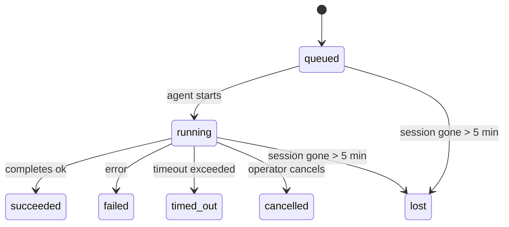

---
read_when:
    - การตรวจสอบงานเบื้องหลังที่กำลังดำเนินอยู่หรือเพิ่งเสร็จสิ้น
    - การดีบักความล้มเหลวในการส่งสำหรับการรันเอเจนต์แบบแยกออก
    - ทำความเข้าใจว่าการรันเบื้องหลังเกี่ยวข้องกับเซสชัน, Cron และ Heartbeat อย่างไร
sidebarTitle: Background tasks
summary: การติดตามงานเบื้องหลังสำหรับการรัน ACP, เอเจนต์ย่อย, งาน Cron แบบแยก, และการดำเนินการของ CLI
title: งานเบื้องหลัง
x-i18n:
    generated_at: "2026-04-30T09:35:23Z"
    model: gpt-5.5
    provider: openai
    source_hash: 4bbf74f3aeea532738b56b83cd2e1a0a3734bfd453da6636b8be985a28ccc027
    source_path: automation/tasks.md
    workflow: 16
---

<Note>
กำลังมองหาการตั้งเวลาใช่ไหม? ดู [ระบบอัตโนมัติและงาน](/th/automation) เพื่อเลือกกลไกที่เหมาะสม หน้านี้เป็นบัญชีกิจกรรมสำหรับงานเบื้องหลัง ไม่ใช่ตัวตั้งเวลา
</Note>

งานเบื้องหลังติดตามงานที่รัน **นอกเซสชันการสนทนาหลักของคุณ**: การรัน ACP, การสร้างเอเจนต์ย่อย, การดำเนินงาน Cron แบบแยกส่วน, และการดำเนินการที่เริ่มจาก CLI

งาน **ไม่** ได้แทนที่เซสชัน งาน Cron หรือ Heartbeat — งานคือ **บัญชีกิจกรรม** ที่บันทึกว่างานที่แยกออกไปเกิดอะไรขึ้น เมื่อใด และสำเร็จหรือไม่

<Note>
ไม่ใช่ทุกการรันเอเจนต์จะสร้างงาน รอบการทำงานของ Heartbeat และแชตโต้ตอบตามปกติจะไม่สร้างงาน การดำเนินการ Cron ทั้งหมด การสร้าง ACP การสร้างเอเจนต์ย่อย และคำสั่งเอเจนต์ผ่าน CLI จะสร้างงาน
</Note>

## สรุปสั้น

- งานคือ **ระเบียน** ไม่ใช่ตัวตั้งเวลา — Cron และ Heartbeat เป็นตัวตัดสินว่า _เมื่อใด_ งานจะรัน ส่วนงานจะติดตามว่า _เกิดอะไรขึ้น_
- ACP, เอเจนต์ย่อย, งาน Cron ทั้งหมด และการดำเนินการ CLI จะสร้างงาน รอบการทำงานของ Heartbeat จะไม่สร้าง
- แต่ละงานจะเคลื่อนผ่าน `queued → running → terminal` (succeeded, failed, timed_out, cancelled, หรือ lost)
- งาน Cron จะยังคงใช้งานอยู่ขณะที่รันไทม์ Cron ยังเป็นเจ้าของงานนั้นอยู่ หาก
  สถานะรันไทม์ในหน่วยความจำหายไป การบำรุงรักษางานจะตรวจสอบประวัติการรัน Cron
  แบบคงทนก่อนทำเครื่องหมายว่างานสูญหาย
- การเสร็จสิ้นขับเคลื่อนด้วยการส่งแบบพุช: งานที่แยกออกไปสามารถแจ้งโดยตรงหรือปลุก
  เซสชัน/Heartbeat ของผู้ร้องขอเมื่อเสร็จสิ้น ดังนั้นลูปการสำรวจสถานะ
  มักเป็นรูปแบบที่ไม่เหมาะสม
- การรัน Cron แบบแยกส่วนและการเสร็จสิ้นของเอเจนต์ย่อยจะพยายามล้างแท็บ/โปรเซสเบราว์เซอร์ที่ติดตามไว้สำหรับเซสชันลูกของตนก่อนการบันทึกบัญชีการล้างขั้นสุดท้าย
- การส่ง Cron แบบแยกส่วนจะระงับคำตอบชั่วคราวของแม่ที่ล้าสมัยขณะที่งานเอเจนต์ย่อยลูกหลานยังระบายงานอยู่ และจะเลือกเอาต์พุตสุดท้ายของลูกหลานเมื่อมาถึงก่อนการส่ง
- การแจ้งเตือนการเสร็จสิ้นจะถูกส่งโดยตรงไปยังช่องทางหรือเข้าคิวไว้สำหรับ Heartbeat ถัดไป
- `openclaw tasks list` แสดงงานทั้งหมด; `openclaw tasks audit` แสดงปัญหา
- ระเบียนปลายทางจะถูกเก็บไว้ 7 วัน แล้วตัดทิ้งอัตโนมัติ

## เริ่มต้นอย่างรวดเร็ว

<Tabs>
  <Tab title="แสดงรายการและกรอง">
    ```bash
    # List all tasks (newest first)
    openclaw tasks list

    # Filter by runtime or status
    openclaw tasks list --runtime acp
    openclaw tasks list --status running
    ```

  </Tab>
  <Tab title="ตรวจสอบ">
    ```bash
    # Show details for a specific task (by ID, run ID, or session key)
    openclaw tasks show <lookup>
    ```
  </Tab>
  <Tab title="ยกเลิกและแจ้งเตือน">
    ```bash
    # Cancel a running task (kills the child session)
    openclaw tasks cancel <lookup>

    # Change notification policy for a task
    openclaw tasks notify <lookup> state_changes
    ```

  </Tab>
  <Tab title="ตรวจสอบและบำรุงรักษา">
    ```bash
    # Run a health audit
    openclaw tasks audit

    # Preview or apply maintenance
    openclaw tasks maintenance
    openclaw tasks maintenance --apply
    ```

  </Tab>
  <Tab title="โฟลว์งาน">
    ```bash
    # Inspect TaskFlow state
    openclaw tasks flow list
    openclaw tasks flow show <lookup>
    openclaw tasks flow cancel <lookup>
    ```
  </Tab>
</Tabs>

## สิ่งที่สร้างงาน

| แหล่งที่มา                 | ประเภทรันไทม์ | เมื่อใดที่ระเบียนงานถูกสร้าง                          | นโยบายการแจ้งเตือนเริ่มต้น |
| ---------------------- | ------------ | ------------------------------------------------------ | --------------------- |
| การรันเบื้องหลังของ ACP    | `acp`        | การสร้างเซสชันลูก ACP                           | `done_only`           |
| การจัดการเอเจนต์ย่อย | `subagent`   | การสร้างเอเจนต์ย่อยผ่าน `sessions_spawn`               | `done_only`           |
| งาน Cron (ทุกประเภท)  | `cron`       | การดำเนินการ Cron ทุกครั้ง (เซสชันหลักและแบบแยกส่วน)       | `silent`              |
| การดำเนินการ CLI         | `cli`        | คำสั่ง `openclaw agent` ที่รันผ่าน Gateway | `silent`              |
| งานสื่อของเอเจนต์       | `cli`        | การรัน `video_generate` ที่มีเซสชันรองรับ                   | `silent`              |

<AccordionGroup>
  <Accordion title="ค่าเริ่มต้นการแจ้งเตือนสำหรับ Cron และสื่อ">
    งาน Cron ในเซสชันหลักใช้นโยบายการแจ้งเตือน `silent` เป็นค่าเริ่มต้น — งานเหล่านี้สร้างระเบียนสำหรับการติดตาม แต่ไม่สร้างการแจ้งเตือน งาน Cron แบบแยกส่วนก็ใช้ค่าเริ่มต้นเป็น `silent` เช่นกัน แต่มองเห็นได้ชัดกว่าเพราะรันในเซสชันของตัวเอง

    การรัน `video_generate` ที่มีเซสชันรองรับก็ใช้นโยบายการแจ้งเตือน `silent` เช่นกัน งานเหล่านี้ยังคงสร้างระเบียนงาน แต่การเสร็จสิ้นจะถูกส่งกลับไปยังเซสชันเอเจนต์ต้นทางเป็นการปลุกภายใน เพื่อให้เอเจนต์เขียนข้อความติดตามผลและแนบวิดีโอที่เสร็จแล้วได้เอง หากคุณเลือกใช้ `tools.media.asyncCompletion.directSend` การเสร็จสิ้นแบบอะซิงก์ของ `music_generate` และ `video_generate` จะพยายามส่งตรงผ่านช่องทางก่อน แล้วจึงย้อนกลับไปใช้เส้นทางปลุกเซสชันผู้ร้องขอ

  </Accordion>
  <Accordion title="ราวกันตกสำหรับ video_generate พร้อมกัน">
    ขณะที่งาน `video_generate` ที่มีเซสชันรองรับยังทำงานอยู่ เครื่องมือนี้ยังทำหน้าที่เป็นราวกันตกด้วย: การเรียก `video_generate` ซ้ำในเซสชันเดียวกันจะส่งคืนสถานะงานที่ใช้งานอยู่แทนที่จะเริ่มการสร้างพร้อมกันครั้งที่สอง ใช้ `action: "status"` เมื่อคุณต้องการค้นหาความคืบหน้า/สถานะอย่างชัดเจนจากฝั่งเอเจนต์
  </Accordion>
  <Accordion title="สิ่งที่ไม่สร้างงาน">
    - รอบการทำงานของ Heartbeat — เซสชันหลัก; ดู [Heartbeat](/th/gateway/heartbeat)
    - รอบแชตโต้ตอบตามปกติ
    - คำตอบ `/command` โดยตรง

  </Accordion>
</AccordionGroup>

## วงจรชีวิตของงาน



| สถานะ      | ความหมาย                                                              |
| ----------- | -------------------------------------------------------------------------- |
| `queued`    | สร้างแล้ว กำลังรอให้เอเจนต์เริ่มทำงาน                                    |
| `running`   | รอบการทำงานของเอเจนต์กำลังดำเนินการอยู่                                           |
| `succeeded` | เสร็จสมบูรณ์สำเร็จ                                                     |
| `failed`    | เสร็จสิ้นพร้อมข้อผิดพลาด                                                    |
| `timed_out` | เกินเวลาหมดเวลาที่กำหนดไว้                                            |
| `cancelled` | ถูกหยุดโดยผู้ปฏิบัติการผ่าน `openclaw tasks cancel`                        |
| `lost`      | รันไทม์สูญเสียสถานะสำรองที่เป็นแหล่งอ้างอิงหลังระยะผ่อนผัน 5 นาที |

การเปลี่ยนสถานะเกิดขึ้นโดยอัตโนมัติ — เมื่อการรันเอเจนต์ที่เกี่ยวข้องสิ้นสุดลง สถานะงานจะอัปเดตให้ตรงกัน

การเสร็จสิ้นของการรันเอเจนต์เป็นแหล่งอ้างอิงสำหรับระเบียนงานที่ใช้งานอยู่ การรันแบบแยกออกที่สำเร็จจะสิ้นสุดเป็น `succeeded` ข้อผิดพลาดการรันทั่วไปจะสิ้นสุดเป็น `failed` และผลลัพธ์หมดเวลาหรือถูกยุติจะสิ้นสุดเป็น `timed_out` หากผู้ปฏิบัติการได้ยกเลิกงานแล้ว หรือรันไทม์ได้บันทึกสถานะปลายทางที่แรงกว่าไว้แล้ว เช่น `failed`, `timed_out`, หรือ `lost` สัญญาณสำเร็จที่มาภายหลังจะไม่ลดระดับสถานะปลายทางนั้น

`lost` รับรู้รันไทม์:

- งาน ACP: เมทาดาทาเซสชันลูก ACP ที่รองรับหายไป
- งานเอเจนต์ย่อย: เซสชันลูกที่รองรับหายไปจากที่เก็บเอเจนต์เป้าหมาย
- งาน Cron: รันไทม์ Cron ไม่ติดตามงานเป็นงานที่ใช้งานอยู่อีกต่อไป และประวัติ
  การรัน Cron แบบคงทนไม่แสดงผลลัพธ์ปลายทางสำหรับการรันนั้น การตรวจสอบ CLI
  แบบออฟไลน์จะไม่ถือว่าสถานะรันไทม์ Cron ในโปรเซสของตัวเองที่ว่างเปล่าเป็นแหล่งอ้างอิง
- งาน CLI: งานเซสชันลูกแบบแยกส่วนใช้เซสชันลูก; งาน CLI ที่มีแชตรองรับ
  ใช้บริบทการรันสดแทน ดังนั้นแถวเซสชันช่องทาง/กลุ่ม/โดยตรง
  ที่ค้างอยู่จะไม่ทำให้งานเหล่านี้ยังมีชีวิตอยู่ การรัน `openclaw agent`
  ที่มี Gateway รองรับยังสิ้นสุดจากผลลัพธ์การรันของตนด้วย ดังนั้นการรันที่เสร็จแล้ว
  จะไม่คงสถานะใช้งานอยู่จนกว่าตัวกวาดจะทำเครื่องหมายเป็น `lost`

## การส่งและการแจ้งเตือน

เมื่องานไปถึงสถานะปลายทาง OpenClaw จะแจ้งให้คุณทราบ มีเส้นทางการส่งสองแบบ:

**การส่งโดยตรง** — หากงานมีเป้าหมายช่องทาง (`requesterOrigin`) ข้อความเสร็จสิ้นจะไปยังช่องทางนั้นโดยตรง (Telegram, Discord, Slack ฯลฯ) สำหรับการเสร็จสิ้นของเอเจนต์ย่อย OpenClaw ยังรักษาการกำหนดเส้นทางเธรด/หัวข้อที่ผูกไว้เมื่อพร้อมใช้งาน และสามารถเติม `to` / บัญชีที่ขาดหายจากเส้นทางที่เก็บไว้ของเซสชันผู้ร้องขอ (`lastChannel` / `lastTo` / `lastAccountId`) ก่อนยอมแพ้กับการส่งโดยตรง

**การส่งที่เข้าคิวในเซสชัน** — หากการส่งโดยตรงล้มเหลวหรือไม่ได้ตั้งค่าต้นทางไว้ การอัปเดตจะถูกเข้าคิวเป็นเหตุการณ์ระบบในเซสชันของผู้ร้องขอ และจะปรากฏใน Heartbeat ถัดไป

<Tip>
การเสร็จสิ้นของงานจะกระตุ้นการปลุก Heartbeat ทันที เพื่อให้คุณเห็นผลลัพธ์อย่างรวดเร็ว — คุณไม่ต้องรอรอบ Heartbeat ที่ตั้งเวลาไว้ถัดไป
</Tip>

นั่นหมายความว่าเวิร์กโฟลว์ทั่วไปเป็นแบบพุช: เริ่มงานที่แยกออกไปหนึ่งครั้ง แล้วปล่อยให้รันไทม์ปลุกหรือแจ้งคุณเมื่อเสร็จสิ้น สำรวจสถานะงานเฉพาะเมื่อคุณต้องการดีบัก แทรกแซง หรือตรวจสอบอย่างชัดเจน

### นโยบายการแจ้งเตือน

ควบคุมว่าคุณจะได้ยินเกี่ยวกับแต่ละงานมากแค่ไหน:

| นโยบาย                | สิ่งที่ถูกส่ง                                                       |
| --------------------- | ----------------------------------------------------------------------- |
| `done_only` (ค่าเริ่มต้น) | เฉพาะสถานะปลายทาง (succeeded, failed ฯลฯ) — **นี่คือค่าเริ่มต้น** |
| `state_changes`       | ทุกการเปลี่ยนสถานะและการอัปเดตความคืบหน้า                              |
| `silent`              | ไม่มีอะไรเลย                                                          |

เปลี่ยนนโยบายขณะที่งานกำลังทำงาน:

```bash
openclaw tasks notify <lookup> state_changes
```

## อ้างอิง CLI

<AccordionGroup>
  <Accordion title="tasks list">
    ```bash
    openclaw tasks list [--runtime <acp|subagent|cron|cli>] [--status <status>] [--json]
    ```

    คอลัมน์เอาต์พุต: ID งาน, ชนิด, สถานะ, การส่ง, ID การรัน, เซสชันลูก, สรุป

  </Accordion>
  <Accordion title="tasks show">
    ```bash
    openclaw tasks show <lookup>
    ```

    โทเค็นการค้นหารับ ID งาน, ID การรัน, หรือคีย์เซสชัน แสดงระเบียนเต็ม รวมถึงเวลา สถานะการส่ง ข้อผิดพลาด และสรุปปลายทาง

  </Accordion>
  <Accordion title="tasks cancel">
    ```bash
    openclaw tasks cancel <lookup>
    ```

    สำหรับงาน ACP และเอเจนต์ย่อย คำสั่งนี้จะยุติเซสชันลูก สำหรับงานที่ CLI ติดตาม การยกเลิกจะถูกบันทึกในรีจิสทรีงาน (ไม่มีแฮนเดิลรันไทม์ลูกแยกต่างหาก) สถานะจะเปลี่ยนเป็น `cancelled` และการแจ้งเตือนการส่งจะถูกส่งเมื่อเกี่ยวข้อง

  </Accordion>
  <Accordion title="tasks notify">
    ```bash
    openclaw tasks notify <lookup> <done_only|state_changes|silent>
    ```
  </Accordion>
  <Accordion title="tasks audit">
    ```bash
    openclaw tasks audit [--json]
    ```

    แสดงปัญหาด้านการปฏิบัติการ สิ่งที่พบจะปรากฏใน `openclaw status` ด้วยเมื่อตรวจพบปัญหา

    | รายการที่พบ                   | ระดับความรุนแรง   | เงื่อนไขที่ทำให้เกิด                                                                                                      |
    | ------------------------- | ---------- | ------------------------------------------------------------------------------------------------------------ |
    | `stale_queued`            | warn       | อยู่ในคิวนานกว่า 10 นาที                                                                              |
    | `stale_running`           | error      | ทำงานนานกว่า 30 นาที                                                                             |
    | `lost`                    | warn/error | ความเป็นเจ้าของงานที่มีรันไทม์รองรับหายไป; งานที่สูญหายซึ่งยังถูกเก็บไว้จะเตือนจนถึง `cleanupAfter` แล้วจึงกลายเป็นข้อผิดพลาด |
    | `delivery_failed`         | warn       | การนำส่งล้มเหลวและนโยบายการแจ้งเตือนไม่ใช่ `silent`                                                            |
    | `missing_cleanup`         | warn       | งานปลายทางที่ไม่มีเวลาประทับการล้างข้อมูล                                                                      |
    | `inconsistent_timestamps` | warn       | การละเมิดไทม์ไลน์ (เช่น สิ้นสุดก่อนเริ่มต้น)                                                        |

  </Accordion>
  <Accordion title="การบำรุงรักษางาน">
    ```bash
    openclaw tasks maintenance [--json]
    openclaw tasks maintenance --apply [--json]
    ```

    ใช้คำสั่งนี้เพื่อดูตัวอย่างหรือใช้การปรับให้สอดคล้องกัน การประทับเวลาล้างข้อมูล และการตัดทิ้งสำหรับงานและสถานะ Task Flow

    การปรับให้สอดคล้องกันรับรู้รันไทม์:

    - งาน ACP/subagent ตรวจสอบเซสชันลูกที่รองรับงานนั้น
    - งาน Cron ตรวจสอบว่ารันไทม์ cron ยังเป็นเจ้าของงานอยู่หรือไม่ จากนั้นกู้คืนสถานะปลายทางจากบันทึกการรัน cron/สถานะงานที่คงอยู่ ก่อนถอยกลับไปเป็น `lost` เฉพาะกระบวนการ Gateway เท่านั้นที่เป็นแหล่งอ้างอิงสำหรับชุดงาน cron ที่ใช้งานอยู่ในหน่วยความจำ; การตรวจสอบ CLI แบบออฟไลน์ใช้ประวัติที่คงทน แต่จะไม่ทำเครื่องหมายงาน cron ว่าสูญหายเพียงเพราะ Set ภายในเครื่องนั้นว่างเปล่า
    - งาน CLI ที่มีแชตรองรับตรวจสอบบริบทการรันสดที่เป็นเจ้าของ ไม่ใช่เพียงแถวเซสชันแชต

    การล้างข้อมูลเมื่อเสร็จสมบูรณ์รับรู้รันไทม์เช่นกัน:

    - การเสร็จสมบูรณ์ของ subagent จะพยายามปิดแท็บเบราว์เซอร์/กระบวนการที่ติดตามไว้สำหรับเซสชันลูกก่อนที่การล้างข้อมูลการประกาศจะดำเนินต่อ
    - การเสร็จสมบูรณ์ของ cron แบบแยกเดี่ยวจะพยายามปิดแท็บเบราว์เซอร์/กระบวนการที่ติดตามไว้สำหรับเซสชัน cron ก่อนที่การรันจะถูกปิดลงทั้งหมด
    - การนำส่ง cron แบบแยกเดี่ยวจะรอการติดตามผลของ subagent ลูกหลานเมื่อจำเป็น และระงับข้อความตอบรับของพาเรนต์ที่ล้าสมัยแทนการประกาศข้อความนั้น
    - การนำส่งเมื่อ subagent เสร็จสมบูรณ์จะเลือกข้อความผู้ช่วยล่าสุดที่มองเห็นได้ก่อน; หากว่างเปล่า จะถอยกลับไปใช้ข้อความ tool/toolResult ล่าสุดที่ผ่านการทำให้ปลอดภัยแล้ว และการรัน tool-call ที่หมดเวลาเท่านั้นอาจยุบเป็นสรุปความคืบหน้าบางส่วนแบบสั้น การรันปลายทางที่ล้มเหลวจะประกาศสถานะล้มเหลวโดยไม่เล่นซ้ำข้อความตอบกลับที่บันทึกไว้
    - ความล้มเหลวของการล้างข้อมูลไม่บดบังผลลัพธ์จริงของงาน

  </Accordion>
  <Accordion title="รายการ | แสดง | ยกเลิก tasks flow">
    ```bash
    openclaw tasks flow list [--status <status>] [--json]
    openclaw tasks flow show <lookup> [--json]
    openclaw tasks flow cancel <lookup>
    ```

    ใช้คำสั่งเหล่านี้เมื่อ Task Flow ที่ทำหน้าที่ประสานงานเป็นสิ่งที่คุณสนใจ แทนที่จะเป็นระเบียนงานเบื้องหลังรายการเดียว

  </Accordion>
</AccordionGroup>

## กระดานงานแชต (`/tasks`)

ใช้ `/tasks` ในเซสชันแชตใดก็ได้เพื่อดูงานเบื้องหลังที่เชื่อมโยงกับเซสชันนั้น กระดานจะแสดงงานที่ใช้งานอยู่และที่เพิ่งเสร็จสมบูรณ์ พร้อมรันไทม์ สถานะ เวลา และรายละเอียดความคืบหน้าหรือข้อผิดพลาด

เมื่อเซสชันปัจจุบันไม่มีงานที่เชื่อมโยงซึ่งมองเห็นได้ `/tasks` จะถอยกลับไปแสดงจำนวนงานเฉพาะเอเจนต์ เพื่อให้คุณยังเห็นภาพรวมได้โดยไม่รั่วไหลรายละเอียดของเซสชันอื่น

สำหรับสมุดบัญชีผู้ปฏิบัติงานแบบเต็ม ให้ใช้ CLI: `openclaw tasks list`

## การรวมสถานะ (แรงกดดันของงาน)

`openclaw status` มีสรุปงานแบบดูได้ทันที:

```
Tasks: 3 queued · 2 running · 1 issues
```

สรุปรายงาน:

- **active** — จำนวนของ `queued` + `running`
- **failures** — จำนวนของ `failed` + `timed_out` + `lost`
- **byRuntime** — การแจกแจงตาม `acp`, `subagent`, `cron`, `cli`

ทั้ง `/status` และเครื่องมือ `session_status` ใช้สแนปช็อตงานที่รับรู้การล้างข้อมูล: งานที่ใช้งานอยู่จะถูกเลือกก่อน แถวที่เสร็จสมบูรณ์และล้าสมัยจะถูกซ่อน และความล้มเหลวล่าสุดจะแสดงเฉพาะเมื่อไม่มีงานที่ใช้งานอยู่เหลืออยู่ วิธีนี้ช่วยให้การ์ดสถานะมุ่งเน้นสิ่งที่สำคัญในตอนนี้

## การจัดเก็บและการบำรุงรักษา

### ตำแหน่งที่งานอยู่

ระเบียนงานคงอยู่ใน SQLite ที่:

```
$OPENCLAW_STATE_DIR/tasks/runs.sqlite
```

รีจิสทรีโหลดเข้าสู่หน่วยความจำเมื่อ Gateway เริ่มต้น และซิงค์การเขียนไปยัง SQLite เพื่อความคงทนข้ามการรีสตาร์ต
Gateway รักษาขนาด write-ahead log ของ SQLite ให้อยู่ในขอบเขตโดยใช้เกณฑ์ autocheckpoint เริ่มต้นของ SQLite
รวมถึง checkpoint แบบ `TRUNCATE` เป็นระยะและตอนปิดระบบ

### การบำรุงรักษาอัตโนมัติ

ตัวกวาดทำงานทุก **60 วินาที** และจัดการสี่อย่าง:

<Steps>
  <Step title="การปรับให้สอดคล้องกัน">
    ตรวจสอบว่างานที่ใช้งานอยู่ยังมีรันไทม์อ้างอิงที่เชื่อถือได้รองรับอยู่หรือไม่ งาน ACP/subagent ใช้สถานะเซสชันลูก งาน cron ใช้ความเป็นเจ้าของงานที่ใช้งานอยู่ และงาน CLI ที่มีแชตรองรับใช้บริบทการรันที่เป็นเจ้าของ หากสถานะรองรับนั้นหายไปนานกว่า 5 นาที งานจะถูกทำเครื่องหมายเป็น `lost`
  </Step>
  <Step title="การซ่อมแซมเซสชัน ACP">
    ปิดเซสชัน ACP แบบครั้งเดียวที่เป็นปลายทางหรือถูกละทิ้งซึ่งพาเรนต์เป็นเจ้าของ และปิดเซสชัน ACP แบบคงอยู่ที่เป็นปลายทางและล้าสมัยหรือถูกละทิ้ง เฉพาะเมื่อไม่มีการผูกการสนทนาที่ใช้งานอยู่เหลืออยู่
  </Step>
  <Step title="การประทับเวลาล้างข้อมูล">
    ตั้งเวลาประทับ `cleanupAfter` บนงานปลายทาง (endedAt + 7 วัน) ระหว่างช่วงเก็บรักษา งานที่สูญหายยังคงปรากฏในการตรวจสอบเป็นคำเตือน; หลังจาก `cleanupAfter` หมดอายุ หรือเมื่อเมทาดาทาการล้างข้อมูลหายไป งานเหล่านั้นจะเป็นข้อผิดพลาด
  </Step>
  <Step title="การตัดทิ้ง">
    ลบระเบียนที่เลยวันที่ `cleanupAfter`
  </Step>
</Steps>

<Note>
**การเก็บรักษา:** ระเบียนงานปลายทางจะถูกเก็บไว้ **7 วัน** จากนั้นจะถูกตัดทิ้งโดยอัตโนมัติ ไม่จำเป็นต้องกำหนดค่า
</Note>

## งานสัมพันธ์กับระบบอื่นอย่างไร

<AccordionGroup>
  <Accordion title="งานและ Task Flow">
    [Task Flow](/th/automation/taskflow) คือชั้นประสานงานโฟลว์เหนือกว่างานเบื้องหลัง โฟลว์เดียวอาจประสานงานหลายงานตลอดอายุการทำงานโดยใช้โหมดซิงค์ที่จัดการหรือมิเรอร์ ใช้ `openclaw tasks` เพื่อตรวจสอบระเบียนงานแต่ละรายการ และ `openclaw tasks flow` เพื่อตรวจสอบโฟลว์ที่ทำหน้าที่ประสานงาน

    ดูรายละเอียดที่ [Task Flow](/th/automation/taskflow)

  </Accordion>
  <Accordion title="งานและ cron">
    **นิยาม** งาน cron อยู่ใน `~/.openclaw/cron/jobs.json`; สถานะการทำงานรันไทม์อยู่ข้างกันใน `~/.openclaw/cron/jobs-state.json` การทำงาน cron **ทุกครั้ง** จะสร้างระเบียนงาน ทั้งแบบเซสชันหลักและแบบแยกเดี่ยว งาน cron แบบเซสชันหลักมีค่าเริ่มต้นของนโยบายแจ้งเตือนเป็น `silent` เพื่อให้ติดตามได้โดยไม่สร้างการแจ้งเตือน

    ดู [งาน Cron](/th/automation/cron-jobs)

  </Accordion>
  <Accordion title="งานและ Heartbeat">
    การรัน Heartbeat เป็นเทิร์นของเซสชันหลัก โดยจะไม่สร้างระเบียนงาน เมื่องานเสร็จสมบูรณ์ งานนั้นสามารถกระตุ้นการปลุก Heartbeat เพื่อให้คุณเห็นผลลัพธ์ได้ทันที

    ดู [Heartbeat](/th/gateway/heartbeat)

  </Accordion>
  <Accordion title="งานและเซสชัน">
    งานอาจอ้างอิง `childSessionKey` (ตำแหน่งที่งานทำงาน) และ `requesterSessionKey` (ผู้ที่เริ่มงาน) เซสชันคือบริบทการสนทนา; งานคือการติดตามกิจกรรมที่อยู่ด้านบนของบริบทนั้น
  </Accordion>
  <Accordion title="งานและการรันของเอเจนต์">
    `runId` ของงานเชื่อมโยงไปยังการรันของเอเจนต์ที่กำลังทำงาน เหตุการณ์วงจรชีวิตของเอเจนต์ (เริ่มต้น สิ้นสุด ข้อผิดพลาด) จะอัปเดตสถานะงานโดยอัตโนมัติ คุณไม่จำเป็นต้องจัดการวงจรชีวิตด้วยตนเอง
  </Accordion>
</AccordionGroup>

## ที่เกี่ยวข้อง

- [ระบบอัตโนมัติและงาน](/th/automation) — กลไกระบบอัตโนมัติทั้งหมดแบบดูได้ทันที
- [CLI: งาน](/th/cli/tasks) — เอกสารอ้างอิงคำสั่ง CLI
- [Heartbeat](/th/gateway/heartbeat) — เทิร์นเซสชันหลักเป็นระยะ
- [งานตามกำหนดเวลา](/th/automation/cron-jobs) — การกำหนดเวลางานเบื้องหลัง
- [Task Flow](/th/automation/taskflow) — การประสานงานโฟลว์เหนืองาน
