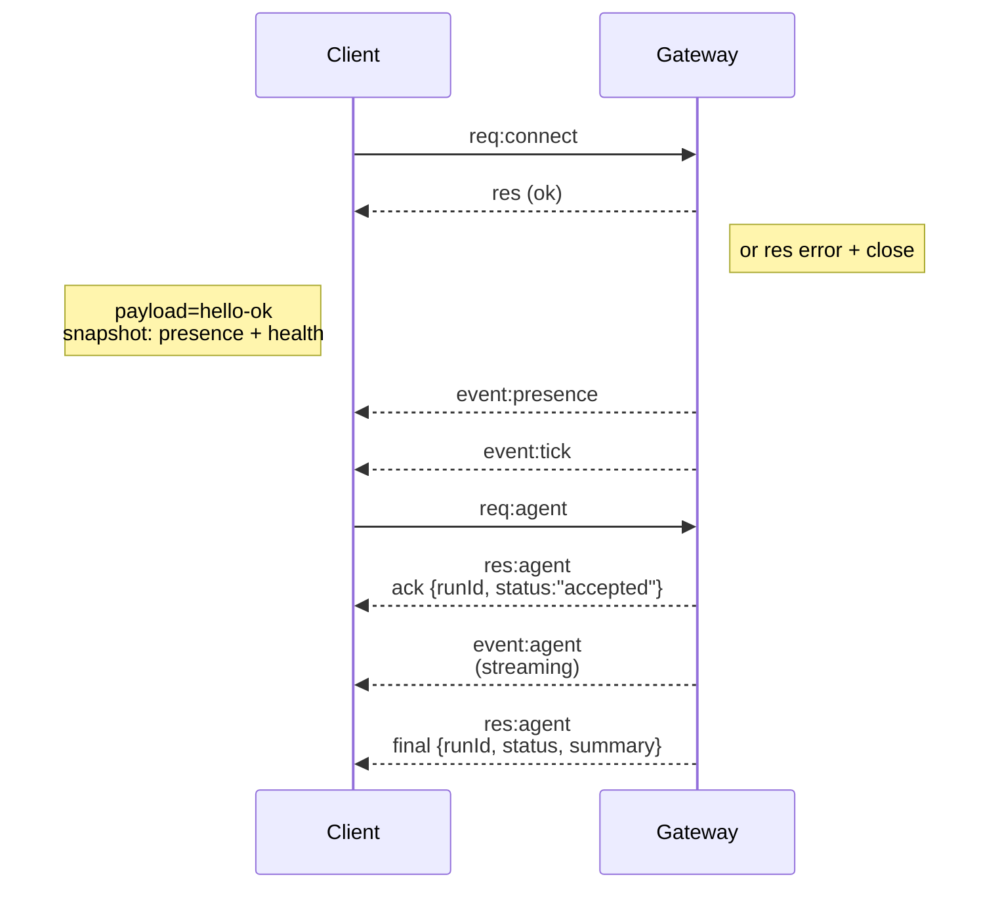

---
read_when:
    - การทำงานกับโปรโตคอล Gateway, ไคลเอนต์ หรือทรานสปอร์ต
summary: สถาปัตยกรรม Gateway WebSocket, ส่วนประกอบ และโฟลว์ของไคลเอนต์
title: สถาปัตยกรรม Gateway
x-i18n:
    generated_at: "2026-05-06T09:07:00Z"
    model: gpt-5.5
    provider: openai
    source_hash: 433489081bfe07691b211f5076ec45ce0ed3fd043eb86128f73121f2cab71cd3
    source_path: concepts/architecture.md
    workflow: 16
---

## ภาพรวม

- **Gateway** แบบอายุยาวหนึ่งตัวเป็นเจ้าของพื้นผิวการรับส่งข้อความทั้งหมด (WhatsApp ผ่าน
  Baileys, Telegram ผ่าน grammY, Slack, Discord, Signal, iMessage, WebChat)
- ไคลเอนต์ control-plane (แอป macOS, CLI, UI เว็บ, ระบบอัตโนมัติ) เชื่อมต่อกับ
  Gateway ผ่าน **WebSocket** บน bind host ที่กำหนดค่าไว้ (ค่าเริ่มต้น
  `127.0.0.1:18789`)
- **Node** (macOS/iOS/Android/headless) เชื่อมต่อผ่าน **WebSocket** เช่นกัน แต่
  ประกาศ `role: node` พร้อม caps/commands ที่ระบุชัดเจน
- หนึ่ง Gateway ต่อหนึ่งโฮสต์; เป็นที่เดียวที่เปิดเซสชัน WhatsApp
- **โฮสต์ canvas** ให้บริการโดยเซิร์ฟเวอร์ HTTP ของ Gateway ภายใต้:
  - `/__openclaw__/canvas/` (HTML/CSS/JS ที่เอเจนต์แก้ไขได้)
  - `/__openclaw__/a2ui/` (โฮสต์ A2UI)
    ใช้พอร์ตเดียวกับ Gateway (ค่าเริ่มต้น `18789`)

## คอมโพเนนต์และโฟลว์

### Gateway (เดมอน)

- ดูแลการเชื่อมต่อของผู้ให้บริการ
- เปิดเผย WS API แบบมีชนิด (คำขอ, คำตอบ, เหตุการณ์ server-push)
- ตรวจสอบเฟรมขาเข้ากับ JSON Schema
- ปล่อยเหตุการณ์ เช่น `agent`, `chat`, `presence`, `health`, `heartbeat`, `cron`

### ไคลเอนต์ (แอป Mac / CLI / ผู้ดูแลเว็บ)

- หนึ่งการเชื่อมต่อ WS ต่อหนึ่งไคลเอนต์
- ส่งคำขอ (`health`, `status`, `send`, `agent`, `system-presence`)
- สมัครรับเหตุการณ์ (`tick`, `agent`, `presence`, `shutdown`)

### Node (macOS / iOS / Android / headless)

- เชื่อมต่อกับ **เซิร์ฟเวอร์ WS เดียวกัน** ด้วย `role: node`
- ระบุตัวตนอุปกรณ์ใน `connect`; การจับคู่เป็นแบบ **อิงอุปกรณ์** (role `node`) และ
  การอนุมัติอยู่ในที่เก็บการจับคู่อุปกรณ์
- เปิดเผยคำสั่ง เช่น `canvas.*`, `camera.*`, `screen.record`, `location.get`

รายละเอียดโปรโตคอล:

- [โปรโตคอล Gateway](/th/gateway/protocol)

### WebChat

- UI แบบสแตติกที่ใช้ Gateway WS API สำหรับประวัติแชตและการส่งข้อความ
- ในการตั้งค่าระยะไกล จะเชื่อมต่อผ่านทันเนล SSH/Tailscale เดียวกับไคลเอนต์อื่น

## วงจรชีวิตการเชื่อมต่อ (ไคลเอนต์เดียว)



## โปรโตคอลบนสาย (สรุป)

- การขนส่ง: WebSocket, เฟรมข้อความพร้อมเพย์โหลด JSON
- เฟรมแรก **ต้อง** เป็น `connect`
- หลัง handshake:
  - คำขอ: `{type:"req", id, method, params}` → `{type:"res", id, ok, payload|error}`
  - เหตุการณ์: `{type:"event", event, payload, seq?, stateVersion?}`
- `hello-ok.features.methods` / `events` เป็นเมทาดาทาสำหรับการค้นพบ ไม่ใช่
  ดัมป์ที่สร้างขึ้นของ route ตัวช่วยทุกตัวที่เรียกได้
- การยืนยันตัวตนด้วย shared-secret ใช้ `connect.params.auth.token` หรือ
  `connect.params.auth.password` ขึ้นอยู่กับโหมดการยืนยันตัวตนของ Gateway ที่กำหนดค่าไว้
- โหมดที่มีตัวตน เช่น Tailscale Serve
  (`gateway.auth.allowTailscale: true`) หรือ non-loopback
  `gateway.auth.mode: "trusted-proxy"` ทำให้การยืนยันตัวตนสำเร็จจากส่วนหัวคำขอ
  แทน `connect.params.auth.*`
- private-ingress `gateway.auth.mode: "none"` ปิดใช้งานการยืนยันตัวตนด้วย shared-secret
  ทั้งหมด; อย่าเปิดโหมดนี้กับ ingress สาธารณะ/ไม่น่าเชื่อถือ
- ต้องใช้คีย์ idempotency สำหรับเมธอดที่มีผลข้างเคียง (`send`, `agent`) เพื่อ
  ลองซ้ำได้อย่างปลอดภัย; เซิร์ฟเวอร์เก็บแคช dedupe อายุสั้น
- Node ต้องใส่ `role: "node"` พร้อม caps/commands/permissions ใน `connect`

## การจับคู่ + ความเชื่อถือภายในเครื่อง

- ไคลเอนต์ WS ทั้งหมด (ผู้ปฏิบัติการ + Node) ใส่ **ตัวตนอุปกรณ์** ใน `connect`
- ID อุปกรณ์ใหม่ต้องได้รับการอนุมัติการจับคู่; Gateway ออก **โทเคนอุปกรณ์**
  สำหรับการเชื่อมต่อครั้งถัดไป
- การเชื่อมต่อ local loopback โดยตรงสามารถอนุมัติอัตโนมัติได้เพื่อให้ UX บนโฮสต์เดียวกัน
  ลื่นไหล
- OpenClaw ยังมีเส้นทาง self-connect แบบแคบที่จำกัดเฉพาะ backend/container-local สำหรับ
  โฟลว์ตัวช่วย shared-secret ที่เชื่อถือได้
- การเชื่อมต่อ tailnet และ LAN รวมถึง bind ของ tailnet บนโฮสต์เดียวกัน ยังคงต้องมี
  การอนุมัติการจับคู่อย่างชัดเจน
- การเชื่อมต่อทั้งหมดต้องลงนาม nonce `connect.challenge`
- เพย์โหลดลายเซ็น `v3` ยังผูก `platform` + `deviceFamily`; Gateway
  pin เมทาดาทาที่จับคู่ไว้เมื่อเชื่อมต่อใหม่ และต้องใช้การจับคู่ซ่อมแซมเมื่อเมทาดาทาเปลี่ยน
- การเชื่อมต่อ **ที่ไม่ใช่ภายในเครื่อง** ยังคงต้องมีการอนุมัติอย่างชัดเจน
- การยืนยันตัวตน Gateway (`gateway.auth.*`) ยังคงใช้กับการเชื่อมต่อ **ทั้งหมด** ไม่ว่าจะ
  ภายในเครื่องหรือระยะไกล

รายละเอียด: [โปรโตคอล Gateway](/th/gateway/protocol), [การจับคู่](/th/channels/pairing),
[ความปลอดภัย](/th/gateway/security).

## การกำหนดชนิดโปรโตคอลและ codegen

- สคีมา TypeBox กำหนดโปรโตคอล
- JSON Schema ถูกสร้างจากสคีมาเหล่านั้น
- โมเดล Swift ถูกสร้างจาก JSON Schema

## การเข้าถึงระยะไกล

- แนะนำ: Tailscale หรือ VPN
- ทางเลือก: ทันเนล SSH

  ```bash
  ssh -N -L 18789:127.0.0.1:18789 user@host
  ```

- handshake เดียวกัน + โทเคนยืนยันตัวตนเดียวกันใช้ผ่านทันเนล
- TLS + การ pin แบบเลือกเปิดได้ สามารถเปิดใช้งานสำหรับ WS ในการตั้งค่าระยะไกล

## ภาพรวมการปฏิบัติการ

- เริ่ม: `openclaw gateway` (foreground, บันทึก log ไปยัง stdout)
- สุขภาพ: `health` ผ่าน WS (รวมอยู่ใน `hello-ok` ด้วย)
- การกำกับดูแล: launchd/systemd สำหรับการรีสตาร์ทอัตโนมัติ

## ค่าคงที่

- Gateway เพียงหนึ่งตัวควบคุมเซสชัน Baileys หนึ่งเซสชันต่อโฮสต์
- handshake เป็นข้อบังคับ; เฟรมแรกที่ไม่ใช่ JSON หรือไม่ใช่ connect จะถูกปิดอย่างเด็ดขาด
- เหตุการณ์จะไม่ถูก replay; ไคลเอนต์ต้องรีเฟรชเมื่อมีช่องว่าง

## ที่เกี่ยวข้อง

- [Agent Loop](/th/concepts/agent-loop) — วงจรการดำเนินการของเอเจนต์โดยละเอียด
- [โปรโตคอล Gateway](/th/gateway/protocol) — สัญญาโปรโตคอล WebSocket
- [คิว](/th/concepts/queue) — คิวคำสั่งและการทำงานพร้อมกัน
- [ความปลอดภัย](/th/gateway/security) — โมเดลความเชื่อถือและการเสริมความแข็งแกร่ง
