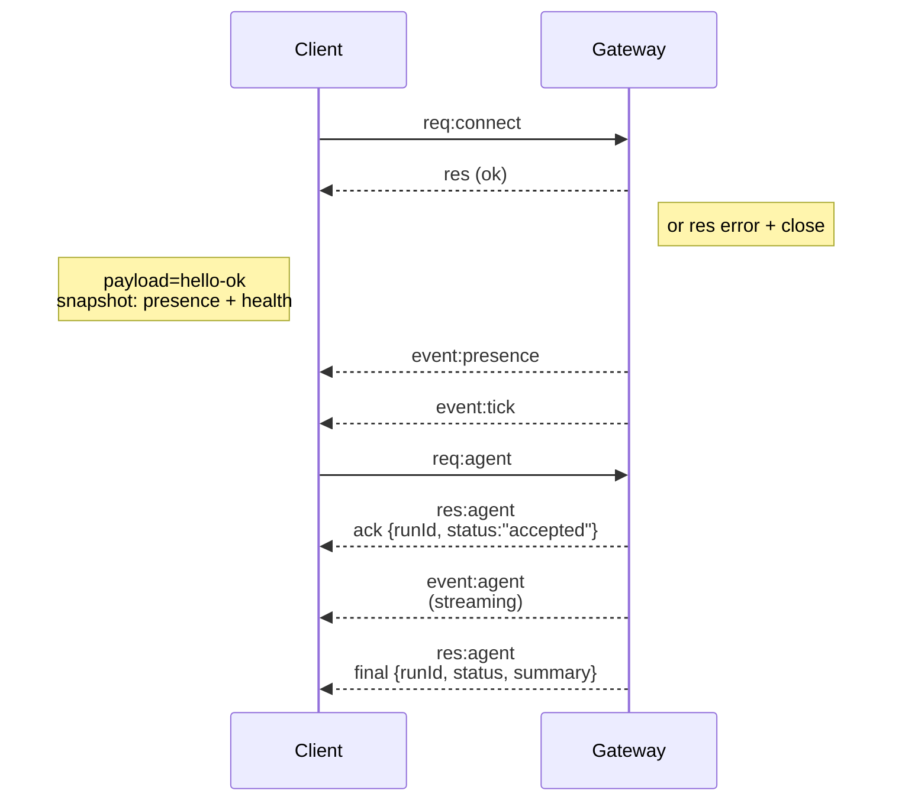

---
read_when:
    - การทำงานกับโปรโตคอล Gateway ไคลเอนต์ หรือการขนส่ง
summary: สถาปัตยกรรม องค์ประกอบ และโฟลว์ของไคลเอ็นต์สำหรับ WebSocket Gateway
title: สถาปัตยกรรม Gateway
x-i18n:
    generated_at: "2026-07-12T15:56:49Z"
    model: gpt-5.6
    postprocess_version: locale-links-v1
    provider: openai
    source_hash: f8054bd87f738b957c24f8d6965d55365de2293d44902530a9ba778afa597cc7
    source_path: concepts/architecture.md
    workflow: 16
---

## ภาพรวม

- **Gateway** ที่ทำงานต่อเนื่องระยะยาวเพียงตัวเดียวเป็นเจ้าของพื้นผิวการรับส่งข้อความทั้งหมด (WhatsApp ผ่าน
  Baileys, Telegram ผ่าน grammY, Slack, Discord, Signal, iMessage, WebChat)
- ไคลเอนต์ระนาบควบคุม (แอป macOS, CLI, UI เว็บ, ระบบอัตโนมัติ) เชื่อมต่อกับ
  Gateway ผ่าน **WebSocket** บนโฮสต์ที่ผูกไว้ตามการกำหนดค่า (ค่าเริ่มต้น
  `127.0.0.1:18789`)
- **Node** (macOS/iOS/Android/แบบไม่มีส่วนติดต่อ) เชื่อมต่อผ่าน **WebSocket** เช่นกัน แต่
  ประกาศ `role: node` พร้อมความสามารถ/คำสั่งอย่างชัดเจน
- มี Gateway หนึ่งตัวต่อหนึ่งโฮสต์ และเป็นจุดเดียวที่เปิดเซสชัน WhatsApp
- **โฮสต์แคนวาส** ให้บริการโดยเซิร์ฟเวอร์ HTTP ของ Gateway ภายใต้:
  - `/__openclaw__/canvas/` (HTML/CSS/JS ที่เอเจนต์แก้ไขได้)
  - `/__openclaw__/a2ui/` (โฮสต์ A2UI)

  โดยใช้พอร์ตเดียวกับ Gateway (ค่าเริ่มต้น `18789`)

## องค์ประกอบและโฟลว์

### Gateway (ดีมอน)

- ดูแลการเชื่อมต่อกับผู้ให้บริการ
- เปิดเผย API แบบ WS ที่มีชนิดข้อมูลกำกับ (คำขอ การตอบกลับ เหตุการณ์ที่เซิร์ฟเวอร์พุช)
- ตรวจสอบความถูกต้องของเฟรมขาเข้าตาม JSON Schema
- ปล่อยเหตุการณ์ เช่น `agent`, `chat`, `presence`, `health`, `heartbeat`, `cron`

### ไคลเอนต์ (แอป Mac / CLI / ผู้ดูแลผ่านเว็บ)

- ใช้การเชื่อมต่อ WS หนึ่งรายการต่อไคลเอนต์
- ส่งคำขอ (`health`, `status`, `send`, `agent`, `system-presence`)
- สมัครรับเหตุการณ์ (`tick`, `agent`, `presence`, `shutdown`)

### Node (macOS / iOS / Android / แบบไม่มีส่วนติดต่อ)

- เชื่อมต่อกับ **เซิร์ฟเวอร์ WS เดียวกัน** โดยใช้ `role: node`
- ระบุข้อมูลประจำตัวอุปกรณ์ใน `connect` การจับคู่จะ **อิงตามอุปกรณ์** (บทบาท `node`) และ
  การอนุมัติจะอยู่ในที่เก็บข้อมูลการจับคู่อุปกรณ์
- เปิดเผยคำสั่ง เช่น `canvas.*`, `camera.*`, `screen.record`, `location.get`

รายละเอียดโปรโตคอล: [โปรโตคอล Gateway](/th/gateway/protocol)

### WebChat

- UI แบบสแตติกที่ใช้ API แบบ WS ของ Gateway สำหรับประวัติการสนทนาและการส่งข้อความ
- ในการตั้งค่าระยะไกล จะเชื่อมต่อผ่านทันเนล SSH/Tailscale เดียวกับ
  ไคลเอนต์อื่น

## วงจรการเชื่อมต่อ (ไคลเอนต์เดียว)



## โปรโตคอลผ่านสายสื่อสาร (สรุป)

- การขนส่ง: WebSocket โดยใช้เฟรมข้อความที่มีเพย์โหลด JSON
- เฟรมแรก **ต้อง** เป็น `connect`
- หลังการจับมือ:
  - คำขอ: `{type:"req", id, method, params}` → `{type:"res", id, ok, payload|error}`
  - เหตุการณ์: `{type:"event", event, payload, seq?, stateVersion?}`
- `hello-ok.features.methods` / `events` เป็นเมทาดาทาสำหรับการค้นพบ ไม่ใช่
  รายการที่สร้างขึ้นจากเส้นทางตัวช่วยทั้งหมดที่เรียกใช้ได้
- การยืนยันตัวตนด้วยข้อมูลลับร่วมใช้ `connect.params.auth.token` หรือ
  `connect.params.auth.password` ขึ้นอยู่กับโหมดการยืนยันตัวตนของ Gateway ที่กำหนดค่าไว้
- โหมดที่มีข้อมูลประจำตัว เช่น Tailscale Serve
  (`gateway.auth.allowTailscale: true`) หรือ `gateway.auth.mode: "trusted-proxy"`
  ที่ไม่ใช่ลูปแบ็ก จะดำเนินการยืนยันตัวตนจากส่วนหัวคำขอ
  แทน `connect.params.auth.*`
- `gateway.auth.mode: "none"` สำหรับทางเข้าภายในส่วนตัวจะปิดใช้การยืนยันตัวตน
  ด้วยข้อมูลลับร่วมทั้งหมด อย่าใช้โหมดนี้กับทางเข้าสาธารณะ/ที่ไม่น่าเชื่อถือ
- เมธอดที่ก่อให้เกิดผลข้างเคียง (`send`, `agent`) ต้องมีคีย์ idempotency เพื่อ
  ให้ลองใหม่ได้อย่างปลอดภัย เซิร์ฟเวอร์จะเก็บแคชขจัดรายการซ้ำอายุสั้น
- Node ต้องระบุ `role: "node"` พร้อมความสามารถ/คำสั่ง/สิทธิ์ใน `connect`

## การจับคู่และความเชื่อถือภายในเครื่อง

- ไคลเอนต์ WS ทั้งหมด (ผู้ควบคุม + Node) ระบุ **ข้อมูลประจำตัวอุปกรณ์** ใน `connect`
- รหัสอุปกรณ์ใหม่ต้องได้รับการอนุมัติการจับคู่ จากนั้น Gateway จะออก **โทเค็นอุปกรณ์**
  สำหรับการเชื่อมต่อครั้งถัดไป
- การเชื่อมต่อ local loopback โดยตรงสามารถได้รับการอนุมัติโดยอัตโนมัติ เพื่อให้ประสบการณ์ใช้งาน
  บนโฮสต์เดียวกันราบรื่น
- OpenClaw ยังมีเส้นทางการเชื่อมต่อกลับเข้าตนเองแบบจำกัดภายในแบ็กเอนด์/คอนเทนเนอร์
  สำหรับโฟลว์ตัวช่วยที่เชื่อถือได้ซึ่งใช้ข้อมูลลับร่วม
- การเชื่อมต่อผ่านเครือข่ายส่วนตัว Tailscale และ LAN รวมถึงการผูกเครือข่ายส่วนตัว Tailscale บนโฮสต์เดียวกัน ยังคงต้อง
  ได้รับการอนุมัติการจับคู่อย่างชัดเจน
- การเชื่อมต่อทั้งหมดต้องลงนาม nonce ของ `connect.challenge` เพย์โหลดลายเซ็น `v3`
  จะผูก `platform` และ `deviceFamily` ด้วย โดย Gateway จะตรึงเมทาดาทาที่จับคู่ไว้เมื่อ
  เชื่อมต่อใหม่ และกำหนดให้จับคู่ซ่อมแซมเมื่อเมทาดาทาเปลี่ยนแปลง
- การเชื่อมต่อที่ **ไม่ได้มาจากภายในเครื่อง** ยังคงต้องได้รับการอนุมัติอย่างชัดเจน
- การยืนยันตัวตนของ Gateway (`gateway.auth.*`) ยังคงมีผลกับการเชื่อมต่อ **ทั้งหมด** ไม่ว่าจะเป็นภายในเครื่องหรือ
  ระยะไกล

รายละเอียด: [โปรโตคอล Gateway](/th/gateway/protocol), [การจับคู่](/th/channels/pairing),
[ความปลอดภัย](/th/gateway/security)

## การกำหนดชนิดข้อมูลโปรโตคอลและการสร้างโค้ด

- สคีมา TypeBox กำหนดโปรโตคอล
- JSON Schema สร้างขึ้นจากสคีมาเหล่านั้น
- โมเดล Swift สร้างขึ้นจาก JSON Schema

## การเข้าถึงระยะไกล

- แนะนำ: Tailscale หรือ VPN
- ทางเลือก: ทันเนล SSH

  ```bash
  ssh -N -L 18789:127.0.0.1:18789 user@gateway-host
  ```

- การจับมือและโทเค็นยืนยันตัวตนเดียวกันมีผลเมื่อเชื่อมต่อผ่านทันเนล
- สามารถเปิดใช้ TLS และการตรึงใบรับรองแบบเลือกได้สำหรับ WS ในการตั้งค่าระยะไกล

## ภาพรวมการดำเนินงาน

- เริ่มต้น: `openclaw gateway` (ทำงานเบื้องหน้า บันทึกล็อกไปยัง stdout)
- สถานะความพร้อม: `health` ผ่าน WS (รวมอยู่ใน `hello-ok` ด้วย)
- การควบคุมดูแล: launchd/systemd สำหรับการเริ่มใหม่อัตโนมัติ

## ค่าคงที่ของระบบ

- มี Gateway เพียงหนึ่งตัวที่ควบคุมเซสชัน Baileys หนึ่งเซสชันต่อโฮสต์
- ต้องทำการจับมือเสมอ เฟรมแรกที่ไม่ใช่ JSON หรือไม่ใช่ `connect` จะทำให้ปิดการเชื่อมต่อทันที
- เหตุการณ์จะไม่ถูกเล่นซ้ำ ไคลเอนต์ต้องรีเฟรชเมื่อมีช่วงข้อมูลขาดหาย

## เนื้อหาที่เกี่ยวข้อง

- [ลูปเอเจนต์](/th/concepts/agent-loop) — วงจรการทำงานของเอเจนต์โดยละเอียด
- [โปรโตคอล Gateway](/th/gateway/protocol) — สัญญาโปรโตคอล WebSocket
- [คิว](/th/concepts/queue) — คิวคำสั่งและการทำงานพร้อมกัน
- [ความปลอดภัย](/th/gateway/security) — โมเดลความเชื่อถือและการเพิ่มความแข็งแกร่ง
