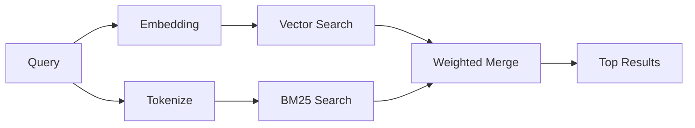

---
read_when:
    - คุณต้องการทำความเข้าใจว่า memory_search ทำงานอย่างไร
    - คุณต้องการเลือกผู้ให้บริการการฝังเวกเตอร์
    - คุณต้องการปรับแต่งคุณภาพการค้นหา
summary: วิธีที่การค้นหาหน่วยความจำค้นหาบันทึกที่เกี่ยวข้องโดยใช้การฝังเวกเตอร์และการดึงคืนแบบไฮบริด
title: การค้นหาหน่วยความจำ
x-i18n:
    generated_at: "2026-06-28T22:34:23Z"
    model: gpt-5.5
    postprocess_version: locale-links-v1
    provider: openai
    source_hash: 32ffb9d996851566eb92b7812c5425f545ecbb5387a0a445686df35a6c8ae143
    source_path: concepts/memory-search.md
    workflow: 16
---

`memory_search` ค้นหาโน้ตที่เกี่ยวข้องจากไฟล์หน่วยความจำของคุณ แม้เมื่อ
ถ้อยคำแตกต่างจากข้อความต้นฉบับ โดยทำงานด้วยการจัดทำดัชนีหน่วยความจำเป็น
ชิ้นส่วนเล็ก ๆ แล้วค้นหาชิ้นส่วนเหล่านั้นโดยใช้ embeddings, คีย์เวิร์ด หรือทั้งสองอย่าง

## เริ่มต้นอย่างรวดเร็ว

การค้นหาหน่วยความจำใช้ OpenAI embeddings เป็นค่าเริ่มต้น หากต้องการใช้
แบ็กเอนด์ embedding อื่น ให้ตั้งค่า provider อย่างชัดเจน:

```json5
{
  agents: {
    defaults: {
      memorySearch: {
        provider: "openai", // or "gemini", "local", "ollama", "openai-compatible", etc.
      },
    },
  },
}
```

สำหรับการตั้งค่าหลาย endpoint ที่มี provider เฉพาะสำหรับหน่วยความจำ `provider` ยังสามารถ
เป็นรายการ `models.providers.<id>` แบบกำหนดเองได้ เช่น `ollama-5080` เมื่อ
provider นั้นตั้งค่า `api: "ollama"` หรือเจ้าของ adapter embedding หน่วยความจำรายอื่น

สำหรับ embeddings ภายในเครื่องโดยไม่ต้องใช้ API key ให้ติดตั้ง
`@openclaw/llama-cpp-provider` และตั้งค่า `provider: "local"` เช็กเอาต์ซอร์สโค้ด
อาจยังต้องอนุมัติการ build แบบ native: `pnpm approve-builds` แล้วตามด้วย
`pnpm rebuild node-llama-cpp`

endpoint embedding ที่เข้ากันได้กับ OpenAI บางรายการต้องใช้ label แบบไม่สมมาตร เช่น
`input_type: "query"` สำหรับการค้นหา และ `input_type: "document"` หรือ `"passage"`
สำหรับชิ้นส่วนที่จัดทำดัชนี กำหนดค่าสิ่งเหล่านี้ด้วย `memorySearch.queryInputType` และ
`memorySearch.documentInputType`; ดู [เอกสารอ้างอิงการกำหนดค่าหน่วยความจำ](/th/reference/memory-config#provider-specific-config)

## provider ที่รองรับ

| provider          | ID                  | ต้องใช้ API key | หมายเหตุ                         |
| ----------------- | ------------------- | ------------- | ----------------------------- |
| Bedrock           | `bedrock`           | ไม่            | ใช้ AWS credential chain     |
| DeepInfra         | `deepinfra`         | ใช่           | ค่าเริ่มต้น: `BAAI/bge-m3`        |
| Gemini            | `gemini`            | ใช่           | รองรับการจัดทำดัชนีภาพ/เสียง |
| GitHub Copilot    | `github-copilot`    | ไม่            | ใช้การสมัครสมาชิก Copilot     |
| Local             | `local`             | ไม่            | โมเดล GGUF, ดาวน์โหลดประมาณ 0.6 GB  |
| Mistral           | `mistral`           | ใช่           |                               |
| Ollama            | `ollama`            | ไม่            | ภายในเครื่อง/โฮสต์เอง             |
| OpenAI            | `openai`            | ใช่           | ค่าเริ่มต้น                       |
| เข้ากันได้กับ OpenAI | `openai-compatible` | โดยทั่วไป       | `/v1/embeddings` แบบทั่วไป      |
| Voyage            | `voyage`            | ใช่           |                               |

## วิธีการทำงานของการค้นหา

OpenClaw รันเส้นทาง retrieval สองเส้นทางแบบขนานและรวมผลลัพธ์:



- **การค้นหาเวกเตอร์** ค้นหาโน้ตที่มีความหมายคล้ายกัน ("gateway host" ตรงกับ
  "the machine running OpenClaw")
- **การค้นหาคีย์เวิร์ด BM25** ค้นหารายการที่ตรงกันแบบเป๊ะ (ID, ข้อความ error, คีย์
  config)

หากมีเพียงเส้นทางเดียว อีกเส้นทางจะทำงานลำพัง โหมด FTS-only แบบตั้งใจ
(`provider: "none"`) และการเลือก provider แบบอัตโนมัติ/ค่าเริ่มต้นยังสามารถใช้
การจัดอันดับแบบ lexical ได้เมื่อ embeddings ไม่พร้อมใช้งาน

provider embedding แบบไม่ใช่ภายในเครื่องที่ระบุชัดเจนจะแตกต่างออกไป หากคุณตั้งค่า
`memorySearch.provider` เป็น provider แบบเจาะจงที่มี remote backend และ provider นั้น
ไม่พร้อมใช้งานขณะรันไทม์ `memory_search` จะรายงานว่าหน่วยความจำไม่พร้อมใช้งานแทน
การใช้ผลลัพธ์แบบ FTS-only อย่างเงียบ ๆ วิธีนี้ทำให้ provider semantic ที่กำหนดค่าไว้
แต่เสียอยู่ปรากฏให้เห็น ตั้งค่า `provider: "none"` สำหรับการ recall แบบ FTS-only โดยตั้งใจ หรือแก้ไข
การกำหนดค่า provider/auth เพื่อกู้คืนการจัดอันดับแบบ semantic

## การปรับปรุงคุณภาพการค้นหา

ฟีเจอร์เสริมสองอย่างช่วยได้เมื่อคุณมีประวัติโน้ตจำนวนมาก:

### การลดน้ำหนักตามเวลา

โน้ตเก่าจะค่อย ๆ สูญเสียน้ำหนักในการจัดอันดับ เพื่อให้ข้อมูลล่าสุดปรากฏก่อน
ด้วยค่า half-life เริ่มต้น 30 วัน โน้ตจากเดือนที่แล้วจะได้คะแนน 50% ของ
น้ำหนักเดิม ไฟล์ evergreen เช่น `MEMORY.md` จะไม่ถูกลดน้ำหนัก

<Tip>
เปิดใช้การลดน้ำหนักตามเวลาหาก agent ของคุณมีโน้ตรายวันหลายเดือน และข้อมูลเก่า
ยังคงถูกจัดอันดับสูงกว่าบริบทล่าสุด
</Tip>

### MMR (ความหลากหลาย)

ลดผลลัพธ์ที่ซ้ำซ้อน หากโน้ตห้ารายการล้วนกล่าวถึง config router เดียวกัน MMR
จะทำให้ผลลัพธ์อันดับต้น ๆ ครอบคลุมหัวข้อที่แตกต่างกันแทนการซ้ำกัน

<Tip>
เปิดใช้ MMR หาก `memory_search` ยังคงส่งคืน snippet ที่เกือบซ้ำกันจาก
โน้ตรายวันต่างกัน
</Tip>

### เปิดใช้ทั้งสองอย่าง

```json5
{
  agents: {
    defaults: {
      memorySearch: {
        query: {
          hybrid: {
            mmr: { enabled: true },
            temporalDecay: { enabled: true },
          },
        },
      },
    },
  },
}
```

## หน่วยความจำแบบมัลติโมดัล

ด้วย Gemini Embedding 2 คุณสามารถจัดทำดัชนีไฟล์ภาพและเสียงควบคู่กับ
Markdown ได้ คำค้นหายังคงเป็นข้อความ แต่จะจับคู่กับเนื้อหาภาพและเสียง
ดู [เอกสารอ้างอิงการกำหนดค่าหน่วยความจำ](/th/reference/memory-config) สำหรับ
การตั้งค่า

## การค้นหาหน่วยความจำของเซสชัน

คุณสามารถเลือกจัดทำดัชนี transcript ของเซสชัน เพื่อให้ `memory_search` สามารถ recall
การสนทนาก่อนหน้าได้ นี่เป็นแบบ opt-in ผ่าน
`memorySearch.experimental.sessionMemory` และ `sources: ["sessions"]`; รายการ source เริ่มต้น
เป็น memory-only flag ทดลองจะเปิดใช้การจัดทำดัชนี transcript ของเซสชัน
ขณะที่ `sources` ควบคุมว่าจะค้นหาชิ้นส่วนของเซสชันหรือไม่

hit ของเซสชันทำตาม `tools.sessions.visibility`: การตั้งค่าเริ่มต้น `tree` จะ
เปิดเผยเฉพาะเซสชันปัจจุบันและเซสชันที่สร้างโดยเซสชันนั้นเท่านั้น หากต้องการ recall เซสชัน
gateway-dispatched ของ agent เดียวกันที่ไม่เกี่ยวข้องจากเซสชัน DM แยกต่างหาก ให้ตั้งใจ
ขยาย visibility เป็น `agent`

เมื่อใช้ QMD ให้ตั้งค่า `memory.qmd.sessions.enabled: true` ด้วย เพื่อให้ transcript ถูก
export ไปยัง collection QMD ดูรายละเอียดใน
[เอกสารอ้างอิงการกำหนดค่า](/th/reference/memory-config)

## การแก้ไขปัญหา

**ไม่มีผลลัพธ์ใช่ไหม** รัน `openclaw memory status` เพื่อตรวจสอบดัชนี หากว่าง ให้รัน
`openclaw memory index --force`

**มีเฉพาะ keyword match ใช่ไหม** provider embedding ของคุณอาจยังไม่ได้กำหนดค่า ตรวจสอบ
`openclaw memory status --deep`

**embeddings ภายในเครื่อง timeout ใช่ไหม** `ollama`, `lmstudio` และ `local` ใช้ timeout
batch inline ที่ยาวขึ้นเป็นค่าเริ่มต้น หาก host เพียงแค่ช้า ให้ตั้งค่า
`agents.defaults.memorySearch.sync.embeddingBatchTimeoutSeconds` แล้วรันซ้ำ
`openclaw memory index --force`

**ไม่พบข้อความ CJK ใช่ไหม** สร้างดัชนี FTS ใหม่ด้วย
`openclaw memory index --force`

## อ่านเพิ่มเติม

- [Active Memory](/th/concepts/active-memory) -- หน่วยความจำของ sub-agent สำหรับเซสชันแชตแบบโต้ตอบ
- [หน่วยความจำ](/th/concepts/memory) -- โครงสร้างไฟล์, backend, tools
- [เอกสารอ้างอิงการกำหนดค่าหน่วยความจำ](/th/reference/memory-config) -- knob การกำหนดค่าทั้งหมด

## ที่เกี่ยวข้อง

- [ภาพรวมหน่วยความจำ](/th/concepts/memory)
- [Active Memory](/th/concepts/active-memory)
- [เอนจินหน่วยความจำในตัว](/th/concepts/memory-builtin)
