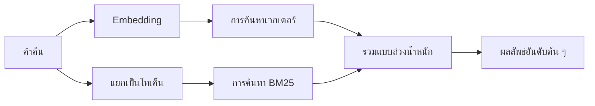

---
read_when:
    - คุณต้องการทำความเข้าใจว่า memory_search ทำงานอย่างไร
    - คุณต้องการเลือกผู้ให้บริการ Embedding
    - คุณต้องการปรับแต่งคุณภาพการค้นหา
summary: การค้นหาหน่วยความจำค้นหาบันทึกที่เกี่ยวข้องโดยใช้ embeddings และการดึงข้อมูลแบบไฮบริดได้อย่างไร
title: การค้นหาหน่วยความจำ
x-i18n:
    generated_at: "2026-07-19T07:15:14Z"
    model: gpt-5.6
    postprocess_version: locale-links-v1
    prompt_version: 32
    provider: openai
    source_hash: e7be013665593c82890d3e0586136385f9b17e8d76f18e85abeab7304f34264d
    source_path: concepts/memory-search.md
    workflow: 16
---

`memory_search` ค้นหาโน้ตที่เกี่ยวข้องจากไฟล์หน่วยความจำของคุณ แม้ข้อความที่ใช้จะ
แตกต่างจากต้นฉบับ โดยจะแบ่งหน่วยความจำเป็นส่วนย่อย ๆ และ
ค้นหาด้วย embeddings, คีย์เวิร์ด หรือทั้งสองอย่าง

## เริ่มต้นอย่างรวดเร็ว

OpenClaw ใช้ embeddings ของ OpenAI เป็นค่าเริ่มต้น หากต้องการใช้ผู้ให้บริการรายอื่น ให้กำหนด
อย่างชัดเจน:

```json5
{
  agents: {
    defaults: {
      memorySearch: {
        provider: "openai", // หรือ "gemini", "voyage", "mistral", "bedrock", "local", "ollama", "lmstudio", "github-copilot", "openai-compatible"
      },
    },
  },
}
```

`provider` ยังสามารถอ้างอิงรายการ `models.providers.<id>` แบบกำหนดเองได้ (เช่น
`ollama-5080`) ตราบใดที่รายการนั้นกำหนด `api` เป็น `"ollama"` หรือ
ID ผู้ให้บริการรายอื่นที่มีอะแดปเตอร์ embedding สำหรับหน่วยความจำ

สำหรับ embeddings ภายในเครื่องที่ไม่ต้องใช้คีย์ API ให้ติดตั้ง Plugin ผู้ให้บริการ llama.cpp อย่างเป็นทางการ
และกำหนด `provider: "local"`:

```bash
openclaw plugins install @openclaw/llama-cpp-provider
```

เช็กเอาต์ซอร์สยังคงต้องอนุมัติการบิลด์แบบเนทีฟ: `pnpm approve-builds` จากนั้น
`pnpm rebuild node-llama-cpp`

ปลายทาง embedding บางแห่งที่เข้ากันได้กับ OpenAI ต้องใช้ป้ายกำกับ `input_type`
แบบไม่สมมาตร เช่น `"query"` สำหรับการค้นหา และ `"document"`/`"passage"` สำหรับส่วนย่อย
ที่จัดทำดัชนี กำหนดค่าเหล่านี้ด้วย `queryInputType` และ `documentInputType`; ดู
[ข้อมูลอ้างอิงการกำหนดค่าหน่วยความจำ](/th/reference/memory-config#provider-specific-config)

## ผู้ให้บริการที่รองรับ

| ผู้ให้บริการ          | ID                  | ต้องใช้คีย์ API | หมายเหตุ                             |
| ----------------- | ------------------- | ------------- | --------------------------------- |
| Bedrock           | `bedrock`           | ไม่            | ใช้เชนข้อมูลรับรอง AWS     |
| DeepInfra         | `deepinfra`         | ใช่           | โมเดลเริ่มต้น `BAAI/bge-m3`       |
| Gemini            | `gemini`            | ใช่           | รองรับการจัดทำดัชนีรูปภาพ/เสียง     |
| GitHub Copilot    | `github-copilot`    | ไม่            | ใช้การสมัครใช้งาน Copilot ของคุณ    |
| ภายในเครื่อง             | `local`             | ไม่            | โมเดล GGUF ดาวน์โหลดอัตโนมัติประมาณ 0.6 GB |
| LM Studio         | `lmstudio`          | ไม่            | เซิร์ฟเวอร์ภายในเครื่อง/โฮสต์เอง          |
| Mistral           | `mistral`           | ใช่           |                                   |
| Ollama            | `ollama`            | ไม่            | เซิร์ฟเวอร์ภายในเครื่อง/โฮสต์เอง          |
| OpenAI            | `openai`            | ใช่           | ค่าเริ่มต้น                           |
| เข้ากันได้กับ OpenAI | `openai-compatible` | โดยทั่วไป       | ปลายทาง `/v1/embeddings` ทั่วไป |
| Voyage            | `voyage`            | ใช่           |                                   |

## วิธีการทำงานของการค้นหา

OpenClaw เรียกใช้เส้นทางการดึงข้อมูลสองเส้นทางแบบขนานและรวมผลลัพธ์:



- **การค้นหาเวกเตอร์** จับคู่ความหมายที่คล้ายกัน ("โฮสต์ Gateway" จับคู่กับ "
  เครื่องที่ใช้งาน OpenClaw")
- **การค้นหาคีย์เวิร์ด BM25** จับคู่คำที่ตรงกันทุกประการ (ID, สตริงข้อผิดพลาด, คีย์การกำหนดค่า)
- **การค้นหาชื่อไฟล์** จัดทำดัชนีพาธแยกจากเนื้อหาโน้ต พาธเต็มที่ตรงกันทุกประการ
  ชื่อไฟล์ฐาน และส่วนต้นของชื่อไฟล์ จะมีอันดับสูงกว่าพาธที่ตรงกันเพียงบางส่วน
  ขณะที่ส่วนข้อความและคะแนนคีย์เวิร์ดของเนื้อหายังคงมาจากเนื้อหาโน้ต

หากมีเพียงเส้นทางเดียวที่พร้อมใช้งาน ระบบจะเรียกใช้เส้นทางนั้นเพียงอย่างเดียว

**โหมด FTS เท่านั้น** กำหนด `provider: "none"` เพื่อปิดใช้งาน embeddings โดยเจตนา
และค้นหาด้วยคีย์เวิร์ดเท่านั้น หากไม่กำหนด `provider` หรือกำหนดเป็น `"auto"`
ระบบจะใช้การจัดอันดับด้วยคีย์เวิร์ดเท่านั้นเช่นกันหากไม่มีการกำหนดค่าการยืนยันตัวตนสำหรับ embedding
โดยไม่รายงานข้อผิดพลาด และ `provider: "local"` (ผู้ให้บริการ GGUF/llama.cpp)
ก็จะทำเช่นเดียวกันเมื่อทำงานล้มเหลว

**ผู้ให้บริการที่ระบุไว้อย่างชัดเจนไม่พร้อมใช้งาน** หากคุณระบุผู้ให้บริการรายอื่นอย่างชัดเจน
(เช่น `openai`, `ollama`, `gemini`) และผู้ให้บริการนั้นไม่พร้อมใช้งาน
ในเวลาที่ส่งคำขอ (การยืนยันตัวตนไม่ถูกต้อง เครือข่ายล้มเหลว) `memory_search` จะรายงานว่า
หน่วยความจำไม่พร้อมใช้งานแทนที่จะลดระดับเป็นผลลัพธ์แบบ FTS เท่านั้นโดยไม่แจ้งให้ทราบ วิธีนี้ทำให้
ปัญหาของผู้ให้บริการที่กำหนดค่าไว้ยังคงมองเห็นได้ กำหนด `provider: "none"` หากต้องการเรียกคืนข้อมูล
แบบ FTS เท่านั้นโดยเจตนา หรือแก้ไขการกำหนดค่าผู้ให้บริการ/การยืนยันตัวตนเพื่อคืนค่าการจัดอันดับเชิงความหมาย

## การปรับปรุงคุณภาพการค้นหา

ฟีเจอร์เสริมสองรายการช่วยจัดการประวัติโน้ตขนาดใหญ่

### การลดน้ำหนักตามเวลา

โน้ตเก่าจะค่อย ๆ สูญเสียน้ำหนักในการจัดอันดับ เพื่อให้ข้อมูลล่าสุดปรากฏก่อน
เมื่อใช้ค่าครึ่งชีวิตเริ่มต้น 30 วัน โน้ตจากเดือนที่แล้วจะได้คะแนน 50% ของ
น้ำหนักเดิม `MEMORY.md` และไฟล์อื่นที่ไม่มีวันที่ภายใต้ `memory/` เป็นข้อมูล
ที่ใช้ได้เสมอและจะไม่มีการลดน้ำหนัก มีเพียงไฟล์ `memory/YYYY-MM-DD.md` ที่มีวันที่เท่านั้นที่ลดน้ำหนัก

<Tip>
เปิดใช้ตัวเลือกนี้หากเอเจนต์ของคุณมีโน้ตรายวันสะสมหลายเดือน และข้อมูลเก่า
ยังคงมีอันดับสูงกว่าบริบทล่าสุด
</Tip>

### MMR (ความหลากหลาย)

ลดผลลัพธ์ที่ซ้ำซ้อน หากโน้ตห้ารายการกล่าวถึงการกำหนดค่าเราเตอร์เดียวกันทั้งหมด
MMR จะทำให้ผลลัพธ์อันดับต้น ๆ ครอบคลุมหัวข้อที่แตกต่างกันแทนการแสดงซ้ำ

<Tip>
เปิดใช้ตัวเลือกนี้หาก `memory_search` ยังคงส่งคืนส่วนข้อความที่เกือบซ้ำกันจาก
โน้ตรายวันที่แตกต่างกัน
</Tip>

### เปิดใช้ทั้งสองอย่าง

```json5
{
  agents: {
    defaults: {
      memorySearch: {
        query: {
          hybrid: {
            mmr: { enabled: true },
            temporalDecay: { enabled: true },
          },
        },
      },
    },
  },
}
```

## หน่วยความจำหลายรูปแบบ

ด้วย `gemini-embedding-2-preview` คุณสามารถจัดทำดัชนีรูปภาพและเสียงควบคู่กับ
Markdown ได้ ตัวเลือกนี้ใช้เฉพาะกับไฟล์ภายใต้ `memorySearch.extraPaths`; รากหน่วยความจำ
เริ่มต้น (`MEMORY.md`, `memory/*.md`) ยังคงรองรับเฉพาะ Markdown คำค้นหา
ยังคงเป็นข้อความ แต่สามารถจับคู่กับเนื้อหาภาพและเสียงได้ ดู
[ข้อมูลอ้างอิงการกำหนดค่าหน่วยความจำ](/th/reference/memory-config#multimodal-memory-gemini)
สำหรับการตั้งค่า

## การค้นหาหน่วยความจำเซสชัน

สำหรับการเรียกคืนข้อความแบบตรงกันทุกประการจากทรานสคริปต์เซสชัน ให้ใช้ [`sessions_search`](/th/concepts/session-search)
จากนั้นเปิดผลลัพธ์ด้วย `sessions_history` การค้นหาหน่วยความจำเซสชันยังคงเป็นส่วนเสริมเชิงความหมาย
ที่อยู่ในขั้นทดลอง

คุณสามารถเลือกจัดทำดัชนีทรานสคริปต์เซสชันเพื่อให้ `memory_search` เรียกคืน
บทสนทนาก่อนหน้าได้ ฟีเจอร์นี้ต้องเลือกเปิดใช้: กำหนด `experimental.sessionMemory: true` และเพิ่ม
`"sessions"` ลงใน `sources` (ค่าเริ่มต้น `sources` คือ `["memory"]`)

ผลลัพธ์จากเซสชันเป็นไปตาม `tools.sessions.visibility`: ค่าเริ่มต้น `"tree"` เปิดเผย
เซสชันปัจจุบัน เซสชันที่สร้างขึ้นจากเซสชันนี้ และเซสชันกลุ่มของเอเจนต์เดียวกันที่เฝ้าดู
ผ่านการรับรู้กลุ่มโดยรอบ เมื่อใช้ `session.dmScope: "main"` การตั้งค่า DM แบบหลายผู้ใช้
จะแชร์เซสชันหลักนั้น ดังนั้นผู้ใช้ที่ถูกกำหนดเส้นทางไปยังเซสชันดังกล่าวจึงเรียกคืนเนื้อหา
จากกลุ่มที่เฝ้าดูได้ ใช้ `dmScope` แยกตามคู่สนทนาเพื่อแยก DM หรือกำหนด
การมองเห็นเป็น `"self"` เพื่อไม่เข้าร่วมการอ่านเซสชันที่เฝ้าดูโดยรอบ ส่วนเซสชันอื่น
ของเอเจนต์เดียวกันที่ไม่เกี่ยวข้องยังคงต้องใช้การมองเห็นแบบ `"agent"`

เมื่อใช้แบ็กเอนด์ QMD ให้กำหนด `memory.qmd.sessions.enabled: true` ด้วย เพื่อให้
ทรานสคริปต์ถูกส่งออกไปยังคอลเลกชัน QMD; `experimental.sessionMemory`
และ `sources` เพียงอย่างเดียวจะไม่ส่งออกทรานสคริปต์ไปยัง QMD ดู
[ข้อมูลอ้างอิงการกำหนดค่า](/th/reference/memory-config#session-memory-search-experimental)

## การแก้ไขปัญหา

**ไม่พบผลลัพธ์?** เรียกใช้ `openclaw memory status` เพื่อตรวจสอบดัชนี หากว่างเปล่า ให้เรียกใช้
`openclaw memory index --force`

**พบเฉพาะคีย์เวิร์ดที่ตรงกัน?** ผู้ให้บริการ embedding ของคุณอาจยังไม่ได้รับการกำหนดค่า ตรวจสอบ
`openclaw memory status --deep`

**Embeddings ภายในเครื่องหมดเวลา?** `ollama`, `lmstudio` และ `local` ใช้ระยะเวลา
หมดเวลาของแบตช์แบบอินไลน์ที่นานขึ้นเป็นค่าเริ่มต้น หากโฮสต์เพียงแค่ทำงานช้า ให้กำหนด
`agents.defaults.memorySearch.sync.embeddingBatchTimeoutSeconds` แล้วเรียกใช้
`openclaw memory index --force` อีกครั้ง

**ไม่พบข้อความ CJK?** สร้างดัชนี FTS ใหม่ด้วย
`openclaw memory index --force`

## ที่เกี่ยวข้อง

- [ภาพรวมหน่วยความจำ](/th/concepts/memory)
- [Active Memory](/th/concepts/active-memory)
- [เอนจินหน่วยความจำในตัว](/th/concepts/memory-builtin)
- [ข้อมูลอ้างอิงการกำหนดค่าหน่วยความจำ](/th/reference/memory-config)
