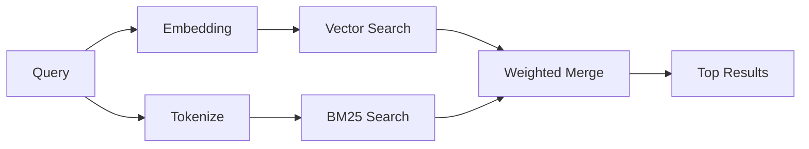

---
read_when:
    - คุณต้องการทำความเข้าใจว่า memory_search ทำงานอย่างไร
    - คุณต้องการเลือกผู้ให้บริการการฝังเวกเตอร์
    - คุณต้องการปรับแต่งคุณภาพการค้นหา
summary: วิธีที่การค้นหาหน่วยความจำพบบันทึกที่เกี่ยวข้องโดยใช้การฝังตัวและการค้นคืนแบบผสมผสาน
title: การค้นหาความจำ
x-i18n:
    generated_at: "2026-04-30T09:46:55Z"
    model: gpt-5.5
    provider: openai
    source_hash: 3e6c44d90f49a797bda01b9a575928c128a334f89ae14fc3620e65562a866aa9
    source_path: concepts/memory-search.md
    workflow: 16
---

`memory_search` จะค้นหาโน้ตที่เกี่ยวข้องจากไฟล์หน่วยความจำของคุณ แม้เมื่อถ้อยคำแตกต่างจากข้อความต้นฉบับ โดยทำงานด้วยการทำดัชนีหน่วยความจำเป็นชิ้นเล็ก ๆ แล้วค้นหาด้วย embeddings, คำสำคัญ หรือทั้งสองอย่าง

## เริ่มต้นอย่างรวดเร็ว

หากคุณกำหนดค่าการสมัครใช้งาน GitHub Copilot, คีย์ API ของ OpenAI, Gemini, Voyage หรือ Mistral ไว้แล้ว การค้นหาหน่วยความจำจะทำงานโดยอัตโนมัติ หากต้องการกำหนดผู้ให้บริการอย่างชัดเจน:

```json5
{
  agents: {
    defaults: {
      memorySearch: {
        provider: "openai", // or "gemini", "local", "ollama", etc.
      },
    },
  },
}
```

สำหรับการตั้งค่าหลาย endpoint, `provider` ยังสามารถเป็นรายการ `models.providers.<id>` แบบกำหนดเองได้ เช่น `ollama-5080` เมื่อผู้ให้บริการนั้นตั้งค่า `api: "ollama"` หรือเจ้าของ embedding adapter อื่น

สำหรับ local embeddings ที่ไม่มีคีย์ API ให้ติดตั้งแพ็กเกจ runtime เสริม `node-llama-cpp` ไว้ข้าง ๆ OpenClaw แล้วใช้ `provider: "local"`

endpoint สำหรับ embedding ที่เข้ากันได้กับ OpenAI บางรายการต้องใช้ป้ายกำกับแบบอสมมาตร เช่น `input_type: "query"` สำหรับการค้นหา และ `input_type: "document"` หรือ `"passage"` สำหรับ chunks ที่ทำดัชนีไว้ กำหนดค่าด้วย `memorySearch.queryInputType` และ `memorySearch.documentInputType`; ดู [ข้อมูลอ้างอิงการกำหนดค่าหน่วยความจำ](/th/reference/memory-config#provider-specific-config)

## ผู้ให้บริการที่รองรับ

| ผู้ให้บริการ | ID | ต้องใช้คีย์ API | หมายเหตุ |
| -------------- | ---------------- | ------------- | ---------------------------------------------------- |
| Bedrock        | `bedrock`        | ไม่            | ตรวจพบอัตโนมัติเมื่อ AWS credential chain resolve สำเร็จ |
| Gemini         | `gemini`         | ใช่           | รองรับการทำดัชนีรูปภาพ/เสียง                        |
| GitHub Copilot | `github-copilot` | ไม่            | ตรวจพบอัตโนมัติ ใช้การสมัครใช้งาน Copilot             |
| Local          | `local`          | ไม่            | โมเดล GGUF, ดาวน์โหลดประมาณ 0.6 GB                         |
| Mistral        | `mistral`        | ใช่           | ตรวจพบอัตโนมัติ                                        |
| Ollama         | `ollama`         | ไม่            | แบบ local ต้องตั้งค่าอย่างชัดเจน                           |
| OpenAI         | `openai`         | ใช่           | ตรวจพบอัตโนมัติ รวดเร็ว                                  |
| Voyage         | `voyage`         | ใช่           | ตรวจพบอัตโนมัติ                                        |

## วิธีการทำงานของการค้นหา

OpenClaw รันเส้นทาง retrieval สองเส้นทางพร้อมกันและรวมผลลัพธ์เข้าด้วยกัน:



- **การค้นหาแบบเวกเตอร์** ค้นหาโน้ตที่มีความหมายคล้ายกัน ("gateway host" ตรงกับ
  "เครื่องที่รัน OpenClaw")
- **การค้นหาคำสำคัญแบบ BM25** ค้นหาการตรงกันแบบตรงตัว (ID, สตริงข้อผิดพลาด, คีย์ config)

หากมีเพียงเส้นทางเดียวที่พร้อมใช้งาน (ไม่มี embeddings หรือไม่มี FTS) อีกเส้นทางหนึ่งจะทำงานตามลำพัง

เมื่อ embeddings ไม่พร้อมใช้งาน OpenClaw ยังคงใช้การจัดอันดับแบบ lexical เหนือผลลัพธ์ FTS แทนที่จะ fallback ไปใช้เฉพาะการเรียงลำดับแบบตรงกันแบบดิบเท่านั้น โหมดที่ลดระดับนี้จะเพิ่มน้ำหนัก chunks ที่ครอบคลุมคำค้นหาได้ดีกว่าและมี path ของไฟล์ที่เกี่ยวข้อง ซึ่งช่วยให้ recall ยังมีประโยชน์แม้ไม่มี `sqlite-vec` หรือผู้ให้บริการ embedding

## การปรับปรุงคุณภาพการค้นหา

ฟีเจอร์เสริมสองอย่างช่วยได้เมื่อคุณมีประวัติโน้ตจำนวนมาก:

### Temporal decay

โน้ตเก่าจะค่อย ๆ สูญเสียน้ำหนักในการจัดอันดับ เพื่อให้ข้อมูลล่าสุดปรากฏก่อน ด้วยค่า half-life เริ่มต้น 30 วัน โน้ตจากเดือนที่แล้วจะได้คะแนนที่ 50% ของน้ำหนักเดิม ไฟล์ที่คงอยู่เสมออย่าง `MEMORY.md` จะไม่ถูก decay

<Tip>
เปิดใช้ temporal decay หาก agent ของคุณมีโน้ตรายวันหลายเดือน และข้อมูลเก่ายังคงมีอันดับสูงกว่าบริบทล่าสุด
</Tip>

### MMR (ความหลากหลาย)

ลดผลลัพธ์ที่ซ้ำซ้อน หากโน้ตห้ารายการกล่าวถึง config เราเตอร์เดียวกันทั้งหมด MMR จะทำให้ผลลัพธ์อันดับต้น ๆ ครอบคลุมหัวข้อต่าง ๆ แทนการทำซ้ำ

<Tip>
เปิดใช้ MMR หาก `memory_search` ยังคงส่งคืน snippets ที่เกือบซ้ำกันจากโน้ตรายวันคนละไฟล์
</Tip>

### เปิดใช้ทั้งสองอย่าง

```json5
{
  agents: {
    defaults: {
      memorySearch: {
        query: {
          hybrid: {
            mmr: { enabled: true },
            temporalDecay: { enabled: true },
          },
        },
      },
    },
  },
}
```

## หน่วยความจำหลายโมดัล

ด้วย Gemini Embedding 2 คุณสามารถทำดัชนีรูปภาพและไฟล์เสียงควบคู่กับ Markdown ได้ คำค้นหายังคงเป็นข้อความ แต่จะจับคู่กับเนื้อหาภาพและเสียง ดู [ข้อมูลอ้างอิงการกำหนดค่าหน่วยความจำ](/th/reference/memory-config) สำหรับการตั้งค่า

## การค้นหาหน่วยความจำของเซสชัน

คุณสามารถเลือกทำดัชนี transcript ของเซสชัน เพื่อให้ `memory_search` เรียกคืนบทสนทนาก่อนหน้าได้ ฟีเจอร์นี้เป็นแบบ opt-in ผ่าน `memorySearch.experimental.sessionMemory` ดูรายละเอียดได้ใน [ข้อมูลอ้างอิงการกำหนดค่า](/th/reference/memory-config)

## การแก้ไขปัญหา

**ไม่มีผลลัพธ์หรือไม่** รัน `openclaw memory status` เพื่อตรวจสอบดัชนี หากว่าง ให้รัน `openclaw memory index --force`

**มีเฉพาะการตรงกันของคำสำคัญหรือไม่** ผู้ให้บริการ embedding ของคุณอาจยังไม่ได้กำหนดค่า ตรวจสอบด้วย `openclaw memory status --deep`

**Local embeddings หมดเวลาหรือไม่** `ollama`, `lmstudio` และ `local` ใช้ timeout สำหรับ inline batch ที่นานขึ้นโดยค่าเริ่มต้น หาก host ช้า ให้ตั้งค่า `agents.defaults.memorySearch.sync.embeddingBatchTimeoutSeconds` แล้วรัน `openclaw memory index --force` อีกครั้ง

**ไม่พบข้อความ CJK หรือไม่** สร้างดัชนี FTS ใหม่ด้วย `openclaw memory index --force`

## อ่านเพิ่มเติม

- [Active Memory](/th/concepts/active-memory) -- หน่วยความจำของ sub-agent สำหรับเซสชันแชตแบบโต้ตอบ
- [หน่วยความจำ](/th/concepts/memory) -- โครงสร้างไฟล์, backends, เครื่องมือ
- [ข้อมูลอ้างอิงการกำหนดค่าหน่วยความจำ](/th/reference/memory-config) -- ตัวเลือก config ทั้งหมด

## ที่เกี่ยวข้อง

- [ภาพรวมหน่วยความจำ](/th/concepts/memory)
- [Active Memory](/th/concepts/active-memory)
- [เอนจินหน่วยความจำในตัว](/th/concepts/memory-builtin)
