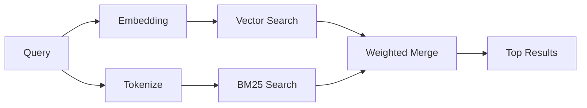

---
read_when:
    - คุณต้องการทำความเข้าใจว่า memory_search ทำงานอย่างไร
    - คุณต้องการเลือกผู้ให้บริการการฝังเวกเตอร์
    - คุณต้องการปรับแต่งคุณภาพการค้นหา
summary: วิธีที่การค้นหาหน่วยความจำพบบันทึกที่เกี่ยวข้องโดยใช้การฝังเวกเตอร์และการดึงคืนแบบไฮบริด
title: การค้นหาหน่วยความจำ
x-i18n:
    generated_at: "2026-04-30T16:27:51Z"
    model: gpt-5.5
    provider: openai
    source_hash: 7f40bbe32453a28070ffc67f19a4c06e2fe59a24237a2aef353f4b9b8260bcf2
    source_path: concepts/memory-search.md
    workflow: 16
---

`memory_search` ค้นหาโน้ตที่เกี่ยวข้องจากไฟล์หน่วยความจำของคุณ แม้ถ้อยคำจะแตกต่างจากข้อความต้นฉบับก็ตาม โดยทำงานด้วยการจัดทำดัชนีหน่วยความจำเป็นชิ้นเล็ก ๆ แล้วค้นหาชิ้นเหล่านั้นด้วย embeddings, คำสำคัญ หรือทั้งสองอย่าง

## เริ่มต้นอย่างรวดเร็ว

หากคุณกำหนดค่าการสมัครสมาชิก GitHub Copilot, คีย์ API ของ OpenAI, Gemini, Voyage หรือ Mistral ไว้แล้ว การค้นหาหน่วยความจำจะทำงานโดยอัตโนมัติ หากต้องการกำหนดผู้ให้บริการอย่างชัดเจน:

```json5
{
  agents: {
    defaults: {
      memorySearch: {
        provider: "openai", // or "gemini", "local", "ollama", etc.
      },
    },
  },
}
```

สำหรับการตั้งค่าหลาย endpoint `provider` ยังสามารถเป็นรายการ `models.providers.<id>` แบบกำหนดเองได้ เช่น `ollama-5080` เมื่อผู้ให้บริการนั้นตั้งค่า `api: "ollama"` หรือเจ้าของ embedding adapter อื่น

สำหรับ embeddings ภายในเครื่องที่ไม่มีคีย์ API ให้ตั้งค่า `provider: "local"` การติดตั้งแบบแพ็กเกจจะเก็บ runtime ดั้งเดิมของ `node-llama-cpp` ไว้ในทรี runtime-deps ของ Plugin ที่ OpenClaw จัดการไว้ ให้รัน `openclaw doctor --fix` หากทรีนั้นต้องซ่อมแซม

endpoint embedding ที่เข้ากันได้กับ OpenAI บางตัวต้องใช้ป้ายกำกับแบบอสมมาตร เช่น `input_type: "query"` สำหรับการค้นหา และ `input_type: "document"` หรือ `"passage"` สำหรับชิ้นข้อมูลที่ทำดัชนี กำหนดค่าสิ่งเหล่านี้ด้วย `memorySearch.queryInputType` และ `memorySearch.documentInputType`; ดู[ข้อมูลอ้างอิงการกำหนดค่าหน่วยความจำ](/th/reference/memory-config#provider-specific-config)

## ผู้ให้บริการที่รองรับ

| ผู้ให้บริการ       | ID               | ต้องใช้คีย์ API | หมายเหตุ                                                |
| -------------- | ---------------- | ------------- | ---------------------------------------------------- |
| Bedrock        | `bedrock`        | ไม่            | ตรวจพบอัตโนมัติเมื่อเชนข้อมูลรับรอง AWS resolve สำเร็จ |
| Gemini         | `gemini`         | ใช่           | รองรับการทำดัชนีรูปภาพ/เสียง                        |
| GitHub Copilot | `github-copilot` | ไม่            | ตรวจพบอัตโนมัติ ใช้การสมัครสมาชิก Copilot             |
| Local          | `local`          | ไม่            | โมเดล GGUF ดาวน์โหลดประมาณ 0.6 GB                         |
| Mistral        | `mistral`        | ใช่           | ตรวจพบอัตโนมัติ                                        |
| Ollama         | `ollama`         | ไม่            | ภายในเครื่อง ต้องตั้งค่าอย่างชัดเจน                           |
| OpenAI         | `openai`         | ใช่           | ตรวจพบอัตโนมัติ รวดเร็ว                                  |
| Voyage         | `voyage`         | ใช่           | ตรวจพบอัตโนมัติ                                        |

## การค้นหาทำงานอย่างไร

OpenClaw เรียกใช้เส้นทาง retrieval สองเส้นทางพร้อมกันและรวมผลลัพธ์เข้าด้วยกัน:



- **การค้นหาแบบเวกเตอร์** ค้นหาโน้ตที่มีความหมายคล้ายกัน ("gateway host" ตรงกับ "เครื่องที่รัน OpenClaw")
- **การค้นหาคำสำคัญ BM25** ค้นหาการตรงกันแบบเป๊ะ (ID, สตริงข้อผิดพลาด, คีย์ config)

หากมีเพียงเส้นทางเดียวที่พร้อมใช้งาน (ไม่มี embeddings หรือไม่มี FTS) อีกเส้นทางจะทำงานเพียงลำพัง

เมื่อ embeddings ไม่พร้อมใช้งาน OpenClaw ยังใช้การจัดอันดับเชิงคำศัพท์บนผลลัพธ์ FTS แทนการถอยกลับไปใช้เฉพาะการเรียงลำดับแบบตรงกันเป๊ะดิบ โหมดที่ลดระดับลงนี้จะเพิ่มน้ำหนักให้ชิ้นข้อมูลที่ครอบคลุมคำใน query ได้ดีกว่าและมีพาธไฟล์ที่เกี่ยวข้อง ซึ่งช่วยให้ recall ยังมีประโยชน์แม้ไม่มี `sqlite-vec` หรือผู้ให้บริการ embedding

## การปรับปรุงคุณภาพการค้นหา

ฟีเจอร์เสริมสองอย่างช่วยได้เมื่อคุณมีประวัติโน้ตจำนวนมาก:

### การลดน้ำหนักตามเวลา

โน้ตเก่าจะค่อย ๆ เสียน้ำหนักในการจัดอันดับ เพื่อให้ข้อมูลล่าสุดปรากฏก่อน ด้วยค่า half-life เริ่มต้น 30 วัน โน้ตจากเดือนที่แล้วจะได้คะแนน 50% ของน้ำหนักเดิม ไฟล์ที่คงคุณค่าเสมออย่าง `MEMORY.md` จะไม่ถูกลดน้ำหนัก

<Tip>
เปิดใช้การลดน้ำหนักตามเวลาหาก agent ของคุณมีโน้ตรายวันสะสมหลายเดือน และข้อมูลเก่ายังคงจัดอันดับเหนือบริบทล่าสุด
</Tip>

### MMR (ความหลากหลาย)

ลดผลลัพธ์ที่ซ้ำซ้อน หากโน้ตห้ารายการล้วนกล่าวถึง config ของเราเตอร์เดียวกัน MMR จะทำให้ผลลัพธ์อันดับต้น ๆ ครอบคลุมหัวข้อต่างกันแทนการซ้ำกัน

<Tip>
เปิดใช้ MMR หาก `memory_search` ยังคงส่งคืน snippet ที่เกือบซ้ำกันจากโน้ตรายวันคนละรายการ
</Tip>

### เปิดใช้ทั้งสองอย่าง

```json5
{
  agents: {
    defaults: {
      memorySearch: {
        query: {
          hybrid: {
            mmr: { enabled: true },
            temporalDecay: { enabled: true },
          },
        },
      },
    },
  },
}
```

## หน่วยความจำแบบหลายโมดัล

ด้วย Gemini Embedding 2 คุณสามารถทำดัชนีรูปภาพและไฟล์เสียงควบคู่ไปกับ Markdown ได้ query การค้นหายังคงเป็นข้อความ แต่จะจับคู่กับเนื้อหาภาพและเสียง ดู[ข้อมูลอ้างอิงการกำหนดค่าหน่วยความจำ](/th/reference/memory-config)สำหรับการตั้งค่า

## การค้นหาหน่วยความจำของเซสชัน

คุณสามารถเลือกทำดัชนี transcript ของเซสชัน เพื่อให้ `memory_search` เรียกคืนบทสนทนาก่อนหน้าได้ ฟีเจอร์นี้ต้องเลือกเปิดใช้ผ่าน `memorySearch.experimental.sessionMemory` ดูรายละเอียดใน[ข้อมูลอ้างอิงการกำหนดค่า](/th/reference/memory-config)

## การแก้ไขปัญหา

**ไม่มีผลลัพธ์ใช่ไหม** รัน `openclaw memory status` เพื่อตรวจสอบดัชนี หากว่าง ให้รัน `openclaw memory index --force`

**มีเฉพาะการตรงกันของคำสำคัญใช่ไหม** ผู้ให้บริการ embedding ของคุณอาจยังไม่ได้กำหนดค่า ตรวจสอบด้วย `openclaw memory status --deep`

**embeddings ภายในเครื่องหมดเวลาใช่ไหม** `ollama`, `lmstudio` และ `local` ใช้ timeout ของ inline batch ที่นานกว่าโดยค่าเริ่มต้น หาก host เพียงแค่ช้า ให้ตั้งค่า `agents.defaults.memorySearch.sync.embeddingBatchTimeoutSeconds` แล้วรัน `openclaw memory index --force` อีกครั้ง

**ไม่พบข้อความ CJK ใช่ไหม** สร้างดัชนี FTS ใหม่ด้วย `openclaw memory index --force`

## อ่านเพิ่มเติม

- [Active Memory](/th/concepts/active-memory) -- หน่วยความจำของ sub-agent สำหรับเซสชันแชทแบบโต้ตอบ
- [หน่วยความจำ](/th/concepts/memory) -- โครงสร้างไฟล์, backend, เครื่องมือ
- [ข้อมูลอ้างอิงการกำหนดค่าหน่วยความจำ](/th/reference/memory-config) -- ปุ่มปรับ config ทั้งหมด

## ที่เกี่ยวข้อง

- [ภาพรวมหน่วยความจำ](/th/concepts/memory)
- [Active memory](/th/concepts/active-memory)
- [เอนจินหน่วยความจำในตัว](/th/concepts/memory-builtin)
