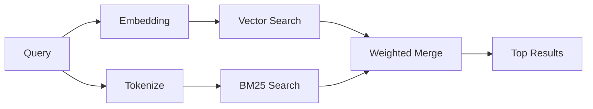

---
read_when:
    - คุณต้องการทำความเข้าใจว่า memory_search ทำงานอย่างไร
    - คุณต้องการเลือกผู้ให้บริการ embedding
    - คุณต้องการปรับแต่งคุณภาพการค้นหา
summary: วิธีที่การค้นหาหน่วยความจำค้นหาโน้ตที่เกี่ยวข้องโดยใช้ embeddings และการดึงข้อมูลแบบไฮบริด
title: การค้นหาหน่วยความจำ
x-i18n:
    generated_at: "2026-06-27T17:27:07Z"
    model: gpt-5.5
    postprocess_version: locale-links-v1
    provider: openai
    source_hash: b0bcb8cf400100ba8b6ddbb46bdf8b2a89a8bc32a550ee6df47c874e7e9e0879
    source_path: concepts/memory-search.md
    workflow: 16
---

`memory_search` ค้นหาโน้ตที่เกี่ยวข้องจากไฟล์หน่วยความจำของคุณ แม้เมื่อ
ถ้อยคำแตกต่างจากข้อความต้นฉบับ โดยทำงานด้วยการทำดัชนีหน่วยความจำเป็นชิ้นส่วนเล็กๆ
แล้วค้นหาด้วย embeddings, คำสำคัญ หรือทั้งสองอย่าง

## เริ่มต้นอย่างรวดเร็ว

การค้นหาหน่วยความจำใช้ OpenAI embeddings เป็นค่าเริ่มต้น หากต้องการใช้
แบ็กเอนด์ embedding อื่น ให้ตั้งค่าผู้ให้บริการอย่างชัดเจน:

```json5
{
  agents: {
    defaults: {
      memorySearch: {
        provider: "openai", // or "gemini", "local", "ollama", "openai-compatible", etc.
      },
    },
  },
}
```

สำหรับการตั้งค่าหลาย endpoint ที่มีผู้ให้บริการเฉพาะสำหรับหน่วยความจำ `provider` ยังสามารถ
เป็นรายการ `models.providers.<id>` แบบกำหนดเองได้ เช่น `ollama-5080` เมื่อ
ผู้ให้บริการนั้นตั้งค่า `api: "ollama"` หรือเจ้าของอะแดปเตอร์ memory embedding อื่น

สำหรับ local embeddings ที่ไม่ต้องใช้ API key ให้ติดตั้ง
`@openclaw/llama-cpp-provider` และตั้งค่า `provider: "local"` ซอร์สเช็กเอาต์
อาจยังต้องอนุมัติ native build: `pnpm approve-builds` จากนั้น
`pnpm rebuild node-llama-cpp`

endpoint embedding ที่เข้ากันได้กับ OpenAI บางรายการต้องใช้ป้ายกำกับแบบอสมมาตร เช่น
`input_type: "query"` สำหรับการค้นหา และ `input_type: "document"` หรือ `"passage"`
สำหรับชิ้นส่วนที่ทำดัชนี กำหนดค่าสิ่งเหล่านี้ด้วย `memorySearch.queryInputType` และ
`memorySearch.documentInputType`; ดู [ข้อมูลอ้างอิงการกำหนดค่าหน่วยความจำ](/th/reference/memory-config#provider-specific-config)

## ผู้ให้บริการที่รองรับ

| ผู้ให้บริการ | ID                  | ต้องใช้ API key | หมายเหตุ |
| ----------------- | ------------------- | ------------- | ----------------------------- |
| Bedrock           | `bedrock`           | ไม่            | ใช้ AWS credential chain     |
| DeepInfra         | `deepinfra`         | ใช่           | ค่าเริ่มต้น: `BAAI/bge-m3`        |
| Gemini            | `gemini`            | ใช่           | รองรับการทำดัชนีรูปภาพ/เสียง |
| GitHub Copilot    | `github-copilot`    | ไม่            | ใช้การสมัครใช้งาน Copilot     |
| Local             | `local`             | ไม่            | โมเดล GGUF, ดาวน์โหลด ~0.6 GB  |
| Mistral           | `mistral`           | ใช่           |                               |
| Ollama            | `ollama`            | ไม่            | ภายในเครื่อง/โฮสต์เอง             |
| OpenAI            | `openai`            | ใช่           | ค่าเริ่มต้น                       |
| OpenAI-compatible | `openai-compatible` | โดยทั่วไป       | `/v1/embeddings` ทั่วไป      |
| Voyage            | `voyage`            | ใช่           |                               |

## การค้นหาทำงานอย่างไร

OpenClaw รันเส้นทางการดึงข้อมูลสองเส้นทางพร้อมกันและผสานผลลัพธ์:



- **การค้นหาแบบเวกเตอร์** ค้นหาโน้ตที่มีความหมายคล้ายกัน ("โฮสต์ gateway" ตรงกับ
  "เครื่องที่รัน OpenClaw")
- **การค้นหาคำสำคัญ BM25** ค้นหารายการที่ตรงกันแบบเป๊ะ (ID, สตริงข้อผิดพลาด, คีย์ config)

หากมีเพียงเส้นทางเดียว เส้นทางนั้นจะทำงานเพียงลำพัง โหมด FTS-only โดยตั้งใจ
(`provider: "none"`) และการเลือกผู้ให้บริการแบบอัตโนมัติ/ค่าเริ่มต้นยังสามารถใช้
การจัดอันดับเชิงคำศัพท์เมื่อ embeddings ไม่พร้อมใช้งาน

ผู้ให้บริการ embedding แบบไม่ใช่ local ที่ระบุชัดเจนจะแตกต่างออกไป หากคุณตั้งค่า
`memorySearch.provider` เป็นผู้ให้บริการเฉพาะที่มีแบ็กเอนด์ระยะไกล และผู้ให้บริการนั้น
ไม่พร้อมใช้งานตอน runtime `memory_search` จะรายงานว่าหน่วยความจำไม่พร้อมใช้งานแทน
การใช้ผลลัพธ์ FTS-only แบบเงียบๆ วิธีนี้ทำให้ผู้ให้บริการเชิงความหมายที่กำหนดค่าไว้เสีย
ยังมองเห็นได้ ตั้งค่า `provider: "none"` สำหรับการเรียกคืนแบบ FTS-only โดยเจตนา หรือแก้ไข
การกำหนดค่าผู้ให้บริการ/auth เพื่อกู้คืนการจัดอันดับเชิงความหมาย

## การปรับปรุงคุณภาพการค้นหา

ฟีเจอร์เสริมสองรายการช่วยได้เมื่อคุณมีประวัติโน้ตจำนวนมาก:

### การลดน้ำหนักตามเวลา

โน้ตเก่าจะค่อยๆ สูญเสียน้ำหนักการจัดอันดับ เพื่อให้ข้อมูลล่าสุดแสดงขึ้นก่อน
ด้วย half-life ค่าเริ่มต้น 30 วัน โน้ตจากเดือนที่แล้วจะได้คะแนนที่ 50% ของ
น้ำหนักเดิม ไฟล์ที่ใช้ได้ระยะยาวอย่าง `MEMORY.md` จะไม่ถูกลดน้ำหนัก

<Tip>
เปิดใช้การลดน้ำหนักตามเวลาหาก agent ของคุณมีโน้ตรายวันหลายเดือน และข้อมูลเก่า
ยังคงจัดอันดับเหนือกว่าบริบทล่าสุด
</Tip>

### MMR (ความหลากหลาย)

ลดผลลัพธ์ที่ซ้ำซ้อน หากโน้ตห้ารายการกล่าวถึง config เราเตอร์เดียวกันทั้งหมด MMR
จะทำให้ผลลัพธ์อันดับต้นๆ ครอบคลุมหัวข้อต่างกันแทนการซ้ำกัน

<Tip>
เปิดใช้ MMR หาก `memory_search` ยังคงส่งคืน snippet ที่เกือบซ้ำกันจาก
โน้ตรายวันต่างๆ
</Tip>

### เปิดใช้ทั้งสองอย่าง

```json5
{
  agents: {
    defaults: {
      memorySearch: {
        query: {
          hybrid: {
            mmr: { enabled: true },
            temporalDecay: { enabled: true },
          },
        },
      },
    },
  },
}
```

## หน่วยความจำแบบหลายโมดัล

ด้วย Gemini Embedding 2 คุณสามารถทำดัชนีรูปภาพและไฟล์เสียงควบคู่กับ
Markdown ได้ คำค้นหายังคงเป็นข้อความ แต่จะจับคู่กับเนื้อหาภาพและเสียงได้
ดู [ข้อมูลอ้างอิงการกำหนดค่าหน่วยความจำ](/th/reference/memory-config) สำหรับ
การตั้งค่า

## การค้นหาหน่วยความจำของเซสชัน

คุณสามารถเลือกทำดัชนี transcript ของเซสชันได้ เพื่อให้ `memory_search` เรียกคืน
บทสนทนาก่อนหน้าได้ นี่เป็นการเลือกเปิดใช้ผ่าน
`memorySearch.experimental.sessionMemory` ดู
[ข้อมูลอ้างอิงการกำหนดค่า](/th/reference/memory-config) สำหรับรายละเอียด

## การแก้ไขปัญหา

**ไม่มีผลลัพธ์?** รัน `openclaw memory status` เพื่อตรวจสอบดัชนี หากว่าง ให้รัน
`openclaw memory index --force`

**มีเฉพาะการจับคู่คำสำคัญ?** ผู้ให้บริการ embedding ของคุณอาจยังไม่ได้กำหนดค่า ตรวจสอบ
`openclaw memory status --deep`

**Local embeddings หมดเวลา?** `ollama`, `lmstudio` และ `local` ใช้ timeout สำหรับ
inline batch ที่นานกว่าเป็นค่าเริ่มต้น หากโฮสต์แค่ทำงานช้า ให้ตั้งค่า
`agents.defaults.memorySearch.sync.embeddingBatchTimeoutSeconds` แล้วรันซ้ำ
`openclaw memory index --force`

**ไม่พบข้อความ CJK?** สร้างดัชนี FTS ใหม่ด้วย
`openclaw memory index --force`

## อ่านเพิ่มเติม

- [Active Memory](/th/concepts/active-memory) -- หน่วยความจำของ sub-agent สำหรับเซสชันแชตแบบโต้ตอบ
- [หน่วยความจำ](/th/concepts/memory) -- เลย์เอาต์ไฟล์, แบ็กเอนด์, เครื่องมือ
- [ข้อมูลอ้างอิงการกำหนดค่าหน่วยความจำ](/th/reference/memory-config) -- ปุ่มปรับ config ทั้งหมด

## ที่เกี่ยวข้อง

- [ภาพรวมหน่วยความจำ](/th/concepts/memory)
- [Active Memory](/th/concepts/active-memory)
- [เอนจินหน่วยความจำในตัว](/th/concepts/memory-builtin)
